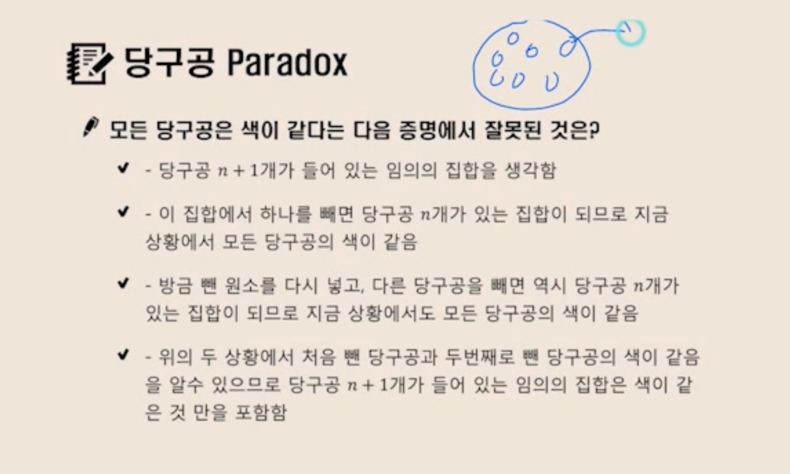
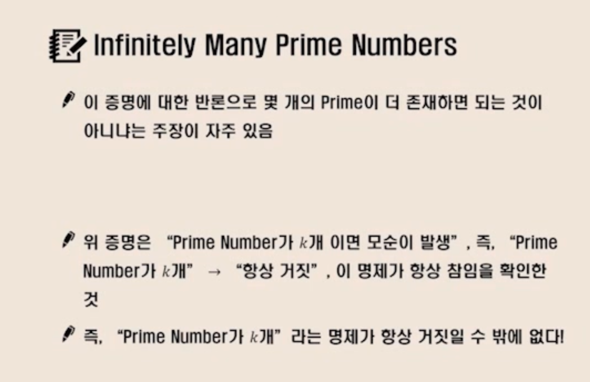

# 논리와 증명

* 직관은 논리적인 느낌을 주는것

  * 정확하지는 않다, 하지만 익숙한 상황에서 빠르다는것

* 과자와 버스

  * 과자 몇개 먹었니? VS 버스타려 하는데 천원 있니?

  * 하나는 정확한 갯수, 다른하나는 천원 이상 있는지 물어보는것

* 토플과 복권

  * 토플과 토익 둘중 하나 VS 복권에 당첨되면 자동차 혹은 천만원 줍니다.

    * 하나는 Inclusive OR, 다른하나는 Exclusive OR

* 프로그래밍은 하드로직을 사용해

## 논리연습

* 참 거짓 고르기

* 만역 0이 홀수라면 미국에서 2080년 월드컵이 열린다. YES/NO

* False -> True 참

* ?????이 prime Number면 2는 짝수이다

  * 프라임 넘버인지 무관하다, 뒤쪽이 참이기에 전체가 참이다

* p -> q 가 거짓은 경우는 p가 참이고 q가 거짓일때만이다. 그래서 p가 참이고 q가 거짓임

  * p or q => True

  * ^p -> q == 참

  * q -> p 앞부분이 거짓이면 무조건 참

* 역,이, 대우

  * 역 q -> p

  * 이 ^p -> ^q

  * 대우 ^q -> ^p

* p -> q와 p <-> q증명하는것이 혼란스럽다

* 당구공 paradox

  * P(1) -> P(n+1)이 참이면 p(n)은 모든 자연수에 대해서 참이다

* 

  * 사람들이 p(n)이 참인지 모른다고 하지만, 중요하지 않다

  * p(n) -> p(n+1)에서 p(n)이 거짓이면 항상 참이기 때문이다

  * 하지만 하나씩 공을뺼때 두 공이 같다는걸 알 수 가 없음

### Infinite Many Prime Number 설명 더럽게 못하네

* 

* 수학적 귀납법이란
