# Java Introduction

* 자바는 분산처리에 유리하다

  * Tcp/IP 네트워크 기능 예장

  * Http/Ftp등과 같은 프로토콜 쉽게 사용 가능

* 자바는 인터프리터에 의해 실행됨

  * java -> javac (컴파일)-> .class (중간언어) -> interpreting (기계어) -> 실행

  * 자바는 견고하다

    * 포인터 사용 X, 가비지 컬렉터 사용, 데이터 타입 검수

  * 자바는 안전하다

    * 분산데이터에도 사용되기에 안전함

    * 

  * 자바는 플랫폼 독립적이다

    

  * 높은 성능 제공

    * 가비지 컬렉터가 메모리 과용 방지

  * 멀티 뜨레드 제공

    * 스레드 : 독자적으로 수행하는 하나의 프로그램

    * 멀트 뜨레드: 한번에 여러개의 뜨레드가 동시에 수행됨

    * 하나의 CPU가 여러개의 프로그램을 동시에 수행하도록함 -> 수행속도를 빠르게함

  * 자바는 동적이다

    * 변화되는 환경에 잘 적응됨

    * 프로그램 사이에 사용되는 라이브러리를 실행시간에 수행함 -> 변화를 곧바로 적용할 수 있음

> 자바 플렛폼 종류

* JDK

  * SE (Standard Edition)

    * 가장 기본이 되는 에디션 대부분의 패키기자 포함

  * EE (Enterprise Edition)

    * gusdjqdptj tkdydehlsms API

  * ME (Micro edition)

    * 모바일 기기에 사용되는 API 포함된 에디션

> 자바 플렛폼 구조

* 자바 프로그램 -> 자바 VM -> 다양한 하드웨어 플랫폼

  * 자바 VM

    * 다른 OS들에서 프로그램이 돌아 갈 수 있도록 해야해

    * 대신 OS에 맞는 자바를 설치 해줘야 한다

* 자바 API

  * 프로그래머들이 필요로 하는 기본적 클래스들을 거대한 라이브러리로 미리 만들어 제공한다

  * 이런것들을 표준 클래스라함

  

> 자바 개발환경

* 자바 디벨로퍼 킷 제공

  * SRE: Java Runtime Environment, 환경설정해줌, 이것만으로 프로그램을 컴파일 할 수 없다.

  * JDK: 개발과 실행에 필요한 모든 기능들이 들어가 있음

* 이클립스

  * 실시간 문법 체크

  * 디버깅 기능

  * 소스 자동생성

  * 사용이 용이한 인터페이스 구성

  * 워크 스페이스: 모든 프로젝트를 이 디렉토리 안에 둠

> 자바소스파일

* public: 자바 예약어로서 FirstClass.java 파일의 클래스를 외부에 공개함

* 주석문: // and /******/ (java doc type) and /******/

* compile: javac AppName.java 클래스 파일 생성

* run:  java AppName

> 입출력

* java.io

> 식별자

* 첫글자 대문자/ 특수문자 사용불가(!,@,#,%,&,*) /숫자사용 가능 하지만 첫문자 불가/ 예약어 포함가능, 하지만 예약어만 사용 불가

* 상수는 대문자

> 예약어

* 예약어는 보통 소문자다!

* const, goto, sizeof 예약어는 더는 사용안함

> 자바 데이터 타입

* boolean: 1 bit lowercase true or false

* char: 2 bytes

  * use '\u0000' ~ '\uffff'

* Integer

  * byte: 1 byte

    * 범위: -2^7 ~ 2^7 -1

  * short: 2 byte

    * 범위: -2^15 ~ 2^15 -1

  * int: 4 byte

    * 범위: -2^31 ~ 2^31 -1 (-2147483647~2147483647)

    * 023 -> 8진법 / 0xBAAC -> 16진법

  * long: 8 bytes. put l or L end of numbers

    * 범위: -2^63 ~ 2^63 -1

> 실수

* float: 4 byte

* double: 8 bytes

  * 1.718F - float 형의 실수

  * 6.02E23 - 큰실수

> 형변환

* 작은 데이터에서 큰 데이터 - promotion 묵시적

  * 4byte의 int에서 8byte의 double형으로 가능

  * ex) int age= 26
  
  * double avgAge = age(형변환)

  

* 큰데이터에서 작은 데이터로 - demotion 명시적

  * 데이터 축소후에도 값을 온전히 가질 수 있어야해

  * ex) int sum = 128;

  * byte data = (byte) sum; // b에 -128할당

  

## 연산자 및 배열

> 산술 연산자 (+ - % *)

* ++count : 사용되기 전에 증기

* count++ : 사용되고 증가

* 값1 instanceof 값2: 값1이 값2 데이터 타입의 객체인 경우 true

* A & B: A,B를 둘다 계산함

* A && B: A가 true일 경우만 오른쪽을 처리함

* A || B: 둘다 true여야지 true리턴, 하지만 하지만 A가 false면 B를 수행하지 않고 false리턴

* A | B:  둘중 하나만 true라고 하면 true 리턴

> 비트연산자

^ : XOR

> 조건 삼항 연산자

* passYn = score > 80 ? true: false

> 자바의 배열

* String[][] scoreList = new String[3][4] - 스트링 3*4배열

* String[][] scoreList = new String[3][] - 스트링 3*? 배열 각 각 로우가 다른 길이를 가짐

* String args[] - 프로그램 실행시 필요한 정보를 프로그램에 전달함

  * java CommandLineArgTest arg1 arg2

## 객체지향

* 메서드 오버로딩

  * 한 클래스 안에 같은 이름의 메서드를 여러개 정의

* 오버라이딍

  * 상속 관계에 있는 하위 클래스가 상위 클래스가 가지고 있는 메서드 재정의

* 추상화

  * 구체적인 사실들을 일반화 시켜 기술

  * 현실세계에 존재하는 다양한 객체를 정리함

* 캡슐화

  * 변수와 메서드를 하나의 추상화된 클래스로 묶는 과정

  * 변수와 메서드를 하나로 묶어 독립적으로 동작하지 않도록함

  * 캡슐화된 변수나 메서드를 선택적으로 공개하거나 숨길 수 있음

* 메세지

  * 객체간 서로 통신하는 방법

### 클래스 modifier

* final 자식 클래스를 가질 수 없는 클래스 의미

* abstract: 객체 생성이 불가능한 추상 클래스

> UML 클래스 다이어 그램

* 클래스와 클래스간의 관계를 그림으로 표현

> 접근 제한자

* Static

  * 변수와 메서드 앞에 붙임

  > Static variable

  * static이 없으면 인스턴스 변수

    * 생성된 인스턴스 마다 그 안에 클래스의 인스턴스 변수들이 포함됨

    * 일반적 멤버 변수를 인스턴스 변수라함

  * static 변수는 클래스 변수

    * 생성된 인스턴스에 포함되지 않는 변수

    * 많은 인스턴스를 생성해도 하나의 변수만 존재

  > Static Method

* static method == class method

  > Final Vairable

* 할당된 값을 변경불가한 상수

> static final

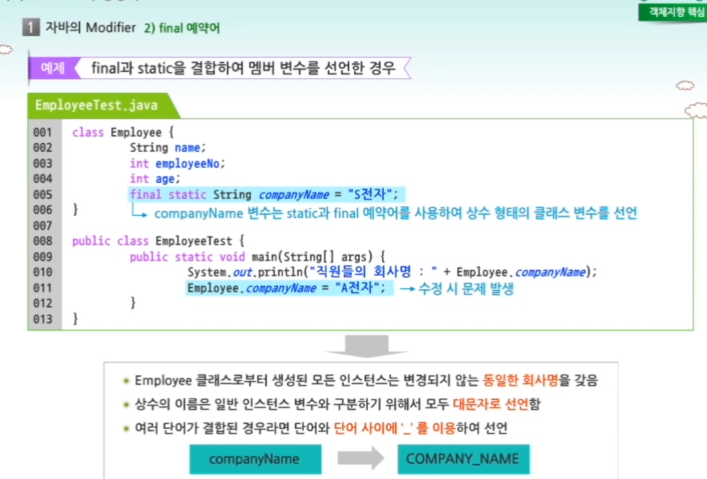

* 부모 클래스의 메서드에 final을 붙이면, 자식클래스는 메서드 재정의 못함

> 클래스와 final

* 클래스 앞에 final을 붙이면 상속 금지함, 자식 클래스가 상속받으려 하면 에러

> 추상 메서드

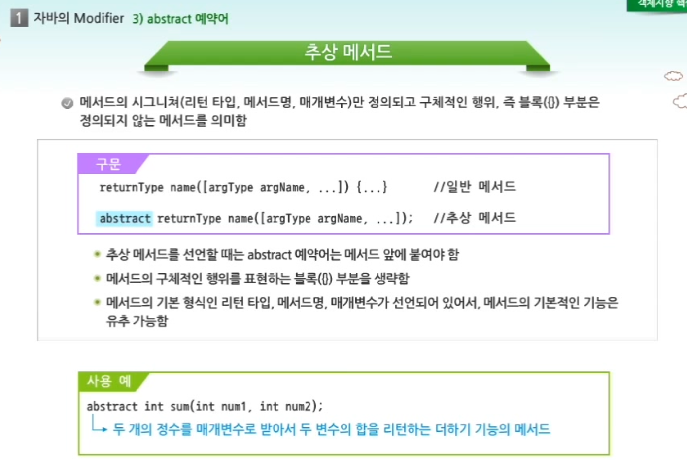

#### Overloading과 매개변수

* Overloading

  * 파라메터가 다르면 메서드를 여러개 만들수 있다.

* 오버로딩인 경우

  * 매개변수의 갯수와 타입이 모두 다른경우

  * 리턴타입은 중요하지않다 리턴타입이 달라도 오버로딩이 아니다 -> Error

  * 매개변수의 이름이 달라도 상관없어 오버로딩이 아님  하지만-> Error

  * 매개변수의 순서가 다른경우 overloading으로 쳐줌

  * 매개변수가 형변환인 경우

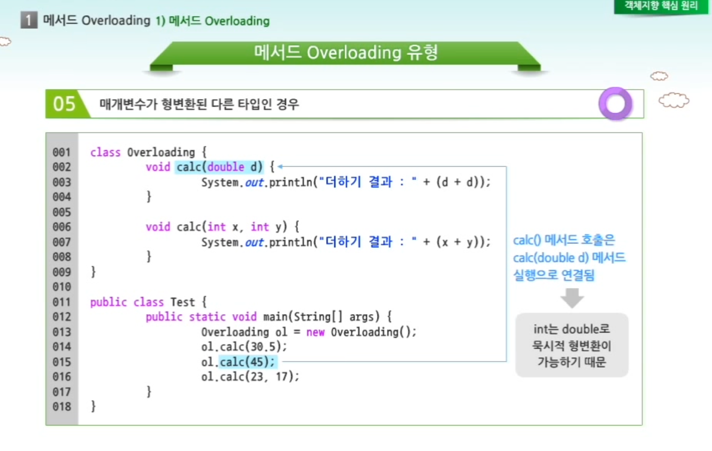

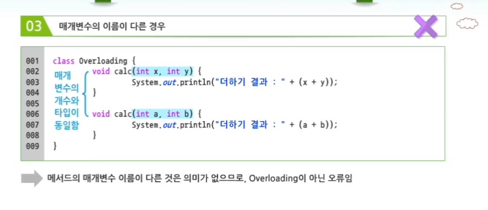

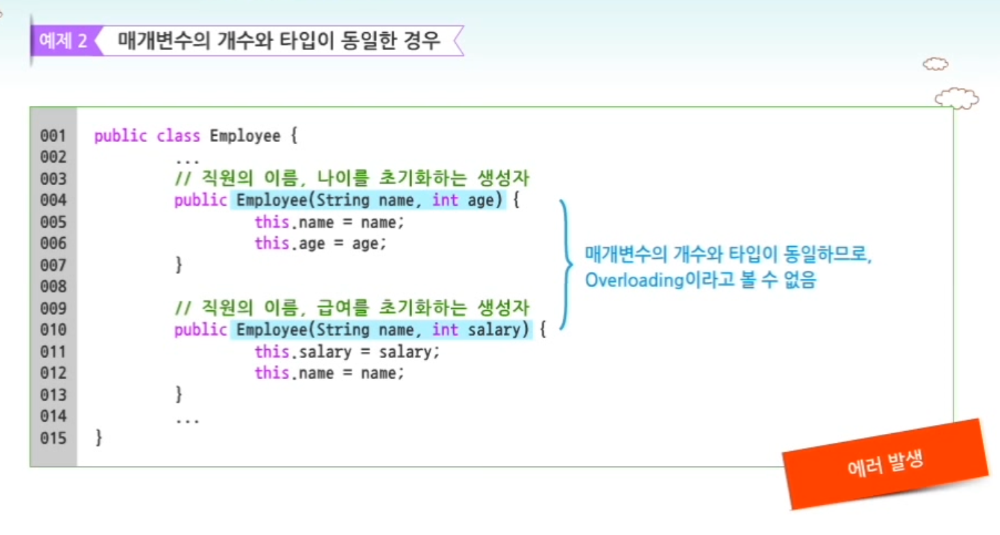

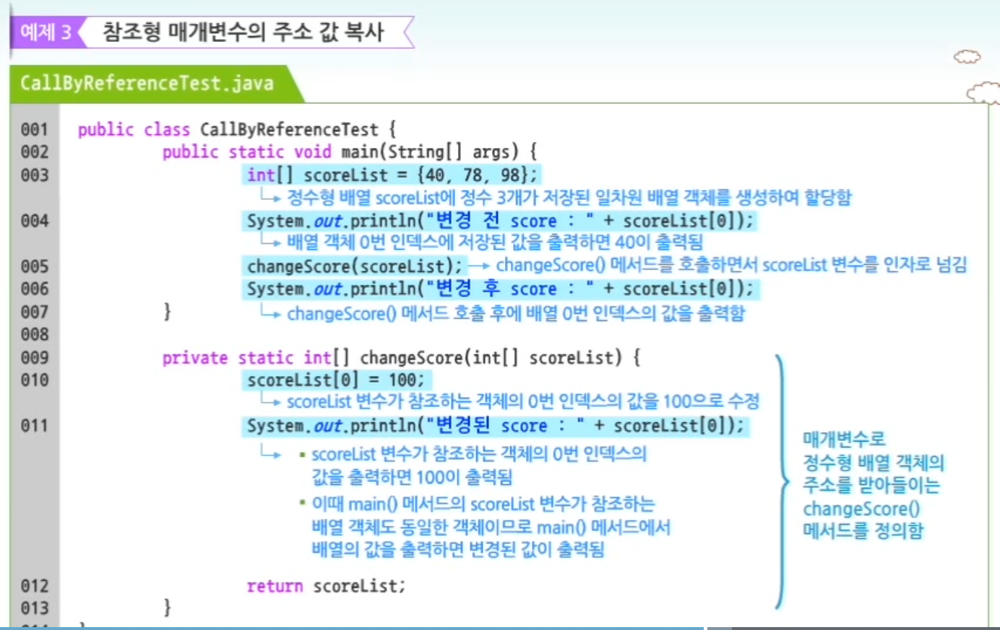

> 가변적 파라메터

* ex) int...

* 파라미터 마지막에만 사용가능, 그리고 가변 파라메터는 하나만 사용가능

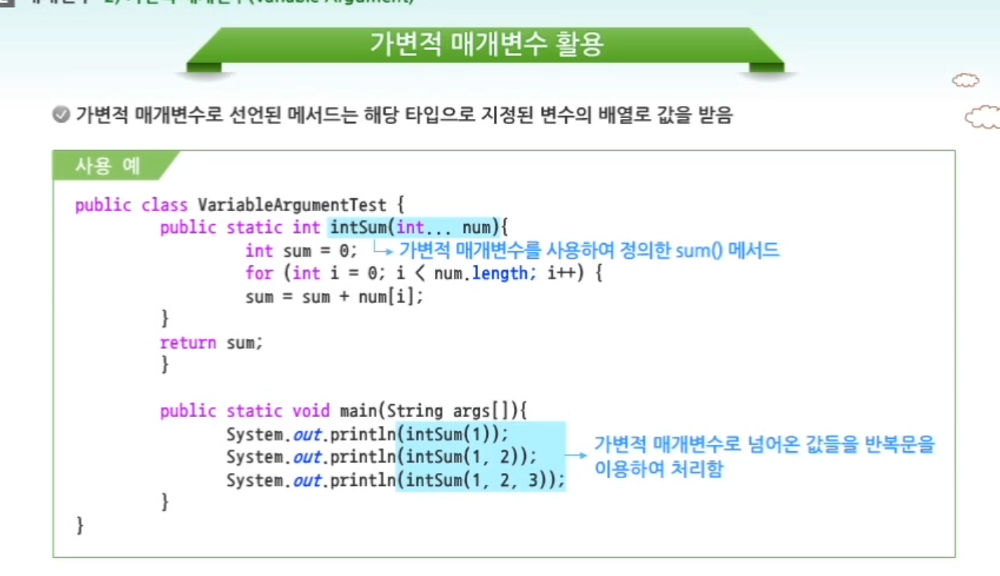

#### 상속

* 문법적으로 단일상속만을 허용함

* 부모 클래스는 subclass가 호출될떄 자동으로 호출된다, 부모 클래서 내에 기본 생성자가 꼭 있어야한다

* 부모클래스가 자식보다 먼저 수행 되어야 하기에, 자식클래스 생성자에서 부모 super을 가장 먼저 호출해야해

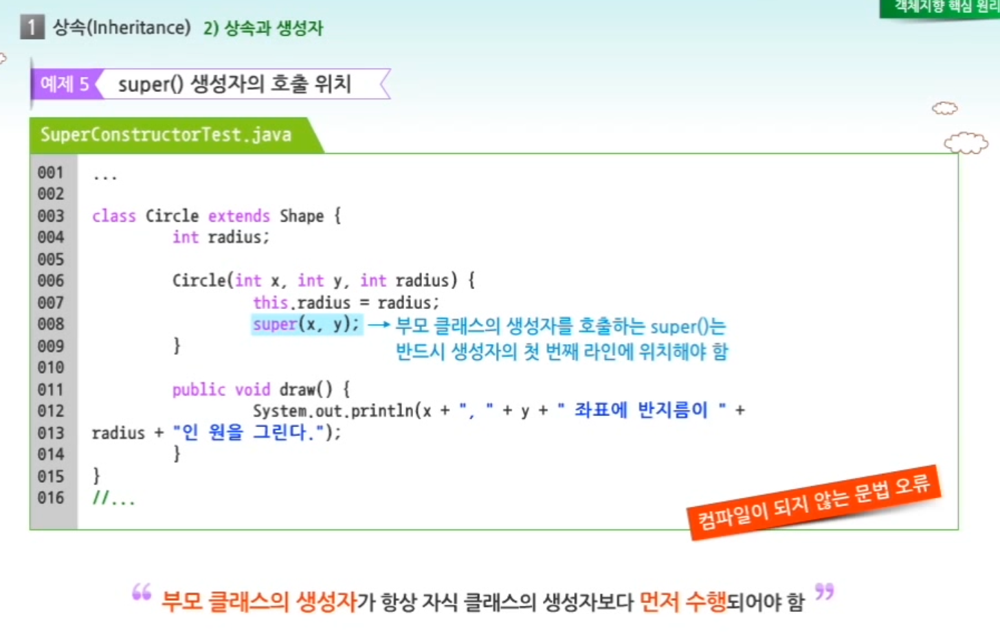

> Private 변수

* private는 상속되지 않는다

* 부모클래스와 같은 이름의 변수를 자식클래스가 가지고 있으면 상속하지 않는다

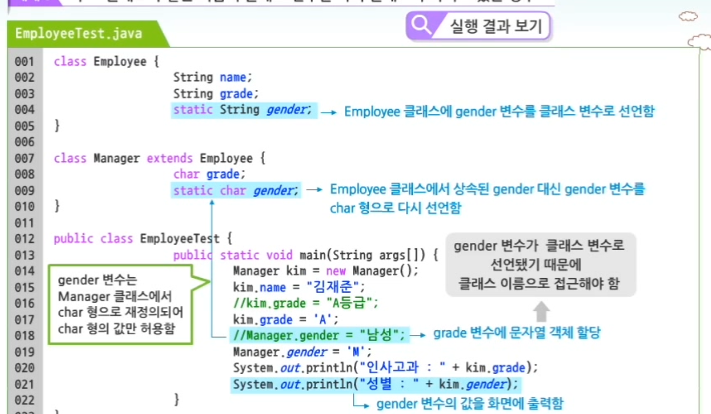

* 자식 클래스는 부모 클래스가 가지고 있는 메서드를 호출 할 수 있다

> Method Overiding

* 부모의 매서드를 재사용 하지 않고, 새롭게 정으함

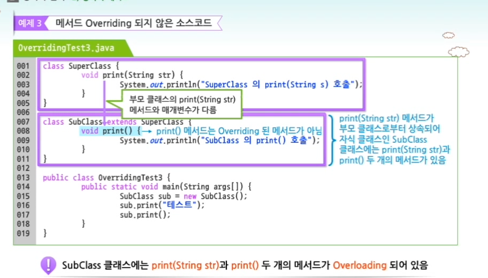

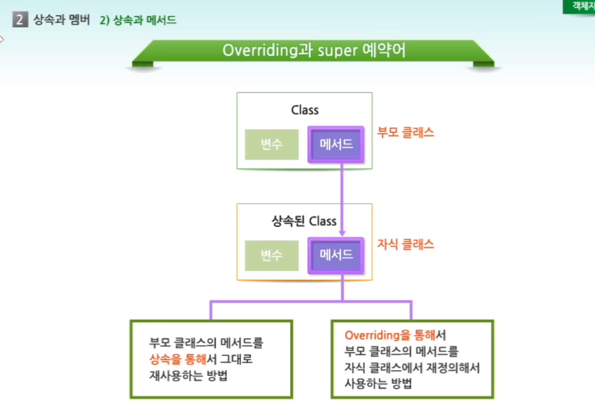

> Overloading과 final예약어

* final 번수: 상수를 의미

* final 클래스: 자식 클래스를 가질 수 없는 클래스

* final 매서드: Overriding을 금지함

### 추생클래스와 객체의 형변환

* 추상클래스를 상속한 자식클래스를 객체화해 사용함

* abstract class AbstractClass{}

  * public void methodA() {}

* 추상클래스는 객체 생성이 불가능함

  * 추상 클래스는 추상메서드를 가지고 있는데, 아무 기능도 없는 메서드를 호출하는것은 넌센스하다.

* 추상클래스를 지원하는 이유는?

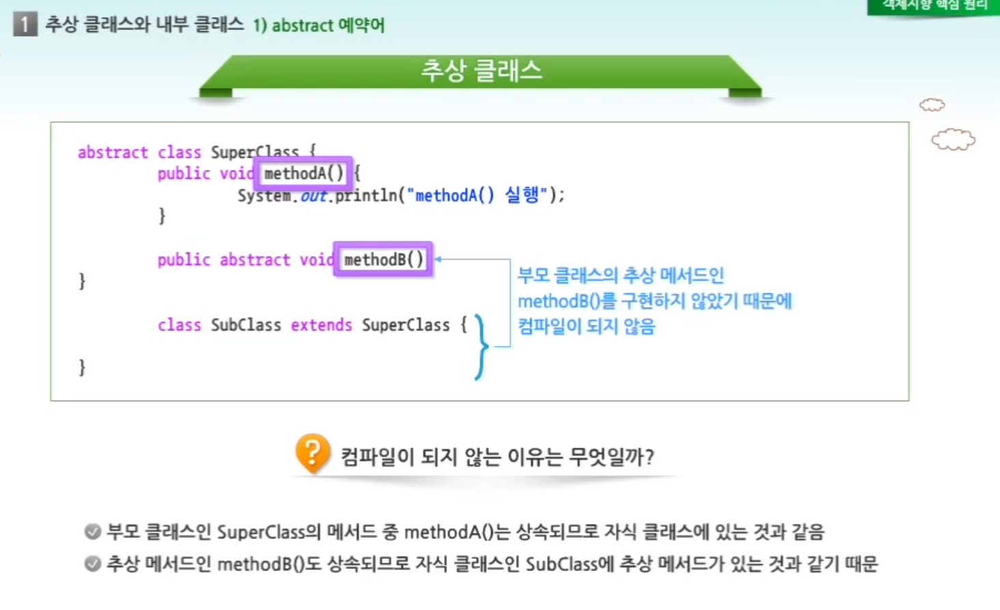

* 부모클래스의 추상 메서드를 overriden 해야해

> Inner Class

* 멤버 클래스

  * 멤버 변수와 동일한 위치에 선언됨

  * static예약어가 붙은 static멤버와 instance멤버로 나뉨

  * 다른 클래스에서도 활용 될 수 있음

* 지역 클래스

  * 메서드 내에 클래스가 정의도어 있는 경우

  * 메서드 내에서만 유효하다

* 내부 클래스 예제 좀만 더 공부하기

  * 이름을 가지고 있지 않음

  * new예약어 뒤에 명시된 클래스가 기존의 클래스인경우 자동적으로 이 클래스의 자식 클래스가됨

> 형변환

* 묵시적 형변환

* 명시적 형 변환

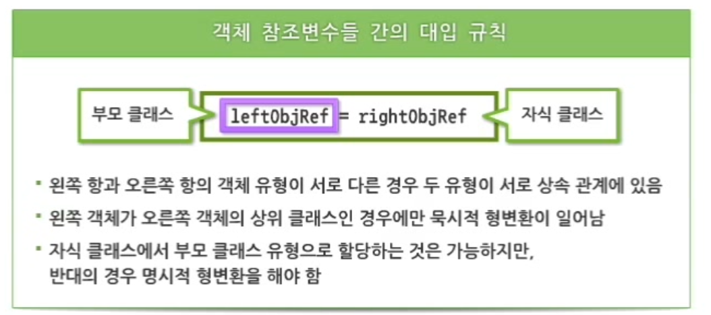

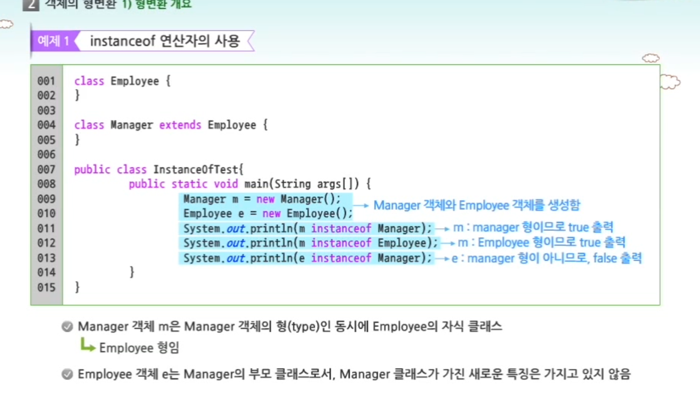

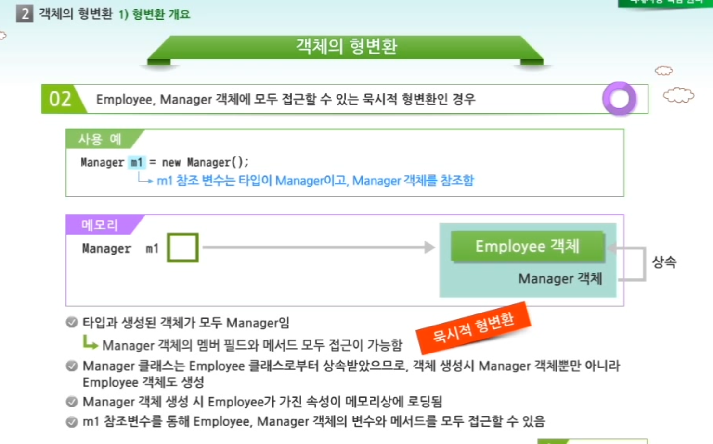

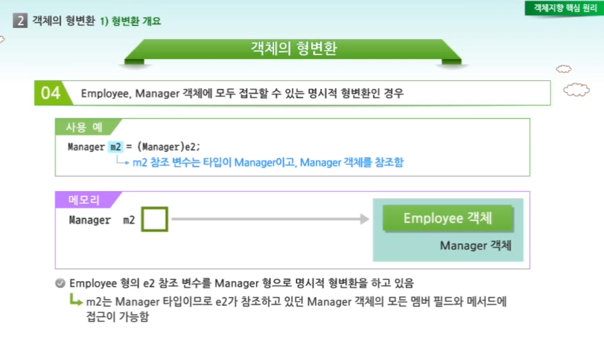

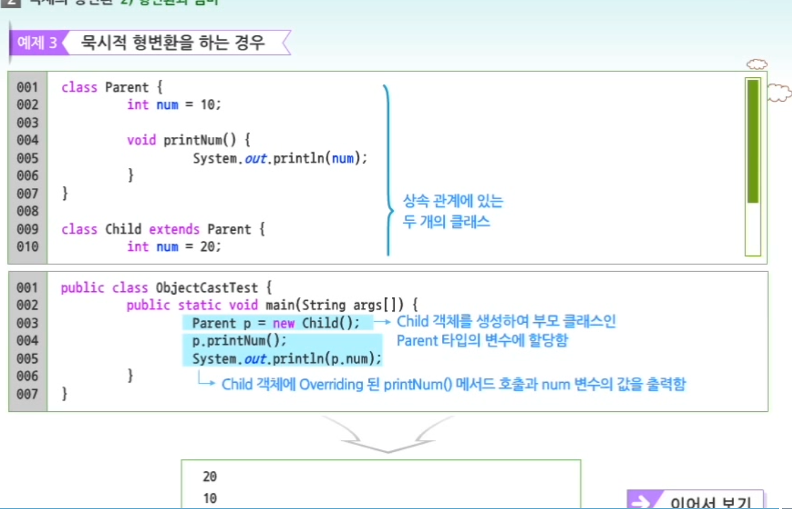

* 변수에 대한 조건은 객체의 유형에 따라 결정됨

* 메서드 호출은 할당되는 인스턴스에 의해 결정됨

### 인터페이스

* 추상메서드와 상수로 이뤄짐

  * final을 이용해 멤버변수 선언

  * 인터페이스 이름으로 직접 해당 상수를 사용하기 위해서는 반드시 static 예약어를 final 예약어와 함께 사용함

    * EX) public static final int PLAIN = 1;

  * 자식클래스를 생성해, 자식 클래스를 객체로 생성해 프로그램에 사용한다

> 자바 패키지

* 관련 클래스 인터페이스를 하나의 폴더에 적절하게 배치하는것

* 장점: 다른기능을 구현한 같은이름의 클래스를 사용할때 이름충돌을 피할 수 있음

* Java lang 패키지는 import를 사용하지 않음

* 피키지의 클래스까지 사용하는경우 이름까지 지정함

* 패키지의 여러가지를 빼쓰면, 패키지만 임포트

  * 임포트할때 패키지이름.클래스 이름까지 함

* 커스텀 라이브러리

  * API에서 제공하지 않는 기능은, 개발자가 직접 필요한 피키지를 만들어 사용할 수 있다

  * 만드는 과정

> 예외처리

* 에러

  * 프로그램으로 처리할 수 없기 때문에 에러 발생시 프로그램이 중단됨

  * 중단후 다음 문장들을 프린트 하지 않는다

* 예외

  * 프로그램중 발 생 할 수 있는 가벼운 사건

  * 프로그래머가 충분히 예측할 수 있는 사건

  * 프로그램적으로 얼마든지 처리할 수 있는 오류

> 예외가 발생하는 경우

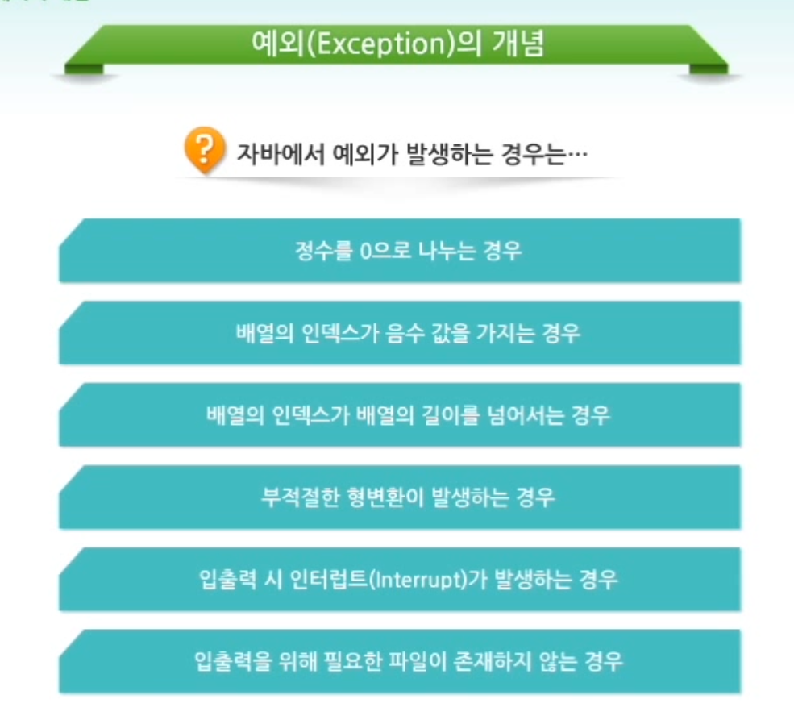

* 예외 클래스들

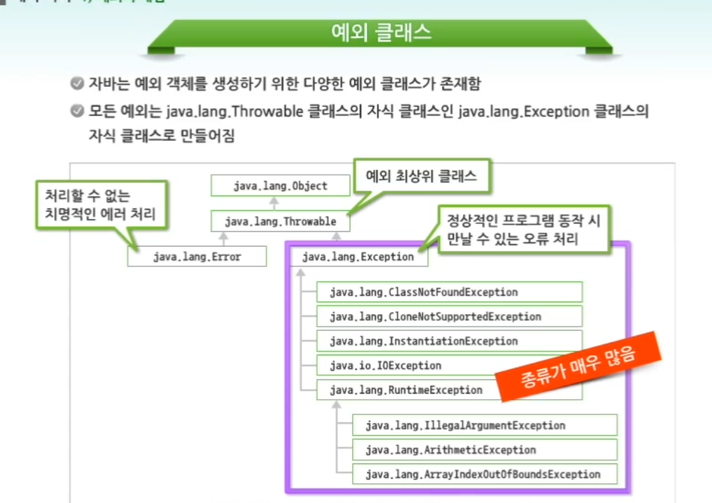

* Runtime Exception

  * 실행시 발생하는 예외이므로, 프로그램이 예외를 다루는 소스코드를 포함하지 않아도 컴파일러가 컴파일 해줌

  * Runtime Exception외의 클래스들은 예외 처리 해주지 않는다면 컴파일 안됨

* IllegalArugument : wrong parameter

* IO exception: 입출력시 지정한 파일이 없음

* IndexOutofBound: 인덱스 범위를 초과하거나, 비어져있는 어레이를 접근시

* numberFormationException

> 예외 처리 방식

* 예외가 발생한 메소드에서 예외처리 하기

  > 다중 캐치방식

  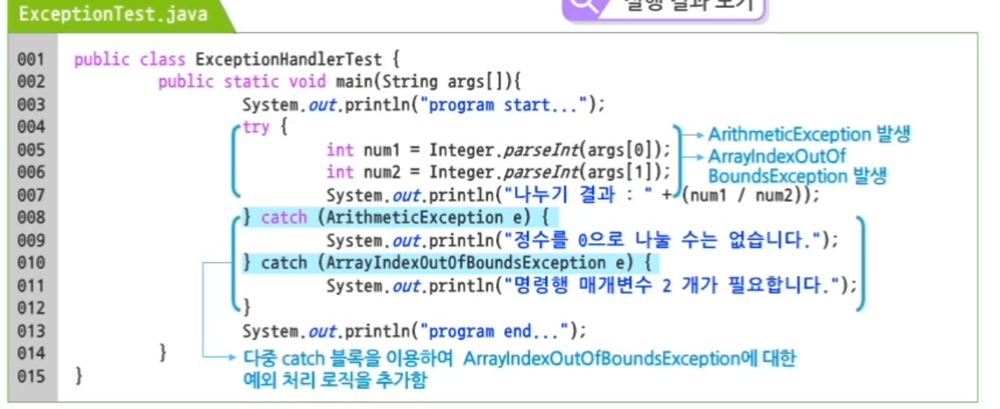

  * 캐치 블럭에 Exception을 먼저 넣으면 안됨, 그럼 어떤게 문제인지 모르게됨

  * Exception은 가장 마지막에 존재 해야한다

  > finally 블록

  * optionally used

  * 예외가 발생했을때 반드시 실행 되어야 하는 로직이 있을경우에 사용한다

  * 예외 발생 유무에 상관없이 무조건 계산됨

* 메소드를 호출한곳으로 넘기는 경우
