# Java Introduction

* 자바는 분산처리에 유리하다

  * Tcp/IP 네트워크 기능 예장

  * Http/Ftp등과 같은 프로토콜 쉽게 사용 가능

* 자바는 인터프리터에 의해 실행됨

  * java -> javac (컴파일)-> .class (중간언어) -> interpreting (기계어) -> 실행

  * 자바는 견고하다

    * 포인터 사용 X, 가비지 컬렉터 사용, 데이터 타입 검수
  
  * 자바는 안전하다

    * 분산데이터에도 사용되기에 안전함

    * 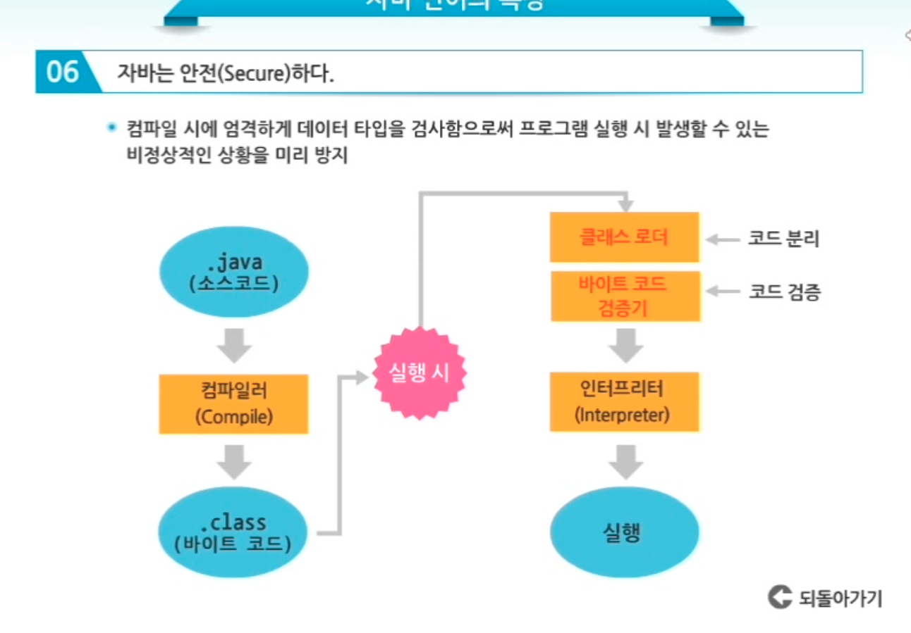
  
  * 자바는 플랫폼 독립적이다

    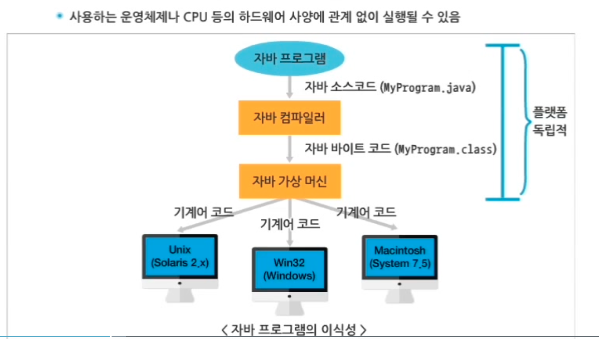

  * 높은 성능 제공

    * 가비지 컬렉터가 메모리 과용 방지

  * 멀티 뜨레드 제공

    * 스레드 : 독자적으로 수행하는 하나의 프로그램

    * 멀트 뜨레드: 한번에 여러개의 뜨레드가 동시에 수행됨

    * 하나의 CPU가 여러개의 프로그램을 동시에 수행하도록함 -> 수행속도를 빠르게함

  * 자바는 동적이다

    * 변화되는 환경에 잘 적응됨

    * 프로그램 사이에 사용되는 라이브러리를 실행시간에 수행함 -> 변화를 곧바로 적용할 수 있음

> 자바 플렛폼 종류

* JDK

  * SE (Standard Edition)

    * 가장 기본이 되는 에디션 대부분의 패키기자 포함

  * EE (Enterprise Edition)

    * gusdjqdptj tkdydehlsms API

  * ME (Micro edition)

    * 모바일 기기에 사용되는 API 포함된 에디션

> 자바 플렛폼 구조

* 자바 프로그램 -> 자바 VM -> 다양한 하드웨어 플랫폼

  * 자바 VM

    * 다른 OS들에서 프로그램이 돌아 갈 수 있도록 해야해

    * 대신 OS에 맞는 자바를 설치 해줘야 한다

* 자바 API

  * 프로그래머들이 필요로 하는 기본적 클래스들을 거대한 라이브러리로 미리 만들어 제공한다

  * 이런것들을 표준 클래스라함

  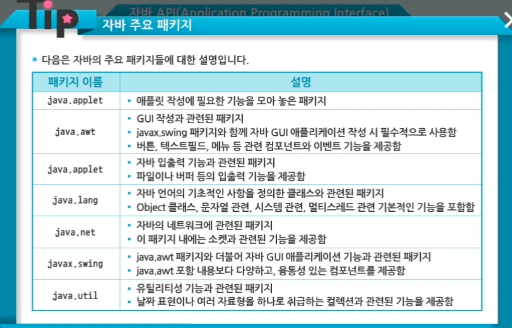

> 자바 개발환경

* 자바 디벨로퍼 킷 제공

  * SRE: Java Runtime Environment, 환경설정해줌, 이것만으로 프로그램을 컴파일 할 수 없다.

  * JDK: 개발과 실행에 필요한 모든 기능들이 들어가 있음

* 이클립스

  * 실시간 문법 체크

  * 디버깅 기능

  * 소스 자동생성

  * 사용이 용이한 인터페이스 구성

  * 워크 스페이스: 모든 프로젝트를 이 디렉토리 안에 둠

> 자바소스파일

* public: 자바 예약어로서 FirstClass.java 파일의 클래스를 외부에 공개함

* 주석문: // and /******/ (java doc type) and /******/

* compile: javac AppName.java 클래스 파일 생성

* run:  java AppName

> 입출력

* java.io

> 식별자

* 첫글자 대문자/ 특수문자 사용불가(!,@,#,%,&,*) /숫자사용 가능 하지만 첫문자 불가/ 예약어 포함가능, 하지만 예약어만 사용 불가

* 상수는 대문자

> 예약어

* 예약어는 보통 소문자다!

* const, goto, sizeof 예약어는 더는 사용안함

> 자바 데이터 타입

* boolean: 1 bit lowercase true or false

* char: 2 bytes

  * use '\u0000' ~ '\uffff'

* Integer

  * byte: 1 byte

    * 범위: -2^7 ~ 2^7 -1

  * short: 2 byte

    * 범위: -2^15 ~ 2^15 -1

  * int: 4 byte

    * 범위: -2^31 ~ 2^31 -1 (-2147483647~2147483647)

    * 023 -> 8진법 / 0xBAAC -> 16진법

  * long: 8 bytes. put l or L end of numbers

    * 범위: -2^63 ~ 2^63 -1

> 실수

* float: 4 byte

* double: 8 bytes

  * 1.718F - float 형의 실수

  * 6.02E23 - 큰실수

> 형변환

* 작은 데이터에서 큰 데이터 - promotion 묵시적

  * 4byte의 int에서 8byte의 double형으로 가능

  * ex) int age= 26
  
  * double avgAge = age(형변환)

  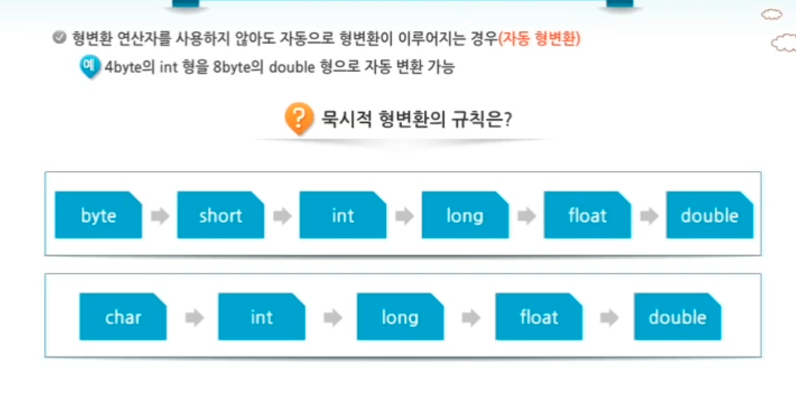

* 큰데이터에서 작은 데이터로 - demotion 명시적

  * 데이터 축소후에도 값을 온전히 가질 수 있어야해

  * ex) int sum = 128;

  * byte data = (byte) sum; // b에 -128할당

  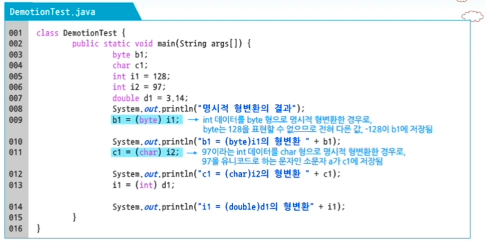

## 연산자 및 배열

> 산술 연산자 (+ - % *)

* ++count : 사용되기 전에 증기

* count++ : 사용되고 증가

* 값1 instanceof 값2: 값1이 값2 데이터 타입의 객체인 경우 true

* A & B: A,B를 둘다 계산함

* A && B: A가 true일 경우만 오른쪽을 처리함

* A || B: 둘다 true여야지 true리턴, 하지만 하지만 A가 false면 B를 수행하지 않고 false리턴

* A | B:  둘중 하나만 true라고 하면 true 리턴

> 비트연산자

^ : XOR

> 조건 삼항 연산자

* passYn = score > 80 ? true: false

> 자바의 배열

* String[][] scoreList = new String[3][4] - 스트링 3*4배열

* String[][] scoreList = new String[3][] - 스트링 3*? 배열 각 각 로우가 다른 길이를 가짐

* String args[] - 프로그램 실행시 필요한 정보를 프로그램에 전달함

  * java CommandLineArgTest arg1 arg2

## 객체지향

* 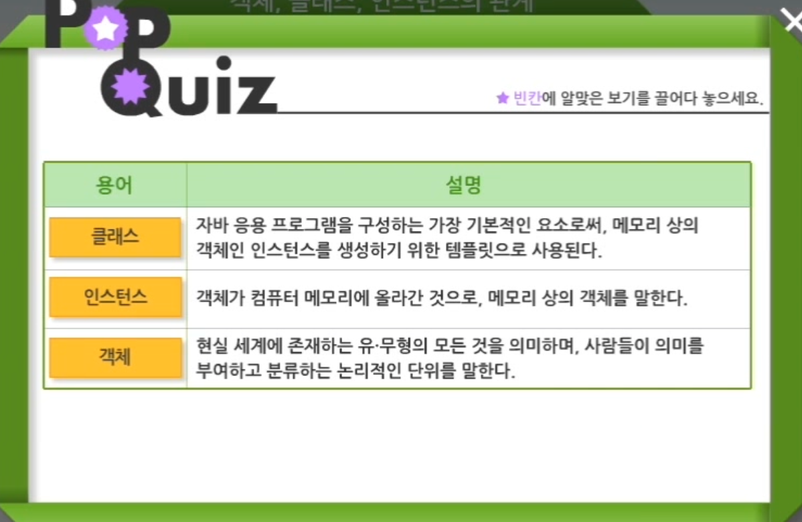

* 메서드 오버로딩

  * 한 클래스 안에 같은 이름의 메서드를 여러개 정의

* 오버라이딍

  * 상속 관계에 있는 하위 클래스가 상위 클래스가 가지고 있는 메서드 재정의

* 추상화

  * 구체적인 사실들을 일반화 시켜 기술

  * 현실세계에 존재하는 다양한 객체를 정리함

* 캡슐화

  * 변수와 메서드를 하나의 추상화된 클래스로 묶는 과정

  * 변수와 메서드를 하나로 묶어 독립적으로 동작하지 않도록함

  * 캡슐화된 변수나 메서드를 선택적으로 공개하거나 숨길 수 있음

* 메세지

  * 객체간 서로 통신하는 방법

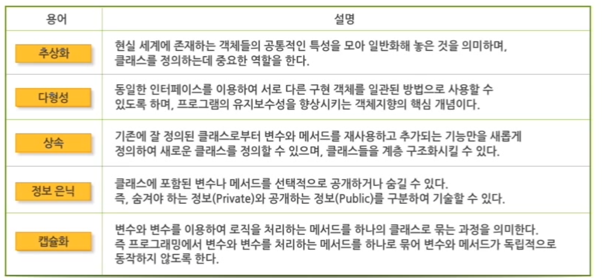

### 클래스 modifier

* final 자식 클래스를 가질 수 없는 클래스 의미

* abstract: 객체 생성이 불가능한 추상 클래스

> UML 클래스 다이어 그램

* 클래스와 클래스간의 관계를 그림으로 표현

> 접근 제한자

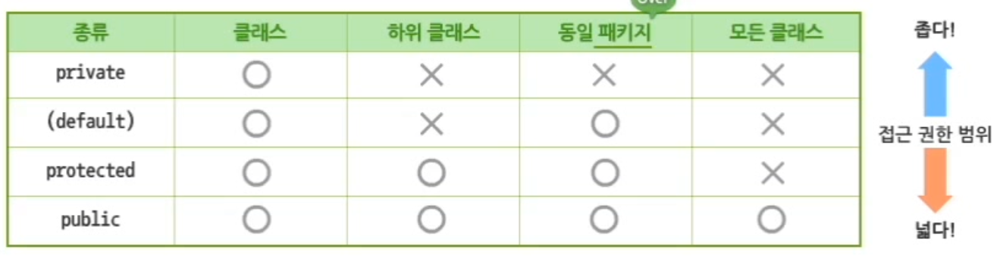

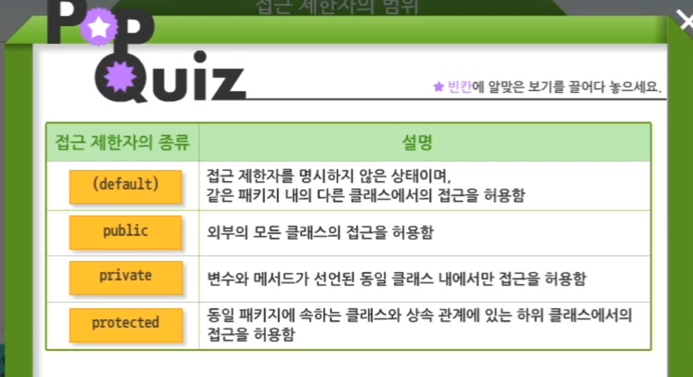

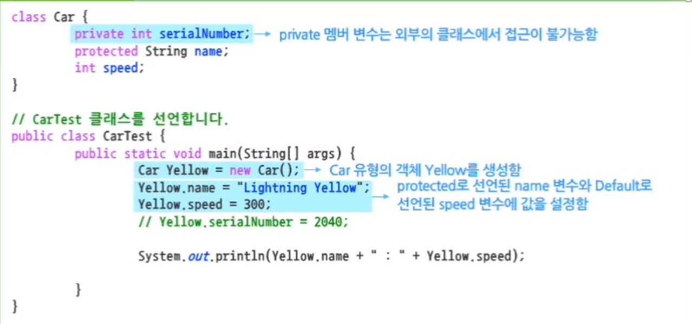

* Static

  * 변수와 메서드 앞에 붙임

  > Static variable

  * static이 없으면 인스턴스 변수

    * 생성된 인스턴스 마다 그 안에 클래스의 인스턴스 변수들이 포함됨

    * 일반적 멤버 변수를 인스턴스 변수라함

  * static 변수는 클래스 변수

    * 생성된 인스턴스에 포함되지 않는 변수

    * 많은 인스턴스를 생성해도 하나의 변수만 존재

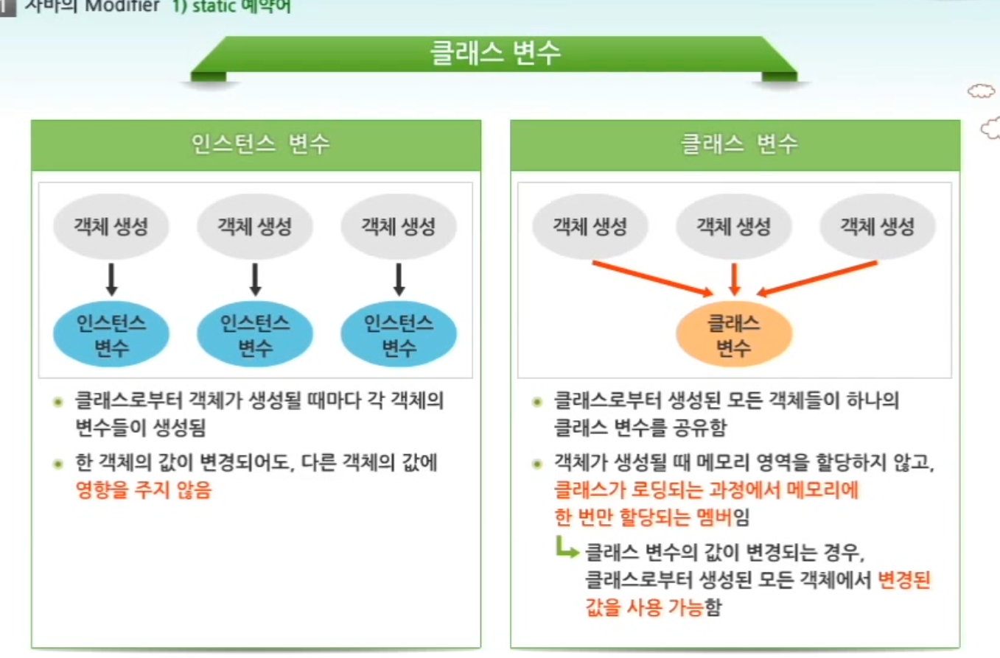

  > Static Method

* static method == class method

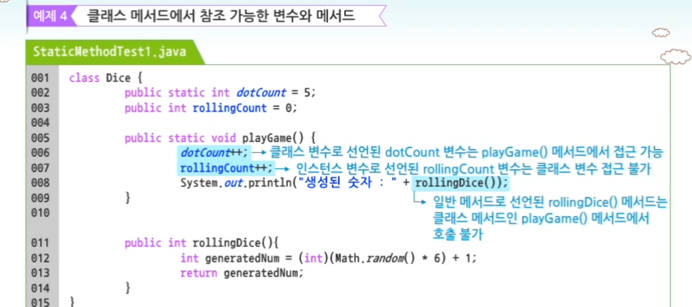

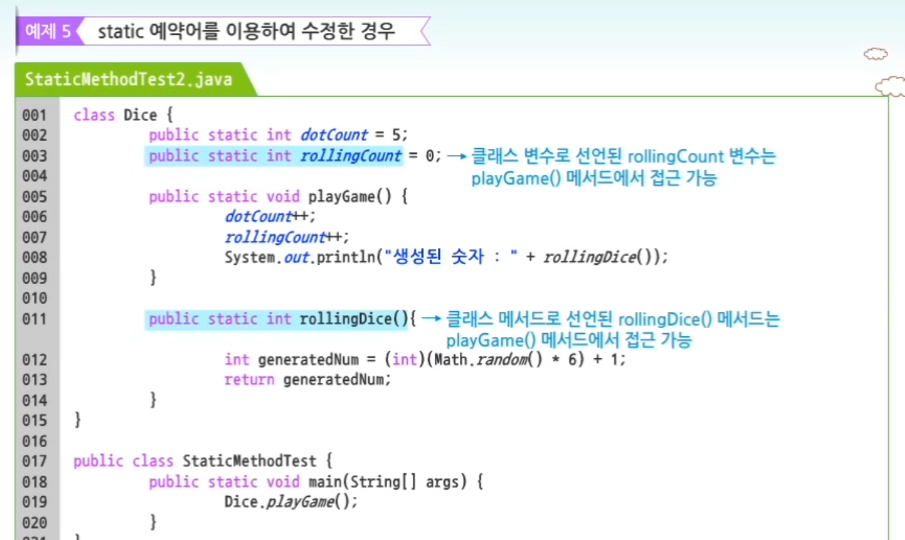

  > Final Vairable

* 할당된 값을 변경불가한 상수

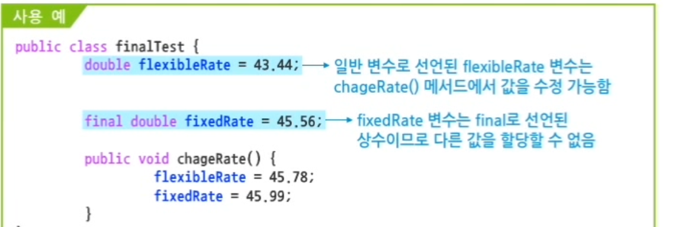
