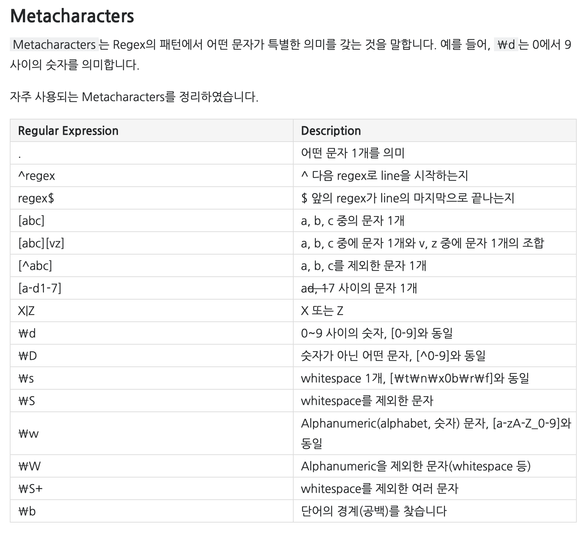

# Method

## PowerSet

* 부분수열의 모든 경우를 고려한다

* 조합(Combination)과 매우 흡사하다.

  * 하지만 파워셋은 base case에서 다른 조건없이( 특정 원소 갯수에서 끝나는게 아니라 ) 그저 배열을 한바퀴 순회 한다면 끝내고 출력해주는것이다.




부분 집합
집합의 개수가 n개 라고 할 때 부분집합의 시간복잡도는 O(2^n)

```java

class PowerSet {
    public static int[] arr;

    public static void powerSet(int depth, int[] visit){
        if(depth == arr.length){
            System.out.println(Arrays.toString(arr[i]));
            return;
        }
        visit[depth] = 1;
        powerSet(depth + 1 ; visit);
        visit[depth] = 0;
        powerSet(depth + 1 ; visit);

    }

    public static void main(String[] args){
        arr= new int[]{1,2,3,4,5};
        powerSet(0 , new int[arr.length]);
    }
 }


```




## Combination




조합 :
시간 복잡도 -> O(2^n)
nCr= n! / (n−r)! * r!

```java

 // 재귀 사용
        // 사용 예시 : comb(arr, visited, 0, n, r)
        static void comb(int[] arr, boolean[] visited, int depth, int n, int r) {
            if (r == 0) {
                print(arr, visited, n);
                return;
            }
            if (depth == n) {
                return;
            }

            visited[depth] = true; // visit에 표시해서 선택한다
            comb(arr, visited, depth + 1, n, r - 1); // depth가 하나씩 더해지면서 인덱스를 높인다
                                                // r로 선택하고 선택 안하고를 결정
            visited[depth] = false;
            comb(arr, visited, depth + 1, n, r);
        }

public class Combination {
    public static void main(String[] args) {
        int n = 4;
        int[] arr = {1, 2, 3, 4};
        boolean[] visited = new boolean[n];

        for (int i = 1; i <= n; i++) {
            System.out.println("\n" + n + " 개 중에서 " + i + " 개 뽑기");
            comb(arr, visited, 0, n, i);
        }

    }

    // 배열 출력
    static void print(int[] arr, boolean[] visited, int n) {
        for (int i = 0; i < n; i++) {
            if (visited[i]) {
                System.out.print(arr[i] + " ");
            }
        }
        System.out.println();
    }
}

```







```java

public class Permutation {
    public static void func(int[] arr, int[] used, int depth) {
        if (depth == arr.length) {
            for (int n : arr) {
                System.out.print(n + " ");
            }
            System.out.println();
            return;
        }
        for (int i = 0; i < arr.length; i++) {
            if (used[i] == 0) {
                used[i] = 1;
                arr[depth] = i + 1;
                func(arr, used, depth + 1);
                arr[depth] = 0;
                used[i] = 0;
            }
        }
    }

    public static void main(String[] args) {
        Scanner sc = new Scanner(System.in);
        int num = sc.nextInt();
        int[] arr = new int[num];
        int[] used = new int[num];
        func(arr, used, 0);
    }

}

```




## Permutation




순열 방법 :
시간 복잡도 -> O(n!)
nPn -> n!
개수 -> 11! = 4000만
11!까지는 가능 12!은 4.8억 -> 5초
nPr= n! / (n−r)!

```java

public class Permutation {
    public static void func(int[] arr, int[] used, int depth) {
        if (depth == arr.length) {
            for (int n : arr) {
                System.out.print(n + " ");
            }
            System.out.println();
            return;
        }
        for (int i = 0; i < arr.length; i++) {
            if (used[i] == 0) {
                used[i] = 1;
                arr[depth] = i + 1;
                func(arr, used, depth + 1);
                arr[depth] = 0;
                used[i] = 0;
            }
        }
    }

    public static void main(String[] args) {
        Scanner sc = new Scanner(System.in);
        int num = sc.nextInt();
        int[] arr = new int[num];
        int[] used = new int[num];
        func(arr, used, 0);
    }

}

```




## Printout

> BufferedReader

* Import

  * java.io.BufferedReader

  * java.io.InputStreamReader

* Used with InputStreamReader

  * BufferedReader br new BufferedReader( new InputStreamReader);

* br.read() : It is used for reading a single character.

* br.readLine() : It is used for reading a line of text.

* Exception:

  * throws IOException




```jave

import java.io.BufferedReader;
import java.io.IOException;
import java.io.InputStreamReader;

public class BufferedReaderWithProf {

      public static void main(String[] args) throws IOException {

          BufferedReader br = new BufferedReader(new InputStreamReader(System.in));

          int N = Integer.parseInt(br.readLine()); // 버퍼는 한번 읽을떄 한줄씩 읽어 버린다

          for (int i = 0; i < N; i++) {
                        grid[i] = br.readLine().replace(" ", "").toCharArray();
                        // 한줄을 읽은 다음 replace로 변경함 그리고 char array에 한글짜씩 넣음
                        System.out.println(Arrays.toString(grid[i]));
                    }

      }
}

```




## Sort

* Integer.compare()




* In this example you can compare two value (age and name in this case)

```java

import java.util.Arrays;
import java.util.Scanner;

public class Main {
  public static void main(String[] args) {
    Scanner sc = new Scanner(System.in);
    int N = sc.nextInt();
    String[][] arr = new String[N][2];

    for (int i = 0; i < N; i++) {
    arr[i][0] = sc.next();
    arr[i][1] = sc.next();
    }

    Arrays.sort(arr, (s1, s2) -> {
    return Integer.compare(Integer.parseInt(s1[0]), Integer.parseInt(s2[0]));
    });

    Arrays.stream(arr).forEach((a) -> System.out.println(a[0] + " " + a[1]));
  }
}

```




```txt
3
21 Junkyu
21 Dohyun
20 Sunyoung

```







```java

 Arrays.sort(student, new Comparator<int[]>() {
                @Override
                public int compare(final int[] entry1, final int[] entry2) {

                    // To sort in descending order revert
                    // the '>' Operator
                    if (entry1[0] < entry2[0]) {
                        return 1;
                    } else {
                        return -1;
                    }
                }

            });
```




## get Length of Arrays



> Get input
> object of length

* String

  * String.length()

```java

String.length()

```




## Type Conversion

> From String to int

* Integer.parseInt(String)

* subtract number from the string

  * "A"- 64 ==> printout 1

* Convert from lower case to upper case




```jave
String name = "Kyle";

name = name..toUpperCase();

System.out.println(name)
// KYLE

```




## String

* toLowerCase()

  * Switch all of the Uppercase alphabets into lowercase.

* replaceAll()

  * switch all of the String element in the first parameter

  * EX)

    * temp.replaceAll("[^-_.a-z0-9]","");

      * ^ means Find one character NOT between the brackets

      * therefore, the statement will replace all of characters not consisted of the char in the bracket

  * n{x}

    * Matches any string that contains a sequence of X n's

  * Ex>

    * temp = temp.replaceAll("[.]{2,}",".");

    * The statement will replace the characters that seconse of dot.

* ^[] and []$

  * ^["x"] means that the string starts with the char, 'x'

  * ["x"]$ means that the string ends with the char, 'x'

  * temp = temp.replaceAll("^[.]|[.]$","");



{& tabs &}
{& tab title = 'Regex.java' &}

```java

String temp = "...!@BaT#*..y.abcdefghijklm";
temp = temp.replaceAll("[^-_.a-z0-9]",""); //"^String" ^다음의 문자들을 제외한것을 제거한다
// printout: "...bat..y.abcdefghijklm"

// ^가 대괄호 밖에있다면 라인의 첫번째를 말한다
// $는 라인의 끝


```

{& endtab &}
{& endtabs &}

* String.substring(start , end);

  * 해당 인덱스에 포함된 문자열들을 리턴한다
