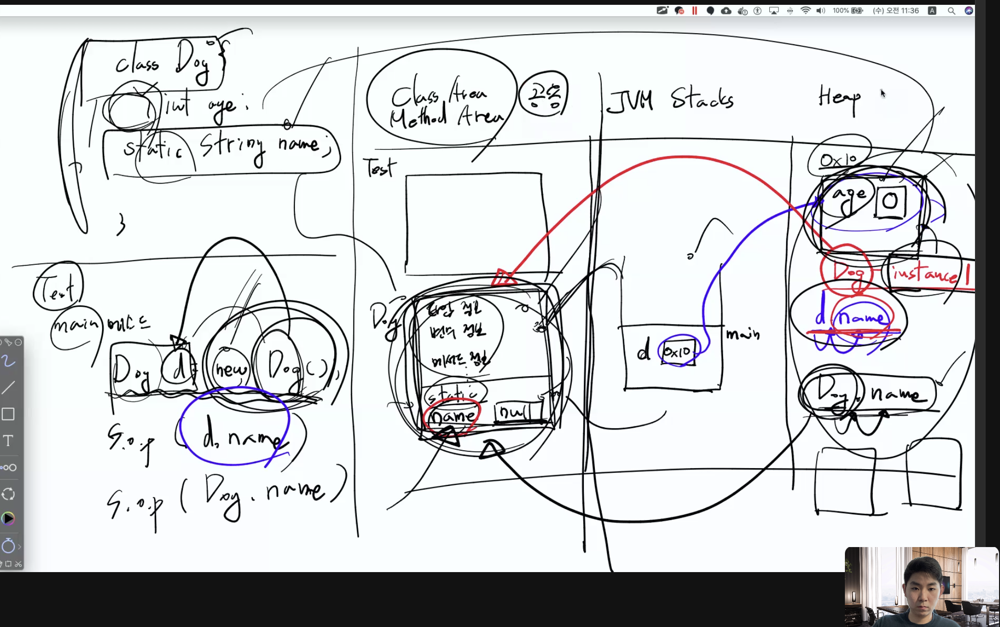

# startcamp java 1

* Dog d = new Dog()

* print(d.name) and print(Dog.name) both work but d.name goes to heap then redirected to class and method area.

  * 하지만 Dog.name은 바로 클래스 에리아로 보내서 효율적이다

> 변수들

* 로컬변수(지역)

  * 블록단위 사용범위 지정

  * 쓰기전에 수동으로 값을 정해줘야해

* 멤버변수(전역), 인스턴스 변수

  * 값의 초기화가 자동으로 이뤄짐

  * static이 붙은 변수: 클래스 변수 , (MethodArea에 저장돰)

    * static변수들은 객체를 지정 하지 않고도 서로 접근 가능하다.

    * static에서 인스턴스 접근하기 위해서는 객체 이름을 대면 된다

    * 같은 클래스에 있을때는 일반 메소드들에서 static변수들을 부를 수 있다

      * 스테틱 메소드들은 스테틱 영역에서 변수를찾아

  * static 붙지 않은 변수: instance variable (힙에 저장됨)

