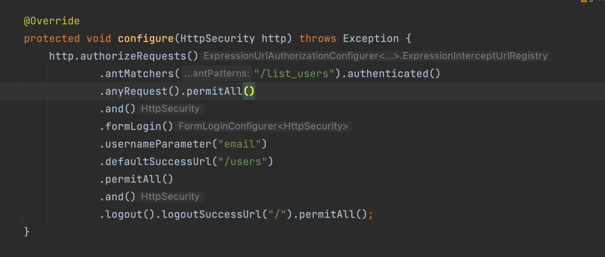

# JPA

## DaoAuthenticationProvider

## BCryptPasswordEncoder

## Spring Security

* Creates default login page!

* The library(import org.springframework.security.core.userdetails.UserDetails) provides UserDetail interface

  * public Collection<? extends GrantedAuthority> getAuthorities()

  * public String getPassword()

  * public String getUsername()

  * public boolean isAccountNonExpired()

  * public boolean isAccountNonLocked()

  * public boolean isCredentialsNonExpired()

  * public boolean isEnabled()

> WebSecurityConfigurerAdapter refer [Link](https://kimchanjung.github.io/programming/2020/07/02/spring-security-02/)

    * @EnableWebSecurity
    

    * antMatcher

        *  특정 리소스에 대해서 권한을 설정합니다.

    * permitAll

        *  antMatchers 설정한 리소스의 접근을 인증절차 없이 허용한다는 의미 입니다.

    * anyRequest

        *  모든 리소스를 의미하며 접근허용 리소스 및 인증후 특정 레벨의 권한을 가진 사용자만 접근가능한 리소스를 설정하고 그외 나머지 리소스들은 무조건 인증을 완료해야 접근이 가능하다는 의미입니다.

    * formLogin

        * 로그인 페이지와 기타 로그인 처리 및 성공 실패 처리를 사용하겠다는 의미 입니다.

        * 일반적인 로그인 방식 즉 로그인 폼 페이지와 로그인 처리 성공 실패 등을 사용하겠다는 의미입니다.

            * Used to indicate a set of characters. In a set:

    * defaultSuccessUrl

        * 정상적으로 인증성공 했을 경우 이동하는 페이지를 설정합니다.

        * defaultSuccessUrl("/main") main page로 이동

    * GrandtedAutority

        * we can think of each GrantedAuthority as an individual privilege

## Hibernate

* Hibernate creates table if it does not exist

* Hibernate를 사용하면 데이터베이스가 변경되더라도 SQL 스크립트를 수정하는등의 작업을 할 필요가 없습니다.

* 애플리케이션에서 사용되는 데이터베이스를 변경시키고자 한다면 설정파일의 dialect 프로퍼티를 수정함으로서 쉽게 처리할 수 있습니다

> UUID.randomUUID().toString())
