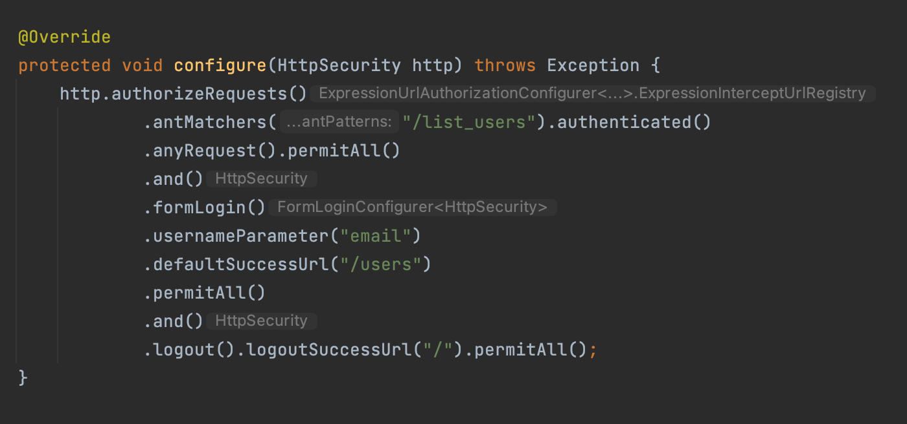

# JPA

## DaoAuthenticationProvider

## BCryptPasswordEncoder

## Spring Security

* Creates default login page!

* The library(import org.springframework.security.core.userdetails.UserDetails) provides UserDetail interface

  * public Collection<? extends GrantedAuthority> getAuthorities()

  * public String getPassword()

  * public String getUsername()

  * public boolean isAccountNonExpired()

  * public boolean isAccountNonLocked()

  * public boolean isCredentialsNonExpired()

  * public boolean isEnabled()

> WebSecurityConfigurerAdapter refer [Link](https://kimchanjung.github.io/programming/2020/07/02/spring-security-02/)

    * @EnableWebSecurity
    

## Hibernate

* Hibernate creates table if it does not exist

* Hibernate를 사용하면 데이터베이스가 변경되더라도 SQL 스크립트를 수정하는등의 작업을 할 필요가 없습니다.

* 애플리케이션에서 사용되는 데이터베이스를 변경시키고자 한다면 설정파일의 dialect 프로퍼티를 수정함으로서 쉽게 처리할 수 있습니다
