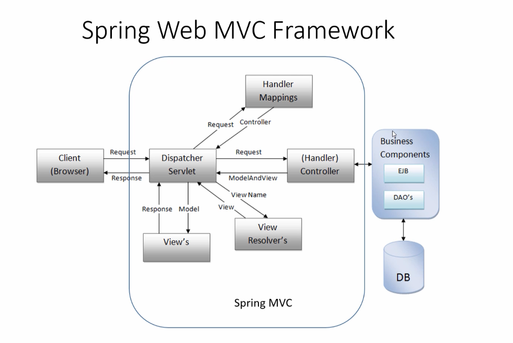
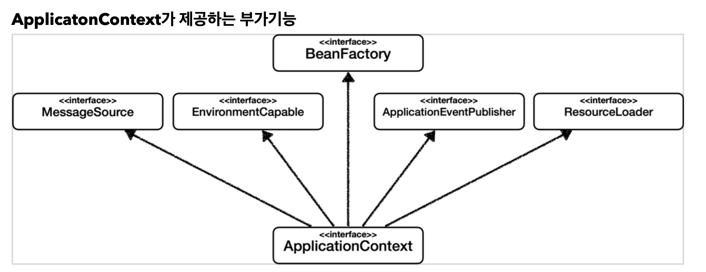

# Theory

## Spring MVC

* client - > dispacher Servlet -> Controller - business components

* business components -> Controller -> View Resolver - > Views -> Dispatch Servlet

* Client

* Single ton

> Bean Factory

* 스프링 컨테이너의 최상위 인터페이스

* 스프링빈을 관리하고 조회하는 역할을 담당한다

* getBean()을 제공한다

> ApplicationContext

* Beanfactory기능을 모두 상속받아 제공

* BeanFactory기능을 모두 상속받아 제공한다

  * 애플리케이션을 개발할 때는 빈은 관리하고 조회하는 기능은 물론이고, 수 많은 부가기능이 필요하다.

> Singleton

* 스프링은태생이 온라인 서비스를 지원하기 위한 기술이다

* 웹앱은 보통 고객들이 동시에 요청한다

* 우리가 만들었던 스프링 없는 순수한 DI 컨테이너인 AppConfig는 요청을 할 때 마다 객체를 새로 생성한 다.

  * 고객 트래픽이 초당 100이 나오면 초당 100개 객체가 생성되고 소멸된다!

  * 해결방안은 해당 객체가 딱 1개만 생성되고, 공유하도록 설계하면 된다.

  * String은 기본적으로 싱글톤으로 컨테이너를 관리해준다

> 싱글톤 방식의 주의점

* 객체가 상태유지하게 설계하면 안된다 - 무상태로 설계해야한다

  * 특정 클라이언트에 의존적인 필드가 있으면 안된다

    * 특정 클라이언트가 값을 변경할 수 있는 필드가 있으면 안된다

    * 특정 클라이언트가 값을 변경할 수 있는 필드가 있으면 안된다

  * 가급적 읽기만 가능해야 한다.
