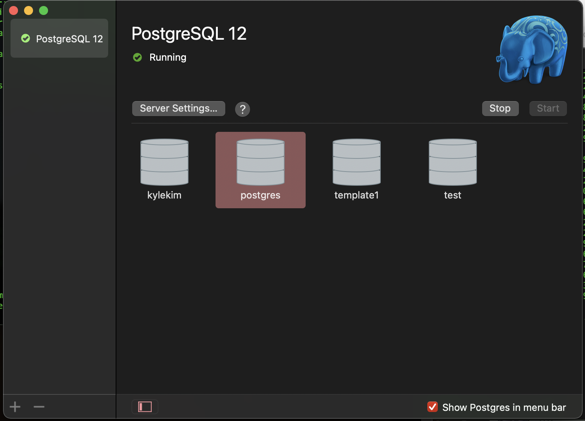

# Postgres

* psql command not found zshrc

  * Access to postgres main data base through GUI app

    * 

  * copy the directory path on the cmd

    * 

  * Open zshrc file by "vim ~/.zshrc" command

  * export PATH=$PATH:/COPY HERE the PATH without double quote

    * Save and exit

  * Enter "source .zshrc" on cmd

  * now psql command should work on your computer
