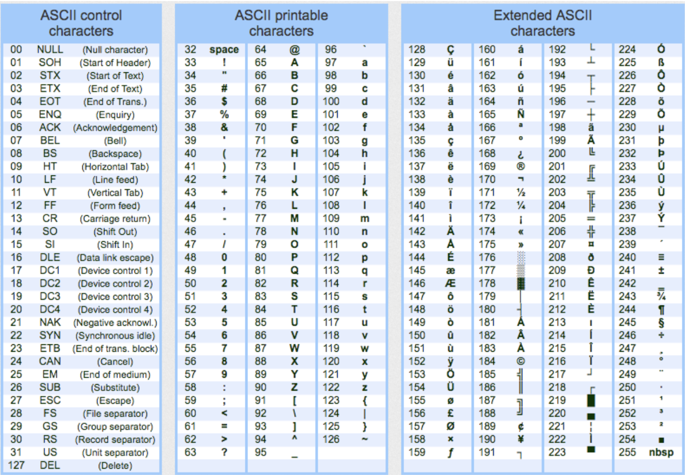

# String




* character charAt(`idx`) : return character in `idx`
* String[] split(`str`A):

```java
// 1. Print in format
System.out.println(System.getProperty("file.encoding"));  // Print encoding type of file
String.format("%s, %.2f and %d", “string”, 0.01, 12);     // Print file format

getBytes()
split(String regex, int limit)                            // if limit = 0, remove trailing empty strings, if neg, keep

// 2. Print Korean in java
public class a {
  private static void printIt(String string) {
    for (int i = 0; i < string.length(); i++) {
      System.out.print(String.format("U+%04X ", string.codePointAt(i)));
    }
    System.out.println();
  }

  public static void main(String[] args) {
    String han = "한";

    String nfd = Normalizer.normalize(han, Normalizer.Form.NFD);
    printIt(nfd);
    String nfc = Normalizer.normalize(nfd, Normalizer.Form.NFC);
    printIt(nfc);
  }
}
```




* charAt / charCodeAt()
* concat()
* constructorendsWith()
* fromCharCode()
* includes()
* lastIndexOf()
* lengthlocaleCompare()
* prototyperepeat()
* search()
* startsWith()
* substr()
* substring()
* toLocaleLowerCase / UpperCase()
* toLowerCase / UpperCase()
* toString()
* trim()
* valueOf()

* split(delim, time)
  * str.split("o").length-1 : count number of occurence →
* indexOf()
  * s.indexOf(" ")

* match() : search a string for a match and returns matches

* replace()
  * ("bef", "aft") : only once
  * (/bef/g, "after") : replace all

* slice(start, end) : extract parts of a string
  * .slice(1, end - 1) : removes first and last char
  * ("000" + n).splice(-4) : rihgt pad
  * (n + "000").splice(4) : rihgt pad
  * hit.objectID.split('-').slice(0, -1).join('-') : python rsplit

```js
// 1. split_string
var splits = [s.slice(0, i) + s.slice(i + 1)]
```






## Case



## Encoding

* Rules for translating a Unicode string into a sequence of bytes are called an encoding
* Byte Order Mark # Set encoding for file

* ASCII : American Standard Code for Information Interchange
  * code point (U+ or \u)
  * U+0000~U+FFFF : BMP (Basic Multilingual Plane)
  * U+10000~U+1FFFF : SMP (Supplementary Multilingual Plane)



* URL Encoding

| Value | Symbol |
| ----- | ------ |
| %21   | !      |
| %40   | @      |

* UTF-8
  * Three byte encoding for korean
  * Korea [(initial) × 588 + (medial) × 28 + (final)] + 44032

* CP949
* EUC-KR

### Unicode



## Regex




```cpp
#include <regex>
using namespace std;

// 1. Regex match
string a = "GeeksForGeeks";
regex b("(Geek)(.*)");
regex_match(a, b);

// 2. replace string
string defangIPaddr(string address) {
  return regex_replace(address, regex("[.]"), "[.]");     // regex(“\\.”)
}
```




* /()/;

```js
"a,b".match(/([^,]*,(.*)/))   // split once using regex
```




> re

* re.DOTALL : match new line
* re.I : case insensitive matching
* r"(?<=...)" : positive lookbehind
* r"(?<!...)" : negative lookbehind
* r"(?=...)" : positive lookahead. A (?!B) only match if A followed by B
* r"(?!...)" : negative lookahead. A (?!Sam) match Tom Sam

* Escape \\ : for dot(.), dash(-), braces()), bracket(])

* findall(pattern, string, flags=0) : Return all non-overlapping matches of pattern
* finditer(pattern, string)
* match() : match at the beginning of the string
* search() : Checks for one match
* split(pattern, string, maxsplit=0) : split(r'\W+', 'Words, words') ⇒ ['Words', 'words', '']

* Word
  * r"[a-c]" : contain a, b, c
  * r"[^a-c]" : not contain a, b, c
  * r"^a" : starts with a
  * r"a$" : ends with a
  * r"\b(words)\b" : word boundary
  * r".*a" : greedy match (all the way to the end, and then backtrack to a)
  * r".*?" : non-greedy (will try to match extra characters until it matches 1)
  * "\n" : references the nth capturing group
  * "^([aeiou]).+\1$" : Starts and End with same vowel
  * "^\d\d(-?)\d\d\1\d\d\1\d\d" : 12345678 or 12-34-56-78
  * r"一-龥" : Chineses Character
  * r"가-힇" : Korean Character
  * r"ぁ-ゔ|ァ-ヴー|々〆〤" : Japanese Character

* Length
  * {5} : five character
  * {2,6} : between 2, 6
  * \+ / * : 1 / 0 or more
  * ? : optional

* Conditional
  * (cat | dog) : cat or dog

* : Type
  * r"\w" : Unicode letter, ideogram, digit, underscore  ; Capital <>
  * [r"\d", r"\D"] : digit | Non-digit
  * [r"\s", r"\S"] : space, tab, newline | non-space, tab, newline
  * r"\t" : tab

* match()
  * expand(template) : obtained by doing backslash substitution on template
  * group(n) : 0 for entire match, n th match
  * groups() : Tuples containing all match
  * groupdict() : (?P<first_name>\w+) → firstname:
  * string : The string passed to match() or search()

* findall()
  * ("{[^{}]+}", "{A}, {{B}} {{C}, {D}, E}") : Nested Parenthesis
  * ("\((?:1|82)\)", "(82) (821) (1) 82 1") : phone number
  * ("(?i)\d{2}:\d{2}(?:am|pm)", "02:40pm 12:29AM") : Non capture group
  * (r'(.*?)D', "ABCD, ABD") : Grap little as possible
  * (r'([a-zA-Z0-9_.+-]+@[a-zA-Z0-9-]+\.[a-zA-Z0-9-.]+)', "rbtmd10@gmail.com, fakeemail@@f.com") : email

* search()
* split()
* sub()
  * re.sub('\W+', ' ', ex) : made up string to Test 2 한국different regex23 methods

```py
# 1. findall
ex = 'made|up string*.to>>>>Test----   2""""""한국different~regex23-methods'
re.findall('\S+', ex)     # ['made|up', 'string*.to>>>>Test----', '2""""""한국different~regex23-methods']
re.findall('\w+', ex)     # ['made', 'up', 'string', 'to', 'Test', '2', '한국different', 'regex23', 'methods']
re.findall(dr, ex)        # ['23']
re.findall('\w{4}\-', ex) # ['Test-', 'ex23-']

# 2. Search
txt = "The rain in Spain"
x = re.search(r"\bS\w+", txt)
print(x.string)    # "The rain in Spain"
ex = 'made|up string*.to>>>>Test----   2""""""한국different~regex23-methods'
re.search('\w+', ex) #   <re.Match object; span=(0, 4), match='made'>
re.search('\w+', ex)    # end : 4, group : made, groupdict : {}, groups : (), span : (0, 4), start : 0

# 3. split
ex = 'made|up string*.to>>>>Test----   2""""""한국different~regex23-methods'
re.split('\s', ex)  # ['made|up', 'string*.to>>>>Test----', '', '', '2""""""한국different~regex23-methods']
re.split('\s+', ex) # ['made|up', 'string*.to>>>>Test----', '2""""""한국different~regex23-methods']
re.split('\w+', ex) # ['', '|', ' ', '*.', '>>>>', '----   ', '""""""', '~', '-', '']
re.split('\W+', ex) # ['made', 'up', 'string', 'to', 'Test', '2', '한국different', 'regex23', 'methods']
```




### Alternation



### Anchor



### Assertion



### Flag



### Group



### Referencing



### Repetition



### Quantifier


