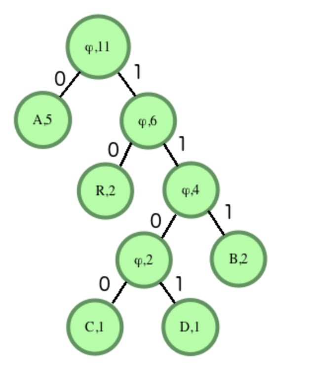
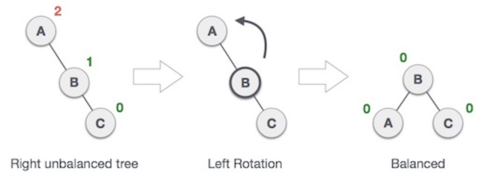
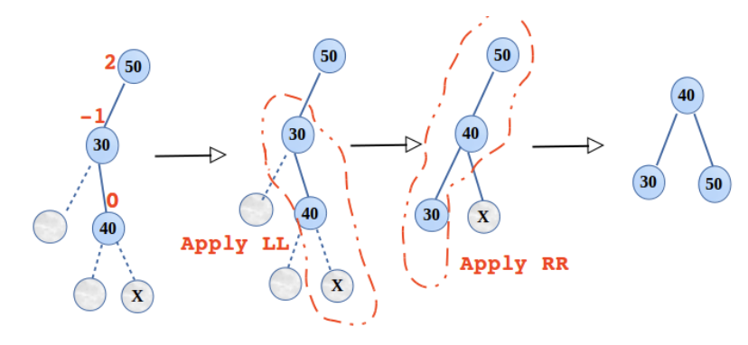
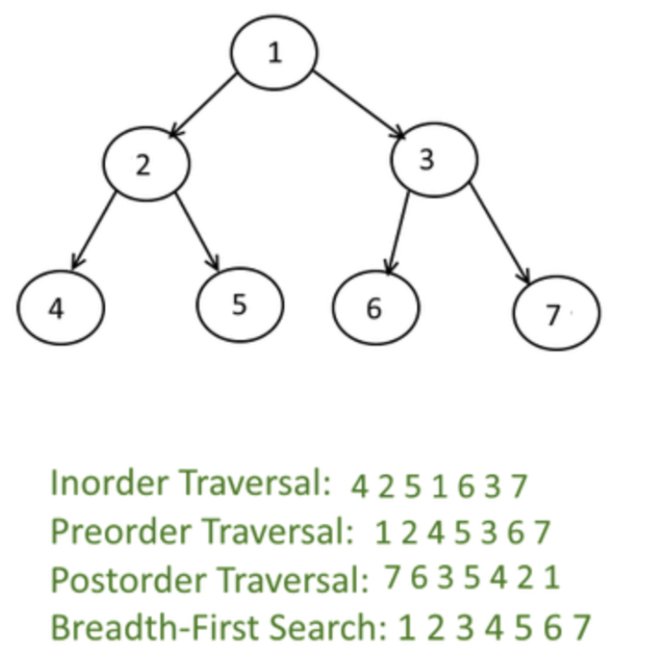
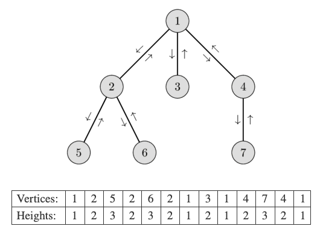
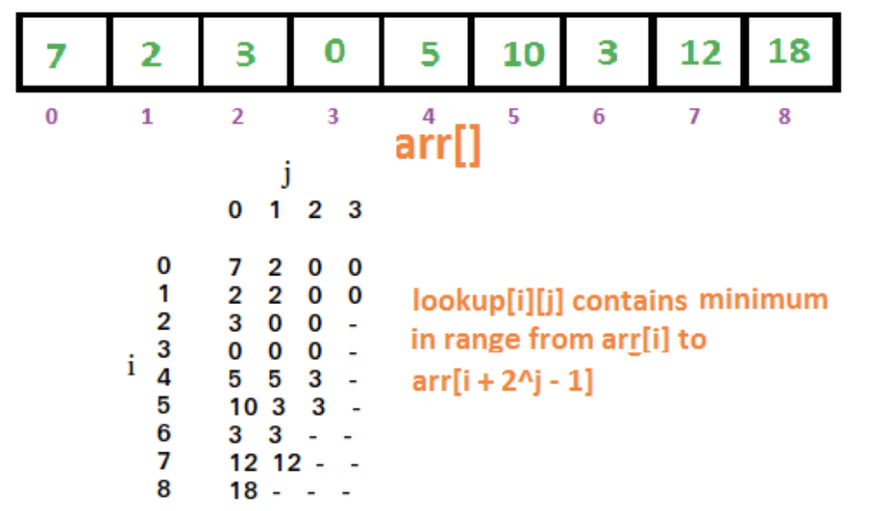
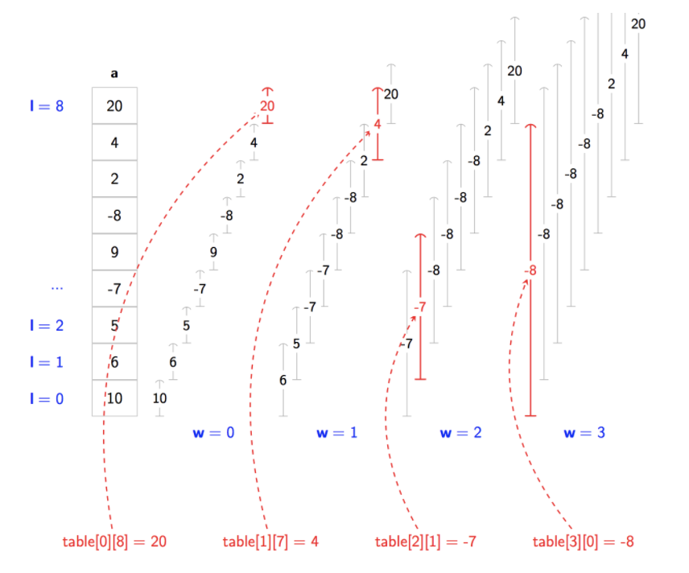
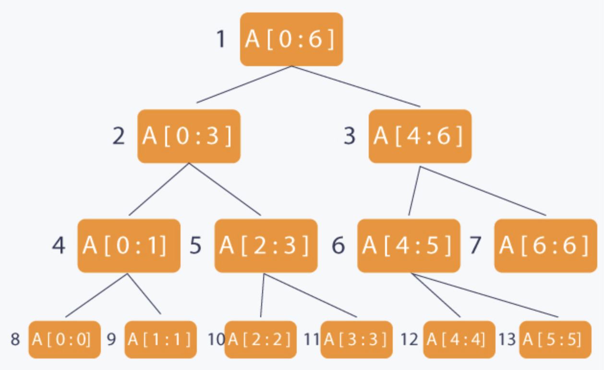
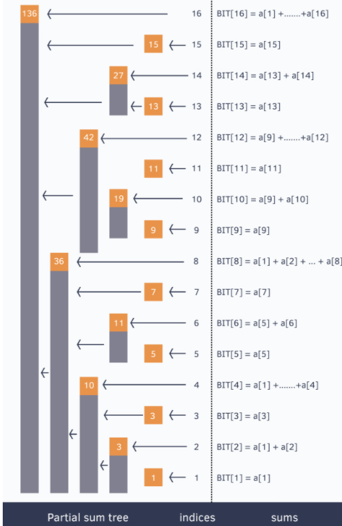

# Tree

* [Tree](https://docs.google.com/forms/d/1_ofN6F79XzQAos7-Xl3ZKjcz-N4kMF4EUGlPX3yenpg/edit)
* Connected and has no cycles (n-1 edges)
* Root has no incoming edges and non-root has exactly one incoming edge from parent
* root vertex r is at level 0
* Binary tree is a rooted tree in which every (internal) vertex has no more than two children

> Huffman encoding

* Tree must be full tree
* Exists an optimal tree where two lowest frequent symbols must be siblings at the two lowest level
* The two longest codewords have the same length
* Entropy of tree

$$
\sum_{i} p_{i} \log _{2} \frac{1}{p_{i}}
$$



> RB Tree

* Each node is either red or black
* Red node only contains black children
* Root is black
* Black height is same for every descendent

* Proof that the height is log(n)
  * compress every red child into parent → create 2-3-4 trees
  * height of compressed is at most half of the original
  * height of compressed is log2(N)
  * the number of leaves is between 2h'< n < 4h'

* Insertion
  * X : the node you are inserting
  * P : parent of the node
  * G : grandparent of the node
  * Traverse down the tree to find the appropriate spot to insert
  * As we traverse the tree, at each node we encounter, check whether any node has two red children
  * if so, color parent as red and both children as black
  * if any violation occurs(if grandparent is also red), perform appropriate rotation
  * After we find the spot, P is black → done
  * P is red, P is left|right child of G, X is left|right child of P → single rotation
  * P is red, P is left|right child of G, X is right|left child of P → double rotation

## Binary



### BST



## Nary

> N-ary to binary

```py
def convert_n_ary_to_binary(root,isLeft = 1):
  if root == None:
    return

  btnode = BinaryTreeNode(root.data)
  lastnode = btnode

  for child in root.children:
    if isLeft == 1:
      lastnode.left = convert_n_ary_to_binary(child, 0)
      lastnode = lastnode.left
    else:
      lastnode.right = convert_n_ary_to_binary(child, 1)
      lastnode = lastnode.right

  return btnode

def convert_binary_to_n_ary(node, isLeft = 1):
  if node == None:
    return

  nnode = TreeNode(node.data)
  temp = node

  if isLeft == 1:
    while(temp.left != None):
      child = convert_binary_to_n_ary(temp.left, 0)
      nnode.children.append(child)
      temp = temp.left
  else:
    while(temp.right != None):
      child = convert_binary_to_n_ary(temp.right, 1)
      nnode.children.append(child)
      temp = temp.right

  return nnode

node1 = TreeNode(1)
node2 = TreeNode(2)
node3 = TreeNode(3)
node4 = TreeNode(4)
node1.children.append(node2)
node1.children.append(node3)
node1.children.append(node4)
node5 = TreeNode(5)
node6 = TreeNode(6)
node3.children.append(node5)
node3.children.append(node6)

print("Original n-ary tree")
node1.display_level_order()
bnode1 = convert_n_ary_to_binary(node1)
print("Converted binary tree")
display_level_order(bnode1)
# If the tree is converted into BT then the following statement must return "5"
# print("Root.Left.Left.Right = " + str(bnode1.left.left.right.data))

tnode1 = convert_binary_to_n_ary(bnode1)
print("\nConverted n-ary tree")
tnode1.display_level_order()
```



### KD tree

* K dimension tree
* Organizing some number of points in a space with k dimensions
* Pick median to balance KDTree
* Can start with either X or Y
* Right child is greater and equal

* Single rotation
  

* Double rotation
  

### Trie

* Search / Insertion : O(key_length)
* memory : O(ALPHABET_SIZE * key_length * N

```py
class Node:
  def __init__(self):
    self.children = dict()
    self.is_leaf = False

class Trie:
  def __init__(self):
    self.root = Node()

  def add_word(self, word):
    cur = self.root
    for letter in word:
      if letter not in cur.children:
        cur.children[letter] = Node()
      cur = cur.children[letter]
    cur.is_leaf = True

  def remove_word(self, word):
    cur = self.root
    for letter in word:
      if letter not in cur.children:
        return False
      cur = cur.children[letter]
    return self

  def search(self, word):
    cur = self.root
    for letter in word:
      if letter not in cur.children:
        return False
      cur = cur.children[letter]
    return cur.is_leaf
```



## Traversal





## LCA



* Store height then move up by once (query : O(n))
* Binary Lyfting : go up with n^2 step



## Merge Sort Tree

* Build : O(n log n)
* Query : O(log^3n)



## Sparse Table



* Range Greatest Common Divisor
* Minimum query
  * Space O(N logN)
  * Run-time (build) O(N logN)
  * Run-time (Query) O(1)



```py
"""
[10, 6, -7, -8, 0, 0, 0, 0, 0]
[6, 5, -7, -8, 0, 0, 0, 0, 0]
[5, -7, -8, 0, 0, 0, 0, 0, 0]
[-7, -7, -8, 0, 0, 0, 0, 0, 0]
[9, -8, -8, 0, 0, 0, 0, 0, 0]
[-8, -8, -8, 0, 0, 0, 0, 0, 0]
[2, 2, 0, 0, 0, 0, 0, 0, 0]
[4, 4, 0, 0, 0, 0, 0, 0, 0]
[20, 0, 0, 0, 0, 0, 0, 0, 0]
"""
def build_ST(l):
  n = len(l)
  ST = [l[i] + [0]*(n - 1) for i in range(n)]
  j = 1
  while (1 << j) <= n:
    i = 0
    while (i + (1 << j) - 1) < n:
      ST[i][j] = min(ST[i][j - 1], ST[i + (1 << (j - 1))][j - 1])
      i+=1
  j+=1
  return ST

def query(l, r, ST):
  j = math.log2rR - l + 1)
  return min(ST[L][j], ST[R - (1 << j) + 1][j])
```



## Segment Tree

* m number of Minimum / Sum Range Query + n elements in array
  * Time Complexity: O(n) (Build tree)
  * Space Complexity: O(n)
  * Time Complexity: O(log(n)) (Query)





### Lazy Segment Tree

* support range update

* [Lazy segment tree](https://www.youtube.com/watch?v=xuoQdt5pHj0)



## Binary index tree

* AKA Fenwick Tree
* Fast cumulative sum query → easier to implement than Segment Tree
* Time Complexity: O(n) (Build)
* Time Complexity: O(log n) (Range Query, update one element)




