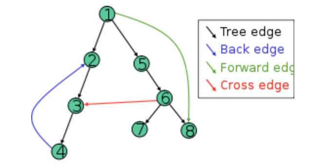

# Graph

* [Graph](https://docs.google.com/forms/d/1E8HkTLzD7yVQ3Vqr9RhAYax10HYzW8S8tRadvmUaZbo/edit)

> Terms

* Directed
  * DAGs : Directed acyclic graphs are directed graphs with no cycle
  * Weakly : Undirected version of directed graph is connected
  * Strongly Connected : Directed graph G is strongly connected a path exists for all ordered pair vertices
  * Strongly Connected Component : Strongly connected components is maximal strongly connected piece
  * Connectivity Deficit : minimum number of directed edges you have to add to make graph strongly connected

* Undirected
  * Connected : G is connected if for any pair of vertices v, w there is a path from v to w
  * CC : Connected components is maximal connected piece



* Edge
  * Tree : solid edge included in the DFS output tree (pre u < pre v < post v < post u)
  * Back : leads to an ancestor (pre v < pre u < post u < post v)
  * Cross : leads to neither anc. or des (pre v < post v < pre u < post(u)

* Adjacent (coincident)
  * Two edges of a graph are called adjacent if they share a common vertex
  * Two vertices are called adjacent if they share a common edge

* incident : An edge and a vertex on that edge

* Path
  * Walk : Vertices may repeat. Edges may repeat (Closed or Open)
  * Trail : Vertices may repeat. Edges cannot repeat (Open)
  * Circuit : Vertices may repeat. Edges cannot repeat (Closed)
  * Path : Vertices cannot repeat. Edges cannot repeat (Open)
  * Cycle : Vertices cannot repeat. Edges cannot repeat (Closed)
  * Hamiltonian : Visits every vertex in the graph
  * Eulerian : Visits every edge in the graph

* Independent Set: Given graph G and a number k, does G contain a set of at least k independent vertices?
* Vertex Cover : Given a graph G and a number k, does G contain a vertex cover of size at most k

> Maximal independent set

* Given an undirected graph, find the largest set of vertices such that no two are connected with an edge
* Instance : an undirected graph
* Solution format : subset of vertices = S
* Constraint : no two vertices in S are connected by an edge
* Objective : Maximize |S|
* Runtime: 2T(n- 1) + O(n)

> Seven Bridge of Konigsberg


* Whenever one enters a vertex by a bridge, one leaves the vertex by a bridge
* In other words, during any walk in the graph, # enters a non-terminal vertex equals # one leaves it
* However, there are 4 vertices with odd degrees, so we cannot create a desired path

> Cycle Detect Proof

* Undirected connected graph G has a cycle if and only if it’s DFS output tree has a back edge

* Complexity O(V + E)
* Proof → : Suppose DFS tree has no back edge
  * Then all of the original edges are in the DFS tree. Then the graph itself is a tree (no cycles)
* ← : Suppose the graph is a tree (has no cycles) then there can’t be any backedges
  * because the DFS output tree is a tree with all the vertices

> baekjoon

* [Level 8 : 상근이의 여행](http://acmicpc.net/problem/9372)
  * [Update solution](https://github.com/seanhwangg/algorithm/edit/main/data-structure/graph/graph/BJ_9372.md)




> Question

* prints the minimum number of flights that Sang-geun must take to travel to all countries

```txt
Input:
2
3 3
1 2
2 3
1 3
5 4
2 1
2 3
4 3
4 5

Output:
2
4
```




```py
import sys
input = sys.stdin.readline
T = int(input())
for _ in range(T):
  N, M = map(int, input().split())
  for _ in range(M):
    a, b = map(int, input().split())
  print(N - 1)
```




* [Level 12 : 플로이드](http://acmicpc.net/problem/11404)
  * [Update solution](https://github.com/seanhwangg/algorithm/edit/main/data-structure/graph/graph/BJ_11404.md)




> Question

* For all pairs of cities (A, B), find the minimum cost required to get from city A to city B

```txt
Input:
5
14
1 2 2
1 3 3
1 4 1
1 5 10
2 4 2
3 4 1
3 5 1
4 5 3
3 5 10
3 1 8
1 4 2
5 1 7
3 4 2
5 2 4

Output:
0 2 3 1 4
12 0 15 2 5
8 5 0 1 1
10 7 13 0 3
7 4 10 6 0
```




```py
V, E = int(input()), int(input())
G = [[float('inf')] * V for _ in range(V)]
for _ in range(E):
  u, v, w = map(int, input().split())
  G[u - 1][v - 1] = min(w, G[u - 1][v - 1])

for i in range(V):
  for j in range(V):
    for k in range(V):
      if G[j][i] + G[i][k] < G[j][k]:
        G[j][k] = G[j][i] + G[i][k]

for i in range(V):
  for j, v in enumerate(G[i]):
    if i == j or v == float('inf'):
      print(0, end=' ')
    else:
      print(v, end=' ')
  print()
```




> kattis

* [Level 1.6 : Weak Vertices](https://open.kattis.com/problems/weakvertices)
  * [Update solution](https://github.com/seanhwangg/algorithm/edit/main/data-structure/graph/graph/KT_weakvertices.md)




> Question

* weak vertices in graphs – those vertices that is not part of any triangle

```txt
Input:
9
0 1 1 1 0 0 0 0 0
1 0 0 0 0 0 1 0 0
1 0 0 1 0 1 0 0 0
1 0 1 0 0 1 1 0 0
0 0 0 0 0 0 1 1 0
0 0 1 1 0 0 0 0 0
0 1 0 1 1 0 0 1 0
0 0 0 0 1 0 1 0 1
0 0 0 0 0 0 0 1 0
1
0
-1

Output:
1 8
0
```




```py
from collections import defaultdict
while True:
  N = int(input())
  if N == -1:
    break
  G = defaultdict(set)
  for i in range(N):
    for j, e in enumerate(list(map(int, input().split()))):
      if e == 1:
        G[i].add(j)
  for i in range(N):
    count = 0
    for j in G[i]:
      count += sum([1 for k in G[j] if k in G[i]])
    if count == 0:
      print(i, end = ' ')
  print()
```




## Unweighted Graph

### Articulation

> Proof Articulation point

* case v = root
  * vertex will be the point of articulation iff this vertex has more than one child
* case v ≠ root
  * During DFS create traversal tree (v, to) is articulation
  * iff none of vertices or descendents has a back-edge to any of the ancestors of v then v is an articulation point
  * visited time ≤ low time of adjacent vertex

> baekjoon

* [Level 16 : 단절점](http://acmicpc.net/problem/11266)
  * [Update solution](https://github.com/seanhwangg/algorithm/edit/main/data-structure/graph/articulation/BJ_11266.md)




> Question

* Print all articulation point

```txt
Input:
7 7
1 4
4 5
5 1
1 6
6 7
2 7
7 3

Output:
3
1 6 7
```

> Solution

* Run DFS and memorize order


* For vertex a, there is no path between vertices before a and after a
* For root it's articulation point if it contains more than 2 child




```py
# Time: O(N + M)
import sys;input=sys.stdin.readline
sys.setrecursionlimit(99999)
V, E = map(int,input().split())
G = [set() for _ in range(10002)]
for _ in range(E):
  a,b = map(int,input().split())
  G[a].add(b)
  G[b].add(a)

discovered = [0]*10002
is_cut=set()
idx=0
def dfs(node, is_root):
  global idx
  idx += 1
  discovered[node] = ret = idx
  cnt = 0
  for i in G[node]:
    if discovered[i]:
      ret=min(ret,discovered[i])
      continue
    cnt+=1
    prev=dfs(i,False)
    ret = min(ret,prev)
    if discovered[node] <= prev and not is_root:
      is_cut.add(node)
  if is_root and cnt > 1:
    is_cut.add(node)
  return ret

for i in range(1, 1 + V):
  discovered[i] or dfs(i, True)

print(len(is_cut))
print(*sorted(is_cut))
```




* [Level 16 : 단절선](http://acmicpc.net/problem/11400)
  * [Update solution](https://github.com/seanhwangg/algorithm/edit/main/data-structure/graph/articulation/BJ_11400.md)




> Question

* Find all articulation edge

```txt
Input:
7 8
1 4
4 5
5 1
1 6
6 7
2 7
7 3
2 3

Output:
2
1 6
6 7
```




```py
import sys
input = sys.stdin.readline
sys.setrecursionlimit(10**6)

V, E = map(int, input().split())
graph = [[] for _ in range(V+1)]
visited = [0]*(V+1)
cnt = 0
cutEdge = []
def dfs(node, parent):
  global cnt
  cnt += 1
  visited[node] = result = cnt
  for i in graph[node]:
    if parent == i:
      continue
    if not visited[i]:
      prev = dfs(i, node)
      if prev > visited[node]:
        cutEdge.append((min(node,i), max(node,i)))
      result = min(result, prev)
    else:
      result = min(result, visited[i])
  return result

for i in range(E):
  a, b = map(int, input().split())
  graph[a].append(b)
  graph[b].append(a)
dfs(1, 0)

print(len(cutEdge))
for a, b in cutEdge:
  print(a, b)
```




### BFS

* [BFS vs DFS](https://www.youtube.com/watch?v=pcKY4hjDrxk)

> BFS Proof

* After BFS is done, dist(v) is the length of the shortest path from s to v
  * → After every iteration, dist(v) is the length of some path from s to v

* loop invariant
  * ← After BFS is done, dist(v) is the length of the shortest path from s to v for all vertices v in V

* Suppose there is a path p from s to v such that length(p) < dist(v)
* Then let z be the last vertex in the path st dist(z) = d(z) and let w be first vertex in thee path st dist(w) > d(w)

* Case 1: d(w) = d(z) + 1
  * Then in the algorithm z is put in the queue before q and when z is ejected, w is injected with dist(w) =
* Case 2: d(w) > d(z) + 1. Then the path p is actually not the shortest path

* Complexity
  * Notice that in BFS, each vertex enters the queue (F) at most one time
  * This was the assumption we made about graph search when we calculated its Complexity
  * So BFS runs in O V + E time

> baekjoon

* [Level 8 : 바이러스](http://acmicpc.net/problem/2606)
  * [Update solution](https://github.com/seanhwangg/algorithm/edit/main/data-structure/graph/bfs/BJ_2606.md)




> Question

* given the number of computers and information connected to each other on the network
* print the number of computers that are affected by the worm virus through computer 1

```txt
Input:
7
6
1 2
2 3
1 5
5 2
5 6
4 7

Output: 4
```




```js
const input = require("fs").readFileSync("/dev/stdin").toString().split("\n");

const count = Number(input[1]);
let warmNode = ["1"];
for (let j = 0; j < count; j++) {
  for (let i = 2; i < count + 2; i++) {
    const [a, b] = input[i].split(" ");
    if (warmNode.find((warm) => warm == a) || warmNode.find((warm) => warm == b)) {
      warmNode.push(a, b);
      warmNode = [...new Set(warmNode)];
    }
  }
}

console.log(warmNode.length - 1);
```




```py
from collections import deque
def bfs(G, start):
  dq, visited = deque([start]), set([start])
  while len(dq) != 0:
    v = dq.popleft()
    for adj in G[v]:
      if adj not in visited:
        visited.add(adj)
        dq.append(adj)
  return len(visited)
N, M = int(input()), int(input())
G = [[] for _ in range(N)]
for _ in range(M):
  u, v = map(int, input().split())
  G[u - 1].append(v - 1)
  G[v - 1].append(u - 1)
print(bfs(G, 0) - 1)
```




* [Level 9 : 촌수계산](http://acmicpc.net/problem/2644)
  * [Update solution](https://github.com/seanhwangg/algorithm/edit/main/data-structure/graph/bfs/BJ_2644.md)




> Question

* Given the relationship between parents and children for different people
* calculates the number of people who are given two

```txt
Input:
9
7 3
7
1 2
1 3
2 7
2 8
2 9
4 5
4 6

Output: 3
```




```py
from collections import deque
def bfs(G, start, end):
  dq, visited = deque([(start, 0)]), set([start])
  while len(dq) != 0:
    v, dist = dq.popleft()
    if v == end:
      return dist
    for adj in G[v]:
      if adj not in visited:
        visited.add(adj)
        dq.append((adj, dist + 1))
  return -1
N = int(input())
G = [[] for _ in range(N)]
a, b = map(int, input().split())
for _ in range(int(input())):
  u, v = map(int, input().split())
  G[u - 1].append(v - 1)
  G[v - 1].append(u - 1)

print(bfs(G, a - 1, b - 1))
```




* [Level 10 : 숨바꼭질](http://acmicpc.net/problem/6118)
  * [Update solution](https://github.com/seanhwangg/algorithm/edit/main/data-structure/graph/bfs/BJ_6118.md)




> Question

* Find the maxmium distance from node 1
* Print index (minimum among candidate), distance, candidates count

```txt
Input:
6 7
3 6
4 3
3 2
1 3
1 2
2 4
5 2

Output: 4 2 3
```




```py
from collections import deque

N, M = map(int, input().split())
graph = [[] for _ in range(N+1)]
for i in range(M):
  a, b = map(int, input().split())
  graph[a].append(b)
  graph[b].append(a)

dq = deque([1])
V = [0]*(N+1)
V[1] = 1
while dq:
  s = dq.popleft()
  for e in graph[s]:
    if not V[e]:
      V[e] = V[s] + 1
      dq.append(e)
m = max(V)
print(V.index(m), m - 1, V.count(m))
```




* [Level 10 : 숨바꼭질](http://acmicpc.net/problem/1697)
  * [Update solution](https://github.com/seanhwangg/algorithm/edit/main/data-structure/graph/bfs/BJ_1697.md)




> Question

* After 1 second, you can move to positions X-1, X+1, and 2*X
* how many seconds after the earliest time you can find your brother

```txt
Input: 5 17
Output: 4
```




```py
from collections import deque
def bfs(start, end):
  dq, node2dist = deque([start]), {start : 0}
  while len(dq) != 0:
    v = dq.popleft()
    if v == end:
      return node2dist[end]
    for adj in [v + 1, v - 1, v * 2]:
      if adj not in node2dist and adj <= 100000:
        node2dist[adj] = node2dist[v] + 1
        dq.append(adj)
start, end = map(int, input().split())
print(bfs(start, end))
```




* [Level 10 : 물통](http://acmicpc.net/problem/2251)
  * [Update solution](https://github.com/seanhwangg/algorithm/edit/main/data-structure/graph/bfs/BJ_2251.md)




> Question

* There are three buckets without measure, first two buckets are initially empty and third bucket is full
* Find all amounts of water you can measure

```txt
Input: 8 9 10
Output: 1 2 8 9 10
```




```py
W = list(map(int, input().split()))
vst, ans = set(), set()
q = [(0, 0, W[2])]

for cur in q:
  if cur[0] == 0: ans.add(cur[2])
  for i in range(3):
    for k in range(1,3):
      next = list(cur[:])
      next[(i + k)%3] += next[i]
      if next[(i + k) % 3] > W[(i + k) % 3]:
        next[i] = next[(i + k) % 3] - W[(i + k) % 3]
        next[(i + k) % 3] = W[(i + k) % 3]

      else:
        next[i] = 0
      next = tuple(next)
      if next not in vst:
        vst.add(next)
        q.append(next)
print(*sorted(ans))
```




* [Level 10 : 결혼식](http://acmicpc.net/problem/5567)
  * [Update solution](https://github.com/seanhwangg/algorithm/edit/main/data-structure/graph/bfs/BJ_5567.md)




> Question

* I decided to invite my friend and friend's friend to the wedding
* All of students have a total of N students, and their academic records range from 1 to N. Sanggeun's school number is 1
* Find the number of people to invite to the wedding based on your friendship list

```txt
Input:
6
5
1 2
1 3
3 4
2 3
4 5

Output: 3
```




```py
from collections import deque
def bfs(G, start):
  dq, visited = deque([start]), set([start])
  for _ in range(2):
    for _ in range(len(dq)):
      v = dq.popleft()
      for e in G[v]:
        if e not in visited:
          dq.append(e)
          visited.add(e)
  return len(visited) - 1
V, E = int(input()), int(input())
G = [[] for _ in range(V + 1)]
for _ in range(E):
  u, v = map(int, input().split())
  G[u].append(v)
  G[v].append(u)

print(bfs(G, 1))
```




* [Level 11 : 이모티콘](http://acmicpc.net/problem/14226)
  * [Update solution](https://github.com/seanhwangg/algorithm/edit/main/data-structure/graph/bfs/BJ_14226.md)




> Question

* Copy all the emoticons on the screen and save them to the clipboard
* Paste all the emoticons on the clipboard into the screen
* Delete one of the emoticons on the screen
* Find the minimum amount of time it takes Youngsun to make S emoticons on the screen

```txt
Input: 6
Output: 5
```




```py
from collections import deque

def minimal_emoticon(goal):
  dq, visited = deque([(1, 0, 0)]), set((1, 0, 0))

  while len(dq):
    out, clip, cnt = dq.popleft()
    if out == goal:
      return cnt
    for n_out, n_clip in [(out + clip, clip), (out - 1, clip), (out, out)]:
      if (n_out, n_clip) not in visited and 0 < n_out < 2000:
        visited.add((n_out, n_clip))
        dq.append((n_out, n_clip, cnt + 1))
  return goal

print(minimal_emoticon(int(input())))
```




* [Level 12 : 알파벳](http://acmicpc.net/problem/1987)
  * [Update solution](https://github.com/seanhwangg/algorithm/edit/main/data-structure/graph/bfs/BJ_1987.md)




> Question

* Horses can be moved to one of the four adjacent compartments, top, bottom, left, and right
* alphabet written in the new compartment must be different from the alphabet written in all the compartments passed so far
* how many compartment can horse can move

```txt
Input: 2 4
CAAB
ADCB

Output: 3
```




```py
n, m = map(int, input().split())
G = [list(map(int, input().split())) for _ in range(n)]
virs = [(r, c) for r in range(n) for c in range(n) if G[r][c] == 2]
result = float('inf')
for selects in combinations(virs, m):
  cur = bfs(deepcopy(G), selects)
  if cur != -1:
    result = min(result, cur)
print(-1 if result == float('inf') else result)
def BFS(G, x, y):
  answer = 1
  q = set([(x, y, G[x][y])])
  while q:
    x, y, ans = q.pop()
    for nr, nc in [(x + 1, y), (x, y + 1), (x - 1, y), (x, y - 1)]:
      if 0 <= nr < len(G) and 0 <= nc < len(G[0]) and G[nr][nc] not in ans:
        q.add((nr,nc,ans + G[nr][nc]))
        answer = max(answer, len(ans) + 1)
  return answer
R, C = map(int, input().split())
G = [input() for _ in range(R)]
return(BFS(G, 0, 0))
```




* [Level 12 : 중량제한](http://acmicpc.net/problem/1939)
  * [Update solution](https://github.com/seanhwangg/algorithm/edit/main/data-structure/graph/bfs/BJ_1939.md)




> Question

* Find the maximum weight of the items that can be moved in a single movement

```txt
Input:
3 3
1 2 2
3 1 3
2 3 2
1 3

Output: 3
```




```py
from collections import deque, defaultdict
def bfs(G, start, end, carry):
  dq = deque([start])
  visited = [i == start for i in range(len(G))]
  while dq:
    u = dq.popleft()
    for adj, limit in G[u].items():
      if not visited[adj] and carry <= limit:
        dq.append(adj)
        visited[adj] = True
  return visited[end]

n, m = map(int, input().split())
G = [defaultdict(int) for _ in range(n)]
for _ in range(m):
  u, v, w = map(int, input().split())
  G[u - 1][v - 1] = max(G[u - 1][v - 1], w)
  G[v - 1][u - 1] = max(G[v - 1][u - 1], w)

start, end = map(int, input().split())
start -= 1; end -= 1
lo_w = 1
hi_w = 1000000000
while lo_w < hi_w:
  mi_w = (hi_w + lo_w + 1) // 2
  if bfs(G, start, end, mi_w):
    lo_w = mi_w
  else:
    hi_w = mi_w - 1

print(lo_w)
```




* [Level 12 : 숨바꼭질 4](http://acmicpc.net/problem/13913)
  * [Update solution](https://github.com/seanhwangg/algorithm/edit/main/data-structure/graph/bfs/BJ_13913.md)




> Question

* If you walk when the position is X, you will move to X-1 or X+1 after one second
* In case of teleportation, it is moved to a position of 2*X after 1 second
* Find the fastest time you can find your brother in seconds

```txt
Input: 5 17
Output:
4
5 10 9 18 17
```




```py
from collections import deque

def bfs(n, m):
  dq, node2dist, node2head = deque([n]), {n : 0}, {}
  while len(dq) != 0:
    v = dq.popleft()
    for adj in [v + 1, v - 1, v * 2]:
      if adj not in node2dist and adj <= 100000:
        node2head[adj] = v
        node2dist[adj] = node2dist[v] + 1
        dq.append(adj)
    if v == m:
      return node2head

n, m = map(int, input().split())
path = [m]
cur = m
node2head = bfs(n, m)
while cur != n:
  cur = node2head[cur]
  path.append(cur)
print(len(path) - 1)
print(*reversed(path))
```




* [Level 14 : 퍼즐](http://acmicpc.net/problem/1525)
  * [Update solution](https://github.com/seanhwangg/algorithm/edit/main/data-structure/graph/bfs/BJ_1525.md)




> Question

* Given 3 x 3 puzzle where you move to blank space (0), find minimum movements

```txt
Input:
1 0 3
4 2 5
7 8 6

Output: 3
```




```py
from collections import deque
p = "".join(input().replace(" ", "") for _ in range(3))

visited = {p: 0}
qu = deque([p])

while qu:
  p = qu.popleft()
  if p == "123456780":
    print(visited[p])
    break

  a = p.find("0")
  r, c = divmod(a, 3)
  for nr, nc in (r + 1, c), (r, c + 1), (r - 1, c), (r, c - 1):
    try:
      b = nr * 3 + nc
      np = list(p)
      np[a], np[b] = np[b], np[a]
      np = "".join(np)
      if np not in visited:
        visited[np] = visited[p] + 1
        qu.append(np)
    except:
      pass  # out of bound
else:
  print(-1)
```




> leetcode

* [Level Hard : Bus Routes](https://leetcode.com/problems/bus-routes)
  * [Update solution](https://github.com/seanhwangg/algorithm/edit/main/data-structure/graph/bfs/LC_815.md)




> Question

* Start at the bus stop source (not on any bus initially), and you want to go to the bus stop target
* Return the least number of buses you must take to travel from source to target. Return -1 if it's impossible

```txt
Input: routes = [[1,2,7],[3,6,7]], source = 1, target = 6
Output: 2
```




```py
def numBusesToDestination(self, routes, S, T):
  G = collections.defaultdict(set)
  for i, route in enumerate(routes):
    for j in route:
      G[j].add(i)
  bfs = [(S, 0)]
  seen = set([S])
  for stop, bus in bfs:
    if stop == T: return bus
    for i in G[stop]:
      for j in routes[i]:
        if j not in seen:
          bfs.append((j, bus + 1))
          seen.add(j)
      routes[i] = []  # seen route
  return -1
```




### BFS 2d

> baekjoon

* [Level 10 : 영역 구하기](http://acmicpc.net/problem/2583)
  * [Update solution](https://github.com/seanhwangg/algorithm/edit/main/data-structure/graph/bfs-2d/BJ_2583.md)




> Question

* Find area of each blank region
  

```txt
Input:
5 7 3
0 2 4 4
1 1 2 5
4 0 6 2

Output:
3
1 7 13
```




```py
m, n, k = map(int, input().split())
G = [[0] * n for i in range(m)]
cnt = []
for i in range(k):
  x1, y1, x2, y2 = map(int, input().split())
  for j in range(y1, y2):
    for k in range(x1, x2):
      G[j][k] = 1
for i in range(m):
  for j in range(n):
    if G[i][j] == 0:
      count = G[i][j] = 1
      queue = [[i, j]]
      while queue:
        x, y = queue.pop(0)
        for x1, y1 in [(x + 1, y), (x, y + 1), (x - 1, y), (x, y - 1)]:
          if 0 <= x1 < m and 0 <= y1 < n and G[x1][y1] == 0:
            G[x1][y1] = 1
            count += 1
            queue.append([x1, y1])
      cnt.append(count)
print(len(cnt))
for i in sorted(cnt):
  print(i, end=' ')
```




* [Level 10 : 토마토](http://acmicpc.net/problem/7576)
  * [Update solution](https://github.com/seanhwangg/algorithm/edit/main/data-structure/graph/bfs-2d/BJ_7576.md)




> Question

* -1 is wall 0 is regular tomato, 1 is rotten tomato
* The minimum date until the tomatoes are fully cooked shall be printed
* If all tomatoes are cooked from time they are stored, a zero should be printed, or -1 if tomatoes are not cooked

```txt
Input:
6 4
0 0 0 0 0 0
0 0 0 0 0 0
0 0 0 0 0 0
0 0 0 0 0 1

Output: 8
```




```py
from itertools import chain
from collections import deque
def bfs(G, rottens):
  dq = deque(rottens)
  while dq:
    for _ in range(len(dq)):
      r, c = dq.popleft()
      for nr, nc in [(r + 1, c),(r, c + 1),(r - 1, c),(r, c - 1)]:
        if 0 <= nr < len(G) and 0 <= nc < len(G[0]) and G[nr][nc] == 0:
          G[nr][nc] = G[r][c] + 1
          dq.append([nr, nc])
  return -1 if 0 in chain(*G) else max(chain(*G)) - 1
M, N = map(int, input().split())
G = [list(map(int, input().split())) for _ in range(N)]
rottens = []
for i in range(N):
  for j in range(M):
    if G[i][j] == 1:
      rottens.append((i, j))

print(bfs(G, rottens))
```




* [Level 10 : 안전 영역](http://acmicpc.net/problem/2468)
  * [Update solution](https://github.com/seanhwangg/algorithm/edit/main/data-structure/graph/bfs-2d/BJ_2468.md)




> Question

* Find maximum number of island after all node smaller than some N are deleted

```txt
Input:
5
6 8 2 6 2
3 2 3 4 6
6 7 3 3 2
7 2 5 3 6
8 9 5 2 7

Output: 5
```




```py
n = int(input())
G = [[*map(int,input().split())] for i in[0]*n]
l = []
def bfs(i,j):
  q = [(i,j)]
  while q:
    i, j = q.pop()
    g[i][j] = 0
    for i, j in [(i + 1, j),(i - 1, j),(i, j + 1),(i, j - 1)]:
      if i > -1 and i < n and j > -1 and j < n and g[i][j]:
        q += [[i, j]]
m = 1
for t in range(1 + max(map(max,G))):
  g = [[i > t for i in v]for v in G]
  c=0
  for i in range(n):
    while any(g[i]):
      bfs(i, g[i].index(True))
      c += 1
  m = max(m, c)
print(m)
```




* [Level 11 : 연구소](http://acmicpc.net/problem/14502)
  * [Update solution](https://github.com/seanhwangg/algorithm/edit/main/data-structure/graph/bfs-2d/BJ_14502.md)




> Question

* 0 is blank, 1 is wall, 2 is virus
* Print maximum safe area after creating 3 new walls

```txt
Input:
7 7
2 0 0 0 1 1 0
0 0 1 0 1 2 0
0 1 1 0 1 0 0
0 1 0 0 0 0 0
0 0 0 0 0 1 1
0 1 0 0 0 0 0
0 1 0 0 0 0 0

Output: 27
```




```py
import copy
from collections import deque
from itertools import combinations, chain
def bfs(G, r, c):
  dq = deque()
  for r in range(len(G)):
    for c in range(len(G[0])):
      if G[r][c] == 2:
        dq.append((r, c))
  while dq:
    r, c = dq.popleft()
    for nr, nc in [(r + 1, c), (r, c + 1), (r - 1, c), (r, c - 1)]:
      if 0 <= nr < n and 0 <= nc < m:
        if G[nr][nc] == 0:
          G[nr][nc] = 2
          dq.append((nr, nc))
  return list(chain(*G)).count(0)
n, m = map(int, input().split())
G = [list(map(int, input().split())) for _ in range(n)]
blanks = []
for r in range(n):
  for c in range(m):
    if G[r][c] == 0:
      blanks.append((r, c))

ret = 0
for walls in combinations(blanks, 3):
  new_G = copy.deepcopy(G)
  for r, c in walls:
    new_G[r][c] = 1
  ret = max(ret, bfs(new_G, r, c))
print(ret)
```




* [Level 11 : 치즈](http://acmicpc.net/problem/2636)
  * [Update solution](https://github.com/seanhwangg/algorithm/edit/main/data-structure/graph/bfs-2d/BJ_2636.md)




> Question


* Print time it takes to melt all cheese, right before last melt

```txt
Input:
13 12
0 0 0 0 0 0 0 0 0 0 0 0
0 0 0 0 0 0 0 0 0 0 0 0
0 0 0 0 0 0 0 1 1 0 0 0
0 1 1 1 0 0 0 1 1 0 0 0
0 1 1 1 1 1 1 0 0 0 0 0
0 1 1 1 1 1 0 1 1 0 0 0
0 1 1 1 1 0 0 1 1 0 0 0
0 0 1 1 0 0 0 1 1 0 0 0
0 0 1 1 1 1 1 1 1 0 0 0
0 0 1 1 1 1 1 1 1 0 0 0
0 0 1 1 1 1 1 1 1 0 0 0
0 0 1 1 1 1 1 1 1 0 0 0
0 0 0 0 0 0 0 0 0 0 0 0

Output:
3
5
```




```py
from copy import deepcopy
import collections
def bfs(G):
  dq, air = collections.deque([(0, 0)]), set([(0, 0)])
  while dq:
    r, c = dq.popleft()
    for nr, nc in [(r,c-1),(r,c+1),(r-1,c),(r+1,c)]:
      if 0 <= nr < len(G) and 0 <= nc < len(G[0]) and G[nr][nc] == 0 and (nr, nc) not in air:
        dq.append((nr, nc))
        air.add((nr, nc))
  return air
N, M = map(int, input().split())
G = [[0] * (M + 2)] + [[0] + list(map(int, input().split())) + [0] for _ in range(N)] + [[0] * (M + 2)]
cheeses = set([(r, c) for r in range(N + 2) for c in range(M + 2) if G[r][c] == 1])
count = 0
while len(cheeses):
  count += 1
  n_cheese = len(cheeses)
  air = bfs(G)

  for r, c in deepcopy(cheeses):
    if {(r + 1, c), (r - 1, c), (r, c - 1), (r, c + 1)} & air:
      G[r][c] = 0
      cheeses.remove((r, c))

print(count)
print(n_cheese)
```




* [Level 11 : 연구소 2](http://acmicpc.net/problem/17141)
  * [Update solution](https://github.com/seanhwangg/algorithm/edit/main/data-structure/graph/bfs-2d/BJ_17141.md)




> Question

* 0 is blank, 1 is wall, 2 is virus
* Find minimum time when virus spread to all area

```txt
Input:
7 3
2 0 0 0 1 1 0
0 0 1 0 1 2 0
0 1 1 0 1 0 0
0 1 0 0 0 0 0
0 0 0 2 0 1 1
0 1 0 0 0 0 0
2 1 0 0 0 0 2

Output: 5
```




```py
from copy import deepcopy
from collections import deque
from itertools import combinations
def bfs(G, virs):
  visited, dq = set(virs), deque([(*vir, 0) for vir in virs])
  last_change = 0
  while dq:
    r, c, cnt = dq.popleft()
    G[r][c] = 1
    for nr, nc in [(r + 1, c), (r, c + 1), (r - 1, c), (r, c - 1)]:
      if 0 <= nr < len(G) and 0 <= nc < len(G) and (nr, nc) not in visited and G[nr][nc] != 1:
        visited.add((nr, nc))
        last_change = cnt + 1
        dq.append((nr, nc, cnt + 1))
  return last_change if sum([li.count(1) for li in G]) == len(G) ** 2 else float('inf')
n, m = map(int, input().split())
G = [list(map(int, input().split())) for _ in range(n)]
virs = [(r, c) for r in range(n) for c in range(n) if G[r][c] == 2]
result = float('inf')
for selects in combinations(virs, m):
  result = min(result, bfs(deepcopy(G), selects))
print(-1 if result == float('inf') else result)
```




* [Level 12 : 연구소 3](http://acmicpc.net/problem/17142)
  * [Update solution](https://github.com/seanhwangg/algorithm/edit/main/data-structure/graph/bfs-2d/BJ_17142.md)




> Question

* Walls are -, inactive viruses are *, active viruses are 0,
* Given the state of the lab, find the minimum time to spread the virus in all blanks

```txt
Input:
7 3
2 0 0 0 1 1 0
0 0 1 0 1 2 0
0 1 1 0 1 0 0
0 1 0 0 0 0 0
0 0 0 2 0 1 1
0 1 0 0 0 0 0
2 1 0 0 0 0 2

Output: 4
```




```py
from copy import deepcopy
from collections import deque
from itertools import combinations
def bfs(G, virs):
  visited, dq = set(), deque([(*vir, 0) for vir in virs])
  last_change = 0
  while dq:
    r, c, cnt = dq.popleft()
    for nr, nc in [(r + 1, c), (r, c + 1), (r - 1, c), (r, c - 1)]:
      if 0 <= nr < len(G) and 0 <= nc < len(G) and (nr, nc) not in visited and G[nr][nc] != 1:
        visited.add((nr, nc))
        if G[nr][nc] == 0:
          G[nr][nc] = 2
          last_change = cnt + 1
        dq.append((nr, nc, cnt + 1))
  return last_change if sum([li.count(0) for li in G]) == 0 else -1
```




* [Level 13 : 다리 만들기](http://acmicpc.net/problem/2146)
  * [Update solution](https://github.com/seanhwangg/algorithm/edit/main/data-structure/graph/bfs-2d/BJ_2146.md)




> Question


* Print length of shortest bridge

```txt
Input:
10
1 1 1 0 0 0 0 1 1 1
1 1 1 1 0 0 0 0 1 1
1 0 1 1 0 0 0 0 1 1
0 0 1 1 1 0 0 0 0 1
0 0 0 1 0 0 0 0 0 1
0 0 0 0 0 0 0 0 0 1
0 0 0 0 0 0 0 0 0 0
0 0 0 0 1 1 0 0 0 0
0 0 0 0 1 1 1 0 0 0
0 0 0 0 0 0 0 0 0 0

Output: 3
```




```py
import sys
from collections import deque
input = sys.stdin.readline
def floodfill(G, i, j, gid):
  q = deque([(i, j)])
  G[i][j] = gid
  while q:
    r, c = q.popleft()
    for nr, nc in [(r + 1, c), (r, c + 1), (r - 1, c), (r, c - 1)]:
      if 0 <= nr < len(G) and 0 <= nc < len(G) and G[nr][nc] == 1:
        G[nr][nc] = gid
        q.append((nr, nc))
def get_distance(G):
  loop = 0
  dq = deque([(r, c) for r in range(len(G)) for c in range(len(G)) if G[r][c] != 0])
  while dq:
    loop += 1
    for _ in range(len(dq)):
      r, c = dq.popleft()
      for nr, nc in [(r + 1, c), (r, c + 1), (r - 1, c), (r, c - 1)]:
        if 0 <= nr < len(G) and 0 <= nc < len(G):
          if G[nr][nc] == 0:
            G[nr][nc] = G[r][c]
            dq.append((nr, nc))
          elif G[nr][nc] < G[r][c]:
            return loop * 2 - 2
          elif G[nr][nc] > G[r][c]:
            return loop * 2 - 1
n = int(input())
G = [list(map(int, input().split())) for _ in range(n)]
gid = -1
for i in range(len(G)):
  for j in range(len(G)):
    if G[i][j] > 0:
      floodfill(G, i, j, gid)
      gid -= 1
print(get_distance(G))
```




> leetcode

* [Level Medium : 01 Matrix](https://leetcode.com/problems/01-matrix)
  * [Update solution](https://github.com/seanhwangg/algorithm/edit/main/data-structure/graph/bfs-2d/LC_542.md)




> Question

* Given an m x n binary matrix mat, return the distance of the nearest 0 for each cell
* The distance between two adjacent cells is 1

```txt
Input:
mat =
[[0,0,0],
 [0,1,0],
 [0,0,0]]

Output:
[[0,0,0],
 [0,1,0],
 [0,0,0]]
```




```py
from collections import deque
class Solution:
  def updateMatrix(self, G):
    visited = set()
    q = deque()
    for i in range(len(G)):
      for j in range(len(G[0])):
        if G[i][j] == 0:
          visited.add((i,j))
          q.append((i,j))
    while q:
      r, c = q.popleft()
      for nr, nc in [(r + 1, c), (r - 1, c), (r, c + 1), (r, c - 1)]:
        if 0 <= nr < len(G) and 0 <= nc < len(G[0]) and (nr, nc) not in visited:
          G[nr][nc] = G[r][c] + 1
          visited.add((nr, nc))
          q.append((nr, nc))
    return G
```




* [Level Medium : Pacific Atlantic Water Flow](https://leetcode.com/problems/pacific-atlantic-water-flow)
  * [Update solution](https://github.com/seanhwangg/algorithm/edit/main/data-structure/graph/bfs-2d/LC_417.md)




> Question

* Given G with m x n, Pacific touches continent's left / top edges, and Atlantic touches continent's right / bottom edges
* Water can only flow in four directions: up, down, left,  right, from a cell to an adjacent one with an equal or lower height
* Return a list of grid coordinates where water can flow to both the Pacific and Atlantic oceans

```txt
Input:
heights =
[[1,2,2,3,5],
 [3,2,3,4,4],
 [2,4,5,3,1],
 [6,7,1,4,5],
 [5,1,1,2,4]]

Output: [[0,4],[1,3],[1,4],[2,2],[3,0],[3,1],[4,0]]
```




```py
def pacificAtlantic(self, G):
  if not G: return []
  m, n = len(G), len(G[0])
  def bfs(ocean):
    q = collections.deque(ocean)
    while q:
      r, c = q.popleft()
      for (nr, nc) in [(nr, nc + 1), (nr, nc - 1), (nr + 1, nc), (nr - 1, nc)]:
        if 0 <= nr < m and 0 <= nc < n and (nr, nc) not in ocean and G[nr][nc] >= G[c][r]:
          q.append( (di+i,dj+j) )
          ocean.add( (di+i, dj+j) )
    return ocean
  pacific = set([(i, 0) for i in range(m)] + [(0, j) for j in range(1, n)])
  atlantic = set([(i, n-1) for i in range(m)] + [(m - 1, j) for j in range(n - 1)])
  return list( bfs(pacific) & bfs(atlantic) )
```




### BFS 2d path

> baekjoon

* [Level 9 : 나이트의 이동](http://acmicpc.net/problem/7562)
  * [Update solution](https://github.com/seanhwangg/algorithm/edit/main/data-structure/graph/bfs-2d-path/BJ_7562.md)




> Question

* Count the minimum number of moves from a night from start position to goal position
* For each TC : length of square board, start posititoin, goal position

```txt
Input:
3
8
0 0
7 0
100
0 0
30 50
10
1 1
1 1

Output:
5
28
0
```




```py
from collections import deque
dx, dy = [-1, -1, -2, -2, 1, 1, 2, 2], [-2, 2, -1, 1, -2, 2, -1, 1]
for _ in range(int(input())):
  n = int(input())
  D = [[-1]*n for __ in range(n)]
  a, b = map(int, input().split())
  c, d = map(int, input().split())
  q = deque([[a, b]])
  D[a][b]=0
  while q:
    x, y = q.popleft()
    if x == c and y == d:
      print(D[x][y])
      break
    for i in range(8):
      nx, ny = x + dx[i], y+dy[i]
      if 0 <= nx < n and 0 <= ny < n and D[nx][ny] == -1:
        D[nx][ny]=D[x][y]+1
        q.append([nx, ny])
```




* [Level 10 : 미로 탐색](http://acmicpc.net/problem/2178)
  * [Update solution](https://github.com/seanhwangg/algorithm/edit/main/data-structure/graph/bfs-2d-path/BJ_2178.md)




> Question

* Outputs the minimum number of spaces that must be passed

```txt
Input:
4 6
101111
101010
101011
111011

Output: 15
```




```py
import collections
def bfs(G, r, c):
  q = collections.deque([(r, c)])
  while q:
    r, c = q.popleft()
    for nr, nc in [(r,c-1),(r,c+1),(r-1,c),(r+1,c)]:
      if 0 <= nr < len(G) and 0 <= nc < len(G[0]) and G[nr][nc] == 1:
        q.append((nr, nc))
        G[nr][nc] = G[r][c] + 1
  return G[-1][-1]
N, M = map(int,input().split())
G = [list(map(int,input())) for _ in range(N)]
print(bfs(G, 0,0))
```




* [Level 12 : 벽 부수고 이동하기](http://acmicpc.net/problem/2206)
  * [Update solution](https://github.com/seanhwangg/algorithm/edit/main/data-structure/graph/bfs-2d-path/BJ_2206.md)




> Question

* To move from (1, 1) to (N, M), find the shortest distance when you break up to one wall

```txt
Input:
6 4
0100
1110
1000
0000
0111
0000

Output: 15
```




```py
from collections import deque
def bfs(G, r, c):
  dq = deque([[0, 0, 1]])
  dp = [[[0] * 2 for i in range(m)] for i in range(n)]
  dp[r][c][1] = 1
  while dq:
    a, b, w = dq.popleft()
    if a == n - 1 and b == m - 1:
      return dp[a][b][w]
    for r, c in [(a + 1, b), (a, b + 1), (a - 1, b), (a, b - 1)]:
      if 0 <= r < n and 0 <= c < m:
        if G[r][c] == '1' and w == 1:
          dp[r][c][0] = dp[a][b][1] + 1
          dq.append([r, c, 0])
        elif G[r][c] == '0' and dp[r][c][w] == 0:
          dp[r][c][w] = dp[a][b][w] + 1
          dq.append([r, c, w])
  return -1
n, m = map(int, input().split())
G = [input() for _ in range(n)]
print(bfs(G, 0, 0))

```




* [Level 15 : 열쇠](http://acmicpc.net/problem/9328)
  * [Update solution](https://github.com/seanhwangg/algorithm/edit/main/data-structure/graph/bfs-2d-path/BJ_9328.md)




> Question

* Find maximum number of documents given
  * lower_case : key
  * uppoer_case : door
  * \* : wall
  * . : empty
  * $ : document

```txt
Input:
3
5 17
*****************
.............**$*
*B*A*P*C**X*Y*.X.
*y*x*a*p**$*$**$*
*****************
cz
5 11
*.*********
*...*...*x*
*X*.*.*.*.*
*$*...*...*
***********
0
7 7
*ABCDE*
X.....F
W.$$$.G
V.$$$.H
U.$$$.J
T.....K
*SQPML*
irony

Output:
3
1
0
```




```py
import sys; input = sys.stdin.readline
from collections import deque
dx = [-1, 1, 0, 0]; dy = [0, 0, -1 ,1]

def bfs():
  q = deque()
  q.append((0,0))
  ch[0][0] = 0
  dq = [deque() for i in range(26)]
  ans = 0

  while q:
    x, y = q.popleft()

    for i in range(4):
      nx = x+dx[i]; ny = y+dy[i]
      if 0<=nx<h+2 and 0<=ny<w+2:

        if G[nx][ny] == '*': continue
        if ch[nx][ny] == -1:
          ch[nx][ny] = 0

          if G[nx][ny] == '$':
            ans+=1
          elif 'A' <= G[nx][ny] <= 'Z':
            tmp = ord(G[nx][ny])-ord('A')
            if alp[tmp] is False:
              dq[tmp].append((nx,ny))
              continue
          elif 'a' <= G[nx][ny] <= 'z':
            k = ord(G[nx][ny]) - ord('a')
            alp[k] = True
            while dq[k]:
              kx, ky = dq[k].popleft()
              q.append((kx,ky))

          q.append((nx,ny))
  return ans

tc = int(input())
for i in range(tc):
  h, w = map(int, input().split())
  G = [list('.'*(w+2))]
  for i in range(h):
    G.append(list('.'+input().strip()+'.'))
  G.append(list('.'*(w+2)))

  key = input().strip()
  ch = [[-1]*(w+2) for i in range(h+2)]
  alp = [False]*26
  if key!='0':
    for i in key:
      alp[ord(i) - ord('a')] = True

  print(bfs())
```




* [Level 16 : 경찰차](http://acmicpc.net/problem/2618)
  * [Update solution](https://github.com/seanhwangg/algorithm/edit/main/data-structure/graph/bfs-2d-path/BJ_2618.md)




> Question

* Given N accidents on 2D plane
* Minimize path sum with two police car

```txt
Input:
6
3
3 5
5 5
2 3

Output:
9
2
2
1
```




```py
n, w = int(input()), int(input())
p = [(1, 1), (n, n)]
dist = lambda i, j: abs(p[i][0] - p[j][0]) + abs(p[i][1] - p[j][1])
dp = [[(0, 0, 2)]] # d (dist), i (idx), num (which car)
for i in range(2, 2 + w):
  p.append(tuple(map(int, input().split())))
  last, cur = dp[-1], []
  mn_dist, mn_i, mn_num = 1e9, 0, 0
  for j, (d, _, num) in enumerate(last):
    cur.append((d + dist(i, i - 1), j, num))
    if mn_dist > d + dist(i, j):
      mn_dist, mn_i, mn_num = d + dist(i, j), j, num
  cur.append((mn_dist, mn_i, mn_num % 2 + 1))
  dp.append(cur)
d, j, num = sorted(dp.pop())[0]
ans = []
while dp:
  ans.append(num)
  _, j, num = dp.pop()[j]
print(d, *reversed(ans), sep='\n')
```




> codeforces

* [Level 2200 : To Go Or Not To Go?](https://codeforces.com/problemset/problem/1520/G)
  * [Update solution](https://github.com/seanhwangg/algorithm/edit/main/data-structure/graph/bfs-2d-path/CF_1520G.md)




> Question


* Find the minimum time it will take him to get from home to school
* city is a rectangular field of 𝑛 × 𝑚 size. Each cell (𝑖, 𝑗) on this field is denoted by one number a𝑖𝑗
  * number −1 means that the passage through the cell is prohibited
  * number 0 means that the cell is free and Dima can walk though it
  * number 𝑥 (1≤𝑥≤109) means that cell contains a portal (free) with a cost of 𝑥

```txt
Input:
5 5 1
0 -1 0 1 -1
0 20 0 0 -1
-1 -1 -1 -1 -1
3 0 0 0 0
-1 0 0 0 0

Output : 14
```

> Solution

* First : do not use portals. Here it is enough to find the shortest path between two points
* single transition : Let's choose a portal from which we should teleport
* Obviously, this is a portal with a minimum distance to it and the cost of the transition
* Similarly, the portal in which we should teleport is selected




```cpp
#include <bits/stdc++.h>

using namespace std;

int dd[4][2] = {{1, 0}, {0, 1}, {-1, 0}, {0, -1}};

void bfs(int sx, int sy, vector<vector<int>> &d, vector<vector<int>> &G) {
  queue<pair<int, int>> q({sx, sy});
  d[sx][sy] = 1;
  while (!q.empty()) {
    auto [x, y] = q.front();
    q.pop();
    for (auto [dx, dy] : dd) {
      int tx = x + dx, ty = y + dy;
      if (tx >= 0 && ty >= 0 && tx < d.size() && ty < d[0].size() && d[tx][ty] == 0 && G[tx][ty] != -1) {
        d[tx][ty] = d[x][y] + 1;
        q.push({tx, ty});
      }
    }
  }
  for (auto &e : d)
    for (auto &i : e)
      i--;
}

int main() {
  ios_base::sync_with_stdio(false);
  cin.tie(nullptr);
  int n, m, w;
  cin >> n >> m >> w;
  vector<vector<int>> G(n, vector<int>(m)), d1(n, vector<int>(m)), d2(n, vector<int>(m));
  for (int i = 0; i < n; i++)
    for (int j = 0; j < m; j++)
      cin >> G[i][j];
  bfs(0, 0, d1, G);
  bfs(n - 1, m - 1, d2, G);
  long long bestFinish = 1e18;
  for (int i = 0; i < n; i++)
    for (int j = 0; j < m; j++)
      if (d2[i][j] != -1 && G[i][j] >= 1)
        bestFinish = min(bestFinish, G[i][j] + w * 1ll * d2[i][j]);

  long long ans = (d1[n - 1][m - 1] == -1)? 1e18: w * 1ll * d1[n - 1][m - 1];

  for (int i = 0; i < n; i++)
    for (int j = 0; j < m; j++)
      if (d1[i][j] != -1 && G[i][j] >= 1 && bestFinish != 1e18)
        ans = min(ans, w * 1ll * d1[i][j] + G[i][j] + bestFinish);

  cout << (ans == 1e18 ? -1: ans);
}
```




> leetcode

* [Level Medium : The Maze](https://leetcode.com/problems/the-maze)
  * [Update solution](https://github.com/seanhwangg/algorithm/edit/main/data-structure/graph/bfs-2d-path/LC_490.md)




> Question

* through the empty spaces by rolling up, down, left or right, but it won't stop rolling until hitting a wall
* When the ball stops, it could choose the next direction.
* Given the m x n maze, the ball's start position and the destination, return if the ball can stop at the destination

```txt
Input: maze = [[0,0,1,0,0],[0,0,0,0,0],[0,0,0,1,0],[1,1,0,1,1],[0,0,0,0,0]], start = [0,4], destination = [4,4]
Output: true  # left -> down -> left -> down -> right -> down -> right.
```




```py
def hasPath(self, G: List[List[int]], start: List[int], goal: List[int]) -> bool:
  Q = deque([start])
  dirs = ((0, 1), (0, -1), (1, 0), (-1, 0))

  while Q:
    i, j = Q.popleft()
    G[i][j] = 2

    if i == goal[0] and j == goal[1]:
      return True

    for x, y in dirs:
      row, col = i + x, j + y
      while 0 <= row < len(G) and 0 <= col < len(G[0]) and G[row][col] != 1:
        row, col = row + x, col + y
      row -= x
      col -= y
      if G[row][col] == 0:
        Q.append([row, col])

  return False
```




* [Level Hard : Minimum Cost to Make at Least One Valid Path in a Grid](https://leetcode.com/problems/minimum-cost-to-make-at-least-one-valid-path-in-a-grid)
  * [Update solution](https://github.com/seanhwangg/algorithm/edit/main/data-structure/graph/bfs-2d-path/LC_1368.md)




> Question


* Find minimum number of changes to make at least one valid path

```txt
Input:
grid =
[[1,1,1,1],
 [2,2,2,2],
 [1,1,1,1],
 [2,2,2,2]]
Output: 3
```




```py
def minCost(self, G: List[List[int]]) -> int:
  def neighborhood(r: int, c: int) -> Iterator[Tuple[int, int, int]]:
    if c + 1 < len(G[0]):
      yield r, c + 1, int(G[r][c] != 1)
    if c > 0:
      yield r, c - 1, int(G[r][c] != 2)
    if r + 1 < len(G):
      yield r + 1, c, int(G[r][c] != 3)
    if r > 0:
      yield r - 1, c, int(G[r][c] != 4)

  min_cost = collections.defaultdict(lambda: math.inf, {(0, 0): 0})
  dq = collections.deque([(0, 0, 0)])

  while dq:
    r, c, cost = dq.popleft()

    for r2, c2, step_cost in neighborhood(r, c):
      if (cost2 := cost + step_cost) < min_cost[r2, c2]:
        min_cost[r2, c2] = cost2
        if not step_cost:
          dq.appendleft((r2, c2, cost2))
        else:
          dq.append((r2, c2, cost2))

  return min_cost[(len(G) - 1, len(G[0]) - 1)]
```




### BFS 01

> baekjoon

* [Level 11 : 숨바꼭질 3](http://acmicpc.net/problem/13549)
  * [Update solution](https://github.com/seanhwangg/algorithm/edit/main/data-structure/graph/bfs-01/BJ_13549.md)




> Question

* After a second, it moves to X-1 or X+1. In case of teleportation, move to the position of 2*X after 0 seconds
* Prints out the fastest time to find a younger brother

```txt
Input: 5 17
Output: 2
```




```py
from collections import deque

def bfs(start, end):
  dq, node2dist = deque([start]), {start:0}
  while dq:
    v = dq.popleft()
    if v == end:
      return node2dist[v]
    for adj in (v - 1, v + 1, 2 * v):
      if adj not in node2dist and 0 <= adj <= 100000:
        if adj == 2 * v:
          node2dist[adj] = node2dist[v]
          dq.appendleft(adj)
        else:
          node2dist[adj] = node2dist[v] + 1
          dq.append(adj)

start, end = map(int, input().split())
print(bfs(start, end))
```




* [Level 12 : 알고스팟](http://acmicpc.net/problem/1261)
  * [Update solution](https://github.com/seanhwangg/algorithm/edit/main/data-structure/graph/bfs-01/BJ_1261.md)




> Question

* Given N * M grid with wall with 1
* Print minimum number of walls to break from 1, 1 to N, M

```txt
Input:
3 3
011
111
110

Output: 3
```




```py
from collections import deque
M, N = map(int, input().split())
D = [[*input()] for _ in range(N)]
G = [[-1] * M for _ in range(N)]
q = deque([[0, 0]])
G[0][0] = 0
while q:
  r, c = q.popleft()
  for nx, ny in [(r, c + 1), (r, c - 1), (r + 1, c), (r - 1, c)]:
    if 0 <= nx < N and 0<=ny<M and G[nx][ny]==-1:
      if D[nx][ny]=='0':
        G[nx][ny] = G[r][c]
        q.appendleft([nx, ny])
      else:
        C[nx][ny] = G[r][c]+1
        q.append([nx,ny])
print(G[N-1][M-1])
```




* [Level 14 : 전구를 켜라](http://acmicpc.net/problem/2423)
  * [Update solution](https://github.com/seanhwangg/algorithm/edit/main/data-structure/graph/bfs-01/BJ_2423.md)




> Question

* Print minimum number of tiles we should rotate to make a path from 0, 0 to N, M

```txt
Input:
3 5
\\/\\
\\///
/\\\\

Output: 1
```




```py
import heapq

r, c = map(int,input().split())
G = [[[] for i in range(c + 1)] for j in range(r + 1)]
if (r + c) % 2 == 1:
  print("NO SOLUTION")
  exit()

for i in range(r):
  row = input()
  for j in range(c):
    if row[j] == '/':
      botr, topr = 1, 0
    else:
      botr, topr = 0, 1
    G[i][j].append((i+1, j+1, botr))
    G[i+1][j+1].append((i, j, botr))
    G[i+1][j].append((i, j+1, topr))
    G[i][j+1].append((i+1, j, topr))

dist = [[float('inf')] * (c + 1) for i in range(r + 1)]
dist[0][0] = 0
PQ = [(0, 0, 0)]
while PQ:
  d, i, j = heapq.heappop(PQ)
  if dist[i][j] != d: continue
  for ni, nj, c in G[i][j]:
    if dist[ni][nj] > d + c:
      dist[ni][nj] = d + c
      heapq.heappush(PQ, (d + c, ni, nj))
print(dist[-1][-1])
```




### Floodfill

> baekjoon

* [Level 9 : 유기농 배추](http://acmicpc.net/problem/1012)
  * [Update solution](https://github.com/seanhwangg/algorithm/edit/main/data-structure/graph/floodfill/BJ_1012.md)




> Question

* Find number of island

```txt
Input:
1
5 3 6
0 2
1 2
2 2
3 2
4 2
4 0

Output: 2
```




```py
from collections import deque
def floodfill(G, r, c):
  dq = deque([(r, c)])
  G[r][c] = 0
  while len(dq) != 0:
    r, c = dq.popleft()
    for nr, nc in ([r, c + 1], [r, c - 1], [r + 1, c], [r - 1, c]):
      if 0 <= nr < len(G) and 0 <= nc < len(G[0]) and G[nr][nc] == 1:
        G[nr][nc] = 0
        dq.append((nr, nc))
n_test = int(input())
for _ in range(n_test):
  N, M, E = map(int, input().split())
  G = [[0] * M for _ in range(N)]
  for _ in range(E):
    r, c = map(int, input().split())
    G[r][c] = 1

  count = 0
  for i in range(N):
    for j in range(M):
      if G[i][j]:
        floodfill(G, i, j)
        count += 1
  print(count)
```




* [Level 10 : 그림](http://acmicpc.net/problem/1926)
  * [Update solution](https://github.com/seanhwangg/algorithm/edit/main/data-structure/graph/floodfill/BJ_1926.md)




> Question

* Print out the number of paintings on the first row and the widest of them on the second row

```txt
Input:
6 5
1 1 0 1 1
0 1 1 0 0
0 0 0 0 0
1 0 1 1 1
0 0 1 1 1
0 0 1 1 1

Output:
4
9
```




```py
from collections import deque
def floodfill(G, r, c):
  dq, visited = deque([(r, c)]), set([(r, c)])
  G[r][c] = 0
  while len(dq) != 0:
    r, c = dq.popleft()
    for nr, nc in ([r, c + 1], [r, c - 1], [r + 1, c], [r - 1, c]):
      if 0 <= nr < len(G) and 0 <= nc < len(G[0]) and G[nr][nc] == 1:
        G[nr][nc] = 0
        visited.add((nr, nc))
        dq.append((nr, nc))
  return len(visited)
N, M = map(int, input().split())
G = [list(map(int, input().split())) for _ in range(N)]
mx_size, count = 0, 0
for i in range(N):
  for j in range(M):
    if G[i][j] == 1:
      count += 1
      mx_size = max(mx_size, floodfill(G, i, j))

print(count)
print(mx_size)
```




* [Level 11 : 적록색약](http://acmicpc.net/problem/10026)
  * [Update solution](https://github.com/seanhwangg/algorithm/edit/main/data-structure/graph/floodfill/BJ_10026.md)




> Question

* When a picture is given as an input, find the number of zones when a person who is a red-green drug sees and when not

```txt
Input:
5
RRRBB
GGBBB
BBBRR
BBRRR
RRRRR

Output:
4 3
```




```py
N = int(input())
G = [list(input()) for _ in range(N)]
cb_G = deepcopy(G)
count = 0
for r in range(N):
  for c in range(N):
    if G[r][c] != '_':
      floodfill(G, r, c, G[r][c])
      count += 1
print(count, end=' ')
cb_count = 0
for r in range(N):
  for c in range(N):
    if cb_G[r][c] != '_':
      floodfill(cb_G, r, c, 'RG' if cb_G[r][c] != 'B' else 'B')
      cb_count += 1
print(cb_count)
```




> leetcode

* [Level Medium : Number of Islands](https://leetcode.com/problems/number-of-islands)
  * [Update solution](https://github.com/seanhwangg/algorithm/edit/main/data-structure/graph/floodfill/LC_200.md)




> Question

* Find number of island

```txt
Input: grid = [
  ["1","1","1","1","0"],
  ["1","1","0","1","0"],
  ["1","1","0","0","0"],
  ["0","0","0","0","0"]
]

Output: 1
```




```cpp
int numIslands(vector<vector<char>>& grid) {
  int m = grid.size(), n = m ? grid[0].size() : 0, islands = 0;
  for (int i = 0; i < m; i++)
    for (int j = 0; j < n; j++)
      if (grid[i][j] == '1') {
        islands++;
        floodfill(grid, i, j);
      }
  return islands;
}
void floodfill(vector<vector<char>>& grid, int i, int j) {
  int m = grid.size(), n = grid[0].size();
  if (i < 0 || i == m || j < 0 || j == n || grid[i][j] == '0')
    return;
  grid[i][j] = '0';
  floodfill(grid, i - 1, j);
  floodfill(grid, i + 1, j);
  floodfill(grid, i, j - 1);
  floodfill(grid, i, j + 1);
}
```




```py
def numIslands(self, grid):
  def floodfill(i, j):
    if 0 <= i < len(grid) and 0 <= j < len(grid[i]) and grid[i][j] == '1':
      grid[i][j] = '0'
      list(map(floodfill, (i+1, i-1, i, i), (j, j, j+1, j-1)))
      return 1
    return 0
  return sum(floodfill(i, j) for i in range(len(grid)) for j in range(len(grid[i])))
```




* [Level Medium : Surrounded Regions](https://leetcode.com/problems/surrounded-regions)
  * [Update solution](https://github.com/seanhwangg/algorithm/edit/main/data-structure/graph/floodfill/LC_130.md)




> Question

* Given an m x n matrix board containing 'X' and 'O', capture all regions surrounded by 'X'

```txt
Input: board = [["X","X","X","X"],["X","O","O","X"],["X","X","O","X"],["X","O","X","X"]]
Output: [["X","X","X","X"],["X","X","X","X"],["X","X","X","X"],["X","O","X","X"]]
```




```py
def solve(self, G):
  n, m = len(G), len(G[0])
  boardFilter = lambda (i, j): 0 <= i < n and 0 <= j < m and G[i][j] == 'O'
  queue = filter(boardFilter, [x for i in range(max(n, m)) for x in ((i, 0), (i, m - 1), (0, i), (n - 1, i))])
  while queue:
    x, y = queue.pop()
    G[x][y] = 'M'
    queue.extend(filter(boardFilter, [(x + 1, y), (x - 1, y), (x, y + 1), (x, y - 1)]))
  G[:] = [['XO'[x == 'M'] for x in row] for row in G]
```




* [Level Medium : Shortest Bridge](https://leetcode.com/problems/shortest-bridge)
  * [Update solution](https://github.com/seanhwangg/algorithm/edit/main/data-structure/graph/floodfill/LC_934.md)




> Question

* In given 2D binary array A, there are two islands (4-directionally connected group of 1s not connected to any other 1s)
* Now, we may change 0s to 1s so as to connect the two islands together to form 1 island
* Return the smallest number of 0s that must be flipped.  (It is guaranteed that the answer is at least 1.)

```txt
Input: A = [[1,1,1,1,1],[1,0,0,0,1],[1,0,1,0,1],[1,0,0,0,1],[1,1,1,1,1]]
Output: 1
```




```cpp
int paint(vector<vector<int>>& A, int i, int j) {
  if (i < 0 || j < 0 || i == A.size() || j == A.size() || A[i][j] != 1) return 0;
  A[i][j] = 2;
  return 1 + paint(A, i + 1, j) + paint(A, i - 1, j) + paint(A, i, j + 1) + paint(A, i, j - 1);
}
bool expand(vector<vector<int>>& A, int i, int j, int cl) {
  if (i < 0 || j < 0 || i == A.size() || j == A.size()) return false;
  if (A[i][j] == 0) A[i][j] = cl + 1;
  return A[i][j] == 1;
}
int shortestBridge(vector<vector<int>>& A) {
  for (int i = 0, found = 0; !found && i < A.size(); ++i)
    for (int j = 0; !found && j < A[0].size(); ++j) found = paint(A, i, j);

  for (int cl = 2;; ++cl)
    for (int i = 0; i < A.size(); ++i)
      for (int j = 0; j < A.size(); ++j)
        if (A[i][j] == cl && ((expand(A, i - 1, j, cl) || expand(A, i, j - 1, cl) || expand(A, i + 1, j, cl) \
                            || expand(A, i, j + 1, cl))))
            return cl - 2;
}
```




* [Level Hard : Making A Large Island](https://leetcode.com/problems/making-a-large-island)
  * [Update solution](https://github.com/seanhwangg/algorithm/edit/main/data-structure/graph/floodfill/LC_827.md)




> Question

* Given an n x n binary matrix grid. You are allowed to change at most one 0 to be 1
* Return the size of the largest island in grid after applying this operation
* An island is a 4-directionally connected group of 1s

```txt
Input: grid = [[1,1],[1,0]]
Output: 4
```




```cpp
int get(int i, int j, vector<vector<int>>& g) {
  return (i < 0 || j < 0 || i >= g.size() || j >= g[0].size()) ? 0 : g[i][j];
}
int paint(int i, int j, int clr, vector<vector<int>>& g) {
  if (get(i, j, g) != 1) return 0;
  g[i][j] = clr;
  return 1 + paint(i + 1, j, clr, g) + paint(i - 1, j, clr, g) + paint(i, j + 1, clr, g) + paint(i, j - 1, clr, g);
}
int largestIsland(vector<vector<int>>& g) {
  int res = 0;
  vector<int> sizes = { 0, 0 }; // sentinel values; colors start from 2.
  for (auto i = 0; i < g.size(); ++i)
    for (auto j = 0; j < g[i].size(); ++j)
      if (g[i][j] == 1) sizes.push_back(paint(i, j, sizes.size(), g));
  for (auto i = 0; i < g.size(); ++i)
    for (auto j = 0; j < g[i].size(); ++j)
      if (g[i][j] == 0) {
        unordered_set<int> s = { get(i + 1, j, g), get(i - 1, j, g), get(i, j + 1, g), get(i, j - 1, g) };
        res = max(res, 1 + accumulate(begin(s), end(s), 0, [&](int a, int b) {return a + sizes[b];}));
      }
  return res == 0 ? g.size() * g[0].size() : res;
}
```




* [Level Hard : Number of Distinct Islands II](https://leetcode.com/problems/number-of-distinct-islands-ii)
  * [Update solution](https://github.com/seanhwangg/algorithm/edit/main/data-structure/graph/floodfill/LC_711.md)




> Question

* An island is a group of 1's (representing land) connected 4-directionally (horizontal or vertical)
* island is considered to be the same as another if they have same shape, or have same shape after rotation or reflection

```txt
Input:
grid =
[[1,1,0,0,0],
 [1,0,0,0,0],
 [0,0,0,0,1],
 [0,0,0,1,1]]

Output: 1
```




```py
class Solution(object):
  def dfs(self, G, r, c, shape):
    G[r][c] = 0
    shape.append((r, c))
    for nr, nc in [(r, c - 1), (r - 1, c), (r, c + 1), (r + 1, c)]:
      if 0 <= nr < len(G) and 0 <= nc < len(G[0]) and G[nr][nc] != 0:
        self.dfs(G, nr, nc, shape)

  def normalize(self, shape):
    rotated_shapes, norm_res = [[] for _ in range(8)], []

    for x, y in shape:
      rotated_shapes[0].append((x, y))
      rotated_shapes[1].append((-x, y))
      rotated_shapes[2].append((x, -y))
      rotated_shapes[3].append((-x, -y))
      rotated_shapes[4].append((y, x))
      rotated_shapes[5].append((-y, x))
      rotated_shapes[6].append((y, -x))
      rotated_shapes[7].append((-y, -x))

    for rs in rotated_shapes:
      rs.sort()
      tmp = [(0, 0)]
      for i in range(1, len(rs)):
        tmp.append((rs[i][0] - rs[0][0], rs[i][1] - rs[0][1]))
      norm_res.append(tmp[:])
    norm_res.sort()

    return tuple(norm_res[0])

  def numDistinctIslands2(self, G: list[list[int]]) -> int:
    res = set()
    for r in range(0, len(G)):
      for c in range(0, len(G[0])):
        if G[r][c] == 1:
          shape = []
          self.dfs(G, r, c, shape)
          norm = self.normalize(shape)
          res.add(norm)

    return len(res)
```




### DFS

> DFS Proof

* After BFS is done, dist(v) is the length of the shortest path from s to v
* → After every iteration, dist(v) is the length of some path from s to v

* loop invariant : ← After BFS is done, dist(v) is the length of the shortest path from s to v for all vertices v in V
* Suppose there is a path p from s to v such that length(p) < dist(v)
* Then let z be last vertex in path s.t. dist(z) = d(z) and let w be first vertex in thee path s.t. dist(w) > d(w)

* Case 1: d(w) = d(z) + 1
  * Then in the algorithm z is put in the queue before q and when z is ejected, w is injected with dist(w) = d(z) + 1
* Case 2: d(w) > d(z) + 1
  * Then the path p is actually not the shortest path

* Complexity
  * Notice that in BFS, each vertex enters the queue (F) at most one time
  * This was the assumption we made about graph search when we calculated its Complexity
  * So BFS runs in O V + E time

> baekjoon

* [Level 0 : ASCII Labyrinth](http://acmicpc.net/problem/1775)
  * [Update solution](https://github.com/seanhwangg/algorithm/edit/main/data-structure/graph/dfs/BJ_1775.md)




> Question

* Given blocks as left picture, rotate to make a path as right picture

```txt
Input:
1
4 6
+---+---+---+---+---+---+
|   |   |   |   |   |   |
|***|***|** |** |** |***|
|   |   | * | * | * |   |
+---+---+---+---+---+---+
|   |   |   |   |   |   |
|   |** |** |***|** |** |
|   | * | * |   | * | * |
+---+---+---+---+---+---+
|   |   |   |   |   |   |
|***|** |***|***|***|** |
|   | * |   |   |   | * |
+---+---+---+---+---+---+
|   |   |   |   |   |   |
|** |   |***|   |** |** |
| * |   |   |   | * | * |
+---+---+---+---+---+---+

Output:
+---+---+---+---+---+---+
|   |   |   |   |   |   |
|***|***|** |   |   |   |
|   |   | * |   |   |   |
+---+---+---+---+---+---+
|   |   | * |   |   |   |
|   |   | **|***|** |   |
|   |   |   |   | * |   |
+---+---+---+---+---+---+
|   |   |   |   | * |   |
|   |   |   |   | * |   |
|   |   |   |   | * |   |
+---+---+---+---+---+---+
|   |   |   |   | * |   |
|   |   |   |   | **|** |
|   |   |   |   |   | * |
+---+---+---+---+---+---+
Number of solutions: 2
```




```py
U, D, L, R = range(4)
UD, UL, UR, DL, DR, LR, BLANK = range(7)
def dfs(r, c, face):
  global ans_G
  if r == n_row - 1 and c == n_col - 1:
    return 1
  if r < 0 or r >= n_row or c < 0 or c >= n_col or ans_G[r][c] != BLANK:
    return 0
  ret = 0
  if G[r][c] == LR:
    if face == U:
      ans_G[r][c] = UD
      ret = dfs(r - 1, c, U)
    elif face == D:
      ans_G[r][c] = UD
      ret = dfs(r + 1, c, D)
    elif face == L:
      ans_G[r][c] = LR
      ret = dfs(r, c - 1, L)
    elif face == R:
      ans_G[r][c] = LR
      ret = dfs(r, c + 1, R)

  elif G[r][c] == DL:
    if face == U:
      ans_G[r][c] = DL
      ret = dfs(r, c - 1, L)
      if ans_G[r][c] == BLANK:
        ans_G[r][c] = DR
      ret += dfs(r, c + 1, R)
    elif face == D:
      ans_G[r][c] = UL
      ret = dfs(r, c - 1, L)
      if ans_G[r][c] == BLANK:
        ans_G[r][c] = UR
      ret += dfs(r, c + 1, R)
    elif face == L:
      ans_G[r][c] = UR
      ret = dfs(r - 1, c, U)
      if ans_G[r][c] == BLANK:
        ans_G[r][c] = DR
      ret += dfs(r + 1, c, D)
    elif face == R:
      ans_G[r][c] = UL
      ret = dfs(r - 1, c, U)
      if ans_G[r][c] == BLANK:
        ans_G[r][c] = DL
      ret += dfs(r + 1, c, D)
  if ret:
    return ret
  ans_G[r][c] = BLANK
  return 0

for _ in range(int(input())):
  n_row, n_col = map(int, input().split())
  input()
  G = [["" for _ in range(n_col)] for _ in range(n_row)]
  for r in range(n_row):
    _, l = input(), input()
    for c in range(n_col):
      mid_G = l[c * 4 + 1 : c * 4 + 4]
      G[r][c] = LR if '***' in mid_G else DL if '**' in mid_G else BLANK
    input(), input()
  ans_G = [[BLANK for _ in range(n_col)] for _ in range(n_row)]
  n = dfs(0, 0, R)
  ans_grid = [[" " for _ in range(n_col * 4 + 1)] for _ in range(n_row * 4 + 1)]
  for r in range(n_row * 4 + 1):
    if r % 4 == 0:
      for c in range(n_col * 4 + 1):
        ans_grid[r][c] = "-" if c % 4 else "+"
  for c in range(n_col * 4 + 1):
    if c % 4 == 0:
      for r in range(n_row * 4 + 1):
        ans_grid[r][c] = "|" if r % 4 else "+"
  for r in range(n_row):
    for c in range(n_col):
      mid_r, mid_c = 2 + r * 4, 2 + c * 4
      if ans_G[r][c] == BLANK:
        pass
      elif ans_G[r][c] == UD:
        ans_grid[mid_r - 1][mid_c] = ans_grid[mid_r][mid_c] = ans_grid[mid_r + 1][mid_c] = "*"
      elif ans_G[r][c] == UL:
        ans_grid[mid_r - 1][mid_c] = ans_grid[mid_r][mid_c] = ans_grid[mid_r][mid_c - 1] = "*"
      elif ans_G[r][c] == UR:
        ans_grid[mid_r - 1][mid_c] = ans_grid[mid_r][mid_c] = ans_grid[mid_r][mid_c + 1] = "*"
      elif ans_G[r][c] == DL:
        ans_grid[mid_r + 1][mid_c] = ans_grid[mid_r][mid_c] = ans_grid[mid_r][mid_c - 1] = "*"
      elif ans_G[r][c] == DR:
        ans_grid[mid_r + 1][mid_c] = ans_grid[mid_r][mid_c] = ans_grid[mid_r][mid_c + 1] = "*"
      elif ans_G[r][c] == LR:
        ans_grid[mid_r][mid_c - 1] = ans_grid[mid_r][mid_c] = ans_grid[mid_r][mid_c + 1] = "*"
  for l in ans_grid:
    print(*l, sep="")
  print(f"Number of solutions: {n}")
```




* [Level 9 : DFS와 BFS](http://acmicpc.net/problem/1260)
  * [Update solution](https://github.com/seanhwangg/algorithm/edit/main/data-structure/graph/dfs/BJ_1260.md)




> Question

* Output the results of exploring the graph with DFS and the results of exploring with BFS

```txt
Input:
4 5 1
1 2
1 3
1 4
2 4
3 4

Output:
1 2 4 3
1 2 3 4
```




```py
from collections import deque
def dfs(G, v, visited=None):
  visited = visited or set([v])
  print(v, end=' ')
  for neighbor in sorted(G[v]):
    if neighbor not in visited:
      visited.add(neighbor)
      dfs(G, neighbor, visited)
  return visited
def bfs(G, start):
  dq, visited = deque([start]), set([start])
  while len(dq) != 0:
    v = dq.popleft()
    print(v, end=' ')
    for adj in sorted(G[v]):
      if adj not in visited:
        visited.add(adj)
        dq.append(adj)
N, M, v = map(int, input().split())
G = [[] for i in range(N+1)]
for i in range(M):
  a, b = map(int, input().split())
  G[a].append(b)
  G[b].append(a)

dfs(G, v)
print()
bfs(G, v)
```




* [Level 9 : 숫자판 점프](http://acmicpc.net/problem/2210)
  * [Update solution](https://github.com/seanhwangg/algorithm/edit/main/data-structure/graph/dfs/BJ_2210.md)




> Question

* There is a 5×5 number plate. Each column contains a number (digit, 0 through 9)
* Starting from any position on this number plate, five times moving in the four adjacent directions
* putting the number written in each column in turn makes six digits
* Find the number of six different digits you can make

```txt
Input:
1 1 1 1 1
1 1 1 1 1
1 1 1 1 1
1 1 1 2 1
1 1 1 1 1

Output: 15
```




```py
def dfs(x, y, number):
  if len(number) == 6:
    if number not in result:
      result.append(number)
    return
  for nx, ny in [(x + 1, y), (x, y + 1), (x - 1, y), (x, y - 1)]:
    if 0 <= nx < 5 and 0 <= ny < 5:
      dfs(nx, ny, number + matrix[nx][ny])

matrix = [list(map(str, input().split())) for _ in range(5)]
result = []
for i in range(5):
  for j in range(5):
    dfs(i, j, matrix[i][j])
print(len(result))
```




* [Level 9 : 섬의 개수](http://acmicpc.net/problem/4963)
  * [Update solution](https://github.com/seanhwangg/algorithm/edit/main/data-structure/graph/dfs/BJ_4963.md)




> Question

* An island and sea map consisting of squares are given. Counts the number of islands

```txt
Input:
1 1
0
2 2
0 1
1 0
3 2
1 1 1
1 1 1
5 4
1 0 1 0 0
1 0 0 0 0
1 0 1 0 1
1 0 0 1 0
5 4
1 1 1 0 1
1 0 1 0 1
1 0 1 0 1
1 0 1 1 1
5 5
1 0 1 0 1
0 0 0 0 0
1 0 1 0 1
0 0 0 0 0
1 0 1 0 1
0 0

Output:
0
1
1
3
1
9
```




```py
import sys
sys.setrecursionlimit(1500)
def dfs(G, w, h):
  if 0 <= w < len(G) and 0 <= h < len(G[0]) and G[w][h] == 1:
    G[w][h] = -1
    for i, j in [(1, 1), (1, 0), (1, -1), (0, 1), (0, -1), (-1, 0), (-1, 1), (-1, 0), (-1, -1)]:
      dfs(G, w + i, h + j)

while True:
  first_line = input()
  if first_line == "0 0":
    break
  w, h = map(int, first_line.split())
  G = []
  for i in range(h):
    G.append(list(map(int, input().split())))

  count = 0
  for r in range(h):
    for c in range(w):
      if G[r][c] == 1:
        count += 1
        dfs(G, r, c)
  print(count)
```




* [Level 12 : 텀 프로젝트](http://acmicpc.net/problem/9466)
  * [Update solution](https://github.com/seanhwangg/algorithm/edit/main/data-structure/graph/dfs/BJ_9466.md)




> Question

* When students say (s1, s2, ..., sr)
* team can form when if r=1 and s1 select s1, s1 select s2, s2 select s3, sr-1 select sr, and sr select s1

```txt
Input:
2
7
3 1 3 7 3 4 6
8
1 2 3 4 5 6 7 8

Output:
3
0
```




```py
for _ in range(int(input())):
  n = int(input())
  choice = list(n - 1 for n in map(int, input().split()))
  visit = [0] * n
  group = 1
  for i in range(n):
    while visit[i] == 0:
      visit[i] = group
      i = choice[i]
    while visit[i] == group:
      visit[i] = -1
      i = choice[i]
    group += 1
  print(n - visit.count(-1))
```




* [Level 12 : 내리막 길](http://acmicpc.net/problem/1520)
  * [Update solution](https://github.com/seanhwangg/algorithm/edit/main/data-structure/graph/dfs/BJ_1520.md)




> Question

* When given a map, find # paths that start at top left like this and always travel downhill to bottom rightmost point

```txt
Input:
4 5
50 45 37 32 30
35 50 40 20 25
30 30 25 17 28
27 24 22 15 10

Output: 3
```




```py
import sys
sys.setrecursionlimit(1500)
def dfs(G, r, c, dp):
  if dp[r][c] != -1:
    return dp[r][c]
  dp[r][c] = 0
  for nr, nc in [(r + 1, c), (r, c + 1), (r - 1, c), (r, c - 1)]:
    if 0 <= nr < len(G) and 0 <= nc < len(G[0]):
      if G[nr][nc] < G[r][c]:
        dp[r][c] += dfs(G, nr, nc, dp)
  return dp[r][c]
m, n = map(int, input().split())
G = [list(map(int, input().split())) for _ in range(m)]
dp = [[-1]*n for _ in range(m)]
dp[-1][-1] = 1
print(dfs(G, 0, 0, dp))
```




> leetcode

* [Level Medium : Is Graph Bipartite?](https://leetcode.com/problems/is-graph-bipartite)
  * [Update solution](https://github.com/seanhwangg/algorithm/edit/main/data-structure/graph/dfs/LC_785.md)




> Question

* graph is bipartite if the nodes can be partitioned into two independent sets A and B
* such that every edge in the graph connects a node in set A and a node in set B
* Return true if given graph is bipartite

```txt
Input: graph = [[1,3],[0,2],[1,3],[0,2]]
Output: true
```




```py
def isBipartite(self, G):
  color = {}
  def dfs(pos):
    for i in G[pos]:
      if i in color:
        if color[i] == color[pos]:
          return False
      else:
        color[i] = 1 - color[pos]
        if not dfs(i):
          return False
    return True
  for i in range(len(G)):
    if i not in color:
      color[i] = 0
      if not dfs(i):
        return False
  return True
```




* [Level Hard : Detect Cycles in 2D Grid](https://leetcode.com/problems/detect-cycles-in-2d-grid)
  * [Update solution](https://github.com/seanhwangg/algorithm/edit/main/data-structure/graph/dfs/LC_1559.md)




> Question

* Given a 2D array of grid of size m x n, find if there exists any cycle consisting of the same value in grid

```txt
Input: grid = [["a","a","a","a"],["a","b","b","a"],["a","b","b","a"],["a","a","a","a"]]
Output: true
```




```py
def containsCycle(self, G: List[List[str]]) -> bool:
  seen = defaultdict(int)
  def dfs(r, c, p):
    if seen[r, c]: return seen[r,c] == -1
    seen[r, c] = -1
    for nr, nc in (r + 1, c), (r - 1, c), (r, c + 1), (r, c - 1):
      if (nr, nc) == p: continue
      if len(G) > nr >= 0 <= nc < len(G[0]) and G[nr][nc] == G[r][c] and dfs(nr, nc, (r, c)):
        return True
    seen[r, c] = 1
    return False
  return any(not seen[r, c] and dfs(r, c, -1) for r, c in product(range(len(G)), range(len(G[0]))))
```




### Eulerian

> baekjoon

* [Level 14 : 오일러 회로](http://acmicpc.net/problem/1199)
  * [Update solution](https://github.com/seanhwangg/algorithm/edit/main/data-structure/graph/eulerian/BJ_1199.md)




> Question

* Print eulerian path

```txt
Input:
6
0 1 0 1 1 1
1 0 1 1 1 0
0 1 0 1 0 0
1 1 1 0 1 0
1 1 0 1 0 1
1 0 0 0 1 0

Output: 1 2 3 4 1 5 2 4 5 6 1
```




```py
import sys

sys.setrecursionlimit(10000000)

def dfs(u):
  for v in adj[u]:
    if G[u][v]:
      G[u][v]-=1
      G[v][u]-=1
      yield from dfs(v)
  yield (u + 1)

n = int(input())
G = [list(map(int,input().split())) for i in range(n)]
adj = [[] for i in range(n)]

for i in range(n):
  cnt = 0
  for j in range(n):
    cnt += G[i][j]
    for k in range(G[i][j]):
      adj[i].append(j)
  if cnt & 1:
    print(-1)
    break
else:
  print(*dfs(0))
```




> leetcode

* [Level Medium : Reconstruct Itinerary](https://leetcode.com/problems/reconstruct-itinerary)
  * [Update solution](https://github.com/seanhwangg/algorithm/edit/main/data-structure/graph/eulerian/LC_332.md)




* Given a list of airline tickets where tickets[i] = [fromi, toi] represent departure and arrival airports of one flight
* Reconstruct itinerary in order and return it

```txt
Input: tickets = [["JFK","SFO"],["JFK","ATL"],["SFO","ATL"],["ATL","JFK"],["ATL","SFO"]]
Output: ["JFK","ATL","JFK","SFO","ATL","SFO"]
```




```py
def findItinerary(self, tickets: List[List[str]]) -> List[str]:
  targets = collections.defaultdict(list)
  for a, b in sorted(tickets)[::-1]:
    targets[a] += b,
  route, stk = [], ['JFK']
  while stk:
    while targets[stk[-1]]:
      stk += [targets[stk[-1]].pop()]
    route += [stk.pop()]
  return route[::-1]
```




### SCC

> baekjoon

* [Level 9 : 연결 요소의 개수](http://acmicpc.net/problem/11724)
  * [Update solution](https://github.com/seanhwangg/algorithm/edit/main/data-structure/graph/scc/BJ_11724.md)




> Question

* Print number of Connected Component

```txt
Input:
6 5
1 2
2 5
5 1
3 4
4 6

Output: 2
```




```py
import sys
sys.setrecursionlimit(10000)
def dfs(G, start, visited=None):
  visited.add(start)
  for adj in G[start]:
    if adj not in visited:
      dfs(G, adj, visited)

N, M = map(int, input().split())
G = [[] for _ in range(N + 1)]
count = 0
for _ in range(M):
  u, v = map(int, input().split())
  G[u].append(v)
  G[v].append(u)
visited = set()
for j in range(1, N + 1):
  if j not in visited:
    dfs(G, j, visited)
    count += 1
print(count)
```




> leetcode

* [Level Medium : Number of Provinces](https://leetcode.com/problems/number-of-provinces)
  * [Update solution](https://github.com/seanhwangg/algorithm/edit/main/data-structure/graph/scc/LC_547.md)




> Question

* Given adjacency matrix, find total number of SCC

```txt
Input: isConnected = [[1,1,0],[1,1,0],[0,0,1]]
Output: 2
```




```py
def findCircleNum(self, M: List[List[int]]):
  res, seen = 0, set()
  for i in range(len(M)):
    if i in seen: continue
    toSee = [i]
    while len(toSee):
      cur = toSee.pop()
      if cur not in seen:
        seen.add(cur)
        toSee += [j for j, v in enumerate(M[cur]) if v and j not in seen]
    res += 1
  return res
```




### BCC

* maximal biconnected subgraph
* connected graph decomposes into a tree of biconnected components called the block-cut tree of the graph


> baekjoon

* [Level 18 : Cactus? Not cactus?](http://acmicpc.net/problem/10891)
  * [Update solution](https://github.com/seanhwangg/algorithm/edit/main/data-structure/graph/bcc/BJ_10891.md)




> Question

* Print if a graph is catus where for each node there has <= 1 cycle

```txt
Input 1:
4 4
1 2
2 3
3 1
3 4

Output 1: Cactus

Input 2:
5 6
1 2
2 3
3 1
3 4
4 5
5 3

Output 2: Not cactus
```




```cpp
#include <bits/stdc++.h>
using namespace std;

int N, M, lev[100005];
vector<int> v[100005];
bool cactus;

int dfs(int x, int p) {
  int cnt = 0;
  int ret = lev[x] = lev[p] + 1;
  for (int it : v[x]) if(it != p) {
    int res = (lev[it] ? lev[it] : dfs(it, x));
    if(res <= lev[x]) cnt++;
    ret = min(ret, res);
  }
  if (cnt > 1) cactus = 1;
  return ret;
}

int main() {
  ios::sync_with_stdio(0), cin.tie(0);
  cin >> N >> M;
  for(int i=0, x, y; i<M; i++) {
    cin >> x >> y;
    v[x].push_back(y), v[y].push_back(x);
  }
  dfs(1, 0);
  if(cactus) cout << "Not cactus\n";
  else cout << "Cactus\n";
}
```




* [Level 24 : Duathlon](http://acmicpc.net/problem/15768)
  * [Update solution](https://github.com/seanhwangg/algorithm/edit/main/data-structure/graph/bcc/BJ_15768.md)




> Question

* Given undirected graph find number (s, c, f) s.t. there is a simple path from s -> c -> f

```txt
Input:
4 3
1 2
2 3
3 4

Output: 8
```




```cpp
#include <bits/stdc++.h>

using namespace std;
using ll = long long;

vector <ll> G[101010], V;
ll N[101010], L[101010], S[101010];
ll n, dn, c1, c2, a;

ll dfs(ll u, ll p) {
  ll t, x, y, z, s = S[u] = 1;

  N[u] = L[u] = ++dn;
  V.push_back(u);

  for (ll &v: G[u])
    if(v != p) {
      if (!N[v]) {
        t = dfs(v, u);
        s += t;
        if (!p || L[v] >= N[u]){
          S[u] += t;
          for (x = y = z = t = 0; t != v; V.pop_back()){
            t = V.back();
            x++;
            y += S[t];
            z += S[t] * S[t];
          }
          a -= (y * y + z) * x;
          c2 += x; c1 += (y + y + 1) * x;
        }
        else L[u] = min(L[u], L[v]);
      }
      else {
        L[u] = min(L[u], N[v]);
      }
    }

  return s;
}

int main() {
  ios::sync_with_stdio(0); cin.tie(0);
  ll m, t;  cin >> n >> m;

  for (; m --; ) {
    ll u, v; cin >> u >> v;
    G[u].push_back(v);
    G[v].push_back(u);
  }

  for (int i = 1; i <= n; i ++){
    if (!N[i]) {
      V.clear(); c1 = 0; c2 = 0;
      t = dfs(i, 0);
      a += t * (t - 1) * (t - 2) - c2 * t * t + c1 * t;
    }
  }

  cout << a << "\n";

  return 0;
}
```




## Disjoint Set

> Terms

* Strongly Connected Component
  * [Visualization](https://www.cs.usfca.edu/~galles/JavascriptVisual/ConnectedComponent.html)
  * [Strongly Connected Component](https://www.youtube.com/watch?v=RpgcYiky7uw)

> SCC algorithm

* Run DFS on G and order the vertices in decreasing order of the postnumbers from the previous step
* Every time DFS increments cc, you have found a new SCC
* Complexity : O(V + E)

> baekjoon

* [Level 12 : 집합의 표현](http://acmicpc.net/problem/1717)
  * [Update solution](https://github.com/seanhwangg/algorithm/edit/main/data-structure/graph/disjoint-set/BJ_1717.md)




> Question

* The sum is given an input in the form of 0 a b
* This means that the set containing a and the set containing b are combined
* An operation that verifies that two elements are contained in the same set is given an input in the form of 1 a b

```txt
Input:
7 8
0 1 3
1 1 7
0 7 6
1 7 1
0 3 7
0 4 2
0 1 1
1 1 1

Output:
NO
NO
YES
```




```cpp
#include <cstdio>

using namespace std;

int parent[1000001];
int n;

int find(int x) {
  if (x == parent[x]) return x;
  return parent[x] = find(parent[x]);
}

void union_(int x, int y) {
  int px = find(x);
  int py = find(y);

  if (px > py) parent[px] = py;
  else if (px < py) parent[py] = px;
}

int main() {
  int m;

  scanf("%d %d", &n, &m);

  for (int i = 0; i <= n; i++) parent[i] = i;

  for (int i = 0; i < m; i++) {
    int op, x, y;
    scanf("%d %d %d", &op, &x, &y);

    if (op == 0) {
      union_(x, y);
    } else {
      if (find(x) == find(y)) printf("YES\n");
      else printf("NO\n");
    }
  }
  return 0;
```




* [Level 14 : 친구 네트워크](http://acmicpc.net/problem/4195)
  * [Update solution](https://github.com/seanhwangg/algorithm/edit/main/data-structure/graph/disjoint-set/BJ_4195.md)




> Question

* Whenever you have a friend relationship, write a program to find out how many people are on your friend's network

```txt
Input:
2
3
Fred Barney
Barney Betty
Betty Wilma
3
Fred Barney
Betty Wilma
Barney Betty

Output:
2
3
4
2
2
4
```




```py
class UF:
  def __init__(self, N):
    self.parent = list(range(N))
    self.size = [1] * N

  def find(self, x):
    if self.parent[x] != x:
      self.parent[x] = self.find(self.parent[x])
    return self.parent[x]
  def union(self, x, y):
    px, py = self.find(x), self.find(y)
    if px != py:
      size_x, size_y = self.size[px], self.size[py]
      if size_x < size_y:
        self.parent[px] = py
        self.size[py] += size_x
      else:
        self.parent[py] = px
        self.size[px] += size_y

for _ in range(int(input())):
  N = int(input())
  name2idx, names = {}, [input() for _ in range(N)]
  uf = UF(N * 2)
  for name in names:
    a, b = name.split()
    if a not in name2idx:
      name2idx[a] = len(name2idx)
    if b not in name2idx:
      name2idx[b] = len(name2idx)
    a, b = name2idx[a], name2idx[b]
    uf.union(a, b)
    print(max(uf.size[uf.find(a)], uf.size[uf.find(b)]))
```




* [Level 14 : 공항](http://acmicpc.net/problem/10775)
  * [Update solution](https://github.com/seanhwangg/algorithm/edit/main/data-structure/graph/disjoint-set/BJ_10775.md)




> Question

* Each person can sit on 1...n
* Print maximum number of seats people can seat sequentially

```txt
Input:
4
3
4
1
1

Output: 2
```




```py
def find(x):
  if x == p[x]:
    return x
  p[x] = find(p[x])
  return p[x]

G, P = int(input()), int(input())
p = [i for i in range(G+1)]
cnt = 0
for _ in range(P):
  g = int(input())
  scan_g = find(g)
  if scan_g == 0:
    break
  else:
    p[scan_g] = find(scan_g-1)
    cnt += 1
print(cnt)
```




* [Level 16 : Strongly Connected Component](http://acmicpc.net/problem/2150)
  * [Update solution](https://github.com/seanhwangg/algorithm/edit/main/data-structure/graph/disjoint-set/BJ_2150.md)




> Question

* When outputting each SCC, the vertices in it are printed in ascending order
* outputs several SCCs in order of the smallest vertex number within them

```txt
Input:
7 9
1 4
4 5
5 1
1 6
6 7
2 7
7 3
3 7
7 2

Output:
3
1 4 5 -1
2 3 7 -1
6 -1
```




```py
import sys
sys.setrecursionlimit(10000)
def dfs(G, start, visited, stk = None):
  visited.add(start)
  for adj in G[start]:
    if adj not in visited:
      dfs(G, adj, visited, stk)

  if stk != None:
    stk.append(start)

V, E = map(int, input().split())
G, G_inv = [[] for _ in range(V)], [[] for _ in range(V)]
for _ in range(E):
  v1, v2 = map(int, input().split())
  G[v1 - 1].append(v2 - 1)
  G_inv[v2 - 1].append(v1 - 1)
visited, stk = set(), []
for v in range(V):
  if v not in visited:
    dfs(G, v, visited, stk)

visited, SCCs, scced = set(), [], set()
for v in reversed(stk):
  if v not in visited:
    dfs(G_inv, v, visited)
    SCCs.append(visited - scced)
    scced |= visited

print(len(SCCs))
for SCC in sorted(SCCs, key=lambda li: min(li)):
  print(*sorted(SCC), -1)
```




* [Level 17 : 문명](http://acmicpc.net/problem/14868)
  * [Update solution](https://github.com/seanhwangg/algorithm/edit/main/data-structure/graph/disjoint-set/BJ_14868.md)




> Question

* each trbie expand by 1 in 2d
* Print minimum number of years so that all tribes are combined

```txt
Input:
5 4
1 1
2 1
2 5
5 2

Output: 2
```




```cpp
#include <bits/stdc++.h>
using namespace std;

const int N = 2005, K = 100005;

using pii = pair<int, int>;
#define X first
#define Y second

const pii dx[] = {{1, 0}, {-1, 0}, {0, 1}, {0, -1}};

int n, k, c, a[N][N], d[N][N], p[K];
queue<pii> q;

int fnd(int x){ return (p[x] == x) ? x : (p[x] = fnd(p[x])); }
void uni(int x, int y){
  x = fnd(x); y = fnd(y);
  if(x == y) return;
  p[y] = x;
  c--;
}

int main(){
  ios_base::sync_with_stdio(false); cin.tie(NULL);
  cin >> n >> k;
  c = k;
  iota(p + 1, p + k + 1, 1);
  for(int i = 1, x, y; i <= k; i++){
    cin >> x >> y;
    a[x][y] = i;
    q.emplace(x, y);
  }
  while(!q.empty()){
    int x, y;
    tie(x, y) = q.front();
    q.pop();
    for(pii t : dx){
      int nx = x + t.X, ny = y + t.Y;
      if(nx < 1 || ny < 1 || nx > n || ny > n) continue;
      if(a[nx][ny] && d[nx][ny] <= d[x][y]) uni(a[x][y], a[nx][ny]);
      else if(!a[nx][ny]){
        a[nx][ny] = a[x][y];
        d[nx][ny] = d[x][y] + 1;
        q.emplace(nx, ny);
      }
    }
    if(c == 1){
      cout << d[x][y] << endl;
      return 0;
    }
  }
}
```




> leetcode

* [Level Medium : Redundant Connection](https://leetcode.com/problems/redundant-connection)
  * [Update solution](https://github.com/seanhwangg/algorithm/edit/main/data-structure/graph/disjoint-set/LC_684.md)




> Question

* Return an edge that can be removed so that the resulting graph is a tree of N nodes

```txt
Input: edges = [[1,2],[2,3],[3,4],[1,4],[1,5]]
Output: [1,4]
```




```cpp
vector<int> findRedundantConnection(vector<vector<int>>& edges) {
  vector<int> parent(edges.size()+1, 0);
  for (auto &e: edges) {
    int v1 = e[0], v2 = e[1];
    while (parent[v1]) v1 = parent[v1];
    while (parent[v2]) v2 = parent[v2];
    if (v1 == v2) return e;
    parent[v1] = v2;
  }
}
```




```py
# Time : O(n^2) because of string replace / Space : O(n)
def findRedundantConnection(self, edges):
  tree = ''.join(map(chr, range(1001)))
  for u, v in edges:
    if tree[u] == tree[v]:
      return [u, v]
    tree = tree.replace(tree[u], tree[v])
```




* [Level Medium : Most Stones Removed with Same Row or Column](https://leetcode.com/problems/most-stones-removed-with-same-row-or-column)
  * [Update solution](https://github.com/seanhwangg/algorithm/edit/main/data-structure/graph/disjoint-set/LC_947.md)




> Question

* stone can be removed if it shares either the same row or the same column
* return the largest possible number of stones that can be removed

```txt
Input: stones = [[0,0],[0,1],[1,0],[1,2],[2,1],[2,2]]
Output: 5
```




```cpp
int removeStones(vector<vector<int>>& stones) {
  for (int i = 0; i < stones.size(); ++i)
    uni(stones[i][0], ~stones[i][1]);
  return stones.size() - islands;
}

unordered_map<int, int> f;
int islands = 0;

int find(int x) {
  if (!f.count(x)) f[x] = x, islands++;
  if (x != f[x]) f[x] = find(f[x]);
  return f[x];
}

void uni(int x, int y) {
  x = find(x), y = find(y);
  if (x != y) f[x] = y, islands--;
}
```




```py
def removeStones(self, points):
  UF = {}
  def find(x):
    if x != UF[x]:
      UF[x] = find(UF[x])
    return UF[x]
  def union(x, y):
    UF.setdefault(x, x)
    UF.setdefault(y, y)
    UF[find(x)] = find(y)

  for i, j in points:
    union(i, ~j)
  return len(points) - len({find(x) for x in UF})
```




* [Level Medium : Regions Cut By Slashes](https://leetcode.com/problems/regions-cut-by-slashes)
  * [Update solution](https://github.com/seanhwangg/algorithm/edit/main/data-structure/graph/disjoint-set/LC_959.md)




> Question

* In a N x N grid composed of 1 x 1 squares, each 1 x 1 square consists of a /, \, or blank space
* These characters divide the square into contiguous regions
* Return the number of regions

```txt
Input:
[ " /",
  "/ " ]
Output: 2
```




```py
def regionsBySlashes(self, grid: List[str]) -> int:
  f = {}
  def find(x):
    f.setdefault(x, x)
    if x != f[x]:
      f[x] = find(f[x])
    return f[x]
  def union(x, y):
    f[find(x)] = find(y)

  for i in range(len(grid)):
    for j in range(len(grid)):
      if i:
        union((i - 1, j, 2), (i, j, 0))
      if j:
        union((i, j - 1, 1), (i, j, 3))
      if grid[i][j] != "/":
        union((i, j, 0), (i, j, 1))
        union((i, j, 2), (i, j, 3))
      if grid[i][j] != "\\":
        union((i, j, 3), (i, j, 0))
        union((i, j, 1), (i, j, 2))
  return len(set(map(find, f)))
```




* [Level Hard : Redundant Connection II](https://leetcode.com/problems/redundant-connection-ii)
  * [Update solution](https://github.com/seanhwangg/algorithm/edit/main/data-structure/graph/disjoint-set/LC_685.md)




> Question

* Return an edge that can be removed so that the resulting graph is a rooted tree of n nodes

```txt
Input: edges = [[1,2],[2,3],[3,4],[4,1],[1,5]]
Output: [4,1]
```

> Solution

1. There is no cycle in the graph, but there exist two edges pointing to the same node;
1. There is a cycle, but there do not exist two edges pointing to the same node;
1. There is a cycle, and there exist two edges pointing to the same node.




```py
class UnionFind:
  def __init__(self, n):
    self.parent = list(range(n))

  def find(self, x):
    if self.parent[x] == x:
      return x
    return self.find(self.parent[x])

  def union(self, x, y):
    x, y = self.find(x), self.find(y)
    self.parent[x] = self.parent[y]
    return x != y

class Solution:
  def findRedundantDirectedConnection(self, edges: List[List[int]]) -> List[int]:
    cand1, cand2, point_to = None, None, {} # if cycle exists and cand1, cand2 are None, edge that incurs cycle is bad
    for node1, node2 in edges:
      if node2 in point_to:
        cand1, cand2 = point_to[node2], [node1, node2] # save edges that point to one node
        break
      point_to[node2] = [node1, node2]

    uf = UnionFind(len(edges))
    for node1, node2 in edges: # pretend the edges are undirected
      if [node1, node2] == cand2: continue # ignored, if a cycle is detected in the union find process
      if not uf.union(node1 - 1, node2 - 1):
        if cand1: return cand1
        return [node1, node2]
    return cand2
```




* [Level Hard : Largest Component Size by Common Factor](https://leetcode.com/problems/largest-component-size-by-common-factor)
  * [Update solution](https://github.com/seanhwangg/algorithm/edit/main/data-structure/graph/disjoint-set/LC_952.md)




> Question

* There is an edge between A[i] and A[j] if and only if A[i] and A[j] share a common factor greater than 1
* Return the size of the largest connected component in the graph

```txt
Input: nums = [20,50,9,63]
Output: 2
```




```py
import collections
import math
class UF:
  def __init__(self, N):
    self.parent = list(range(N))
    self.size = [1] * N

  def find(self, x):
    if self.parent[x] != x:
      self.parent[x] = self.find(self.parent[x])
    return self.parent[x]

  def union(self, x, y):
    px, py = self.find(x), self.find(y)
    if px != py:
      size_x, size_y = self.size[px], self.size[py]
      if size_x < size_y:
        self.parent[px] = py
        self.size[py] += size_x
      else:
        self.parent[py] = px
        self.size[px] += size_y
def largestComponentSize(self, A: List[int]) -> int:
  factor2i = collections.defaultdict(int)
  uf = UF(len(A))
  for i, num in enumerate(A):
    for factor in range(2, int(math.sqrt(num) + 1)):
      if num % factor == 0:
        for fac in (factor, num // factor):
          if fac in factor2i:
            uf.union(i, factor2i[fac])
          else:
            factor2i[fac] = i
    if num not in factor2i:
      factor2i[num] = i
    else:
      uf.union(i, factor2i[num])
  return max(uf.size)
```




## Weighted Graph

### A Star

* cost = d(s,c) + h(c) (function h is heustic)


> hackerrank

* [Level Medium : Pacman A*](https://www.hackerrank.com/challenges/pacman-astar/problem)
  * [Update solution](https://github.com/seanhwangg/algorithm/edit/main/data-structure/graph/a-star/HR_pacman-astar.md)




> Question

```txt
Input:
35 35
35 1
37 37
%%%%%%%%%%%%%%%%%%%%%%%%%%%%%%%%%%%%%
%-------%-%-%-----------%---%-----%-%
%-%%%%%%%-%-%%%-%-%%%-%%%-%%%%%%%-%-%
%-------%-------%-%-----%-----%-%---%
%%%%%-%%%%%-%%%-%-%-%-%%%-%%%%%-%-%%%
%---%-%-%-%---%-%-%-%---%-%---%-%---%
%-%%%-%-%-%-%%%-%%%%%-%%%-%-%%%-%%%-%
%-------%-----%---%---%-----%-%-%---%
%%%-%%%%%%%%%-%%%%%%%-%%%-%%%-%-%-%-%
%-------------%-------%-%---%-----%-%
%-%-%%%%%-%-%%%-%-%-%%%-%-%%%-%%%-%-%
%-%-%-----%-%-%-%-%-----%---%-%-%-%-%
%-%-%-%%%%%%%-%-%%%%%%%%%-%%%-%-%%%-%
%-%-%-%-----%---%-----%-----%---%---%
%%%-%%%-%-%%%%%-%%%%%-%%%-%%%-%%%%%-%
%-----%-%-%-----%-%-----%-%---%-%-%-%
%-%-%-%-%-%%%-%%%-%%%-%%%-%-%-%-%-%-%
%-%-%-%-%-----------------%-%-%-----%
%%%-%%%%%%%-%-%-%%%%%-%%%-%-%%%-%%%%%
%-------%-%-%-%-----%---%-----%-%---%
%%%%%-%-%-%%%%%%%%%-%%%%%%%%%%%-%-%%%
%---%-%-----------%-%-----%---%-%---%
%-%%%-%%%%%-%%%%%%%%%-%%%%%-%-%-%%%-%
%-%---%------%--------%-----%-------%
%-%-%-%%%%%-%%%-%-%-%-%-%%%%%%%%%%%%%
%-%-%---%-----%-%-%-%-------%---%-%-%
%-%-%%%-%%%-%-%-%-%%%%%%%%%-%%%-%-%-%
%-%---%-%---%-%-%---%-%---%-%-%-----%
%-%%%-%%%-%%%%%-%%%-%-%-%%%%%-%-%%%%%
%-------%---%-----%-%-----%---%-%---%
%%%-%-%%%%%-%%%%%-%%%-%%%-%-%%%-%-%%%
%-%-%-%-%-%-%-%-----%-%---%-%---%-%-%
%-%-%%%-%-%-%-%-%%%%%%%%%-%-%-%-%-%-%
%---%---%---%-----------------%-----%
%-%-%-%-%%%-%%%-%%%%%%%-%%%-%%%-%%%-%
%.%-%-%-------%---%-------%---%-%--P%
%%%%%%%%%%%%%%%%%%%%%%%%%%%%%%%%%%%%%

Output:
210
35 35
34 35
33 35
33 34
33 33
33 32
33 31
32 31
31 31
31 30
31 29
32 29
33 29
33 28
33 27
33 26
33 25
33 24
33 23
33 22
33 21
33 20
33 19
33 18
33 17
33 16
33 15
32 15
31 15
31 16
31 17
30 17
29 17
29 16
29 15
28 15
27 15
26 15
25 15
24 15
23 15
23 16
23 17
23 18
23 19
23 20
23 21
24 21
25 21
25 22
25 23
24 23
23 23
23 24
23 25
23 26
23 27
22 27
21 27
21 28
21 29
22 29
23 29
23 30
23 31
22 31
21 31
20 31
19 31
18 31
17 31
17 32
17 33
17 34
17 35
16 35
15 35
14 35
13 35
12 35
11 35
10 35
9 35
8 35
7 35
7 34
7 33
8 33
9 33
9 32
9 31
9 30
9 29
10 29
11 29
12 29
13 29
14 29
15 29
15 28
15 27
16 27
17 27
18 27
19 27
19 26
19 25
18 25
17 25
17 24
17 23
17 22
17 21
17 20
17 19
17 18
17 17
17 16
17 15
17 14
17 13
16 13
15 13
15 14
15 15
14 15
13 15
12 15
11 15
10 15
9 15
9 16
9 17
9 18
9 19
9 20
9 21
8 21
7 21
6 21
5 21
4 21
3 21
2 21
1 21
1 20
1 19
1 18
1 17
1 16
1 15
2 15
3 15
3 14
3 13
3 12
3 11
4 11
5 11
6 11
7 11
7 12
7 13
8 13
9 13
9 12
9 11
9 10
9 9
9 8
9 7
9 6
9 5
9 4
9 3
10 3
11 3
12 3
13 3
14 3
15 3
16 3
17 3
18 3
19 3
19 4
19 5
20 5
21 5
22 5
23 5
23 4
23 3
24 3
25 3
26 3
27 3
27 4
27 5
28 5
29 5
29 4
29 3
30 3
31 3
32 3
33 3
33 2
33 1
34 1
35 1
```




```py
# https://www.hackerrank.com/challenges/pacman-astar
from collections import deque

start_r, start_c = map(int, input().split())
food_r, food_c = map(int, input().split())
n, m = map(int, input().split())
G = [list(map(str, input())) for i in range(0, n)]
dq = deque()
answer_routes = None

dq.append([start_r, start_c, [], 0])
while len(dq) > 0:
  r, c, last_route, score = dq.popleft()
  routes = last_route.copy()
  routes.append([r, c])

  if r == food_r and c == food_c and not answer_routes:
    answer_routes = routes
    break

  moves = []
  for next_x, next_y in ([r - 1, c], [r, c - 1], [r, c + 1], [r + 1, c]):
    if next_x < 0 or next_x >= n or next_y < 0 and next_y >= n:
      continue

    if G[next_x][next_y] == "-" or G[next_x][next_y] == ".":
      G[next_x][next_y] = '='
      moves.append([next_x, next_y, score + abs(food_r - next_x) + abs(food_c - next_y)])

  moves.sort(key = lambda move: move[2])
  for move in moves:
    dq.append([move[0], move[1], routes, score])

print(str(len(answer_routes) - 1))
for point in answer_routes:
  print(f"{point[0]} {point[1]}")
```




### Bellman Ford

* Single source shortest path in O(V x E)
* Can be used to detect negative-weight cycles

> baekjoon

* [Level 12 : 타임머신](http://acmicpc.net/problem/11657)
  * [Update solution](https://github.com/seanhwangg/algorithm/edit/main/data-structure/graph/bellman-ford/BJ_11657.md)




> Question

* Given graph with possibly negative path
* Find shortest time from city 1

```txt
Input:
3 4
1 2 4
1 3 3
2 3 -1
3 1 -2

Output:
4
3
```




```py
INF = int(1e9)
read = lambda: map(int,input().split(" "))

n, m = read()
e = [tuple(read()) for _ in range(m)]
neg_cycle = True
d = [INF] * (n+1)
d[1] = 0

for _ in range(n):
  neg_cycle = False
  for x, y, w in e:
    if d[x] < INF and d[y] > d[x] + w:
      neg_cycle = True
      d[y] = d[x] + w
  if not neg_cycle: break

if neg_cycle:
  print(-1)
else:
  for i in range(2, n+1):
    print(d[i] if d[i] < INF else -1)
```




### Dijkstra

* Doesn't work for negative edge weight
* Complexity: O(V \* O(deletemin) + E \* O(decreasekey))

> Proof of Dijkstra

* Claim: After Dijkstra’s is done, dist(v) is the length of the shortest path from s to v
* (→) After every iteration, dist(v) is the length of some path from s to v
* (←) After Dijkstra’s is done, dist(v) is the length of the shortest path from s to v for all vertices v ∈ V

| Type        | Array                               | Heap                               |
| ----------- | ----------------------------------- | ---------------------------------- |
| Approach    | indexed by vertex, giving key value | each key value is less than parent |
| deletemin   | O(V)                                | O(log(V))                          |
| decreasekey | O(1)                                | O(log(V))                          |

> baekjoon

* [Level 11 : 최소비용 구하기](http://acmicpc.net/problem/1916)
  * [Update solution](https://github.com/seanhwangg/algorithm/edit/main/data-structure/graph/dijkstra/BJ_1916.md)




> Question

* There are prices of M buses that depart from one city and arrive in another
* Print out the minimum cost to get from A to B city

```txt
Input:
5
8
1 2 2
1 3 3
1 4 1
1 5 10
2 4 2
3 4 1
3 5 1
4 5 3
1 5

Output: 4
```




```py
from heapq import heappush, heappop
def dijkstra(G, start):
  dp = [0 if v == start else float('inf') for v in range(len(G))]

  heap = [(0, start)]
  while heap:
    w, n = heappop(heap)
    for n_n, wei in G[n]:
      n_w = wei + w
      if n_w < dp[n_n]:
        dp[n_n] = n_w
        heappush(heap, [n_w, n_n])
  return dp
V, E = int(input()), int(input())
G = [[] for _ in range(V)]
for _ in range(E):
  u, v, w = map(int, input().split())
  G[u - 1].append((v - 1, w))
start, end = map(int, input().split())
print(dijkstra(G, start - 1)[end - 1])
```




* [Level 11 : 최단경로](http://acmicpc.net/problem/1753)
  * [Update solution](https://github.com/seanhwangg/algorithm/edit/main/data-structure/graph/dijkstra/BJ_1753.md)




> Question

* Given a directed graph, Print the shortest path from a given starting point to all other vertices

```txt
Input:
5 6
1
5 1 1
1 2 2
1 3 3
2 3 4
2 4 5
3 4 6

Output:
0
2
3
7
INF
```




```py
from heapq import heappush, heappop
def dijkstra(G, start):
  dp = [0 if v == start else float('inf') for v in range(len(G))]

  heap = [(0, start)]
  while heap:
    w, n = heappop(heap)
    for n_n, wei in G[n]:
      n_w = wei + w
      if n_w < dp[n_n]:
        dp[n_n] = n_w
        heappush(heap, [n_w, n_n])
  return dp
v, e = map(int, input().split())
k = int(input())
G = [[] for _ in range(v + 1)]
for i in range(e):
  u, v, w = map(int, input().split())
  G[u].append([v, w])
for i in dijkstra(G, k)[1:]:
  print(i if i != float('inf') else "INF")
```




* [Level 12 : 미로만들기](http://acmicpc.net/problem/2665)
  * [Update solution](https://github.com/seanhwangg/algorithm/edit/main/data-structure/graph/dijkstra/BJ_2665.md)




> Question


* Find minum number of rooms to convert

```txt
Input:
8
11100110
11010010
10011010
11101100
01000111
00110001
11011000
11000111

Output: 2
```




```py
from heapq import heappush, heappop
from collections import defaultdict
def dijkstra(G):
  dp = defaultdict(lambda : float('inf'), {(0, 0) : 0})
  heap = [(0, 0, 0)]
  while heap:
    w, r, c = heappop(heap)
    for nr, nc in [(r + 1, c), (r, c + 1), (r - 1, c), (r, c - 1)]:
      if 0 <= nr < len(G) and 0 <= nc < len(G):
        nw = w + (0 if G[r][c] == '1' else 1)
        if nw < dp[(nr, nc)]:
          dp[(nr, nc)] = nw
          heappush(heap, (nw, nr, nc))
  return dp
N = int(input())
G = [input() for _ in range(N)]
print(dijkstra(G)[(len(G) - 1, len(G) - 1)])
```




* [Level 12 : 택배](http://acmicpc.net/problem/1719)
  * [Update solution](https://github.com/seanhwangg/algorithm/edit/main/data-structure/graph/dijkstra/BJ_1719.md)




> Question


* Print route chart that the first way to move the cargo from one house to another

```txt
Input:
6 10
1 2 2
1 3 1
2 4 5
2 5 3
2 6 7
3 4 4
3 5 6
3 6 7
4 6 4
5 6 2

Output:
- 2 3 3 2 2
1 - 1 4 5 5
1 1 - 4 5 6
3 2 3 - 6 6
2 2 3 6 - 6
5 5 3 4 5 -
```




```py
from heapq import heappush, heappop
import sys
input = sys.stdin.readline
def dijkstra(G, start, shortests):
  heap = [(0, start)]
  dp = [0 if start == i else float('inf') for i in range(n + 1)]
  while heap:
    w, v = heappop(heap)
    for adj, nw in G[v].items():
      wei = nw + w
      if dp[adj] > wei:
        dp[adj] = wei
        heappush(heap, (wei, adj))
        shortests[adj][start] = v
  return shortests

n, m = map(int, input().split())
G = [{} for i in range(n + 1)]
shortests = [[0] * n for i in range(n)]
for i in range(m):
  u, v, w = map(int, input().split())
  G[u - 1][v - 1] = w
  G[v - 1][u - 1] = w

for i in range(n):
  dijkstra(G, i, shortests)
for i in range(n):
  for j in range(n):
    if i == j:
      print("-", end=" ")
    else:
      print(shortests[i][j] + 1, end=" ")
  print()
```




* [Level 12 : 특정한 최단 경로](http://acmicpc.net/problem/1504)
  * [Update solution](https://github.com/seanhwangg/algorithm/edit/main/data-structure/graph/dijkstra/BJ_1504.md)




> Question

* Print the shortest path through two vertices

```txt
Input:
4 6
1 2 3
2 3 3
3 4 1
1 3 5
2 4 5
1 4 4
2 3

Output: 7
```




```py
from heapq import heappush, heappop
def dijkstra(G, start):
  dp = [0 if v == start else float('inf') for v in range(len(G))]

  heap = [(0, start)]
  while heap:
    w, n = heappop(heap)
    for n_n, wei in G[n]:
      n_w = wei + w
      if n_w < dp[n_n]:
        dp[n_n] = n_w
        heappush(heap, [n_w, n_n])

  return dp
n, m = map(int, input().split())
G = [[] for _ in range(n)]
for _ in range(m):
  a, b, c = map(int, input().split())
  G[a-1].append([b-1, c])
  G[b-1].append([a-1, c])
x, y = map(int, input().split())
path1 = dijkstra(G, 0)[x-1] + dijkstra(G, x-1)[y-1] + dijkstra(G, y-1)[n-1]
path2 = dijkstra(G, 0)[y-1] + dijkstra(G, y-1)[x-1] + dijkstra(G, x-1)[n-1]
ans = min(path1, path2)
print(ans if ans < float('inf') else "-1")
```




* [Level 16 : K번째 최단경로 찾기](http://acmicpc.net/problem/1854)
  * [Update solution](https://github.com/seanhwangg/algorithm/edit/main/data-structure/graph/dijkstra/BJ_1854.md)




> Question

* Given number of vertices, edges and K
* Find Kth fastest path from 1 to each vertices

```txt
Input:
5 10 2
1 2 2
1 3 7
1 4 5
1 5 6
2 4 2
2 3 4
3 4 6
3 5 8
5 2 4
5 4 1

Output:
-1
10
7
5
14
```




```py
import heapq
import sys
input=sys.stdin.readline
n, m, k = map(int,input().split())
G = [[] for _ in range(n)]
for _ in range(m):
  i, j, d = map(int,input().split())
  G[i-1].append((j - 1, d))
D = [[] for _ in range(n)]
q = [(0, 0)]
while q:
  r, i = heapq.heappop(q)
  if len(D[i]) == k:
    continue
  D[i].append(r)
  for j, s in G[i]:
    heapq.heappush(q, (r + s, j))
for i in range(n):
  if len(D[i]) < k: print(-1)
  else: print(D[i][k-1])
```




* [Level 16 : 거의 최단 경로](http://acmicpc.net/problem/5719)
  * [Update solution](https://github.com/seanhwangg/algorithm/edit/main/data-structure/graph/dijkstra/BJ_5719.md)




> Question

* Print second minimum path without passing edges from minimum path

```txt
Input:
7 9
0 6
0 1 1
0 2 1
0 3 2
0 4 3
1 5 2
2 6 4
3 6 2
4 6 4
5 6 1
4 6
0 2
0 1 1
1 2 1
1 3 1
3 2 1
2 0 3
3 0 2
6 8
0 1
0 1 1
0 2 2
0 3 3
2 5 3
3 4 2
4 1 1
5 1 1
3 0 1
0 0

Output:
5
-1
6
```




```py
from sys import stdin
from heapq import *
input = stdin.readline

def dijkstra(s,d):
  v[s] = 0
  pq = [[0,s]]
  while pq:
    cost, x = heappop(pq)
    for i in range(n):
      if 0 < G[x][i] < v[i] - cost:
        v[i] = G[x][i] + cost
        p[i] = x
        heappush(pq, [G[x][i] + cost, i])
  return -1 if v[d] == 1e9 else v[d]

def r(s,d):
  pq = [[v[d], d]]
  while pq:
    cost, x = heappop(pq)
    for i in range(n):
      if G[i][x] > 0 and v[i] == cost - G[i][x]:
        G[i][x] = -1
        heappush(pq, [v[i], i])

while 1:
  n, m = map(int,input().split())
  if n == m == 0:
    break
  G, p = [[-1] * n for _ in range(n)], [-1] * n
  s, d = map(int,input().split())
  for _ in range(m):
    z, x, c = map(int, input().split())
    G[z][x] = c
  v = [1e9] * n
  t = dijkstra(s,d)
  if t == -1:
    print(-1)
  else:
    r(s, d)
    v = [1e9] * n
    print(dijkstra(s,d))
```




* [Level 17 : Speedy Escape](http://acmicpc.net/problem/5036)
  * [Update solution](https://github.com/seanhwangg/algorithm/edit/main/data-structure/graph/dijkstra/BJ_5036.md)




> Question

* The police car has a maximum speed of 160 km/h
* brothers ever end up at the same point at the same time as the police car they will be caught
* brothers want to find a fixed route that ensures that they are able to leave the city no matter what route police car take
* print minimal speed in km/h required to escape or the word IMPOSSIBLE if it is impossible

```txt
Input:
3 2 1
1 2 7
2 3 8
1
2 3

Output: 74.66666667
```

> Solution

1. constuct the grid, save the hight way exits in set
1. find the shotest path from the police / car intersection to other intersections (dijkstra)
1. if the exist in the ca intersection speed = 0 && if the exist is in the police intersection speed = IMP
1. make binary search in all speeds from .00001 to INF
1. in every speed you calculate the time required to reach other intersection to knew the valid intersections at this speed
1. if there is a way with valid intersections at this speed you minmize the speed (upper = mid)
1. if else you maxmize the speed (lower = mid)
1. repeat untile(upper == lower)
1. return the lower if < INF or return IMP




```cpp
#include <bits/stdc++.h>
#define INF 2e9

using namespace std;

void dijkstra(int, int, double);

int N, M, E;
vector<pair<int, int>> G[101];
vector<int> escape;
int b, p;
int dist[101][2];
double t[101][2];

struct cmp {
  bool operator()(pair<int, int> a, pair<int, int> b) { return a.second > b.second; }
};

int main(void) {
  cin >> N >> M >> E;

  for (int i = 1; i <= M; i++) {
    int from, to, weight;
    cin >> from >> to >> weight;

    G[from].push_back(make_pair(to, weight));
    G[to].push_back(make_pair(from, weight));
  }

  for (int i = 1; i <= E; i++) {
    int e;
    cin >> e;
    escape.push_back(e);
  }

  cin >> b >> p;
  dijkstra(p, 0, 160.0);
  double lo = 0.0, hi = INF, min = INF;
  for (int i = 1; i <= 100; i++) {
    double mi = (lo + hi) / 2;
    dijkstra(b, 1, mi);

    bool flag = false;
    for (auto e : escape) {
      if (t[e][1] < t[e][0]) {
        flag = true;
        break;
      }
    }

    if (flag) hi = min = mi;
    else lo = mi;
  }

  printf(min == INF ? "IMPOSSIBLE\n" : "%.10lf\n", min);

  return 0;
}

void dijkstra(int v, int type, double velocity) {
  priority_queue<pair<int, int>, vector<pair<int, int>>, cmp> PQ;

  for (int i = 1; i <= N; i++) {
    dist[i][type] = (int)INF;
    t[i][type] = INF;
  }

  dist[v][type] = t[v][type] = 0.0;
  PQ.push(make_pair(v, dist[v][type]));

  while (!PQ.empty()) {
    int cur = PQ.top().first;
    PQ.pop();

    for (auto child : G[cur]) {
      if (!type && dist[cur][type] + child.second < dist[child.first][type]) {
        dist[child.first][type] = dist[cur][type] + child.second;
        t[child.first][type] = dist[child.first][type] / velocity;
        PQ.push(make_pair(child.first, dist[child.first][type]));
      }

      if (type && dist[cur][type] + child.second < dist[child.first][type] &&
          (dist[cur][type] + child.second) / velocity < t[child.first][0]) {
        dist[child.first][type] = dist[cur][type] + child.second;
        t[child.first][type] = dist[child.first][type] / velocity;
        PQ.push(make_pair(child.first, dist[child.first][type]));
      }
    }
  }
}
```




> leetcode

* [Level Medium : Number of Restricted Paths From First to Last Node](https://leetcode.com/problems/number-of-restricted-paths-from-first-to-last-node)
  * [Update solution](https://github.com/seanhwangg/algorithm/edit/main/data-structure/graph/dijkstra/LC_1786.md)




> Question

* Given an undirected weighted connected graph
* with a positive integer n which denotes that graph has n nodes labeled from 1 to n, and edges= [ui, vi, weighti]
* A path from node start to node end is a sequence of nodes [z0, z1, z2, ..., zk] such that z0 = start and zk = end
* there is an edge between zi and zi+1 where 0 <= i <= k-1
* The distance of a path is the sum of the weights on the edges of the path
* Let distanceToLastNode(x) denote the shortest distance of a path between node n and node x
* Restricted path is a path that also satisfies that distanceToLastNode(zi) > distanceToLastNode(zi+1) where 0 <= i <= k-1
* Return # restricted paths from node 1 to node n modulo 10 ** 9 + 7

```txt
Input: n = 5, edges = [[1,2,3],[1,3,3],[2,3,1],[1,4,2],[5,2,2],[3,5,1],[5,4,10]]
Output: 3
```




```py
class Solution:
  def countRestrictedPaths(self, n: int, edges: List[List[int]]) -> int:
    if n == 1: return 0
    graph = defaultdict(list)
    for u, v, w in edges:
      graph[u].append((w, v))
      graph[v].append((w, u))

    dist2n = [inf] * (n) + [0]
    minHeap = [(0, n)]
    while minHeap:
      d, u = heappop(minHeap)
      for w, v in graph[u]:
        if dist2n[v] > dist2n[u] + w:
          dist2n[v] = dist2n[u] + w
          heappush(minHeap, (dist2n[v], v))

    @lru_cache(None)
    def dfs(src):
      if src == n: return 1
      ans = 0
      for _, nei in graph[src]:
        if dist2n[src] > dist2n[nei]:
          ans = (ans + dfs(nei)) % 1000000007
      return ans

    return dfs(1)
```




### Floyd

* all pairs shortest pathSoftest path from every pair in O(V^3)

> baekjoon

* [Level 10 : 경로 찾기](http://acmicpc.net/problem/11403)
  * [Update solution](https://github.com/seanhwangg/algorithm/edit/main/data-structure/graph/floyd/BJ_11403.md)




> Question

* Given an unweighted directed graph G, for all vertices (i, j), determine whether there is a path from i to j

```txt
Input:
7
0 0 0 1 0 0 0
0 0 0 0 0 0 1
0 0 0 0 0 0 0
0 0 0 0 1 1 0
1 0 0 0 0 0 0
0 0 0 0 0 0 1
0 0 1 0 0 0 0

Output:
1 0 1 1 1 1 1
0 0 1 0 0 0 1
0 0 0 0 0 0 0
1 0 1 1 1 1 1
1 0 1 1 1 1 1
0 0 1 0 0 0 1
0 0 1 0 0 0 0
```




```py
N = int(input())
G = [input().split() for _ in range(N)]

for i in range(N):
  for j in range(N):
    for k in range(N):
      if G[j][i] == '1' and G[i][k] == '1':
        G[j][k] = '1'

for i in range(N):
  print(' '.join(G[i]))
```




* [Level 10 : 케빈 베이컨의 6단계 법칙](http://acmicpc.net/problem/1389)
  * [Update solution](https://github.com/seanhwangg/algorithm/edit/main/data-structure/graph/floyd/BJ_1389.md)




> Question

* In the first line, the person with the smallest number of Kevin Bacon is printed out among BOJ users
* If there are multiple such people, print out the person with the smallest number

```txt
Input:
5 5
1 3
1 4
4 5
4 3
3 2

Output: 3
```




```py
V, E = map(int, input().split())
G = [[float('inf')] * V for _ in range(V)]
for i in range(V):
  G[i][i] = 0
for _ in range(E):
  u, v = map(int, input().split())
  G[u - 1][v - 1] = 1
  G[v - 1][u - 1] = 1

for i in range(V):
  for j in range(V):
    for k in range(V):
      if G[j][i] + G[i][k] < G[j][k]:
        G[j][k] = G[j][i] + G[i][k]
bacon_scores = [sum(li) for li in G]
print(bacon_scores.index(min(bacon_scores)) + 1)
```




* [Level 12 : 키 순서](http://acmicpc.net/problem/2458)
  * [Update solution](https://github.com/seanhwangg/algorithm/edit/main/data-structure/graph/floyd/BJ_2458.md)




> Question

* Given m comparison result (u > v) for n people find number of people who can distinguish one's rank

```txt
Input:
6 6
1 5
3 4
5 4
4 2
4 6
5 2

Output: 1  # 4 knows rank
```




```py
n, m = map(int, input().split())
G = [[0] * n for _ in range(n)]
for _ in range(m):
  u, v = map(int, input().split())
  G[u - 1][v - 1] = 1
  G[v - 1][u - 1] = -1
for k in range(n):
  for i in range(n):
    for j in range(n):
      G[i][j] = G[k][j] if G[i][k] == G[k][j] != 0 else G[i][j]
print(sum(1 for li in G if li.count(0) == 1))
```




* [Level 13 : 저울](http://acmicpc.net/problem/10159)
  * [Update solution](https://github.com/seanhwangg/algorithm/edit/main/data-structure/graph/floyd/BJ_10159.md)




> Question

* Given list of match results (a won b)
* Determine the number of match needed to find exact rank for each player

```txt
Input:
6
5
1 2
2 3
3 4
5 4
6 5

Output:
2
2
2
0
3
3
```




```py
INF = 1E9

n = int(input())
m = int(input())
G = [[INF] * n for _ in range(n)]
for i in range(n):
  G[i][i] = 0

for _ in range(m):
  a, b = map(int, input().split())
  G[b - 1][a - 1] = 1

for k in range(n):
  for i in range(n):
    for j in range(n):
      G[i][j] = min(G[i][j], G[i][k] + G[k][j])

result = []
for i in range(n):
  cnt = 0
  for j in range(n):
    if G[j][i] == INF and G[i][j] == INF:
      cnt += 1
  result.append(cnt)

print(*result, sep="\n")
```




> leetcode

* [Level Medium : Evaluate Division](https://leetcode.com/problems/evaluate-division)
  * [Update solution](https://github.com/seanhwangg/algorithm/edit/main/data-structure/graph/floyd/LC_399.md)




> Question

* Given an array of variable pairs equations and an array of real numbers values
  * equations[i] = [Ai, Bi] and values[i] represent the equation Ai / Bi = values[i]
* return answer to queries, where querie = [C, D] represents where you must find the answer for C / D = ?

```txt
Input: equations = [["a","b"],["b","c"]], values = [2.0,3.0], queries = [["a","c"],["b","a"],["a","e"],["a","a"],["x","x"]]
Output: [6.00000,0.50000,-1.00000,1.00000,-1.00000]
```




```py
# Time : O(V^3)
def calcEquation(self, equations : List[List[str]], values, queries) -> List[float]:
  quot = collections.defaultdict(dict)  # A/B=k is an edge A->B with weight k
  for (num, den), val in zip(equations, values):
    quot[num][num] = quot[den][den] = 1.0
    quot[num][den] = val
    quot[den][num] = 1 / val
  for k in quot:
    for i in quot[k]:
      for j in quot[k]:
        quot[i][j] = quot[i][k] * quot[k][j]
  return [quot[num].get(den, -1.0) for num, den in queries]
```




### Ordering

> baekjoon

* [Level 12 : 작업](http://acmicpc.net/problem/2056)
  * [Update solution](https://github.com/seanhwangg/algorithm/edit/main/data-structure/graph/ordering/BJ_2056.md)




> Question

* print minimum number of time to finish all jobs

```txt
Input:
7
5 0
1 1 1
3 1 2
6 1 1
1 2 2 4
8 2 2 4
4 3 3 5 6

Output: 23
```




```py
cost = [0]*10001

for i in range(1, int(input())+1):
  cost[i], *prior = map(int, input().split())
  cost[i] += max(cost[p] for p in prior)

print(max(cost))
```




* [Level 13 : 게임 개발](http://acmicpc.net/problem/1516)
  * [Update solution](https://github.com/seanhwangg/algorithm/edit/main/data-structure/graph/ordering/BJ_1516.md)




> Question

* first line is given the number of kind N (1 N 500) of building
* next N rows is time it takes to build each building and # buildings that must be built first to build that building
* Find time to build N building

```txt
Input:
5
10 -1
10 1 -1
4 1 -1
4 3 1 -1
3 3 -1

Output:
10
20
14
18
17
```




```py
N, costs = int(input()), []
G, G_r  = [[] for i in range(N)], [[] for i in range(N)]
wait = [0] * N
for u in range(N):
  li = list(map(int, input().split()))
  costs.append(li[0])
  for v in li[1:-1]:
    G[v - 1].append(u)
    G_r[u].append(v - 1)
    wait[u] += 1

bfs = [n for n in range(N) if wait[n] == 0]
for i in bfs:
  for j in G[i]:
    wait[j] -= 1
    if wait[j] == 0:
      bfs.append(j)
for i in bfs:
  costs[i] += max([0] + [costs[j] for j in G_r[i]])
print(*costs, sep='\n')
```




* [Level 13 : ACM Craft](http://acmicpc.net/problem/1005)
  * [Update solution](https://github.com/seanhwangg/algorithm/edit/main/data-structure/graph/ordering/BJ_1005.md)




> Question

* N is given the number of buildings and K is the total number of construction sequence rules between buildings
* Find minimum time to finish last building

```txt
Input:
2
4 4
10 1 100 10
1 2
1 3
2 4
3 4
4
8 8
10 20 1 5 8 7 1 43
1 2
1 3
2 4
2 5
3 6
5 7
6 7
7 8
7

Output:
120
39
```




```py
import sys
input = sys.stdin.readline

def topologicalSort(G):
  indegree = [0] * N
  for dic in G:
    for adj in dic.keys():
      indegree[adj] += 1

  order, id2cost = [], [0] * N
  for i in range(N):
    if indegree[i] == 0:
      id2cost[i] = D[i]
      order.append(i)
  for v in order:
    for adj, cost in G[v].items():
      id2cost[adj] = max(id2cost[adj], id2cost[v] + cost)
      indegree[adj] -= 1
      if indegree[adj] == 0:
        order.append(adj)
  return id2cost

T = int(input())
for _ in range(T):
  N, K = map(int, input().split())
  D = list(map(int, input().split()))
  G = [{} for _ in range(N)]
  for _ in range(K):
    X, Y = map(int, input().split())
    G[X - 1][Y - 1] = D[Y - 1]

  W = int(input()) - 1
  print(topologicalSort(G)[W])
```




* [Level 14 : 줄 세우기](http://acmicpc.net/problem/2252)
  * [Update solution](https://github.com/seanhwangg/algorithm/edit/main/data-structure/graph/ordering/BJ_2252.md)




> Quesiton

* Given pairs of compaison, sort them

```txt
Input:
3 2
1 3
2 3

Output: 1 2 3
```




```py
N, M = map(int, input().split())
G = [[] for i in range(N + 1)]
wait = [-1] + [0] * (N)
for _ in range(M):
  u, v = map(int, input().split())
  G[u].append(v)
  wait[v] += 1

bfs = [n for n in range(N + 1) if wait[n] == 0]
print(*bfs, end=' ')
for i in bfs:
  for j in G[i]:
    wait[j] -= 1
    if wait[j] == 0:
      print(j, end=' ')
      bfs.append(j)
```




> leetcode

* [Level Medium : Course Schedule](https://leetcode.com/problems/course-schedule)
  * [Update solution](https://github.com/seanhwangg/algorithm/edit/main/data-structure/graph/ordering/LC_207.md)




> Question

* Given jobs and prerequisite, check if all jobs can be done

```txt
Input: numCourses = 2, prerequisites = [[1,0],[0,1]]
Output: false
```




```py
def canFinish(n, prerequisites):
  G = [[] for i in range(n)]
  degree = [0] * n
  for i, j in prerequisites:
    G[i].append(j)                                                # Take i before j
    degree[j] += 1
  bfs = [i for i in range(n) if degree[i] == 0]
  for i in bfs:
    for j in G[i]:
      degree[j] -= 1
      if degree[j] == 0:
        bfs.append(j)
  return len(bfs) == n
```




* [Level Medium : Course Schedule II](https://leetcode.com/problems/course-schedule-ii)
  * [Update solution](https://github.com/seanhwangg/algorithm/edit/main/data-structure/graph/ordering/LC_210.md)




> Question

* There are a total of numCourses courses you have to take, labeled from 0 to numCourses - 1
* an array prerequisites where prerequisites[i] = [ai, bi] indicates that take course bi first before course ai
* Return any ordering of courses to finish all courses (if impossible, return an empty array)

```txt
Input: numCourses = 4, prerequisites = [[1,0],[2,0],[3,1],[3,2]]
Output: [0,2,1,3]
```




```py
def findOrder(self, n: int, prerequisites: List[List[int]]) -> List[int]:
  G = [[] for i in range(n)]
  degree = [0] * n
  for i, j in prerequisites:
    G[i].append(j)  # Take i before j
    degree[j] += 1
  bfs = [i for i in range(n) if degree[i] == 0]
  for i in bfs:
    for j in G[i]:
      degree[j] -= 1
      if degree[j] == 0:
        bfs.append(j)
  return reversed(bfs) if len(bfs) == n else []
```




### TSP

> baekjoon

* [Level 9 : 외판원 순회 2](http://acmicpc.net/problem/10971)
  * [Update solution](https://github.com/seanhwangg/algorithm/edit/main/data-structure/graph/tsp/BJ_10971.md)




> Question

* The cost of moving in each city time is given in the form of a matrix W[i][j]
* Given the N and cost matrix, find the lowest-cost traveling route for the salesman

```txt
Input:
4
0 10 15 20
5 0 9 10
6 13 0 12
8 8 9 0

Output: 35
```




```py
from functools import lru_cache
N = int(input())
G = []
for _ in range(N):
  G.append(list(map(int,input().split())))

@lru_cache(None)
def find_path(cur, visited):
  if visited == (1 << N) - 1:
    return G[cur][0] or float('inf')

  mn = float('inf')
  for nxt in range(N):
    if visited & (1 << nxt) == 0 and G[cur][nxt] != 0:
      mn = min(mn, find_path(nxt, visited | (1 << nxt)) + G[cur][nxt])
  return mn

print(find_path(0, 1))
```




* [Level 14 : 우주 탐사선](http://acmicpc.net/problem/17182)
  * [Update solution](https://github.com/seanhwangg/algorithm/edit/main/data-structure/graph/tsp/BJ_17182.md)




> Question

* Find TSP if one vertex can be visited multiple times and starting point can be diffreent from ending point (N < 10)

```txt
Input:
3 0
0 30 1
1 0 29
28 1 0

Output: 2
```




```py
from itertools import permutations

n, k = map(int,input().split())
T = [list(map(int,input().split())) for i in range(n)]
vis = list(range(n))
vis.remove(k)

for A in range(n):
  for i in range(n):
    for j in range(n):
      T[i][j] = min(T[i][j], T[i][A]+T[A][j])

ans = 10**15
for P in permutations(vis, n-1):
  cost = T[k][P[0]] + sum(T[P[i]][P[i+1]] for i in range(n-2))
  ans = min(ans, cost)
print(ans)
```




* [Level 15 : 외판원 순회](http://acmicpc.net/problem/2098)
  * [Update solution](https://github.com/seanhwangg/algorithm/edit/main/data-structure/graph/tsp/BJ_2098.md)




> Question

* The cost of moving between each city is given in the form of matrix W[i][j]
* W[i][j] represents the cost of going from city i to city j. Cost is not symmetrical
* In some cases, you can not go from city i to city j, W[i][j]=0

```txt
Input:
4
0 10 15 20
5 0 9 10
6 13 0 12
8 8 9 0

Output: 35
```




```py
N=int(input())
G=[]
INF=float('inf')
for _ in range(N):
  G.append(list(map(int,input().split())))

def find_path(last, visited, dp):
  if visited == (1<<N) - 1:
    return G[last][0] or INF

  if dp[last][visited] is not None:
    return dp[last][visited]

  tmp=INF
  for city in range(N):
    if visited & (1 << city) == 0 and G[last][city] != 0:
      tmp=min(tmp, find_path(city, visited | (1<<city), dp) + G[last][city])
  dp[last][visited]=tmp
  return tmp
dp = [[None]*(1<<N) for _ in range(N)]  # dp[a][b] = current node a, visited nodes bit

print(find_path(0, 1, dp))
```




* [Level 15 : 외판원 순회 3](http://acmicpc.net/problem/16991)
  * [Update solution](https://github.com/seanhwangg/algorithm/edit/main/data-structure/graph/tsp/BJ_16991.md)




> Question

* Given points in 2D grids, print tsp distance

```txt
Input:
4
1 1
5 3
3 1
3 3

Output: 9.656854249
```




```py
from functools import lru_cache
N = int(input())
P = [tuple(map(int, input().split())) for _ in range(N)]
G = [[((P[i][0] - P[j][0]) ** 2 + (P[i][1] - P[j][1]) ** 2) ** 0.5 for i in range(N)] for j in range(N)]
@lru_cache(None)
def dfs(cur, visited):
  if visited == (1 << N) - 1:
    return G[cur][0]
  mn = float("inf")
  for nxt in range(N):
    if visited & 1 << nxt == 0:
      mn = min(mn, dfs(nxt, visited | (1 << nxt)) + G[cur][nxt])
  return mn
print(dfs(0, 1))
```




> leetcode

* [Level Hard : Find the Shortest Superstring](https://leetcode.com/problems/find-the-shortest-superstring)
  * [Update solution](https://github.com/seanhwangg/algorithm/edit/main/data-structure/graph/tsp/LC_943.md)




> Question

* Given an array of strings words, return the smallest string that contains each string in words as a substring
* If there are multiple valid strings of the smallest length, return any of them
* You may assume that no string in words is a substring of another string in words

```txt
Input: words = ["catg","ctaagt","gcta","ttca","atgcatc"]
Output: "gctaagttcatgcatc"
```




```py
def shortestSuperstring(self, words: List[str]) -> str:
  overlaps = [[0 for _ in range(len(words))] for _ in range(len(words))]
  for i, cur in enumerate(words):
    for j, nxt in enumerate(words):
      for k in range(1, len(cur)):
        if nxt.startswith(cur[k:]):
          overlaps[i][j] = len(cur) - k
          break

  @lru_cache(None)
  def dfs(i, mask):
    if mask == (1 << len(words)) - 1:
      return words[i]
    ans = '#' * 320
    for j in range(len(words)):
      if mask & (1 << j) == 0:
        string = dfs(j, mask | (1 << j))
        ans = min(ans, words[i] + string[overlaps[i][j]:], key = len)
    return ans

  return min([dfs(i, 1<<i) for i in range(len(words))], key=len)
```




### Minimum Spanning Tree

> Prims Algorithm

* Put all vertices in U
* Pick any vertex s to start from
* Put s in X
* Repeat until all vertices are in X
  * Find the minimum edge that has one vertex in X and one vertex in U
  * Move the endpoint that is in U to X
  * Add that edge to the output

> Kruskal Algorithm

* Pick the next lightest edge that doesn't create a cycle

* Given an undirected, connected graph with positive edge weights:
  * Start with only the vertices
  * Repeat until graph is connected:
    * Add the lightest edge that doesn't create a cycle

> baekjoon

* [Level 12 : 네트워크 연결](http://acmicpc.net/problem/1922)
  * [Update solution](https://github.com/seanhwangg/algorithm/edit/main/data-structure/graph/minimum-spanning-tree/BJ_1922.md)




> Question

* When given the necessary costs to connect each computer
* output the minimum cost required to connect all computers
* there is no case that all computers cannot be connected

```txt
Input:
6
9
1 2 5
1 3 4
2 3 2
2 4 7
3 4 6
3 5 11
4 5 3
4 6 8
5 6 8

Output: 23
```




```py
import heapq
n,  m = int(input()), int(input())
G = [[] for _ in range(n)]
for _ in range(m):
  s, e, c = map(int, input().split())
  G[s-1].append([e-1, c])
  G[e-1].append([s-1, c])
key = [0] + [float('inf')] * (n - 1)
visited = [False] * n
pq = []
heapq.heappush(pq, (0, 0))
result = 0
while pq:
  k, u = heapq.heappop(pq)
  if visited[u]:
    continue
  visited[u] = True
  result += k
  for dest, w in G[u]:
    if not visited[dest] and w < key[dest]:
      key[dest] = w
      heapq.heappush(pq, (key[dest], dest))
print(result)
```




* [Level 12 : 최소 스패닝 트리](http://acmicpc.net/problem/1197)
  * [Update solution](https://github.com/seanhwangg/algorithm/edit/main/data-structure/graph/minimum-spanning-tree/BJ_1197.md)




> Question

* Given a graph, obtain the minimum spanning tree of the graph

```txt
Input:
3 3
1 2 1
2 3 2
1 3 3

Output: 3
```




```py
class UF:
  def __init__(self, N):
    self.parent = list(range(N))
    self.size = [1] * N

  def find(self, x):
    if self.parent[x] != x:
      self.parent[x] = self.find(self.parent[x])
    return self.parent[x]
  def union(self, x, y):
    px, py = self.find(x), self.find(y)
    if px != py:
      size_x, size_y = self.size[px], self.size[py]
      if size_x < size_y:
        self.parent[px] = py
        self.size[py] += size_x
      else:
        self.parent[py] = px
        self.size[px] += size_y
V, E = map(int, input().split())
uf = UF(V)
weight_u_v = []
for _ in range(E):
  u, v, w = map(int, input().split())
  weight_u_v.append((w, u - 1, v - 1))
total = 0
weight_u_v.sort()
for weight, u, v in weight_u_v:
  if uf.find(u) != uf.find(v):
    total += weight
    uf.union(u, v)

print(total)
```




* [Level 20 : 그래프와 M](http://acmicpc.net/problem/15481)
  * [Update solution](https://github.com/seanhwangg/algorithm/edit/main/data-structure/graph/minimum-spanning-tree/BJ_15481.md)




> Question

* Given Graph find minimum spanning tree that contains edge (u, v)

```txt
Input:
5 8
1 2 5
2 3 4
1 3 2
3 4 8
4 5 3
3 5 6
1 4 9
2 5 1

Output:
11
10
10
14
10
12
15
10
```

> Solution

* For query u, v, remove largest edge from u to v and add u, v
* Using LCA




```cpp
#include <bits/stdc++.h>
using namespace std;
const int mxN = 2e5;

struct edge { int u, v, w, i; };
edge e[mxN];
int ans[mxN];

struct disjoint_set {
  int mst;
  vector<int> par, dist;
  disjoint_set(int n) {
    mst = 0;
    par.resize(n, -1);
    dist.resize(n, 0x3f3f3f3f);
  }
  int find(int u) {
    while (par[u] >= 0) u = par[u];
    return u;
  }
  void merge(edge& e) {
    int u = find(e.u), v = find(e.v);
    if (u == v) return;
    if (par[u] > par[v]) swap(u, v);
    par[u] += par[v];
    par[v] = u;
    dist[v] = e.w;
    mst += e.w;
  }
  int query(int u, int v) {
    int ans;
    for (; u != v; u = par[u]) {
      if (dist[u] > dist[v]) swap(u, v);
      ans = dist[u];
    }
    return ans;
  }
};
int main() {
  ios_base::sync_with_stdio(false); cin.tie(nullptr);
  int N, M; cin >> N >> M;

  for (int i = 0; i < M; ++i) {
    cin >> e[i].u >> e[i].v >> e[i].w; --e[i].u, --e[i].v;
    e[i].i = i;
  }

  sort(e, e + M, [&](auto& a, auto& b) { return a.w < b.w; });
  disjoint_set dsu(N);
  for (int i = 0; i < M; ++i) dsu.merge(e[i]);
  for (int i = 0; i < M; ++i) ans[e[i].i] = e[i].w - dsu.query(e[i].u, e[i].v);
  for (int i = 0; i < M; ++i) cout << dsu.mst + ans[i] << '\n';
}
```




## Flow

> baekjoon

* [Level 17 : 도시 왕복하기 1](http://acmicpc.net/problem/17412)
  * [Update solution](https://github.com/seanhwangg/algorithm/edit/main/data-structure/graph/flow/BJ_17412.md)




> Question

* How many path from A to B without duplicate edge

```txt
Input:
5 5
1 3
3 2
1 5
5 4
4 2

Output: 2
```




```py
import sys
input = sys.stdin.readline
N,P = map(int,input().split())

c = [[0]*(N+1) for _ in range(N+1)]
f = [[0]*(N+1) for _ in range(N+1)]
G = [[] for _ in range(N+1)]

for _ in range(P) :
  a,b = map(int,input().split())
  G[a].append(b)
  c[a][b] = 1

s, end = 1,2
res = 0
while True:
  visit = [0] * (N + 1)
  stack = [(s)]
  while stack :
    idx = stack.pop()
    for nidx in G[idx] :
      if not visit[nidx] and c[idx][nidx] > f[idx][nidx] :
        visit[nidx] = idx
        stack.append(nidx)
      if nidx == end: break
  if not visit[end]: break

  ni = end
  while ni != s:
    i = visit[ni]
    f[i][ni] += 1
    ni = i
  res += 1

print(res)
```




* [Level 17 : 열혈강호](http://acmicpc.net/problem/11375)
  * [Update solution](https://github.com/seanhwangg/algorithm/edit/main/data-structure/graph/flow/BJ_11375.md)




> Question

* N employees and M jobs to do
* Each employee may only do one task, and there shall be one person in charge of each task
* Given a list of jobs that each employee can do, find maximum number of of jobs

```txt
Input:
5 5
2 1 2
1 1
2 2 3
3 3 4 5
1 1

Output: 4
```




```py
def dfs(G, start, visited, ppl2work):
  if start not in visited:
    visited.add(start)
    for adj in G[start]:
      if adj not in ppl2work or dfs(G, ppl2work[adj], visited, ppl2work):
        ppl2work[adj] = start
        return 1
  return 0
n_people, n_work = map(int, input().split())
G = [[] for _ in range(n_people)]
ppl2work = {}
for home in range(n_people):
  for cow in list(map(int, input().split()))[1:]:
    G[home].append(cow - 1)
for i in range(n_people):
  dfs(G, i, set(), ppl2work)
print(len(ppl2work))
```




* [Level 17 : 열혈강호 3](http://acmicpc.net/problem/11377)
  * [Update solution](https://github.com/seanhwangg/algorithm/edit/main/data-structure/graph/flow/BJ_11377.md)




> Question

* N employees and M jobs to do, K seniors (among N)
* Each employee may only do one task, and there shall be one person in charge of each task
* Given a list of jobs that each employee can do, find maximum number of of jobs
* Senior can do two tasks

```txt
Input:
5 5 1
3 1 2 3
3 1 2 3
1 5
1 5
1 5
Output: 4
```




```py
import sys
input = sys.stdin.readline

N, M, K = map(int,input().split())
G = [[]]

def bfs(u):
  visited[u]=True
  for nx in G[u]:
    if p[nx] == -1 or (not visited[p[nx]] and bfs(p[nx])):
      p[nx]=u
      return True
  return False

p = [-1] * (M + 1)
for _ in range(N):
  G.append(list(map(int,input().split()))[1:])
ans = 0
for u in range(1, N + 1):
  visited = [False] * (N + 1)
  if bfs(u):ans+=1
for u in range(1, N + 1):
  visited = [False]*(N+1)
  if bfs(u):
    ans += 1
    K -= 1
    if K==0:
      break
print(ans)
```




* [Level 18 : 소수 쌍](http://acmicpc.net/problem/1017)
  * [Update solution](https://github.com/seanhwangg/algorithm/edit/main/data-structure/graph/flow/BJ_1017.md)




> Question

* Given positive integers, pair up all elements so that their sums are prime
* Print all values that can be paired up with first element

```txt
Input:
6
1 4 7 10 11 12

Output: 4 10
```




```py
def dfs(x, v):
  v[x] = 1
  for t in G[x]:
    if d[t] < 0 or not v[d[t]] and dfs(d[t], v):
      d[t] = x
      return 1
  return 0

is_p = [1]*2001
for i in range(2, 50):
  if is_p[i]:
    for j in range(i*i, 2001, i):
      is_p[j] = 0

n = int(input())
li = list(map(int, input().split()))
G = [[j for j in range(n) if is_p[li[i]+li[j]]] for i in range(n)]
ans = []

for _ in range(len(G[0])):
  d = [-1]*51
  if all(dfs(i, [0] * 51) for i in range(n)):
    ans.append(li[d.index(0)])
    G[0].remove(d.index(0))

print(*sorted(ans or [-1]))
```




* [Level 18 : 열혈강호 5](http://acmicpc.net/problem/11408)
  * [Update solution](https://github.com/seanhwangg/algorithm/edit/main/data-structure/graph/flow/BJ_11408.md)




> Question

* There are N people and M jobs, with list of jobs can be done with wage
* Find maximum number of jobs with minimum total wage

```txt
Input:
5 5
2 1 3 2 2     # 2 can do job (1, 2) with (3, 2) money
1 1 5
2 2 1 3 7
3 3 9 4 9 5 9
1 1 0

Output:
4
18
```




```py
import sys
from collections import defaultdict

n, m = map(int,input().split())
start, destination = 0, n + m + 1
G = dict([(i, {}) for i in range(n + m + 2)])

for i in range(n):
  read = list(map(int,input().split()))[1:]
  for j in range(len(read)//2):
    index = j*2
    G[i+1][read[index]+n] = read[index+1]

for i in range(1, n+1):
  G[0][i] = 0

for i in range(n + 1, destination):
  G[i][destination] = 0

def search(start):
  parent, distance = [None] * (m + n + 2), [99999] * (m + n + 2)
  queue, new_queue = {}, {start: start}
  distance[start] = 0
  while len(new_queue):
    queue, new_queue = new_queue, {}
    for k in list(queue.keys()):
      node = queue.pop(k)
      for g in G[node]:
        new_d = distance[node] + G[node][g]
        if distance[g] > new_d:
          distance[g] = new_d
          parent[g] = node
          new_queue[g] = g
  return parent, distance

sum_v = 0
while True:
  parent, distance = search(start)
  end = destination
  if parent[destination] == None:
    break
  while parent[end]:
    if parent[end] == None:
      break
    w = G[parent[end]][end]
    sum_v += w
    del G[parent[end]][end]
    G[end][parent[end]] = -w
    end = parent[end]

print(len(G[destination]))
print(sum_v)
```




### Bipartite Matching


* Reducible to max flow

> baekjoon

* [Level 12 : 이분 그래프](http://acmicpc.net/problem/1707)
  * [Update solution](https://github.com/seanhwangg/algorithm/edit/main/data-structure/graph/bipartite-matching/BJ_1707.md)




> Question

* Check if a graph is bipartite

```txt
Input:
2
3 2
1 3
2 3
4 4
1 2
2 3
3 4
4 2

Output:
YES
NO
```




```py
import sys; sys.setrecursionlimit(1000000)

def dfs(x,c):
  check[x] = c
  for y in a[x]:
    if check[y] == 0:
      if dfs(y,3-c) == 0:
        return 0
    elif check[y] == check[x]:
      return 0
  return 1

k = int(sys.stdin.readline())
for i in range(k):
  n,m = map(int, sys.stdin.readline().split())
  a = [[] for i in range(n+1)]
  check = [0 for i in range(n+1)]
  c = 1
  ok = 1

  for i in range(m):
    d1,d2 = map(int, sys.stdin.readline().split())
    a[d1].append(d2)
    a[d2].append(d1)

  for i in range(n):
    if check[i] == 0:
      if not dfs(i,1):
        ok = False
        break
  print("YES" if ok else "NO")
```




* [Level 17 : 축사 배정](http://acmicpc.net/problem/2188)
  * [Update solution](https://github.com/seanhwangg/algorithm/edit/main/data-structure/graph/bipartite-matching/BJ_2188.md)




> Question

* N lines are given information about the cattle they want to enter
* Make sure that as many cattle as you can get into the barn

```txt
Input:
5 5
2 2 5
3 2 3 4
2 1 5
3 1 2 5
1 2

Output: 4
```

> Solution

* Find available barn from first cattle
* If existing cattle can find another barn, remove them




```py
def dfs(G, start, visited):
  if start not in visited:
    visited.add(start)
    for adj in G[start]:
      if adj not in cow2home or dfs(G, cow2home[adj], visited):
        cow2home[adj] = start
        return 1
  return 0
n_home, n_cow = map(int, input().split())
G = [[] for _ in range(n_home)]
cow2home = {}
for home in range(n_home):
  for cow in list(map(int, input().split()))[1:]:
    G[home].append(cow - 1)
for i in range(n_home):
  dfs(G, i, set())
print(len(cow2home))
```




* [Level 17 : 열혈강호 2](http://acmicpc.net/problem/11376)
  * [Update solution](https://github.com/seanhwangg/algorithm/edit/main/data-structure/graph/bipartite-matching/BJ_11376.md)




> Question

* There are N employees and M jobs where each person can do at most 2 jobs
* Print number of jobs that can be done

```txt
Input:
5 5
2 1 2
2 1 2
2 1 2
2 4 5
0

Output: 4
```




```py
def dfs(u):
  visited[u] = 1
  for nx in G[u//2]:
    if W[nx]==-1 or (not visited[W[nx]] and dfs(W[nx])):
      P[u] = nx
      W[nx] = u
      return 1
  return 0
n,m = map(int,input().split())
G = [[] for _ in range(n)]
for i in range(n):
  a,*b = map(int, input().split())
  for j in b:
    G[i].append(j - 1)
P, W = [-1]*(2*n), [-1]*m
res = 0
for i in range(2*n):
  if P[i]==-1:
    visited=[0]*2*n
    if dfs(i): res+=1
print(res)
```




* [Level 18 : 룩 배치하기](http://acmicpc.net/problem/9525)
  * [Update solution](https://github.com/seanhwangg/algorithm/edit/main/data-structure/graph/bipartite-matching/BJ_9525.md)




> Question

* How many rook can you place with pawn on the board

```txt
Input:
5
X....
X....
..X..
.X...
....X

Output:
7
```




```py
def dfs(x):
  visited[x]=1
  for nx in path[x]:
    if col[nx]==-1 or (not visited[col[nx]] and dfs(col[nx])):
      row[x]=nx
      col[nx]=x
      return 1
  return 0
n=int(input())
D = [input() for _ in range(n)]
R, C =[[-1]*n for _ in range(n)], [[-1]*n for _ in range(n)]
r, c = 0,0
now1,now2=0,0
for i in range(n):
  if now1!=0:r+=1;now1=0
  for j in range(n):
    if D[i][j]=='.':
      R[i][j]=r
      now1+=1
    if D[i][j]=='X' and now1!=0:
      r+=1
      now1=0
for j in range(n):
  if now2!=0:
    c += 1
    now2 = 0
  for i in range(n):
    if D[i][j]=='.':
      C[i][j] = c
      now2 += 1
    if D[i][j]=='X' and now2!=0:
      c+=1
      now2=0

r, c = r + 1, c + 1
path=[[] for _ in range(r)]
for i in range(n):
  for j in range(n):
    if R[i][j]>=0 and C[i][j]>=0:
      path[R[i][j]].append(C[i][j])
row, col =[-1] * r, [-1]*c
res=0
for i in range(r):
  if row[i]==-1:
    visited=[0]*r
    if dfs(i):res+=1
print(res)
```




* [Level 19 : 최소 버텍스 커버](http://acmicpc.net/problem/2051)
  * [Update solution](https://github.com/seanhwangg/algorithm/edit/main/data-structure/graph/bipartite-matching/BJ_2051.md)




> Question

* Find Minimum Vertex Cover of a graph
* If we remove them with conncted edges, all edges are removed

```txt
Input:
5 5
2 1 2
1 1
2 2 3
3 3 4 5
1 1

Output:
4
2 3 4
2 1 2
```




```cpp
#include <bits/stdc++.h>
using namespace std;

const int N = 1005;
vector<int> adj[N];
int pre[N], visit[N];
bool check[N];
bool left[N], right[N];
int leftcnt, rightcnt;

bool find(int x) {
  visit[x] = 1;
  for (int it : adj[x]) {
    if (pre[it] == 0 || !visit[pre[it]] && find(pre[it])) {
      pre[it] = x;
      return true;
    }
  }
  return false;
}

void dfs(int x) {
  leftcnt--;
  left[x] = true;
  for (int it : adj[x]) {
    if (!left[pre[it]]) {
      right[it] = true;
      rightcnt++;
      dfs(pre[it]);
    }
  }
}

int main() {
  int n, m, cnt, x;
  scanf("%d %d", &n, &m);
  for (int i = 1; i <= n; i++) {
    scanf("%d", &cnt);
    while (cnt--) {
      scanf("%d", &x);
      adj[i].push_back(x);
    }
  }
  int ans = 0;
  for (int i = 1; i <= n; i++) {
    if (find(i)) {
      ans++;
      for (int j = 1; j <= m; j++) visit[j] = 0;
    }
  }
  printf("%d", ans);
  for (int i = 1; i <= m; i++) check[pre[i]] = true;
  leftcnt = n;
  for (int i = 1; i <= n; i++) if (!check[i] && !left[i]) dfs(i);
  printf("\n%d", leftcnt);
  for (int i = 1; i <= n; i++) if (!left[i]) printf(" %d", i);
  printf("\n%d", rightcnt);
  for (int i = 1; i <= m; i++) if (right[i]) printf(" %d", i);
  return 0;
}
```



