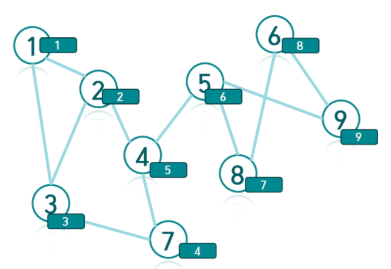




> Question

* Print all articulation point

```txt
Input:
7 7
1 4
4 5
5 1
1 6
6 7
2 7
7 3

Output:
3
1 6 7
```

> Solution

* Run DFS and memorize order



* For vertex a, there is no path between vertices before a and after a
* For root it's articulation point if it contains more than 2 child




```py
# Time: O(N + M)
import sys;input=sys.stdin.readline
sys.setrecursionlimit(99999)
V, E = map(int,input().split())
G = [set() for _ in range(10002)]
for _ in range(E):
  a,b = map(int,input().split())
  G[a].add(b)
  G[b].add(a)

discovered = [0]*10002
is_cut=set()
idx=0
def dfs(node, is_root):
  global idx
  idx += 1
  discovered[node] = ret = idx
  cnt = 0
  for i in G[node]:
    if discovered[i]:
      ret=min(ret,discovered[i])
      continue
    cnt+=1
    prev=dfs(i,False)
    ret = min(ret,prev)
    if discovered[node] <= prev and not is_root:
      is_cut.add(node)
  if is_root and cnt > 1:
    is_cut.add(node)
  return ret

for i in range(1, 1 + V):
  discovered[i] or dfs(i, True)

print(len(is_cut))
print(*sorted(is_cut))
```



