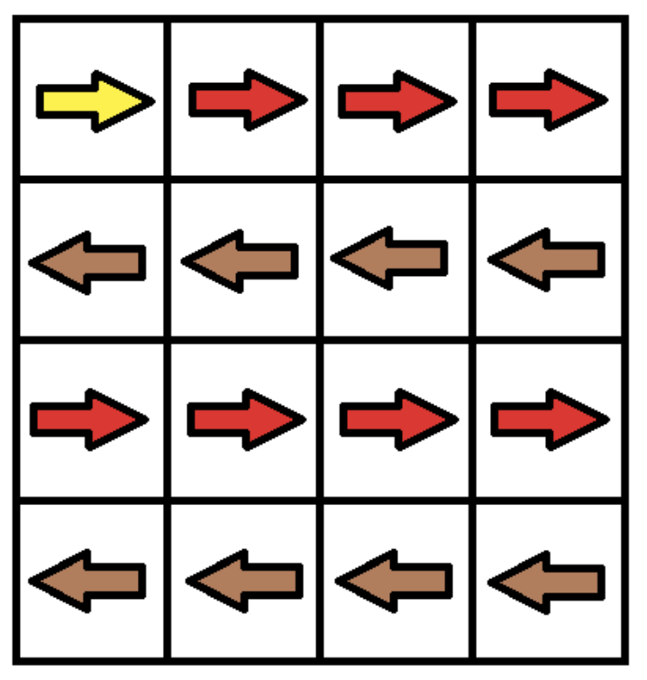




> Question



* Find minimum number of changes to make at least one valid path

```txt
Input:
grid =
[[1,1,1,1],
 [2,2,2,2],
 [1,1,1,1],
 [2,2,2,2]]
Output: 3
```




```py
def minCost(self, G: List[List[int]]) -> int:
  def neighborhood(r: int, c: int) -> Iterator[Tuple[int, int, int]]:
    if c + 1 < len(G[0]):
      yield r, c + 1, int(G[r][c] != 1)
    if c > 0:
      yield r, c - 1, int(G[r][c] != 2)
    if r + 1 < len(G):
      yield r + 1, c, int(G[r][c] != 3)
    if r > 0:
      yield r - 1, c, int(G[r][c] != 4)

  min_cost = collections.defaultdict(lambda: math.inf, {(0, 0): 0})
  dq = collections.deque([(0, 0, 0)])

  while dq:
    r, c, cost = dq.popleft()

    for r2, c2, step_cost in neighborhood(r, c):
      if (cost2 := cost + step_cost) < min_cost[r2, c2]:
        min_cost[r2, c2] = cost2
        if not step_cost:
          dq.appendleft((r2, c2, cost2))
        else:
          dq.append((r2, c2, cost2))

  return min_cost[(len(G) - 1, len(G[0]) - 1)]
```



