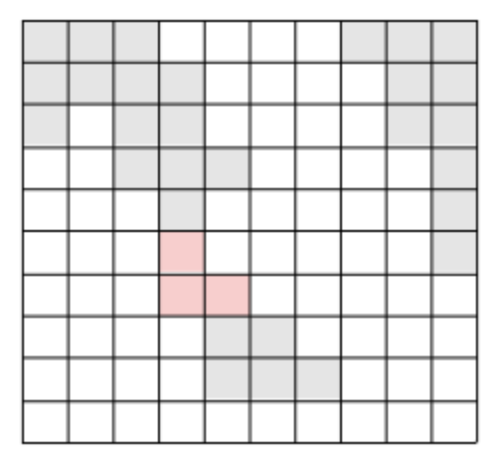




> Question



* Print length of shortest bridge

```txt
Input:
10
1 1 1 0 0 0 0 1 1 1
1 1 1 1 0 0 0 0 1 1
1 0 1 1 0 0 0 0 1 1
0 0 1 1 1 0 0 0 0 1
0 0 0 1 0 0 0 0 0 1
0 0 0 0 0 0 0 0 0 1
0 0 0 0 0 0 0 0 0 0
0 0 0 0 1 1 0 0 0 0
0 0 0 0 1 1 1 0 0 0
0 0 0 0 0 0 0 0 0 0

Output: 3
```




```py
import sys
from collections import deque
input = sys.stdin.readline
def floodfill(G, i, j, gid):
  q = deque([(i, j)])
  G[i][j] = gid
  while q:
    r, c = q.popleft()
    for nr, nc in [(r + 1, c), (r, c + 1), (r - 1, c), (r, c - 1)]:
      if 0 <= nr < len(G) and 0 <= nc < len(G) and G[nr][nc] == 1:
        G[nr][nc] = gid
        q.append((nr, nc))
def get_distance(G):
  loop = 0
  dq = deque([(r, c) for r in range(len(G)) for c in range(len(G)) if G[r][c] != 0])
  while dq:
    loop += 1
    for _ in range(len(dq)):
      r, c = dq.popleft()
      for nr, nc in [(r + 1, c), (r, c + 1), (r - 1, c), (r, c - 1)]:
        if 0 <= nr < len(G) and 0 <= nc < len(G):
          if G[nr][nc] == 0:
            G[nr][nc] = G[r][c]
            dq.append((nr, nc))
          elif G[nr][nc] < G[r][c]:
            return loop * 2 - 2
          elif G[nr][nc] > G[r][c]:
            return loop * 2 - 1
n = int(input())
G = [list(map(int, input().split())) for _ in range(n)]
gid = -1
for i in range(len(G)):
  for j in range(len(G)):
    if G[i][j] > 0:
      floodfill(G, i, j, gid)
      gid -= 1
print(get_distance(G))
```



