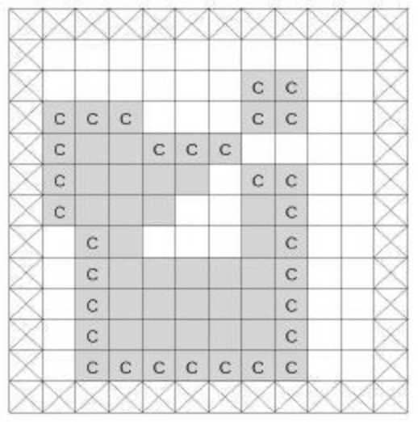




> Question



* Print time it takes to melt all cheese, right before last melt

```txt
Input:
13 12
0 0 0 0 0 0 0 0 0 0 0 0
0 0 0 0 0 0 0 0 0 0 0 0
0 0 0 0 0 0 0 1 1 0 0 0
0 1 1 1 0 0 0 1 1 0 0 0
0 1 1 1 1 1 1 0 0 0 0 0
0 1 1 1 1 1 0 1 1 0 0 0
0 1 1 1 1 0 0 1 1 0 0 0
0 0 1 1 0 0 0 1 1 0 0 0
0 0 1 1 1 1 1 1 1 0 0 0
0 0 1 1 1 1 1 1 1 0 0 0
0 0 1 1 1 1 1 1 1 0 0 0
0 0 1 1 1 1 1 1 1 0 0 0
0 0 0 0 0 0 0 0 0 0 0 0

Output:
3
5
```




```py
from copy import deepcopy
import collections
def bfs(G):
  dq, air = collections.deque([(0, 0)]), set([(0, 0)])
  while dq:
    r, c = dq.popleft()
    for nr, nc in [(r,c-1),(r,c+1),(r-1,c),(r+1,c)]:
      if 0 <= nr < len(G) and 0 <= nc < len(G[0]) and G[nr][nc] == 0 and (nr, nc) not in air:
        dq.append((nr, nc))
        air.add((nr, nc))
  return air
N, M = map(int, input().split())
G = [[0] * (M + 2)] + [[0] + list(map(int, input().split())) + [0] for _ in range(N)] + [[0] * (M + 2)]
cheeses = set([(r, c) for r in range(N + 2) for c in range(M + 2) if G[r][c] == 1])
count = 0
while len(cheeses):
  count += 1
  n_cheese = len(cheeses)
  air = bfs(G)

  for r, c in deepcopy(cheeses):
    if {(r + 1, c), (r - 1, c), (r, c - 1), (r, c + 1)} & air:
      G[r][c] = 0
      cheeses.remove((r, c))

print(count)
print(n_cheese)
```



