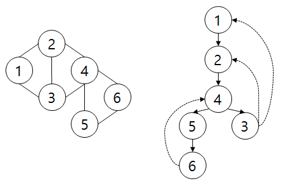




> Question

* Given undirected graph print all nodes that removes all cycle when is removed

```txt
Input:
4 5
1 2
2 3
4 2
4 3
3 1

Output: 5
```

> Solution

* Create BFS Tree






```cpp
#include <bits/stdc++.h>
using namespace std;
using ll = long long;

vector<int> adj[300005];

int d[300005], e = 1;
int cnt[300005];

int dfs(int i) {
  d[i] = e;
  int ret = e++;

  for (int j : adj[i]) {
    if (!d[j]) {
      int o = dfs(j);
      if (o >= d[i]) cnt[i]++;
      ret = min(ret, o);
    }
    else
      ret = min(ret, d[j]);
  }
  return ret;
}

int main() {
  ios::sync_with_stdio(false); cin.tie(0);

  int n, m; cin >> n >> m;
  for (int i = 0; i < m; i++) {
    int a, b;
    cin >> a >> b;
    adj[a].push_back(b);
    adj[b].push_back(a);
  }
  dfs(1);
  cnt[1]--;
  ll ans = 0;
  for (int i = 1; i <= n; i++)
    if (m - (int)adj[i].size() == n - cnt[i] - 2)
      ans += i;
  cout << ans;
}
```



