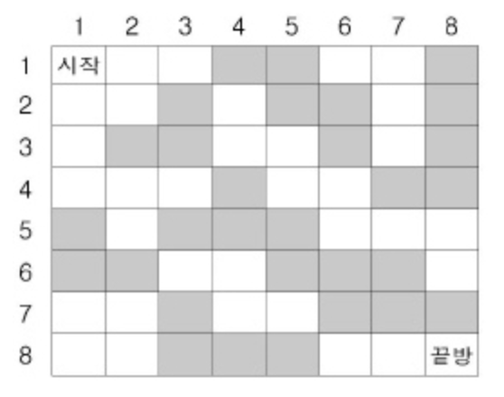




> Question



* Find minum number of rooms to convert

```txt
Input:
8
11100110
11010010
10011010
11101100
01000111
00110001
11011000
11000111

Output: 2
```




```py
from heapq import heappush, heappop
from collections import defaultdict
def dijkstra(G):
  dp = defaultdict(lambda : float('inf'), {(0, 0) : 0})
  heap = [(0, 0, 0)]
  while heap:
    w, r, c = heappop(heap)
    for nr, nc in [(r + 1, c), (r, c + 1), (r - 1, c), (r, c - 1)]:
      if 0 <= nr < len(G) and 0 <= nc < len(G):
        nw = w + (0 if G[r][c] == '1' else 1)
        if nw < dp[(nr, nc)]:
          dp[(nr, nc)] = nw
          heappush(heap, (nw, nr, nc))
  return dp
N = int(input())
G = [input() for _ in range(N)]
print(dijkstra(G)[(len(G) - 1, len(G) - 1)])
```



