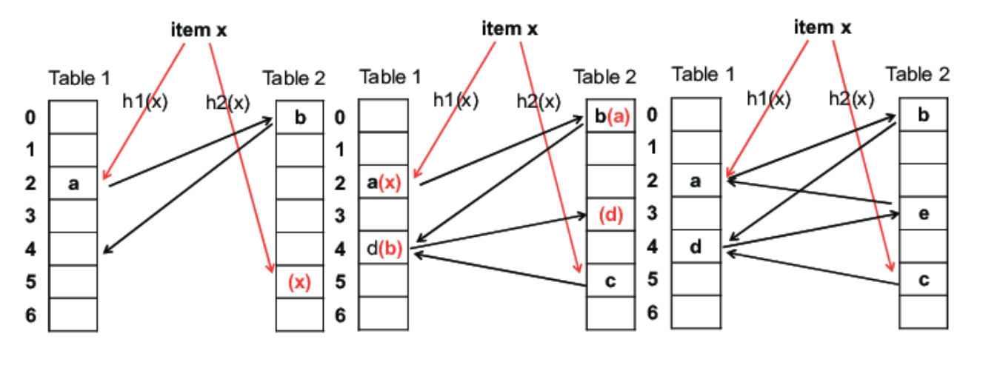

# Hash

| Term             | Meaning                                 |
| ---------------- | --------------------------------------- |
| Identity law     | $A \cup \varnothing=A$                  |
| Idempotent Law   | $A \cup A =A$                           |
| Domination Law   | $A \cup U =U$                           |
| Communtative Law | $A \cup B =B \cup A$                    |
| Associative Law  | $(A \cup B) \cup C = A \cup (B \cup C)$ |

> Bloom Filter (Burton Howard Bloom, 1970)

* space-efficient probabilistic data structure used to test whether an element is a member of a set
* False positive matches are possible, but false negatives are not

> Cuckoo hashing

* Use two hash functions
* O(1) : worst case insert / lookup



## Encoding




> hashlib

* implements a common interface to many different secure hash and message digest algorithms

* sha224(str_.encode()).hexdigest()




> baekjoon

* [Level 4 : SHA-512](http://acmicpc.net/problem/10932)
  * [Update solution](https://github.com/seanhwangg/algorithm/edit/main/data-structure/hash/encoding/BJ_10932.md)




> Question

* Find sha512 of string

```txt
Input: Baekjoon

Output:
40529e337a46dadc9473d7ed1b16c74868c996d79573c75784e6da37a51394abecfe26414e5097873c31de0dae0b1ef5dab7718d46aa629da3a72c80a0eeeef2
```




```py
from hashlib import *
print(sha512(input().encode()).hexdigest())
```




* [Level 4 : SHA-224](http://acmicpc.net/problem/10929)
  * [Update solution](https://github.com/seanhwangg/algorithm/edit/main/data-structure/hash/encoding/BJ_10929.md)




> Question

* Print sha224 hash of string

```txt
Input: Baekjoon
Output: 880ceaa24e932e5c19350adc50535922ead12ba689a7a6a9a895d2ce
```




```py
from hashlib import *
print(sha224(input().encode()).hexdigest())
```




* [Level 4 : SHA-1](http://acmicpc.net/problem/10928)
  * [Update solution](https://github.com/seanhwangg/algorithm/edit/main/data-structure/hash/encoding/BJ_10928.md)




> Question

* Print SHA1 hash of string

```txt
Input: Baekjoon
Output: a25cdb0b8ead2861a3ef2c48cdc15517994ab278
```




```py
from hashlib import *
print(sha1(input().encode()).hexdigest())
```




* [Level 4 : BASE64 인코딩](http://acmicpc.net/problem/10935)
  * [Update solution](https://github.com/seanhwangg/algorithm/edit/main/data-structure/hash/encoding/BJ_10935.md)




> Question

* BASE64-encodes given string

```txt
Input: Baekjoon
Output: QmFla2pvb24=
```




```py
import base64
print(base64.b64encode(input().encode()).decode())
```




* [Level 4 : SHA-384](http://acmicpc.net/problem/10931)
  * [Update solution](https://github.com/seanhwangg/algorithm/edit/main/data-structure/hash/encoding/BJ_10931.md)




> Question

* Print sha384 of given string

```txt
Input: Baekjoon
Output: 8f077fa785396c86c7f9b8ba03fc41e9ac250a0a3884a2ef5c70638e1a153407b52a58b897a89a0361f2c60c2dc123be
```




```py
from hashlib import *
print(sha384(input().encode()).hexdigest())
```




* [Level 4 : SH](http://acmicpc.net/problem/10934)
  * [Update solution](https://github.com/seanhwangg/algorithm/edit/main/data-structure/hash/encoding/BJ_10934.md)




> Question

* Find SHA hash of given string

```txt
Input: Baekjoon
Output: 961195ebcebfd957207288d6700b00fa6fe9db3c
```




```py
from hashlib import*
print(new('sha',input().encode()).hexdigest())
```




* [Level 13 : if 3](http://acmicpc.net/problem/15551)
  * [Update solution](https://github.com/seanhwangg/algorithm/edit/main/data-structure/hash/encoding/BJ_15551.md)




> Question

* Print a, b that prints true to the following code

```txt
Input: 2
import java.util.*;

public class Main {
  public static void main(String args[]) {
    Scanner sc = new Scanner(System.in);
    String a = sc.next();
    String b = sc.next();
    if (!a.equals(b) && a.hashCode() == b.hashCode()) {
      System.out.println("true");
    } else {
      System.out.println("false");
    }
  }
}
```




```java
import java.util.*;

public class Main {
  public static void main(String args[]) {
    Scanner sc = new Scanner(System.in);
    String a = sc.next();
    String b = sc.next();
    if (!a.equals(b) && a.hashCode() == b.hashCode()) {
      System.out.println("true");
    } else {
      System.out.println("false");
    }
  }
}
```




```py
N = int(input())
print("A" * (N-2) + "BA")
print("A" * (N-1) + "`")
```




## Decoding

> baekjoon

* [Level 4 : BASE64 디코딩](http://acmicpc.net/problem/10936)
  * [Update solution](https://github.com/seanhwangg/algorithm/edit/main/data-structure/hash/decoding/BJ_10936.md)




> Question

* Decode given BASE64 encoded string

```txt
Input: QmFla2pvb24=
Output: Baekjoon
```




```py
import base64
print(base64.b64decode(input()).decode())
```




* [Level 4 : BASE32 디코딩](http://acmicpc.net/problem/10939)
  * [Update solution](https://github.com/seanhwangg/algorithm/edit/main/data-structure/hash/decoding/BJ_10939.md)




> Question

* Decode given BASE64 encoded string

```txt
Input: IJQWK23KN5XW4===
Output: Baekjoon
```




```py
import base64
print(base64.b32decode(input()).decode())
```




* [Level 4 : BASE16 디코딩](http://acmicpc.net/problem/10941)
  * [Update solution](https://github.com/seanhwangg/algorithm/edit/main/data-structure/hash/decoding/BJ_10941.md)




> Question

* Decode given BASE64 encoded string

```txt
Input: 4261656B6A6F6F6E
Output: Baekjoon
```




```cpp
#include <cstdio>
int main(){
  int n;
  while(scanf("%2X",&n)!=EOF)
    printf("%c",n);
}
```




```py
import base64
print(base64.b16decode(input()).decode())
```




## Set




* length
* add()
* clear()
* delete(`value`) : Delete `value` in set
* has(`value`) : Check existance of `value` in set

```js
// 1. Basic example
var set = new Set();
new Set([1, 2, 3, 4, 5]);

// 2. Remove duplicate in array
const numbers = [2,3,4,4,2,3,3,4,4,5,5,6,6,7,5,32,3,4,5]
console.log([...new Set(numbers)])
```




> baekjoon

* [Level 4 : 나머지](http://acmicpc.net/problem/3052)
  * [Update solution](https://github.com/seanhwangg/algorithm/edit/main/data-structure/hash/set/BJ_3052.md)




> Question

* After receiving 10 inputs, divide them by 42 to find the remainder
* Then write a program that prints out how many different values there are

```txt
Input:
1
2
3
4
5
6
7
8
9
10

Output: 10
```




```py
st = set()
for i in range(10):
  st.add(int(input()) % 42)
print(len(st))
```




* [Level 4 : 아름다운 수](http://acmicpc.net/problem/2774)
  * [Update solution](https://github.com/seanhwangg/algorithm/edit/main/data-structure/hash/set/BJ_2774.md)




> Question

* Find number of unique numbers

```txt
Input:
3
1
1
2

Output: 2
```




```cpp
#include <bits/stdc++.h>
using namespace std;

int main() {
  int T; cin >> T;
  while (T--) {
    unordered_set<char> result;
    string x; cin >> x;
    for (int i = 0; i < x.size(); i++)
      result.insert(x[i]);
    cout << result.size() << '\n';
  }
  return 0;
}
```




```py
for _ in range(int(input())):
  print(len(set(input())))
```




* [Level 5 : 피시방 알바](http://acmicpc.net/problem/1453)
  * [Update solution](https://github.com/seanhwangg/algorithm/edit/main/data-structure/hash/set/BJ_1453.md)




> Question

* Find number of duplicated ints

```txt
Input:
4
1 2 3 3

Output: 1
```




```py
input()
li = list(map(int, input().split()))
print(len(li) - len(set(li)))
```




* [Level 7 : 수 찾기](http://acmicpc.net/problem/1920)
  * [Update solution](https://github.com/seanhwangg/algorithm/edit/main/data-structure/hash/set/BJ_1920.md)




> Question

* N integers A[1], A[2], …When given an A[N], write a program to find out if an integer named X exists in it

```txt
Input:
5
4 1 5 2 3
5
1 3 7 9 5

Output:
1
1
0
0
1
```




```cpp
#include <bits/stdc++.h>
using namespace std;

int n;
set<int> se;

int main(){
  scanf("%d", &n);
  for(int x; n--; ){
    scanf("%d", &x);
    se.insert(x);
  }
  scanf("%d", &n);
  for(int x; n--; ){
    scanf("%d", &x);
    printf("%d\n", se.find(x) != se.end());
  }
}
```




```py
input()
a = set(input().split())
input()
for i in input().split():
  print(int(i in a))
```




* [Level 7 : 숫자 카드](http://acmicpc.net/problem/10815)
  * [Update solution](https://github.com/seanhwangg/algorithm/edit/main/data-structure/hash/set/BJ_10815.md)




> Question

* Check if second list have common number with first list

```txt
Input:
5
6 3 2 10 -10
8
10 9 -5 2 3 4 5 -10

Output: 1 0 0 1 1 0 0 1
```




```py
input()
se = set(map(int, input().split()))
input()
for n in map(int, input().split()):
  print(1 if n in se else 0)
```




* [Level 7 : 듣보잡](http://acmicpc.net/problem/1764)
  * [Update solution](https://github.com/seanhwangg/algorithm/edit/main/data-structure/hash/set/BJ_1764.md)




> Question

* Find intersection of two sets

```txt
Input:
3 4
ohhenrie
charlie
baesangwook
obama
baesangwook
ohhenrie
clinton

Output:
2
baesangwook
ohhenrie
```




```py
n, m = map(int, input().split())
hear = set(input() for _ in range(n))
watch = set(input() for _ in range(m))
print(len(hear & watch))
print("\n".join(sorted(hear & watch)))
```




* [Level 7 : 차집합](http://acmicpc.net/problem/1822)
  * [Update solution](https://github.com/seanhwangg/algorithm/edit/main/data-structure/hash/set/BJ_1822.md)




> Question

* There are two sets of natural numbers, A and B
* Find all elements belonging to set A but not to set B

```txt
Input:
4 3
2 5 11 7
9 7 4

Output:
3
2 5 11
```




```py
N, M = map(int, input().split())
A = set(map(int, input().split()))
B = set(map(int, input().split()))
li = list(sorted(A - B))
print(len(li))
print(*li)
```




* [Level 8 : 문자열 집합](http://acmicpc.net/problem/14425)
  * [Update solution](https://github.com/seanhwangg/algorithm/edit/main/data-structure/hash/set/BJ_14425.md)




> Question

* 입력으로 주어지는 M개의 문자열 중에서 집합 S에 포함되어 있는 것이 총 몇 개인지 구하는 프로그램을 작성하시오

```txt
Input:
5 11
baekjoononlinejudge
startlink
codeplus
sundaycoding
codingsh
baekjoon
codeplus
codeminus
startlink
starlink
sundaycoding
codingsh
codinghs
sondaycoding
startrink
icerink

Output: 4
```




```py
n,m = map(int,input().split())
cnt = 0
strings = set(input() for i in range(n))
for j in range(m):
  if input() in strings:
    cnt += 1
print(cnt)
```




* [Level 8 : 암기왕](http://acmicpc.net/problem/2776)
  * [Update solution](https://github.com/seanhwangg/algorithm/edit/main/data-structure/hash/set/BJ_2776.md)




> Question

* Check if number in the second list is in the first list

```txt
Input:
1
5
4 1 5 2 3
5
1 3 7 9 5

Output:
1
1
0
0
1
```




```py
for _ in range(int(input())):
  input()
  s = set(input().split())
  input()
  for c in input().split():
    print(1 if c in s else 0)
```




* [Level 8 : 대칭 차집합](http://acmicpc.net/problem/1269)
  * [Update solution](https://github.com/seanhwangg/algorithm/edit/main/data-structure/hash/set/BJ_1269.md)




> Question

* Print number of unique element that doesn't exist in other list

```txt
Input:
3 5
1 2 4
2 3 4 5 6

Output: 4
```




```py
input()
a = set(map(int, input().split()))
b = set(map(int, input().split()))
print(len(a - b) + len(b - a))
```




> kattis

* [Level 1.3 : Modulo](https://open.kattis.com/problems/modulo)
  * [Update solution](https://github.com/seanhwangg/algorithm/edit/main/data-structure/hash/set/KT_modulo.md)

[//]: # (BJ_3052)

* [Level 1.4 : I've Been Everywhere, Man](https://open.kattis.com/problems/everywhere)
  * [Update solution](https://github.com/seanhwangg/algorithm/edit/main/data-structure/hash/set/KT_everywhere.md)




> Question

* 첫 줄에 테스트 케이스 수
* 각 테스트 케이스는 N 과 N개의 줄에 도시이름이 주어진다. 이 때 다른 도시 개수를 출력하라

```txt
Input:
2
7
saskatoon
toronto
winnipeg
toronto
vancouver
saskatoon
toronto
3
edmonton
edmonton
edmonton

Output:
4
1
```




```py
n_test = int(input())
for _ in range(n_test):
  N = int(input())
  se = set()
  for _ in range(N):
    se.add(input())
  print(len(se))
```




* [Level 1.4 : ICPC Awards](https://open.kattis.com/problems/icpcawards)
  * [Update solution](https://github.com/seanhwangg/algorithm/edit/main/data-structure/hash/set/KT_icpcawards.md)




> Question

* 첫 줄에는 N, 다음 N 줄엔 대학이름 팀이름이 순위대로 주어진다
* 상을 받는 상위 12팀 이름을 출력하라, 단 한 대학에서는 한 팀만 상을 받을 수 있다

```txt
Input:
30
Seoul ACGTeam
VNU LINUX
SJTU Mjolnir
VNU WINDOWS
NTU PECaveros
HUST BKJuniors
HCMUS HCMUSSerendipity
VNU UBUNTU
SJTU Metis
HUST BKDeepMind
HUST BKTornado
HCMUS HCMUSLattis
NUS Tourism
VNU DOS
HCMUS HCMUSTheCows
VNU ANDROID
HCMUS HCMUSPacman
HCMUS HCMUSGeomecry
UIndonesia DioramaBintang
VNU SOLARIS
UIndonesia UIChan
FPT ACceptable
HUST BKIT
PTIT Miners
PSA PSA
DaNangUT BDTTNeverGiveUp
VNU UNIXBSD
CanTho CTUA2LTT
Soongsil Team10deung
Soongsil BezzerBeater

Output:
Seoul ACGTeam
VNU LINUX
SJTU Mjolnir
NTU PECaveros
HUST BKJuniors
HCMUS HCMUSSerendipity
NUS Tourism
UIndonesia DioramaBintang
FPT ACceptable
PTIT Miners
PSA PSA
DaNangUT BDTTNeverGiveUp
```




```py
N = int(input())
seen = set()
for _ in range(N):
  uni, team = input().split()
  if uni not in seen and len(seen) < 12:
    print(uni, team)
  seen.add(uni)
```




* [Level 1.4 : No Duplicates](https://open.kattis.com/problems/nodup)
  * [Update solution](https://github.com/seanhwangg/algorithm/edit/main/data-structure/hash/set/KT_nodup.md)




> Question

* 문장이 주어지는데, 문장에서 같은 단어가 두번 이상 등장하면 no 모든 단어가 한번 등장하면 yes를 출력하라

```txt
Input: THE RAIN IN SPAIN
Output: yes
```




```py
li = input().split()
print("yes" if len(set(li)) == len(li) else "no")
```




* [Level 1.8 : Secure Doors](https://open.kattis.com/problems/securedoors)
  * [Update solution](https://github.com/seanhwangg/algorithm/edit/main/data-structure/hash/set/KT_securedoors.md)




> Question

* 첫줄에 N이 주어지고 그 다음 N줄에 방명록이 주어진다
* 방명록은 입장 이름 / 퇴장 이름과 같은 형식으로 주어지는데,
* 이 때 퇴장 전 입장을 여러번 했거나 입장 하지 않았는데 퇴장 한 경우는 (ANOMALY)를 출력한다

```txt
Input:
8
entry Abbey
entry Abbey
exit Abbey
entry Tyrone
exit Mason
entry Demetra
exit Latonya
entry Idella

Output:
Abbey entered
Abbey entered (ANOMALY)
Abbey exited
Tyrone entered
Mason exited (ANOMALY)
Demetra entered
Latonya exited (ANOMALY)
Idella entered
```




```py
N = int(input())
se = set()
for _ in range(N):
  typ, name = input().split()
  if typ == 'entry':
    if name in se:
      print(name, 'entered', '(ANOMALY)')
    else:
      print(name, 'entered')
      se.add(name)
  else:
    if name in se:
      print(name, 'exited')
      se.remove(name)
    else:
      print(name, 'exited', ('(ANOMALY)' if name not in se else ''))
```




* [Level 1.8 : Booking a Room](https://open.kattis.com/problems/bookingaroom)
  * [Update solution](https://github.com/seanhwangg/algorithm/edit/main/data-structure/hash/set/KT_bookingaroom.md)




> Question

* 첫 줄에 a, b가 주어진다. 이 때 a는 총 방의 개수이다. (1...n)
* 다음 b 줄에 예약된 방 번호가 주어진다
* 이때 아무 빈 방을 출력하라
* 빈 방이 없을 시 too late을 출력하라

```txt
Input:
100 5
42
3
2
99
1

Output: 23
```




```py
a, b = map(int, input().split())
se = set()
for _ in range(b):
  se.add(int(input()))
for i in range(1, a + 1):
  if i not in se:
    print(i)
    break
else:
  print("too late")
```




* [Level 2.2 : What does the fox say?](https://open.kattis.com/problems/whatdoesthefoxsay)
  * [Update solution](https://github.com/seanhwangg/algorithm/edit/main/data-structure/hash/set/KT_whatdoesthefoxsay.md)




> Question

* 한 테스트 마다, 띄어쓰기로 나누어진 울음 소리 / animal says ~ / what does the fox say? 가 나온다
* 이때 다른 동물이 내지 않은 울음소리를 모두 출력하라

```txt
Input:
1
toot woof wa ow ow ow pa blub blub pa toot pa blub pa pa ow pow toot
dog goes woof
fish goes blub
elephant goes toot
seal goes ow
what does the fox say?

Output: wa pa pa pa pa pa pow
```




```py
n_test = int(input())
for _ in range(n_test):
  li = input().split()
  s = input()
  ignore = set()
  while s != 'what does the fox say?':
    ignore.add(s.split()[-1])
    s = input()
  for e in li:
    if e not in ignore:
      print(e, end=' ')
```




> leetcode

* [Level Easy : Design HashSet](https://leetcode.com/problems/design-hashset)
  * [Update solution](https://github.com/seanhwangg/algorithm/edit/main/data-structure/hash/set/LC_705.md)




> Question

* Design hashset

```txt
Input:
["MyHashSet", "add", "add", "contains", "contains", "add", "contains", "remove", "contains"]
[[], [1], [2], [1], [3], [2], [2], [2], [2]]

Output: [null, null, null, true, false, null, true, null, false]
```




```py
class MyHashSet:
  def __init__(self):
    self.set = [False] * 197431

  def add(self, key: int) -> None:
    self.set[key % 197431] = True

  def remove(self, key: int) -> None:
    self.set[key % 197431] = False

  def contains(self, key: int) -> bool:
    return self.set[key % 197431]
```




* [Level Easy : Contains Duplicate](https://leetcode.com/problems/contains-duplicate)
  * [Update solution](https://github.com/seanhwangg/algorithm/edit/main/data-structure/hash/set/LC_217.md)




> Question

* Check whether list has duplicates in it

```txt
Input: nums = [1,2,3,4]
Output: false
```




```js
var containsDuplicate = function(nums) {
  return new Set(nums).size < nums.length;
};
```




```py
def containsDuplicate(self, nums):
  return len(nums) != len(set(nums))
```




### Multiset

> leetcode

* [Level Easy : Valid Anagram](https://leetcode.com/problems/valid-anagram)
  * [Update solution](https://github.com/seanhwangg/algorithm/edit/main/data-structure/hash/multiset/LC_242.md)




> Question

* Given two strings s and t, return true if t is an anagram of s, and false otherwise

```txt
Input: s = "anagram", t = "nagaram"
Output: true
```




```cpp
bool isAnagram(string s, string t) {
  return unordered_multiset<char>(begin(s), end(s)) == unordered_multiset<char>(begin(t), end(t));
}
```




### Ordered Set

* Natively supported in c++ (Implemented in BST)

> baekjoon

* [Level 6 : 회사에 있는 사람](http://acmicpc.net/problem/7785)
  * [Update solution](https://github.com/seanhwangg/algorithm/edit/main/data-structure/hash/ordered-set/BJ_7785.md)




> Question

* n access records given, each person's name, and either "enter" or "leave". "enter"
* Print all people in office

```txt
Input:
4
Baha enter
Askar enter
Baha leave
Artem enter

Output:
Askar
Artem
```




```cpp
#include<bits/stdc++.h>
using namespace std;

int main() {
  int n; cin >> n;

  set<string> st;
  while (n--) {
    string nm, a; cin >> nm >> a;
    if (a[0] == 'e')
      st.insert(nm);
    else
      st.erase(nm);
  }

  for (auto it = st.rbegin(); it != st.rend(); it++)
    cout << *it << '\n';

  return 0;
}
```




```py
import sys
input = sys.stdin.readline
people = set()
for _ in range(int(input())):
  name, act = input().split()
  if act == "enter":
    people.add(name)
  else:
    people.remove(name)
print("\n".join(sorted(people, reverse=True)))
```




* [Level 6 : 중복 빼고 정렬하기](http://acmicpc.net/problem/10867)
  * [Update solution](https://github.com/seanhwangg/algorithm/edit/main/data-structure/hash/ordered-set/BJ_10867.md)




> Question

* Print in unique element in ascending order

```txt
Input:
10
1 4 2 3 1 4 2 3 1 2

Output: 1 2 3 4
```




```cpp
#include <iostream>
#include <set>

using namespace std;

int main() {
  int n, a;
  cin >> n;
  set<int> S;
  while (n--) {
    cin >> a;
    S.insert(a);
  }
  for (auto c : S) cout << c << " ";
}
```




```py
input()
print(*sorted(set(map(int, input().split()))))
```




## Map




* Map object holds key-value pairs and remembers the original insertion order of the keys

```js
// 1. CRUD Object
var person = {firstName:"John", lastName:"Doe", age:50};
var person = new Object();
person.firstName = "John";
person.lastName = "Doe";
person.age = 50;

obj.[key] || 0           // Use default
delete dict[entry[0]]    // Delete Keys
Object.keys(obj).reduce((a, b) => obj[a] > obj[b] ? a : b);    // Get the largest keys
delete query["obsolte"];

// 2. Merge Object using spread operator
var obj2 = { foo: 'baz', y: 13 };
var mergedObj = { ...obj1, ...obj2 };                    // merge objects

const person = {firstName: “sean”, lastName: “hwang”}   // Destruct object

Object.keys(myObject).length                            // Iterate key value
Object.entries(obj).forEach(([key, value]) => { console.log(key, value); });

where: {
  ...(params.val && {key : val}), // optional key
}

// 3. Destructuring
const {firstName: fn, lastName: ln} = person
console.log(`${fn} ${ln}`)
let [first, last] = ['sean', 'hwang']    // Destruct Array
console.log(first);
```




> baekjoon

* [Level 3 : 학점계산](http://acmicpc.net/problem/2754)
  * [Update solution](https://github.com/seanhwangg/algorithm/edit/main/data-structure/hash/map/BJ_2754.md)




> Question

* Given letter score, print GPA

```txt
Input: A0
Output: 4.0
```




```cpp
#include <iostream>
using namespace std;

int main() {
  char a, b; cin >> a >> b;
  cout.precision(1);
  if (a != 'F')
    cout << fixed << (4 - (a - 'A') + (b == '+' ? 0.3 : (b == '0' ? 0 : -0.3)));
  else
    cout << "0.0";
}
```




```py
GPA = {'A+': 4.3, 'A0': 4.0, 'A-': 3.7, 'B+': 3.3, 'B0': 3.0, 'B-': 2.7, 'C+': 2.3, 'C0': 2.0, 'C-': 1.7,
      'D+': 1.3, 'D0': 1.0, 'D-': 0.7, 'F': 0.0}
print(GPA[str(input())])
```




* [Level 3 : Just A Minim](http://acmicpc.net/problem/15036)
  * [Update solution](https://github.com/seanhwangg/algorithm/edit/main/data-structure/hash/map/BJ_15036.md)




> Question

| Code | Name       | Length     |
| ---- | ---------- | ---------- |
| 0    | breve      | 2 notes    |
| 1    | semibreve  | 1 notes    |
| 2    | minim      | 1/2 notes  |
| 4    | crotchet   | 1/4 notes  |
| 8    | quaver     | 1/8 notes  |
| 16   | semiquaver | 1/16 notes |

* Given n codes, find sum of length

```txt
Input:
10
1 2 2 2 1 4 4 8 8 16

Output: 4.3125
```




```py
code2len = {0 : 2, 1: 1, 2: 1/2, 4 : 1/4, 8 : 1/8, 16 : 1/16}
input()
total = 0
for i in map(int, input().split()):
  total += code2len[i]
print(total)i
```




* [Level 3 : 팩토리얼 진법](http://acmicpc.net/problem/5692)
  * [Update solution](https://github.com/seanhwangg/algorithm/edit/main/data-structure/hash/map/BJ_5692.md)




> Question

* The factorial calculates the value of digit i as ai×i!
* When given a number written in the factorial, obtain the value read in decimal

```txt
Input:
719
1
15
110
102
0

Output:
53
1
7
8
8
```




```py
import sys
input = sys.stdin.readline
base = [1, 2, 6, 24, 120]
while True:
  n = int(input())
  if not n:
    break
  factorial, result = 0, 0
  while n:
    result += ((n % 10) * base[factorial])
    factorial += 1
    n //= 10
  print(result)
```




* [Level 4 : DNA 해독](http://acmicpc.net/problem/1672)
  * [Update solution](https://github.com/seanhwangg/algorithm/edit/main/data-structure/hash/map/BJ_1672.md)




> Question

* Given rules print result sequence

```txt
Input:
6
AAGTCG

Output: A
```

| Before | After |
| ------ | ----- |
| 'AA'   | 'A',  |
| 'AG'   | 'C',  |
| 'AC'   | 'A',  |
| 'AT'   | 'G',  |
| 'GA'   | 'C',  |
| 'GG'   | 'G',  |
| 'GC'   | 'T',  |
| 'GT'   | 'A',  |
| 'CA'   | 'A',  |
| 'CG'   | 'T',  |
| 'CC'   | 'C',  |
| 'CT'   | 'G',  |
| 'TA'   | 'G',  |
| 'TG'   | 'A',  |
| 'TC'   | 'G',  |
| 'TT'   | 'T',  |




```py
m = {
  'AA': 'A',
  'AG': 'C',
  'AC': 'A',
  'AT': 'G',
  'GA': 'C',
  'GG': 'G',
  'GC': 'T',
  'GT': 'A',
  'CA': 'A',
  'CG': 'T',
  'CC': 'C',
  'CT': 'G',
  'TA': 'G',
  'TG': 'A',
  'TC': 'G',
  'TT': 'T',
}
input()
s = input()
while len(s) > 1:
  s = s[:-2] + m[s[-2:]]
print(s)
```




* [Level 4 : Hashing](http://acmicpc.net/problem/15829)
  * [Update solution](https://github.com/seanhwangg/algorithm/edit/main/data-structure/hash/map/BJ_15829.md)




> Question

* It is common for r and M to be determined as small numbers
* r is 31 and the value of M is 1234567891

$$
H=\sum_{i=0}^{l-1} a_{i} r^{i} \quad \bmod M
$$

```txt
Input:
5
abcde

Output: 4739715
```




```py
n = int(input())
st = (input())
has = 0
for i, ch in enumerate(st):
  has = (has + 31 ** i * (ord(ch) - ord('a') + 1)) % 1234567891
print(has)
```




* [Level 4 : 문자열 분석](http://acmicpc.net/problem/10820)
  * [Update solution](https://github.com/seanhwangg/algorithm/edit/main/data-structure/hash/map/BJ_10820.md)




> Question

* Find the number of lowercase letters, uppercase letters, numbers, and spaces in the string

```txt
Input:
This is String
SPACE    1    SPACE
 S a M p L e I n P u T
0L1A2S3T4L5I6N7E8

Output:
10 2 0 2
0 10 1 8
5 6 0 16
0 8 9 0
```




```py
import sys
while True:
  line = sys.stdin.readline().rstrip('\n')
  up, lo, sp, nu = 0, 0, 0, 0
  if not line:
    break
  for l in line:
    if l.isupper():
      up += 1
    elif l.islower():
      lo += 1
    elif l.isdigit():
      nu += 1
    elif l.isspace():
      sp += 1
  print(f"{lo} {up} {nu} {sp}")
```




* [Level 6 : 욕심쟁이 돼지](http://acmicpc.net/problem/3060)
  * [Update solution](https://github.com/seanhwangg/algorithm/edit/main/data-structure/hash/map/BJ_3060.md)




> Question

* The pigs want to eat current amount + the pig sitting on both sides of them + sitting across
* Save the day when Hyun-soo cannot meet the demands of the six pigs when given the amount the pigs ate on the first day

```txt
Input:
2
21
1 2 3 4 5 6
21
1 2 3 4 5 7

Output:
2
1
```




```py
from copy import copy
for _ in range(int(input())):
  total = int(input())
  li = list(map(int, input().split()))
  for d in range(1, 100000):
    if sum(li) > total:
      print(d)
      break
    old = copy(li)
    for i in range(6):
      li[i] = old[i] + old[(i + 1) % 6] + old[(i + 3) % 6] + old[(i + 5) % 6]
```




* [Level 6 : DNA](https://www.acmicpc.net/problem/1969)
  * [Update solution](https://github.com/seanhwangg/algorithm/edit/main/data-structure/hash/map/BJ_1969.md)




> Question

* Output the DNA with the smallest sum of Hamming Distance on the first line, and Hamming Distance on the second line
* When there are multiple such DNA, the first one is printed alphabetically

```txt
Input:
5 8
TATGATAC
TAAGCTAC
AAAGATCC
TGAGATAC
TAAGATGT

Output:
TAAGATAC
7
```




```py
n, m = map(int, input().split())
dna = [input().strip() for _ in range(n)]
dna_to_num = {'A':0, 'C':1, 'G':2, 'T':3}
res = ''
cnt = 0
for d in range(m):
  check = [0] * 4
  for i in range(n):
    check[dna_to_num[dna[i][d]]] += 1
  max_dna = max(check)
  max_dna_idx = check.index(max_dna)
  res += "ACGT"[max_dna_idx]
  check[max_dna_idx] = 0
  cnt += sum(check)
print(res)
print(cnt)
```




* [Level 7 : 비밀번호 찾기](http://acmicpc.net/problem/17219)
  * [Update solution](https://github.com/seanhwangg/algorithm/edit/main/data-structure/hash/map/BJ_17219.md)




> Question

* The first line is given the number of stored site addresses N (< 100,000) and the number of site addresses M (< 100,000)
* find the password for each website from the notepad

```txt
Input:
16 4
noj.am IU
acmicpc.net UAENA
startlink.io THEKINGOD
google.com ZEZE
nate.com VOICEMAIL
naver.com REDQUEEN
daum.net MODERNTIMES
utube.com BLACKOUT
zum.com LASTFANTASY
dreamwiz.com RAINDROP
hanyang.ac.kr SOMEDAY
dhlottery.co.kr BOO
duksoo.hs.kr HAVANA
hanyang-u.ms.kr OBLIVIATE
yd.es.kr LOVEATTACK
mcc.hanyang.ac.kr ADREAMER
startlink.io
acmicpc.net
noj.am
mcc.hanyang.ac.kr

Output:
THEKINGOD
UAENA
IU
ADREAMER
```




```py
N, Q = map(int, input().split())
site2pw = {}
for _ in range(N):
  site, pw = input().split()
  site2pw[site] = pw
for _ in range(Q):
  print(site2pw[input()])
```




* [Level 7 : 나는야 포켓몬 마스터 이다솜](http://acmicpc.net/problem/1620)
  * [Update solution](https://github.com/seanhwangg/algorithm/edit/main/data-structure/hash/map/BJ_1620.md)




> Question

* If a number is entered as an input, you can print the name of the Pokémon corresponding to the number
* If a letter is received, you can print the number corresponding to the Pokémon's name

```txt
Input:
26 5
Bulbasaur
Ivysaur
Venusaur
Charmander
Charmeleon
Charizard
Squirtle
Wartortle
Blastoise
Caterpie
Metapod
Butterfree
Weedle
Kakuna
Beedrill
Pidgey
Pidgeotto
Pidgeot
Rattata
Raticate
Spearow
Fearow
Ekans
Arbok
Pikachu
Raichu
25
Raichu
3
Pidgey
Kakuna

Output:
Pikachu
26
Venusaur
16
14
```




```py
import sys
input = sys.stdin.readline
n, m = map(int, input().split())
names = []
name2i = {}
for i in range(n):
  name = input().strip()
  names.append(name)
  name2i[name] = i

for _ in range(m):
  i = input().strip()
  if i.isdigit():
    print(names[int(i) - 1])
  else:
    print(name2i[i] + 1)
```




* [Level 10 : HTML](http://acmicpc.net/problem/6581)
  * [Update solution](https://github.com/seanhwangg/algorithm/edit/main/data-structure/hash/map/BJ_6581.md)




> Question

* When you read the \<br\> tag, you start a new line
* If you read the \<hr\> tag, start a new line if it is not already first part of line, and enter '-' 80 characters per line
* After that, start a new line again

```txt
Input:
Hallo, dies ist eine
ziemlich lange Zeile, die in Html
aber nicht umgebrochen wird.
<br>
Zwei <br> <br> produzieren zwei Newlines.
Es gibt auch noch das tag <hr> was einen Trenner darstellt.
Zwei <hr> <hr> produzieren zwei Horizontal Rulers.
Achtung       mehrere Leerzeichen irritieren

Html genauso wenig wie

mehrere Leerzeilen.

Output:
Hallo, dies ist eine ziemlich lange Zeile, die in Html aber nicht umgebrochen
wird.
Zwei

produzieren zwei Newlines. Es gibt auch noch das tag
--------------------------------------------------------------------------------
was einen Trenner darstellt. Zwei
--------------------------------------------------------------------------------
--------------------------------------------------------------------------------
produzieren zwei Horizontal Rulers. Achtung mehrere Leerzeichen irritieren Html
genauso wenig wie mehrere Leerzeilen.
```




```py
import sys
lines = sys.stdin.read().split()
for i, line in enumerate(lines):
  if line == "<br>":
    print()
  elif line == "<hr>":
    if i != 0 and lines[i-1] not in ("<br>", "<hr>"):
      print()
    print("-" * 80)
  else:
    print(line, end=" ")
```




* [Level 13 : Black and White](http://acmicpc.net/problem/11467)
  * [Update solution](https://github.com/seanhwangg/algorithm/edit/main/data-structure/hash/map/BJ_11467.md)




> Question

* Given you observed N data (id, position) from 0, 1 map
* Print minimum number of crossing

```txt
Input:
8
3 1
3 0
6 0
2 1
4 1
3 0
4 0
3 1

Output: 3
```




```py
di=dict()
a = 0

for i in range(int(input())):
  x, y = map(int, input().split())
  if x in di and di[x] != y:
    a += 1
  di[x] = y

print(a)
```




> kattis

* [Level 1.3 : Bela](https://open.kattis.com/problems/bela)
  * [Update solution](https://github.com/seanhwangg/algorithm/edit/main/data-structure/hash/map/KT_bela.md)




> Question

* 첫 줄의 N과 B이 주어진다
* 그 다음 N줄에 Value, Suit 이 주어지는데,
* Suit 이 B와 같을 시 Dominant, 다를 시 Not dominant 점수를 얻는다. 총 합을 출력하라

```txt
Input:
2 S
TH
9C
KS
QS
JS
TD
AD
JH

Output: 60
```




```py
n_line, suit = input().split()
n_line = int(n_line)
dic = {'A': (11, 11), 'K': (4, 4), 'Q': (3, 3), 'J':(20, 2), 'T': (10, 10), '9': (14, 0), '8' : (0, 0), '7': (0, 0)}
ret = 0
for _ in range(n_line * 4):
  card = input()
  if card[1] == suit:
    ret += dic[card[0]][0]
  else:
    ret += dic[card[0]][1]
print(ret)
```




* [Level 1.5 : Synchronizing Lists](https://open.kattis.com/problems/synchronizinglists)
  * [Update solution](https://github.com/seanhwangg/algorithm/edit/main/data-structure/hash/map/KT_synchronizinglists.md)




> Question

* For each test case, print out the second list so that it has same ordering as first list, with a blank line between lists

```txt
Input:
4
10
67
68
28
55
73
10
6
7
98
23
61
49
1
79
9
1
15
32
47
68
39
24
0

Output:
6
55
73
10

68
24
39
32
1
47
15
```




```py
while True:
  n = int(input())

  if n == 0:
    break

  l1 = [int(input()) for _ in range(n)]
  l2 = list(sorted([int(input()) for _ in range(n)]))
  rank = {}
  for i, e in enumerate(sorted(l1)):
    rank[e] = i
  for e in l1:
    print(l2[rank[e]])
  print()
```




* [Level 1.8 : Parking](https://open.kattis.com/problems/parking)
  * [Update solution](https://github.com/seanhwangg/algorithm/edit/main/data-structure/hash/map/KT_parking.md)




> Question

* 직선으로 되어있는 시장에서 모든 n개의 가게에서 장을 본다
* 이때 총 이동거리를 최소화 시키는 시작점에서 모든 장을 보고 돌아오는 데까지 걸리는 거리를 출력하라

```txt
Input:
5 3 1
1 6
3 5
2 8

Output: 33
```




```py
n_test = int(input())
for i in range(n_test):
  N = int(input())
  li = list(map(int, input().split()))
  print((max(li) - min(li)) * 2)
```




> leetcode

* [Level Easy : Two Sum](https://leetcode.com/problems/two-sum)
  * [Update solution](https://github.com/seanhwangg/algorithm/edit/main/data-structure/hash/map/LC_1.md)




> Question

* Find two index that sums up to target

```txt
Input: nums = [2,7,11,15], target = 9
Output: [0,1]
```




```py
def twoSum(self, nums, target):
  d = {}
  for i, num in enumerate(nums):
    if target - num in d:
      return d[target - num], i
    d[num] = i
```




* [Level Easy : Contains Duplicate II](https://leetcode.com/problems/contains-duplicate-ii)
  * [Update solution](https://github.com/seanhwangg/algorithm/edit/main/data-structure/hash/map/LC_219.md)




> Question

* Given array and integer k
* return if there are two distinct indices i and j in the array st nums[i] == nums[j] and abs(i - j) <= k

```txt
Input: nums = [1,2,3,1], k = 3
Output: true
```




```py
def containsNearbyDuplicate(self, nums, k):
  dic = {}
  for i, v in enumerate(nums):
    if v in dic and i - dic[v] <= k:
      return True
    dic[v] = i
  return False
```




* [Level Hard : Allocate Mailboxes](https://leetcode.com/problems/allocate-mailboxes)
  * [Update solution](https://github.com/seanhwangg/algorithm/edit/main/data-structure/hash/map/LC_1478.md)




> Question

* Given array houses and integer k, where houses[i] is location of ith house along a street, allocate k mailboxes in street
* Return minimum total distance between each house and its nearest mailbox

```txt
Input: names = ["onepiece","onepiece(1)","onepiece(2)","onepiece(3)","onepiece"]
Output: ["onepiece","onepiece(1)","onepiece(2)","onepiece(3)","onepiece(4)"]
```




```py
class Solution:
  def getFolderNames(self, names: List[str]) -> List[str]:
    used = set()
    counter = defaultdict(int)
    result = []
    for name in names:
      count = counter[name]
      candidate = name
      while candidate in used:
        count += 1
        candidate = f'{name}({count})'
      counter[name] = count
      result.append(candidate)
      used.add(candidate)
    return result
```




### Counter




> Counter

* subclass of dict
* [Counter](https://docs.google.com/forms/d/1m1F3h8PzaSuVO6rqFZko9amMXTo_-NNj1UdfiD5ihGU/edit)
  * elements() : iterator over elements repeating count | ignore if less than one
  * most_common([k]) : Return k most common key value pair in order in O(n log k)
  * subtract([iterable-or-mapping]) : Subtract another mapping
  * update([iterable-or-mapping]) : Add another mapping

```py
from collections import Counter

# 1. CRUD Counter
Counter()
Counter('gallahad')            # new counter from an iterable
Counter({'red': 4, 'blue': 2}) # new counter from a mapping
Counter(cats=4, dogs=8)        # keyword args

co['a'] += 1      # update
del c['sausage']  # remove
```




> baekjoon

* [Level 4 : 가장 많은 글자](http://acmicpc.net/problem/1371)
  * [Update solution](https://github.com/seanhwangg/algorithm/edit/main/data-structure/hash/counter/BJ_1371.md)




> Question

* Prints out the most frequently displayed characters
* In multiple cases, print all of the leading alphabetically and without spaces

```txt
Input: baekjoon online judge
Output: eno
```




```py
from collections import Counter
import sys
input = sys.stdin.read
co = Counter(input().replace(' ', '').replace('\n', ''))
for k in sorted(co.keys()):
  if co[k] == max(co.values()):
    print(k, end='')
```




* [Level 4 : 애너그램 만들기](http://acmicpc.net/problem/1919)
  * [Update solution](https://github.com/seanhwangg/algorithm/edit/main/data-structure/hash/counter/BJ_1919.md)




> Question

* When removing a character, it can be removed from any location
* Given two English words Determines minimum # characters that must be removed to make two words in an anagram relationship

```txt
Input:
aabbcc
xxyybb

Output: 8
```




```py
import string
from collections import Counter
cnt1 = Counter(input())
cnt2 = Counter(input())
ret = 0
for ch in string.ascii_lowercase:
  ret += abs(cnt1[ch] - cnt2[ch])
print(ret)
```




* [Level 4 : 개표](http://acmicpc.net/problem/10102)
  * [Update solution](https://github.com/seanhwangg/algorithm/edit/main/data-structure/hash/counter/BJ_10102.md)




> Question

* The winner of the final will be determined by a vote of the judges
* Find out who wins when the judges' votes are given

```txt
Input:
6
ABBABB

Output: B
```




```py
import collections
input()
co = collections.Counter(input())
if co['A'] < co['B']:
  print('B')
elif co['B'] < co['A']:
  print('A')
else:
  print("Tie")
```




* [Level 5 : 평행선](http://acmicpc.net/problem/2358)
  * [Update solution](https://github.com/seanhwangg/algorithm/edit/main/data-structure/hash/counter/BJ_2358.md)




> Question

* Selecting two different points among the points creates a straight line
* When creating a straight line like this, print how many straight lines are parallel to the x-axis or y-axis

```txt
Input:
4
0 0
10 10
0 10
10 0

Output: 4
```




```py
from collections import Counter
N = int(input())
x_cnt = Counter()
y_cnt = Counter()
for _ in range(N):
  x, y = map(int, input().split())
  x_cnt[x] += 1
  y_cnt[y] += 1

ret = 0
for x in x_cnt:
  if x_cnt[x] > 1:
    ret += 1
for y in y_cnt:
  if y_cnt[y] > 1:
    ret += 1
print(ret)
```




* [Level 5 : 단어 공부](http://acmicpc.net/problem/1157)
  * [Update solution](https://github.com/seanhwangg/algorithm/edit/main/data-structure/hash/counter/BJ_1157.md)




> Question

* In the first line, the alphabet most commonly used in this word is capitalized
* If there are multiple alphabets that are used most frequently, output ?

```txt
Input: Mississipi
Output: ?
```




```java
import java.util.*;
  public static void main(String[] args) {
    Scanner sc = new Scanner(System.in);
    String L = sc.nextLine();
    L = L.toUpperCase();
    int[] arr = new int[26];
    for(int i=0; i < L.length(); i++)
      arr[L.charAt(i)-'A']++;

    int max = -1;
    char ch ='?';
    for(int i = 0; i < 26; i++) {
      if(arr[i] > max) {
        max = arr[i];
        ch = (char)(i+65);
      }
      else if (arr[i]==max)
        ch = '?';
    }
    System.out.println(ch);
  }
}
```




```js
let c = [...Array(255)].fill(0);
for(const i of (require('fs').readFileSync('/dev/stdin')+'').trim().toUpperCase()) {
  c[i.charCodeAt(0)]++;
}
let m = Math.max.apply(0, c);
console.log(c.filter(x => x == m).length != 1 ? '?' : String.fromCharCode(c.findIndex(x => x == m)))
```




```py
import collections
st = input()
cnter = collections.Counter(st.lower())
mc = cnter.most_common(2)
if len(mc) == 2 and mc[0][1] == mc[1][1]:
  print('?')
else:
  print(mc[0][0].upper())
```




* [Level 5 : 동전 게임](http://acmicpc.net/problem/2684)
  * [Update solution](https://github.com/seanhwangg/algorithm/edit/main/data-structure/hash/counter/BJ_2684.md)




> Question

* 3-Output how many times the coin sequence appeared

```txt
Input:
4
HHHHHHHHHHHHHHHHHHHHHHHHHHHHHHHHHHHHHHHH
TTTTTTTTTTTTTTTTTTTTTTTTTTTTTTTTTTTTTTTT
HHTTTHHTTTHTHHTHHTTHTTTHHHTHTTHTTHTTTHTH
HTHTHHHTHHHTHTHHHHTTTHTTTTTHHTTTTHTHHHHT

Output:
0 0 0 0 0 0 0 38
38 0 0 0 0 0 0 0
4 7 6 4 7 4 5 1
6 3 4 5 3 6 5 6
```




```py
from collections import Counter
a = 'TTT TTH THT THH HTT HTH HHT HHH'.split()
for _ in[0]*int(input()):
  s = input()
  t = Counter(s[i:i+3]for i in range(0, len(s)-2))
  print(*[t[i]for i in a])
```




* [Level 5 : 유니크](http://acmicpc.net/problem/5533)
  * [Update solution](https://github.com/seanhwangg/algorithm/edit/main/data-structure/hash/counter/BJ_5533.md)




> Question

* Each player shall submit an integer not less than 1 but not more than 100 on the card
* Each player gets the same score as the number he or she writes if no one writes the same number
* If there are other people who write the same number, you cannot get a score
* Played this game three times
* When each player is given a written number, write a program to get the total score from Game 3

```txt
Input:
5
100 99 98
100 97 92
63 89 63
99 99 99
89 97 98

Output:
0
92
215
198
89
```




```py
from collections import Counter
N = int(input())
G = []
c1, c2, c3 = Counter(), Counter(), Counter()
for _ in range(N):
  a, b, c = map(int, input().split())
  c1[a] += 1
  c2[b] += 1
  c3[c] += 1
  G.append([a, b, c])
for a, b, c in G:
  print((a if c1[a] == 1 else 0) + (b if c2[b] == 1 else 0) + (c if c3[c] == 1 else 0))
```




* [Level 7 : 비슷한 단어](http://acmicpc.net/problem/2607)
  * [Update solution](https://github.com/seanhwangg/algorithm/edit/main/data-structure/hash/counter/BJ_2607.md)




> Question

* If two words have same composition, or if one character is added, subtracted, or replaced with another
* these two words are called similar words
* Print number of similar words from first word

```txt
Input:
4
DOG
GOD
GOOD
DOLL

Output: 2
```




```py
from collections import Counter
def is_sim(a, b):
  c1 = Counter(a)
  c2 = Counter(b)
  return max(sum((c1 - c2).values()), sum((c2 - c1).values())) <= 1

n = int(input())
li = [input() for _ in range(n)]
ret = 0
for i in range(1, n):
  if is_sim(li[0], li[i]):
    ret += 1
print(ret)
```




* [Level 7 : 카드](http://acmicpc.net/problem/11652)
  * [Update solution](https://github.com/seanhwangg/algorithm/edit/main/data-structure/hash/counter/BJ_11652.md)




> Question

* Prints the integer that you have the most

```txt
Input:
5
1
2
1
2
1

Output: 1
```




```py
import sys
from collections import Counter
n_test = int(input())
dic = Counter()
top, ret = 0, 0
for _ in range(n_test):
  n = int(sys.stdin.readline())
  dic[n]+=1
  if dic[n] > top or dic[n] == top and n < ret:
    top, ret = dic[n], n
print(ret)
```




* [Level 7 : 팰린드롬 만들기](http://acmicpc.net/problem/1213)
  * [Update solution](https://github.com/seanhwangg/algorithm/edit/main/data-structure/hash/counter/BJ_1213.md)




> Question

* Make word to palindrome, Print I'm Sorry Hansoo if it is impossible

```txt
Input: AABB
Output: ABBA
```




```js
var s = require('fs').readFileSync('/dev/stdin').toString().trim().split('');
var a = [], c = 0;
while (c <= 1 && s.length > 1) {
  var t = s.shift(), k = s.indexOf(t);
  if(k === -1) {
    ++c
    s.push(t);
  } else {
    a.push(t);
    s.splice(k, 1);
  }
}
if (s.length > 1)
  console.log('I\'m Sorry Hansoo');
else {
  a = a.sort(function(x, y) { return (x.charCodeAt() - y.charCodeAt()); });
  var x = a.join('');
  if (s.length === 1)
    x += s[0];
  x += a.reverse().join('');
  console.log(x);
}
```




```py
from collections import Counter
s = input()
co = Counter(s)
odds = [k for k in co if co[k] % 2 != 0]
if 1 < len(odds):
  print("I'm Sorry Hansoo")
else:
  ret = ""
  for k in sorted(co):
    ret += k * (co[k] // 2)
  print(ret + ("" if len(odds) == 0 else odds[0]) + ret[::-1])
```




* [Level 7 : 숫자 카드 2](http://acmicpc.net/problem/10816)
  * [Update solution](https://github.com/seanhwangg/algorithm/edit/main/data-structure/hash/counter/BJ_10816.md)




> Question

* A number card is a card with an integer written on it. Sanggeun has N number cards. When given an integer M
* find out how many full-time employees have with this number on them

```txt
Input:
10
6 3 2 10 10 10 -10 -10 7 3
8
10 9 -5 2 3 4 5 -10

Output: 3 0 0 1 2 0 0 2
```




```py
import collections
input()
cnt = collections.Counter(map(int, input().split()))
input()
for n in map(int, input().split()):
  print(cnt[n])
```




* [Level 8 : 빈도 정렬](http://acmicpc.net/problem/2910)
  * [Update solution](https://github.com/seanhwangg/algorithm/edit/main/data-structure/hash/counter/BJ_2910.md)




> Question

* Sort number by frequency, if frequence is same print in original order

```txt
Input:
5 2
2 1 2 1 2
Output: 2 2 2 1 1
```




```py
from collections import Counter

n, c = map(int, input().split())
arr = list(map(int, input().split()))

c = Counter(arr).most_common()

for i in range(len(c)):
  for j in range(c[i][1]):
    print(c[i][0], end=' ')
```




> kattis

* [Level 1.5 : Poker Hand](https://open.kattis.com/problems/pokerhand)
  * [Update solution](https://github.com/seanhwangg/algorithm/edit/main/data-structure/hash/counter/KT_pokerhand.md)




> Question

* First character is rank
* How many times did msot frequent rank appeared

```txt
Input: AC AD AH AS KD
Output: 4
```




```py
from collections import Counter
cnter = Counter()
for card in input().split():
  cnter[card[0]]+=1
print(cnter.most_common(1)[0][1])
```




* [Level 1.5 : ACM Contest Scoring](https://open.kattis.com/problems/acm)
  * [Update solution](https://github.com/seanhwangg/algorithm/edit/main/data-structure/hash/counter/KT_acm.md)




> Question

* 문제를 풀 때 정답이면 정답인 시간을 더하고,
* 오답이면 그 문제에 대한 penalty가 20분 씩 쌓여 그 문제를 맞았을 때 기존에 쌓인 페널티를 합쳐서 시간을 계산한다
* 시간, 문제, 결과가 입력 될 때 총 시간을 구하라
* -1 이 입력될 까지 계속 된다

```txt
Input:
3 E right
10 A wrong
30 C wrong
50 B wrong
100 A wrong
200 A right
250 C wrong
300 D right
-1

Output: 3 543
```




```py
from collections import Counter
total_score = total_time = 0
penalty = Counter()
while True:
  st = input()
  if st == '-1':
    break
  t, prob, result = st.split()
  t = int(t)

  if result == 'wrong':
    penalty[prob] += 20
  elif result == 'right':
    total_time += t + penalty[prob]
    total_score += 1

print(total_score, total_time)
```




* [Level 1.6 : Peragrams](https://open.kattis.com/problems/peragrams)
  * [Update solution](https://github.com/seanhwangg/algorithm/edit/main/data-structure/hash/counter/KT_peragrams.md)




> Question

* Peragrams is Palindrome when suffle it's character
* Given string, how many character should I remove to make Peragrams

```txt
Input: abc
Output: 0
```




```py
from collections import Counter
cnt = Counter()
for ch in input():
  cnt[ch] += 1
ret = 0
for count in cnt:
  if cnt[count] % 2 == 1:
    ret += 1
print(max(0, ret - 1))
```




* [Level 1.5 : Seven Wonders](https://open.kattis.com/problems/sevenwonders)
  * [Update solution](https://github.com/seanhwangg/algorithm/edit/main/data-structure/hash/counter/KT_sevenwonders.md)




> Question

* 문자열이 주어진다
* 이 때 T, C, G 중 가장 적게 나온 개수 * 7 + T 개수^2 + C 개수^2 + G 개수^2 의 합을 구하라

```txt
Input: TCGTTC
Output: 21
```




```py
from collections import Counter
st = input()
co = Counter(st)
ret = min(co['T'], co['C'], co['G']) * 7
ret += co['T'] ** 2
ret += co['C'] ** 2
ret += co['G'] ** 2

print(ret)
```




* [Level 1.7 : Yin and Yang Stones](https://open.kattis.com/problems/yinyangstones)
  * [Update solution](https://github.com/seanhwangg/algorithm/edit/main/data-structure/hash/counter/KT_yinyangstones.md)




> Question

* W와 B의 개수가 같으면 1 아니면 0을 출력하라

```txt
Input: WWBWBB
Output: 1
```




```py
from collections import Counter
cnt = Counter(input())
print(1 if cnt['W'] == cnt['B'] else 0)
```




> leetcode

* [Level Medium : 4Sum II](https://leetcode.com/problems/4sum-ii)
  * [Update solution](https://github.com/seanhwangg/algorithm/edit/main/data-structure/hash/counter/LC_454.md)




> Question

* Given four lists A, B, C, D of integer values
* compute how many tuples (i, j, k, l) there are such that A[i] + B[j] + C[k] + D[l] is zero

```txt
Input: nums1 = [1,2], nums2 = [-2,-1], nums3 = [-1,2], nums4 = [0,2]
Output: 2
```




```cpp
int fourSumCount(vector<int>& A, vector<int>& B, vector<int>& C, vector<int>& D) {
  int res = 0;
  unordered_map<int, int> AB;
  for (int a : A)
    for (int b : B)
      AB[a + b]++;
  for (int c : C)
    for (int d : D)
      res += AB[-c - d];
  return res;
}
```




```py
def fourSumCount(self, A: List[int], B: List[int], C: List[int], D: List[int]) -> int:
  AB = collections.Counter(a+b for a in A for b in B)
  return sum(AB[-c-d] for c in C for d in D)
```




* [Level Medium : Find Center of Star Graph](https://leetcode.com/problems/find-center-of-star-graph)
  * [Update solution](https://github.com/seanhwangg/algorithm/edit/main/data-structure/hash/counter/LC_1791.md)




> Question

* Find most common item in 2d list

```txt
Input: edges = [[1,2],[2,3],[4,2]]
Output: 2
```




```py
def findCenter(self, edges: List[List[int]]) -> int:
  return collections.Counter([v for edge in edges for v in edge]).most_common()[0][0]
```




* [Level Medium : Max Number of K-Sum Pairs](https://leetcode.com/problems/max-number-of-k-sum-pairs)
  * [Update solution](https://github.com/seanhwangg/algorithm/edit/main/data-structure/hash/counter/LC_1679.md)




> Question

* Given an integer array nums and an integer k
* In one operation, you can pick two numbers from the array whose sum equals k and remove them from the array
* Return the maximum number of operations you can perform on the array

```txt
Input: nums = [1,2,3,4], k = 5
Output: 2
```




```cpp
int maxOperations(vector<int>& nums, int k) {
  unordered_map<int, int> num2count;
  for (auto &num: nums) num2count[num]++;  // count freq of nums
  int ans = 0;

  for(auto it = num2count.begin(); it != num2count.end(); ++it){
    int num = it->first, count = it->second;
    if (k - num == num) ans += count/2;   // if num is half of k add half of it's count in ans
    else if (num2count.count(k - num)){   // find k-num in nums and add min freq of num or k-num to ans
      int mn = min(count, num2count[k-num]);
      ans += mn;
      num2count[num] -= mn;
      num2count[k-num] -= mn;
    }
  }

  return ans;
}
```




```py
from collections import Counter
class Solution:
  def maxOperations(self, nums: List[int], target: int) -> int:
    co, ret = Counter(nums), 0
    for n in co:
      if n <= target // 2:
        ret += co[target - n] // 2 if n * 2 == target else min(co[n], co[target - n])
    return ret
```




* [Level Medium : Design A Leaderboard](https://leetcode.com/problems/design-a-leaderboard)
  * [Update solution](https://github.com/seanhwangg/algorithm/edit/main/data-structure/hash/counter/LC_1244.md)




> Question

* Design a Leaderboard class, which has 3 functions:
  * addScore(playerId, score): Update the leaderboard by adding score to the given player's score
    * If there is no player with such id in the leaderboard, add him to the leaderboard with the given score.
  * top(K): Return the score sum of the top K players.
  * reset(playerId): Reset the score of the player with the given id to 0 (in other words erase it from the leaderboard)
    * It is guaranteed that the player was added to the leaderboard before calling this function.

```txt
Input:
["Leaderboard","addScore","addScore","addScore","addScore","addScore","top","reset","reset","addScore","top"]
[[],[1,73],[2,56],[3,39],[4,51],[5,4],[1],[1],[2],[2,51],[3]]

Output:
[null,null,null,null,null,null,73,null,null,null,141]
```




```py
class Leaderboard(object):
  def __init__(self):
    self.A = collections.Counter()

  def addScore(self, playerId, score):
    self.A[playerId] += score

  def top(self, K):
    return sum(v for i,v in self.A.most_common(K))

  def reset(self, playerId):
    self.A[playerId] = 0
```



