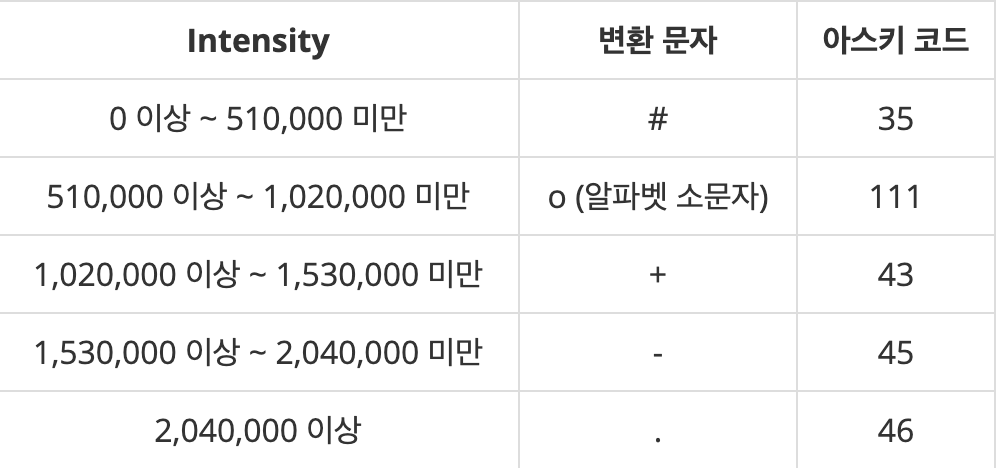

# List

* data organization, management, and storage format that enables efficient access and modification




> Staitc methods

* List\<T\> asList​(T... a) : Returns a fixed-size list backed by the specified array
* T binarySearch​() : Searches a range of the specified array for the specified object using the binary search algorithm
  * T[] a, int fromIndex, int toIndex, T key, Comparator<? super T> c

* int compare​(T[] a, T[] b) : Compares two double arrays lexicographically
* byte[] copyOf​(T[] original, int newLength) : Copies the specified array, truncating or padding with zeros
* boolean equals​(T[] a, T[] a2) : Returns true if the two specified arrays of longs are equal to one another
* void fill​(T[] a, T val) : Assigns the specified char value to each element of the specified array of T
* int hashCode​(T[] a) : Returns a hash code based on the contents of the specified array
* int mismatch​() : Finds and returns relative index of first mismatch between two byte arrays over the specified ranges
  * T[] a, int aFromIndex, int aToIndex
  * T[] b, int bFromIndex, int bToIndex
* void parallelSort​(T[] a) : Sorts the specified array into ascending numerical order (Faster than sort)

```java
// 1. Array iterate
int arr[] = {1, 2, 3};
for (int d : arr) System.out.println(d);

// 2. Custom object
Object[] myArray = new Object[100]
Java allocates 100 places to put your objects in. It does NOT instantiate your objects for you.

You can do this:

SomeClass[] array = new SomeClass[100];

for (int i = 0; i < 100; i++) {
    SomeClass someObject = new SomeClass();
    // set properties
    array[i] = someObject;
}

// 3. Pass array to function
void foo(int[] numPlayers) { }

foo(new int[] { 10, 15, 20 });
```




* Spread : ..., use to copy contents of objects

> Array

* length : Size of array
* concat()
* copyWithin()
* entries()
* every()
* fill()
* filter() : array.filter(value => value < 0);
* find()
* findIndex()
* forEach() : arr.forEach((num, index) => { arr[index] = num * 2; });
* from()
* includes()
* indexOf()
* isArray()
* join()
* keys()
* lastIndexOf()
* map() : let doubled = arr.map(num => { return num * 2; });
* pop()
* prototype
* push()
* reduce() : [].reduce((a, b) => a + b);        // sum
* reduceRight()
* reverse() : loop backward
* shift() : get first element = poll in queue
* slice()
* some()
* sort() : items.sort((a, b) => { return a.value - b.value; });
* splice() : items.splice(pos, num, newval);
* toString()
* unshift()
* valueOf()
* splice(index, delete); : remove elements
* split(',').map(Number); : split as an integer
* map(x=>x[0]); : first column of 2d array

```js
new Array(len).fill(0);

// 1. Uppercase all array
var fruits = ["Banana", "Orange", "Apple", "Mango"];
Array.prototype.myUcase = function() {
  for (i = 0; i < this.length; i++)
    this[i] = this[i].toUpperCase();
};

// 2. Spread
var arr = ['a','b', 'c']
var added = [...arr, 'd']                // Copy Array

function add(x, y, z) { console.log(x+y+z) }  // Pass array as parameter
var args = [0, 1, 2, 3]
add(...args)

var obj1 = { foo: 'bar', x: 42 };
var clonedObj = { ...obj1 };            // Clone and merge object

var obj2 = { foo: 'baz', y: 13 };
var mergedObj = { ...obj1, ...obj2 };    // merge objects
```




> baekjoon

* [Level 3 : 질투진서](http://acmicpc.net/problem/15784)
  * [Update solution](https://github.com/seanhwangg/algorithm/edit/main/data-structure/list/list/BJ_15784.md)




> Question

* A person can see people with same row and column
* Given row a and row b of chairs, if he see someone more handsome, print ANGRY, otherwise HAPPY

```txt
Input:
5 3 2
10 2 3 24 4
21 4 5 12 1
24 52 4 2 2
2 4 3 2 32
1 4 32 2 4

Output: HAPPY
```




```py
N, i, j = map(int, input().split())
i, j = i - 1, j - 1
line = []
row = []
for a in range(N):
  temp = list(map(int, input().split()))
  line.append(temp[j])
  if a == i:
    row = temp
if max(line) == max(row) == row[j]:
  print('HAPPY')
else:
  print('ANGRY')
```




* [Level 3 : 카드놀이](http://acmicpc.net/problem/2511)
  * [Update solution](https://github.com/seanhwangg/algorithm/edit/main/data-structure/list/list/BJ_2511.md)




> Question


* In the first row, print out the total points A and B received after the game, with the blanks between them in order
* Print out the winner in the second row

```txt
Input:
4 5 6 7 0 1 2 3 9 8
1 2 3 4 5 6 7 8 9 0

Output:
16 13
A
```




```py
a_scores = list(map(int,input().split()))
b_scores = list(map(int,input().split()))
a_point = b_point = 0
last = 'D'
for a_score, b_score in zip(a_scores, b_scores):
  if a_score > b_score:
    last = 'A'
    a_point += 3
  elif a_score < b_score:
    last = 'B'
    b_point += 3
  else:
    a_point += 1
    b_point += 1
print(a_point, b_point)
if a_point > b_point:
  print("A")
elif b_point < a_point:
  print("B")
else:
  print(last)
```




* [Level 3 : 쌍의 합](http://acmicpc.net/problem/5217)
  * [Update solution](https://github.com/seanhwangg/algorithm/edit/main/data-structure/list/list/BJ_5217.md)




> Question

* When given a natural number n greater than or equal to 1 and less than or equal to 12
* find pairs of two natural numbers that sum up to n

```txt
Input:
4
2
3
4
5

Output:
Pairs for 2:
Pairs for 3: 1 2
Pairs for 4: 1 3
Pairs for 5: 1 4, 2 3
```




```py
for _ in range(int(input())):
  n = int(input())
  li = []
  for i in range(1, (n + 1) // 2):
    li.append(f"{i} {n - i}")

  print(f"Pairs for {n}: {', '.join(li)}")
```




* [Level 3 : X보다 작은 수](http://acmicpc.net/problem/10871)
  * [Update solution](https://github.com/seanhwangg/algorithm/edit/main/data-structure/list/list/BJ_10871.md)




> Question

* Prints all numbers smaller than X in A

```txt
Input:
10 5
1 10 4 9 2 3 8 5 7 6

Output: 1 4 2 3
```




```cpp
#include <iostream>

using namespace std;

int main() {
  int n, x;
  cin >> n >> x;
  while (n--) {
    int a;
    cin >> a;
    if (a < x)
      cout << a << " ";
  }
}
```




```py
_, x = map(int, input().split())
for n in map(int, input().split()):
  if n < x:
    print(n, end=' ')
```




* [Level 3 : 두 개의 손](http://acmicpc.net/problem/16675)
  * [Update solution](https://github.com/seanhwangg/algorithm/edit/main/data-structure/list/list/BJ_16675.md)




> Question

* Given result of rock scissors paper with two hands (TK, MS), print winner
* If both can win print ?

```txt
Input: R R S S
Output: MS
```




```py
ml, mr, tl, tr = ('SRP'.index(i) for i in input().split())

if ml == mr and (ml + 1) % 3 in [tl, tr]:
  print('TK')
elif tl == tr and (tl + 1) % 3 in [ml, mr]:
  print('MS')
else:
  print('?')
```




* [Level 3 : Statistics](http://acmicpc.net/problem/20674)
  * [Update solution](https://github.com/seanhwangg/algorithm/edit/main/data-structure/list/list/BJ_20674.md)




> Question

* Print sum of numbers to substract so that the numbers are decreasing?

```txt
Input:
3
100
150
200

Output: 150
```




```py
li = list(int(input()) for _ in range(int(input())))
mn, total = li[0], 0
for n in li:
  if n > mn:
    total += n -mn
  mn = min(n, mn)
print(total)
```




* [Level 4 : 닉네임에 갓 붙이기](http://acmicpc.net/problem/13163)
  * [Update solution](https://github.com/seanhwangg/algorithm/edit/main/data-structure/list/list/BJ_13163.md)




> Question

* Delete until first blank and print concatnated string with God

```txt
Input:
5
baek joon
koo sa ga
ac ka
yu ka ri ko
ke sa ki yo

Output:
godjoon
godsaga
godka
godkariko
godsakiyo
```




```cpp
#include <bits/stdc++.h>
using namespace std;

int n;
string s;
int main() {
  cin >> n;
  while(n--) {
    getline(cin, s);
    s.replace(s.begin(), s.begin() + s.find_first_of(' '), "god");
    for(char c : s) if (c != ' ') cout << c;
    cout << '\n';
  }
}
```




```py
for _ in range(int(input())):
  l = input().split()
  l[0] = 'god'
  print(''.join(l))
```




* [Level 4 : 막대기](http://acmicpc.net/problem/17608)
  * [Update solution](https://github.com/seanhwangg/algorithm/edit/main/data-structure/list/list/BJ_17608.md)




> Question


* find number of visible bars




```py
a = int(input())
li = []
for _ in range(a):
  li.append(int(input()))

mx, ret = 0, 0
for n in reversed(li):
  if mx < n:
    mx = n
    ret += 1

print(ret)
```




* [Level 4 : 점수 집계](http://acmicpc.net/problem/9076)
  * [Update solution](https://github.com/seanhwangg/algorithm/edit/main/data-structure/list/list/BJ_9076.md)




> Question

* Print sum of second, third, fourth numbers
* If difference between second and fourth number's are greater than 3 print KIN

```txt
Input:
4
10 8 5 7 9
10 9 10 9 5
10 3 5 9 10
1 2 3 6 9

Output:
24
28
KIN
KIN
```




```py
for _ in range(int(input())):
  l = sorted(map(int, input().split()))
  print('KIN' if l[3]-l[1]>=4 else sum(l[1:4]))
```




* [Level 4 : 카드1](http://acmicpc.net/problem/2161)
  * [Update solution](https://github.com/seanhwangg/algorithm/edit/main/data-structure/list/list/BJ_2161.md)




> Question

* Throw the top card on the floor
* Next, move the top card below the bottom card
* Print which card will be left after performing above actions

```txt
Input: 7
Output: 1 3 5 7 4 2 6
```




```py
n = int(input())
a = [i for i in range(1, n+1)]
while len(a) > 1:
  print(a.pop(0), end=' ')
  k = a.pop(0)
  a.append(k)
print(a[0])
```




* [Level 4 : 유레카 이론](http://acmicpc.net/problem/10448)
  * [Update solution](https://github.com/seanhwangg/algorithm/edit/main/data-structure/list/list/BJ_10448.md)




> Question

* Print if a number can be represented by the sum of following sequence
* 1, 3, 6, 10, 15, 21 ..

```txt
Input:
3
10
20
1000

Output:
1
0
1
```




```py
triangle = [n*(n+1)//2 for n in range(1, 46)]
eureka = [0] * 1001

for i in triangle:
  for j in triangle:
    for k in triangle:
      if i+j+k <= 1000:
        eureka[i + j + k] = 1

T = int(input())
for _ in range(T):
  print(eureka[int(input())])
```




* [Level 5 : 소가 길을 건너간 이유 2](http://acmicpc.net/problem/14468)
  * [Update solution](https://github.com/seanhwangg/algorithm/edit/main/data-structure/list/list/BJ_14468.md)




> Question

* Given a circle, you observe cow acrossing at one point
* Find minimum number of cow pairs that cross one another

```txt
Input: ABCCABDDEEFFGGHHIIJJKKLLMMNNOOPPQQRRSSTTUUVVWWXXYYZZ
Output: 1  # A and B will meet
```




```py
ans = 0
L = []
for j in input():
  if j in L:
    ans += len(L) - 1 - L.index(j)
    L.remove(j)
  else:
    L.append(j)
print(ans)
```




* [Level 5 : 피타고라스 기댓값](http://acmicpc.net/problem/11070)
  * [Update solution](https://github.com/seanhwangg/algorithm/edit/main/data-structure/list/list/BJ_11070.md)




> Question

* Pythagorean Expectation is calculated as below

$$ W=\frac{S^{2}}{S^{2}+A^{2}} $$

* Find max expectation and min expectation




```py
for _ in range(int(input())):
  n, k = map(int, input().split())
  w, l = [0] * n, [0] * n
  for _ in range(k):
    a, b, c, d = map(int,input().split())
    w[a - 1] += c
    l[a - 1] += d
    w[b - 1] += d
    l[b - 1] += c
  c = [0] * n
  for i in range(n):
    t= w[i] * w[i]
    if w[i] + l[i] != 0:
      c[i] = t/(t+l[i]*l[i])*1000
  print(int(max(c)))
  print(int(min(c)))
```




* [Level 8 : 키로거](http://acmicpc.net/problem/5397)
  * [Update solution](https://github.com/seanhwangg/algorithm/edit/main/data-structure/list/list/BJ_5397.md)




> Question

* The input of the backspace '-' arrow is given as '<' and '>'
* For each test case, Kang San's password is printed. Password length is always greater than zero

```txt
Input:
2
<<BP<A>>Cd-
ThIsIsS3Cr3t

Output:
BAPC
ThIsIsS3Cr3t
```




```py
for _ in range(int(input())):
  typing = input()
  left, right = [], []
  for ch in typing:
    if ch == '<':
      if left:
        right.append(left.pop())
    elif ch == '>':
      if right:
        left.append(right.pop())
    elif ch == '-':
      if left:
        left.pop()
    else:
      left.append(ch)
  left.extend(reversed(right))
  print(''.join(left))
```




* [Level 11 : AC](http://acmicpc.net/problem/5430)
  * [Update solution](https://github.com/seanhwangg/algorithm/edit/main/data-structure/list/list/BJ_5430.md)




> Question

* Function R is a function that reverses order of numbers in an array, and D is a function that throws away the first number
* If the array is empty and D is used, an error occurs
* When given the initial value of the array and the function to be performed, obtain the final result

```txt
Input:
4
RDD
4
[1,2,3,4]
DD
1
[42]
RRD
6
[1,1,2,3,5,8]
D
0
[]

Output:
[2,1]
error
[1,2,3,5,8]
error
```




```py
def operate(com, li):
  left = True
  if len(li) < com.count('D'):
    return 'error'
  for c in com:
    if c == 'R':
      left = not left
    elif c == 'D':
      li.pop(0 if left else -1)
  if left:
    return f"[{','.join(li)}]"
  else:
    return f"[{','.join(reversed(li))}]"

T = int(input())
for _ in range(T):
  com = input()
  n = input()
  li = input()[1:-1].split(',')
  if n=='0': li = []
  print(operate(com, li))
```




> kattis

* [Level 1.3 : Batter Up](https://open.kattis.com/problems/batterup)
  * [Update solution](https://github.com/seanhwangg/algorithm/edit/main/data-structure/list/list/KT_batterup.md)




> Question

* 첫번째 줄 n개의 타석이 주어지고, 다음줄에는 n개 타석에서의 각 정수가 주어진다
* N개의 정수가 주어질 때, 볼넷,스트라이크,1루타, 2루타, 3루타, 홈런은 각 -1,0,1,2,3,4 점수를나타냄
* 볼넷 -1의 경우 타석으로 고려하지 않음
* 선수의 장타율을 출력하라(장타율은 모든 타석에서의 점수를 더한 값에 n타석으로 나눈 값)

```txt
Input:
3
3 0 2

Output:
1.6666666666667
```




```py
n_hit = int(input())
li = list(map(int, input().split()))
miss = li.count(-1)
print((sum(li) + miss) / (n_hit - miss))
```




* [Level 1.3 : Electrical Outlets](https://open.kattis.com/problems/electricaloutlets)
  * [Update solution](https://github.com/seanhwangg/algorithm/edit/main/data-structure/list/list/KT_electricaloutlets.md)




> Question

* Find maximum number of plugs with n plugs with port

```txt
Input:
3
3 2 3 4
10 4 4 4 4 4 4 4 4 4 4
4 10 10 10 10

Output:
7
31
37
```




```py
for _ in range(int(input())):
  li = list(map(int, input().split()))
  count = sum(li) - 2 * li[0] + 1
  print(count)
```




* [Level 1.4 : Transit Woes](https://open.kattis.com/problems/transitwoes)
  * [Update solution](https://github.com/seanhwangg/algorithm/edit/main/data-structure/list/list/KT_transitwoes.md)




> Question

* 첫줄에 출발시간 s, 수업시작시간 t, n이 주어진다
* 두번째 줄에는 n+1 개의 수가 주어지며 한 정거장에서 다음정거장으로 가는데 걸리는 시간을 의미
* 세번째 줄에는 n 개의 수가 주어지며 버스타고가면서 걸리는시간을 의미
* 네번째 줄에도 n 개의 수가 주어진다.버스가 정거장에 도착하는데 걸리는시간
* 제시간에 수업에 도착할 수 있으면 ‘yes’ 없으면 ‘no’를 출력하라

```txt
Input:
0 20 2
2 2 2
5 5
3 5

Output: yes
```




```py
cur, t, n = map(int, input().split())
D = list(map(int, input().split()))
B = list(map(int, input().split()))
C = list(map(int, input().split()))
for d, b, c in zip(D, B, C):
  cur += d
  cur += (cur % c)
  cur += b
if cur + D[-1] < t:
  print("yes")
else:
  print("no")
```




> leetcode

* [Level Easy : Check if Array Is Sorted and Rotated](https://leetcode.com/problems/check-if-array-is-sorted-and-rotated)
  * [Update solution](https://github.com/seanhwangg/algorithm/edit/main/data-structure/list/list/LC_1752.md)




> Question

* Given an array nums, return if the array was originally sorted in non-decreasing order, then rotated some number of positions
* There may be duplicates in the original array

```txt
Input: nums = [3,4,5,1,2]
Output: true
```




```py
def check(self, nums: List[int]) -> bool:
  return sum(nums[i] < nums[i-1] for i in range(len(nums))) <= 1
```




* [Level Medium : Sum of Beauty of All Substrings](https://leetcode.com/problems/sum-of-beauty-of-all-substrings)
  * [Update solution](https://github.com/seanhwangg/algorithm/edit/main/data-structure/list/list/LC_1781.md)




> Question

* The beauty of a string is the difference in frequencies between the most frequent and least frequent characters
* Given a string s, return the sum of beauty of all of its substrings

```txt
Input: s = "aabcb"
Output: 5
```




```py
def beautySum(self, s: str) -> int:
  ans = 0
  for i in range(len(s)):
    freq = [0]*26
    for j in range(i, len(s)):
      freq[ord(s[j])-97] += 1
      ans += max(freq) - min(x for x in freq if x)
  return ans
```




* [Level Medium : Pairs of Songs With Total Durations Divisible by 60](https://leetcode.com/problems/pairs-of-songs-with-total-durations-divisible-by-60)
  * [Update solution](https://github.com/seanhwangg/algorithm/edit/main/data-structure/list/list/LC_1010.md)




> Question

* number of indices i, j such that i < j with (time[i] + time[j]) % 60 == 0

```txt
Input: time = [30,20,150,100,40]
Output: 3
```




```py
def numPairsDivisibleBy60(self, time):
  c = [0] * 60
  res = 0
  for t in time:
    res += c[-t % 60]
    c[t % 60] += 1
  return res
```




## Dimension 2

> baekjoon

* [Level 3 : 종이접기](http://acmicpc.net/problem/16504)
  * [Update solution](https://github.com/seanhwangg/algorithm/edit/main/data-structure/list/dimension-2/BJ_16504.md)




> Question

* Find sum of given 2d array

```txt
Input:
2
1 2 3
-1 -3 2

Output: 0
```




```cpp
#include <bits/stdc++.h>
using namespace std;

int main() {
  int N; cin >> N;
  long long ans = 0;
  for (int i = 0; i < N; i++) {
    for (int j = 0; j < N; j++) {
      int x; cin >> x;
      ans += x;
    }
  }
  cout << ans << "\n";
}
```




```py
import sys
input = sys.stdin.readline
agg = 0
for _ in range(int(input())):
  agg += sum(map(int, inp().split()))
print(agg)
```




* [Level 3 : 최댓값](http://acmicpc.net/problem/2566)
  * [Update solution](https://github.com/seanhwangg/algorithm/edit/main/data-structure/list/dimension-2/BJ_2566.md)




> Question

* The maximum value is printed on first line, and row number and column number
* where maximum value is located on second line, are printed in order with blanks between them
* If there is more than one maximum value, print the location of one of them

```txt
Input:
3 23 85 34 17 74 25 52 65
10 7 39 42 88 52 14 72 63
87 42 18 78 53 45 18 84 53
34 28 64 85 12 16 75 36 55
21 77 45 35 28 75 90 76 1
25 87 65 15 28 11 37 28 74
65 27 75 41 7 89 78 64 39
47 47 70 45 23 65 3 41 44
87 13 82 38 31 12 29 29 80

Output:
90
5 7
```




```py
G = []
for _ in range(9):
  G.append(list(map(int, input().split())))
mx, mr, mc = 0, 0, 0
for r in range(9):
  for c in range(9):
    if mx < G[r][c]:
      mx = G[r][c]
      mr, mc = r + 1, c + 1
print(mx)
print(mr, mc)
```




* [Level 5 : 준오는 조류혐오야!!](http://acmicpc.net/problem/14647)
  * [Update solution](https://github.com/seanhwangg/algorithm/edit/main/data-structure/list/dimension-2/BJ_14647.md)




> Question

* Get rid of row or column with most number of 9s written across all rows and columns and find number of remaining 9




```cpp
#include<iostream>
using namespace std;
int max_val;
int arr[500][500];
int row[500], col[500];
int sum;

int func(int num) {
  int cnt = 0;
  while (num) {
    if (num % 10== 9) cnt++;
    num /= 10;
  }
  return cnt;
}

int main() {
  cin.tie(0);
  cin.sync_with_stdio(false);
  int n, m;
  cin >> n >> m;
  for (int i = 0; i < n; i++) {
    for (int j = 0; j < m; j++) {
      cin >> arr[i][j];
      row[i] += func(arr[i][j]);
      col[j] += func(arr[i][j]);
      sum += func(arr[i][j]);
    }
  }
  for (int i = 0; i < n; i++)
    if (row[i] > max_val) max_val = row[i];

  for (int j = 0; j < m; j++)
    if (col[j] > max_val) max_val = col[j];

  cout << sum - max_val <<endl;
}
```




```py
n, m=map(int, input().split())
a=[]
for _ in range(n):
  for i in input().split():
    a.append(i.count('9'))
print(sum(a)-max(max([sum(a[m*i:m*i+m]) for i in range(n)]), max([sum(a[i:n*m:m]) for i in range(m)])))
```




* [Level 5 : 색종이](http://acmicpc.net/problem/10163)
  * [Update solution](https://github.com/seanhwangg/algorithm/edit/main/data-structure/list/dimension-2/BJ_10163.md)




> Question


* Print visible area of all rectangles




```py
N = int(input())
G = [[0] * 1001 for _ in range(1001)]
for i in range(1, N + 1):
  a, b, c, d = map(int, input().split())
  for r in range(a, a + c):
    for c in range(b, b + d):
      G[r][c] = i

for i in range(1, N + 1):
  print(sum(li.count(i) for li in G))
```




* [Level 5 : 스캐너](http://acmicpc.net/problem/3035)
  * [Update solution](https://github.com/seanhwangg/algorithm/edit/main/data-structure/list/dimension-2/BJ_3035.md)




> Question

* Stretch picture

```txt
Input:
3 3 1 2
.x.
x.x
.x.

Output:
..xx..
xx..xx
..xx..
```




```py
a,b,c,d = [int(x) for x in input().split()]
e = []
for _ in range(0, a):
  e.append(input())
for i in range(0, a):
  for _ in range(0, c):
    print(''.join([x*d for x in e[i]]))
```




* [Level 5 : 교수님 그림이 깨지는데요?](http://acmicpc.net/problem/20205)
  * [Update solution](https://github.com/seanhwangg/algorithm/edit/main/data-structure/list/dimension-2/BJ_20205.md)




> Question

* Enlarge picture

```txt
Input:
2 2
0 1
1 0

Output:
0 0 1 1
0 0 1 1
1 1 0 0
1 1 0 0
```




```py
n,k=map(int,input().split())
for _ in range(n):
  l = [s for s in input().split()for _ in range(k)]
  for _ in range(k):
    print(*l)
```




* [Level 5 : 누울 자리를 찾아라](http://acmicpc.net/problem/1652)
  * [Update solution](https://github.com/seanhwangg/algorithm/edit/main/data-structure/list/dimension-2/BJ_1652.md)




> Question


* Find number places unique 1x2 or 2x1 white rectangle

```txt
Input:
5
....X
..XX.
.....
.XX..
X....

Output: 5 4
```




```py
a = int(input())
G = []
for i in range(a):
  G.append(input() + 'X')
G.append('X' * (a + 1))
hor, ver = 0, 0
for i in range(a):
  for j in range(a - 1):
    if G[i][j] == '.' and G[i][j + 1] == '.' and G[i][j + 2] == 'X':
      hor += 1
    if G[j][i] == '.' and G[j + 1][i] == '.' and G[j + 2][i] == 'X':
      ver += 1
print(hor, ver)
```




* [Level 5 : 아스키 아트](http://acmicpc.net/problem/17072)
  * [Update solution](https://github.com/seanhwangg/algorithm/edit/main/data-structure/list/dimension-2/BJ_17072.md)




> Question



* Convert to picture

```txt
Input:
16 11
0 0 0 0 254 255 249 255 248 245 255 244 254 255 249 255 241 255 255 237 255 255 244 253 255 255 239 255 255 243 255 249 255
0 0 0 0 255 251 213 255 241 83 145 106 229 255 242 235 255 255 223 255 255 226 255 255 244 255 253 255 250 248 255 251 255
0 0 0 0 255 248 191 255 224 64 161 92 74 152 100 191 255 236 178 255 244 55 158 115 222 255 249 254 255 253 255 255 251
251 248 255 244 255 248 92 147 92 74 163 83 60 168 83 53 165 89 59 166 96 64 161 94 77 155 97 223 255 234 241 255 246
240 255 255 255 251 255 255 253 241 217 255 217 60 170 83 64 160 86 216 255 220 219 255 220 62 161 79 69 161 96 238 255 251
0 0 253 255 246 255 255 249 255 227 255 246 193 255 216 74 156 94 226 255 241 91 148 115 63 159 98 199 255 230 239 255 250
0 0 253 248 255 255 238 255 255 224 255 245 92 153 93 82 153 85 208 255 235 207 255 250 218 255 251 237 255 248 252 255 253
0 0 255 252 255 246 241 255 224 122 137 78 117 131 52 75 115 19 94 150 61 112 139 88 255 247 243 255 237 255 255 248 255
255 240 255 255 244 216 128 91 13 239 186 92 135 85 0 119 95 0 217 197 82 246 184 101 174 57 39 255 219 243 255 236 255
255 229 250 150 68 47 177 65 2 255 158 83 255 161 92 255 177 101 165 73 0 194 57 0 221 43 15 195 45 56 255 235 253
255 224 238 171 63 63 202 46 33 241 31 16 241 29 18 195 42 28 169 57 37 255 213 193 230 27 20 215 40 45 255 231 239
255 227 232 163 55 68 209 37 59 255 9 39 255 9 36 214 37 63 161 61 85 255 212 236 233 30 52 224 38 51 255 237 239
255 240 236 149 58 65 212 36 56 255 15 40 255 15 36 210 35 52 160 58 79 173 50 78 215 30 61 202 39 58 255 240 243
255 250 243 255 236 234 193 44 46 238 30 30 234 29 26 200 45 40 255 217 217 255 219 225 183 51 65 255 224 236 255 244 248
243 255 249 255 246 242 255 230 228 171 56 53 179 54 48 180 53 47 173 54 50 158 63 61 255 237 236 255 248 249 255 255 255
0 0 0 0 254 255 255 243 250 255 242 251 255 233 242 255 222 234 255 219 228 255 236 237 254 255 250 229 255 255 240 255 255

Output:
0000.......
0000.......
0000+..+...
..+++++++..
....++..++.
00...+.++..
.0..++.....
00.++o++...
0.o-oo--o..
.oo---oooo.
.oooooo.oo.
.oooooo.oo.
.ooooooooo.
..oooo..o..
...ooooo...
0000.......
```




```cpp
#include <iostream>
#include <vector>
using namespace std;

int main() {
  int n, m;
  cin >> n >> m;
  vector<vector<int>> li(n, vector<int>(m));
  for (int i = 0; i < n; i++) {
    for (int j = 0; j < m; j++) {
      int r, g, b;
      cin >> r >> g >> b;
      li[i][j] = 2126 * r + 7152 * g + 722 * b;
    }
  }
  for (int i = 0; i < n; i++) {
    for (int j = 0; j < m; j++) {
      if (li[i][j] < 510000)
        cout << (char)35;
      else if (li[i][j] < 1020000)
        cout << (char)111;
      else if (li[i][j] < 1530000)
        cout << (char)43;
      else if (li[i][j] < 2040000)
        cout << (char)45;
      else cout << (char)46;
    }
    cout << endl;
  }
  return 0;
}
```




```py
n,m = map(int,input().split())
for i in range(n):
  l=[*map(int,input().split())]
  s=''
  for j in range(m):
    r,g,b = l[3*j:3*j+3]
    s+='#o+-..'[(2126*r+7152*g+722*b)//510000]
  print(s)
```




* [Level 5 : 주디와 당근농장](http://acmicpc.net/problem/16433)
  * [Update solution](https://github.com/seanhwangg/algorithm/edit/main/data-structure/list/dimension-2/BJ_16433.md)




> Question

* You can plant up to one carrot in each compartment
* if you have a carrot in one compartment, you can't plant it in the adjacent compartments
* Print result compartment

```txt
Input: 4 2 3
Output:
.v.v
v.v.
.v.v
v.v.
```




```py
n,r,c = map(int,input().split())
for y in range(n):
  print(*['v' if x%2 ^ y%2 == r%2 ^ c%2 else '.' for x in range(n)], sep='')
```




* [Level 5 : 세로읽기](http://acmicpc.net/problem/10798)
  * [Update solution](https://github.com/seanhwangg/algorithm/edit/main/data-structure/list/dimension-2/BJ_10798.md)




> Question

* When words are given on the blackboard, print the letters in the order they are read vertically

```txt
Input:
ABCDE
abcde
01234
FGHIJ
fghij

Output: Aa0FfBb1GgCc2HhDd3IiEe4Jj
```




```py
li = [input() for _ in range(5)]
for i in range(15):
  for j in range(5):
    if i < len(li[j]):
      print(li[j][i], end='')
```




* [Level 6 : 체스판 다시 칠하기](http://acmicpc.net/problem/1018)
  * [Update solution](https://github.com/seanhwangg/algorithm/edit/main/data-structure/list/dimension-2/BJ_1018.md)




> Question

* minimum number of squares that need to be repainted to make as checker board

```txt
Input:
10 13
BBBBBBBBWBWBW
BBBBBBBBBWBWB
BBBBBBBBWBWBW
BBBBBBBBBWBWB
BBBBBBBBWBWBW
BBBBBBBBBWBWB
BBBBBBBBWBWBW
BBBBBBBBBWBWB
WWWWWWWWWWBWB
WWWWWWWWWWBWB

Output: 12
```




```py
def block_cnt(r, c):
  cntWB, cntBW = 0, 0
  for i in range(r, r+8):
    for j in range(c, c+8):
      if (i - r + j - c) % 2 == 0:
        if G[i][j] == 'B':  cntWB += 1
        else:               cntBW += 1
      else:
        if G[i][j] == 'W':  cntWB += 1
        else:               cntBW += 1
  return min(cntWB, cntBW)
min_change = N * M
for i in range(N-7):
  for j in range(M-7):
    min_change = min(min_change, block_cnt(i, j))

print(min_change)
```




* [Level 6 : 덩치](http://acmicpc.net/problem/7568)
  * [Update solution](https://github.com/seanhwangg/algorithm/edit/main/data-structure/list/dimension-2/BJ_7568.md)




> Question

* If the sizes of two people A and B are x > p and y > q, respectively, we say that A is "greater" than B
* Print out the order of the order of the order of magnitude

```txt
Input:
5
55 185
58 183
88 186
60 175
46 155

Output: 2 2 1 2 5
```




```py
t=[(*map(int,input().split()),) for k in range(int(input()))]
print(*(sum(x < p and y < q for p, q in t) + 1 for x, y in t))
```




* [Level 6 : 파스칼의 삼각형](http://acmicpc.net/problem/16395)
  * [Update solution](https://github.com/seanhwangg/algorithm/edit/main/data-structure/list/dimension-2/BJ_16395.md)




> Question

* Given a Pascal's triangle, outputs the k-th number in the nth row

```txt
Input: 5 3
Output: 6
```




```py
pascal = [[1 for _ in range(i)] for i in range(1, 31)]

for i in range(2, 30):
  for j in range(1, i):
    pascal[i][j] = pascal[i-1][j-1] + pascal[i-1][j]

n, k = map(int, input().split())
print(pascal[n-1][k-1])
```




* [Level 7 : 수열의 합](http://acmicpc.net/problem/5623)
  * [Update solution](https://github.com/seanhwangg/algorithm/edit/main/data-structure/list/dimension-2/BJ_5623.md)




> Question

* Given sum of all the two numbers of sequence A, time, output A

```txt
Input:
4
0 3 6 7
3 0 5 6
6 5 0 9
7 6 9 0

Output: 2 1 4 5
```




```cpp
#include <iostream>

using namespace std;

int arr[2][1000];
int main() {
  int n;
  cin >> n;

  for (int i = 0; i < 2; i++)
    for (int j = 0; j < n; j++)
      cin >> arr[i][j];

  if (n == 2) {
    if (arr[0][1] == 2) {
      cout << "1 1";
      return 0;
    }
  }
  int a1 = (arr[0][1] + arr[0][2] - arr[1][2]) / 2;
  cout << a1 << ' ';
  for (int i = 1; i < n; i++)
    cout <<(int)( arr[0][i] - a1) << ' ';
  return 0;
}
```




```py
n = int(input())
if n == 2:
  print(1, 1)
else:
  S = [list(map(int,input().split())) for i in range(n)]
  for i in range(n):
    j = (i + 1) % n
    k = (i + 2) % n
    print((S[i][j] + S[i][k] - S[j][k])//2, end=' ')
```




> kattis

* [Level 1.6 : Skener](https://open.kattis.com/problems/skener)
  * [Update solution](https://github.com/seanhwangg/algorithm/edit/main/data-structure/list/dimension-2/KT_skener.md)




> Question

* print magnified picture with r, c factor

```txt
Input:
3 3 2 1
.x.
x.x
.x.

Output:
..xx..
xx..xx
..xx..
```




```py
N, M, a, b = map(int, input().split())
G = [input() for _ in range(N)]
for i in range(N):
  for _ in range(a):
    for j in range(M):
      for _ in range(b):
        print(G[i][j], end='')
    print()
```




* [Level 1.4 : Encoded Message](https://open.kattis.com/problems/encodedmessage)
  * [Update solution](https://github.com/seanhwangg/algorithm/edit/main/data-structure/list/dimension-2/KT_encodedmessage.md)




> Question


* Encode as following




```py
n = int(input())
for _ in range(n):
  s = input()

  G = []
  m = int(len(s) ** 0.5)
  for i in range(m):
    G.append(s[i * m : (i + 1) * m])

  for j in reversed(range(m)):
    for i in range(m):
      print(G[i][j], end='')
  print()
```




* [Level 1.4 : Cudoviste](https://open.kattis.com/problems/cudoviste)
  * [Update solution](https://github.com/seanhwangg/algorithm/edit/main/data-structure/list/dimension-2/KT_cudoviste.md)




> Question

* N, M이 주어지고 N개의 라인의 주차장이 주어진다
* 이 때 . 은 빈칸, '#' 은 건물, 'X' 는 다른 차량이다
* 2x2의 차를 주차 할 때 0, 1, 2, 3, 4개의 차량을 치우고 댈 수 있는 가지 수를 각 라인에 출력하라

```txt
Input:
4 4
#..#
..X.
..X.
#XX#

Output:
1
1
2
1
0
```




```py
N, M = map(int, input().split())
G = []
for _ in range(N):
  G.append(input())
rets = [0, 0, 0, 0, 0]
for i in range(1, N):
  for j in range(1, M):
    spaces = [G[i - 1][j - 1], G[i - 1][j], G[i][j - 1], G[i][j]]
    if '#' in spaces:
      continue
    rets[spaces.count('X')] += 1
for ret in rets:
  print(ret)
```




* [Level 1.5 : Gerrymandering](https://open.kattis.com/problems/gerrymandering)
  * [Update solution](https://github.com/seanhwangg/algorithm/edit/main/data-structure/list/dimension-2/KT_gerrymandering.md)




> Question

$$ E\left(V, w_{A}, w_{B}\right)=\frac{\left|w_{A}-w_{B}\right|}{V} $$

* Given # precincts: party vote totals for each precinct, and how those precincts have been grouped into districts
* For each district determine winner party and wasted votes for each party
* determine efficiency gap between two parties over all districts




```py
n, m = map(int, input().split())
G = [[0, 0] for i in range(m)]
for i in range(n):
  a, b, c = map(int, input().split())
  G[a - 1][0] += b
  G[a - 1][1] += c

total_wa = 0
total_wb = 0
for a, b in G:
  if a < b:
    wa = a
    wb = b - (a + b) // 2 - 1
    print('B', wa, wb)
  else:
    wa = a - (a + b) // 2 - 1
    wb = b
    print('A', wa, wb)
  total_wa += wa
  total_wb += wb

print(abs(total_wa - total_wb) / sum(sum(l) for l in G))
```




* [Level 1.7 : Prva](https://open.kattis.com/problems/prva)
  * [Update solution](https://github.com/seanhwangg/algorithm/edit/main/data-structure/list/dimension-2/KT_prva.md)




> Question

* Output the lexicographically smallest word with <1 character in the crossword

```txt
Input:
4 4
luka
o#a#
kula
i#a#

Output: kala
```




```py
n, m = map(int, input().split())
G = []
for _ in range(n):
  G.append(input() + "#")
G.append('#' * (m + 1))
words = []
for i in range(n + 1):
  word = ""
  for j in range(m + 1):
    if G[i][j] == '#':
      if len(word) > 1:
        words.append(word)
      word = ""
    else:
      word += G[i][j]

for j in range(m + 1):
  word = ""
  for i in range(n + 1):
    if G[i][j] == '#':
      if len(word) > 1:
        words.append(word)
      word = ""
    else:
      word += G[i][j]
print(sorted(words)[0])
```




> leetcode

* [Level Easy : Find Nearest Point That Has the Same X or Y Coordinate](https://leetcode.com/problems/find-nearest-point-that-has-the-same-x-or-y-coordinate)
  * [Update solution](https://github.com/seanhwangg/algorithm/edit/main/data-structure/list/dimension-2/LC_1779.md)




> Question

* given two integers, x and y, which represent your current location on a Cartesian grid: (x, y)
* given an array points where each points[i] = [ai, bi] represents that a point exists at (ai, bi)
* A point is valid if it shares the same x-coordinate or the same y-coordinate as your location
* Return the index (0-indexed) of the valid point with the smallest Manhattan distance from your current location

```txt
Input: x = 3, y = 4,
points =
[[1,2],
 [3,1],
 [2,4],
 [2,3],
 [4,4]]

Output: 2
```




```py
def nearestValidPoint(self, x: int, y: int, points: List[List[int]]) -> int:
  distances = [abs(x - point[0]) + abs(y - point[1]) if point[0] == x or point[1] == y else float('inf') for point in points]
  return distances.index(min(distances)) if min(distances) != float('inf') else -1
```




* [Level Medium : Rotate Image](https://leetcode.com/problems/rotate-image)
  * [Update solution](https://github.com/seanhwangg/algorithm/edit/main/data-structure/list/dimension-2/LC_48.md)




> Question

* Rotate 2D array

```txt
Input:
matrix =
[[5,1,9,11],
[2,4,8,10],
[13,3,6,7],
[15,14,12,16]]

Output:
[[15,13,2,5],
[14,3,4,1],
[12,6,8,9],
[16,7,10,11]]
```




```cpp
/*
 * clockwise rotate : first reverse up to down, then swap the symmetry
 * 1 2 3     7 8 9     7 4 1
 * 4 5 6  => 4 5 6  => 8 5 2
 * 7 8 9     1 2 3     9 6 3
*/
void rotate(vector<vector<int> > &matrix) {
  reverse(matrix.begin(), matrix.end());
  for (int i = 0; i < matrix.size(); ++i)
    for (int j = i + 1; j < matrix[i].size(); ++j)
      swap(matrix[i][j], matrix[j][i]);
}
```




```py
def rotate(self, A):
  A[:] = zip(*A[::-1])
```




## LinkedList

| Type          | Access | Search | Insert | Delete |
| ------------- | ------ | ------ | ------ | ------ |
| Array         | 1      | n      | n      | n      |
| Stack         | n      | n      | 1      | 1      |
| Queue         | n      | n      | 1      | 1      |
| Singly-Linked | n      | n      | 1      | 1      |
| Doubly-Linked | n      | n      | 1      | 1      |

> kattis

* [Level 1.6 : Ptice](https://open.kattis.com/problems/ptice)
  * [Update solution](https://github.com/seanhwangg/algorithm/edit/main/data-structure/list/linkedlist/KT_ptice.md)




> Question

* Repeat ABC, BABC, CCAABB
* find whose sequence contains the most correct answers

```txt
Input:
5
BAACC

Output:
3
Bruno
```




```py
length = int(input())
li = list(input())
a = ['A', 'B', 'C']
b = ['B', 'A','B', 'C']
g = ['C', 'C', 'A','A','B','B']
scores = [0, 0 , 0]
for i in range(length):
  if li[i] == a[i % 3]:
    scores[0] += 1
  if li[i] == b[i % 4]:
    scores[1] += 1
  if li[i] == g[i % 6]:
    scores[2] += 1

print(max(scores))
if max(scores) == scores[0]:
  print('Adrian')
if max(scores) == scores[1]:
  print('Bruno')
if max(scores) == scores[2]:
  print('Goran')
```




> leetcode

* [Level Easy : Merge Two Sorted Lists](https://leetcode.com/problems/merge-two-sorted-lists)
  * [Update solution](https://github.com/seanhwangg/algorithm/edit/main/data-structure/list/linkedlist/LC_21.md)




> Question

* Merge two linked lists

```txt
Input: l1 = [1,2,4], l2 = [1,3,4]
Output: [1,1,2,3,4,4]
```




```cpp
ListNode *mergeTwoLists(ListNode *l1, ListNode *l2) {
  ListNode dummy(INT_MIN);
  ListNode *tail = &dummy;
  while (l1 && l2) {
    if (l1->val < l2->val) {
      tail->next = l1;
      l1 = l1->next;
    } else {
      tail->next = l2;
      l2 = l2->next;
    }
    tail = tail->next;
  }

  tail->next = l1 ? l1 : l2;
  return dummy.next;
}

```




```py
def mergeTwoLists(self, l1: ListNode, l2: ListNode) -> ListNode:
  dummy = cur = ListNode(0)
  while l1 and l2:
    if l1.val < l2.val:
      cur.next = l1
      l1 = l1.next
    else:
      cur.next = l2
      l2 = l2.next
    cur = cur.next
  cur.next = l1 or l2
  return dummy.next
```




* [Level Easy : Reverse Linked List](https://leetcode.com/problems/reverse-linked-list)
  * [Update solution](https://github.com/seanhwangg/algorithm/edit/main/data-structure/list/linkedlist/LC_206.md)




> Question

* Reverse linked list

```txt
Input: head = [1,2,3,4,5]
Output: [5,4,3,2,1]
```




```py
def reverseList(self, head: ListNode) -> ListNode:
  if head == None:    return None
  prev = None
  while head.next != None:
    nxt = head.next
    head.next = prev
    prev, head = head, nxt
  head.next = prev
  return head
```




* [Level Easy : Linked List Cycle](https://leetcode.com/problems/linked-list-cycle)
  * [Update solution](https://github.com/seanhwangg/algorithm/edit/main/data-structure/list/linkedlist/LC_141.md)




> Question

* Check if linkedlist has cycle

```txt
Input: head = [3,2,0,-4], pos = 1
Output: true
```




```py
def hasCycle(self, head):
  try:
    slow = head
    fast = head.next
    while slow is not fast:
      slow = slow.next
      fast = fast.next.next
    return True
  except:
    return False
```




* [Level Easy : Middle of the Linked List](https://leetcode.com/problems/middle-of-the-linked-list)
  * [Update solution](https://github.com/seanhwangg/algorithm/edit/main/data-structure/list/linkedlist/LC_876.md)




> Question

* Print middle node in linked list

```txt
Input: [1,2,3,4,5,6]
Output: Node 4 from this list (Serialization: [4,5,6])
```




```py
def middleNode(self, head: ListNode) -> ListNode:
  slow, fast = head, head
  while fast and fast.next:
    slow = slow.next
    fast = fast.next.next
  return slow
```




* [Level Medium : Rotate List](https://leetcode.com/problems/rotate-list)
  * [Update solution](https://github.com/seanhwangg/algorithm/edit/main/data-structure/list/linkedlist/LC_61.md)




> Question

* Given the head of a linked list, rotate the list to the right by k places

```txt
Input: head = [1,2,3,4,5], k = 2
Output: [4,5,1,2,3]
```




```py
def rotateRight(self, head: ListNode, k: int) -> ListNode:
  if not head:
    return None
  old_last = head
  length = 1
  while old_last.next:
    old_last = old_last.next
    length += 1
  k = k % length
  old_last.next = head
  new_last = head
  for _ in range(length - k - 1):
    new_last = new_last.next
  answer = new_last.next
  new_last.next = None
  return answer
```




* [Level Medium : Copy List with Random Pointer](https://leetcode.com/problems/copy-list-with-random-pointer)
  * [Update solution](https://github.com/seanhwangg/algorithm/edit/main/data-structure/list/linkedlist/LC_138.md)




> Question

* linked list of length n is given st each node contains an random pointer, which could point to any node in list, or null
* Construct a deep copy of the list

```txt
Input: head = [[7,null],[13,0],[11,4],[10,2],[1,0]]
Output: [[7,null],[13,0],[11,4],[10,2],[1,0]]
```




```py
class Solution:
  def copyRandomList(self, head: 'Node') -> 'Node':
    # create new nodes
    node = head
    while node:
      node.random, node = Node(node.val, node.random, None), node.next
    # populate random field of the new node
    node = head
    while node:
      node.random.random, node = node.random.next.random if node.random.next else None, node.next
    # restore original list and build new list
    head_copy, node = head.random if head else None, head
    while node:
      node.random.next, node.random, node = node.next.random if node.next else None, node.random.next, node.next
    return head_copy
```




* [Level Medium : Reorder List](https://leetcode.com/problems/reorder-list)
  * [Update solution](https://github.com/seanhwangg/algorithm/edit/main/data-structure/list/linkedlist/LC_143.md)




> Question

* Given head of a singly linked-list. The list can be represented as:
  * Reorder the list to be on the following form:
  * L0 → Ln → L1 → Ln - 1 → L2 → Ln - 2 → …

```txt
Input: head = [1,2,3,4]
Output: [1,4,2,3]
```




```py
# Definition for singly-linked list.
# class ListNode:
#     def __init__(self, val=0, next=None):
#         self.val = val
#         self.next = next
class Solution:
  def reorderList(self, head):
    # find the mid point
    slow = fast = head
    while fast and fast.next:
      slow = slow.next
      fast = fast.next.next

    # reverse the second half in-place
    pre, node = None, slow
    while node:
      pre, node.next, node = node, pre, node.next

    # Merge in-place; Note : the last node of "first" and "second" are the same
    first, second = head, pre
    while second.next:
      first.next, first = second, first.next
      second.next, second = first, second.next
```




* [Level Medium : Add Two Numbers](https://leetcode.com/problems/add-two-numbers)
  * [Update solution](https://github.com/seanhwangg/algorithm/edit/main/data-structure/list/linkedlist/LC_2.md)




> Question

* Add two linked list number

```txt
Input: l1 = [2,4,3], l2 = [5,6,4]
Output: [7,0,8]
```




```py
def addTwoNumbers(self, l1, l2):
  carry = 0
  res = n = ListNode(0)
  while l1 or l2 or carry:
    if l1:
      carry += l1.val
      l1 = l1.next
    if l2:
      carry += l2.val
      l2 = l2.next
    carry, val = divmod(carry, 10)
    n.next = n = ListNode(val)
  return res.next
```




* [Level Medium : Linked List Cycle II](https://leetcode.com/problems/linked-list-cycle-ii)
  * [Update solution](https://github.com/seanhwangg/algorithm/edit/main/data-structure/list/linkedlist/LC_142.md)




> Question

* Given a linked list, return the node where the cycle begins. If there is no cycle, return null

```txt
Input: head = [3,2,0,-4], pos = 1
Output: tail connects to node index 1
```




```py
def detectCycle(self, head):
  try:
    fast = head.next
    slow = head
    while fast is not slow:
      fast = fast.next.next
      slow = slow.next
  except:
    return None

  slow = slow.next
  while head is not slow:
    head = head.next
    slow = slow.next
  return head
```




* [Level Medium : Remove Nth Node From End of List](https://leetcode.com/problems/remove-nth-node-from-end-of-list)
  * [Update solution](https://github.com/seanhwangg/algorithm/edit/main/data-structure/list/linkedlist/LC_19.md)




> Question

* Remove nth node from end

```txt
Input: head = [1,2,3,4,5], n = 2
Output: [1,2,3,5]
```




```cpp
class Solution {
public:
  ListNode* removeNthFromEnd(ListNode* head, int n) {
    ListNode* node = head, *offsetNode = head;
    for (int i = 0; i < n; ++i) node = node->next;
    if (node == NULL) return head->next;
    while (node->next != NULL) {
      node = node->next;
      offsetNode = offsetNode->next;
    }
    offsetNode->next = offsetNode->next->next;
    return head;
  }
};
```




```py
def removeNthFromEnd(self, head, n):
  fast = slow = head
  for _ in range(n):
    fast = fast.next
  if not fast:
    return head.next
  while fast.next:
    fast = fast.next
    slow = slow.next
  slow.next = slow.next.next
  return head
```




* [Level Medium : Convert Sorted List to Binary Search Tree](https://leetcode.com/problems/convert-sorted-list-to-binary-search-tree)
  * [Update solution](https://github.com/seanhwangg/algorithm/edit/main/data-structure/list/linkedlist/LC_109.md)




> Question

* make BST from sorted linked list

```txt
Input: head = [-10,-3,0,5,9]
Output: [0,-3,9,-10,null,5]
```




```py
def sortedListToBST(self, head):
  if not head:
    return
  if not head.next:
    return TreeNode(head.val)

  slow, fast = head, head.next.next
  while fast and fast.next:
    fast = fast.next.next
    slow = slow.next
  tmp = slow.next

  slow.next = None
  root = TreeNode(tmp.val)
  root.left = self.sortedListToBST(head)
  root.right = self.sortedListToBST(tmp.next)
  return root
```




### Iterator

> codeforces

* [Level 2000 : Omkar and Medians](https://codeforces.com/problemset/problem/1536/D)
  * [Update solution](https://github.com/seanhwangg/algorithm/edit/main/data-structure/list/iterator/CF_1536D.md)




> Question

* Given list nums, check if for every index i, there is no j(0 ... i - 1) st nums[i - 1] < nums[j] < nums[i]

```txt
Input:
5
4
6 2 1 3
1
4
5
4 -8 5 6 -7
2
3 3
4
2 1 2 3

Output:
NO  # 2 is between 1, 3
YES
NO  # 5 is between 6, -7
YES
YES
```




```cpp
#include <bits/stdc++.h>
using namespace std;

void test_case(int test) {
  int n; cin >> n;
  vector<int> b(n); for (auto& i : b) cin >> i;
  set<int> cur = {(int)-2e9, (int)2e9};
  cur.insert(b[0]);
  auto it = next(cur.begin());
  for (int i = 1; i < b.size(); ++i) {
    if (b[i] > *next(it) || b[i] < *prev(it)) {
      cout << "NO\n";
      return;
    }
    cur.insert(b[i]);
    it = cur.find(b[i]);
  }
  cout << "YES\n";
}

int main() {
  ios_base::sync_with_stdio(false); cin.tie(NULL); cout.tie(NULL);
  int T; cin >> T;
  for (int test = 1; test <= T; ++test) test_case(test);
  return 0;
}
```







> Iterator

* remove() : Removes from the underlying collection the last element returned by this iterator

* ListIterator
  * `List`.listIterator() : Create list iterator

```java
// 1. Traverse backwards
ListIterator listIterator = list.listIterator(list.size());

while (listIterator.hasPrevious()) {
  System.out.println(listIterator.previous());
}
```




### Skiplist

> leetcode

* [Level Medium : Design Most Recently Used Queue](https://leetcode.com/problems/design-most-recently-used-queue)
  * [Update solution](https://github.com/seanhwangg/algorithm/edit/main/data-structure/list/skiplist/LC_1756.md)




> Question

* MRUQueue(int n) constructs the MRUQueue with n elements: [1,2,3,...,n].
* int fetch(int k) moves the kth element (1-indexed) to the end of the queue and returns it.

```txt
Input:
["MRUQueue", "fetch", "fetch", "fetch", "fetch"]
[[8], [3], [5], [2], [8]]
Output:
[null, 3, 6, 2, 2]
```




```cpp
class MRUQueue {
public:
  int step = 16;
  list<int> l;
  vector<list<int>::iterator> skip;
  MRUQueue(int n) {
    for (auto i = 0; i <= n; ++i) {
      auto it = l.insert(end(l), i);
      if (i % step == 0) skip.push_back(it);
    }
  }
  int fetch(int k) {
    auto it = skip[k / step];
    if (k % step == 0 && next(it) != end(l))    skip[k / step] = next(it);
    for (int slow = k % step; slow > 0; --slow) ++it;
    l.splice(end(l), l, it);
    for (auto i = k / step + 1; i < skip.size(); ++i)
      skip[i] = next(skip[i]);
    return *it;
  }
};
```




## Deck

> Maximum in sliding window

* Question
  * Given a large array of integers and a window of size w
  * find the current maximum value in the window as the window slides through the entire array

* Solution
  * O(N)
  * Remove the indices of all elements from the back of the deque, which are smaller than or equal to the current element
  * If the element no longer falls in the current window, remove the index of the element from the front
  * Push the current element index at the back of the window
  * The index of the current maximum element is at the front

> baekjoon

* [Level 7 : 회전하는 큐](http://acmicpc.net/problem/1021)
  * [Update solution](https://github.com/seanhwangg/algorithm/edit/main/data-structure/list/deck/BJ_1021.md)




> Question

* Given elements in deck, 1, ..., N
* find minimum number of operator to extract all elements

```txt
Input:
10 3
1 2 3

Output: 0
```




```cpp
#include <bits/stdc++.h>
using namespace std;
int main() {
  int N, M, count=0; cin >> N >> M;
  deque<int> dq;
  for (int i = 0; i < N; i++) dq.push_back(i + 1);
  while (M--) {
    int temp; cin >> temp;
    for (int i = 0; i < N; i++) {
      if (dq[i] == temp) {
        rotate(dq.begin(), dq.begin() + i, dq.end());
        count += min(i, N - i);
        break;
      }
    }
    dq.pop_front();
    N--;
  }
  cout << count;
}
```




```py
from collections import deque
n, m =map(int,input().split())
l = list(map(int,input().split()))
Q = deque(range(1,n+1))
ans = 0
for i in l:
  a = Q.index(i)
  b = n-a
  if a<b: ans+=a; Q.rotate(-a); Q.popleft()
  else: ans+=b; Q.rotate(b); Q.popleft()
  n-=1
print(ans)
```




```v
module main;
    logic clk, reset, push_front, push_back, pop_front, pop_back;
    logic signed[17:0] din, dout_front, dout_back;
    logic[13:0] size;

    deque deque(.clk, .reset, .push_front, .push_back, .pop_front, .pop_back, .din, .dout_front, .dout_back, .size);

    initial begin
        integer code, n, x;
        string cmd;

        clk = 0;
        push_front = 0;
        push_back = 0;
        pop_front = 0;
        pop_back = 0;
        #1 reset = 1;
        #1 reset = 0;

        for (code = $fscanf(32'h8000_0000, "%d", n); n>0; n--)
        begin
            code = $fscanf(32'h8000_0000, "%s", cmd);
            if (cmd == "push_front" || cmd == "push_back") code = $fscanf(32'h8000_0000, "%d", din);
            if (cmd == "pop_front" || cmd == "front") $display("%0d", dout_front);
            if (cmd == "pop_back" || cmd == "back") $display("%0d", dout_back);
            if (cmd == "size") $display("%0d", size);
            if (cmd == "empty") $display("%0d", size == 0);

            push_front = cmd == "push_front";
            push_back = cmd == "push_back";
            pop_front = cmd == "pop_front";
            pop_back = cmd == "pop_back";
            #1 clk = 1;
            #1 clk = 0;
        end
        $finish;
    end
endmodule

module deque(
    input logic clk, reset,

    input logic push_front, push_back, pop_front, pop_back,
    input logic signed[17:0] din,
    output logic signed[17:0] dout_front, dout_back,
    output logic[13:0] size
);
    logic signed[17:0] mem[0:16383];
    logic[13:0] index_front, index_back;

    assign size = index_front - index_back + 1;
    assign dout_front = size == 0 ? '1 : mem[index_front];
    assign dout_back = size == 0 ? '1 : mem[index_back];

    always_ff @(posedge clk, posedge reset)
    begin
        if (reset) begin
            index_front = 0;
            index_back = 1;
        end
        else begin
            if (push_front) mem[++index_front] = din;
            if (push_back) mem[--index_back] = din;
            if (pop_front && size>0) --index_front;
            if (pop_back && size>0) ++index_back;
        end
    end
endmodule
```




* [Level 7 : 덱](http://acmicpc.net/problem/10866)
  * [Update solution](https://github.com/seanhwangg/algorithm/edit/main/data-structure/list/deck/BJ_10866.md)




> Question

* push_front X: Put the integer X in front of the deck
* push_back X: Put the integer X behind the deck
* pop_front: subtracts the number at the front of the deck and outputs it. If there are no integers in the deck, print -1
* pop_back: subtracts the number at the end of the deck and outputs it. If there are no integers in the deck, print -1
* size: print the number of integers in the deck
* empty: If the deck is empty, print 1 or 0
* front: Outputs an integer at the front of the deck. If there are no integers in the deck, print -1
* back: Outputs an integer at the back of the deck. If there are no integers in the deck, print -1

```txt
Input:
15
push_back 1
push_front 2
front
back
size
empty
pop_front
pop_back
pop_front
size
empty
pop_back
push_front 3
empty
front

Output:
2
1
2
0
2
1
-1
0
1
-1
0
3
```




```cpp
#include <bits/stdc++.h>
using namespace std;
deque<int> dq;
int n;

int main() {
  ios_base::sync_with_stdio(0);
  string t; int d;
  cin >> n;
  for(;n--;){
    cin >> t;
    if(t == "push_back")  cin >> d, dq.push_back(d);
    if(t == "push_front") cin >> d, dq.push_front(d);
    if(t == "size")  cout << dq.size() << '\n';
    if(t == "empty") cout << dq.empty() << '\n';
    if(t == "front") cout << (dq.size() ? dq.front() : -1) << '\n';
    if(t == "back")  cout << (dq.size() ? dq.back() : -1) << '\n';
    if(t == "pop_back"){
      cout << (dq.size() ? dq.back() : -1) << '\n';
      if(dq.size()) dq.pop_back();
    }
    if(t == "pop_front"){
      cout << (dq.size() ? dq.front() : -1) << '\n';
      if(dq.size()) dq.pop_front();
    }
  }
  return 0;
}
```




```py
import sys
from collections import deque
input = sys.stdin.readline
N = int(input())
dq = deque()
for i in range(N):
  cmd = list(input().split())
  if cmd[0] == 'push_front':
    dq.appendleft(cmd[1])
  elif cmd[0] == 'push_back':
    dq.append(cmd[1])
  elif cmd[0] == 'pop_front':
    print("-1" if len(dq) == 0 else dq.popleft())
  elif cmd[0] == 'pop_back':
    print("-1" if len(dq) == 0 else dq.pop())
  elif cmd[0] == 'front':
    print("-1" if len(dq) == 0 else dq[0])
  elif cmd[0] == 'back':
    print("-1" if len(dq) == 0 else dq[-1])
  elif cmd[0] == 'size':
    print(len(dq))
  elif cmd[0] == 'empty':
    print(1 if len(dq) == 0 else 0 )
```




* [Level 16 : 최솟값 찾기](http://acmicpc.net/problem/11003)
  * [Update solution](https://github.com/seanhwangg/algorithm/edit/main/data-structure/list/deck/BJ_11003.md)




> Question

* Given list, find minimum of $$ A_{i + L + 1} $$ ~ $$ A_i $$ at each index

```txt
Input:
12 3
1 5 2 3 6 2 3 7 3 5 2 6

Output:
1 1 1 2 2 2 2 2 3 3 2 2
```




```py
from collections import deque
n, l = map(int,input().split())
li = [*map(int,input().split())]
d = deque()
for i in range(n):
  if d and d[0]<i-l+1:
    d.popleft()
  while d and li[d[-1]] >= li[i]:
    d.pop()
  d.append(i)
  print(li[d[0]])
```




> leetcode

* [Level Medium : Design Front Middle Back Queue](https://leetcode.com/problems/design-front-middle-back-queue)
  * [Update solution](https://github.com/seanhwangg/algorithm/edit/main/data-structure/list/deck/LC_1670.md)




> Question

* Design a queue that supports push and pop operations in the front, middle, and back.
* Implement the FrontMiddleBack class:
  * FrontMiddleBack() Initializes the queue
  * void pushFront(int val) Adds val to the front of the queue
  * void pushMiddle(int val) Adds val to the middle of the queue (performed on the frontmost middle position choice)
  * void pushBack(int val) Adds val to the back of the queue
  * int popFront() Removes the front element of the queue and returns it. If the queue is empty, return -1
  * int popMiddle() Removes the middle element of the queue and returns it. If the queue is empty, return -1
  * int popBack() Removes the back element of the queue and returns it. If the queue is empty, return -1

```txt
Input:
["FrontMiddleBackQueue", "pushFront", "pushBack", "pushMiddle", "pushMiddle", "popFront", "popMiddle", "popMiddle", \
"popBack", "popFront"]
[[], [1], [2], [3], [4], [], [], [], [], []]

Output:
[null, null, null, null, null, 1, 3, 4, 2, -1]
```




```py
class FrontMiddleBackQueue(object):
  def __init__(self):
    self.A, self.B = collections.deque(), collections.deque()

  def pushFront(self, val):
    self.A.appendleft(val)
    self.balance()

  def pushMiddle(self, val):
    if len(self.A) > len(self.B):
      self.B.appendleft(self.A.pop())
    self.A.append(val)

  def pushBack(self, val):
    self.B.append(val)
    self.balance()

  def popFront(self):
    val = self.A.popleft() if self.A else -1
    self.balance()
    return val

  def popMiddle(self):
    val = (self.A or [-1]).pop()
    self.balance()
    return val

  def popBack(self):
    val = (self.B or self.A or [-1]).pop()
    self.balance()
    return val

  # keep A.size() >= B.size()
  def balance(self):
    if len(self.A) > len(self.B) + 1:
      self.B.appendleft(self.A.pop())
    if len(self.A) < len(self.B):
      self.A.append(self.B.popleft())
```




### Stack

> baekjoon

* [Level 7 : 괄호](http://acmicpc.net/problem/9012)
  * [Update solution](https://github.com/seanhwangg/algorithm/edit/main/data-structure/list/stack/BJ_9012.md)




> Question

* Print if input has valid parenthesis

```txt
Input:
6
(())())
(((()())()
(()())((()))
((()()(()))(((())))()
()()()()(()()())()
(()((())()(

Output:
NO
NO
YES
NO
YES
NO
```




```py
for T in range(int(input())):
  f, a, s = 1, 0, input()
  for i in s:
    if i=="(":
      a+=1
    else:
      a-=1
    if a<0:
      f=0
  print("YES" if f and a==0 else "NO")
```




* [Level 7 : 스택](http://acmicpc.net/problem/10828)
  * [Update solution](https://github.com/seanhwangg/algorithm/edit/main/data-structure/list/stack/BJ_10828.md)




> Question

* Implement stack operation (push, pop, size, empty, top)

```txt
Input:
14
push 1
push 2
top
size
empty
pop
pop
pop
size
empty
pop
push 3
empty
top

Output:
2
2
0
2
1
-1
0
1
-1
0
3
```




```cpp
#include<bits/stdc++.h>
using namespace std;

int main() {
  int n;
  cin >> n;
  stack<int> s;
  for (int x = n; x != 0; x--){
    string str;
    cin >> str;

    if (str == "push")  cin >> n, s.push(n);
    if (str == "size")  cout << s.size() << "\n";
    if (str == "empty") cout << (s.size()? 0: 1) << "\n";
    if (str == "top")   cout << (s.size()? s.top(): -1) << "\n";
    if (str == "pop") {
      if (s.size()){
          cout << s.top() << "\n";
          s.pop();
      } else {
        cout << "-1\n";
      }
    }
  }
}
```




```py
import sys
l = []

for _ in range(int(input())):
  o = sys.stdin.readline().split()
  try:
    if o[0] == "push":
      l.append(o[1])
    elif o[0] == "pop":
      print(l.pop())
    elif o[0] == "size":
      print(len(l))
    elif o[0] == "empty":
      print(0 if l else 1)
    elif o[0] == "top":
      print(l[len(l)-1])
  except:
    print(-1)
```




```v
module main;
  initial begin
    integer code, n, x, stack[$];
    string cmd;

    for (code = $fscanf(32'h8000_0000, "%d", n); n>0; n--)
    begin
      code = $fscanf(32'h8000_0000, "%s", cmd);
      if (cmd == "push") begin
        code = $fscanf(32'h8000_0000, "%d", x);
        stack.insert(0, x);
      end
      if (cmd == "pop" || cmd == "top") begin
        if (stack.size() == 0) $display("-1");
        else begin
          $display("%0d", stack[0]);
          if (cmd == "pop") stack.delete(0);
        end
      end
      if (cmd == "size")  $display("%0d", stack.size());
      if (cmd == "empty") $display("%0d", stack.size() == 0);
    end
    $finish;
  end
endmodule
```




* [Level 7 : 제로](http://acmicpc.net/problem/10773)
  * [Update solution](https://github.com/seanhwangg/algorithm/edit/main/data-structure/list/stack/BJ_10773.md)




> Question

* zero, erases the most recent number
* Print sum of all numbers

```txt
Input:
10
1
3
5
4
0
0
7
0
0
6

Output: 7
```




```cpp
#include<iostream>
#include<stack>
using namespace std;

int main(){
  stack<int> st;
  int n, x;
  cin >> n;
  while(n--){
  cin >> x;
    if(!x) st.pop();
    else st.push(x);
  }
  x = 0;
  while(st.size()){
    x += st.top();
    st.pop();
  }
  cout << x;
}
```




```py
stk = []
for _ in range(int(input())):
  num = int(input())
  if num == 0:
    stk.pop()
  else:
    stk.append(num)
print(sum(stk))
```




* [Level 8 : 에디터](http://acmicpc.net/problem/1406)
  * [Update solution](https://github.com/seanhwangg/algorithm/edit/main/data-structure/list/stack/BJ_1406.md)




> Question

* Simultate typing with cursor
  * L, R : move cursor left, right
  * B : Remove char from left
  * P $ : add $ to left

```txt
Input:
abcd
3
P x
L
P y

Output: abcdyx
```




```py
import sys
l, r = list(input()), []
input()
for c in sys.stdin:
  if c[0]=='L':
    if l: r.append(l.pop())
  elif c[0]=='D':
    if r: l.append(r.pop())
  elif c[0]=='B':
    if l: l.pop()
  else:
    l.append(c[2])
print(''.join(l + r[::-1]))
```




* [Level 8 : 스택 수열](http://acmicpc.net/problem/1874)
  * [Update solution](https://github.com/seanhwangg/algorithm/edit/main/data-structure/list/stack/BJ_1874.md)




> Question

* Print if integer sequence can be made using stack that can push integer (1...n)

```txt
Input:
8
4
3
6
8
7
5
2
1

Output:
+  # {1}
+  # {1, 2}
+  # {1, 2, 3}
+  # {1, 2, 3, 4}
-  # {1, 2, 3}
-
+
+
-
+
+
-
-
-
-
-
```




```py
s = [0]
x, v, r = 0, 0, ''
for i in [int(input()) for _ in range(int(input()))]:
  if s[-1] != i:
    v += x > i
    while x<i:
      x += 1
      s += [x]
      r += '+'
  r += '-'
  s.pop()
print('NO'if v else'\n'.join(r))
```




* [Level 11 : 탑](http://acmicpc.net/problem/2493)
  * [Update solution](https://github.com/seanhwangg/algorithm/edit/main/data-structure/list/stack/BJ_2493.md)




> Question

* Given height of towers, print where it's left beam will hit

```txt
Input:
5
6 9 5 7 4

Output: 0 0 2 2 4
```




```py
n = int(input())
towers = list(map(int, input().split()))
stack = []
for i, t in enumerate(towers):
  while stack and towers[stack[-1]] < t:
    stack.pop()
  print(stack[-1] + 1 if stack else 0, end = ' ')
  stack.append(i)
```




* [Level 16 : 히스토그램](http://acmicpc.net/problem/1725)
  * [Update solution](https://github.com/seanhwangg/algorithm/edit/main/data-structure/list/stack/BJ_1725.md)




> Question


* find the largest rectangle inside the histogram

```txt
Input:
7
2
1
4
5
1
3
3

Output: 8
```




```py
def largest_rect(heights):
  hws, mx_area = [], 0
  for i, h in enumerate(heights):
    width = 0
    while len(hws) and h < hws[-1][0]:
      width += hws[-1][1]
      mx_area = max(mx_area, width * hws[-1][0])
      hws.pop()
    hws.append([h, width + 1])
  while hws:
    width += hws[-1][1]
    mx_area = max(mx_area, width * hws.pop()[0])
  return mx_area

line = int(input())
heights = [int(input()) for _ in range(line)]
print(largest_rect(heights))
```




> codeforces

* [Level 2000 : Robot Collisions](https://codeforces.com/problemset/problem/1525/C)
  * [Update solution](https://github.com/seanhwangg/algorithm/edit/main/data-structure/list/stack/CF_1525C.md)




> Question

* Print collision time of each robot, -1 if doens't collid
* Robot changes direction when hit by wall
* Robot disappear when two robots are at the same point

```txt
Input:
5
7 12
1 2 3 4 9 10 11
R R L L R R R
2 10
1 6
R R
2 10
1 3
L L
1 10
5
R
7 8
6 1 7 2 3 5 4
R L R L L L L

Output:
1 1 1 1 2 -1 2
-1 -1
2 2
-1
-1 2 7 3 2 7 3
```




```py
def solve(robots, m, ans):
  robots.sort()
  stk = []
  for x, d, i in robots:
    if d == 'L':
      if not stk:
        stk.append((i, -x))
      else:
        i2, x2 = stk[-1]
        ans[i] = ans[i2] = (x - x2) // 2
        stk.pop()
    else:
      stk.append((i,x))

  while len(stk) >= 2:
    i1, x1 = stk.pop()
    x1 = 2 * m - x1
    i2, x2 = stk.pop()
    ans[i1] = ans[i2] = (x1 - x2) // 2
for _ in range(int(input())):
  n, m = map(int,input().split())
  info = list(zip(map(int, input().split()), input().split()))
  robots = [[],[]]
  for i in range(n):
    x, d = info[i]
    robots[x & 1].append((x, d, i))
  ans = [-1 for i in range(n)]
  solve(robots[0], m, ans)
  solve(robots[1], m, ans)
  print(*ans)
```




> leetcode

* [Level Medium : Basic Calculator II](https://leetcode.com/problems/basic-calculator-ii)
  * [Update solution](https://github.com/seanhwangg/algorithm/edit/main/data-structure/list/stack/LC_227.md)




> Question

* Given a string s which represents an expression, evaluate this expression and return its value
* The integer division should truncate toward zero

```txt
Input: s = "3+2*2"
Output: 7
```




```cpp
class Solution {
public:
  // O(N) time O(1) space
  int calculate(string s) {
    stringstream ss("+" + s);
    char op;
    int n, last, ans = 0;
    while (ss >> op >> n) {
      if (op == '+' || op == '-') {
        n = op == '+' ? n : -n;
        ans += n;
      } else {
        n = op == '*' ? last * n : last / n;
        ans = ans - last + n; // simulate a stack by recovering last values
      }
      last = n;
    }
    return ans;
  }
};
```




* [Level Medium : Flatten Nested List Iterator](https://leetcode.com/problems/flatten-nested-list-iterator)
  * [Update solution](https://github.com/seanhwangg/algorithm/edit/main/data-structure/list/stack/LC_341.md)




> Question

* Implement the NestedIterator class:
  * NestedIterator(List\<NestedInteger\> nestedList) Initializes the iterator with the nested list nestedList.
  * int next() Returns the next integer in the nested list.
  * boolean hasNext() Returns true if there are still some integers in the nested list and false otherwise.

```txt
Input: nestedList = [[1,1],2,[1,1]]
Output: [1,1,2,1,1]
```




```py
# class NestedInteger:
#   def isInteger(self) -> bool:
#     """ @return True if this NestedInteger holds a single integer, rather than a nested list. """
#
#   def getInteger(self) -> int:
#     """ @return the single integer that this NestedInteger holds, if it holds a single integer
#     return None if this NestedInteger holds a nested list #
#
#   def getList(self) -> [NestedInteger]:
#     """ @return the nested list that this NestedInteger holds, if it holds a nested list
#     return None if this NestedInteger holds a single integer """
def __init__(self, nestedList):
  self.stack = [[nestedList, 0]]

def next(self):
  self.hasNext()
  nestedList, i = self.stack[-1]
  self.stack[-1][1] += 1
  return nestedList[i].getInteger()

def hasNext(self):
  s = self.stack
  while s:
    nestedList, i = s[-1]
    if i == len(nestedList):
      s.pop()
    else:
      x = nestedList[i]
      if x.isInteger():
        return True
      s[-1][1] += 1
      s.append([x.getList(), 0])
  return False
```




* [Level Medium : Minimum Remove to Make Valid Parentheses](https://leetcode.com/problems/minimum-remove-to-make-valid-parentheses)
  * [Update solution](https://github.com/seanhwangg/algorithm/edit/main/data-structure/list/stack/LC_1249.md)




> Question

* Given a string s of '(' , ')' and lowercase English characters
* remove the minimum number of parentheses ( '(' or ')', in any positions )
* so that the resulting parentheses string is valid and return any valid string

```txt
Input: s = "(a(b(c)d)"
Output: "a(b(c)d)"
```




```cpp
class Solution {
public:
  string minRemoveToMakeValid(string s) {
    stack<int> st;
    for (auto i = 0; i < s.size(); ++i) {
      if (s[i] == '(') st.push(i);
      if (s[i] == ')') {
        if (!st.empty()) st.pop();
        else s[i] = '*';
      }
    }
    while (!st.empty()) {
      s[st.top()] = '*';
      st.pop();
    }
    s.erase(remove(s.begin(), s.end(), '*'), s.end());
    return s;
  }
};
```




* [Level Hard : Number of Atoms](https://leetcode.com/problems/number-of-atoms)
  * [Update solution](https://github.com/seanhwangg/algorithm/edit/main/data-structure/list/stack/LC_726.md)




> Question

* Given a chemical formula (given as a string), return the count of each atom

```txt
Input: formula = "K4(ON(SO3)2)2"
Output: "K4N2O14S4"
```




```py
import re
from collections import defaultdict
class Solution(object):
  def countOfAtoms(self, formula: str) -> str:
    tokens = re.findall('([A-Z]{1}[a-z]?|\(|\)|\d+)', formula)
    stack, i = [defaultdict(int)], -1
    while i + 1 < len(tokens):
      i, token = i + 1, tokens[i + 1]
      if token == '(':
        stack.append(defaultdict(int))
      else:
        count = 1
        if i + 1 < len(tokens) and tokens[i + 1].isdigit():
          count, i = int(tokens[i + 1]), i + 1
        atoms = stack.pop() if token == ')' else { token: 1 }
        for atom in atoms: # Combine counts of atoms.
          stack[-1][atom] += atoms[atom] * count
    return ''.join([atom + (str(count) if count > 1 else '') for atom, count in sorted(stack[-1].items())])
```




* [Level Hard : Expression Add Operators](https://leetcode.com/problems/expression-add-operators)
  * [Update solution](https://github.com/seanhwangg/algorithm/edit/main/data-structure/list/stack/LC_282.md)




> Question

* Given a string num that contains only digits an, an integer target
* return all possibilities to add binary operators '+', '-', or '*' between digits so that result evaluates to target

```txt
Input: num = "105", target = 5
Output: ["1*0+5","10-5"]
```




```py
def addOperators(self, num: str, target: int) -> List[str]:
  ans, stk = [], [(1, num[0], num[0]=='0')] # next_index, path, has_leading_zero
  while stk:
    i, path, zero = stk.pop()
    if i >= len(num):
      if eval(path) == target:
        ans.append(path)
    else:
      if not zero:
        stk.append((i+1, path+num[i], zero))
      stk.append((i+1, path+'+'+num[i], num[i]=='0'))
      stk.append((i+1, path+'-'+num[i], num[i]=='0'))
      stk.append((i+1, path+'*'+num[i], num[i]=='0'))
  return ans
```




* [Level Hard : Basic Calculator](https://leetcode.com/problems/basic-calculator)
  * [Update solution](https://github.com/seanhwangg/algorithm/edit/main/data-structure/list/stack/LC_224.md)




> Question

* Given a string s representing an expression, implement a basic calculator to evaluate it
* s consists of digits, '+', '-', '(', ')', and ' '

```txt
Input: s = "(1+(4+5+2)-3)+(6+8)"
Output: 23
```




```py
"""
Here's an example trace for input 3-(2+(9-4)).
  remaining   sign stack      total
3-(2+(9-4))   [1, 1]            0
 -(2+(9-4))   [1]               3
  (2+(9-4))   [1, -1]           3
   2+(9-4))   [1, -1, -1]       3
    +(9-4))   [1, -1]           1
     (9-4))   [1, -1, -1]       1
      9-4))   [1, -1, -1, -1]   1
       -4))   [1, -1, -1]      -8
        4))   [1, -1, -1, 1]   -8
         ))   [1, -1, -1]      -4
          )   [1, -1]          -4
              [1]              -4
"""
def calculate(self, s):
  total = 0
  i, signs = 0, [1, 1]
  while i < len(s):
    if s[i].isdigit():
      start = i
      while i < len(s) and s[i].isdigit():
        i += 1
      total += signs.pop() * int(s[start:i])
      continue
    if s[i] in '+-(':
      signs += signs[-1] * (1, -1)[c == '-'],
    elif s[i] == ')':
      signs.pop()
    i += 1
  return total
```




### Queue

> baekjoon

* [Level 4 : 줄 세우기](http://acmicpc.net/problem/2605)
  * [Update solution](https://github.com/seanhwangg/algorithm/edit/main/data-structure/list/queue/BJ_2605.md)




> Question

* When students in line are given the numbers selected one by one
* print out the order in which the students finally line up

```txt
Input:
5
0 1 1 3 2

Output: 4 2 5 3 1
```




```cpp
#include <bits/stdc++.h>

using namespace std;
int N, K;
list<int> L;

int main() {
  cin >> N;
  list<int>::iterator I;

  for (int i = 1; i <= N; i++) {
    I = L.begin();
    cin >> K;
    while (K--) I++;
    L.insert(I, i);
  }

  L.reverse();
  for (I = L.begin(); I != L.end(); I++)
    cout << *I << " ";

  return 0;
}
```




```py
from collections import deque
N = int(input())
student = list(map(int, input().split()))
result = deque()
for i, move in enumerate(student):
  result.rotate(move)
  result.append(i + 1)
  result.rotate(-move)
print(*result)
```




* [Level 7 : 카드2](http://acmicpc.net/problem/2164)
  * [Update solution](https://github.com/seanhwangg/algorithm/edit/main/data-structure/list/queue/BJ_2164.md)




> Question

* Throw the top card on the floor. Then, move the top card to the bottom of the card
* When given N, write a program to obtain the card that is left last

```txt
Input: 6
Output: 4
```




```cpp
#include<iostream>
#include<queue>
using namespace std;

int N;
queue<int> q;

int main() {
  cin >> N;
  for (int i = 1; i <= N; i++) q.push(i);
  while (q.size() != 1) {
    q.pop();
    q.push(q.front());
    q.pop();
  }
  cout << q.front();
}
```




```py
from collections import deque
deck = deque(range(1, int(input()) + 1))
while len(deck) > 1:
  deck.popleft()
  deck.append(deck.popleft())
print(deck[0])
```




* [Level 7 : 균형잡힌 세상](http://acmicpc.net/problem/4949)
  * [Update solution](https://github.com/seanhwangg/algorithm/edit/main/data-structure/list/queue/BJ_4949.md)




> Question

* If the parentheses in string are balanced on each line, print "yes" or "no"

```txt
Input:
So when I die (the [first] I will see in (heaven) is a score list).
[ first in ] ( first out ).
Half Moon tonight (At least it is better than no Moon at all].
A rope may form )( a trail in a maze.
Help( I[m being held prisoner in a fortune cookie factory)].
([ (([( [ ] ) ( ) (( ))] )) ]).
 .
.

Output:
yes
yes
no
no
no
yes
yes
```




```py
while True:
  line = input()
  if line == '.':
    break
  stk = []
  for ch in line:
    if ch == '(' or ch == '[':
      stk.append(ch)
    elif ch == ')':
      if not stk or stk[-1] == '[':
        print("no")
        break
      elif stk[-1] == '(':
        stk.pop()
    elif ch == ']':
      if not stk or stk[-1] == '(':
        print("no")
        break
      elif stk[-1] == '[':
        stk.pop()
  else:
    print("no" if stk else "yes")
```




* [Level 7 : 큐 2](http://acmicpc.net/problem/18258)
  * [Update solution](https://github.com/seanhwangg/algorithm/edit/main/data-structure/list/queue/BJ_18258.md)




> Question

* Design queue

```txt
Input:
15
push 1
push 2
front
back
size
empty
pop
pop
pop
size
empty
pop
push 3
empty
front

Output:
1
2
2
0
1
2
-1
0
1
-1
0
3
```




```py
from collections import deque
import sys
N = int(input())
samples = deque()
for _ in range(N):
  tokens = sys.stdin.readline().split()
  if tokens[0] == 'push':
    samples.append(tokens[1])
  elif tokens[0] == 'pop':
    print(samples.popleft() if samples else -1)
  elif tokens[0] ==  'size':
    print(len(samples))
  elif tokens[0] == 'empty':
    print(0 if samples else 1)
  elif tokens[0] == 'front':
    print(samples[0] if samples else -1)
  elif tokens[0] == 'back':
    print(samples[-1] if samples else -1)
```




* [Level 8 : 프린터 큐](http://acmicpc.net/problem/1966)
  * [Update solution](https://github.com/seanhwangg/algorithm/edit/main/data-structure/list/queue/BJ_1966.md)




> Question

* Check “importance” of document currently at forefront of Queue
* If any of remaining documents are more important than current, don't print this document and redeploy it to back of queue
* otherwise print it immediately

```txt
Input:
3
1 0
5
4 2
1 2 3 4
6 0
1 1 9 1 1 1

Output:
1
2
5
```




```py
from collections import deque
for _ in range(int(input())):
  N, M = map(int, input().split())
  weight = deque(map(int, input().split()))
  index = deque(range(N))

  res = 1
  while True:
    if index[0] == M and weight[0] == max(weight):
      break
    else:
      if weight[0] == max(weight):
        weight.popleft()
        index.popleft()
        res += 1
      else:
        weight.append(weight.popleft())
        index.append(index.popleft())
  print(res)
```




* [Level 8 : 쇠막대기](http://acmicpc.net/problem/10799)
  * [Update solution](https://github.com/seanhwangg/algorithm/edit/main/data-structure/list/queue/BJ_10799.md)




> Question


* Given a parenthesis representation of the arrangement of the iron rod and the laser
* Find the total number of pieces of the cut iron rod

```txt
Input: ()(((()())(())()))(())
Output: 17
```




```py
s=input().replace('()', 'L')
a=0
num = s.count('(')
for n in s:
  if n=='(':
    a+=1
  elif n==')':
    a-=1
  elif n=='L':
    num += a

print(num)
```




* [Level 12 : 후위 표기식](http://acmicpc.net/problem/1918)
  * [Update solution](https://github.com/seanhwangg/algorithm/edit/main/data-structure/list/queue/BJ_1918.md)




> Question


* Solve postfix notation

```txt
Input: A*(B+C)
Output: ABC+*
```




```py
stack=[]
prior={ '*':2, '/':2, '+':1, '-':1, '(':0 }
for ch in '(' + input() + ')':
  if ch.isupper():
    print(ch, end='')
  elif ch=='(':
    stack.append(ch)
  elif ch==')':
    while True:
      o=stack.pop()
      if o == '(':
        break
      print(o,end='')
  else:
    while stack[-1] != '(' and prior[ch] <= prior[stack[-1]]:
      print(stack.pop(),end='')
    stack.append(ch)
```




* [Level 15 : 쇼핑몰](http://acmicpc.net/problem/17612)
  * [Update solution](https://github.com/seanhwangg/algorithm/edit/main/data-structure/list/queue/BJ_17612.md)




> Question

* Given information of N customers (membership numbers, # purchases) who are standing in line to enter the checkout counter
* calculate and find the order in which they exit the mall

```txt
Input:
10 3
123 4
21 5
34 14
56 1
45 7
723 5
55 7
13 5
910 10
73 3

Output: 13900
```




```py
import sys
from heapq import *
input = sys.stdin.readline
n,k = map(int,input().split())
pq = [(0, i) for i in range(k)]
arr, ids = [],[]
for i in range(n):
  id_,buy = map(int,input().split())
  time, kiosk = heappop(pq)
  heappush(pq,(time + buy, kiosk))
  arr.append((time + buy, kiosk, i+1))
  ids.append(id_)
arr.sort(key=lambda x:(x[0],-x[1]))
s = 0
for i in range(n):
  s += ids[arr[i][2] - 1] * (i + 1)
print(s)
```




* [Level 16 : 히스토그램에서 가장 큰 직사각형](http://acmicpc.net/problem/6549)
  * [Update solution](https://github.com/seanhwangg/algorithm/edit/main/data-structure/list/queue/BJ_6549.md)




> Question

* find the largest rectangle inside the histogram

```txt
Input:
7 2 1 4 5 1 3 3
4 1000 1000 1000 1000
0

Output:
8
4000
```




```py
def largest_rect(heights):
  hws, mx_area = [], 0
  for i, h in enumerate(heights):
    width = 0
    while len(hws) and h < hws[-1][0]:
      width += hws[-1][1]
      mx_area = max(mx_area, width * hws[-1][0])
      hws.pop()
    hws.append([h, width + 1])
  while hws:
    width += hws[-1][1]
    mx_area = max(mx_area, width * hws.pop()[0])
  return mx_area

while True:
  line = input()
  if line == '0':
    break
  heights = list(map(int, line.split()))[1:]
  print(largest_rect(heights))
```




> leetcode

* [Level Easy : Implement Queue using Stacks](https://leetcode.com/problems/implement-queue-using-stacks)
  * [Update solution](https://github.com/seanhwangg/algorithm/edit/main/data-structure/list/queue/LC_232.md)




* Implement a first in first out (FIFO) queue using only two stacks
* The implemented queue should support all the functions of a normal queue (push, peek, pop, and empty)

```txt
Input:
["MyQueue", "push", "push", "peek", "pop", "empty"]
[[], [1], [2], [], [], []]

Output:
[null, null, null, 1, 1, false]
```




```cpp
class Queue {
  stack<int> input, output;
  public:

  void push(int x) {
    input.push(x);
  }

  void pop(void) {
    peek();
    output.pop();
  }

  int peek(void) {
    if (output.empty())
      while (input.size())
        output.push(input.top()), input.pop();
    return output.top();
  }

  bool empty(void) {
    return input.empty() && output.empty();
  }
};
```




* [Level Easy : Kth Largest Element in a Stream](https://leetcode.com/problems/kth-largest-element-in-a-stream)
  * [Update solution](https://github.com/seanhwangg/algorithm/edit/main/data-structure/list/queue/LC_703.md)




> Question

* Design a class to find the kth largest element in a stream
* Note that it is the kth largest element in the sorted order, not the kth distinct element

```txt
Input
["KthLargest", "add", "add", "add", "add", "add"]
[[3, [4, 5, 8, 2]], [3], [5], [10], [9], [4]]

Output
[null, 4, 5, 5, 8, 8]
```




```py
class KthLargest:
  def __init__(self, k: int, nums: List[int]):
    self.pq, self.k = [], k
    for n in nums:
      self.add(n)

  def add(self, val: int) -> int:
    heapq.heappush(self.pq, val)
    if len(self.pq) > self.k:
      heapq.heappop(self.pq)
    return self.pq[0]
```




* [Level Medium : Exclusive Time of Functions](https://leetcode.com/problems/exclusive-time-of-functions)
  * [Update solution](https://github.com/seanhwangg/algorithm/edit/main/data-structure/list/queue/LC_636.md)




```txt
[Input]
Input: n = 2, logs = ["0:start:0","1:start:2","1:end:5","0:end:6"]
[Output]
[3,4]
```




```cpp
class Solution {
public:
  vector<int> exclusiveTime(int n, vector<string>& logs) {
    int lastTime = 0;
    stack<int> stk;
    vector<int> runTime(n, 0);
    for( int i = 0; i < logs.size(); i++ ) {
      string str = logs[i];
      int col_1 = str.find(":"), col_2 = str.find_last_of(":");

      int funcId = stoi(str.substr(0, col_1));
      string type = str.substr(col_1 + 1, col_2 - col_1 - 1);
      int currTime = stoi(str.substr(col_2 + 1));

      if ( type == "start" ) {
        if (stk.size() > 0)
          runTime[stk.top()] += currTime-lastTime;
        stk.push(funcId);
        lastTime = currTime;
      } else {
        runTime[stk.top()] += currTime+ 1 - lastTime;
        stk.pop();
        lastTime = currTime+1;
      }
    }
    return runTime;
  }
};
```

```py
def exclusiveTime(self, n: int, logs: List[str]) -> List[int]:
  ans, stk = [0]*n, []
  for log in logs:
    f_id, event, time = log.split(':')
    f_id, time = int(f_id), int(time)
    if event=='start':
      if stk:
        ans[stk[-1][0]] += time-stk[-1][1]
      stk.append([f_id, time])
    else:
      popped = stk.pop()
      ans[popped[0]] += time-popped[1]+1
      if stk:
        stk[-1][1] = time+1
  return ans
```




### Priority queue




> heapq

* smallest element is always the root
* If you want to use max heap, multiply by -1
* heappush(heap, item)
* heappop(heap)
* heapify(x) : Transform list x into a heap, in-place, in linear time
* merge(*iterables, key=N, reverse=F) : Merge sorted inputs into a single sorted output
* nlargest(n, iterable, key=N) : return n th largest index and number
* nsmallest(n, iterable, key=N)

```py
# 1. print_order
heapify lst = [9, 8, 7, 6, 5, 4, 3, 2, 1]
heapify(lst)    # [0, 1, 3, 2, 5, 4, 7, 9, 6, 8]
heappush(lst, 10)
for i in range(k):
  ans = heapq.heappop(lst)
```




> baekjoon

* [Level 9 : 최대 힙](http://acmicpc.net/problem/11279)
  * [Update solution](https://github.com/seanhwangg/algorithm/edit/main/data-structure/list/priority-queue/BJ_11279.md)




> Question

* The natural number x is put into arrangement
* Print biggest value, and remove from list

```txt
Input:
13
0
1
2
0
0
3
2
1
0
0
0
0
0

Output:
0
2
1
3
2
1
0
0
```




```py
import heapq
import sys
input = sys.stdin.readline
heap = []
for _ in range(int(input())):
  num = int(input())
  if num != 0:
    heapq.heappush(heap, (-num))
  else:
    if len(heap):
      print(-1 * heapq.heappop(heap))
    else:
      print(0)
```




* [Level 10 : 절댓값 힙](http://acmicpc.net/problem/11286)
  * [Update solution](https://github.com/seanhwangg/algorithm/edit/main/data-structure/list/priority-queue/BJ_11286.md)




> Question

* If num != 0 add to list
* If num == 0 print value with min absolute value

```txt
Input:
18
1
-1
0
0
0
1
1
-1
-1
2
-2
0
0
0
0
0
0
0

Output:
-1
1
0
-1
-1
1
1
-2
2
0
```




```py
from heapq import*
n, *m = map(int,[*open(0)])
l = []
for i in m:
  heappush(l,(abs(i),i)) if i else print(len(l) and heappop(l)[1])
```




* [Level 10 : 최소 힙](http://acmicpc.net/problem/1927)
  * [Update solution](https://github.com/seanhwangg/algorithm/edit/main/data-structure/list/priority-queue/BJ_1927.md)




> Question

* Using the minimum heap, write a program that supports the following operations
* Put the natural number x in the array
* Outputs the smallest value in the array and removes it from the array

```txt
Input:
9
0
12345678
1
2
0
0
0
0
32

Output:
0
1
2
12345678
0
```




```py
import heapq
import sys

input = sys.stdin.readline
heap = []

for _ in range(int(input())):
  num = int(input())
  if num != 0:
    heapq.heappush(heap, num)
  else:
    if len(heap):
      print(heapq.heappop(heap))
    else:
      print(0)
```




* [Level 11 : 이중 우선순위 큐](http://acmicpc.net/problem/7662)
  * [Update solution](https://github.com/seanhwangg/algorithm/edit/main/data-structure/list/priority-queue/BJ_7662.md)




> Question

* Design dual priority queue, where you can pop min / max priority

```txt
2
7
I 16
I -5643
D -1
D 1
D 1
I 123
D -1
9
I -45
I 653
D 1
I -642
I 45
I 97
D 1
D -1
I 333
```




```cpp
#include <cstdio>
#include <set>

using namespace std;
int t,k,x;
char c;

int main() {
  for(scanf("%d", &t); t--;) {
    multiset<int> ms;
    for(scanf("%d", &k); k--;) {
      scanf(" %c%d", &c, &x);
      if (c == 'I') ms.insert(x);
      else if (!ms.empty()) x < 0 ? ms.erase(ms.begin()) : ms.erase(--ms.end());
    }
    ms.empty() ? puts("EMPTY") : printf("%d %d\n", *ms.rbegin(), *ms.begin());
  }
  return 0;
}
```




```py
import sys
import heapq
input=sys.stdin.readline
for _ in range(int(input())):
  numbers = set()
  minH, maxH = [],[]
  for i in range(int(input())):
    s=input().split()
    if s[0]=='I':
      heapq.heappush(minH,(int(s[1]),i))
      heapq.heappush(maxH,(-int(s[1]),i))
      numbers.add(i)
    elif s[1]=='1':
      while maxH and not maxH[0][1] in numbers:
        heapq.heappop(maxH)
      if maxH:
        numbers.remove(maxH[0][1])
        heapq.heappop(maxH)
    else:
      while minH and not minH[0][1] in numbers:
        heapq.heappop(minH)
      if minH:
        numbers.remove(minH[0][1])
        heapq.heappop(minH)
  while minH and minH[0][1] not in numbers:
    heapq.heappop(minH)
  while maxH and maxH[0][1] not in numbers:
    heapq.heappop(maxH)
  print(f'{-maxH[0][0]} {minH[0][0]}' if maxH and minH else 'EMPTY')
```




* [Level 12 : 카드 정렬하기](http://acmicpc.net/problem/1715)
  * [Update solution](https://github.com/seanhwangg/algorithm/edit/main/data-structure/list/priority-queue/BJ_1715.md)




> Question

* print sum when keep summing two smallest elements

```txt
Input:
3
10
20
40

Output: 100
```




```py
from heapq import *
l = [int(input())for i in range(int(input()))]
heapify(l)
s = 0
while len(l)>1:
  t = heappop(l)+heappop(l)
  s += t
  heappush(l, t)
print(s)
```




* [Level 14 : 가운데를 말해요](http://acmicpc.net/problem/1655)
  * [Update solution](https://github.com/seanhwangg/algorithm/edit/main/data-structure/list/priority-queue/BJ_1655.md)




> Question

* Print median of given stream

```txt
Input:
7
1
5
2
10
-99
7
5

Output:
1
1
2
2
2
2
5
```




```py
import sys
from heapq import *
input()
l, r = [], []
for i, t in enumerate(sys.stdin):
  heappush(*([r, int(t)] if i % 2 else [l, -int(t)]))
  if l and r and -l[0] > r[0]:
    heapreplace(r, -heapreplace(l, -r[0]))
  print(-l[0])
```




* [Level 14 : 보석 도둑](http://acmicpc.net/problem/1202)
  * [Update solution](https://github.com/seanhwangg/algorithm/edit/main/data-structure/list/priority-queue/BJ_1202.md)




> Question

* Print maximum price with weight M and value V jewel
* Each bag can have one jewel with threshold

```txt
Input:
3 2
1 65
5 23
2 99
10
2

Output: 164
```




```py
import sys
from heapq import *
input = sys.stdin.readline

n, k = map(int, input().split())
info = sorted(list(map(int, input().split())) for _ in range(n))
bag = sorted(int(input()) for _ in range(k))
j = ans = 0
q = []
for b in bag:
  while j < n and info[j][0] <= b:
    heappush(q, -info[j][1])
    j += 1
  if q:
    ans -= heappop(q)
print(ans)
```




> leetcode

* [Level Easy : Last Stone Weight](https://leetcode.com/problems/last-stone-weight)
  * [Update solution](https://github.com/seanhwangg/algorithm/edit/main/data-structure/list/priority-queue/LC_1046.md)




> Question

* Each turn, we choose the two heaviest stones with x, y (x <= y) and smash them together, then
  * If x == y, both stones are totally destroyed;
  * If x != y, stone of weight x is totally destroyed, and the stone of weight y has new weight y-x
* At the end, there is at most 1 stone left.  Return the weight of this stone

```txt
Input: [2,7,4,1,8,1]
Output: 1
```




```py
def lastStoneWeight(self, l: List[int]) -> int:
  l = [-e for e in l]
  heapq.heapify(l)
  while len(l) > 1:
    mx1 = heapq.heappop(l)
    mx2 = heapq.heappop(l)
    if mx1 != mx2:
      heapq.heappush(l, mx1 - mx2)
  return 0 if len(l) == 0 else -l[0]
```




* [Level Medium : Maximum Number of Events That Can Be Attended](https://leetcode.com/problems/maximum-number-of-events-that-can-be-attended)
  * [Update solution](https://github.com/seanhwangg/algorithm/edit/main/data-structure/list/priority-queue/LC_1353.md)




> Question

* Given an array of events where events[i] = [startDayi, endDayi]
* Every event i starts at startDayi and ends at endDayi
* can attend an event i at any day d where startTimei <= d <= endTimei (you can only attend one event at any time d)
* Return the maximum number of events you can attend

```txt
Input: events = [[1,2],[2,3],[3,4]]
Output: 3
```




```py
def maxEvents(self, A):
  A.sort(reverse=1)
  h = []
  res = d = 0
  while A or h:
    if not h: d = A[-1][0]
    while A and A[-1][0] <= d:  # add new events to pq starting on day d
      heapq.heappush(h, A.pop()[1])
    heapq.heappop(h) # greedily attend the event that ends soonest
    res += 1
    d += 1
    while h and h[0] < d:
      heapq.heappop(h)
  return res
```




* [Level Medium : Maximum Average Pass Ratio](https://leetcode.com/problems/maximum-average-pass-ratio)
  * [Update solution](https://github.com/seanhwangg/algorithm/edit/main/data-structure/list/priority-queue/LC_1792.md)




> Question

* classes[i] = [passi, totali]. You know beforehand that in ith class
  * there are totali total students, but only passi number of students will pass exam
* There are another extraStudents brilliant students that are guaranteed to pass exam of any class they are assigned to
* assign each of the extraStudents students to a class in a way that maximizes the average pass ratio across all the classes

```txt
Input: classes = [[1,2],[3,5],[2,2]], extraStudents = 2
Output: 0.78333
```




```py
def maxAverageRatio(self, A, k):
  h = [(a / b - (a + 1) / (b + 1), a, b) for a, b in A]
  heapify(h)
  for _ in range(k):
    v, a, b = heapq.heappop(h)
    a, b = a + 1, b + 1
    heapq.heappush(h, (-(a + 1) / (b + 1) + a / b, a, b))
  return sum(a / b for v, a, b in h) / len(h)
```




* [Level Hard : Range Module](https://leetcode.com/problems/range-module)
  * [Update solution](https://github.com/seanhwangg/algorithm/edit/main/data-structure/list/priority-queue/LC_715.md)




> Question

* A Range Module is a module that tracks ranges of numbers, implement the following interfaces
  * addRange(int left, int right)
  * queryRange(int left, int right)
  * removeRange(int left, int right)

```txt
addRange(10, 20): null
removeRange(14, 16): null
queryRange(10, 14): true (Every number in [10, 14) is being tracked)
queryRange(13, 15): false (Numbers like 14, 14.03, 14.17 in [13, 15) are not being tracked)
queryRange(16, 17): true (The number 16 in [16, 17) is still being tracked, despite the remove operation)
```




```py
from bisect import bisect_left, bisect_right

class RangeModule:

  def __init__(self):
    self._X = []

  def addRange(self, left, right):
    i, j = bisect_left(self._X, left), bisect_right(self._X, right)
    self._X[i:j] = [left] * (i % 2 == 0) + [right] * (j % 2 == 0)

  def queryRange(self, left, right):
    i, j = bisect_right(self._X, left), bisect_left(self._X, right)
    return i == j and i%2 == 1

  def removeRange(self, left, right):
    i, j = bisect_left(self._X, left), bisect_right(self._X, right)
    self._X[i:j] = [left]*(i % 2 == 1) + [right] * (j % 2 == 1)
```




* [Level Hard : Data Stream as Disjoint Intervals](https://leetcode.com/problems/data-stream-as-disjoint-intervals)
  * [Update solution](https://github.com/seanhwangg/algorithm/edit/main/data-structure/list/priority-queue/LC_352.md)




> Question

* Given a data stream input of non-negative integers a1, ..., an, summarize the numbers seen as a list of intervals
  * SummaryRanges() : Initializes the object with an empty stream
  * void addNum(int val) : Adds the integer val to the stream
  * int[][] getIntervals() : Returns a summary of integers in stream currently as a list of disjoint intervals [starti, endi]

```txt
Input:
["SummaryRanges", "addNum", "getIntervals", "addNum", "getIntervals", "addNum", "getIntervals", "addNum", "getIntervals",\
"addNum", "getIntervals"]
[[], [1], [], [3], [], [7], [], [2], [], [6], []]

Output:
[null, null, [[1, 1]], null, [[1, 1], [3, 3]], null, [[1, 1], [3, 3], [7, 7]], null, [[1, 3], [7, 7]], null, [[1, 3],\
[6, 7]]]
```




```py
class SummaryRanges:
  def __init__(self):
    self.intervals = [[float('-inf'), float('-inf')], [float('inf'), float('inf')]]

  def addNum(self, val: int) -> None:
    i = bisect.bisect(self.intervals, [val])
    (ps, pe), (ns, ne) = self.intervals[i-1], self.intervals[i]

    if pe == val - 1 and ns == val + 1: # merge with left, right
      self.intervals = self.intervals[:i-1] + [[ps, ne]] + self.intervals[i+1:]
    elif pe == val - 1:                 # merge with left
      self.intervals[i-1][1] = val
    elif ns == val + 1:                 # merge with right
      self.intervals[i][0] = val
    elif pe < val - 1 and ns > val + 1:
      self.intervals = self.intervals[:i] + [[val, val]] + self.intervals[i:]

  def getIntervals(self) -> List[List[int]]:
    return self.intervals[1:-1]
```




* [Level Hard : Minimum Interval to Include Each Query](https://leetcode.com/problems/minimum-interval-to-include-each-query)
  * [Update solution](https://github.com/seanhwangg/algorithm/edit/main/data-structure/list/priority-queue/LC_1851.md)




> Question

* Given a 2D integer array intervals, where intervals[i] = [lefti, righti] (inclusive)
* You are also given an integer array queries
* Answer to jth query is size of the smallest interval i st lefti <= queries[j] <= righti, -1 if no such interval exists
* Return an array containing the answers to the queries

```txt
Input: intervals = [[1,4],[2,4],[3,6],[4,4]], queries = [2,3,4,5]
Output: [3,3,1,4]
```




```py
# Time : O(N log N)
def minInterval(self, li: List[List[int]], queries: List[int]) -> List[int]:
  li = sorted(li)[::-1]
  pq, res = [], {}
  for q in sorted(queries):
    while li and li[-1][0] <= q:
      i, j = li.pop()
      if j >= q:
        heapq.heappush(pq, [j - i + 1, j])
    while pq and pq[0][1] < q:
      heapq.heappop(pq)
    res[q] = pq[0][0] if pq else -1
  return [res[q] for q in queries]
```




### Monotonic Deque

> leetcode

* [Level Easy : Next Greater Element I](https://leetcode.com/problems/next-greater-element-i)
  * [Update solution](https://github.com/seanhwangg/algorithm/edit/main/data-structure/list/monotonic-deque/LC_496.md)




> Question

* Given two integer arrays nums1 and nums2 both of unique elements, where nums1 is a subset of nums2
* Find all the next greater numbers for nums1's elements in the corresponding places of nums2

```txt
Input: nums1 = [4,1,2], nums2 = [1,3,4,2]
Output: [-1,3,-1]
```




```py
class Solution:
  def nextGreaterElement(self, findNums, nums):
    st, d = [], {}
    for n in nums:
      while st and st[-1] < n:
        d[st.pop()] = n
      st.append(n)
    return [d.get(x, -1) for x in findNums]
```




* [Level Medium : Daily Temperatures](https://leetcode.com/problems/daily-temperatures)
  * [Update solution](https://github.com/seanhwangg/algorithm/edit/main/data-structure/list/monotonic-deque/LC_739.md)




> Question

* Given a list of daily temperatures T, return a list such that, for each day, how many days to wait until a warmer temperature
* If there is no future day for which this is possible, put 0 instead

```txt
Input : T = [73, 74, 75, 71, 69, 72, 76, 73]
Output : [1, 1, 4, 2, 1, 1, 0, 0]
```




```cpp
vector<int> dailyTemperatures(vector<int>& T) {
  stack<pair<int,int>> s; // <number, position>
  vector<int> result(T.size(),0);

  for(int i = n - 1; i >= 0; i--) {
    int curr = T[i];
    while (!s.empty() && s.top().first <= curr)   // remove all colder
      s.pop();
    result[i] = s.empty() ? 0 : s.top().second - i; // calculate distance from last index
    s.push({curr,i});
  }

  return result;
}
```




```py
def dailyTemperatures(self, T):
  ans = [0] * len(T)
  stack = []
  for i, t in enumerate(T):             # while iterating forward
    while stack and T[stack[-1]] < t:   # for every lower temperature
      prev_idx = stack.pop()            # update highest
      ans[prev_idx] = i - prev_idx
    stack.append(i)

  return ans
```




* [Level Medium : Online Stock Span](https://leetcode.com/problems/online-stock-span)
  * [Update solution](https://github.com/seanhwangg/algorithm/edit/main/data-structure/list/monotonic-deque/LC_901.md)




> Question

* Write a class StockSpanner which collects daily price quotes for some stock
* and returns the span of that stock's price for the current day

```txt
Input: ["StockSpanner","next","next","next","next","next","next","next"], [[],[100],[80],[60],[70],[60],[75],[85]]
Output: [null,1,1,1,2,1,4,6]
```




```py
class StockSpanner:
  def __init__(self):
    self.stack = []

  def next(self, price):
    res = 1
    while self.stack and self.stack[-1][0] <= price:
      res += self.stack.pop()[1]
    self.stack.append([price, res])
    return res
```




* [Level Medium : Maximum Subarray Min-Product](https://leetcode.com/problems/maximum-subarray-min-product)
  * [Update solution](https://github.com/seanhwangg/algorithm/edit/main/data-structure/list/monotonic-deque/LC_1856.md)




> Question

* The min-product of an array is equal to the minimum value in the array multiplied by the array's sum
* Given an array of integers nums, return the maximum min-product of any non-empty subarray of nums, modulo 109 + 7

```txt
Input: nums = [1,2,3,2]
Output: 14
```




```cpp
int maxSumMinProduct(vector<int>& n) {
  long res = 0;
  vector<long> dp(n.size() + 1), st;
  for (int i = 0; i < n.size(); ++i)
     dp[i + 1] = dp[i] + n[i];
  for (int i = 0; i <= n.size(); ++i) {
    while (!st.empty() && (i == n.size() || n[st.back()] > n[i])) {
      int j = st.back();
      st.pop_back();
      res = max(res, n[j] * (dp[i] - dp[st.empty() ? 0 : st.back() + 1]));
    }
    st.push_back(i);
  }
  return res % 1000000007;
}
```




* [Level Medium : Next Greater Element II](https://leetcode.com/problems/next-greater-element-ii)
  * [Update solution](https://github.com/seanhwangg/algorithm/edit/main/data-structure/list/monotonic-deque/LC_503.md)




> Question

* return the next greater number for every element in nums

```txt
Input: nums = [1,2,1]
Output: [2,-1,2]
```




```py
class Solution:
  def nextGreaterElements(self, nums: List[int]) -> List[int]:
    stack, res = [], [-1] * len(A)
    for i in range(len(A)) * 2:
      while stack and (A[stack[-1]] < A[i]):
        res[stack.pop()] = A[i]
      stack.append(i)
    return res
```




* [Level Medium : Sum of Subarray Minimums](https://leetcode.com/problems/sum-of-subarray-minimums)
  * [Update solution](https://github.com/seanhwangg/algorithm/edit/main/data-structure/list/monotonic-deque/LC_907.md)




> Question

* Given an array of integers arr, find the sum of min(b), where b ranges over every (contiguous) subarray of arr

```txt
Input: arr = [3,1,2,4]
Output: 17
```




```py
def sumSubarrayMins(self, A):
  res, s = 0, []
  A = [0] + A + [0]
  for i, x in enumerate(A):
    while s and A[s[-1]] > x:
      j = s.pop()
      k = s[-1]
      res += A[j] * (i - j) * (j - k)
    s.append(i)
  return res % (10**9 + 7)
```




* [Level Medium : 132 Pattern](https://leetcode.com/problems/132-pattern)
  * [Update solution](https://github.com/seanhwangg/algorithm/edit/main/data-structure/list/monotonic-deque/LC_456.md)




> Question

* Given an array of n integers nums, a 132 pattern is a subsequence of three integers nums[i], nums[j] and nums[k]
* st i < j < k and nums[i] < nums[k] < nums[j]
* Return whether there is 132 pattern in the list

```txt
Input: nums = [1,2,3,4]
Output: false
```




```cpp
bool find132pattern(vector<int>& nums) {
  int s3 = INT_MIN;
  stack<int> st;
  for( int i = nums.size()-1; i >= 0; i -- ){
    if( nums[i] < s3 ) return true;
    else while( !st.empty() && nums[i] > st.top() ){
      s3 = st.top(); st.pop();
    }
    st.push(nums[i]);
  }
  return false;
}
```




* [Level Hard : Shortest Subarray with Sum at Least K](https://leetcode.com/problems/shortest-subarray-with-sum-at-least-k)
  * [Update solution](https://github.com/seanhwangg/algorithm/edit/main/data-structure/list/monotonic-deque/LC_862.md)




> Question

* Return the length of the shortest, non-empty, contiguous subarray of nums with sum at least k
* If there is no non-empty subarray with sum at least k, return -1

```txt
Input: nums = [2,-1,2], k = 3
Output: 3
```




```py
def shortestSubarray(self, A: List[int], k: int) -> int:
  dq = collections.deque([])
  B = [0]
  for a in A:
    B.append(B[-1] + a)

  res = float('inf')
  for i, b in enumerate(B):
    if not dq: dq.append(i)
    else:
      while dq and B[dq[-1]] > b: dq.pop()
      while dq and B[dq[0]] <= b - k:
        res = min(res, i - dq[0])
        dq.popleft()
      dq.append(i)
  return res if res < float('inf') else -1
```



