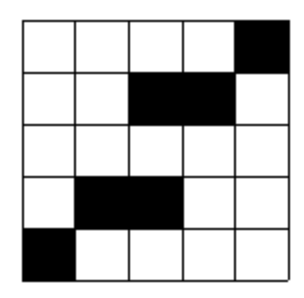




> Question



* Find number places unique 1x2 or 2x1 white rectangle

```txt
Input:
5
....X
..XX.
.....
.XX..
X....

Output: 5 4
```




```py
a = int(input())
G = []
for i in range(a):
  G.append(input() + 'X')
G.append('X' * (a + 1))
hor, ver = 0, 0
for i in range(a):
  for j in range(a - 1):
    if G[i][j] == '.' and G[i][j + 1] == '.' and G[i][j + 2] == 'X':
      hor += 1
    if G[j][i] == '.' and G[j + 1][i] == '.' and G[j + 2][i] == 'X':
      ver += 1
print(hor, ver)
```



