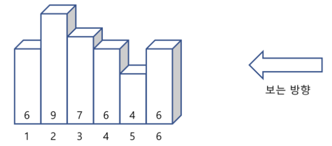




> Question



* find number of visible bars




```py
a = int(input())
li = []
for _ in range(a):
  li.append(int(input()))

mx, ret = 0, 0
for n in reversed(li):
  if mx < n:
    mx = n
    ret += 1

print(ret)
```



