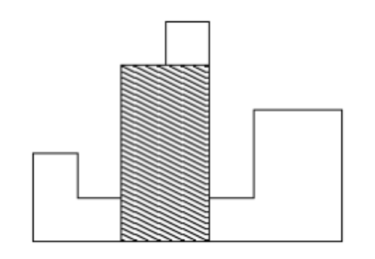




> Question



* find the largest rectangle inside the histogram

```txt
Input:
7
2
1
4
5
1
3
3

Output: 8
```




```py
def largest_rect(heights):
  hws, mx_area = [], 0
  for i, h in enumerate(heights):
    width = 0
    while len(hws) and h < hws[-1][0]:
      width += hws[-1][1]
      mx_area = max(mx_area, width * hws[-1][0])
      hws.pop()
    hws.append([h, width + 1])
  while hws:
    width += hws[-1][1]
    mx_area = max(mx_area, width * hws.pop()[0])
  return mx_area

line = int(input())
heights = [int(input()) for _ in range(line)]
print(largest_rect(heights))
```



