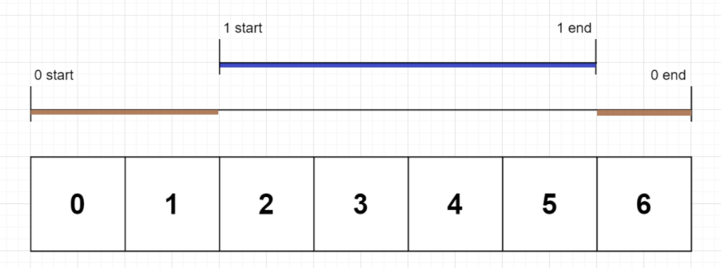

# String




* character charAt(`idx`) : return character in `idx`
* String[] split(`str`A):

```java
// 1. Print in format
System.out.println(System.getProperty("file.encoding"));  // Print encoding type of file
String.format("%s, %.2f and %d", “string”, 0.01, 12);     // Print file format

getBytes()
split(String regex, int limit)                            // if limit = 0, remove trailing empty strings, if neg, keep

// 2. Print Korean in java
public class a {
  private static void printIt(String string) {
    for (int i = 0; i < string.length(); i++) {
      System.out.print(String.format("U+%04X ", string.codePointAt(i)));
    }
    System.out.println();
  }

  public static void main(String[] args) {
    String han = "한";

    String nfd = Normalizer.normalize(han, Normalizer.Form.NFD);
    printIt(nfd);
    String nfc = Normalizer.normalize(nfd, Normalizer.Form.NFC);
    printIt(nfc);
  }
}
```




* charAt / charCodeAt()
* concat()
* constructorendsWith()
* fromCharCode()
* includes()
* lastIndexOf()
* lengthlocaleCompare()
* prototyperepeat()
* search()
* startsWith()
* substr()
* substring()
* toLocaleLowerCase / UpperCase()
* toLowerCase / UpperCase()
* toString()
* trim()
* valueOf()

* split(delim, time)
  * str.split("o").length-1 : count number of occurence →
* indexOf()
  * s.indexOf(" ")

* match() : search a string for a match and returns matches

* replace()
  * ("bef", "aft") : only once
  * (/bef/g, "after") : replace all

* slice(start, end) : extract parts of a string
  * .slice(1, end - 1) : removes first and last char
  * ("000" + n).splice(-4) : rihgt pad
  * (n + "000").splice(4) : rihgt pad
  * hit.objectID.split('-').slice(0, -1).join('-') : python rsplit

```js
// 1. split_string
var splits = [s.slice(0, i) + s.slice(i + 1)]
```




> baekjoon

* [Level 4 : 컵홀더](http://acmicpc.net/problem/2810)
  * [Update solution](https://github.com/seanhwangg/algorithm/edit/main/data-structure/string/string/BJ_2810.md)




> Question

* determines the maximum number of people that can fit a cup into the cupholder

```txt
Input:
9
SLLLLSSLL

Output: 7
```




```py
input()
s = input()
if 'L' not in s:
  print(len(s))
else:
  print(len(s.replace("LL", "S")) + 1)
```




* [Level 4 : 니모를 찾아서](http://acmicpc.net/problem/10173)
  * [Update solution](https://github.com/seanhwangg/algorithm/edit/main/data-structure/string/string/BJ_10173.md)




> Question

* Print if nemo is in string until last line with EOI

```txt
Input:
Marlin names this last egg Nemo, a name that Coral liked.
While attempting to save nemo, Marlin meets Dory,
a good-hearted and optimistic regal blue tang with short-term memory loss.
Upon leaving the East Australian Current,(888*%$^&%0928375)Marlin and Dory
NEMO leaves for school and Marlin watches NeMo swim away.
EOI

Output:
Found
Found
Missing
Missing
Found
```




```py
while 1:
  b = input()
  if b == 'EOI': break
  b = b.lower()
  if 'nemo' in b:
    print('Found')
  else:
    print('Missing')
```




* [Level 4 : KMP는 왜 KMP일까?](http://acmicpc.net/problem/2902)
  * [Update solution](https://github.com/seanhwangg/algorithm/edit/main/data-structure/string/string/BJ_2902.md)




> Question

* Print only upper characters

```txt
Input: Knuth-Morris-Pratt
Output: KMP
```




```py
for i in input():
  if i.isupper():
    print(i, end='')
```




* [Level 4 : 5와 6의 차이](http://acmicpc.net/problem/2864)
  * [Update solution](https://github.com/seanhwangg/algorithm/edit/main/data-structure/string/string/BJ_2864.md)




> Question

* if 5, 6 can be written interchangably, find min, max

```txt
Input: 1430 4862
Output: 6282 6292
```




```py
a, b = input().split()
mx = int(a.replace('5', '6')) + int(b.replace('5', '6'))
mn = int(a.replace('6', '5')) + int(b.replace('6', '5'))
print(mn, mx)
```




* [Level 4 : 유학 금지](http://acmicpc.net/problem/2789)
  * [Update solution](https://github.com/seanhwangg/algorithm/edit/main/data-structure/string/string/BJ_2789.md)




> Question

* erase all CAMBRIDGE from letter

```txt
Input: LOVA
Output: LOV
```




```py
a = "CAMBRIDGE"
s = input()
for i in a:
  for j in range(len(s)):
    if i == s[j]:
      s[j] = ''
print(*s, sep='')
```




* [Level 4 : 첫 글자를 대문자로](http://acmicpc.net/problem/4458)
  * [Update solution](https://github.com/seanhwangg/algorithm/edit/main/data-structure/string/string/BJ_4458.md)




> Question

* Capitalize first letter

```txt
Input:
5
powdered Toast Man
skeletor
Electra Woman and Dyna Girl
she-Ra Princess of Power
darth Vader

Output:
Powdered Toast Man
Skeletor
Electra Woman and Dyna Girl
She-Ra Princess of Power
Darth Vader
```




```cpp
#include<cstdio>
#include<cctype>

int n;
char s[31];
int main() {
  scanf("%d", &n);
  while (n--) {
    scanf(" %[^\n]s", s);
    printf("%c%s\n", toupper(s[0]), s + 1);
  }
}
```




```py
for i in range(int(input())):
  j = input()
  print(j[0].upper() + j[1:])
```




* [Level 5 : 알파벳 전부 쓰기](http://acmicpc.net/problem/11091)
  * [Update solution](https://github.com/seanhwangg/algorithm/edit/main/data-structure/string/string/BJ_11091.md)




> Question

* Print unused character from ascii

```txt
Input:
3
The quick brown fox jumps over the lazy dog.
ZYXW, vu TSR Ponm lkj ihgfd CBA.
.,?!'" 92384 abcde FGHIJ

Output:
pangram
missing eq
missing klmnopqrstuvwxyz
```




```py
import string
for _ in range(int(input())):
  a = input().lower()
  missing = []
  for ch in string.ascii_lowercase:
    if ch not in a:
      missing.append(ch)
  print("missing " + "".join(missing) if missing else "pangram")
```




* [Level 5 : 유진수](http://acmicpc.net/problem/1356)
  * [Update solution](https://github.com/seanhwangg/algorithm/edit/main/data-structure/string/string/BJ_1356.md)




> Question

* Determine if a number can be divided into two parts, and product of front digit and product of back digit are same

```txt
Input: 1236
Output: YES
```




```py
n = input()
n_len = len(n)
true = 0
for i in range(n_len - 1):
  left = 1
  right = 1
  for j in range(i + 1):
    left *= int(n[j])
  for k in range(i + 1, n_len):
    right *= int(n[k])
  if left == right:
    print("YES")
    break
else:
  print("NO")
```




* [Level 7 : 폴리오미노](http://acmicpc.net/problem/1343)
  * [Update solution](https://github.com/seanhwangg/algorithm/edit/main/data-structure/string/string/BJ_1343.md)




> Question

* Now given a board consisting of '.' and 'X', cover all 'X' with polyomino without overlap
* '.' should not be covered with polyomino
* Print -1 if it cannot be done

```txt
Input: XX.XX
Output: BB.BB
```




```py
a=input().replace('XXXX','AAAA').replace('XX','BB')
print(-1 if 'X' in a else a)
s = input()
k = input()
print(int(k in s))
```




* [Level 12 : 별 찍기 - 11](http://acmicpc.net/problem/2448)
  * [Update solution](https://github.com/seanhwangg/algorithm/edit/main/data-structure/string/string/BJ_2448.md)




> Question

```txt
Input: 24

Output:
                       *
                      * *
                     *****
                    *     *
                   * *   * *
                  ***** *****
                 *           *
                * *         * *
               *****       *****
              *     *     *     *
             * *   * *   * *   * *
            ***** ***** ***** *****
           *                       *
          * *                     * *
         *****                   *****
        *     *                 *     *
       * *   * *               * *   * *
      ***** *****             ***** *****
     *           *           *           *
    * *         * *         * *         * *
   *****       *****       *****       *****
  *     *     *     *     *     *     *     *
 * *   * *   * *   * *   * *   * *   * *   * *
***** ***** ***** ***** ***** ***** ***** *****
```




```cpp
#include<bits/stdc++.h>
using namespace std;

int main() {
  int a;
  cin >> a;
  vector<string> star = {"  *  ", " * * ","*****"};
  a /= 3;

  while (a != 1){
    int N = star.size();
    for (int i = 0; i < N; i++)
      star.push_back(star[i] + " " + star[i]);
    for (int i = 0; i < N; i++)
      star[i] = string(N, ' ') + star[i] + string(N, ' ');
    a /= 2;
  }

  for (string str : star)
    cout << str << "\n";

  return 0;
}
```




```py
N = int(input())
star = ["*","* *","*****"]
k = 3

while k < N:
  star += [s.ljust(k*2) + s for s in star]
  k *= 2

for s in star:
  print(s.center(2*N-1))
```




> kattis

* [Level 1.3 : Greetings!](https://open.kattis.com/problems/greetings2)
  * [Update solution](https://github.com/seanhwangg/algorithm/edit/main/data-structure/string/string/KT_greetings2.md)




> Question

* heey 에서 e 가 들어온 만큼 추가해서 출력하라

```txt
Input: heeeeey
Output: heeeeeeeeeey
```




```py
print(input().replace("e", "ee"))
```




* [Level 1.5 : Fifty Shades of Pink](https://open.kattis.com/problems/fiftyshades)
  * [Update solution](https://github.com/seanhwangg/algorithm/edit/main/data-structure/string/string/KT_fiftyshades.md)




> Question

* 첫줄엔 N 이 그 다음 N 줄엔 문자가 주어진다
* 이 때 rose나 pink를 포함한 문자의 수를 구하라. (단 대문자 / 소문자는 무시한다.)

```txt
Input:
12
pink
tequilaSunrose
mExicanPInK
Coquelicot
turqrose
roSee
JETblack
pink
babypink
pInKpinkPinK
PInkrose
lazerlemon

Output: 9
```




```py
N = int(input())
count = 0
for _ in range(N):
  st = input().lower()
  if st.find('pink') != -1 or st.find('rose') != -1:
    count += 1

print(count if count != 0 else "I must watch Star Wars with my daughter")
```




* [Level 1.5 : Quick Brown Fox](https://open.kattis.com/problems/quickbrownfox)
  * [Update solution](https://github.com/seanhwangg/algorithm/edit/main/data-structure/string/string/KT_quickbrownfox.md)

[//]: # (BJ_11091)

* [Level 1.7 : Death Knight Hero](https://open.kattis.com/problems/deathknight)
  * [Update solution](https://github.com/seanhwangg/algorithm/edit/main/data-structure/string/string/KT_deathknight.md)




> Question

* 첫줄에 N이 주어진다
* 다음 각각 N줄에 문자가 주어지는데, 이 때 CD를 포함하지 않는 줄의 수를 구하여라

```txt
Input:
3
DCOOO
DODOCD
COD

Output: 2
```




```py
n = int(input())
ret = 0
for _ in range(n):
  if input().find('CD') == -1:
    ret += 1
print(ret)
```




* [Level 1.8 : Run-Length Encoding, Run!](https://open.kattis.com/problems/runlengthencodingrun)
  * [Update solution](https://github.com/seanhwangg/algorithm/edit/main/data-structure/string/string/KT_runlengthencodingrun.md)




> Question

* Convert using two rules

```txt
Input: E HHHeellloWooorrrrlld!!
Output: H3e2l3o1W1o3r4l2d1!2
```




```py
t, s = input().split()
if t == 'E':
  row = 1
  for i, ch in enumerate(s):
    if i == len(s) - 1 or s[i + 1] != s[i]:
      print(ch + str(row), end='')
      row = 1
    else:
      row+=1
else:
  for i in range(1, len(s), 2):
    print(s[i - 1] * int(s[i]), end='')
```




> leetcode

* [Level Easy : Check if Binary String Has at Most One Segment of Ones](https://leetcode.com/problems/check-if-binary-string-has-at-most-one-segment-of-ones)
  * [Update solution](https://github.com/seanhwangg/algorithm/edit/main/data-structure/string/string/LC_1784.md)




> Question

* Given a binary string s ​​​​​without leading zeros, return if s contains at most one contiguous segment of ones

```txt
Input: "010"
Output: False
```




```py
def checkOnesSegment(self, s: str) -> bool:
  return "01" not in s
```




* [Level Easy : Goal Parser Interpretation](https://leetcode.com/problems/goal-parser-interpretation)
  * [Update solution](https://github.com/seanhwangg/algorithm/edit/main/data-structure/string/string/LC_1678.md)




> Question



```txt
Input: command = "G()()()()(al)"
Output: "Gooooal"
```




```cpp
string interpret(string s) {
  string ans;
  for (int i = 0; i < s.size(); ) {
    if (s[i] == 'G') ans += 'G', ++i;
    else if (s[i + 1] == ')') ans += 'o', i += 2;
    else ans += "al", i += 4;
  }
  return ans;
}
```




```py
def interpret(self, command: str) -> str:
  return command.replace('()', 'o').replace('(al)', 'al')
```




* [Level Medium : String to Integer (atoi)](https://leetcode.com/problems/string-to-integer-atoi)
  * [Update solution](https://github.com/seanhwangg/algorithm/edit/main/data-structure/string/string/LC_8.md)




> Question

* implement atoi function (string to int)

```txt
Input: s = "   -42"
Output: -42
```




```py
class Solution(object):
  def myAtoi(self, s):
    ls = list(s.strip())
    if len(ls) == 0: return 0
    sign = -1 if ls[0] == '-' else 1
    if ls[0] in ['-','+'] : del ls[0]
    ret, i = 0, 0
    while i < len(ls) and ls[i].isdigit() :
      ret = ret * 10 + int(ls[i])
      i += 1
    return max(-2**31, min(sign * ret,2**31-1))
```




* [Level Hard : K-th Smallest in Lexicographical Order](https://leetcode.com/problems/k-th-smallest-in-lexicographical-order)
  * [Update solution](https://github.com/seanhwangg/algorithm/edit/main/data-structure/string/string/LC_440.md)




> Question

* Given integers n and k, find the lexicographically k-th smallest integer in the range from 1 to n

```txt
Input: n = 13, k = 2
Output: 10
```




```cpp
int findKthNumber(int n, int k) {
  int result = 1;
  for(--k; k > 0; ) {
    int count = 0;  // calculate #|{result, result*, result**, result***, ...}|
    for (long long first = static_cast<long long>(result), last = first + 1;
      first <= n; first *= 10, last *= 10) {           // while interval is not empty, increase a digit
      // valid interval = [first, last) union [first, n]
      count += static_cast<int>((min(n + 1LL, last) - first)); // add the length of interval
    }

    if (k >= count) { // skip {result, result*, result**, result***, ...} increase the current prefix
      ++result;
      k -= count;
    }
    else {      // not able to skip all of {result, result*, result**, result***, ...} search more detailedly
      result *= 10;
      --k;
    }
  }
  return result;
};
```




```py
def findKthNumber(self, n, k):
  result = 1
  k -= 1
  while k > 0:
    count = 0
    lo, hi = result, result+1
    # prefix count
    # [result, result+1)
    # [result*10, (result+1)*10 )
    # [result*100, (result+1)*100 )
    while lo <= n:
      count += min(n+1, hi) - lo
      lo, hi = 10 * lo, 10 * hi
    if k >= count:
      result += 1
      k -= count
    else:
      result *= 10
      k -= 1
  return result
```




## Case

> baekjoon

* [Level 4 : CAP](http://acmicpc.net/problem/15000)
  * [Update solution](https://github.com/seanhwangg/algorithm/edit/main/data-structure/string/case/BJ_15000.md)




> Question

* Print given string in uppercase

```txt
Input: alert
Output: ALERT
```




```py
print(input().upper())
```




* [Level 4 : 입실 관리](http://acmicpc.net/problem/5524)
  * [Update solution](https://github.com/seanhwangg/algorithm/edit/main/data-structure/string/case/BJ_5524.md)




> Question

* Print name in lower case

```txt
Input:
3
WatanabE
ITO
YamaMoto

Output:
watanabe
ito
yamamoto
```




```py
for _ in range(int(input())):
  print(input().lower())
```




* [Level 4 : 대소문자 바꾸기](http://acmicpc.net/problem/2744)
  * [Update solution](https://github.com/seanhwangg/algorithm/edit/main/data-structure/string/case/BJ_2744.md)




> Question

* Swap case

```txt
Input: Hi
Output: hI
```




```cpp
#include<cstdio>
char w[101];

int main() {
  scanf("%s", w);
  for (int i = 0; w[i]; ++i) {
    printf("%c", w[i] ^ 32);
  }
}
```




```py
st = input()
for ch in st:
  if ch.islower():
    print(ch.upper(), end='')
  else:
    print(ch.lower(), end='')
```




> kattis

* [Level 1.4 : Alphabet Spam](https://open.kattis.com/problems/alphabetspam)
  * [Update solution](https://github.com/seanhwangg/algorithm/edit/main/data-structure/string/case/KT_alphabetspam.md)




> Question

* 첫줄에 문장이 주어진다
* 이 때 문장에서 _의 비율, 소문자의 비율, 대문자의 비율, 나머지 부호의 비율을 각각 출력하라

```txt
Input: Welcome_NWERC_participants!

Output:
0.0740740740740741
0.666666666666667
0.222222222222222
0.0370370370370370
```




```py
st = input()
white = 0
lower = 0
upper = 0
symbol = 0
for ch in st:
  if ch == '_':
    white += 1
  elif ch.islower():
    lower += 1
  elif ch.isupper():
    upper += 1
  else:
    symbol += 1

total = white + lower + upper + symbol
print(white / total)
print(lower / total)
print(upper / total)
print(symbol / total)
```




## Encoding

* Rules for translating a Unicode string into a sequence of bytes are called an encoding
* Byte Order Mark # Set encoding for file

* ASCII : American Standard Code for Information Interchange
  * code point (U+ or \u)
  * U+0000~U+FFFF : BMP (Basic Multilingual Plane)
  * U+10000~U+1FFFF : SMP (Supplementary Multilingual Plane)


* URL Encoding

| Value | Symbol |
| ----- | ------ |
| %21   | !      |
| %40   | @      |

* UTF-8
  * Three byte encoding for korean
  * Korea [(initial) × 588 + (medial) × 28 + (final)] + 44032

* CP949
* EUC-KR

### Unicode

> baekjoon

* [Level 1 : 한글 2](http://acmicpc.net/problem/11283)
  * [Update solution](https://github.com/seanhwangg/algorithm/edit/main/data-structure/string/unicode/BJ_11283.md)




> Question

* 몇번째 한글인지 출력

```txt
Input: 힣
Output: 11172
```




```py
print(ord(input()) + 1 - ord("가"))
```




* [Level 1 : 아스키 코드](http://acmicpc.net/problem/11654)
  * [Update solution](https://github.com/seanhwangg/algorithm/edit/main/data-structure/string/unicode/BJ_11654.md)




> Question

* Print ascii of character

```txt
Input: C
Output: 67
```




```sh
read n
printf "%d" \'$n
```




```cpp
#include<bits/stdc++.h>
using namespace std;

int main() {
  char a;
  cin >> a;
  cout << (int)a;
  return 0;
}
```




```py
print(ord(input()))
```




```v
module main;
  initial begin
    integer code;
    logic[7:0] c;
    code = $fscanf(32'h8000_0000, "%c", c);
    $display("%0d", c);
    $finish;
  end
endmodule
```




* [Level 2 : 한글](http://acmicpc.net/problem/11282)
  * [Update solution](https://github.com/seanhwangg/algorithm/edit/main/data-structure/string/unicode/BJ_11282.md)




> Question

* When N is given as an input, write a program to obtain the Nth korean letter

```txt
Input: 11172
Output: 힣
```




```py
print(chr(ord('가') + int(input()) - 1))
```




* [Level 4 : IBM 빼기 1](http://acmicpc.net/problem/6321)
  * [Update solution](https://github.com/seanhwangg/algorithm/edit/main/data-structure/string/unicode/BJ_6321.md)




> Question

* Print next unicode for each character

```txt
Input:
2
HAL
SWERC

Output:
String #1
IBM
String #2
TXFSD
```




```py
for c in range(1,int(input())+1):
  r = ''
  for i in input(): r += chr(65+(ord(i)-64)%26)
  print(f"String #{c}\n{r}\n")
```




* [Level 4 : 카이사르 암호](http://acmicpc.net/problem/5598)
  * [Update solution](https://github.com/seanhwangg/algorithm/edit/main/data-structure/string/unicode/BJ_5598.md)




> Question

* Print senetence, shifting three character

```txt
Input: MRL
Output: JOI
```




```py
st = input()
for ch in st:
  if ch <= 'C':
    print(chr(ord(ch) + 23), end='')
  else:
    print(chr(ord(ch) - 3), end='')
```




* [Level 4 : 애너그램 거리](http://acmicpc.net/problem/3778)
  * [Update solution](https://github.com/seanhwangg/algorithm/edit/main/data-structure/string/unicode/BJ_3778.md)




> Question

* Print minimum number of characters to remove to make two string to anagram

```txt
4
crocus
succor
dares
seared
empty

Input:
smell
lemon

Output:
Case #1: 0
Case #2: 1
Case #3: 5
Case #4: 4
```




```py
import sys

n = int(input())

for i in range(n):
  a = sys.stdin.readline().rstrip()
  b = sys.stdin.readline().rstrip()
  ans = 0
  for j in range(0, 26):
    c = chr(97 + j)
    ans += abs(a.count(c) - b.count(c))
  print("Case #%d: %d" % (i+1, ans))
```




* [Level 4 : 등장하지 않는 문자의 합](http://acmicpc.net/problem/3059)
  * [Update solution](https://github.com/seanhwangg/algorithm/edit/main/data-structure/string/unicode/BJ_3059.md)




> Question

* Print sum of all ascii values that doesn't appear

```txt
Input:
2
ABCDEFGHIJKLMNOPQRSTUVW
A

Output:
267
1950
```




```py
for _ in range(int(input())):
  print(2015 - sum(map(ord, set(input()))))
```




* [Level 4 : 알파벳 거리](http://acmicpc.net/problem/5218)
  * [Update solution](https://github.com/seanhwangg/algorithm/edit/main/data-structure/string/unicode/BJ_5218.md)




> Question

* print distance between two words

```txt
Input:
5
AAAA ABCD
ABCD AAAA
DARK LOKI
STRONG THANOS
DEADLY ULTIMO

Output:
Distances: 0 1 2 3
Distances: 0 25 24 23
Distances: 8 14 19 24
Distances: 1 14 9 25 1 12
Distances: 17 7 19 5 1 16
```




```py
for _ in range(int(input())):
  a, b = input().split()
  li = []
  for i in range(len(a)):
    li.append((ord(b[i])-ord(a[i]))%26)
  print("Distances:", *li)
```




* [Level 4 : 다이얼](http://acmicpc.net/problem/5622)
  * [Update solution](https://github.com/seanhwangg/algorithm/edit/main/data-structure/string/unicode/BJ_5622.md)




> Question


* Minimum time to call dial

```txt
Input: UNUCIC
Output: 36
```




```py
tel = input()
delay = 0
data = [3,3,3,4,4,4,5,5,5,6,6,6,7,7,7,8,8,8,8,9,9,9,10,10,10,10]
for c in tel:
  delay += data[ord(c)-65]
print(delay)
```




* [Level 4 : 알파벳 찾기](http://acmicpc.net/problem/10809)
  * [Update solution](https://github.com/seanhwangg/algorithm/edit/main/data-structure/string/unicode/BJ_10809.md)




> Question

* Print position of each alphabet

```txt
Input: baekjoon
Output: 1 0 -1 -1 2 -1 -1 -1 -1 4 3 -1 -1 7 5 -1 -1 -1 -1 -1 -1 -1 -1 -1 -1 -1
```




```py
s = input()
for i in range(ord('a'), ord('z') + 1):
  print(s.find(chr(i)), end=' ')
```




* [Level 5 : ROT13](http://acmicpc.net/problem/11655)
  * [Update solution](https://github.com/seanhwangg/algorithm/edit/main/data-structure/string/unicode/BJ_11655.md)




> Question

* Print rot13 of given number (move each character to 13)

```txt
Input: Baekjoon Online Judge
Output: Onrxwbba Bayvar Whqtr
```




```py
import codecs
print(codecs.encode(input(),"rot13"))
```




* [Level 5 : 열 순서](http://acmicpc.net/problem/16495)
  * [Update solution](https://github.com/seanhwangg/algorithm/edit/main/data-structure/string/unicode/BJ_16495.md)




> Question

* convert excel row to number

```txt
Input: AZ
Output: 52
```




```py
s = input()[::-1]
t = 0
for i in range(len(s)):
  t += (26**i)*(ord(s[i])-64)
print(t)
```




## Regex




```cpp
#include <regex>
using namespace std;

// 1. Regex match
string a = "GeeksForGeeks";
regex b("(Geek)(.*)");
regex_match(a, b);

// 2. replace string
string defangIPaddr(string address) {
  return regex_replace(address, regex("[.]"), "[.]");     // regex(“\\.”)
}
```




* /()/;

```js
"a,b".match(/([^,]*,(.*)/))   // split once using regex
```




> re

* re.DOTALL : match new line
* re.I : case insensitive matching
* r"(?<=...)" : positive lookbehind
* r"(?<!...)" : negative lookbehind
* r"(?=...)" : positive lookahead. A (?!B) only match if A followed by B
* r"(?!...)" : negative lookahead. A (?!Sam) match Tom Sam

* Escape \\ : for dot(.), dash(-), braces()), bracket(])

* findall(pattern, string, flags=0) : Return all non-overlapping matches of pattern
* finditer(pattern, string)
* match() : match at the beginning of the string
* search() : Checks for one match
* split(pattern, string, maxsplit=0) : split(r'\W+', 'Words, words') ⇒ ['Words', 'words', '']

* Word
  * r"[a-c]" : contain a, b, c
  * r"[^a-c]" : not contain a, b, c
  * r"^a" : starts with a
  * r"a$" : ends with a
  * r"\b(words)\b" : word boundary
  * r".*a" : greedy match (all the way to the end, and then backtrack to a)
  * r".*?" : non-greedy (will try to match extra characters until it matches 1)
  * "\n" : references the nth capturing group
  * "^([aeiou]).+\1$" : Starts and End with same vowel
  * "^\d\d(-?)\d\d\1\d\d\1\d\d" : 12345678 or 12-34-56-78
  * r"一-龥" : Chineses Character
  * r"가-힇" : Korean Character
  * r"ぁ-ゔ|ァ-ヴー|々〆〤" : Japanese Character

* Length
  * {5} : five character
  * {2,6} : between 2, 6
  * \+ / * : 1 / 0 or more
  * ? : optional

* Conditional
  * (cat | dog) : cat or dog

* : Type
  * r"\w" : Unicode letter, ideogram, digit, underscore  ; Capital <>
  * [r"\d", r"\D"] : digit | Non-digit
  * [r"\s", r"\S"] : space, tab, newline | non-space, tab, newline
  * r"\t" : tab

* match()
  * expand(template) : obtained by doing backslash substitution on template
  * group(n) : 0 for entire match, n th match
  * groups() : Tuples containing all match
  * groupdict() : (?P<first_name>\w+) → firstname:
  * string : The string passed to match() or search()

* findall()
  * ("{[^{}]+}", "{A}, {{B}} {{C}, {D}, E}") : Nested Parenthesis
  * ("\((?:1|82)\)", "(82) (821) (1) 82 1") : phone number
  * ("(?i)\d{2}:\d{2}(?:am|pm)", "02:40pm 12:29AM") : Non capture group
  * (r'(.*?)D', "ABCD, ABD") : Grap little as possible
  * (r'([a-zA-Z0-9_.+-]+@[a-zA-Z0-9-]+\.[a-zA-Z0-9-.]+)', "rbtmd10@gmail.com, fakeemail@@f.com") : email

* search()
* split()
* sub()
  * re.sub('\W+', ' ', ex) : made up string to Test 2 한국different regex23 methods

```py
# 1. findall
ex = 'made|up string*.to>>>>Test----   2""""""한국different~regex23-methods'
re.findall('\S+', ex)     # ['made|up', 'string*.to>>>>Test----', '2""""""한국different~regex23-methods']
re.findall('\w+', ex)     # ['made', 'up', 'string', 'to', 'Test', '2', '한국different', 'regex23', 'methods']
re.findall(dr, ex)        # ['23']
re.findall('\w{4}\-', ex) # ['Test-', 'ex23-']

# 2. Search
txt = "The rain in Spain"
x = re.search(r"\bS\w+", txt)
print(x.string)    # "The rain in Spain"
ex = 'made|up string*.to>>>>Test----   2""""""한국different~regex23-methods'
re.search('\w+', ex) #   <re.Match object; span=(0, 4), match='made'>
re.search('\w+', ex)    # end : 4, group : made, groupdict : {}, groups : (), span : (0, 4), start : 0

# 3. split
ex = 'made|up string*.to>>>>Test----   2""""""한국different~regex23-methods'
re.split('\s', ex)  # ['made|up', 'string*.to>>>>Test----', '', '', '2""""""한국different~regex23-methods']
re.split('\s+', ex) # ['made|up', 'string*.to>>>>Test----', '2""""""한국different~regex23-methods']
re.split('\w+', ex) # ['', '|', ' ', '*.', '>>>>', '----   ', '""""""', '~', '-', '']
re.split('\W+', ex) # ['made', 'up', 'string', 'to', 'Test', '2', '한국different', 'regex23', 'methods']
```




### Alternation

> hackerrank

* [Level Easy : Matching Specific Characters](https://www.hackerrank.com/challenges/matching-specific-characters/problem)
  * [Update solution](https://github.com/seanhwangg/algorithm/edit/main/data-structure/string/alternation/HR_matching-specific-characters.md)




> Question

* must be of length: 6
* First character: 1, 2 or 3
* Second character: 1, 2 or 0
* Third character: x, s or 0
* Fourth character: 3, 0 , A or a
* Fifth character: x, s or u
* Sixth character: . or ,

```txt
Input: 1203x.
Output: true
```




```py
import re
pattern = r'^[123][120][xs0][30Aa][xsu][.,]$'
print(str(bool(re.search(pattern, input()))).lower())
```




* [Level Easy : Matching Character Ranges](https://www.hackerrank.com/challenges/matching-range-of-characters/problem)
  * [Update solution](https://github.com/seanhwangg/algorithm/edit/main/data-structure/string/alternation/HR_matching-range-of-characters.md)




> Question

* first character must be a lowercase English alphabetic character
* second character must be a positive digit. Note that we consider zero to be neither positive nor negative
* third character must not be a lowercase English alphabetic character
* fourth character must not be an uppercase English alphabetic character
* fifth character must be an uppercase English alphabetic character

```txt
Input: h4CkR
Output: true
```




```py
import re
pattern = r'^[a-z][1-9][^a-z][^A-Z][A-Z]'
print(str(bool(re.search(pattern, input()))).lower())
```




* [Level Easy : IP Address Validation](https://www.hackerrank.com/challenges/ip-address-validation/problem)
  * [Update solution](https://github.com/seanhwangg/algorithm/edit/main/data-structure/string/alternation/HR_ip-address-validation.md)




> Question

* IPv4 address is A.B.C.D where A, B, C and D are Integers lying between 0 and 255
* IPv6 8 groups of 16 bits each
  * Each group is written as 4 hexadecimal digits and the groups are separated by colons (:)
  * Leading 0 may be omitted

```txt
Input:
3
This line has junk text.
121.18.19.20
2001:0db8:0000:0000:0000:ff00:0042:8329

Output:
Neither
IPv4
IPv6
```




```py
import re

number = int(input())
RE_IPV4 = r'^(([0-9]|[0-9]{2}|1[0-9]{2}|2[0-4][0-9]|25[0-5])\.){3}([0-9]|[0-9]{2}|1[0-9]{2}|2[0-4][0-9]|25[0-5])$'
RE_IPV6 = r'^([a-f0-9]{0,4}:[a-f0-9]{0,4}:[a-f0-9]{0,4}:[a-f0-9]{0,4}:[a-f0-9]{0,4}:[a-f0-9]{0,4}:[a-f0-9]{0,4}:[a-f0-9]{0,4})$'
for n in range(number):
  string = input()
  if re.search(RE_IPV4, string):
    print('IPv4')
  elif re.search(RE_IPV6, string):
    print('IPv6')
  else:
    print('Neither')
```




* [Level Easy : The British and American Style of Spelling](https://www.hackerrank.com/challenges/uk-and-us/problem)
  * [Update solution](https://github.com/seanhwangg/algorithm/edit/main/data-structure/string/alternation/HR_uk-and-us.md)




> Question

* For some spelling, US uses -se, while UK uses -ze
* Given text, find the number of occurence from sentence either of them

```txt
Input:
2
hackerrank has such a good ui that it takes no time to familiarise its environment
to familiarize oneself with ui of hackerrank is easy
1
familiarize

Output: 2
```




```py
import re

text = '\n'.join(input() for _ in range(int(input())))
for n in range(int(input())):
  e = input()
  print(len(re.findall(f"{e[:len(e)-2]}[sz]e", text)))
```




* [Level Easy : UK and US: Part 2](https://www.hackerrank.com/challenges/uk-and-us-2/problem)
  * [Update solution](https://github.com/seanhwangg/algorithm/edit/main/data-structure/string/alternation/HR_uk-and-us-2.md)




> Question

* For some spelling, US uses or, while UK uses our
* Given UK spelling, find the number of occurence from sentence either of them

```txt
Input:
2
the odour coming out of the leftover food was intolerable
ammonia has a very pungent odor
1
odour

Output: 2
```




```py
import re
text = '\n'.join(input() for _ in range(int(input())))
for i in range(int(input())):
  s1 = input()
  s2 = s1.replace('our','or')
  print(len(re.findall(rf"\b({s1}|{s2})\b", text)))
```




* [Level Easy : Matching One Or More Repetitions](https://www.hackerrank.com/challenges/matching-one-or-more-repititions/problem)
  * [Update solution](https://github.com/seanhwangg/algorithm/edit/main/data-structure/string/alternation/HR_matching-one-or-more-repititions.md)




> Question

* begin with  or more digits
* After that, should have 1 or more uppercase letters
* should end with 1 or more lowercase letters

```txt
Input: 1Qa
Output: true
```




```py
import re
pattern = r'^\d+[A-Z]+[a-z]+$'
print(str(bool(re.search(pattern, input()))).lower())
```




* [Level Easy : Alternative Matching](https://www.hackerrank.com/challenges/alternative-matching/problem)
  * [Update solution](https://github.com/seanhwangg/algorithm/edit/main/data-structure/string/alternation/HR_alternative-matching.md)




> Question

* must start with Mr., Mrs., Ms., Dr. or Er.
* The rest of the string must contain only one or more English alphabetic letters (upper and lowercase)

```txt
Input: Mr.DOSHI
Output: true
```




```py
import re
pattern = r'^(Mr|Mrs|Ms|Dr|Er)\.[A-Za-z]+$'  # Do not delete 'r'.

print(str(bool(re.search(pattern, input()))).lower())
```




### Anchor

> hackerrank

* [Level Easy : Matching Ending Items](https://www.hackerrank.com/challenges/matching-ending-items/problem)
  * [Update solution](https://github.com/seanhwangg/algorithm/edit/main/data-structure/string/anchor/HR_matching-ending-items.md)




> Question

* should consist of only lowercase and uppercase letters (no numbers or symbols)
* should end in s

```txt
Input: Kites
Output: true
```




```py
import re
pattern = r'^[a-zA-Z]*s$'
print(str(bool(re.search(pattern, input()))).lower())
```




* [Level Easy : Matching Word Boundaries](https://www.hackerrank.com/challenges/matching-word-boundaries/problem)
  * [Update solution](https://github.com/seanhwangg/algorithm/edit/main/data-structure/string/anchor/HR_matching-word-boundaries.md)




> Question

* Start with vowel (a,e,i,o, u, A, E, I , O or U)
* Any length. The matched word should consist of letters (lowercase and uppercase both) only
* The matched word must start and end with a word boundary
  * Before the first character in the string, if the first character is a word character
  * Between two characters in the string, where one is a word character and the other is not a word character
  * After the last character in the string, if the last character is a word character

```txt
Input: Found any match?
Output: true
```




```py
import re
pattern = r'\b[aeiouAEIOU][a-zA-Z]*\b'
print(str(bool(re.search(pattern, input()))).lower())
```




* [Level Easy : Matching Start & End](https://www.hackerrank.com/challenges/matching-start-end/problem)
  * [Update solution](https://github.com/seanhwangg/algorithm/edit/main/data-structure/string/anchor/HR_matching-start-end.md)




> Question

* must start with a digit and end with . symbol
* should be characters long only

```txt
Input: 0qwer.
Output: true
```




```py
import re

pattern = r'^\d\w\w\w\w\.$'
print(str(bool(re.search(pattern, input()))).lower())
```




* [Level Medium : Find a Word](https://www.hackerrank.com/challenges/find-a-word/problem)
  * [Update solution](https://github.com/seanhwangg/algorithm/edit/main/data-structure/string/anchor/HR_find-a-word.md)




> Question

* For every word, print the number of occurrences of the word in all the N sentences listed

```txt
Input:
1
foo bar (foo) bar foo-bar foo_bar foobar bar-foo bar, foo.
2
foo
foobar

Output:
5  # foobar doesn't count
1
```




```py
import re

sentence = ' '.join(input() for _ in range(int(input())))
for _ in range(int(input())):
  print(len(re.findall(fr'\b{input()}\b', sentence)))
```




### Assertion

> baekjoon

* [Level 4 : JOI와 IOI](http://acmicpc.net/problem/5586)
  * [Update solution](https://github.com/seanhwangg/algorithm/edit/main/data-structure/string/assertion/BJ_5586.md)




> Question

* Print number of IOI and JOI in the string

```txt
Input: JOIIOIOI
Output: 3
```




```py
import re
a=input()
print(a.count("JOI"),len(re.findall("IO(?=I)",a)))
```




* [Level 9 : IOIOI](http://acmicpc.net/problem/5525)
  * [Update solution](https://github.com/seanhwangg/algorithm/edit/main/data-structure/string/assertion/BJ_5525.md)




> Question

* P1 = IOI, P2 = IOIOI
* Given a string S and an integer N consisting of only I and O, write a program that asks how many PNs are included in S

```txt
Input:
1
13
OOIOIOIOIIOII

Output: 4
```




```py
import re
n=int(input())
input()
print(sum(max((i + 1) // 2 - n, 0) for i in map(len,re.findall('I(?:OI)+',input()))))
```




> hackerrank

* [Level Easy : Negative Lookbehind](https://www.hackerrank.com/challenges/negative-lookbehind/problem)
  * [Update solution](https://github.com/seanhwangg/algorithm/edit/main/data-structure/string/assertion/HR_negative-lookbehind.md)




> Question

* Write a regex which can match all the occurences of characters which are not immediately preceded by vowels

```txt
Input: abru
Output: Number of matches : 3   # abr
```




```py
import re

pattern = r"(?<![aeiouAEIOU])."
match = re.findall(pattern, input)

print("Number of matches :", len(match))
```




* [Level Easy : Negative Lookahead](https://www.hackerrank.com/challenges/negative-lookahead/problem)
  * [Update solution](https://github.com/seanhwangg/algorithm/edit/main/data-structure/string/assertion/HR_negative-lookahead.md)




> Question

* Write a regex which can match all characters which are not immediately followed by that same character

```txt
Input: gooooo
Output: 2
```




```py
import re

Test_String = input()
pattern = r"(.)(?!\1)"
match = re.findall(pattern, Test_String)

print("Number of matches :", len(match))
```




* [Level Easy : Positive Lookbehind](https://www.hackerrank.com/challenges/positive-lookbehind/problem)
  * [Update solution](https://github.com/seanhwangg/algorithm/edit/main/data-structure/string/assertion/HR_positive-lookbehind.md)




> Question

* Write a regex which can match all the occurences of digit which are immediately preceded by odd digit

> Question

```txt
Input: 123Go!
Output: 1
```




```py
import re
Test_String = input()
pattern = r"(?<=[13579])\d"
match = re.findall(pattern, Test_String)

print("Number of matches :", len(match))
```




* [Level Easy : Positive Lookahead](https://www.hackerrank.com/challenges/positive-lookahead/problem)
  * [Update solution](https://github.com/seanhwangg/algorithm/edit/main/data-structure/string/assertion/HR_positive-lookahead.md)




> Question

* Write a regex that can match all occurrences of o followed immediately by oo in S

```txt
Input: gooooo!
Output: Number of matches : 3
```




```py
import re

Test_String = input()

pattern = r"o(?=oo)"
match = re.findall(pattern, Test_String)

print("Number of matches :", len(match))
```




### Flag

> hackerrank

* [Level Easy : Saying Hi](https://www.hackerrank.com/challenges/saying-hi/problem)
  * [Update solution](https://github.com/seanhwangg/algorithm/edit/main/data-structure/string/flag/HR_saying-hi.md)




> Question

* The first character must be the letter H or h
* The second character must be the letter I or i
* The third character must be a single space
* The fourth character must not be the letter D or d

```txt
Input:
5
Hi Alex how are you doing
hI dave how are you doing
Good by Alex
hidden agenda
Alex greeted Martha by saying Hi Martha

Output: Hi Alex how are you doing
```




```py
import re, sys
for s in filter(re.match(r"(?i:hi\s[^d])", sys.stdin)):
  print(s.strip())
```




* [Level Easy : HackerRank Tweets](https://www.hackerrank.com/challenges/hackerrank-tweets/problem)
  * [Update solution](https://github.com/seanhwangg/algorithm/edit/main/data-structure/string/flag/HR_hackerrank-tweets.md)




> Question

* Print the total number of tweets that has hackerrank (case insensitive) in it

```txt
Input:
4
I love #hackerrank
I just scored 27 points in the Picking Cards challenge on #HackerRank
I just signed up for summer cup @hackerrank
interesting talk by hari, co-founder of hackerrank

Output: 4
```




```js
process.stdin.resume();
process.stdin.setEncoding("ascii");
_input = "";
process.stdin.on("data", function (input) {
    _input += input;
});

process.stdin.on("end", function () {
  console.log(input.match(/hackerrank/ig).length);
});
```




```py
import re
input_ = ' '.join([input() for _ in range(int(input()))])
print(len(re.findall(r'hackerrank', input_, re.IGNORECASE)))
# print(sum('HACKERRANK' in input().upper() for i in range(int(input()))))
```




* [Level Medium : Detect the Domain Name](https://www.hackerrank.com/challenges/detect-the-domain-name/problem)
  * [Update solution](https://github.com/seanhwangg/algorithm/edit/main/data-structure/string/flag/HR_detect-the-domain-name.md)




> Question

* One line, containing the list of detected domains, separated by semi-colons, in lexicographical order
* Do not leave any leading or trailing spaces either at the ends of the line, or before and after the individual domain names

```txt
10
<div class="reflist" style="list-style-type: decimal;">
<ol class="references">
<li id="cite_note-1"><span class="mw-cite-backlink"><b>^
["Train (noun)"](http://www.askoxford.com/concise_oed/train?view=uk).
<i>(definition – Compact OED)</i>. Oxford University Press<span class="reference-accessdate">.
Retrieved 2008-03-18</span>.</span>
<span title="ctx_ver=Z39.88-2004&rfr_id=info%3Asid%2Fen.wikipedia.org%3ATrain&rft.atitle=Train+%28noun%29&rft.genre=article
&rft_id=http%3A%2F%2Fwww.askoxford.com%2Fconcise_oed%2Ftrain%3Fview%3Duk&rft.jtitle=%28definition+%E2%80%93+Compact+OED%29
&rft.pub=Oxford+University+Press&rft_val_fmt=info%3Aofi%2Ffmt%3Akev%3Amtx%3Ajournal" class="Z3988">
<span style="display:none;"> </span></span></span></li>
...
</div>

Output: askoxford.com;bnsf.com;hydrogencarsnow.com;mrvc.indianrail.gov.in;web.archive.org
```




```py
import re, sys

page = sys.stdin.read()
re_patt = r"https?:\/\/(?:ww[w\d]\.)?([\w\.-]+\.[a-zA-Z]*)"
print(";".join(sorted(set(re.findall(re_patt, page, re.DOTALL)))))
```




### Group

> baekjoon

* [Level 8 : 단어 뒤집기 2](http://acmicpc.net/problem/17413)
  * [Update solution](https://github.com/seanhwangg/algorithm/edit/main/data-structure/string/group/BJ_17413.md)




> Question

* Reverse strings that are not enclosed by square bracket

```txt
Input: <problem>17413<is hardest>problem ever<end>
Output: <problem>31471<is hardest>melborp reve<end>
```




```py
import re

result = re.findall(r"(<.*?>)|(\w+)|(\s)", input())
for tag, st, space in result:
  print(tag + st[::-1] + space, end="")
```




* [Level 11 : Contact](http://acmicpc.net/problem/1013)
  * [Update solution](https://github.com/seanhwangg/algorithm/edit/main/data-structure/string/group/BJ_1013.md)




> Question

* Check if each line match to following patterns (100+1+|01)+

```txt
Input:
3
10010111
011000100110001
0110001011001

Output:
NO
NO
YES
```




```py
import re
for i in range(int(input())):
  print('YES'if re.fullmatch(r"(100+1+|01)+", input()) else 'NO')
```




* [Level 11 : 잠수함식별](http://acmicpc.net/problem/2671)
  * [Update solution](https://github.com/seanhwangg/algorithm/edit/main/data-structure/string/group/BJ_2671.md)




> Question

* match following sequence (100\*1\*|01)*

```txt
Input: 10010111
Output: NOISE
```




```py
import re
print(re.match(r"(100+1+|01)+$", input()) and "SUBMARINE" or "NOISE")
```




> hackerrank

* [Level Easy : Excluding Specific Characters](https://www.hackerrank.com/challenges/excluding-specific-characters/problem)
  * [Update solution](https://github.com/seanhwangg/algorithm/edit/main/data-structure/string/group/HR_excluding-specific-characters.md)




> Question

* must be of length 6
* First character should not be a digit
* Second character should not be a lowercase vowel
* Third character should not be b, c, D or F
* Fourth character should not be a whitespace character ( \r, \n, \t, \f or \<space> )
* Fifth character should not be a uppercase vowel
* Sixth character should not be a . or , symbol

```txt
Input: think?
Output: true
```




```py
import re

pattern = r'^[^\d][^aeiou][^bcDF]\S[^AEIOU][^.,]$'
print(str(bool(re.search(pattern, input()))).lower())
```




* [Level Easy : Detect HTML Attributes](https://www.hackerrank.com/challenges/html-attributes/problem)
  * [Update solution](https://github.com/seanhwangg/algorithm/edit/main/data-structure/string/group/HR_html-attributes.md)




> Question

* tag-n:attribute-1,attribute-2,attribute-3...
* Where tag-1 is lexicographically smaller than tag-2 and attribute-1 is lexicographically smaller than attribute-2

```txt
Input:
2
<p><a href="http://www.quackit.com/html/tutorial/html_links.cfm">Example Link</a></p>
<div class="more-info"><a href="http://www.quackit.com/html/examples/html_links_examples.cfm">More Link Examples...</a></div>

Output:
a:href
div:class
p:
```




```py
import re
from collections import defaultdict

tags = defaultdict(set)

for _ in range(int(input())):
  for tag, attrs in re.findall(r'<(\w+)(.*?)?>', input()):
    tags[tag].update(re.findall(r'\s(\w+)=', attrs))

for tag, attrs in sorted(tags.items()):
  print(f"{tag}:{','.join(sorted(attrs))}")
```




### Referencing

> hackerrank

* [Level Easy : Matching Same Text Again & Again](https://www.hackerrank.com/challenges/matching-same-text-again-again/problem)
  * [Update solution](https://github.com/seanhwangg/algorithm/edit/main/data-structure/string/referencing/HR_matching-same-text-again-again.md)




> Question

* S must be of length: 20
* 1 character: lowercase letter
* 2 character: word character
* 3 character: whitespace character
* 4 character: non word character
* 5 character: digit
* 6 character: non digit
* 7 character: uppercase letter
* 8 character: letter (either lowercase or uppercase)
* 9 character: vowel (a, e, i , o , u, A, E, I, O or U)
* 10 character: non whitespace character
* 11 character: should be same as 1st character
* 12 character: should be same as 2nd character
* 13 character: should be same as 3rd character
* 14 character: should be same as 4th character
* 15 character: should be same as 5th character
* 16 character: should be same as 6th character
* 17 character: should be same as 7th character
* 18 character: should be same as 8th character
* 19 character: should be same as 9th character
* 20 character: should be same as 10th character




```py
import re

pattern = r'^([a-z]\w\s\W\d\D[A-Z][a-z,A-Z][aieouAEIOU]\S)\1$'
print(str(bool(re.search(pattern, input()))).lower())
```




### Repetition

> hackerrank

* [Level Easy : Matching {x} Repetitions](https://www.hackerrank.com/challenges/matching-x-repetitions/problem)
  * [Update solution](https://github.com/seanhwangg/algorithm/edit/main/data-structure/string/repetition/HR_matching-x-repetitions.md)




> Question

* must be of length equal to 45
* The first characters should consist of letters(both lowercase and uppercase), or of even digits
* The last characters should consist of odd digits or whitespace characters

```txt
Input: 2222222222aaaaaaaaaa2222222222aaaaaaaaaa13 57
Output: true
```




```py
import re
pattern = r'^[a-zA-Z02468]{40}[13579\s]{5}$'  # Do not delete 'r'.
print(str(bool(re.search(pattern, input()))).lower())
```




* [Level Easy : Valid PAN format](https://www.hackerrank.com/challenges/valid-pan-format/problem)
  * [Update solution](https://github.com/seanhwangg/algorithm/edit/main/data-structure/string/repetition/HR_valid-pan-format.md)




> Question

* \<char>\<char>\<char>\<char>\<char>\<digit>\<digit>\<digit>\<digit>\<char>

```txt
Input:
3
ABCDS1234Y
ABAB12345Y
avCDS1234Y

Output:
YES
NO
NO
```




```py
import re
for i in range(int(input())):
  print("YES" if re.match(r'[A-Z]{5}[0-9]{4}[A-Z]{1}', input()) else "NO")
```




* [Level Easy : Capturing & Non-Capturing Groups](https://www.hackerrank.com/challenges/capturing-non-capturing-groups/problem)
  * [Update solution](https://github.com/seanhwangg/algorithm/edit/main/data-structure/string/repetition/HR_capturing-non-capturing-groups.md)




> Question

* should have or more consecutive repetitions of ok

```txt
Input: okokok! cya
Output: true
```




```py
import re
pattern = r'(ok){3,}'
print(str(bool(re.search(pattern, input()))).lower())
```




* [Level Easy : Matching {x, y} Repetitions](https://www.hackerrank.com/challenges/matching-x-y-repetitions/problem)
  * [Update solution](https://github.com/seanhwangg/algorithm/edit/main/data-structure/string/repetition/HR_matching-x-y-repetitions.md)




> Question

* should begin with 3, 4 or 5 digits
* After that, should have 3 or more letters (both lowercase and uppercase)
* Then should end with up to 3 symbol(s). You can end with 0 to 3. symbol(s), inclusively




```py
import re
pattern = r'^\d{1,2}[a-zA-Z]{3,}\.{0,3}$'
print(str(bool(re.search(pattern, input()))).lower())
```




* [Level Easy : Backreferences To Failed Groups](https://www.hackerrank.com/challenges/backreferences-to-failed-groups/problem)
  * [Update solution](https://github.com/seanhwangg/algorithm/edit/main/data-structure/string/repetition/HR_backreferences-to-failed-groups.md)




> Question

* consists of 8 digits
* \- separator such that string S gets divided in 4 parts, with each part having exactly two digits

```txt
Input1: 12345678
Output1: true

Input2: 1-234-56-78
Output2: false
```




```py
import re
pattern = r"^((\d{8})|(\d{2}-\d{2}-\d{2}-\d{2}))$"
print(str(bool(re.search(pattern, input()))).lower())
```




* [Level Easy : Matching Zero Or More Repetitions](https://www.hackerrank.com/challenges/matching-zero-or-more-repetitions/problem)
  * [Update solution](https://github.com/seanhwangg/algorithm/edit/main/data-structure/string/repetition/HR_matching-zero-or-more-repetitions.md)




* begin with 1 or 2 digits
* After that, 3 or more letters (both lowercase and uppercase)
* end with up to 3 symbol(s)




```py
import re
pattern = r'^\d{1,2}[a-zA-Z]{3,}\.{0,3}$'
print(str(bool(re.search(pattern, input()))).lower())
```




### Quantifier

> baekjoon

* [Level 6 : UCPC는 무엇의 약자일까?](http://acmicpc.net/problem/15904)
  * [Update solution](https://github.com/seanhwangg/algorithm/edit/main/data-structure/string/quantifier/BJ_15904.md)




> Question

* Print if sentence cna be abbreviated as UCPC

```txt
Input: Union of Computer Programming Contest club contest
Output: I love UCPC
```




```py
import re
a = re.search('U.*C.*P.*C',input())
print('I love UCPC' if a else 'I hate UCPC')
```




> hackerrank

* [Level Medium : Detect the Email Addresses](https://www.hackerrank.com/challenges/detect-the-email-addresses/problem)
  * [Update solution](https://github.com/seanhwangg/algorithm/edit/main/data-structure/string/quantifier/HR_detect-the-email-addresses.md)




> Question

* Print all the unique e-mail addresses detected by you, in one line, in lexicographical order, a semi-colon as the delimiter

```txt
Input:
5
HackerRank is more than just a company, hackers@hackerrank.com
    We are a tight group of hackers, bootstrappers, entrepreneurial thinkers and innovators.
    We are building an engaged community of problem solvers.
    Imagine the intelligence and value that a room would hold if it contained hackers/problem solvers from around the world?
    We're building this online.
Hypothesis: Every hacker loves a particular type of challenge presented in a certain set of difficulty.
If we build a large collection of real world challenges in different domains with an engaging interface,
it is going to be incredible! Join us to create history.
Available Positions interviewstreet@hackerrank.com
Product Hacker product@hackerrank.com

Output: hackers@hackerrank.com;interviewstreet@hackerrank.com;product@hackerrank.com
```




```py
import re
N = int(input())
myStr = " ".join([input() for i in range(N)])
print(";".join(sorted(set([i for i in re.findall(r"([\w.]+@[\w.]+\w+)", myStr)]))))
```




> leetcode

* [Level Easy : Design Compressed String Iterator](https://leetcode.com/problems/design-compressed-string-iterator)
  * [Update solution](https://github.com/seanhwangg/algorithm/edit/main/data-structure/string/quantifier/LC_604.md)




> Question

* next() Returns the next character if the original string still has uncompressed characters, otherwise returns a white space
* hasNext() Returns if there is any letter needs to be uncompressed in the original string

```txt
Input:
["StringIterator", "next", "next", "next", "next", "next", "next", "hasNext", "next", "hasNext"]
[["L1e2t1C1o1d1e1"], [], [], [], [], [], [], [], [], []]

Output:
[null, "L", "e", "e", "t", "C", "o", true, "d", true]
```




```py
import re
class StringIterator(object):
  def __init__(self, compressedString):
    self.tokens = []
    for token in re.findall('\D\d+', compressedString):
      self.tokens.append((token[0], int(token[1:])))
    self.tokens = self.tokens[::-1]

  def next(self):
    if not self.tokens: return ' '
    t, n = self.tokens.pop()
    if n > 1:
      self.tokens.append((t, n - 1))
    return t

  def hasNext(self):
    return bool(self.tokens)
```



