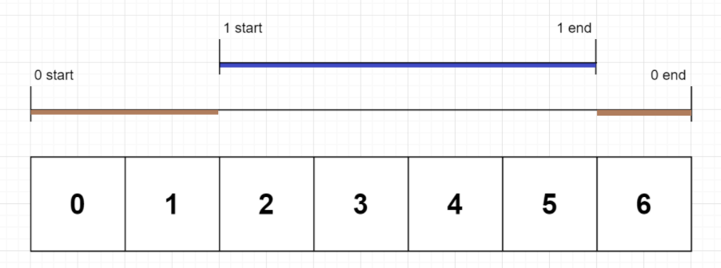




> Question



```txt
Input: command = "G()()()()(al)"
Output: "Gooooal"
```




```cpp
string interpret(string s) {
  string ans;
  for (int i = 0; i < s.size(); ) {
    if (s[i] == 'G') ans += 'G', ++i;
    else if (s[i + 1] == ')') ans += 'o', i += 2;
    else ans += "al", i += 4;
  }
  return ans;
}
```




```py
def interpret(self, command: str) -> str:
  return command.replace('()', 'o').replace('(al)', 'al')
```



