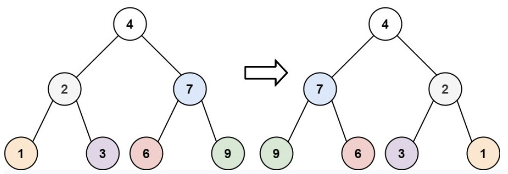
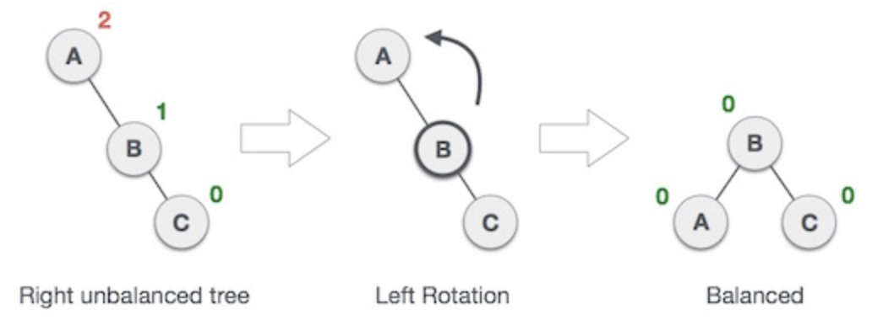
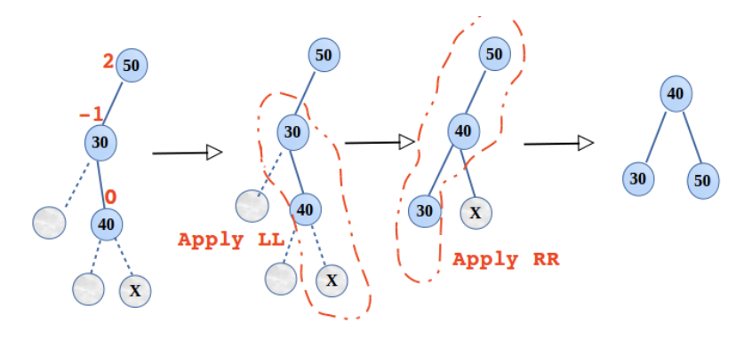
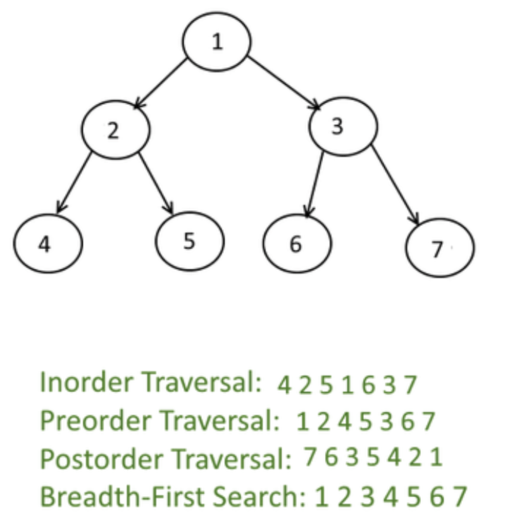
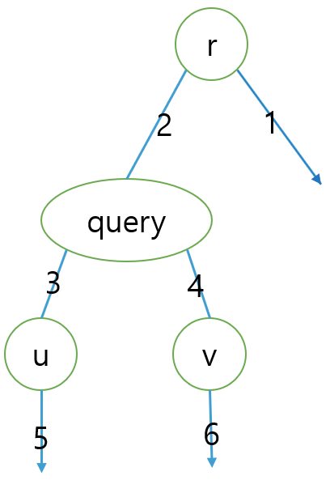
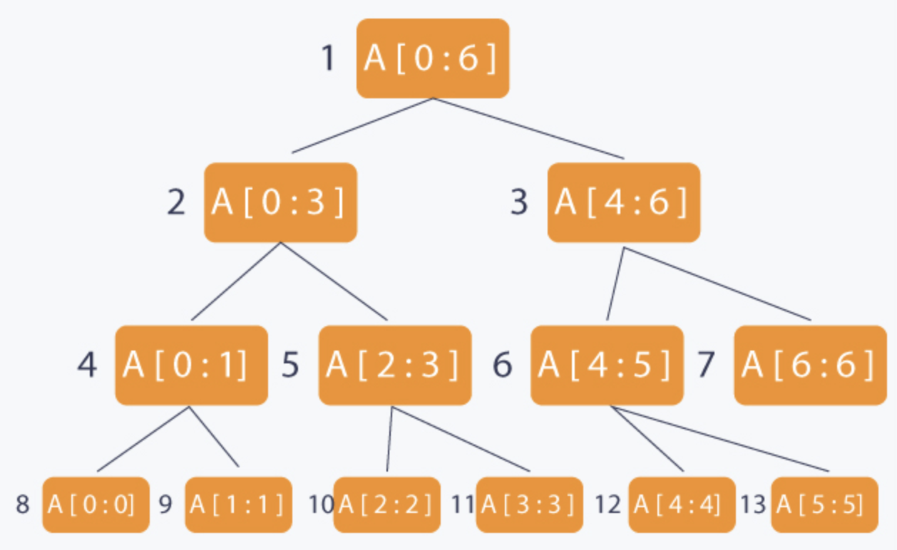

# Tree

* [Tree](https://docs.google.com/forms/d/1_ofN6F79XzQAos7-Xl3ZKjcz-N4kMF4EUGlPX3yenpg/edit)
* Connected and has no cycles (n-1 edges)
* Root has no incoming edges and non-root has exactly one incoming edge from parent
* root vertex r is at level 0
* Binary tree is a rooted tree in which every (internal) vertex has no more than two children

> Huffman encoding

* Tree must be full tree
* Exists an optimal tree where two lowest frequent symbols must be siblings at the two lowest level
* The two longest codewords have the same length
* Entropy of tree

$$
\sum_{i} p_{i} \log _{2} \frac{1}{p_{i}}
$$


> RB Tree

* Each node is either red or black
* Red node only contains black children
* Root is black
* Black height is same for every descendent

* Proof that the height is log(n)
  * compress every red child into parent → create 2-3-4 trees
  * height of compressed is at most half of the original
  * height of compressed is log2(N)
  * the number of leaves is between 2h'< n < 4h'

* Insertion
  * X : the node you are inserting
  * P : parent of the node
  * G : grandparent of the node
  * Traverse down the tree to find the appropriate spot to insert
  * As we traverse the tree, at each node we encounter, check whether any node has two red children
  * if so, color parent as red and both children as black
  * if any violation occurs(if grandparent is also red), perform appropriate rotation
  * After we find the spot, P is black → done
  * P is red, P is left|right child of G, X is left|right child of P → single rotation
  * P is red, P is left|right child of G, X is right|left child of P → double rotation

## Binary

> baekjoon

* [Level 12 : 이진 트리](http://acmicpc.net/problem/13325)
  * [Update solution](https://github.com/seanhwangg/algorithm/edit/main/data-structure/tree/binary/BJ_13325.md)




> Question

* Given binary tree, you want to make the sum path to root the same
* Print the sum of all nodes in result tree

```txt
Input:
2
2 2 2 1 1 3

Output: 15  # 3 2 2 2 3 3
```




```cpp
#include<bits/stdc++.h>
using namespace std;
int k, a[1 << 21], r, i, t;
int main() {
  cin >> k;
  for (i = 2; i < 1 << k + 1; i++) scanf("%d", a + i);
  while (i -= 2) {
    r += t = max(a[i], a[i + 1]);
    a[i / 2] += t;
  }
  cout << r + t;
  return 0;
}
```




> codeforces

* [Level 1800 : Playoff Tournament](https://codeforces.com/problemset/problem/1535/D)
  * [Update solution](https://github.com/seanhwangg/algorithm/edit/main/data-structure/tree/binary/CF_1535D.md)




> Question

* let 𝑓(𝑠) be the number of possible winners of the tournament described by the string  𝑠
* Given one integer 𝑘 (1≤𝑘≤18), string with len 2𝑘−1 initial state of string 𝑠 (?, 0, 1)
* For each query 𝑞 (1≤𝑞≤2⋅10^5)
  * for 𝑝 and a character 𝑐 (𝑝 ≤ 2𝑘−1; 𝑐 = ?, 0, or 1), describing 𝑖-th query

```txt
Input:
3
0110?11
6
5 1
6 ?
7 ?
1 ?
5 ?
1 1

Output:
1
2
3
3
5
4
```




```py
import sys
input = lambda : sys.stdin.readline().strip()
input()
S = list(input())
N = len(S)
dp = [0] * N

for i, s in enumerate(S):
  if i <= N // 2:
    dp[i] += 2 if s == '?' else 1
  else:
    d = N - i
    l, r = N - d * 2 - 1, N - d * 2
    dp[i] = dp[l] + dp[r] if S[i] == '?' else dp[r] if S[i] == '1' else dp[l]
for _ in range(int(input())):
  i, to = input().split()
  i = int(i) - 1
  S[i] = to
  while i < N:
    d = N - i
    l, r = N - d * 2 - 1, N - d * 2
    if i <= N // 2:
      dp[i] = 2 if S[i] == '?' else 1
    else:
      dp[i] = dp[l] + dp[r] if S[i] == '?' else dp[r] if S[i] == '1' else dp[l]
    d = (N - i) // 2
    i = N - d
  print(dp[-1])
```




> leetcode

* [Level Easy : Diameter of Binary Tree](https://leetcode.com/problems/diameter-of-binary-tree)
  * [Update solution](https://github.com/seanhwangg/algorithm/edit/main/data-structure/tree/binary/LC_543.md)




> Question

* Find diameter of binary tree

```txt
Input: root = [1,2,3,4,5]
Output: 3
```




```py
def diameterOfBinaryTree(self, root):
  self.ans = 0

  def depth(p):
    if not p: return 0
    left, right = depth(p.left), depth(p.right)
    self.ans = max(self.ans, left+right)
    return 1 + max(left, right)

  depth(root)
  return self.ans
```




* [Level Medium : House Robber III](https://leetcode.com/problems/house-robber-iii)
  * [Update solution](https://github.com/seanhwangg/algorithm/edit/main/data-structure/tree/binary/LC_337.md)




> Question

* automatically contact the police if two directly-linked houses were broken into on the same night
* Determine the maximum amount of money the thief can rob tonight without alerting the police

```txt
Input: root = [3,2,3,null,3,null,1]
Output: 7
```




```py
def rob(self, root: TreeNode):
  def with_without_rob(root):
    if root :
      wi_l, wo_l = with_without_rob(root.left)
      wi_r, wo_r = with_without_rob(root.right)
      return (root.val + wo_l + wo_r, max(wi_l, wo_l) + max(wi_r, wo_r))
    return (0, 0)

  return max(with_without_rob(root))
```




### BST

> leetcode

* [Level Medium : Convert BST to Greater Tree](https://leetcode.com/problems/convert-bst-to-greater-tree)
  * [Update solution](https://github.com/seanhwangg/algorithm/edit/main/data-structure/tree/bst/LC_538.md)




> Question

* Given the root of a BST, convert it to a Greater Tree
* st every key of original BST is changed to original key plus sum of all keys greater than the original key in BST

```txt
Input: root = [4,1,6,0,2,5,7,null,null,null,3,null,null,null,8]
Output: [30,36,21,36,35,26,15,null,null,null,33,null,null,null,8]
```




```py
class Solution:
  def __init__(self):
    self.total = 0

  def convertBST(self, root: TreeNode) -> TreeNode:
    if not root:
      return
    self.convertBST(root.right)
    root.val += self.total
    self.total = root.val
    self.convertBST(root.left)
    return root
```




* [Level Medium : Validate Binary Search Tree](https://leetcode.com/problems/validate-binary-search-tree)
  * [Update solution](https://github.com/seanhwangg/algorithm/edit/main/data-structure/tree/bst/LC_98.md)




> Question

* Check if tree is valid BST

```txt
Input: root = [5,1,4,null,null,3,6]
Output: false
```




```cpp
class Solution {
public:
  bool isValidBST(TreeNode* root, long min = LONG_MIN, long max = LONG_MAX) {
    if (root == NULL) return true;
    if (root->val <= min || root->val >= max) return false;
    return isValidBST(root->left, min, root->val) && isValidBST(root->right, root->val, max);
  }
};
```




```py
def isValidBST(self, root: TreeNode, left = float('-inf'), right = float('inf')) -> bool:
  return not root or left < root.val < right and \
      self.isValidBST(root.left, left, root.val) and \
      self.isValidBST(root.right, root.val, right)
```




* [Level Medium : Balance a Binary Search Tree](https://leetcode.com/problems/balance-a-binary-search-tree)
  * [Update solution](https://github.com/seanhwangg/algorithm/edit/main/data-structure/tree/bst/LC_1382.md)




> Question

* Given a binary search tree, return a balanced binary search tree with the same node values
* A binary search tree is balanced if and only if the depth of the two subtrees of every node never differ by more than 1

```txt
Input: root = [1,null,2,null,3,null,4,null,null]
Output: [2,1,3,null,null,null,4]
```




```py
class Solution:
  def balanceBST(self, root: TreeNode) -> TreeNode:

    def dfs(node):
      if not node: return []
      return dfs(node.left) + [node.val] + dfs(node.right)
    ns = dfs(root)

    def build(l, r):
      if l > r: return None
      m = (l + r) // 2
      root = TreeNode(ns[m])
      root.left, root.right = build(l, m-1), build(m + 1, r)
      return root

    return build(0, len(ns) - 1)
```




* [Level Medium : Binary Search Tree Iterator](https://leetcode.com/problems/binary-search-tree-iterator)
  * [Update solution](https://github.com/seanhwangg/algorithm/edit/main/data-structure/tree/bst/LC_173.md)




> Question

* Implement the BSTIterator class that represents an iterator over the in-order traversal of a binary search tree (BST):
  * BSTIterator(TreeNode root) Initializes an object of the BSTIterator class
    * The pointer should be initialized to a non-existent number smaller than any element in the BST
  * boolean hasNext() Returns true if there exists a number in traversal to right of pointer, otherwise returns false
  * int next() Moves the pointer to the right, then returns the number at the pointer

```txt
Input:
["BSTIterator", "next", "next", "hasNext", "next", "hasNext", "next", "hasNext", "next", "hasNext"]
[[[7, 3, 15, null, null, 9, 20]], [], [], [], [], [], [], [], [], []]

Output: [null, 3, 7, true, 9, true, 15, true, 20, false]
```




```py
class BSTIterator(object):
  def __init__(self, root):
    self.root_node=root
    self.current_node=root
    self.stack=[]

  def hasNext(self):
    return self.current_node is not None or self.stack

  def next(self):
    while self.current_node:
      self.stack.append(self.current_node)
      self.current_node=self.current_node.left
    next=self.stack.pop()
    self.current_node=next.right
    return next.val
```




## Nary

> N-ary to binary

```py
def convert_n_ary_to_binary(root,isLeft = 1):
  if root == None:
    return

  btnode = BinaryTreeNode(root.data)
  lastnode = btnode

  for child in root.children:
    if isLeft == 1:
      lastnode.left = convert_n_ary_to_binary(child, 0)
      lastnode = lastnode.left
    else:
      lastnode.right = convert_n_ary_to_binary(child, 1)
      lastnode = lastnode.right

  return btnode

def convert_binary_to_n_ary(node, isLeft = 1):
  if node == None:
    return

  nnode = TreeNode(node.data)
  temp = node

  if isLeft == 1:
    while(temp.left != None):
      child = convert_binary_to_n_ary(temp.left, 0)
      nnode.children.append(child)
      temp = temp.left
  else:
    while(temp.right != None):
      child = convert_binary_to_n_ary(temp.right, 1)
      nnode.children.append(child)
      temp = temp.right

  return nnode

node1 = TreeNode(1)
node2 = TreeNode(2)
node3 = TreeNode(3)
node4 = TreeNode(4)
node1.children.append(node2)
node1.children.append(node3)
node1.children.append(node4)
node5 = TreeNode(5)
node6 = TreeNode(6)
node3.children.append(node5)
node3.children.append(node6)

print("Original n-ary tree")
node1.display_level_order()
bnode1 = convert_n_ary_to_binary(node1)
print("Converted binary tree")
display_level_order(bnode1)
# If the tree is converted into BT then the following statement must return "5"
# print("Root.Left.Left.Right = " + str(bnode1.left.left.right.data))

tnode1 = convert_binary_to_n_ary(bnode1)
print("\nConverted n-ary tree")
tnode1.display_level_order()
```

> baekjoon

* [Level 9 : 트리의 부모 찾기](http://acmicpc.net/problem/11725)
  * [Update solution](https://github.com/seanhwangg/algorithm/edit/main/data-structure/tree/nary/BJ_11725.md)




> Question

* A rootless tree is given
* At this time, when you set the root of the tree as 1, print the parents of each node

```txt
Input:
7
1 6
6 3
3 5
4 1
2 4
4 7

Output:
4
6
1
3
1
4
```




```py
import sys
sys.setrecursionlimit(10**9)
def dfs(G, start, node2head):
  for adj in sorted(G[start]):
    if adj not in node2head:
      node2head[adj] = start
      dfs(G, adj, node2head)
N = int(input())
G = [[] for i in range(N+1)]
for _ in range(N - 1):
  a, b = map(int, input().split())
  G[a].append(b)
  G[b].append(a)
node2head = {1 : 0}
dfs(G, 1, node2head)
for i in range(2, N + 1):
  print(node2head[i])




* [Level 11 : 트리](http://acmicpc.net/problem/1068)
  * [Update solution](https://github.com/seanhwangg/algorithm/edit/main/data-structure/tree/nary/BJ_1068.md)




> Question

* When a given node is erased from the tree, outputs the number of leaf nodes remaining

```txt
Input:
5
-1 0 0 1 1
2

Output: 2
```




```py
def dfs(v):
  if len(G[v]) == 0:
    return 1
  else:
    return sum(dfs(child) for child in G[v])

n = int(input())
G = [[] for _ in range(52)]
li = list(map(int,input().split()))
t = int(input())
for v, parent in enumerate(li):
  if parent == -1:
    start = v
  elif v != t:
    G[parent].append(v)

if start != t:
  print(dfs(start))
else :
  print(0)
```




* [Level 12 : 트리의 지름](http://acmicpc.net/problem/1967)
  * [Update solution](https://github.com/seanhwangg/algorithm/edit/main/data-structure/tree/nary/BJ_1967.md)




> Question

* Outputs the diameter of the weighted tree

```txt
Input:
12
1 2 3
1 3 2
2 4 5
3 5 11
3 6 9
4 7 1
4 8 7
5 9 15
5 10 4
6 11 6
6 12 10

Output: 45
```




```py
import sys
from collections import deque
input = sys.stdin.readline
def bfs(G, x):
  dq = deque([x])
  dist = [-1 for _ in range(n)]
  dist[x] = 0
  while dq:
    x = dq.popleft()
    for w, nx in G[x]:
      if dist[nx] == -1:
        dist[nx] = dist[x] + w
        dq.append(nx)
  return max(dist), dist.index(max(dist))
n = int(input())
G = [[] for _ in range(n)]
for i in range(n-1):
  x, y, w = map(int, input().split())
  G[x-1].append([w, y-1])
  G[y-1].append([w, x-1])
print(bfs(G, bfs(G, 0)[1])[0])
```




* [Level 13 : 트리의 지름](http://acmicpc.net/problem/1167)
  * [Update solution](https://github.com/seanhwangg/algorithm/edit/main/data-structure/tree/nary/BJ_1167.md)




> Question

* Find diemteter of tree

```txt
Input:
5
1 3 2 -1
2 4 4 -1
3 1 2 4 3 -1
4 2 4 3 3 5 6 -1
5 4 6 -1

Output: 11
```

> Solution

* From random node x, find farthest point y
* From poitn y, find farthest point z, then y-z is diameter

* Proof by contradiction : u-v is greater than x-y

* Case 1 : x-y and u-v, share a point


* Case 2 : x-y and u-v, doesn't share a point





```py
import sys
input = sys.stdin.readline
def dfs(G, v, result):
  for e, d in G[v]:
    if result[e] == 0:
      result[e] = result[v] + d
      dfs(G, e, result)
N = int(input())
G = [[] for _ in range(N + 1)]
for _ in range(N):
  path = list(map(int, input().split()))
  for i in range(1, len(path) - 2, 2):
    G[path[0]].append([path[i], path[i + 1]])
root2dist = [0 for _ in range(N + 1)]
dfs(G, 1, root2dist)
root2dist[1]=0
index = root2dist.index(max(root2dist))
leaf2dist = [0 for _ in range(N + 1)]
dfs(G, index, leaf2dist)
leaf2dist[index] = 0
print(max(leaf2dist))
```




* [Level 15 : 두 번째 트리의 지름](http://acmicpc.net/problem/19581)
  * [Update solution](https://github.com/seanhwangg/algorithm/edit/main/data-structure/tree/nary/BJ_19581.md)




> Question

* Print second longest diameter of tree (might be same is first)

```txt
Input:
3
1 2 3
2 3 4

Output: 4
```




```py
from collections import deque
def bfs(adj, v):
  dq = deque([v])
  dist = [-1] * len(adj)
  dist[v] = 0
  while dq:
    p = dq.popleft()
    for q, c in adj[p]:
      if dist[q] != -1: continue
      dist[q] = dist[p] + c
      dq.append(q)
  return dist

input = __import__('sys').stdin.readline
n = int(input())
adj = [[] for i in range(n+1)]
for i in range(n-1):
  a,b,c = map(int,input().split())
  adj[a].append((b,c))
  adj[b].append((a,c))

D1 = bfs(adj, 1)
v = D1.index(max(D1))
D2 = bfs(adj, v)
u = D2.index(max(D2))
D3 = bfs(adj, u)
print(sorted(D2 + D3)[-3])
```




* [Level 15 : 뉴스 전하기](http://acmicpc.net/problem/1135)
  * [Update solution](https://github.com/seanhwangg/algorithm/edit/main/data-structure/tree/nary/BJ_1135.md)




> Question

* Each member listen news from their supervisor
* Print minum number of time to spread news

```txt
Input:
3
-1 0 0

Output: 2
```




```py
n = int(input())
parent = list(map(int,input().split()))
adj = [[] for i in range(n)]
for i in range(1,n):
  adj[parent[i]].append(i)

def time(node):
  if not adj[node]: return 0
  subtime = sorted([time(i) for i in adj[node]], reverse = True)
  return max(i+1+subtime[i] for i in range(len(adj[node])))

print(time(0))
```




* [Level 18 : 장애물 경기](http://acmicpc.net/problem/13303)
  * [Update solution](https://github.com/seanhwangg/algorithm/edit/main/data-structure/tree/nary/BJ_13303.md)




> Question

* Add block one by one and record y position
  * if two have same y, pick smallest one
* We can use BST to speed up insert and deletion

```txt
Input:
4
43 70
30 10 38
20 30 50
45 35 55
55 50 70

Output:
87
1 50
```




```cpp
#include <bits/stdc++.h>
using namespace std;
#define long long long
const long INF = 1e18;

int n;
int start_y, end_x;

int main() {
  scanf("%d %d %d", &n, &start_y, &end_x);
  vector<tuple<int, int, int>> lines;
  for (int i = 0; i < n; i++) {
    int x, yl, yh;
    scanf("%d %d %d", &x, &yl, &yh);
    lines.push_back(make_tuple(x, yl, yh));
  }
  sort(lines.begin(), lines.end());
  set<pair<long, long>> s;
  s.insert(make_pair(start_y, 0));
  for (int i = 0; i < n; i++) {
    int x, yl, yh;
    tie(x, yl, yh) = lines[i];
    auto lb = s.lower_bound(make_pair(yl, -INF));
    auto ub = s.upper_bound(make_pair(yh, +INF));
    long cand_top = INF, cand_bottom = INF;
    for (auto it = lb; it != ub; ++it) {
      cand_top = min(cand_top, it->second + (yh - it->first));
      cand_bottom = min(cand_bottom, it->second + (it->first - yl));
    }
    s.erase(lb, ub);
    s.insert(make_pair(yh, cand_top));
    s.insert(make_pair(yl, cand_bottom));
  }
  long min_h = INF;
  int cnt_min = 0;
  for (auto it = s.begin(); it != s.end(); ++it) {
    if (min_h == it->second)
      cnt_min++;
    else if (min_h > it->second) {
      min_h = it->second;
      cnt_min = 1;
    }
  }
  printf("%lld\n%d ", end_x + min_h, cnt_min);
  for (auto it = s.begin(); it != s.end(); ++it)
    if (it->second == min_h)
      printf("%lld ", it->first);
  return 0;
}
```




> leetcode

* [Level Easy : Maximum Depth of N-ary Tree](https://leetcode.com/problems/maximum-depth-of-n-ary-tree)
  * [Update solution](https://github.com/seanhwangg/algorithm/edit/main/data-structure/tree/nary/LC_559.md)




> Question

* Print depth of tree

```txt
Input: root = [1,null,3,2,4,null,5,6]
Output: 3
```




```cpp
int maxDepth(Node* root) {
  if (root == nullptr) return 0;
  int depth = 0;
  for (auto child : root->children) depth = max(depth, maxDepth(child));
  return 1 + depth;
}
```




```py
def maxDepth(self, root):
  if not root: return 0
  return 1 + max(map(self.maxDepth, root.children or [None]))
```




* [Level Easy : Same Tree](https://leetcode.com/problems/same-tree)
  * [Update solution](https://github.com/seanhwangg/algorithm/edit/main/data-structure/tree/nary/LC_100.md)




> Question

* Check if tree are same

```txt
Input: p = [1,2], q = [1,null,2]
Output: false
```




```py
def isSameTree(self, p, q):
  if p and q:
    return p.val == q.val and self.isSameTree(p.left, q.left) and self.isSameTree(p.right, q.right)
  return p is q
```




* [Level Easy : Invert Binary Tree](https://leetcode.com/problems/invert-binary-tree)
  * [Update solution](https://github.com/seanhwangg/algorithm/edit/main/data-structure/tree/nary/LC_226.md)




> Question



* Invert binary tree

```txt
Input: root = [4,2,7,1,3,6,9]
Output: [4,7,2,9,6,3,1]
```




```py
# Recursive
def invertTree(self, root):
  if root:
    root.left, root.right = self.invertTree(root.right), self.invertTree(root.left)
    return root

# Iterative
def invertTree(self, root):
  stack = [root]
  while stack:
    node = stack.pop()
    if node:
      node.left, node.right = node.right, node.left
      stack += node.left, node.right
  return root
```




* [Level Hard : Binary Tree Cameras](https://leetcode.com/problems/binary-tree-cameras)
  * [Update solution](https://github.com/seanhwangg/algorithm/edit/main/data-structure/tree/nary/LC_968.md)




> Question

* Each camera at a node can monitor its parent, itself, and its immediate children
* Print minimum number of cameras

```txt
Input: [0,0,null,0,0]
Output: 1
```




```py
def minCameraCover(self, root):
  self.res = 0
  def dfs(root):
    if not root: return 2
    l, r = dfs(root.left), dfs(root.right)
    if l == 0 or r == 0:
      self.res += 1
      return 1
    return 2 if l == 1 or r == 1 else 0
  return (dfs(root) == 0) + self.res
```




### KD tree

* K dimension tree
* Organizing some number of points in a space with k dimensions
* Pick median to balance KDTree
* Can start with either X or Y
* Right child is greater and equal

* Single rotation
  

* Double rotation
  

### Trie

* Search / Insertion : O(key_length)
* memory : O(ALPHABET_SIZE * key_length * N

```py
class Node:
  def __init__(self):
    self.children = dict()
    self.is_leaf = False

class Trie:
  def __init__(self):
    self.root = Node()

  def add_word(self, word):
    cur = self.root
    for letter in word:
      if letter not in cur.children:
        cur.children[letter] = Node()
      cur = cur.children[letter]
    cur.is_leaf = True

  def remove_word(self, word):
    cur = self.root
    for letter in word:
      if letter not in cur.children:
        return False
      cur = cur.children[letter]
    return self

  def search(self, word):
    cur = self.root
    for letter in word:
      if letter not in cur.children:
        return False
      cur = cur.children[letter]
    return cur.is_leaf
```

> baekjoon

* [Level 18 : 두 수 XO](http://acmicpc.net/problem/13505)
  * [Update solution](https://github.com/seanhwangg/algorithm/edit/main/data-structure/tree/trie/BJ_13505.md)




> Question

* Print max XOR pair

```txt
Input:
5
1 2 3 4 5

Output: 7
```




```py
n = int(input())
N = list(map(int, input().split()))

trie = [None] * 2
maxv = 0

def find(trie, num):
  cur = trie
  ret = 0
  for i in range(30):
    v = (num >> (29 - i)) & 1
    if not cur[v]:
      v = 1-v

    cur = cur[v]
    ret = (ret << 1) | v

  return ret

def insert(trie, num):
  cur = trie
  for i in range(30):
    v = (num >> (29 - i)) & 1
    if not cur[v]:
      cur[v] = [None] * 2
    cur = cur[v]
  return

insert(trie, N[0])

for i in N[1:]:
  maxv = max(find(trie, ~i) ^ i, maxv)
  insert(trie, i)

print(maxv)
```




> leetcode

* [Level Medium : Replace Words](https://leetcode.com/problems/replace-words)
  * [Update solution](https://github.com/seanhwangg/algorithm/edit/main/data-structure/tree/trie/LC_648.md)




> Question

* Given a dictionary consisting of many roots and a sentence consisting of words separated by spaces
* replace all successors in sentence with root forming it
* If a successor can be replaced by more than one root, replace it with the root that has the shortest length

```txt
Input: dictionary = ["cat","bat","rat"], sentence = "the cattle was rattled by the battery"
Output: "the cat was rat by the bat"
```




```py
# Time : O(N), Space : O(N*K)
def replaceWords(self, roots, sentence):
  _trie = lambda: collections.defaultdict(_trie)
  trie = _trie()
  for root in roots:
    cur = trie
    for letter in root:
      cur = cur[letter]
    cur["END"] = root

  def replace(word):
    cur = trie
    for letter in word:
      if letter not in cur: break
      cur = cur[letter]
      if "END" in cur:
        return cur["END"]
    return word

  return " ".join(map(replace, sentence.split()))
```




* [Level Medium : Design Add and Search Words Data Structure](https://leetcode.com/problems/design-add-and-search-words-data-structure)
  * [Update solution](https://github.com/seanhwangg/algorithm/edit/main/data-structure/tree/trie/LC_211.md)




> Question

* Design a data structure that supports adding new words and finding if a string matches any previously added string
* Implement the WordDictionary class:
  * WordDictionary() Initializes the object
  * void addWord(word) Adds word to the data structure, it can be matched later
  * bool search(word) Returns true if there is any string in the data structure that matches word or false otherwise
    * word may contain dots '.' where dots can be matched with any letter

```txt
Input
["WordDictionary","addWord","addWord","addWord","search","search","search","search"]
[[],["bad"],["dad"],["mad"],["pad"],["bad"],[".ad"],["b.."]]

Output
[null,null,null,null,false,true,true,true]
```




```py
class WordDictionary:
  def __init__(self):
    self.trie = {}

  def addWord(self, word: str) -> None:
    node = self.trie
    for c in word + "$":
      node = node.setdefault(c, {})

  def search(self, word: str) -> bool:
    return self.searchNode(self.trie, word)

  def searchNode(self, node, word: str) -> bool:
    for i, c in enumerate(word):
      if c == '.':
        return any(self.searchNode(node[w], word[i+1:]) for w in node if w != '$')
      if c not in node:
        return False
      node = node[c]
    return '$' in node
```




* [Level Hard : Word Search II](https://leetcode.com/problems/word-search-ii)
  * [Update solution](https://github.com/seanhwangg/algorithm/edit/main/data-structure/tree/trie/LC_212.md)




> Question


* Find all words with in B

```txt
Input: board = [["o","a","a","n"],["e","t","a","e"],["i","h","k","r"],["i","f","l","v"]], words = ["oath","pea","eat","rain"]
Output: ["eat","oath"]
```




```py
class TrieNode():
  def __init__(self):
    self.children = collections.defaultdict(TrieNode)
    self.isWord = False

class Trie():
  def __init__(self):
    self.root = TrieNode()

  def insert(self, word):
    node = self.root
    for w in word:
      node = node.children[w]
    node.isWord = True

class Solution(object):
  def findWords(self, B, words):
    res = []
    trie = Trie()
    node = trie.root
    for w in words:
      trie.insert(w)
    for i in range(len(B)):
      for j in range(len(B[0])):
        self.dfs(B, node, i, j, "", res)
    return res

  def dfs(self, B, node, i, j, path, res):
    if node.isWord:
      res.append(path)
      node.isWord = False
    if i < 0 or i >= len(B) or j < 0 or j >= len(B[0]) or B[i][j] not in node.children:
      return
    tmp = B[i][j]
    B[i][j] = "#"
    for di, dj in [(1, 0), (0, 1), (-1, 0), (0, -1)]:
      self.dfs(B, node.children[tmp], i + di, j + dj, path + tmp, res)
    B[i][j] = tmp
```




* [Level Hard : Design Search Autocomplete System](https://leetcode.com/problems/design-search-autocomplete-system)
  * [Update solution](https://github.com/seanhwangg/algorithm/edit/main/data-structure/tree/trie/LC_642.md)




> Question

* Users may input a sentence (at least one word and end with a special character '#').
* Given a string array sentences and an integer array times both of length n
* Sentences[i] is a previously typed sentence and times[i] is the corresponding number of times sentence was typed
* For each input character except '#', return top 3 hot sentences that have same prefix as part of sentence already typed

```txt
Input:
["AutocompleteSystem", "input", "input", "input", "input"]
[[["i love you", "island", "iroman", "i love leetcode"], [5, 3, 2, 2]], ["i"], [" "], ["a"], ["#"]]

Output:
[null, ["i love you", "island", "i love leetcode"], ["i love you", "i love leetcode"], [], []]
```




```py
_trie = lambda: collections.defaultdict(_trie)

class ShortList(list):
  def append(self, val):
    for i, (nt, s) in enumerate(self):
      if s == val[1]:
        self[i] = val
        break
    else:
      list.append(self, val)
    self.sort()
    if len(self) > 3:
      self.pop()

class AutocompleteSystem:
  def __init__(self, sentences, counts):
    self.curnode = self.trie = _trie()
    self.sentence_to_count, self.search = collections.Counter(), ''

    for sentence, count in zip(sentences, counts):
      self.add(sentence, count)

  def add(self, sentence, count):
    self.sentence_to_count[sentence] = count
    cur = self.trie
    self._add_info(cur, sentence, count)
    for letter in sentence:
      cur = cur[letter]
      self._add_info(cur, sentence, count)
    cur["END"] = sentence

  def _add_info(self, node, sentence, count):
    if "INFO" not in node:
      node["INFO"] = ShortList()
    node["INFO"].append((-count, sentence))

  def input(self, c):
    if c != '#':
      self.search += c
      if self.curnode is None:
        return []
      if c not in self.curnode:
        self.curnode = None
        return []

      self.curnode = self.curnode[c]
      return [s for nt, s in self.curnode["INFO"]]
    else:
      self.sentence_to_count[self.search] += 1
      self.add(self.search, self.sentence_to_count[self.search])
      self.search, self.curnode = '', self.trie
      return []
```




* [Level Hard : Design In-Memory File System](https://leetcode.com/problems/design-in-memory-file-system)
  * [Update solution](https://github.com/seanhwangg/algorithm/edit/main/data-structure/tree/trie/LC_588.md)




> Question

* FileSystem() Initializes the object of the system.
* List\<String\> ls(String path)
  * If path is a file path, returns a list that only contains this file's name.
  * If path is a directory path, returns the list of file and directory names in this directory.
  * The answer should in lexicographic order.
* void mkdir(String path) Makes a new directory according to the given path. The given directory path does not exist
  * If the middle directories in the path do not exist, you should create them as well.
* void addContentToFile(String filePath, String content)
  * If filePath does not exist, creates that file containing given content.
  * If filePath already exists, appends the given content to original content.
  * String readContentFromFile(String filePath) Returns the content in the file at filePath.

```txt
Input:
["FileSystem", "ls", "mkdir", "addContentToFile", "ls", "readContentFromFile"]
[[], ["/"], ["/a/b/c"], ["/a/b/c/d", "hello"], ["/"], ["/a/b/c/d"]]

Output:
[null, [], null, null, ["a"], "hello"]
```




```py
Trie = lambda: collections.defaultdict(Trie)

class FileSystem(object):
  def __init__(self):
    self.fs = Trie()
    self.fileinfo = collections.defaultdict(str)

  def ls(self, path):
    if path in self.fileinfo:
      return path.split('/')[-1:]

    cur = self.fs
    for token in path.split('/'):
      if token in cur:
        cur = cur[token]
      elif token:
        return []

    return sorted(cur.keys())

  def mkdir(self, path):
    cur = self.fs
    for token in path.split('/'):
      if token: cur = cur[token]

  def addContentToFile(self, filePath, content):
    self.mkdir(filePath)
    self.fileinfo[filePath] += content

  def readContentFromFile(self, filePath):
    return self.fileinfo[filePath]
```




## Traversal



> baekjoon

* [Level 10 : 트리 순회](http://acmicpc.net/problem/1991)
  * [Update solution](https://github.com/seanhwangg/algorithm/edit/main/data-structure/tree/traversal/BJ_1991.md)




> Question

* traversal
* inorder (left, root, right)
* preorder (root, left, right)
* postorder (left, right, root)

```txt
Input:
7
A B C
B D .
C E F
E . .
F . G
D . .
G . .

Output:
ABDCEFG
DBAECFG
DBEGFCA
```




```py
import sys
sys.setrecursionlimit(1000000)

n = int(input())
data2node = dict()

class Node:
  def __init__(self, data, left = None, right = None):
    self.data = data
    self.left = left
    self.right = right
def dfs(node, debug):
  if not node:
    return
  if debug == "pre":
    print(node.data, end='')
  if node.left:
    dfs(data2node[node.left.data], debug)
  if debug == "in":
    print(node.data, end='')
  if node.right:
    dfs(data2node[node.right.data], debug)
  if debug == "post":
    print(node.data, end='')

for i in range(n):
  a, b, c = input().split()
  if b != '.':
    data2node[b] = Node(b)
  if c!= '.':
    data2node[c] = Node(c)
  data2node[a] = Node(a, data2node.get(b), data2node.get(c))

for order in ["pre", "in", "post"]:
  dfs(data2node['A'], order)
  print()
```




* [Level 10 : 이진 검색 트리](http://acmicpc.net/problem/5639)
  * [Update solution](https://github.com/seanhwangg/algorithm/edit/main/data-structure/tree/traversal/BJ_5639.md)




> Question

* The result of the in-order-traverse of the binary search tree is given
* Find the results of a post-traverse of this tree

```txt
Input:
50
30
24
5
28
45
98
52
60

Output:
5
28
24
45
30
60
52
98
50
```




```py
import sys
sys.setrecursionlimit(10**9)
def postorder(lo, hi):
  if lo> hi:
    return
  mi= hi + 1
  for i in range(lo+1, hi+1):
    if post[lo] < post[i]:
      mi = i
      break
  postorder(lo+1,mi-1)
  postorder(mi, hi)
  print(post[lo])

post=[]
while True:
  try:
    post.append(int(input()))
  except:
    break
postorder(0,len(post)-1)
```




> leetcode

* [Level Easy : Binary Tree Postorder Traversal](https://leetcode.com/problems/binary-tree-postorder-traversal)
  * [Update solution](https://github.com/seanhwangg/algorithm/edit/main/data-structure/tree/traversal/LC_145.md)




> Question

* Given the root of a binary tree, return the postorder traversal of its nodes' values

```txt
Input: root = [1,null,2,3]
Output: [3,2,1]
```




```py
def postorderTraversal(self, root):
  traversal, stack = [], [root]
  while stack:
    node = stack.pop()
    if node:
      traversal.append(node.val)
      stack.extend([node.left, node.right])
  return traversal[::-1]
```




* [Level Easy : Binary Tree Inorder Traversal](https://leetcode.com/problems/binary-tree-inorder-traversal)
  * [Update solution](https://github.com/seanhwangg/algorithm/edit/main/data-structure/tree/traversal/LC_94.md)




> Question

* Given the root of a binary tree, return the inorder traversal of its nodes' values

```txt
Input: root = [1,null,2,3]
Output: [1,3,2]
```




```py
# Time : O(n), Space : O(n)
def inorderTraversal(self, root):
  return self.inorderTraversal(root.left)+[root.val]+self.inorderTraversal(root.right) if root else []
```




* [Level Easy : Binary Tree Preorder Traversal](https://leetcode.com/problems/binary-tree-preorder-traversal)
  * [Update solution](https://github.com/seanhwangg/algorithm/edit/main/data-structure/tree/traversal/LC_144.md)




> Question

* Given the root of a binary tree, return the preorder traversal of its nodes' values

```txt
Input: root = [1,null,2,3]
Output: [1,2,3]
```




```py
def preorderTraversal(self, root):
  ret, stack = [], [root]
  while stack:
    node = stack.pop()
    if node:
      ret.append(node.val)
      stack.extend([node.right, node.left])
  return ret
```




* [Level Medium : N-ary Tree Level Order Traversal](https://leetcode.com/problems/n-ary-tree-level-order-traversal)
  * [Update solution](https://github.com/seanhwangg/algorithm/edit/main/data-structure/tree/traversal/LC_429.md)




> Question

* Given an n-ary tree, return the level order traversal of its nodes' values

```txt
Input: root = [1,null,3,2,4,null,5,6]
Output: [[1],[3,2,4],[5,6]]
```




```py
def levelOrder(self, root):
  q, ret = [root], []
  while any(q):
    ret.append([node.val for node in q])
    q = [child for node in q for child in node.children if child]
  return ret
```




* [Level Medium : Kth Smallest Element in a BST](https://leetcode.com/problems/kth-smallest-element-in-a-bst)
  * [Update solution](https://github.com/seanhwangg/algorithm/edit/main/data-structure/tree/traversal/LC_230.md)




> Question

* Given the root of a binary search tree, and an integer k, return the kth (1-indexed) smallest element in the tree

```txt
Input: root = [5,3,6,2,4,null,null,1], k = 3
Output: 3
```




```py
class Solution(object):
  def kthSmallest(self, root: TreeNode, k: int):
    count = []
    self.helper(root, count)
    return count[k-1]

  def helper(self, node, count):
    if not node: return
    self.helper(node.left, count)
    count.append(node.val)
    self.helper(node.right, count)
```




* [Level Hard : Vertical Order Traversal of a Binary Tree](https://leetcode.com/problems/vertical-order-traversal-of-a-binary-tree)
  * [Update solution](https://github.com/seanhwangg/algorithm/edit/main/data-structure/tree/traversal/LC_987.md)




> Question

* Given the root of a binary tree, calculate the vertical order traversal of the binary tree


```txt
Input: root = [1,2,3,4,5,6,7]
Output: [[4],[2],[1,5,6],[3],[7]]
Explanation:
Column -2: Only node 4 is in this column.
Column -1: Only node 2 is in this column.
Column 0: Nodes 1, 5, and 6 are in this column.
          1 is at the top, so it comes first.
          5 and 6 are at the same position (2, 0), so we order them by their value, 5 before 6.
Column 1: Only node 3 is in this column.
Column 2: Only node 7 is in this column.
```




```py
def verticalTraversal(self, root):
  g = collections.defaultdict(list)
  queue = [(root,0)]
  while queue:
    new = []
    d = collections.defaultdict(list)
    for node, s in queue:
      d[s].append(node.val)
      if node.left:  new += (node.left, s-1),
      if node.right: new += (node.right,s+1),
    for i in d: g[i].extend(sorted(d[i]))
    queue = new
  return [g[i] for i in sorted(g)]
```




## LCA


* Store height then move up by once (query : O(n))
* Binary Lyfting : go up with n^2 step

> baekjoon

* [Level 13 : LC](http://acmicpc.net/problem/11437)
  * [Update solution](https://github.com/seanhwangg/algorithm/edit/main/data-structure/tree/lca/BJ_11437.md)

[//]: # (BJ_11438)

* [Level 16 : 정점들의 거리](http://acmicpc.net/problem/1761)
  * [Update solution](https://github.com/seanhwangg/algorithm/edit/main/data-structure/tree/lca/BJ_1761.md)




> Question

* Print distance between two nodes in weighted graph

```txt
Input:
7
1 6 13
6 3 9
3 5 7
4 1 3
2 4 20
4 7 2
3
1 6
1 4
2 6

Output:
13
3
36
```




```py
import sys
input=sys.stdin.readline
N = int(input())
G = [[]for i in range(N+1)]
for i in range(N-1):
  a, b, w = map(int,input().split())
  G[a].append([b, w])
  G[b].append([a, w])
D, P = [0 for i in range(N + 1)], [[0, 0] for i in range(N+1)]
D[1] = 1
st = [1]
while st:
  i=st.pop()
  for j, w in G[i]:
    if not D[j]:
      D[j] = D[i] + 1
      P[j] = [i, w]
      st.append(j)
M = int(input())
for _ in range(M):
  a, b = map(int, input().split())
  d = 0
  while D[a] != D[b]:
    if D[a] > D[b]:
      d += P[a][1]
      a = P[a][0]
    else:
      d += P[b][1]
      b = P[b][0]
  while a != b:
    d += P[a][1] + P[b][1]
    a, b = P[a][0], P[b][0]
  print(d)
```




* [Level 16 : LCA 2](http://acmicpc.net/problem/11438)
  * [Update solution](https://github.com/seanhwangg/algorithm/edit/main/data-structure/tree/lca/BJ_11438.md)




> Question

* Print lowest common ancestor for given queries

```txt
Input:
15
1 2
1 3
2 4
3 7
6 2
3 8
4 9
2 5
5 11
7 13
10 4
11 15
12 5
14 7
6
6 11
10 9
2 6
7 6
8 13
8 15

Output:
2
4
2
1
3
1
```




```cpp
#include <bits/stdc++.h>
using namespace std;

int st[100010][18], dep[100010], a, b, lg=17;
vector<int> G[100010];

void dfs(int v, int d){
  if(dep[v] != 0)  return;
  dep[v] = d;
  for (int i = 1; 1<<i <= d; i++)
    st[v][i] = st[st[v][i-1]][i-1];
  for (auto x : G[v])
    if(st[x][0]==0)
      st[x][0] = v, dfs(x, d+1);
}
int lca(int a, int b){
  if (dep[a] < dep[b])  swap(a,b);
  for(int i = lg; i>=0; i--)
    if (dep[a] - (1<<i) >= dep[b])
      a=st[a][i];
  for(int i = lg; i>=0; i--)
    if(st[a][i]!=st[b][i])
      a=st[a][i], b=st[b][i];
  return (a==b)? a: st[a][0];
}
int main(){
  int n;
  for(scanf("%d", &n); i < n - 1; i++){
    cin >> a >> b);
    G[a].push_back(b);
    G[b].push_back(a);
  }
  st[1][0] = 1, dfs(1, 0);
  for(scanf("%d", &n); n--; ) {
    cin >> a >> b;
    cout << lca(a,b) << endl;
  }
  return 0;
}
```




```py
N = int(input())
G = [[]for i in range(N+1)]
for i in range(N-1):
  a, b = map(int,input().split())
  G[a].append(b)
  G[b].append(a)
D, P = [1] + [0 for i in range(N)], [0 for i in range(N+1)]
st = [1]
while st:
  i=st.pop()
  for j in G[i]:
    if not D[j]:
      D[j] = D[i] + 1
      P[j] = i
      st.append(j)
for _ in range(int(input())):
  a, b = map(int,input().split())
  while D[a] != D[b]:
    if D[a] > D[b]:
      a = P[a]
    else:
      b = P[b]
  while a != b:
    a, b = P[a], P[b]
  print(a)
```




* [Level 17 : 도로 네트워크](http://acmicpc.net/problem/3176)
  * [Update solution](https://github.com/seanhwangg/algorithm/edit/main/data-structure/tree/lca/BJ_3176.md)




> Question

* Print shortest and longest edge between D and E

```txt
Input:
5
2 3 100
4 3 200
1 5 150
1 3 50
3
2 4
3 5
1 2

Output:
100 200
50 150
50 100
```




```cpp
#include <bits/stdc++.h>
using namespace std;
typedef pair<int, int> pii;
int n, m, p[(int)1e5 + 10][30], hi[(int)1e5 + 10][30], lo[(int)1e5 + 10][30];
int lv[(int)1e5 + 10];
vector<pii> g[(int)1e5 + 10];
void dfs(int x) {
  for (pii e : g[x]) {
    int nx = e.first, cost = e.second;
    if (!lv[nx]) {
      lv[nx] = lv[x] + 1;
      p[nx][0] = x;
      lo[nx][0] = hi[nx][0] = cost;
      dfs(nx);
    }
  }
}
int main(void) {
  scanf("%d", &n);
  for (int i = 0; i < n - 1; i++) {
    int a, b, c; scanf("%d %d %d", &a, &b, &c);
    g[a].push_back({ b, c });
    g[b].push_back({ a, c });
  }

  lv[1] = 1; dfs(1);
  for (int i = 1; i <= 20; i++) {
    for (int x = 1; x <= n; x++) {
      p[x][i] = p[p[x][i - 1]][i - 1];
      hi[x][i] = max(hi[x][i - 1], hi[p[x][i - 1]][i - 1]);
      lo[x][i] = min(lo[x][i - 1], lo[p[x][i - 1]][i - 1]);
    }
  }

  scanf("%d", &m);
  while (m--) {
    int maxv = -1, minv = 1e9;
    int a, b; scanf("%d %d", &a, &b);
    if (lv[a] < lv[b]) swap(a, b);
    for (int i = 20; -1 < i; i--)
      if (lv[b] <= lv[p[a][i]]) {
        maxv = max(maxv, hi[a][i]);
        minv = min(minv, lo[a][i]);
        a = p[a][i];
      }

    for (int i = 20; -1 < i; i--)
      if (p[a][i] != p[b][i]) {
        maxv = max(maxv, max(hi[a][i], hi[b][i]));
        minv = min(minv, min(lo[a][i], lo[b][i]));
        a = p[a][i]; b = p[b][i];
      }
    if (a != b) {
      maxv = max(maxv, max(hi[a][0], hi[b][0]));
      minv = min(minv, min(lo[a][0], lo[b][0]));
    }
    printf("%d %d\n", minv, maxv);
  }
}
```




* [Level 18 : 트리와 쿼리 2](http://acmicpc.net/problem/13511)
  * [Update solution](https://github.com/seanhwangg/algorithm/edit/main/data-structure/tree/lca/BJ_13511.md)




> Question

* Given tree with N nodes and N - 1 edge
* Print kth element from u to v

```txt
Input:
6
1 2 1
2 4 1
2 5 2
1 3 1
3 6 2
2
1 4 6
2 4 6 4

Output:
5
3
```




```cpp
#include<bits/stdc++.h>
#define pb push_back
typedef long long ll;
using namespace std;

ll N, Q;
ll D[101010], P[20][101010], dist[101010];
vector<pair<ll, ll> > adj[101010];

void dfs(ll u, ll p) {
  P[0][u]=p;
  for(pair<ll, ll> v : adj[u]) {
    if(v.first==p) continue;
    dist[v.first]=dist[u]+v.second;
    D[v.first]=D[u]+1;
    dfs(v.first, u);
  }
}

ll LCA(ll u, ll v) {
  if(D[u]>D[v]) swap(u, v);
  for(ll i=18;i>=0;i--)
    if(D[v]-D[u]>=(1<<i))
      v=P[i][v];
  if(u==v) return u;
  for(ll i=18;i>=0;i--)
    if(P[i][u]!=P[i][v])
      u=P[i][u], v=P[i][v];
  return P[0][u];
}

ll parent(ll u, ll p) {
  for(ll i = 18;i >= 0; i--)
    if(p & (1<<i))
      u=P[i][u];
  return u;
}

int main() {
  ll u, v, w;
  cin >> N;
  for(ll i = 1;i < N;i++) {
    cin >> u >> v >> w;
    adj[u].push_back(make_pair(v, w)), adj[v].push_back(make_pair(u, w));
  }
  dfs(1, 0);
  for(ll i=1;i<=18;i++)
    for(ll j=1;j<=N;j++)
      P[i][j]=P[i-1][P[i-1][j]];
  cin >> Q;
  ll q, k;
  while(Q--) {
    cin >> q;
    if(q==1) {
      cin >> u >> v;
      cout << dist[u]+dist[v]-2*dist[LCA(u, v)] << endl;
    }
    if (q==2) {
      cin >> u >> v >> k;
      ll d = D[u] - D[LCA(u, v)];
      if(k-1<=d) cout << parent(u, k-1) << endl;
      else {
        d=D[u]+D[v]-2*D[LCA(u, v)];
        cout << parent(v, d-k+1) << endl;
      }
    }
  }
  return 0;
}
```




* [Level 19 : LCA와 쿼리](http://acmicpc.net/problem/15480)
  * [Update solution](https://github.com/seanhwangg/algorithm/edit/main/data-structure/tree/lca/BJ_15480.md)




> Question

* Tree and list of queries (r, u, v) are given
* Print distance between u, v in tree when root is r

```txt
Input:
7
1 2
2 3
2 4
1 5
5 6
4 7
5
1 2 7
3 1 5
2 1 7
5 6 2
6 2 3

Output:
2
1
2
5
2
```

> Solution



* Second highest among LCA(u, v), LCA(u, r), LCA(v, r)
  1. query=LCA(u,v), LCA(u,r)=r, LCA(v,r)=r
  1. query=LCA(u,v), LCA(u,r)=1, LCA(v,r)=1
  1. query=LCA(r,v), LCA(u,r)=1, LCA(u,v)=1
  1. query=LCA(r,u), LCA(r,v)=1, LCA(u,v)=1
  1. query=LCA(r,v), LCA(r,u)=u, LCA(u,v)=u
  1. query=LCA(r,u), LCA(r,v)=v, LCA(u,v)=v




```py
#include<bits/stdc++.h>
using namespace std;
const int MXH = 18;
const int SZ = 100005;
typedef pair<int,int> pii;
vector<int> G[SZ];
int lv[SZ], dp[MXH][SZ];
void dfs(int crt, int prt, int level){
  lv[crt] = level;
  dp[0][crt]=prt;
  for(int next : G[crt])
    if(next != prt)
      dfs(next,crt,level+1);
}
int level_up(int n, int t){
  for(int i = 0;i < MXH; i++){
    if((1<<i)&t) n=dp[i][n];
  }
  return n;
}
int LCA(int a, int b){
  a = level_up(a,max(0, lv[a] - lv[b]));
  b = level_up(b,max(0, lv[b] - lv[a]));
  if(a==b) return a;
  for(int i=MXH-1;i>=0;i--)
    if(dp[i][a]!=dp[i][b]){
      a = dp[i][a];
      b = dp[i][b];
    }
  return dp[0][a];
}
int query(pii p1,pii p2,pii p3){
  pii parr[3] = {p1,p2,p3};
  sort(parr, parr+3);
  return parr[2].second;
}
int main(void){
  ios::sync_with_stdio(false); cin.tie(NULL);
  int n; cin>>n;
  for(int i=1;i < n; i++){
    int x,y; cin >> x >> y;
    G[x].push_back(y), G[y].push_back(x);
  }
  dfs(1,0,0);
  for(int i=1;i<MXH;i++){
    for(int j=1;j<=n;j++){
      dp[i][j]=dp[i-1][dp[i-1][j]];
    }
  }
  int m; cin>>m;
  for(int i=0;i<m;i++){
    int r,u,v; cin >> r >> u >> v;
    int uv = LCA(u,v), ru = LCA(r,u), rv = LCA(r,v);
    cout << query({lv[uv],uv}, {lv[ru],ru}, {lv[rv],rv}) << '\n';
  }
  return 0;
}
```




## Merge Sort Tree

* Build : O(n log n)
* Query : O(log^3n)

> baekjoon

* [Level 17 : 수열과 쿼리 1](http://acmicpc.net/problem/13537)
  * [Update solution](https://github.com/seanhwangg/algorithm/edit/main/data-structure/tree/merge-sort-tree/BJ_13537.md)




> Question

* Print kth element when a[i...j] is sorted

```txt
Input:
7 3
1 5 2 6 3 7 4
2 5 3
4 4 1
1 7 3

Output:
5
6
3
```




```py
from bisect import bisect_left
from operator import itemgetter
import sys
input = sys.stdin.readline

class MergeSortTreeForKthElem:
  def __init__(self, values):
    l = [[i] for i, value in sorted(enumerate(values), key=itemgetter(1))]
    self._values = values
    self._size = 1 << (len(l) - 1).bit_length()
    self._tree = ([[] for _ in range(self._size)] + l + [[]] * (self._size - len(l)))
    for i in range(self._size - 1, 0, -1):
      self._tree[i] = self._tree[i * 2] + self._tree[i * 2 + 1]
      self._tree[i].sort()

  def kth(self, beg, end, k):
    i = 1
    while i < self._size:
      i += i
      node = self._tree[i]
      t = bisect_left(node, end) - bisect_left(node, beg)
      if t < k:
        k -= t
        i += 1
    return self._values[self._tree[i][0]]

n, m = [int(x) for x in input().split()]
nums = [int(x) for x in input().split()]
mst = MergeSortTreeForKthElem(nums)
for _ in range(m):
  i, j, k = [int(x) for x in input().split()]
  print(mst.kth(i - 1, j, k))
```




* [Level 18 : 수열과 쿼리 3](http://acmicpc.net/problem/13544)
  * [Update solution](https://github.com/seanhwangg/algorithm/edit/main/data-structure/tree/merge-sort-tree/BJ_13544.md)




> Question

* Given list with N elements and M queries a b c
* i j k: number of elements in Ai, Ai+1, ..., Aj greater than k
  * i = a xor last_ans
  * j = b xor last_ans
  * k = c xor last_ans

```txt
Input:
5
5 1 2 3 4
3
2 4 1
6 6 6
1 5 2

Output:
2
0
3
```




```py
import sys
import math
import bisect
import heapq
input = sys.stdin.readline

def init(node, s, e):
  if s == e:
    tree[node] = [li[s]]
    return tree[node]
  m = (s + e) // 2
  a, b = init(node * 2, s, m), init(node * 2 + 1, m + 1, e)
  tree[node] = list(heapq.merge(a, b))
  return tree[node]

def get(node, s, e, l, r, v):
  if l > e or r < s:
    return 0
  if l <= s and e <= r:
    val = bisect.bisect_right(tree[node], v)
    return len(tree[node])-val
  m = (s + e) // 2
  return get(node*2, s, m, l, r, v) + get(node*2+1, m+1, e, l, r, v)

n = int(input())
li = list(map(int, input().split()))
tree = [[0] for _ in range(2 ** (math.ceil(math.log2(n)+1)))]
init(1, 0, n-1)
m = int(input())
ans = 0
for _ in range(m):
  i, j, k = map(int, input().split())
  a = i ^ ans
  b = j ^ ans
  c = k ^ ans
  ans = get(1, 0, n-1, a-1, b-1, c)
  print(ans)
```




## Sparse Table


* Range Greatest Common Divisor
* Minimum query
  * Space O(N logN)
  * Run-time (build) O(N logN)
  * Run-time (Query) O(1)


```py
"""
[10, 6, -7, -8, 0, 0, 0, 0, 0]
[6, 5, -7, -8, 0, 0, 0, 0, 0]
[5, -7, -8, 0, 0, 0, 0, 0, 0]
[-7, -7, -8, 0, 0, 0, 0, 0, 0]
[9, -8, -8, 0, 0, 0, 0, 0, 0]
[-8, -8, -8, 0, 0, 0, 0, 0, 0]
[2, 2, 0, 0, 0, 0, 0, 0, 0]
[4, 4, 0, 0, 0, 0, 0, 0, 0]
[20, 0, 0, 0, 0, 0, 0, 0, 0]
"""
def build_ST(l):
  n = len(l)
  ST = [l[i] + [0]*(n - 1) for i in range(n)]
  j = 1
  while (1 << j) <= n:
    i = 0
    while (i + (1 << j) - 1) < n:
      ST[i][j] = min(ST[i][j - 1], ST[i + (1 << (j - 1))][j - 1])
      i+=1
  j+=1
  return ST

def query(l, r, ST):
  j = math.log2rR - l + 1)
  return min(ST[L][j], ST[R - (1 << j) + 1][j])
```

> baekjoon

* [Level 15 : 합성함수와 쿼리](http://acmicpc.net/problem/17435)
  * [Update solution](https://github.com/seanhwangg/algorithm/edit/main/data-structure/tree/sparse-table/BJ_17435.md)




> Question

* The functions f : {1, 2, ..., m} → {1, 2, ..., m}. Let's define fn : {1, 2, ..., m}→{1, 2, ..., m} as follows:
* f1(x) = f(x)
* fn+1(x) = f(fn(x))
* Find a query that calculates fn(x) given n and x

```txt
Input:
5
3 3 5 4 3
5
1 1
2 1
11 3
1000 4
5 1

Output:
3
5
5
4
3
```




```py
import sys
input = sys.stdin.readline
m=int(input())
f=[0]+list(map(int, input().split()))
dp=[[f[i]] for i in range(m+1)]
for exp in range(19):   # log(20000) < 19
  for i in range(1,m+1):
    dp[i].append(dp[dp[i][exp]][exp])
for _ in range(int(input())):
  n, x = map(int, input().split())
  for exp in range(18, -1, -1):
    if n >= 2 ** exp:
      n -= 2 ** exp
      x = dp[x][exp]
  print(x)
```




* [Level 15 : 최솟값](http://acmicpc.net/problem/10868)
  * [Update solution](https://github.com/seanhwangg/algorithm/edit/main/data-structure/tree/sparse-table/BJ_10868.md)




> Question

* Given n numbers and m queries, for each query (a, b) print minimum element from numbers[a: b + 1]

```txt
Input:
10 4
75
30
100
38
50
51
52
20
81
5
1 10
3 5
6 9
8 10

Output:
5
38
20
5
```




```py
import sys
input = sys.stdin.readline

n, m = map(int, input().split())
A = [0 for _ in range(n)] + [int(input()) for _ in range(n)]
for i in range(n - 1, 0,-1):
  A[i] = min(A[i << 1], A[i << 1 | 1])

for _ in range(m):
  a, b = map(lambda x: int(x) + n - 1, input().split())
  mn = 1e9
  while a <= b:
    if a & 1:
      mn = min(mn, A[a])
    if not b & 1:
      mn = min(mn, A[b])
    a = a + 1 >> 1
    b = b - 1 >> 1
  print(mn)
```




## Segment Tree

* m number of Minimum / Sum Range Query + n elements in array
  * Time Complexity: O(n) (Build tree)
  * Space Complexity: O(n)
  * Time Complexity: O(log(n)) (Query)



> baekjoon

* [Level 15 : 구간 곱 구하기](http://acmicpc.net/problem/11505)
  * [Update solution](https://github.com/seanhwangg/algorithm/edit/main/data-structure/tree/segment-tree/BJ_11505.md)




> Question

* N, M (<= 10000) changes, K (<= 10000) Query
* Type 1 (1, b, c)
  * Change A[b] to c
* Type 2 (2, b, c)
  * Print product between A[b .. c]

```txt
Input:
5 2 2
1
2
3
4
5
1 3 6
2 2 5
1 5 2
2 3 5

Output:
240
48
```




```py
import sys
input = sys.stdin.readline

def update(i, v):
  tree[i]=v
  while i>1:
    tree[i // 2] = (tree[i] * tree[i ^ 1]) % MOD
    i //= 2

def query(l,r):
  res = 1
  while l < r:
    if l & 1:
      res *= tree[l]
      l += 1
    if r & 1:
      r -= 1
      res *= tree[r]
    l >>= 1
    r >>= 1
  return res % MOD

MOD = 10 ** 9 + 7
n, m, k = map(int, input().split())
tree = [1] * (2 * n + 10)
for i in range(n + 1, 2 * n + 1):
  tree[i] = int(input())
for i in range(n, 0, -1):
  tree[i] = (tree[2 * i] * tree[2 * i + 1]) % MOD

for _ in range(m + k):
  a, b, c=map(int, input().split())
  if a==1:
    update(n+b,c)
  else:
    print(query(n+b,n+c+1))
```




* [Level 16 : Counting Inversions](http://acmicpc.net/problem/10090)
  * [Update solution](https://github.com/seanhwangg/algorithm/edit/main/data-structure/tree/segment-tree/BJ_10090.md)




> Question

* Two integers in а permutation form an inversion, when the bigger one is before the smaller one
* Count number of inversion

```txt
Input:
7
4 2 7 1 5 6 3

Output: 10    # 42 / 41 / 43 / 21 / 71 / 75 / 76 / 73 / 53 / 63
```




```py
class SegmentTree:
  def __init__(self, nums):
    self.N = len(nums)
    self.tree = [0] * self.N + nums
    for i in range(self.N - 1, 0, -1):
      self.tree[i] = self.tree[i<<1] + self.tree[i<<1|1]

  def update(self, i, val):
    n = self.N + i
    self.tree[n] = val
    while n > 1:
      self.tree[n>>1] = self.tree[n] + self.tree[n^1]
      n >>= 1

  def sumRange(self, i, j):
    m, n = self.N + i, self.N + j
    res = 0
    while m <= n:
      if m & 1:
        res += self.tree[m]
        m += 1
      m >>= 1
      if n & 1 ==0:
        res += self.tree[n]
        n -= 1
      n >>= 1
    return res
N, res = int(input()), 0
st = SegmentTree([0] * (N + 1))

for n in map(int, input().split()):
  st.update(n, 1)
  res += st.sumRange(n + 1, N)
print(res)
```




* [Level 16 : 공장](http://acmicpc.net/problem/7578)
  * [Update solution](https://github.com/seanhwangg/algorithm/edit/main/data-structure/tree/segment-tree/BJ_7578.md)




> Question

* Given two list each number belongs to a pair, print number of cross cables

```txt
Input:
5
132 392 311 351 231
392 351 132 311 231

Output: 3
```




```py
N = int(input())
A, t = list(map(int,input().split())), list(map(int,input().split()))
B = {t[i] : i + 1 for i in range(N)}
tree, ret = [0] * (N + 1), 0
def Sum(i):
  ans = 0
  while i > 0:
    ans += tree[i]
    i -= (i & -i)
  return ans

def update(i,dif):
  while i <= N:
    tree[i] += dif
    i += (i & -i)

for i in range(N):
  ix = B[A[i]]
  ret += Sum(N) - Sum(ix)
  update(ix, 1)
print(ret)
```




* [Level 17 : 수열과 쿼리 21](http://acmicpc.net/problem/16975)
  * [Update solution](https://github.com/seanhwangg/algorithm/edit/main/data-structure/tree/segment-tree/BJ_16975.md)




> Question

* Type 1 (1 i j k)
  * Add k from Ai, ..., Aj
* Type 2 (x)
  * Print Ak

```txt
Input:
5
1 2 3 4 5
4
1 3 4 6
2 3
1 1 3 -2
2 3

Output:
9
7
```




```py
import sys
input = sys.stdin.readline

def get(i):
  ans = a[i - 1]
  while i > 0:
    ans += t[i]
    i -= i & -i
  return ans

def update(i, v):
  while i < n + 1:
    t[i] += v
    i += i & -i

n = int(input())
a = list(map(int, input().split()))
t = [0] * (n + 1)

for _ in range(int(input())):
  q, *x = map(int, input().split())
  if q == 1:
    update(x[0], x[2])
    if x[1] < n: update(x[1] + 1, -x[2])
  else:
    print(get(x[0]))
```




> leetcode

* [Level Medium : Range Sum Query - Mutable](https://leetcode.com/problems/range-sum-query-mutable)
  * [Update solution](https://github.com/seanhwangg/algorithm/edit/main/data-structure/tree/segment-tree/LC_307.md)




> Question

* Design class with following methods
  * NumArray(int[] nums) initializes the object with the integer array nums
  * void update(int index, int val) updates the value of nums[index] to be val
  * int sumRange(int left, int right) returns the sum of the subarray nums[left, right]
    * (i.e., nums[left] + nums[left + 1], ..., nums[right])
* At most 3 * 10^4 calls will be made to update and sumRange

```txt
Input:
["NumArray", "sumRange", "update", "sumRange"]
[[[1, 3, 5]], [0, 2], [1, 2], [0, 2]]

Output: [null, 9, null, 8]
```




```py
class NumArray(object):
  def __init__(self, nums):
    self.n = len(nums)
    self.a, self.c = nums, [0] * (self.n + 1)
    for i in range(self.n):
      k = i + 1
      while k <= self.n:
        self.c[k] += nums[i]
        k += (k & -k)

  def update(self, i, val):
    diff, self.a[i] = val - self.a[i], val
    i += 1
    while i <= self.n:
      self.c[i] += diff
      i += (i & -i)

  def sumRange(self, i, j):
    res, j = 0, j + 1
    while j:
      res += self.c[j]
      j -= (j & -j)
    while i:
      res -= self.c[i]
      i -= (i & -i)
    return res
```




### Lazy Segment Tree

* support range update

* [Lazy segment tree](https://www.youtube.com/watch?v=xuoQdt5pHj0)

> baekjoon

* [Level 18 : 스위치](http://acmicpc.net/problem/1395)
  * [Update solution](https://github.com/seanhwangg/algorithm/edit/main/data-structure/tree/lazy-segment-tree/BJ_1395.md)




> Question

* There are N (<= 100000) switch, do following operations (<= 100,000)
* Type 1 (1 a b)
  * toggle switch between a and b
* Type 2 (2 a b)
  * count turned on between a and b

```txt
4 5
0 1 2
0 2 4
1 2 3
0 2 4
1 1 4
```




```cpp
#include <bits/stdc++.h>
using namespace std;

typedef long long ll;
typedef vector<int> vi;

ll init(vi &arr, vi &tree, int node, int start, int end){
  if(start == end){
    return tree[node] = arr[start];
  }
  return tree[node] = init(arr, tree, node*2, start, (start+end)/2) + init(arr, tree, node*2+1, (start+end)/2+1, end);
}

void update_lazy(vi &tree, vi &lazy, int node, int start, int end){
  if(lazy[node] != 0){
    tree[node] = (end-start+1)-tree[node];
    if(start != end){
      lazy[node*2] = !lazy[node*2];
      lazy[node*2+1] = !lazy[node*2+1];
    }
    lazy[node] = 0;
  }
}

int update_range(vi &tree, vi &lazy, int node, int start, int end, int left, int right){
  update_lazy(tree, lazy, node, start, end);
  if(left>end || right<start){
    return tree[node];
  }
  if(left<=start && end<=right){
    tree[node] = (end-start+1)-tree[node];
    if(start!=end){
      lazy[node*2] = !lazy[node*2];
      lazy[node*2+1] = !lazy[node*2+1];
    }
    return tree[node];
  }
  int mid = (start + end) / 2;
    return tree[node] = update_range(tree, lazy, node * 2, start, mid, left, right)
                      + update_range(tree, lazy, node * 2 + 1, mid + 1, end, left, right);
}

ll sum(vi &tree, vi &lazy, int node, int start, int end, int left, int right){
  update_lazy(tree, lazy, node, start, end);
  if(left>end || right<start) return 0;
  if(left<=start && end<=right) return tree[node];
  return sum(tree, lazy, node*2, start, (start+end)/2, left, right)
       + sum(tree, lazy, node*2+1, (start+end)/2+1, end, left, right);
}

int main(){
  ios_base::sync_with_stdio(0); cin.tie(0); cout.tie(0);
  int n, m; cin>>n>>m;
  int tree_size = ceil(log2(n)) + 1;
    vi st(1 << tree_size);
    vi lazy(1 << tree_size);
    for (int i = 0; i < m; i++) {
      int cmd, a, b;
        cin>>cmd>>a>>b;
        if (cmd) {
            cout << sum(st, lazy, 1, 1, n, a, b) << '\n';
        }
        else {
            update_range(st, lazy, 1, 1, n, a, b);
        }
    }
}
```




```py
from math import ceil,log2
input = __import__('sys').stdin.readline

def lazy_update(now,s,e):
  if lazy[now]==0: return
  tree[now] = (e-s+1)-tree[now]
  if s!=e:
    lazy[now*2]^=1
    lazy[now*2+1]^=1
  lazy[now]=0

def update(now,s,e,L,R):
  lazy_update(now,s,e)
  if s > R or e < L: return tree[now]
  if L <= s and e <= R:
    tree[now] = (e-s+1)-tree[now]
    if s != e:
      lazy[now*2] ^= 1
      lazy[now*2+1] ^= 1
    return tree[now]
  mi = (s+e) // 2
  tree[now] = update(now*2,s,mi,L,R)+update(now*2+1,mi+1,e,L,R)
  return tree[now]

def query(now, s, e, L, R):
  lazy_update(now,s,e)
  if s>R or e<L:return 0
  if L<=s and e<=R:return tree[now]
  mi=(s+e)//2
  return query(now*2,s,mi,L,R) + query(now*2+1,mi+1,e,L,R)

n, m = map(int,input().split())
h = int(ceil(log2(n)))
tree = [0] * (1<<(h+1))
lazy = [0] * (1<<(h+1))
for i in range(m):
  a, b, c = map(int,input().split())
  if a==0:
    update(1,0,n-1,b-1,c-1)
  else:
    print(Sum(1,0,n-1,b-1,c-1))
```




## Binary index tree

* AKA Fenwick Tree
* Fast cumulative sum query → easier to implement than Segment Tree
* Time Complexity: O(n) (Build)
* Time Complexity: O(log n) (Range Query, update one element)


> baekjoon

* [Level 17 : XO](http://acmicpc.net/problem/14245)
  * [Update solution](https://github.com/seanhwangg/algorithm/edit/main/data-structure/tree/binary-index-tree/BJ_14245.md)




> Question

* Type 1 (1, a, b, c)
  * xor c in A[a...b]
* Type 2 (2, a)
  * Print A[a]

```txt
Input:
5
1 2 3 4 5
6
1 0 4 9
2 0
2 1
2 2
2 3
2 4

Output:
8
11
10
13
12
```




```py
class RUPQ:
  def __init__(self, size):
    self.arr = [0]*size

  def update(self, i, j, val):
    while i < len(self.arr):
      self.arr[i] ^= val; i |= i+1
    j+= 1
    while j < len(self.arr):
      self.arr[j] ^= val; j |= j+1

  def get(self, i):
    res = 0
    while i >= 0:
      res ^= self.arr[i]
       i = (i&(i+1))-1
    return res

input = __import__('sys').stdin.readline

n = int(input())
F = RUPQ(n)
ini = list(map(int, input().split()))
for QUERY in range(int(input())):
  qt, *par = map(int, input().split())
  if qt == 1:
    a, b, c = par
    F.update(a, b, c)
  else: print(F.get(par[0]) ^ ini[par[0]])
```




* [Level 17 : 요세푸스 문제 2](http://acmicpc.net/problem/1168)
  * [Update solution](https://github.com/seanhwangg/algorithm/edit/main/data-structure/tree/binary-index-tree/BJ_1168.md)




> Question

* Keep remove Kth person until N person left

```txt
Input: 7 3
Output: <3, 6, 2, 7, 5, 1, 4>
```




```py
def pop(v):
  idx = 0
  for i in reversed(range(17)):
    j = idx + (1 << i)
    if j < n + 1:
      if t[j] < v:
        idx = j
        v -= t[j]
      else:
        t[j] -= 1
  return idx + 1

n, k = map(int, __import__('sys').stdin.readline().split())
t = [0] * (n + 1)
for i in range(1, n + 1):
  t[i] = i & -i

ans = []
idx = 1
for i in range(n, 0, -1):
  idx = (idx + k - 2) % i + 1
  ans.append(pop(idx))

print(f'<{", ".join(map(str, ans))}>')
```




* [Level 17 : 영화 수집](http://acmicpc.net/problem/3653)
  * [Update solution](https://github.com/seanhwangg/algorithm/edit/main/data-structure/tree/binary-index-tree/BJ_3653.md)




> Question

* Print location of movie when you put movie on top after watching

```txt
Input:
2
3 3
3 1 1
5 3
4 4 5

Output:
2 1 0
3 0 4
```




```py
def sum(i):
  ans=0
  while i>0:
    ans+=BIT[i]
    i-=i&-i
  return ans
def update(i,num):
  while i <= n+m:
    BIT[i] += num
    i += i&-i

for i in range(int(input())):
  n,m = list(map(int,input().split()))
  BIT = [0]*(n+m+1)
  A=[0]*(n+1)
  for i in range(1,n+1):
    A[i] = m+i
    update(i+m,1)
  L = [None] + list(map(int,input().split()))
  for i in range(1,m+1):
    print(sum(A[L[i]]-1),end=' ')
    update(A[L[i]],-1)
    A[L[i]]=m+1-i
    update(A[L[i]],1)
  print()
```




* [Level 22 : 조개 줍기](http://acmicpc.net/problem/14870)
  * [Update solution](https://github.com/seanhwangg/algorithm/edit/main/data-structure/tree/binary-index-tree/BJ_14870.md)




> Question

* D[i][j] = max sum from top left to i, j
* each query increase or decrease a grid by 1

```txt
Input:
3
3 2 7
4 2 6
5 3 8
U 1 2
D 3 2
U 1 2

Output:
107
111
110
114
```




```cpp
#include <bits/stdc++.h>
using namespace std;

using ll = long long;
const int N = 1505;
int n;
ll a[N][N];

struct BIT{
  ll d[N][N], tot;
  void upd(int x, int s, int e, ll v){
    tot += v * (e - s + 1);
    for(; s <= n; s += s & -s) d[x][s] += v;
    for(e++; e <= n; e += e & -e) d[x][e] -= v;
  }
  ll get(int x, int y){
    int r = 0;
    for(; y; y -= y & -y) r += d[x][y];
    return r;
  }
} B;

int main(){
  ios_base::sync_with_stdio(false); cin.tie(NULL);
  cin >> n;
  for(int i = 1; i <= n; i++){
    for(int j = 1; j <= n; j++){
      cin >> a[i][j];
      B.upd(i, j, j, a[i][j] + max(B.get(i - 1, j), B.get(i, j - 1)));
    }
  }
  cout << B.tot << endl;
  auto dp = [](int x, int y){ return max(B.get(x - 1, y), B.get(x, y - 1)) + a[x][y]; };
  for(int t = 0, x, y; t < n; t++){
    char b[3];
    cin >> b >> x >> y;
    b[0] = (b[0] == 'U' ? 1 : -1);
    a[x][y] += b[0];
    int s = y, e = y + 1;
    for(int i = x; i <= n && s < e; i++){
      for(; s <= n; s++) if(dp(i, s) != B.get(i, s)) break;
      B.upd(i, s, e - 1, b[0]);
      for(; e <= n; e++){
        if(dp(i, e) == B.get(i, e)) break;
        B.upd(i, e, e, b[0]);
      }
    }
    cout << B.tot << endl;
  }
}
```




> leetcode

* [Level Hard : Reverse Pairs](https://leetcode.com/problems/reverse-pairs)
  * [Update solution](https://github.com/seanhwangg/algorithm/edit/main/data-structure/tree/binary-index-tree/LC_493.md)




> Question

* Given an integer array nums, return the number of reverse pairs in the array.
* A reverse pair is a pair (i, j) where 0 <= i < j < nums.length and nums[i] > 2 * nums[j].

```txt
Input: nums = [2,4,3,5,1]
Output: 3
```




```py
class BIT:
  def __init__(self, n):
    self.n = n + 1
    self.sums = [0] * self.n

  def update(self, i, delta):
    while i < self.n:
      self.sums[i] += delta
      i += i & (-i)

  def query(self, i):
    res = 0
    while i > 0:
      res += self.sums[i]
      i -= i & (-i)
    return res

def reversePairs(self, nums):
  # BIT O(nlogn)
  new_nums = nums + [x * 2 for x in nums]
  sorted_set = sorted(list(set(new_nums)))
  tree = self.BIT(len(sorted_set))
  res = 0
  ranks = {}
  for i, n in enumerate(sorted_set):
    ranks[n] = i + 1

  for n in nums[::-1]:
    res += tree.query(ranks[n] - 1)
    tree.update(ranks[n * 2], 1)

  return res
```




* [Level Hard : Count of Smaller Numbers After Self](https://leetcode.com/problems/count-of-smaller-numbers-after-self)
  * [Update solution](https://github.com/seanhwangg/algorithm/edit/main/data-structure/tree/binary-index-tree/LC_315.md)




> Question

* Given an integer array nums and you have to return a new counts array
* The counts array has the property where counts[i] is the number of smaller elements to the right of nums[i]

```txt
Input: nums = [5,2,6,1]
Output: [2,1,1,0]
```




```py
class BIT:
  def __init__(self, n):
    self.n = n + 1
    self.sums = [0] * self.n

  def update(self, i, delta):
    while i < self.n:
      self.sums[i] += delta
      i += i & (-i)

  def query(self, i):
    res = 0
    while i > 0:
      res += self.sums[i]
      i -= i & (-i)
    return res

def countSmaller(self, li):
  ranks, bit, ret = {e : i + 1 for i, e in enumerate(sorted(li))}, self.BIT(len(li)), []
  for e in reversed(li):
    ret.append(bit.query(ranks[e] - 1))
    bit.update(ranks[e], 1)
  return ret[::-1]
```



