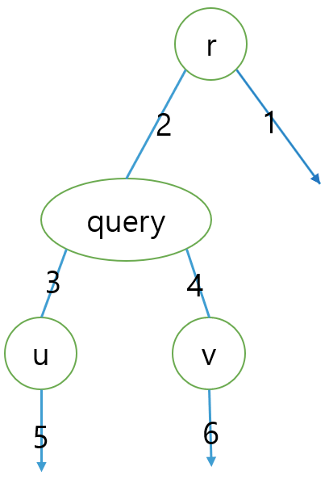




> Question

* Tree and list of queries (r, u, v) are given
* Print distance between u, v in tree when root is r

```txt
Input:
7
1 2
2 3
2 4
1 5
5 6
4 7
5
1 2 7
3 1 5
2 1 7
5 6 2
6 2 3

Output:
2
1
2
5
2
```

> Solution



* Second highest among LCA(u, v), LCA(u, r), LCA(v, r)
  1. query=LCA(u,v), LCA(u,r)=r, LCA(v,r)=r
  1. query=LCA(u,v), LCA(u,r)=1, LCA(v,r)=1
  1. query=LCA(r,v), LCA(u,r)=1, LCA(u,v)=1
  1. query=LCA(r,u), LCA(r,v)=1, LCA(u,v)=1
  1. query=LCA(r,v), LCA(r,u)=u, LCA(u,v)=u
  1. query=LCA(r,u), LCA(r,v)=v, LCA(u,v)=v




```py
#include<bits/stdc++.h>
using namespace std;
const int MXH = 18;
const int SZ = 100005;
typedef pair<int,int> pii;
vector<int> G[SZ];
int lv[SZ], dp[MXH][SZ];
void dfs(int crt, int prt, int level){
  lv[crt] = level;
  dp[0][crt]=prt;
  for(int next : G[crt])
    if(next != prt)
      dfs(next,crt,level+1);
}
int level_up(int n, int t){
  for(int i = 0;i < MXH; i++){
    if((1<<i)&t) n=dp[i][n];
  }
  return n;
}
int LCA(int a, int b){
  a = level_up(a,max(0, lv[a] - lv[b]));
  b = level_up(b,max(0, lv[b] - lv[a]));
  if(a==b) return a;
  for(int i=MXH-1;i>=0;i--)
    if(dp[i][a]!=dp[i][b]){
      a = dp[i][a];
      b = dp[i][b];
    }
  return dp[0][a];
}
int query(pii p1,pii p2,pii p3){
  pii parr[3] = {p1,p2,p3};
  sort(parr, parr+3);
  return parr[2].second;
}
int main(void){
  ios::sync_with_stdio(false); cin.tie(NULL);
  int n; cin>>n;
  for(int i=1;i < n; i++){
    int x,y; cin >> x >> y;
    G[x].push_back(y), G[y].push_back(x);
  }
  dfs(1,0,0);
  for(int i=1;i<MXH;i++){
    for(int j=1;j<=n;j++){
      dp[i][j]=dp[i-1][dp[i-1][j]];
    }
  }
  int m; cin>>m;
  for(int i=0;i<m;i++){
    int r,u,v; cin >> r >> u >> v;
    int uv = LCA(u,v), ru = LCA(r,u), rv = LCA(r,v);
    cout << query({lv[uv],uv}, {lv[ru],ru}, {lv[rv],rv}) << '\n';
  }
  return 0;
}
```



