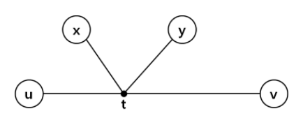
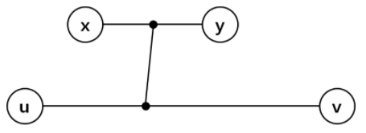




> Question

* Find diemteter of tree

```txt
Input:
5
1 3 2 -1
2 4 4 -1
3 1 2 4 3 -1
4 2 4 3 3 5 6 -1
5 4 6 -1

Output: 11
```

> Solution

* From random node x, find farthest point y
* From poitn y, find farthest point z, then y-z is diameter

* Proof by contradiction : u-v is greater than x-y

* Case 1 : x-y and u-v, share a point



* Case 2 : x-y and u-v, doesn't share a point






```py
import sys
input = sys.stdin.readline
def dfs(G, v, result):
  for e, d in G[v]:
    if result[e] == 0:
      result[e] = result[v] + d
      dfs(G, e, result)
N = int(input())
G = [[] for _ in range(N + 1)]
for _ in range(N):
  path = list(map(int, input().split()))
  for i in range(1, len(path) - 2, 2):
    G[path[0]].append([path[i], path[i + 1]])
root2dist = [0 for _ in range(N + 1)]
dfs(G, 1, root2dist)
root2dist[1]=0
index = root2dist.index(max(root2dist))
leaf2dist = [0 for _ in range(N + 1)]
dfs(G, index, leaf2dist)
leaf2dist[index] = 0
print(max(leaf2dist))
```



