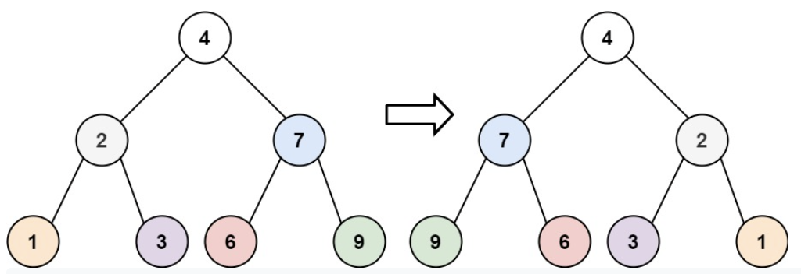




> Question



* Invert binary tree

```txt
Input: root = [4,2,7,1,3,6,9]
Output: [4,7,2,9,6,3,1]
```




```py
# Recursive
def invertTree(self, root):
  if root:
    root.left, root.right = self.invertTree(root.right), self.invertTree(root.left)
    return root

# Iterative
def invertTree(self, root):
  stack = [root]
  while stack:
    node = stack.pop()
    if node:
      node.left, node.right = node.right, node.left
      stack += node.left, node.right
  return root
```



