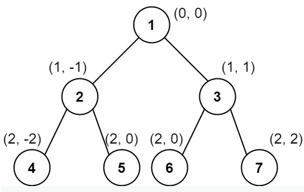




> Question

* Given the root of a binary tree, calculate the vertical order traversal of the binary tree



```txt
Input: root = [1,2,3,4,5,6,7]
Output: [[4],[2],[1,5,6],[3],[7]]
Explanation:
Column -2: Only node 4 is in this column.
Column -1: Only node 2 is in this column.
Column 0: Nodes 1, 5, and 6 are in this column.
          1 is at the top, so it comes first.
          5 and 6 are at the same position (2, 0), so we order them by their value, 5 before 6.
Column 1: Only node 3 is in this column.
Column 2: Only node 7 is in this column.
```




```py
def verticalTraversal(self, root):
  g = collections.defaultdict(list)
  queue = [(root,0)]
  while queue:
    new = []
    d = collections.defaultdict(list)
    for node, s in queue:
      d[s].append(node.val)
      if node.left:  new += (node.left, s-1),
      if node.right: new += (node.right,s+1),
    for i in d: g[i].extend(sorted(d[i]))
    queue = new
  return [g[i] for i in sorted(g)]
```



