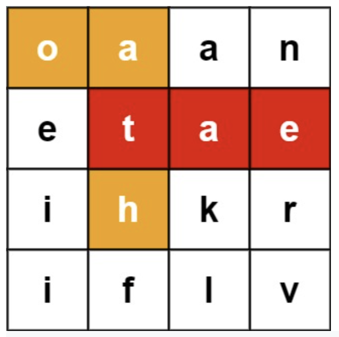




> Question



* Find all words with in B

```txt
Input: board = [["o","a","a","n"],["e","t","a","e"],["i","h","k","r"],["i","f","l","v"]], words = ["oath","pea","eat","rain"]
Output: ["eat","oath"]
```




```py
class TrieNode():
  def __init__(self):
    self.children = collections.defaultdict(TrieNode)
    self.isWord = False

class Trie():
  def __init__(self):
    self.root = TrieNode()

  def insert(self, word):
    node = self.root
    for w in word:
      node = node.children[w]
    node.isWord = True

class Solution(object):
  def findWords(self, B, words):
    res = []
    trie = Trie()
    node = trie.root
    for w in words:
      trie.insert(w)
    for i in range(len(B)):
      for j in range(len(B[0])):
        self.dfs(B, node, i, j, "", res)
    return res

  def dfs(self, B, node, i, j, path, res):
    if node.isWord:
      res.append(path)
      node.isWord = False
    if i < 0 or i >= len(B) or j < 0 or j >= len(B[0]) or B[i][j] not in node.children:
      return
    tmp = B[i][j]
    B[i][j] = "#"
    for di, dj in [(1, 0), (0, 1), (-1, 0), (0, -1)]:
      self.dfs(B, node.children[tmp], i + di, j + dj, path + tmp, res)
    B[i][j] = tmp
```



