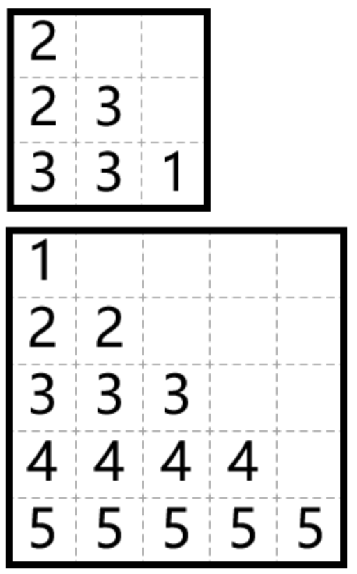

# Advanced Algorithm

## Adhoc

> baekjoon

* [Level 7 : 병든 나이트](http://acmicpc.net/problem/1783)
  * [Update solution](https://github.com/seanhwangg/algorithm/edit/main/method/advanced/adhoc/BJ_1783.md)




> Question

* If Night moves greater than 3, it has to take all possible moves
* Given chessboard, find the maximum number of grids that knight can go

```txt
Input: 20 4
Output: 4
```




```py
n, m = map(int, input().split())
if n == 1:
  print(1)
elif n == 2:
  print(min(4, (m + 1) // 2))
elif m <= 6:
  print(min(4, m))
else:
  print(m - 2)
```




* [Level 11 : 회문은 회문아니야!!](http://acmicpc.net/problem/15927)
  * [Update solution](https://github.com/seanhwangg/algorithm/edit/main/method/advanced/adhoc/BJ_15927.md)




> Question

* Find longest substring that are not a palindrome (-1 if there isn't)

```txt
Input: PALINDROME
Output: 10
```




```py
S = input()
if S == S[0]*len(S): print(-1)
elif S != S[::-1]: print(len(S))
else: print(len(S)-1)
```




* [Level 14 : 집으로](http://acmicpc.net/problem/1069)
  * [Update solution](https://github.com/seanhwangg/algorithm/edit/main/method/advanced/adhoc/BJ_1069.md)




> Question

* You can move 1 block per second or jump D which takes T seconds
* Starting at x, y, find minimum time to go to 0, 0

```txt
Input: 6 8 5 3
Output: 6.0
```




```py
x, y, d, t = map(int,input().split())
a = (x*x+y*y) ** 0.5
if d < t:
  print(a)
else:
  n = a // d
  if d < a:
    print(min(t * n + a - d * n, t * (n + 1)))
  else:
    print(min(a, t + d - a, 2 * t))
```




* [Level 16 : 떨어지는 개미](http://acmicpc.net/problem/3163)
  * [Update solution](https://github.com/seanhwangg/algorithm/edit/main/method/advanced/adhoc/BJ_3163.md)




> Question

* There are n ants on a line that moves 1 grid per second
* Find kth ant that drop from a line

```txt
Input:
2
6 30 3
5 4
8 5
19 -1
22 -3
24 -2
25 6
4 35 2
5 -1
12 3
20 4
30 2

Output:
-2
2
```

> Solution

* Ants relative position doesn't change




```py
from sys import stdin
input = stdin.readline

for _ in range(int(input())):
  n, l, k = map(int, input().split())
  left, right = [], []
  ant = []
  for i in range(n):
    p, a = map(int, input().split())
    if a < 0: left.append(p)
    else: right.append(l - p)
    ant.append(a)
  for i in range(len(left)): left[i] = (left[i], ant[i])
  for i in range(len(right)): right[~i] = (right[~i], ant[~i])
  print(sorted(left + right)[k - 1][1])
```




* [Level 16 : 두 번 뒤집기](http://acmicpc.net/problem/2505)
  * [Update solution](https://github.com/seanhwangg/algorithm/edit/main/method/advanced/adhoc/BJ_2505.md)




> Question

* Print two segment where you have to reverse to make array increasing
* Solution is guaranteed to exist

```txt
Input:
10
6 7 8 2 1 5 4 3 9 10

Output:
1 5
3 8
```




```py
from copy import deepcopy

def reverse(li, l, r, step):
  ret = []
  for i in range(l, r + step, step):
    if li[i - 1] != i:
      for j in range(i - 1, r + step, step):
        if li[j] == i:
          ret.append((i, j + 1))
          li[i-1: j + step:step] = list(reversed(li[i - 1: j + step: step]))
          break
      else:
        ret.append((1, i))
        li[:i] = list(reversed(li[:i]))
  return ret if len(ret) <= 2 else []

input()
li = [int(x) for x in input().split()]
ret = reverse(deepcopy(li), 1, len(li), 1)
if not ret:
  ret = reverse(deepcopy(li), len(li), 1, -1)
while len(ret) < 2:
  ret.append((1, 1))
for p in ret:
  print(*sorted(p))
```




### Heuristic

> baekjoon

* [Level 20 : 미술 시간](http://acmicpc.net/problem/8873)
  * [Update solution](https://github.com/seanhwangg/algorithm/edit/main/method/advanced/heuristic/BJ_8873.md)




> Question


```txt
Input: RGB value
123 235 235
123 235 235
Output: Type
```




```cpp
#include <bits/stdc++.h>
using namespace std;

int main() {
  ios::sync_with_stdio(0), cin.tie(0), cout.tie(0)
  int n, m; cin >> n >> m;
  vector<vector<int>> r(n, vector<int>(m));
  vector<vector<int>> g(n, vector<int>(m));
  vector<vector<int>> b(n, vector<int>(m));
  for (int i = 0; i < n; i++) for (int j = 0; j < m; j++) cin >> r[i][j];
  for (int i = 0; i < n; i++) for (int j = 0; j < m; j++) cin >> g[i][j];
  for (int i = 0; i < n; i++) for (int j = 0; j < m; j++) cin >> b[i][j];
  int sum = 0;
  for (int i = 0; i < n - 1; i++) for (int j = 0; j < m - 1; j++) {
    sum += abs(r[i + 1][j] - r[i][j]);
    sum += abs(r[i][j + 1] - r[i][j]);
    sum += abs(g[i + 1][j] - g[i][j]);
    sum += abs(g[i][j + 1] - g[i][j]);
    sum += abs(b[i + 1][j] - b[i][j]);
    sum += abs(b[i][j + 1] - b[i][j]);
  }
  sum /= n * m * 2;
  if (sum < 9) cout << 4 << '\n';
  else if (sum < 23) cout << 1 << '\n';
  else if (sum < 54) cout << 2 << '\n';
  else cout << 3 << '\n';
}
```




* [Level 21 : 모든 점을 포함하는 원](http://acmicpc.net/problem/13708)
  * [Update solution](https://github.com/seanhwangg/algorithm/edit/main/method/advanced/heuristic/BJ_13708.md)




> Question

* Print diameter of minimum enclosing circle up to 2'th digit

```txt
Input:
4
1 1
1 0
0 1
0 0

Output: 1.41
```




```py
n = int(input())
cx, cy = 0, 0
points=[]

for i in range(n):
  x, y = map(float, input().split())
  points.append((x,y))
  cx += x
  cy += y

cx, cy = cx / n, cy / n
ratio = 0.1

for i in range(60100):
  dist, idx = 0, -1
  for j in range(len(points)):
    x, y = points[j]
    d = (cx - x) ** 2 + (cy - y) ** 2
    if dist < d:
      dist, idx = d, j

  cx += (points[idx][0] - cx) * ratio
  cy += (points[idx][1] - cy) * ratio
  ratio *= 0.999

print(f"{2 * (dist**0.5):.2f}")
```




* [Level 21 : 세상의 중심에서...](http://acmicpc.net/problem/2389)
  * [Update solution](https://github.com/seanhwangg/algorithm/edit/main/method/advanced/heuristic/BJ_2389.md)




> Question

* Print center and radius of minimum enclosing circle

```txt
Input:
3
1 1
2 2
3 3

Output:
2 2 1.4142135624
```




```py
n = int(input())
cx, cy = 0, 0
points=[]

for i in range(n):
  x, y = map(float, input().split())
  points.append((x,y))
  cx += x
  cy += y

cx, cy = cx / n, cy / n
ratio = 0.1

for i in range(60100):
  dist, idx = 0, -1
  for j in range(len(points)):
    x,y = points[j]
    d=(cx-x)**2+(cy-y)**2
    if dist < d:
      dist, idx = d, j

  cx += (points[idx][0]-cx) * ratio
  cy += (points[idx][1]-cy) * ratio
  ratio *= 0.999

print(cx, cy, dist**0.5)
```




* [Level 21 : Smallest Enclosing Sphere](http://acmicpc.net/problem/11930)
  * [Update solution](https://github.com/seanhwangg/algorithm/edit/main/method/advanced/heuristic/BJ_11930.md)




> Question

* N points are in 3D spaces
* find minimum diameter of sphere that encloses all the points

```txt
Input:
5
5 0 0
-5 0 0
0 3 4
4 -3 0
2 2 -2

Output: 5.00
```




```py
import sys
import math

def getDistance(p1, p2):
  return (math.pow(p1[0] - p2[0], 2) + math.pow(p1[1] - p2[1], 2) + math.pow(p1[2] - p2[2], 2))

N = int(sys.stdin.readline())
standard = [0, 0, 0]
point = []

for _ in range(N):
  x, y, z = map(float, sys.stdin.readline().split())
  standard[0] += x
  standard[1] += y
  standard[2] += z
  point.append([x, y, z])

standard = [s / N for s in standard]
step = 0.1
ret = 0

for i in range(30000):
  ret = number = 0
  for j in range(N):
    distance = getDistance(standard, point[j])
    if distance > ret:
      number = j
      ret = distance

  standard[0] += (point[number][0] - standard[0]) * step
  standard[1] += (point[number][1] - standard[1]) * step
  standard[2] += (point[number][2] - standard[2]) * step
  step *= 0.999

print(f"math.sqrt(ret):.2f")
```




* [Level 21 : 헬기착륙장](http://acmicpc.net/problem/2626)
  * [Update solution](https://github.com/seanhwangg/algorithm/edit/main/method/advanced/heuristic/BJ_2626.md)




> Question

* print minimum position of enclosing circle and distance to farthest point

```txt
Input:
5
5 -2
-3 -2
-2 5
1 6
0 2

Output:
1.000 1.000
5.000
```




```cpp
#include <iostream>
#include <cmath>
using namespace std;
int main() {
  int n, j; double c[2000], d[2000], x=0, y=0, k, t=1, it=5e5;
  cin >>n;
  for (int i=0; i<n; i++) cin >>c[i] >>d[i];
  while(it--) {
    k = 0;
    for (int i=0; i<n; i++) {
      double dist = (c[i]-x)*(c[i]-x) + (d[i]-y)*(d[i]-y);
      if (dist > k) k=dist, j=i;
    }
    x=(x+t*c[j])/(1+t);
    y=(y+t*d[j])/(1+t);
    t*=0.9993;
  }
  cout.precision(3); cout <<fixed <<x <<" " <<y <<endl <<sqrt(k);
}
```




## Aho corasick

> baekjoon

* [Level 19 : 문자열 집합 판별](http://acmicpc.net/problem/9250)
  * [Update solution](https://github.com/seanhwangg/algorithm/edit/main/method/advanced/aho-corasick/BJ_9250.md)




> Question

* Given N set and Q query find if any set are in substring

```txt
Input:
3
www
woo
jun
3
myungwoo
hongjun
dooho

Output:
YES
YES
NO
```




```py
from collections import deque

def makeTrie(words):
  root = {}
  for w in words:
    cd = root
    for l in w: cd = cd.setdefault(l, {})
    cd[''] = w
  return root

def makeFail(trie):
  trie["ROOT"] = ''; Q = deque(trie)
  while len(Q):
    p = Q.popleft()
    for c in p:
      if c in ('', 'ROOT', '?', '!'): continue
      pp = p; q = p[c]
      if type(q) == str: continue
      while 1:
        if "ROOT" in pp: q["?"] = pp; break
        pf = pp["?"]
        if c in pf: q["?"] = pf[c]; break
        else: pp = pf
      Q.append(q)
    if "ROOT" in p: continue
    elif '' in p: p["!"] = p
    elif "!" in p["?"]: p["!"] = p["?"]["!"]

def AhoCorasick(s, trie):
  p = trie; i = 0
  while i <= len(s):
    if "!" in p: return True
    if i == len(s): break
    if s[i] in p: p = p[s[i]]; i+= 1; continue
    if "ROOT" in p: i+= 1
    else: p = p["?"]
  return False

n = int(input())
words = [input() for i in range(n)]
T = makeTrie(words)
makeFail(T)

q = int(input())
for i in range(q):
  s = input()
  print("YES" if AhoCorasick(s, T) else "NO")
```




## Constructive

* Generate sciprt that checks / create permutation and see patterns

> baekjoon

* [Level 18 : NMK](http://acmicpc.net/problem/1201)
  * [Update solution](https://github.com/seanhwangg/algorithm/edit/main/method/advanced/constructive/BJ_1201.md)




> Question

* Print array with N LIS and M LDS (Longest Decreasing subsequence)

```txt
Input: 4 2 2
Output: 2 1 4 3
```

> Solution

* **4** 3 2 1 **8** 7 6 5 **12** 11 10 9




```py
n, m, k = map(int, input().split())
if m + k - 1 <= n <= m * k:
  L = [k]
  if m > 1: L+=[(n-k)//(m-1)]*(m-1)
  for i in range(n-sum(L)):
    L[i+1]+=1
  c = 0
  for i in range(len(L)):
    for j in range(c, c + L[i])[::-1]:
      print(j + 1, end=' ')
    c += L[i]
else:
  print(-1)
```




* [Level 18 : 롤러코스터](http://acmicpc.net/problem/2873)
  * [Update solution](https://github.com/seanhwangg/algorithm/edit/main/method/advanced/constructive/BJ_2873.md)




> Question

* Find a path with maxium sum

```txt
Input:
3 3
5 1 3
2 4 8
1 1 2

Output: RRDLLDRR
```




```py
import sys
r, c = map(int,input().split())
joy = [list(map(int,sys.stdin.readline().split())) for _ in range(r)]

if r%2 == 1:
  print(('R' * (c - 1) + 'D' + 'L' * (c - 1) + 'D') * (r // 2) + 'R' * (c - 1))
elif c%2 == 1:
  print(('D' * (r - 1) + 'R' + 'U' * (r - 1) + 'R') * (c // 2) + 'D' * (r - 1))
else:
  x, y = 0,1
  z = joy[x][y]
  for i in range(r):
    for j in range(c):
      if (i + j) % 2 == 1 and z > joy[i][j]:
        z = joy[i][j]
        x, y = i, j
  print(('D' * (r - 1) + 'R' + 'U' * (r - 1) + 'R')*  (y // 2) +('RDLD') * (x // 2), end='')
  if x % 2 == 0:
    print('DR', end='')
  else:
    print('RD', end='')
  print(('DLDR') * ((r - x - 1) // 2) +('R' + 'U' * (r - 1) + 'R' + 'D' * (r - 1)) * ((c - y - 1) // 2))
```




> codechef

* [Level Easy : Tree Distances](https://www.codechef.com/problems/TDISTS)
  * [Update solution](https://github.com/seanhwangg/algorithm/edit/main/method/advanced/constructive/CC_TDISTS.md)




> Question

* Find tree with following property
* The number of pairs of vertices with an even distance between them is x
* The number of pairs of vertices with an odd distance between them is y

```txt
Input:
4
2 2
29 20
3 12
6 3
Output:
YES
2
1 2
YES
7
1 2
1 3
2 4
2 5
3 6
3 7
NO
NO
```




```py
for _ in range(int(input())):
  x, y = map(int, input().split())
  root = int((x + y) ** 0.5)
  if y % 2 == 1 or x + y != root ** 2:
    print('NO')
    continue
  for i in range(1, int(y ** 0.5) + 1):
    n, m = i, root-i
    if n ** 2 + m ** 2 == x and 2 * n * m == y:
      print('YES')
      print(root)
      for i in range(n):
        print(1, 2 + i)
      for i in range(m-1):
        print(2, 2 + n + i)
      break
  else:
    print('NO')
```




* [Level Medium : Array and Operations](https://www.codechef.com/problems/ARRAYOPS)
  * [Update solution](https://github.com/seanhwangg/algorithm/edit/main/method/advanced/constructive/CC_ARRAYOPS.md)




> Question

* Given a1...an, all equal to 1, use following operation to reach the array b
  * Take index i and multiply by 2
  * Take two indexes i and j and aj from ai

```txt
Input:
3
1 2 3

Output:
4
1 3
1 3
2 3 1
1 2
```

> Solution

* reverse the problem into
  * Take the index i (> 1, < n), and divide it by 2, if bi is divisible by 2
  * a[it2.second] = it2.first + it1.first;
* Suppose all the numbers are odd, else we would keep on dividing them by 2 until they become odd
* Now instead of finding a subset whose gcd equals 1, each time we take the maximum and minimum elements of the array
* Let mx and mi be the maximum and minimum elements of the array respectively
* As soon as we get any element of the array B equal to 1
* Use this element to reduce all elements of array B to 1 as gcd of this element with any other element will be 1
* This will take at most 2*N*log(C) operations




```cpp
// Time : 2*N*log(C)
#include <bits/stdc++.h>
using namespace std;
int a[(int)1e4 + 12];

inline void normalize(vector<array<int, 3>>& oper, int i){
  while(a[i] % 2 == 0) oper.push_back({1, i, -1}), a[i] /= 2;
}

int main () {
  int t = 1;
  while (t--){
    int n, g = 0;
    vector<array<int, 3>> oper;
    set<pair<int, int>> vals;
    cin >> n;
    for (int i = 0; i < n; i++){
      cin >> a[i];
      normalize(oper, i);
      g = __gcd(g, a[i]);
      vals.insert({a[i], i});
    }

    if (g > 1){
      cout << -1 << endl;
      continue;
    }
    while(1) {
      auto it1 = *vals.begin(), it2 = *vals.rbegin();
      if (it1.first == it2.first && it1.first == 1) break;

      while (it2.first != it1.first) {
        if (it2.first < it1.first) swap(it1, it2);
        vals.erase(it2);
        a[it2.second] = it2.first + it1.first;

        oper.push_back({2, it2.second, it1.second});
        normalize(oper, it2.second);
        it2.first = a[it2.second];
        vals.insert({a[it2.second], it2.second});
      }
    }
    cout << oper.size() << "\n";
    reverse(oper.begin(), oper.end());
    for (auto x : oper) {
      cout << x[0] << " " << x[1] + 1;
      if(x[2] != -1) cout << " " << x[2] + 1;
      cout << "\n";
    }
  }
}
```




> codeforces

* [Level 1200 : Morning Jogging](https://codeforces.com/problemset/problem/1517/B)
  * [Update solution](https://github.com/seanhwangg/algorithm/edit/main/method/advanced/constructive/CF_1517B.md)




> Question

* There are n checkpoints wiht m different paths
* Arange paths so that sum of following equation is minimum

$$ \min _{i=1}^{n} l_{i} $$

```txt
Input:
2
2 3
2 3 4
1 3 5
3 2
2 3
4 1
3 5

Output:
2 3 4
5 3 1
2 3
4 1
3 5
```




```py
for _ in range(int(input())):
  n, m = map(int,input().split())
  G = [list(sorted(map(int,input().split()))) for i in range(n)]
  mins = [[10 ** 9, i] for i in range(m)]
  for i in range(n):
    o = list(sorted(mins, reverse=True))
    ans = [0] * m
    for j in range(m):
      mins[o[j][1]][0] = min(o[j][0], G[i][j])
      ans[o[j][1]] = G[i][j]
    print(*ans)
```




* [Level 1400 : Fillomino 2](https://codeforces.com/problemset/problem/1517/C)
  * [Update solution](https://github.com/seanhwangg/algorithm/edit/main/method/advanced/constructive/CF_1517C.md)




> Question

* Given numbers on diagnal, split board into regions with size corresponding diagnal's number

```txt
Input:
3
2 3 1

Output:
2
2 3
3 3 1
```



> Solution

* Fill from the bottom only go down or left




```py
n = int(input())
diag = list(map(int, input().split()))
G = [[0] * n for _ in range(n)]

for d in range(n):
  for i in range(n - d):
    G[d + i][i] = diag[i]
  diag.remove(d + 1)

for line in G:
  print(*(c for c in line if c))
```




* [Level 1600 : Basic Diplomacy](https://codeforces.com/problemset/problem/1483/A)
  * [Update solution](https://github.com/seanhwangg/algorithm/edit/main/method/advanced/constructive/CF_1483A.md)




> Question

* On each of these days some friends will be available for playing, and all others will not
* On each day Aleksey must choose one of his available friends to offer him playing the game
* Help him to choose teammates so that nobody is chosen strictly more than half

```txt
Input:
2
4 6
1 1
2 1 2
3 1 2 3
4 1 2 3 4
2 2 3
1 3
2 2
1 1
1 1

Output:
YES
1 2 1 1 2 3
NO
```




```py
from collections import defaultdict

for _ in range(int(input())):
  n,m=map(int,input().split())
  d=defaultdict(int)
  i_days= [(i, list(map(int,input().split()))[1:]) for i in range(m)]
  i_days.sort(key=lambda day : len(day[1]))
  ans= [0] * m
  for i, days in i_days:
    for day in days:
      if d[day] + 1 <= (m + 1) // 2:
        ans[i] = day
        d[day] += 1
        break
    else:
      print("NO")
      break
  else:
    print("YES")
    print(*ans)
```




* [Level 1600 : Min Cost String](https://codeforces.com/problemset/problem/1511/D)
  * [Update solution](https://github.com/seanhwangg/algorithm/edit/main/method/advanced/constructive/CF_1511D.md)




> Question

* define cost of a string 𝑠 as number of index pairs i and j $$ (1 \leq i < j < |s| ) $$
* such that $$ s_i == s_j $$ and $$ s_i + 1 = s_j + 1 $$
* Given two positive integers 𝑛 and 𝑘
* Among all strings with length 𝑛 that contain only first 𝑘 characters of alphabet, find string with minimum possible cost

```txt
Input: 9 4
Output: aabacadbb
```




```py
n, k = map(int, input().split())
z = ""
for i in range(k):
  c = chr(ord('a') + i)
  z += c
  for j in range(i + 1, k):
    z += c + chr(ord('a') + j)
while len(z) < n:
  z += z
print(z[:n])
```




* [Level 1800 : Almost Sorted](https://codeforces.com/problemset/problem/1508/B)
  * [Update solution](https://github.com/seanhwangg/algorithm/edit/main/method/advanced/constructive/CF_1508B.md)




> Question

* A permutation 𝑎1, 𝑎2, …, 𝑎𝑛 of 1, 2, …, 𝑛 is said to be almost sorted
* if condition 𝑎𝑖 + 1 ≥ 𝑎𝑖 − 1 holds for all 𝑖 between 1 and 𝑛−1 inclusive
* find 𝑘-th permutation in the list with 1, 2, …, 𝑛

```txt
Input:
5
1 1
1 2
3 3
6 5
3 4

Output:
1
-1
2 1 3
1 2 4 3 5 6
3 2 1
```




```py
for _ in range(int(input())):
  n, k = map(int, input().split())
  b = bin(k - 1)[2:]

  if k - 1 > 0:
    b += '0'

  if len(b) > n:
    print(-1)
    continue

  b = b.rjust(n, '0')
  p, temp = [], []
  for i in range(n):
    temp += [str(i+1)]
    if b[i] == '0':
      p += temp[::-1]
      temp = []
  print(*p)
```




* [Level 1800 : Almost Sorted](https://codeforces.com/problemset/problem/1509/E)
  * [Update solution](https://github.com/seanhwangg/algorithm/edit/main/method/advanced/constructive/CF_1509E.md)




> Question

* array is almost sorted if the 𝑎𝑖+1≥𝑎𝑖−1 holds for all 𝑖 between 1 and 𝑛−1 inclusive
* print nth almosted sorted array

```txt
Input:
5
1 1
1 2
3 3
6 5
3 4

Output:
1
-1
2 1 3
1 2 4 3 5 6
3 2 1
```

> Solution

* Same as finding subarrays (reverse them)
* 2𝑛−1 almost sorted permutations of size -> count each subarray




```py
for _ in range(int(input())):
  n, k = map(int, input().split())
  f = bin(k-1)[2:]
  if k - 1:
    f += "0"
  if len(f) > n:
    print("-1")
    continue

  f = "0" * (n - len(f)) + f
  ans, arr = [], []
  for i in range(n):
    arr += [i + 1]
    if f[i] == "0":
      ans += arr[::-1]
      arr = []
  print(*ans)
```




* [Level 1900 : Binary Literature](https://codeforces.com/problemset/problem/1508/A)
  * [Update solution](https://github.com/seanhwangg/algorithm/edit/main/method/advanced/constructive/CF_1508A.md)




> Question

* contest consists of three bitstrings of length 2n
* Find string with most 3n that contains at least two of the three given strings as subsequences

```txt
Input:
2
1
00
11
01
3
011001
111010
010001

Output:
010
011001010
```




```py
import sys
input = sys.stdin.readline
for test in range(int(input())):
  n = int(input())
  s1, s2, s3 = input(), input(), input()
  a, b, c = 0, 0, 0
  s = ''
  while a < 2 * n and b < 2 * n and c < 2 * n:
    if s1[a] == s2[b]:
      s += s1[a]
      a, b = a + 1, b + 1
    elif s1[a] == s3[c]:
      s += s1[a]
      a, c = a + 1, c + 1
    elif s2[b] == s3[c]:
      s += s2[b]
      b, c = b + 1, c + 1
  if a == 2 * n:
    s += s2[b:] if b > c else s3[c:]
  elif b == 2 * n:
    s += s1[a:] if a > c else s3[c:]
  else:
    s += s1[a:] if a > b else s2[b:]
  print(s[:3 * n])
```




* [Level 2200 : Kill Anton](https://codeforces.com/problemset/problem/1526/D)
  * [Update solution](https://github.com/seanhwangg/algorithm/edit/main/method/advanced/constructive/CF_1526D.md)




> Question

* Given you can swap two adjacent characters, print distance from given strings

```txt
Input:
4
ANTON
NAAN
AAAAAA
OAANTTON

Output:
NNOTA
AANN
AAAAAA
TNNTAOOA
```




```py
import itertools
from collections import Counter

for _ in range(int(input())):
  s = input()
  total = Counter()
  p = Counter()
  letters = set(s)
  for a in s:
    total[a] += 1
    for b in letters:
      if b != a:
        p[b + a] += total[b]

  def score(perm):
    return sum(p[b + a] for (i, a) in enumerate(perm)
                        for b in perm[i+1:])

  winner = max(itertools.permutations(letters), key=score)
  print(''.join(a * total[a] for a in winner))
```




### Interactive

> baekjoon

* [Level 4 : What an Easy Problem](http://acmicpc.net/problem/18158)
  * [Update solution](https://github.com/seanhwangg/algorithm/edit/main/method/advanced/interactive/BJ_18158.md)




> Question

* Define function
  * void init(int T) : does nothing
  * int jankens(int P) : return P

```txt
Input:
2
2
2

Output:
2
2
```




```cpp
#include "WAEP.h"

void init(int T) {

}

int janken(int P) {
  return P;
}
```




* [Level 15 : 숫자 야구 F](http://acmicpc.net/problem/18160)
  * [Update solution](https://github.com/seanhwangg/algorithm/edit/main/method/advanced/interactive/BJ_18160.md)




> Question

* Play number baseball game with following methods
  * std::pair<int,int> guess(std::string B) : number of strike, ball
* Implement following method
  * void init(int T, int N) : T game will be played, N is number of digits
  * void game() : Start the game

```txt
Input:
2 4
0123
3921

Output: AC
```




```cpp
#include "NB.h"
#include <algorithm>
#include <vector>

using namespace std;

int N;
vector<string> iset;

void init(int, int n) {
  N = n;
  string v = "0123456789";
  do {
    iset.emplace_back(v.substr(0, n));
    reverse(v.begin() + n, v.end());
  } while (next_permutation(v.begin(), v.end()));
}

void game() {
  vector<string> cset = iset;
  while (true) {
    const string &g = *cset.begin();
    auto r = guess(g);
    if (r.first == N) break;
    vector<string> nset{};
    for (const string &v: cset) {
      int s = 0, b = 0;
      for (int i = 0; i < N; i++) {
        for (int j = 0; j < N; j++) {
          if (g[i] != v[j]) continue;
          else if (i == j) s++;
          else b++;
        }
      }
      if (s == r.first && b == r.second) nset.emplace_back(v);
    }
    cset.swap(nset);
  }
}
```




* [Level 16 : 보고 정렬](http://acmicpc.net/problem/18192)
  * [Update solution](https://github.com/seanhwangg/algorithm/edit/main/method/advanced/interactive/BJ_18192.md)




> Question

* shuffle_array(i, j) randomly shuffles from i .. j
* Sort array with minimum of 2500 call (N < 200)

```txt
A = {2, 0, 1, 3}
call: shuffle_array(0, 3)
return: A = {1, 0, 3, 2}
call: shuffle_array(0, 1)
return: A = {0, 1, 3, 2}
call: shuffle_array(2, 3)
return A = {0, 1, 2, 3}
```




```cpp
#include "bogoSort.h"
#include <vector>
#include <algorithm>
using namespace std;

void sort_array(int N) {
  for(int i=0; i<N; i++) while(1){
    vector<int> V = copy_array();
    int idx = find(V.begin(), V.end(), i) - V.begin();
    if(idx == i) break;
    else shuffle_array(i, idx);
  }
}
```




> codechef

* [Level Beginner : Guess the Number](https://www.codechef.com/problems/GUESSIT)
  * [Update solution](https://github.com/seanhwangg/algorithm/edit/main/method/advanced/interactive/CC_GUESSIT.md)




> Question

* guess random square number under 1e6

```txt
Grader:         You:
1
                232
0
                92739
0
                100
1
```




```py
import sys
for _ in range(int(input())):
  for n in range(1, int(1e3) + 1):
    print(n ** 2)
    sys.stdout.flush()
    ret = int(input())
    if ret == -1:
      exit()
    elif ret == 1:
      break
```




## Minimax

> baekjoon

* [Level 6 : 돌 게임](http://acmicpc.net/problem/9655)
  * [Update solution](https://github.com/seanhwangg/algorithm/edit/main/method/advanced/minimax/BJ_9655.md)




> Quesiton

* N stones on the table, person who takes the last stone wins the game, find winner (0 < N < 1000)
* CY, SK take turns to take one or three stones can be taken, SK starts first

```txt
Input: 5
Output: SK
```




```py
n = int(input())
print('CY' if n % 2 == 0 else 'SK')
```




* [Level 8 : 돌 게임 3](http://acmicpc.net/problem/9657)
  * [Update solution](https://github.com/seanhwangg/algorithm/edit/main/method/advanced/minimax/BJ_9657.md)




> Question

* N stones on the table, person who takes the last stone wins the game, find winner
* SK and CY take turns taking stones, and they can take one, three, or four stones, SK starts first

```txt
Input: 6
Output: SK
```




```sh
read n
n=$(($n%7))
nn=( CY SK CY SK SK SK SK )
echo ${nn[$n]}
```




```py
n = int(input())
dp = [False, True, False, True, True]
for i in range(n - 4):
  dp.append(not all([dp[-4], dp[-3], dp[-1]]))
print("SK" if dp[n] else "CY")
```




* [Level 10 : 돌 게임 5](http://acmicpc.net/problem/9659)
  * [Update solution](https://github.com/seanhwangg/algorithm/edit/main/method/advanced/minimax/BJ_9659.md)




> Question

* N stones on the table, person who takes the last stone wins the game, find winner
* CY, SK take turns to take one or three stones can be taken, SK starts first

```txt
Input: 5
Output: SK
```




```py
print('SK' if int(input()) % 2 else 'CY')
```




* [Level 10 : 돌 게임 4](http://acmicpc.net/problem/9658)
  * [Update solution](https://github.com/seanhwangg/algorithm/edit/main/method/advanced/minimax/BJ_9658.md)




> Question

* N stones on the table, person who takes the last stone loses the game, find winner  (0 < N < 10000000)
* CY, SK take turns to take one or three stones can be taken, SK starts first

```txt
Input: 6
Output: SK
```




```sh
read n
n=$(($n%7))
nn=( SK CY SK CY SK SK SK )
echo ${nn[$n]}
```




```py
n = int(input())
dp = [True, False, True, False]
for i in range(n - 3):
  dp.append(not all([dp[-4], dp[-3], dp[-1]]))
print("SK" if dp[n] else "CY")
```




* [Level 11 : 돌 게임 6](http://acmicpc.net/problem/9660)
  * [Update solution](https://github.com/seanhwangg/algorithm/edit/main/method/advanced/minimax/BJ_9660.md)




> Question

* N stones on the table, person who takes the last stone wins the game, find winner
* CY, SK take turns to take 1, 3, 4 stones can be taken, SK starts first

```txt
Input: 6
Output: SK
```




```py
print("CY" if int(input()) % 7 in [0, 2] else "SK")
```




* [Level 14 : 돌 게임 7](http://acmicpc.net/problem/9661)
  * [Update solution](https://github.com/seanhwangg/algorithm/edit/main/method/advanced/minimax/BJ_9661.md)




> Question

* N stones on the table, person who takes the last stone wins the game, find winner
* CY, SK take turns to take 4 ** x stones can be taken, SK starts first

```txt
Input: 3
Output: SK
```




```py
print("CY" if int(input()) % 5 in [0, 2] else "SK")
```




> codeforces

* [Level 1900 : Palindrome Game (hard version)](https://codeforces.com/problemset/problem/1527/B2)
  * [Update solution](https://github.com/seanhwangg/algorithm/edit/main/method/advanced/minimax/CF_1527B2.md)




> Question

* In each turn, the player can perform one of the following operations:
  * Choose any 𝑖 (1≤𝑖≤𝑛), where 𝑠[𝑖]= '0' and change 𝑠[𝑖] to '1'. Pay 1 dollar
  * Reverse the whole string, pay 0 dollars
    * only allowed if the string is not a palindrome, and the last operation was not reverse
* game ends when every character of string becomes '1'
* The player who spends minimum dollars till this point wins the game and it is a draw if both spend equal dollars
* If both players play optimally, output whether Alice wins, Bob wins, or if it is a draw

```txt
Input:
3
3
110
2
00
4
1010

Output:
ALICE
BOB
ALICE
```




```py
for _ in range (int(input())):
  n = int(input())
  s = input()
  c = s.count('0')
  if n % 2 and s[n//2]=='0':
    if c > 2:
      print("ALICE")
    elif c==2:
      print("DRAW")
    else:
      print("BOB")
  elif s == s[::-1]:
    print("BOB")
  else:
    print("ALICE")
```




> leetcode

* [Level Easy : Nim Game](https://leetcode.com/problems/nim-game)
  * [Update solution](https://github.com/seanhwangg/algorithm/edit/main/method/advanced/minimax/LC_292.md)




> Question

* Initially, there is a heap of stones on the table
* You and your friend will alternate taking turns, and you go first
* On each turn, the person whose turn it is will remove 1 to 3 stones from the heap
* The one who removes the last stone is the winner

```txt
Input: 4
Output: false
```




```cpp
bool canWinNim(int n) {
  return (n % 4) != 0;
}
```




* [Level Medium : Predict the Winner](https://leetcode.com/problems/predict-the-winner)
  * [Update solution](https://github.com/seanhwangg/algorithm/edit/main/method/advanced/minimax/LC_486.md)




> Question

* Given an integer array nums. Two players are playing a game with this array: player 1 and player 2
* Player takes one of the numbers from either end of the array, adds chosen number to their score
* If you start first, can you win?

```txt
Input: nums = [1,5,2]
Output: false
```




```java
// Time, Space : O(N^2), O(N^2)
public boolean PredictTheWinner(int[] nums) {
  return helper(nums, 0, nums.length-1, new Integer[nums.length][nums.length]) >= 0;
}
private int helper(int[] nums, int s, int e, Integer[][] mem){
  if(mem[s][e] == null)
    mem[s][e] = s == e ? nums[e] : Math.max(nums[e] - helper(nums, s, e - 1, mem), nums[s] - helper(nums, s + 1, e, mem));
  return mem[s][e];
}
```




* [Level Medium : Guess Number Higher or Lower II](https://leetcode.com/problems/guess-number-higher-or-lower-ii)
  * [Update solution](https://github.com/seanhwangg/algorithm/edit/main/method/advanced/minimax/LC_375.md)




> Question

* I pick a number between 1 and n, you guess a number
* If you guess right, you win the game
* If you guess wrong, then tell you whether the number I picked is higher or lower, and you will continue guessing
* Every time you guess a wrong number x, you will pay x dollars. If you run out of money, you lose the game

```txt
Input: 2
Output: 1
```




```cpp
int getMoneyAmount(int n) {
  vector<vector<int>> dp(n + 1, vector<int>(n + 1));
  for (int d = 1; d < n; d++) {
    for (int i = 1; i + d <= n; i++) {
      int j = i + d;
      int cur = INT_MAX / 2;
      for (int p = i; p < j; p++) {
        cur = min(cur, max(dp[i][p - 1], + dp[p + 1][j]) + p);
      }
      dp[i][j] = cur;
    }
  }
  return dp[1][n];
}
```




* [Level Medium : Can I Win](https://leetcode.com/problems/can-i-win)
  * [Update solution](https://github.com/seanhwangg/algorithm/edit/main/method/advanced/minimax/LC_464.md)




> Question

* In the "100 game" two players take turns adding, to a running total, any integer from 1 to 10
* The player who first causes the running total to reach or exceed 100 wins
* What if we change the game so that players cannot re-use integers?
* [ex] two players might take turns drawing from a common pool of numbers from 1 to 15 without replacement
  until they reach a total >= 100
* Given two integers maxChoosableInteger and desiredTotal, return if the first player to move can force a win
* Assume both players play optimally

```txt
Input: maxChoosableInteger = 10, desiredTotal = 11
Output: false
```




```py
  bool canIWin(int M, int T) {
    int sum = M*(M+1)/2; // sum of entire choosable pool
    if (T < 2) return true; // I just pick 1 to win

    // Total is too large, nobody can win
    else if (sum < T) return false;

    // Total happens to match sum, whoever picks at odd times wins
    else if (sum == T) return M%2;

    // Non-trivial case: do DFS
    // Initial total: T
    // Initial game state: k = 0 (all numbers are not picked)
    else return dfs(M, T, 0);
  }

  // DFS to check if I can win
  // k: current game state
  // T: remaining total to reach
  bool dfs(int M, int T, int k)
  {
    if (mem[k] != 0) return mem[k] > 0; // memorized

    // total is already reached by opponent, so I lose
    if (T <= 0) return false;

    // try all currently available numbers
    for (int i = 0; i < M; ++i)
      // if (i+1) is available to pick and my opponent can't win after I picked, I win!
      if (!(k&(1<<i)) && !dfs(M, T-i-1, k|(1<<i))) {
        mem[k] = 1;
        return true;
      }

    mem[k] = -1; // Otherwise, I will lose
    return false;
  }

  // m[key]: memorized game result when pool state = key
  // 0: un-computed; 1: I win; -1: I lose
  int mem[1<<20] = {};
```




* [Level Medium : Stone Game VII](https://leetcode.com/problems/stone-game-vii)
  * [Update solution](https://github.com/seanhwangg/algorithm/edit/main/method/advanced/minimax/LC_1690.md)




> Question

* There are n stones arranged in a row
* On each player's turn, they can remove either the leftmost stone or the rightmost stone from the row
* and receive points equal to the sum of the remaining stones' values in the row
* The winner is the one with the higher score when there are no stones left to remove

```txt
Input: stones = [5,3,1,4,2]
Output: 6
```




```cpp
int dp[1001][1001] = {};
int dfs(vector<int>& s, int i, int j, int sum) {
  if (i == j)
    return 0;
  return dp[i][j] ? dp[i][j] : dp[i][j] = max(sum - s[i] - dfs(s, i + 1, j, sum - s[i]),
    sum - s[j] - dfs(s, i, j - 1, sum - s[j]));
}
int stoneGameVII(vector<int>& s) {
  return dfs(s, 0, s.size() - 1, accumulate(begin(s), end(s), 0));
}
```




```py
def stoneGameVII(self, s: List[int]) -> int:
  dp = [[0] * len(s) for _ in range(len(s))]
  p_sum = [0] + list(accumulate(s))
  def dfs(i, j):
    if i == j:
      return 0
    if dp[i][j] == 0:
      dp[i][j] = p_sum[j + 1] - p_sum[i] - min(s[i] + dfs(i + 1, j), s[j] + dfs(i, j - 1))
    return dp[i][j]
  return dfs(0, len(s) - 1)
```




* [Level Hard : Stone Game VIII](https://leetcode.com/problems/stone-game-viii)
  * [Update solution](https://github.com/seanhwangg/algorithm/edit/main/method/advanced/minimax/LC_1872.md)




> Question

* n stones arranged in a row. On each player's turn, while the number of stones is more than one, do the following:
  * Choose an integer x > 1, and remove the leftmost x stones from the row
  * Add the sum of the removed stones' values to the player's score
  * Place a new stone, whose value is equal to that sum, on the left side of the row
* The game stops when only one stone is left in the row
* Given Alice starting, find score difference between Alice and Bob if they both play optimally

```txt
Input: stones = [-1,2,-3,4,-5]
Output: 5
```




```py
def stoneGameVIII(self, stones):
  ans = sum(stones)
  for num in list(accumulate(stones))[::-1][1:-1]:
    ans = max(ans, num - ans)
  return ans
```




### Sprague Grundy

* every impartial game under the normal play convention is equivalent to a one-heap game of nim

> baekjoon

* [Level 18 : 다각형 게임](http://acmicpc.net/problem/13034)
  * [Update solution](https://github.com/seanhwangg/algorithm/edit/main/method/advanced/sprague-grundy/BJ_13034.md)




> Question

* Print winner of game (first person 1, second person 2)
* Draw line from two vertex in convex-polygon without crossing existing lines
* Loses when no possible move

```txt
Input: 15
Output: 2
```




```py
nimber = [0,0,1]
for n in range(3, 1001):
  T = {nimber[j]^nimber[n-j-2] for j in range(n-1)}
  for x in range(123123):
    if x not in T: nimber.append(x); break

print(1 if nimber[int(input())] else 2)
```




* [Level 18 : 님 게임](http://acmicpc.net/problem/11694)
  * [Update solution](https://github.com/seanhwangg/algorithm/edit/main/method/advanced/sprague-grundy/BJ_11694.md)




> Question

* Find winner of nim game if last person who remove stone piles loses

```txt
Input:
4
1 2 3 4

Output: koosaga
```

> Solution

* XOR sum




```py
input()
stone = list(map(int,input().split()))
res = stone[0]
for i in range(1, len(stones)):
  res ^= stone[i]
if max(stone) == 1:
  print("koosaga" if res!=1 else "cubelover")
else:
  print("koosaga" if res else "cubelover")
```




## Mo's

* pre-process all queries so that result of one query can be used in next query

* Prerequisite
  * All queries are known beforehead so that they can be preprocessed
  * It cannot work for problems where we have update operations also mixed with sum queries

> baekjoon

* [Level 19 : 수열과 쿼리 5](http://acmicpc.net/problem/13547)
  * [Update solution](https://github.com/seanhwangg/algorithm/edit/main/method/advanced/mos/BJ_13547.md)




> Question

* For each query print number of distince character between i, ...j

```txt
Input:
5
1 1 2 1 3
3
1 5
2 4
3 5

Output:
3
2
3
```




```cpp
#include <bits/stdc++.h>
using namespace std;
int n, m,a[100001],res[100000],rtn,l,r,cnt[1000001],s;
struct st { int c, x, y, idx; }q[100000];

int main() {
  scanf("%d", &n);
  rtn = sqrt(n);
  for (int i = 1; i <= n; i++) scanf("%d", a + i);
  scanf("%d", &m);
  for (int i = 0; i < m; i++) {
    scanf("%d%d", &q[i].x, &q[i].y);
    q[i].c = q[i].x / rtn*rtn + q[i].y / rtn;
    q[i].idx = i;
  }
  sort(q, q + m, [](st i, st j) {return i.c < j.c; });
  for (int i = 0; i < m; i++) {
    while (l > q[i].x) s += !cnt[a[--l]], cnt[a[l]]++;
    while (r < q[i].y) s += !cnt[a[++r]], cnt[a[r]]++;
    while (l < q[i].x) cnt[a[l]]--, s -= !cnt[a[l++]];
    while (r > q[i].y) cnt[a[r]]--, s -= !cnt[a[r--]];
    res[q[i].idx] = s;
  }
  for (int i = 0; i < m; i++) printf("%d\n", res[i]);
  return 0;
}
```




## Random

> Reservior sampling

* Applicable when sample size is unknown

> leetcode

* [Level Easy : N-Repeated Element in Size 2N Array](https://leetcode.com/problems/n-repeated-element-in-size-2n-array)
  * [Update solution](https://github.com/seanhwangg/algorithm/edit/main/method/advanced/random/LC_961.md)




> Question

* In a array nums of size 2 * n, there are n + 1 unique elements, and exactly one of these elements is repeated n times
* Return the element repeated n times

```txt
Input: nums[2,1,2,5,3,2]
Output: 2
```




```py
def repeatedNTimes(self, A):
  while 1:
    s = random.sample(A, 2)
    if s[0] == s[1]:
      return s[0]
```




* [Level Medium : Implement Rand10() Using Rand7()](https://leetcode.com/problems/implement-rand10-using-rand7)
  * [Update solution](https://github.com/seanhwangg/algorithm/edit/main/method/advanced/random/LC_470.md)




> Question

* Print rand10() given rand7()

```txt
Input: n = 2
Output: [2, 8]
```




```cpp
int rand10() {
  int rand40 = 40;
  while (rand40 >= 40)
    rand40 = (rand7() - 1) * 7 + rand7() - 1;

  return rand40 % 10 + 1;
}
```




```py
def rand10(self):
  rand40 = 40
  while rand40 >= 40:
    rand40 = (rand7() - 1) * 7 + rand7() - 1
  return rand40 % 10 + 1
```




* [Level Medium : Random Pick Index](https://leetcode.com/problems/random-pick-index)
  * [Update solution](https://github.com/seanhwangg/algorithm/edit/main/method/advanced/random/LC_398.md)




> Question

* Given an integer array nums with possible duplicates, randomly output the index of a given target number
* You can assume that the given target number must exist in the array

```txt
Input:
["Solution", "pick", "pick", "pick"]
[[[1, 2, 3, 3, 3]], [3], [1], [3]]

Output:
[null, 4, 0, 2]
```

> Solution

* Reservior sampling




```java
int[] nums;
Random rnd;

public Solution(int[] nums) {
  this.nums = nums;
  this.rnd = new Random();
}

public int pick(int target) {
  int result = -1;
  int count = 0;
  for (int i = 0; i < nums.length; i++) {
    if (nums[i] != target)
      continue;
    if (rnd.nextInt(++count) == 0)
      result = i;
  }

  return result;
}
```




* [Level Medium : Linked List Random Node](https://leetcode.com/problems/linked-list-random-node)
  * [Update solution](https://github.com/seanhwangg/algorithm/edit/main/method/advanced/random/LC_382.md)




> Question

* Given a singly linked list, return a random node's value from the linked list

```txt
Input:
["Solution", "getRandom", "getRandom", "getRandom", "getRandom", "getRandom"]
[[[1, 2, 3]], [], [], [], [], []]

Output:
[null, 1, 3, 2, 2, 3]
```




```py
def __init__(self, head):
  self.head = head

def getRandom(self):
  result, node, index = self.head, self.head.next, 1
  while node:
    if random.randint(0, index) is 0:
      result = node
    node = node.next
    index += 1
  return result.val
```




* [Level Medium : Insert Delete GetRandom O(1)](https://leetcode.com/problems/insert-delete-getrandom-o1)
  * [Update solution](https://github.com/seanhwangg/algorithm/edit/main/method/advanced/random/LC_380.md)




> Question

* Implement the RandomizedSet class:
  * RandomizedSet() Initializes the RandomizedSet object
  * bool insert(int val) Inserts an item val into the set if not present. Returns if the item was not present
  * bool remove(int val) Removes an item val from set if present. Returns if the item was present
  * int getRandom() Returns a random element from current set of elements (guaranteed element exists when method is called)
    * Each element must have the same probability of being returned

```txt
Input:
["RandomizedSet", "insert", "remove", "insert", "getRandom", "remove", "insert", "getRandom"]
[[], [1], [2], [2], [], [1], [2], []]

Output: [null, true, false, true, 2, true, false, 2]
```




```py
import random

class RandomizedSet(object):
  def __init__(self):
    self.nums, self.pos = [], {}

  def insert(self, val):
    if val not in self.pos:
      self.nums.append(val)
      self.pos[val] = len(self.nums) - 1
      return True
    return False

  def remove(self, val):
    if val in self.pos:
      idx, last = self.pos[val], self.nums[-1]
      self.nums[idx], self.pos[last] = last, idx
      self.nums.pop(); self.pos.pop(val, 0)
      return True
    return False

  def getRandom(self):
    return self.nums[random.randint(0, len(self.nums) - 1)]
```




* [Level Medium : Generate Random Point in a Circle](https://leetcode.com/problems/generate-random-point-in-a-circle)
  * [Update solution](https://github.com/seanhwangg/algorithm/edit/main/method/advanced/random/LC_478.md)




> Question

* Print random point inside circle

```txt
Input:
["Solution", "randPoint", "randPoint", "randPoint"]
[[1.0, 0.0, 0.0], [], [], []]

Output:
[null, [-0.02493, -0.38077], [0.82314, 0.38945], [0.36572, 0.17248]]
```




```py
import math
import random
def __init__(self, radius, x_center, y_center):
  self.radius = radius
  self.x_center = x_center
  self.y_center = y_center
  random.seed()
def randPoint(self):
  degree = random.uniform(0, 2 * math.pi)
  dist = (2 * random.uniform(0, self.radius ** 2 / 2.0)) ** (1/2.0)
  x = dist * math.cos(degree)
  y = dist * math.sin(degree)
  return [self.x_center + x, self.y_center + y]
```




* [Level Hard : Insert Delete GetRandom O(1) - Duplicates allowed](https://leetcode.com/problems/insert-delete-getrandom-o1-duplicates-allowed)
  * [Update solution](https://github.com/seanhwangg/algorithm/edit/main/method/advanced/random/LC_381.md)




> Question

* Implement the RandomizedCollection class:
  * RandomizedCollection() : Initializes the RandomizedCollection object
  * bool insert(int val) : Inserts an item val into the multiset if not present. Returns if item not present
  * bool remove(int val) Removes one item val from multiset if present. Returns if item is present
  * int getRandom() Returns a random element from current multiset of elements
    * it's guaranteed that at least one element exists when this method is called
* The probability of each element being returned is linearly related to the number of same values the multiset contains

```txt
Input:
["RandomizedCollection", "insert", "insert", "insert", "getRandom", "remove", "getRandom"]
[[], [1], [1], [2], [], [1], []]

Output:
[null, true, false, true, 2, true, 1]
```




```java
public class RandomizedCollection {
  ArrayList<Integer> nums;
  HashMap<Integer, Set<Integer>> locs;
  java.util.Random rand = new java.util.Random();

  public RandomizedCollection() {
    nums = new ArrayList<Integer>();
    locs = new HashMap<Integer, Set<Integer>>();
  }

  /** Inserts a value to the collection. Returns true if the collection did not already contain the specified element. */
  public boolean insert(int val) {
    boolean contain = locs.containsKey(val);
    if (!contain) locs.put(val, new LinkedHashSet<Integer>());
    locs.get(val).add(nums.size());
    nums.add(val);
    return ! contain ;
  }

  /** Removes a value from the collection. Returns true if the collection contained the specified element. */
  public boolean remove(int val) {
    boolean contain = locs.containsKey(val);
    if (!contain) return false;
    int loc = locs.get(val).iterator().next();
    locs.get(val).remove(loc);
    if (loc < nums.size() - 1) {
       int lastone = nums.get(nums.size() - 1);
       nums.set(loc , lastone);
       locs.get(lastone).remove( nums.size()-1);
       locs.get(lastone).add(loc);
    }
    nums.remove(nums.size() - 1);

    if (locs.get(val).isEmpty()) locs.remove(val);
    return true;
  }

  /** Get a random element from the collection. */
  public int getRandom() {
    return nums.get(rand.nextInt(nums.size()));
  }
}
```




```py
import random

class RandomizedCollection(object):
  def __init__(self):
    self.vals, self.idxs = [], collections.defaultdict(set)

  def insert(self, val):
    self.vals.append(val)
    self.idxs[val].add(len(self.vals) - 1)
    return len(self.idxs[val]) == 1

  def remove(self, val):
    if self.idxs[val]:
      out, ins = self.idxs[val].pop(), self.vals[-1]
      self.vals[out] = ins
      if self.idxs[ins]:
        self.idxs[ins].add(out)
        self.idxs[ins].discard(len(self.vals) - 1)
      self.vals.pop()
      return True
    return False

  def getRandom(self):
      return random.choice(self.vals)
```




### Randomization

> baekjoon

* [Level 17 : 직선 찾기](http://acmicpc.net/problem/10523)
  * [Update solution](https://github.com/seanhwangg/algorithm/edit/main/method/advanced/randomization/BJ_10523.md)




> Question

* check whether a line exists containing at least p percent of the points, i.e., dn · p/100e points

```txt
Input:
5
55
0 0
10 10
10 0
0 10
3 3

Output: possible
```




```py
import sys
import random
input = sys.stdin.readline
iter_n = 200

n, p = int(input()), int(input())
if n <= 2: print("possible")
else:
  point = [tuple(map(int, input().split())) for _ in range(n)]
  result = 0

  for _ in range(iter_n):
    m = 2
    a, b = random.sample(range(n), 2)
    x1, y1, x2, y2 = *point[a], *point[b]
    for i in range(n):
      if i == a or i == b: continue
      x, y = point[i]
      if (x - x1) * (y2 - y1) == (x2-x1)*(y-y1):
        m += 1
    if m * 100 >= p * n:
      result = 1
      break
  print(["im",""][result]+"possible")
```




* [Level 18 : 백설공주와 난쟁이](http://acmicpc.net/problem/2912)
  * [Update solution](https://github.com/seanhwangg/algorithm/edit/main/method/advanced/randomization/BJ_2912.md)




> Question

* Each dwarf has a colored cap, and there are C different colors
* A picture is pretty if more than half caps on it are of the same color
* if there are K dwarfs on the picture, it is pretty if more than K / 2 dwarfs have same colored caps

```txt
Input:
10 3
1 2 1 2 1 2 3 2 3 3
8
1 2
1 3
1 4
1 5
2 5
2 6
6 9
7 10

Output:
no
yes 1
no
yes 1
no
yes 2
no
yes 3
```




```py
# O(K C log N) : K is number of random
import random
from bisect import bisect_left, bisect_right

N, C = map(int, input().split())
dwarfs = [(0, 0) for _ in range(N+1)]
arr = [0] + list(map(int, input().split()))
for ind in range(1, N+1):
  color = arr[ind]
  dwarfs[ind] = (color, ind)
dwarfs.sort()

for _ in range(int(input())):
  s, e = map(int, input().split())
  for i in range(20):
    color = arr[random.randint(s, e)]
    if (e-s+1) / 2 < bisect_right(dwarfs, (color, e)) - bisect_left(dwarfs, (color, s)):
      print("yes", color)
      break
  else:
    print("no")
```




* [Level 19 : 동전 뒤집기 2](http://acmicpc.net/problem/2582)
  * [Update solution](https://github.com/seanhwangg/algorithm/edit/main/method/advanced/randomization/BJ_2582.md)




> Question

* Print minimum number of up facing coins, given you can reverse row or column

```txt
Input:
3
HHT
THH
THT

Output: 2
```




```cpp
#include <bits/stdc++.h>
#define N 40
using namespace std;

int m = 100000, mn, a[N][N], b[N];
string t;

int fcnt() {
  int i, j, c, s = 0;
  for (int j = 0; j < n; j++) {
    c = 0;
    for (int i = 0; i < n; i++) {
      c += a[i][j] ^ b[i];
    }
    s += min(c, n - c);
  }
  return s;
}

int main() {
  int n; cin >> n;
  srand(time(0));
  for (int i = 0; i < n; i++) {
    cin >> t;
    for (int j = 0; j < n; j++)
      a[i][j] = (t[j] == 'T');
  }
  mn = fcnt();
  while (m--) {
    int rd = rand() % n;
    int t1 = fcnt();
    b[rd] ^= 1;
    int t2 = fcnt();
    if (t2 > t1 && rand() % 50) b[rd] ^= 1;
    mn = min(mn, t2);
  }
  cout << mn << endl;
  return 0;
}
```




> codeforces

* [Level 2000 : Cut and Stick](https://codeforces.com/problemset/problem/1514/D)
  * [Update solution](https://github.com/seanhwangg/algorithm/edit/main/method/advanced/randomization/CF_1514D.md)




> Question

* print minimum number of cut into partitions the sequence 𝑎𝑙, 𝑎𝑙+1, ..., 𝑎𝑟 into subsequences
* so that, if it has length 𝑥, then no value occurs strictly more than ⌈𝑥/2⌉ times in it

```txt
Input:
6 2
1 3 2 3 3 2
1 6
2 5
Output:
1   # 1 3 2 3 3 2
2   # 3 / 2 3 3
```

> Solution

* pick ~40 random elements from range to be candidates for super-frequent element, then count their occurrences and maximize
* If there's a super-frequent element, the probability it's not picked is at most 2^−40
* upper_bound(r)-lower_bound(l) gives us the number of occurrences in 𝑂(𝑙𝑜𝑔(𝑛))




```cpp
#include <bits/stdc++.h>
using namespace std;
int a[300005];
vector<int> v[300005];

int main() {
  int n, q;
  cin >> n >> q;
  for (int i = 1;i <= n; i++) {
    scanf("%d", &a[i]);
    v[a[i]].push_back(i);
  }
  mt19937 rng(chrono::steady_clock::now().time_since_epoch().count());
  while (q--) {
    int l, r, ans = 1; cin >> l >> r;
    for (int _ = 0; _ < 40; _++) {
      int c = a[uniform_int_distribution<int>(l, r)(rng)];
      int f = upper_bound(v[c].begin(), v[c].end(), r) - lower_bound(v[c].begin(),v[c].end(), l);
      ans = max(ans, 2 * f - (r - l + 1));
    }
    cout << ans << endl;
  }
}
```




* [Level 2400 : Love-Hate](https://codeforces.com/problemset/problem/1523/D)
  * [Update solution](https://github.com/seanhwangg/algorithm/edit/main/method/advanced/randomization/CF_1523D.md)




> Question

* There are 𝑖 persoen, it is known whether he likes currency 𝑗
* There are 𝑚 currencies in total, person like at most 𝑝 currencies
* Print a string of length 𝑚, which defines subset of currencies of maximum size, liked by at least half of all friends

```txt
Input:
3 4 3
1000
0110
1001

Output:
1000
```




```py
import sys; input = sys.stdin.readline
from random import shuffle
n, m, p = map(int, input().split())
A, order = [input()[:-1] for _ in range(n)], list(range(n))
shuffle(order)
best, sub = 0, '0' * m
for it in range(min(n, 10)):
  x = order[it]
  bits = [j for j in range(m) if A[x][j] == '1']
  sz, cnt = len(bits), [0] * (1 << sz)
  for i in range(n):
    cur = sum(1 << j for j in range(sz) if A[i][bits[j]] == '1')
    cnt[cur] += 1
  for i in range(sz):
    for mask in range(1 << sz):
      if mask & (1 << i):
        cnt[mask ^ (1 << i)] += cnt[mask]
  for mask in range(1 << sz):
    if 2 * cnt[mask] >= n and bin(mask).count('1') > best:
      best, sub = bin(mask).count('1'), ['0'] * m
      for i in range(sz):
        if mask >> i & 1: sub[bits[i]] = '1'
      sub = "".join(sub)
print(sub)
```




> leetcode

* [Level Hard : Online Majority Element In Subarray](https://leetcode.com/problems/online-majority-element-in-subarray)
  * [Update solution](https://github.com/seanhwangg/algorithm/edit/main/method/advanced/randomization/LC_1157.md)




> Question

* MajorityChecker(int[] arr) constructs an instance of MajorityChecker with the given array arr;
* int query(int left, int right, int threshold) has arguments such that:
  * 0 <= left <= right < arr.length representing a subarray of arr;
  * 2 * threshold > right - left + 1, ie. the threshold is always a strict majority of the length of the subarray

```txt
MajorityChecker majorityChecker = new MajorityChecker([1,1,2,2,1,1]);
majorityChecker.query(0,5,4); // returns 1
majorityChecker.query(0,3,3); // returns -1
majorityChecker.query(2,3,2); // returns 2
```




```py
from bisect import bisect_left, bisect_right
class MajorityChecker(object):
  def __init__(self, A):
    a2i = collections.defaultdict(list)
    for i, x in enumerate(A):
      a2i[x].append(i)
    self.A, self.a2i = A, a2i

  def query(self, left, right, threshold):
    for _ in range(20):
      a = self.A[random.randint(left, right)]
      if bisect_right(self.a2i[a], right) - bisect_left(self.a2i[a], left) >= threshold:
        return a
    return -1
```




## Simulation

> baekjoon

* [Level 3 : 창영마을](http://acmicpc.net/problem/3028)
  * [Update solution](https://github.com/seanhwangg/algorithm/edit/main/method/advanced/simulation/BJ_3028.md)




> Question

* Print location of cup at the end of simulation
* A reverse 1, 2 / B reverse 2, 3 / C reverse 1, 3

```txt
Input: AB
Output: 3
```




```py
moves = input()
cur = 1
for move in moves:
  if move == 'A':
    if cur == 1:
      cur = 2
    elif cur == 2:
      cur = 1
  elif move == 'B':
    if cur == 2:
      cur = 3
    elif cur == 3:
      cur = 2
  else:
    if cur == 1:
      cur = 3
    elif cur == 3:
      cur = 1
print(cur)
```




* [Level 11 : 로봇 청소기](http://acmicpc.net/problem/14503)
  * [Update solution](https://github.com/seanhwangg/algorithm/edit/main/method/advanced/simulation/BJ_14503.md)




> Question

* Count number of cells cleaned by robot

```txt
Input:
3 3
1 1 0
1 1 1
1 0 1
1 1 1
Output:
1
```




```py
N, M, r, c, d = map(int,(input()+' '+input()).split())
G = [list(map(int,input().split()))for _ in range(N)]
x, y = [0,1,0,-1], [-1,0,1,0]
while 1:
  G[r][c]=2;t=0
  for _ in range(4):
    d = (d - 1) % 4
    if G[r+y[d]][c+x[d]]==0:
      t = 1
      r += y[d]
      c += x[d]
      break
  if t:
    pass
  elif G[r+y[d-2]][c+x[d-2]] == 1:
    break
  else:
    r += y[d-2]
    c += x[d-2]
print(sum(l.count(2)for l in G))
```




* [Level 11 : Puyo Puyo](http://acmicpc.net/problem/11559)
  * [Update solution](https://github.com/seanhwangg/algorithm/edit/main/method/advanced/simulation/BJ_11559.md)




> Question

* Keep pop puzzle if 4 or more pieces are connected

```txt
Input:
......
......
......
......
......
......
......
......
.Y....
.YG...
RRYG..
RRYGG.

Output: 3
```




```py
def pop(si, sj):
  if grid[si][sj] == '.':
    return 0
  vis, stk = {(si, sj)}, [(si, sj)]
  while stk:
    i, j = stk.pop()
    for ni, nj in (i-1,j), (i+1,j), (i,j-1), (i,j+1):
      if (ni,nj) in vis: continue
      if 0 <= ni < 12 and 0 <= nj < 6 and grid[ni][nj] == grid[si][sj]:
        stk.append((ni,nj))
        vis.add((ni,nj))
  if len(vis) >= 4:
    for i, j in vis:
      grid[i][j] = '.'
    return 1
  return 0

grid = [list(input()) for i in range(12)]
for cycle in range(72):
  if sum(pop(i, j) for i in range(12) for j in range(6)) == 0:
    print(cycle)
    break
  for j in range(6):
    pi = 11
    for i in range(11, -1, -1):
      if grid[i][j] != '.':
        grid[i][j], grid[pi][j] = '.', grid[i][j]
        pi-= 1
```




* [Level 11 : 뱀](http://acmicpc.net/problem/3190)
  * [Update solution](https://github.com/seanhwangg/algorithm/edit/main/method/advanced/simulation/BJ_3190.md)




> Question

* Simulate Snake controller game and estimate end time

```txt
Input:
6
3
3 4
2 5
5 3
3
3 D
15 L
17 D

Output: 9
```




```py
N = int(input())
app = [list(map(int, input().split())) for _ in range(int(input()))]
L = int(input())
turn = {}

for _ in range(L):
  x, y = input().split()
  turn[int(x)] = y

x, y = 1, 1
t, dr = 0, 0
route = [[1,1]]

while True:
  t += 1
  if dr % 2 == 0:
    x += (-1) ** (dr // 2)
  else:
    y += (-1) ** ((dr - 1) // 2)
  if x > N or y > N or route.count([x, y]) or x <= 0 or y <= 0:
    print(t)
    break
  route.append([x, y])
  if app.count([y, x]) == 0:
    del route[0]
  else:
    app.remove([y, x])
  if turn.get(t) == 'L':
    dr += 3
  elif turn.get(t) == 'D':
    dr += 1
```




* [Level 16 : 큐빙](http://acmicpc.net/problem/5373)
  * [Update solution](https://github.com/seanhwangg/algorithm/edit/main/method/advanced/simulation/BJ_5373.md)




> Question

* Print shape of rubiks cube after rotating N times
* \+ is clockwise, - is counter clockwise

```txt
Input:
4
1
L-
2
F+ B+
4
U- D- L+ R+
10
L- U- L+ U- L- U- U- L+ U+ U+

Output:
rww
rww
rww
bbb
www
ggg
gwg
owr
bwb
gwo
www
rww
```




```py
def rotate(c):
  T, X, Y, Z, W = U, L, F, R, B
  if c == 'L':
    T, X, Y, Z, W = L, F, U, B, D
  if c == 'F':
    T, X, Y, Z, W = F, U, L, D, R
  if c == 'R':
    T, X, Y, Z, W = R, D, B, U, F
  if c == 'B':
    T, X, Y, Z, W = B, R, D, L, U
  if c == 'D':
    T, X, Y, Z, W = D, B, R, F, L

  T[0][2], T[1][2], T[2][2], T[2][1], T[2][0], T[1][0], T[0][0], T[0][1] = \
    T[0][0], T[0][1], T[0][2], T[1][2], T[2][2], T[2][1], T[2][0], T[1][0]

  X[2][2], X[2][1], X[2][0], Y[2][0], Y[1][0], Y[0][0], Z[0][2], Z[1][2], Z[2][2], W[0][0], W[0][1], W[0][2] = \
    Y[2][0], Y[1][0], Y[0][0], Z[0][2], Z[1][2], Z[2][2], W[0][0], W[0][1], W[0][2], X[2][2], X[2][1], X[2][0]

for _ in range(int(input())):
  U = [['w'] * 3 for _ in range(3)]
  D = [['y'] * 3 for _ in range(3)]
  F = [['r'] * 3 for _ in range(3)]
  B = [['o'] * 3 for _ in range(3)]
  L = [['g'] * 3 for _ in range(3)]
  R = [['b'] * 3 for _ in range(3)]
  n = int(input())
  data = list(input().split())
  for area, d in data:
    rotate(area)
    if d == '-':
      rotate(area)
      rotate(area)
  for i in range(3):
    print("".join(j for j in U[i]))
```




> kattis

* [Level 1.5 : Trik](https://open.kattis.com/problems/trik)
  * [Update solution](https://github.com/seanhwangg/algorithm/edit/main/method/advanced/simulation/KT_trik.md)




> Question

* Print location of cup at the end of simulation

```txt
Input: CBABCACCC
Output: 1
```




```py
moves = input()
cur = 1
for move in moves:
  if move == 'A':
    if cur == 1:
      cur = 2
    elif cur == 2:
      cur = 1
  elif move == 'B':
    if cur == 2:
      cur = 3
    elif cur == 3:
      cur = 2
  else:
    if cur == 1:
      cur = 3
    elif cur == 3:
      cur = 1
print(cur)
```



