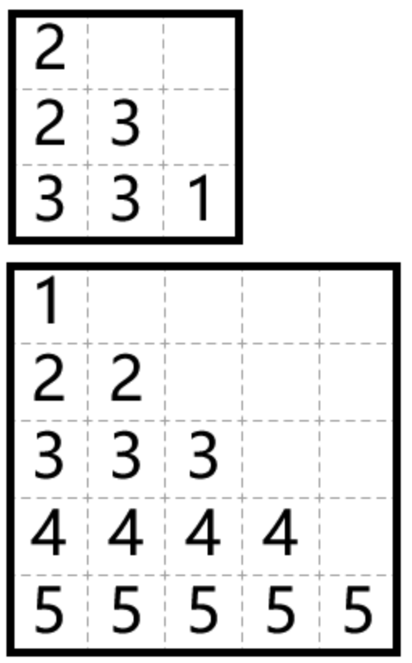




> Question

* Given numbers on diagnal, split board into regions with size corresponding diagnal's number

```txt
Input:
3
2 3 1

Output:
2
2 3
3 3 1
```



> Solution

* Fill from the bottom only go down or left




```py
n = int(input())
diag = list(map(int, input().split()))
G = [[0] * n for _ in range(n)]

for d in range(n):
  for i in range(n - d):
    G[d + i][i] = diag[i]
  diag.remove(d + 1)

for line in G:
  print(*(c for c in line if c))
```



