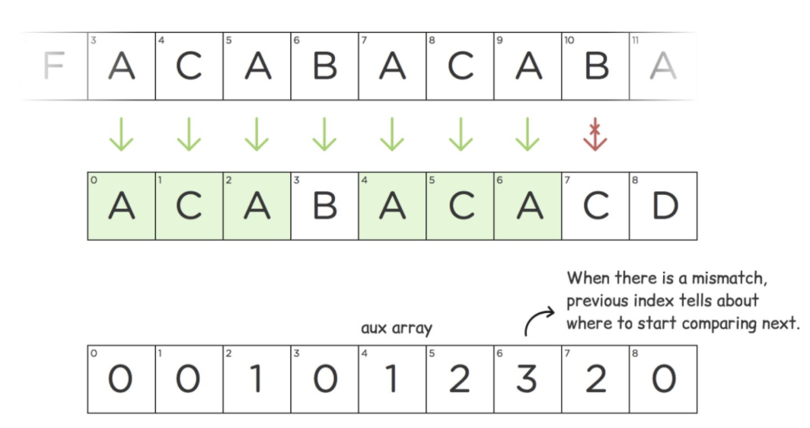

# Dynamic Programming

* an optimization problem on DAGs
* Each subproblem is a vertex and there is a directed edge from u to v that is used to calculate v

* Q. Given a target find minimum / maximum, cost / path / sum to reach the target
* A. Choose min / max among all possible paths before current state, then add value for current state

## Dimension 0



## Dimension 1



## Dimension 2



### Dimension 2 Area



### Dimension 2 Path

* Choose min(max) path among all possible paths before the current state, then add value for the current state
  * routes[i] = min(routes[i-1], routes[i-2], ... , routes[i-k]) + cost[i]



### Tabulation



## Bit



## Count

* Sum all possible ways to reach the current state
  * routes[i] = routes[i-1] + routes[i-2], ... , + routes[i-k]



## Digit

* How many numbers x are there in the range a to b, where the digit d occurs exactly k times in x?



## Divide and concur

* Applyes when $$ DP[i] = min_{i\leq j \leq N}F(i, j) $$



## Convex Haul

* O(N logN)
* $$ DP[i] = min_{j < i}(A[j] * B[i] + DP[j]) $$



## Hash



## Longest Increasing Subsequence



## Knapsack



## Merge



## Tree



## Memoization



## String

* Usually done in N ** 2



### Z Function

* Z algorithm is a linear time string matching algorithm which runs in complexity



### KMP

* Knuth-Morris-Pratt searches for occurrences of a "word" W within a main "text string" S
* observe that when a mismatch occurs, the word itself embodies information to determine where the next match begin
* bypass re-examination of previously matched chars



### Suffix Array


