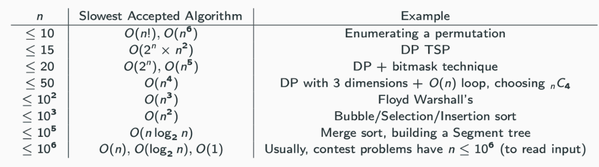

# Greedy

* [greedy](https://www.youtube.com/watch?v=ARvQcqJ_-NY)

> Proof Exchange Argument

* OS be a solution achieved by not choosing g
* Show how to transform OS into some solution OS' that chooses g, and that is at least as good as OS

1. Say G is the event with the earliest finish time. (First greedy decision: include G).
2. Let OS be a legal schedule that doesn't include G such that $$ |OS'| \geq |OS|%0 $$
3. Let the events in OS be $$ j_1, ..., j_k%0 $$ ordered by start and finish times ( $$ J_1 \neq G%0 $$ ) (Exchange Arg)
    * Must show that OS' is a valid solution
    * OS' is better than OS

* Use 1-3 in an inductive argument
* Base case : the greedy strategy works for an instance of size 1
* IH : Assume the greedy works for all instances of size < n

$$ |O S(I)| ≤ |O S^{\prime}(I)|=|\{g\} ∪ S(I^{\prime})| ≤ \left|\{g\} ∪ G S\left(I^{\prime}\right)\right|=|G S(I)|%0 $$



## Implementation



## Greedy Sort

> Minimum $ rooms

* Algorithm
  * Number each room from 1 to n
  * Sort the events by earliest start time
  * Put the first event in room 1
  * For events 2...n, put each event in the smallest numbered room that is available

* Proof
  * Let t be a certain time during the conference
  * Let B(t) be the set of all events that are happening at time t
  * Let R be the number of rooms in an arbitrary valid schedule
  * Let L be a lower bound on the number of rooms for all solutions, max_t|B(t)|
  * Let k be the number of rooms needed for the greedy strategy
  * WWS At some point, t

 $$ |B(t)| k $$

* Let t be the starting time of the first event to be scheduled in room k
* Then room k was the minimum room number available at that time
* This means at time t, there were events going on in rooms 1, ..., k -1 plus the event in room k



## Greedy Hash



## Two pointer

* Following must hold to use two pointers
  * If a wider scope of the sliding window is valid, the narrower scope of that wider scope is valid
  * If a narrower scope of the sliding window is invalid, the wider scope of that narrower scope is invalid



## Sliding window



## Prefix Sum



### Kadane



## BruteForce



## Sweeping



## Scheduling

> Proof Greedy Stays ahead

* Question : Greedily select earliest finish time
  * Let OS(I) be some arbitrary set of non-confliting events
  * Let GS(I) be the outcome of the greedy strategy
  * Show $$ Finish(Gi) <= Finish(J_i) $$ for all i >= 1

* Induction
  * Base : Finish(G1) <= Finish(J1) by greedy choice
  * IH : For some i>= 1, assume that Finish(Gi) <= Finish(Ji)
  * Show : $$ Finish(G_{i + 1}) \leq Finish(J_{i + 1}) $$

* Contradiction: Suppose that k > l where |OS| = k, |GS| = l
  * Then Gl is the last greedy choice so there are no events that start after Gi finishes
  * Then $$ Finish(G_l) \leq Finish(J_l) $$ and $$ Finish(J_l) <= Start(J_{l+1}) $$


