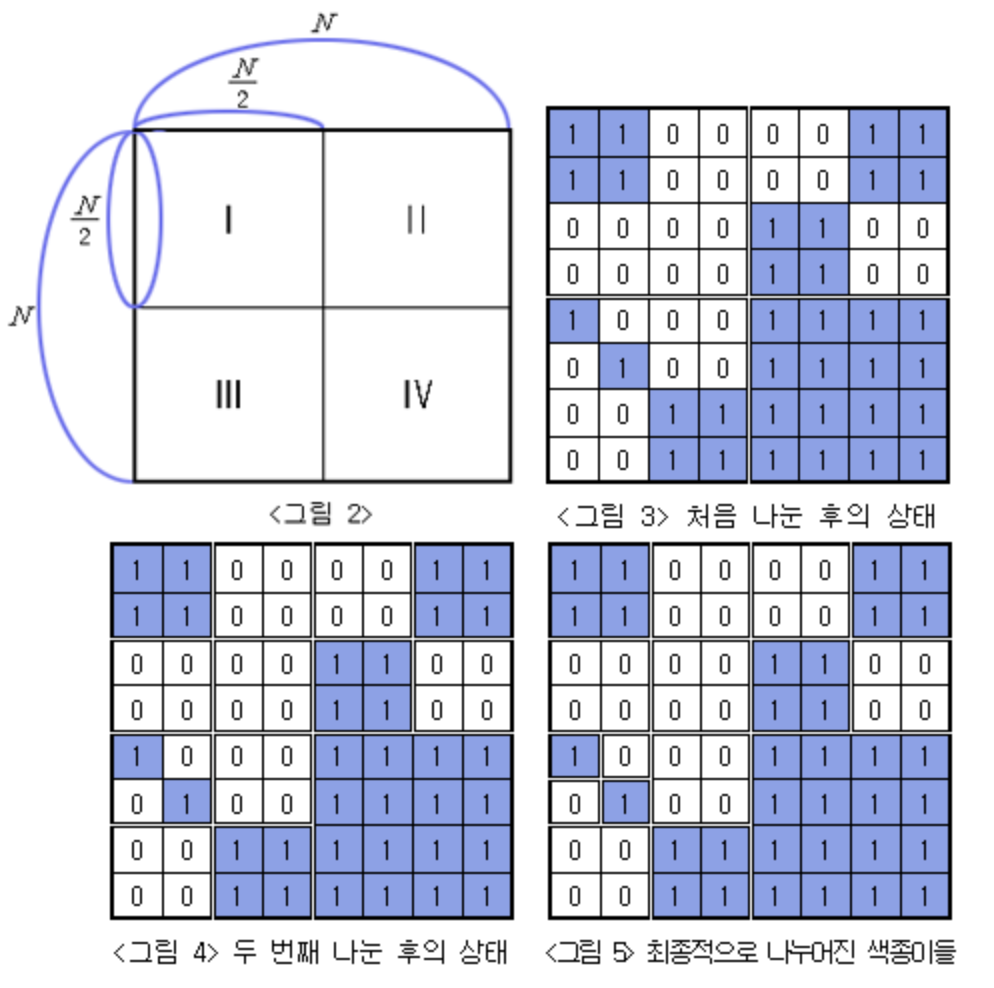
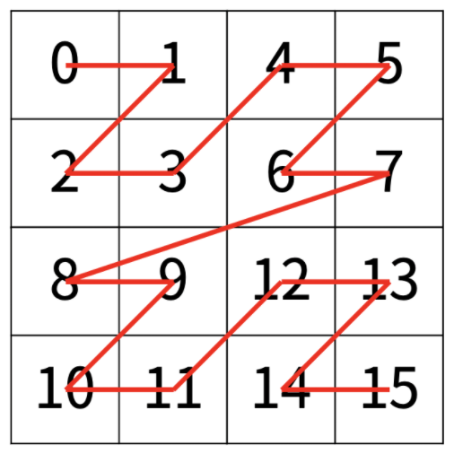
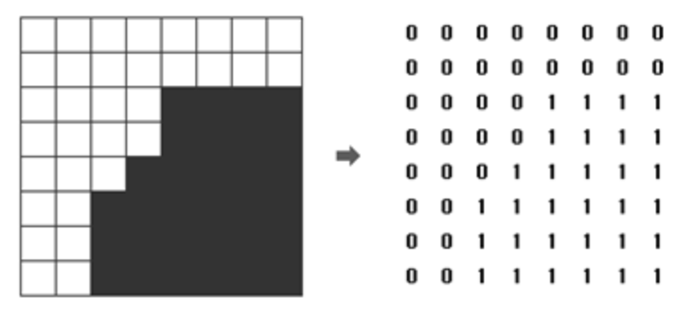
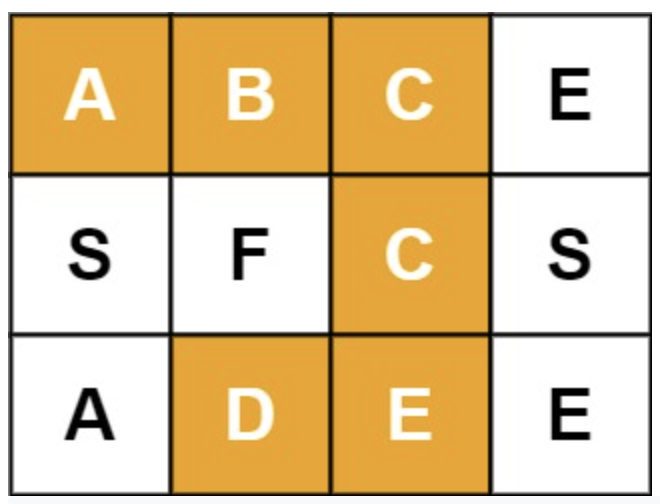

# Divide Concur

> multiply Algorithm

$$ x = 2^{n/2}x_L + x_R $$
$$ y = 2^{n/2}y_L + y_R $$




```py
# O(N)
def multiply (x: int, y: int) -> int:
  If n = 1 : return xy
  xL, xR and yL, yR are left-most and right-most n/2 bits of x and y, respectively.
  P1 = multiply(xL, yL)
  P2 = multiply(xL, yR)
  P3 = multiply(xR, yL)
  P4 = multiply(xR, yR)
  return P1 * 2**n + (P2 + P3) * 2 ** (n / 2) + P4
```




## Master theorem

* Calculates Complexity for divide and conquer algorithm

$$
T(n)=a T\left(\frac{n}{b}\right)+O\left(n^{d}\right)
$$

$$
T(n) \epsilon\left\{\begin{array}{ll}
O\left(n^{d}\right) & \text { top heavy: } a<b^d \\
O\left(n^{d} \log n\right) & \text { steady : } a=b^{d} \\
O\left(n^{\log _{b} a}\right) & \text { bottom heavy: } a>b^{d}
\end{array}\right.
$$

* Proof: After k levels, there are $$a^k$$ subproblems, each of size $$\frac{n}{b^k}$$
* So, during the kth level of recursion, the time complexity

$$
O\left(\left(\frac{n}{b^{k}}\right)^{d}\right) a^{k}=O\left(a^{k}\left(\frac{n}{b^{k}}\right)^{d}\right)=O\left(n^{d}\left(\frac{a}{b^{d}}\right)^{k}\right)
$$

> Cook Toom

* multiplication algorithm for large integers
* Run Time $$ Θ(n^{1.46}) $$

## Binary Search




> bisect

* bisect_left(`nums`, `x`) : first insert point for x in `nums` to maintain sorted order
* bisect_right(`nums`, `x`) : last insert point for x in `nums` to maintain sorted order
  * lo=0, hi=len(a) : set where to start, end in array
* bisect.insort_left(a, x, lo=0, hi=len(a)) : insert x in a in sorted order
  * a.insert(bisect.bisect_left(a, x, lo, hi), x) (a is sorted)
  * O(log n) search is dominated by the slow O(n) insertion step
* bisect.insort(a, x, lo=0, hi=len(a)) : inserting x in a after any existing entries of x

```py
# 1. Search on sorted list
def index(a, x):
  'Locate the leftmost value exactly equal to x'
  i = bisect_left(a, x)
  if i != len(a) and a[i] == x: return i
  raise ValueError

def find_lt(a, x):
  'Find rightmost value less than x'
  i = bisect_left(a, x)
  if i: return a[i-1]
  raise ValueError

def find_le(a, x):
  'Find rightmost value less than or equal to x'
  i = bisect_right(a, x)
  if i: return a[i-1]
  raise ValueError

def find_gt(a, x):
  'Find leftmost value greater than x'
  i = bisect_right(a, x)
  if i != len(a): return a[i]
  raise ValueError

def find_ge(a, x):
  'Find leftmost item greater than or equal to x'
  i = bisect_left(a, x)
  if i != len(a): return a[i]
  raise ValueError
```




> baekjoon

* [Level 0 : SUPER SUPER BINARY SEARCH DELUXE 2.5: THE LEGEND OF THE GOLDEN MAZASSUMNIDA, EPISODE 2: THE MAZWAETL UNIVERSE, PART 2: THE PARALLEL UNIVERSE AND THE LOST MAZASSUMNIDA: GAME OF THE YEAR EDITION](http://acmicpc.net/problem/15641)
  * [Update solution](https://github.com/seanhwangg/algorithm/edit/main/method/divide-concur/binary-search/BJ_15641.md)




> Question

* Guess number given up down

```txt
Output: 50  # either up / down
```




```py
print(50)
```




* [Level 14 : 중앙값 구하기](http://acmicpc.net/problem/2696)
  * [Update solution](https://github.com/seanhwangg/algorithm/edit/main/method/divide-concur/binary-search/BJ_2696.md)




> Question

* Every time you read an odd number, print the median value of the value you have received so far

```txt
Input:
3
9
1 2 3 4 5 6 7 8 9
9
9 8 7 6 5 4 3 2 1
23
23 41 13 22 -3 24 -31 -11 -8 -7
3 5 103 211 -311 -45 -67 -73 -81 -99
-33 24 56

Output:
5
1 2 3 4 5
5
9 8 7 6 5
12
23 23 22 22 13 3 5 5 3 -3
-7 -3
```




```py
from bisect import insort
for _ in range(int(input())):
  m = int(input())
  print(str((m+1)//2))
  nums = []
  for t in range((m + 9) // 10):
    for i, n in enumerate(map(int,input().split())):
      insort(nums, n)
      if i % 2 == 0:
        print(nums[len(nums) // 2], end=' ')
    if t % 2 == 1:
      print()
  if t%2==0:
    print()
```




* [Level 16 : 중앙값 측정](http://acmicpc.net/problem/9426)
  * [Update solution](https://github.com/seanhwangg/algorithm/edit/main/method/divide-concur/binary-search/BJ_9426.md)




> Question

* Given N numbers, print sum of K recent median

```txt
Input:
10 3
3
4
5
6
7
8
9
10
11
12
Output: 60
```




```py
from bisect import *
import sys;input=sys.stdin.readline
nums=[]
N, K = map(int,input().split())
G = [int(input()) for i in range(N)]
ret = 0
kk = (K - 1) // 2
for i in range(N):
  insort(nums, G[i])
  if i < K - 1:
    continue
  if i >= K:
    nums.pop(bisect(nums, G[i - K])-1)
  ret += nums[kk]
print(ret)
```




> leetcode

* [Level Easy : Search Insert Position](https://leetcode.com/problems/search-insert-position)
  * [Update solution](https://github.com/seanhwangg/algorithm/edit/main/method/divide-concur/binary-search/LC_35.md)




> Question

* Search for insertion point

```txt
Input: nums = [1,3,5,6], target = 7
Output: 4
```




```py
def searchInsert(self, nums, target):
  return bisect.bisect_left(nums, target)
```




* [Level Easy : First Bad Version](https://leetcode.com/problems/first-bad-version)
  * [Update solution](https://github.com/seanhwangg/algorithm/edit/main/method/divide-concur/binary-search/LC_278.md)




> Question

* Find first bad version using isBadVersion function

```txt
50
isBadVersion False
25
isBadVersion True
...
```




```py
def firstBadVersion(self, n):
  lo, hi = 1, n
  while lo < hi:
    mi = (lo + hi) // 2
    if not isBadVersion(mi):
      lo = mi + 1
    else:
      hi = mi
  return lo
```




### Parametric Search

> baekjoon

* [Level 8 : 게임](http://acmicpc.net/problem/1072)
  * [Update solution](https://github.com/seanhwangg/algorithm/edit/main/method/divide-concur/parametric-search/BJ_1072.md)




> Question

* Number of games: X/ Winning game: Y (Z%)
* Z is Hyungtaek's winning rate and throws away the decimal point. For example, X=53 and Y=47, Z=88
* When given X and Y, write a program to find out how many more games Hyung-taek has to play to change Z

```txt
Input: 99000 0
Output: 1000    # will make winning rate to 1
```




```py
total, win = map(int, input().split())
z = int(100 * win / total)
if z >= 99:
  print(-1)
else:
  lo, hi = 0, 1000000000
  while lo < hi:
    mi = (lo + hi) // 2
    if z < 100 * (win + mi) // (total + mi):
      hi = mi
    else:
      lo = mi + 1
  print(lo)
```




* [Level 8 : 예산](http://acmicpc.net/problem/2512)
  * [Update solution](https://github.com/seanhwangg/algorithm/edit/main/method/divide-concur/parametric-search/BJ_2512.md)




> Question

* Given maximum sum threshold, find low limit

```txt
Input:
4
120 110 140 150
485

Output: 127  # 127 + 127 + 140 + 150 < 485
```




```py
input()
L, M = list(map(int, input().split())), int(input())
l,r = 1, max(L)
while l <= r:
  m = (l + r) // 2
  if sum(min(i, m) for i in L) <= M:
    l = m + 1
  else:
    r = m-1
print(r)
```




* [Level 8 : 랜선 자르기](http://acmicpc.net/problem/1654)
  * [Update solution](https://github.com/seanhwangg/algorithm/edit/main/method/divide-concur/parametric-search/BJ_1654.md)




> Question

* The maximum length of a LAN line that can be made N on the first line is output as an integer in centimeters

```txt
Input:
4 11
802
743
457
539

Output: 200
```




```py
n, pieces = map(int, input().split())
li = []
for _ in range(n):
  li.append(int(input()))
def count(li, length):
  ret = 0
  for n in li:
    ret += n // length
  return ret
def binary_search(li, x):
  lo, hi = 0, max(li)
  while lo < hi:
    mi = (hi + lo + 1) // 2
    if count(li, mi) < x:
      hi = mi - 1
    else:
      lo = mi
  return lo
print(binary_search(li, pieces))
```




* [Level 8 : 나무 자르기](http://acmicpc.net/problem/2805)
  * [Update solution](https://github.com/seanhwangg/algorithm/edit/main/method/divide-concur/parametric-search/BJ_2805.md)




> Question

* To take at least M meters of wood home, print the maximum height that can be set on the cutter

```txt
Input:
4 7
20 15 10 17

Output: 15
```




```py
_, length = map(int, input().split())
li = list(map(int, input().split()))
def total(li, cut):
  ret = 0
  for n in li:
    ret += max(0, n - cut)
  return ret
def binary_search(li, x):
  lo, hi = 0, max(li)
  while lo < hi:
    mi = (hi + lo + 1) // 2
    if total(li, mi) < x:
      hi = mi - 1
    else:
      lo = mi
  return lo
print(binary_search(li, length))
```




* [Level 10 : 사다리](http://acmicpc.net/problem/2022)
  * [Update solution](https://github.com/seanhwangg/algorithm/edit/main/method/divide-concur/parametric-search/BJ_2022.md)




> Question


* Given x, y, c print ?

```txt
Input: 30 40 10
Output: 26.033
```




```py
a, b, c = map(float, input().split())
c, l, r = 1 / c, 0, min(a, b)
for _ in range(999):
  m = (l + r) / 2
  if 1 / (a * a - m * m) ** 0.5 + 1 / (b * b - m * m) ** 0.5 < c:
    l = m
  else:
    r = m
print(round(m,3))
```




* [Level 10 : 공유기 설치](http://acmicpc.net/problem/2110)
  * [Update solution](https://github.com/seanhwangg/algorithm/edit/main/method/divide-concur/parametric-search/BJ_2110.md)




> Question

* Install C sharers moderately in N homes, maximizing the distance between the two nearest sharers and print

```txt
Input:
5 3
1
2
8
4
9

Output: 3
```




```py
def req_router(house, d):
  count = 1
  prev = house[0]
  for i in range(1, N):
    if prev + d <= house[i]:
      count += 1
      prev = house[i]
  return count
N, C = map(int, (input().split()))
house = sorted([int(input()) for _ in range(N)])
lo, hi = 1, house[-1] - house[0]
while lo < hi:
  mi = (lo + hi + 1) // 2
  if C <= req_router(house, mi):
    lo = mi
  else:
    hi = mi - 1

print(lo)
```




> leetcode

* [Level Medium : Maximum Value at a Given Index in a Bounded Array](https://leetcode.com/problems/maximum-value-at-a-given-index-in-a-bounded-array)
  * [Update solution](https://github.com/seanhwangg/algorithm/edit/main/method/divide-concur/parametric-search/LC_1802.md)




> Question

* Given three positive integers n, index and maxSum. construct an array nums (0-indexed) that satisfies the following conditions:
  * nums.length == n
  * nums[i] is a positive integer where 0 <= i < n
  * abs(nums[i] - nums[i+1]) <= 1 where 0 <= i < n-1
  * The sum of all the elements of nums does not exceed maxSum
  * nums[index] is maximized
* Return nums[index] of the constructed array




```py
def maxValue(self, n, index, maxSum):
  def test(mid):
    left = max(mid - index, 0)
    right = max(mid - ((n - 1) - index), 0)
    return (mid + left) * (mid - left + 1) // 2 + (mid + right - 1) * (mid - right) // 2

  maxSum -= n
  left, right = 0, maxSum
  while left < right:
    mid = (left + right + 1) // 2
    if test(mid) <= maxSum:
      left = mid
    else:
      right = mid - 1
  return left + 1
```




* [Level Hard : Median of Two Sorted Arrays](https://leetcode.com/problems/median-of-two-sorted-arrays)
  * [Update solution](https://github.com/seanhwangg/algorithm/edit/main/method/divide-concur/parametric-search/LC_4.md)




> Question

* Return median of two sorted array

```txt
Input: nums1 = [1,2], nums2 = [3,4]
Output: 2.50000
Explanation: merged array = [1,2,3,4] and median is (2 + 3) / 2 = 2.5.
```




```py
def findMedianSortedArrays(self, nums1, nums2):
  a, b = sorted((nums1, nums2), key=len)
  after = (len(a) + len(b) - 1) // 2
  lo, hi = 0, len(a)
  while lo < hi:
    mi = (lo + hi) // 2
    if after-mi-1 < 0 or a[mi] >= b[after-mi-1]:
      hi = mi
    else:
      lo = mi + 1
  nextfew = sorted(a[lo:lo+2] + b[after-lo:after-lo+2])
  return (nextfew[0] + nextfew[1 - (len(a) + len(b)) % 2]) / 2.0
```




* [Level Hard : Nth Magical Number](https://leetcode.com/problems/nth-magical-number)
  * [Update solution](https://github.com/seanhwangg/algorithm/edit/main/method/divide-concur/parametric-search/LC_878.md)




> Question

* A positive integer is magical if it is divisible by either a or b
* Given the three integers n, a, and b, return the nth magical number modulo 10 ** 9 + 7

```txt
Input: n = 1, a = 2, b = 3
Output: 2
```




```py
import math
def nthMagicalNumber(self, N, A, B):
  l, r, lcm = 2, 10 ** 14, math.lcm(A, B)
  while l < r:
    m = (l + r) // 2
    if m // A + m // B - m // lcm < N: # inclusion exclusion formula
      l = m + 1
    else:
      r = m
  return l % (10**9 + 7)
```




* [Level Hard : Split Array Largest Sum](https://leetcode.com/problems/split-array-largest-sum)
  * [Update solution](https://github.com/seanhwangg/algorithm/edit/main/method/divide-concur/parametric-search/LC_410.md)




> Question

* Given an array nums which consists of non-negative integers and an integer m, split array into m non-empty continuous subarrays
* minimize the largest sum among these m subarrays

```txt
Input: nums = [7,2,5,10,8], m = 2
Output: 18
```




```py
def is_valid(self, nums, m, mi):
  cuts, curr_sum = 0, 0
  for x in nums:
    curr_sum += x
    if curr_sum > mi:
      cuts, curr_sum = cuts + 1, x
  subs = cuts + 1
  return subs <= m

def splitArray(self, nums, m):
  lo, hi, ans = max(nums), sum(nums), -1
  while lo <= hi:
    mi = (lo + hi) // 2
    if self.is_valid(nums, m, mi):
      ans, hi = mi, mi - 1
    else:
      lo = mi + 1
  return ans
```




### Ternary Search

> baekjoon

* [Level 11 : 민호와 강호](http://acmicpc.net/problem/11662)
  * [Update solution](https://github.com/seanhwangg/algorithm/edit/main/method/divide-concur/ternary-search/BJ_11662.md)




> Question

* minho walks from point A to B and kangho wlaks from point C to D
* if they start and arrive at the same time, find closest point between them

```txt
Input: 0 0 1 1 2 2 3 3
Output: 2.8284271247
```




```py
def dist(a, b):
  return ((a[0]-b[0])**2 + (a[1]-b[1])**2)**0.5

def midspot(a, b):
  return ((a[0]+b[0])/2, (a[1]+b[1])/2)

inp = input().split()
first1, last1, first2, last2 = [(int(inp[i*2]), int(inp[i*2+1])) for i in range(len(inp)//2)]
result = 99999

while dist(first1, last1) > 0.000001:
  mid1 = midspot(first1, last1)
  mid2 = midspot(first2, last2)
  result = min(result, dist(mid1, mid2))

  if dist(midspot(first1, mid1), midspot(first2, mid2)) < dist(midspot(mid1, last1), midspot(mid2, last2)):
    last1 = mid1
    last2 = mid2
  else:
    first1 = mid1
    first2 = mid2

print(result)
```




* [Level 16 : 전봇대](http://acmicpc.net/problem/8986)
  * [Update solution](https://github.com/seanhwangg/algorithm/edit/main/method/divide-concur/ternary-search/BJ_8986.md)




> Question

* Given list of points, find the sum of minimum distance so they are equally spaced

```txt
Input:
4
0 4 6 9

Output:
1
```




```py
def cost(arr, x):
  ret = 0
  for i in range(len(arr)):
    ret += abs(i * x - arr[i])
  return ret

N = int(input())
arr = list(map(int, input().split()))

lo, hi = 1, int(1e9)

while lo + 3 <= hi:
  l, r = (2 * lo + hi) // 3, (lo + 2 * hi) // 3

  mid1, mid2 = cost(arr, l), cost(arr, r)
  if mid1 < mid2:
    hi = r
  else:
    lo = l

ans = 1e18
for i in range(lo, hi+1):
  ans = min(ans, cost(arr, i))

print(ans)
```




## Quick Select

> leetcode

* [Level Easy : Majority Element](https://leetcode.com/problems/majority-element)
  * [Update solution](https://github.com/seanhwangg/algorithm/edit/main/method/divide-concur/quick-select/LC_169.md)




> Question

* Given an array nums of size n, return the majority element

```txt
Input: [3,2,3]
Output: 3
```

> Solutino

* Boyer-Moore Voting Algorithm




```cpp
// Time : O(N)
int majorityElement(vector<int>& nums) {
  int counter = 0, majority;
  for (int num : nums) {
    if (!counter)
      majority = num;
    counter += num == majority ? 1 : -1;
  }
  return majority;
}
```




* [Level Easy : Third Maximum Number](https://leetcode.com/problems/third-maximum-number)
  * [Update solution](https://github.com/seanhwangg/algorithm/edit/main/method/divide-concur/quick-select/LC_414.md)




> Question

* Given integer array nums, return the third maximum number in this array
* If the third maximum does not exist, return the maximum number

```txt
Input: nums = [2,2,3,1]
Output: 1
```




```py
def thirdMax(self, nums):
  a = b = c = -float("inf")
  for n in nums:
    if n in (a, b, c): continue
    if n > a: n, a = a, n
    if n > b: n, b = b, n
    if n > c: n, c = c, n
  return a if c == -float("inf") else c
```




* [Level Medium : Kth Largest Element in an Array](https://leetcode.com/problems/kth-largest-element-in-an-array)
  * [Update solution](https://github.com/seanhwangg/algorithm/edit/main/method/divide-concur/quick-select/LC_215.md)




> Question

* Find kth largest number

```txt
Input: nums = [3,2,1,5,6,4], k = 2
Output: 5
```




```py
def findKthLargest(self, li, k):
  pivot = random.choice(li)
  lo  = [l for l in li if l < pivot]
  mi = [e for e in li if e == pivot]
  hi = [r for r in li if r > pivot]
  if k <= len(hi):
    return self.findKthLargest(hi, k)
  elif (k - len(hi)) <= len(mi):
    return mi[0]
  else:
    return self.findKthLargest(lo, k - len(hi) - len(mi))
```




* [Level Medium : Top K Frequent Elements](https://leetcode.com/problems/top-k-frequent-elements)
  * [Update solution](https://github.com/seanhwangg/algorithm/edit/main/method/divide-concur/quick-select/LC_347.md)




> Question

* Return Top Kth frequent number

```txt
Input: nums = [1,1,1,2,2,3], k = 2
Output: [1,2]
```




```py
# 1. Using built in
def topKFrequent(self, nums: List[int], k: int) -> List[int]:
  co = Counter(nums)
  return [a for a, b in co.most_common(k)]

# 2. O(n) using count buckets
def topKFrequent(self, nums: List[int], k: int) -> List[int]:
  b = [[] for _ in range(len(nums)+1)]
  c = Counter(nums)
  for x in c:
    b[c[x]].append(x)
  return list(chain(*b))[-k:]
```




## Meet in the middle

> baekjoon

* [Level 14 : 부분수열의 합 2](http://acmicpc.net/problem/1208)
  * [Update solution](https://github.com/seanhwangg/algorithm/edit/main/method/divide-concur/meet-in-the-middle/BJ_1208.md)




> Question

* Count number of subsequence s.t sum is equal to S

```txt
Input:
5 0
-7 -3 -2 5 8

Output: 1  # -3 -2 5
```




```cpp
#include <bits/stdc++.h>
using namespace std;

int A[40], N, S, ans;
unordered_map<int, int> m;

void dfs_l(int i, int sum) {
  m[sum]++;
  for (; i < N / 2; i++)
    dfs_l(i + 1, sum + A[i]);
}
void dfs_r(int i, int sum) {
  ans += m[S - sum];
  for (; i >= N / 2; i--)
    dfs_r(i - 1, sum + A[i]);
}

int main() {
    cin >> N >> S;
  for (int i = 0; i < N; i++)
    cin >> A[i];
  dfs_l(0, 0), dfs_r(N - 1, 0);
  cout <<  ans - !S;
}
```




```py
from collections import defaultdict
n, s = map(int,input().split())
a = [*map(int,input().split())]
d = defaultdict(int)
d[0]=1
for i in range(n):
  m = sum([x for x in a[i+1:] if x < 0])
  M = sum([x for x in a[i+1:] if x > 0])
  l = list(d.items())
  for y, z in l:
    if s - M <= y + a[i] <= s - m:
      d[y + a[i]] += z
print(d[s] if s else d[s] - 1)
```




* [Level 15 : 냅색문제](http://acmicpc.net/problem/1450)
  * [Update solution](https://github.com/seanhwangg/algorithm/edit/main/method/divide-concur/meet-in-the-middle/BJ_1450.md)




> Question

* Given N items and bag capacity C, find the number of ways put items in bag

```txt
Input:
2 1
1 1

Output: 3
```




```cpp
#include <bits/stdc++.h>
using namespace std;

long long N, C, W[31], ans;
vector<long long> group1, group2;

void dfs(int s, int e, vector<long long>& v, long long sum) {
  if(s > e) {
    v.push_back(sum);
  } else {
    dfs(s+1, e, v, sum);
    dfs(s+1, e, v, sum+W[s]);
  }
}

int main() {
  cin >> N >> C;

  for(int i = 0; i < N; i++)
    cin >> W[i];

  dfs(0, N/2, group1, 0);
  dfs(N/2 + 1, N-1, group2, 0);
  sort(group2.begin(), group2.end());

  for(int i = 0; i < group1.size(); i++)
    ans += upper_bound(group2.begin(), group2.end(), C - group1[i]) - group2.begin();

  cout << ans << endl;
}
```




## Recursion

[Recursion](https://www.youtube.com/watch?v=kx6DfrYfWnQ)

[Finbonacci](https://www.youtube.com/watch?v=zg-ddPbzcKM)

> baekjoon

* [Level 0 : 가장 가까운 두 점의 거리](http://acmicpc.net/problem/5620)
  * [Update solution](https://github.com/seanhwangg/algorithm/edit/main/method/divide-concur/recursion/BJ_5620.md)




> Question

* Given n points on 2 dimension, find distance between closest two points

```txt
Input:
3
5 5
0 0
-3 -4

Output: 25
```




```py
# Time : O(n * log_n) using master's theorem
# Space : O(n)
import sys

def closest_pair(points):
  if len(points) < 3:
    return points
  m = len(points) // 2
  sub1 = closest_pair(points[:m])
  sub2 = closest_pair(points[m:])

  sub = sub1 + sub2
  min_dist, min_points = sys.maxsize, (sub[0], sub[1])
  for i in range(len(sub) - 1):
    for k in range(i + 1, len(sub)):
      p1, p2 = sub[i], sub[k]
      dist = (p1[0] - p2[0]) ** 2 + (p1[1] - p2[1]) ** 2
      if min_dist > dist:
        min_dist, min_points = dist, [p1, p2]

  return min_points

input = lambda : sys.stdin.readline().rstrip()

N = int(input())
points = [tuple(map(int, input().split())) for _ in range(N)]
points.sort()

p1, p2 = closest_pair(points)
print((p1[0] - p2[0]) ** 2 + (p1[1] - p2[1]) ** 2)
```




* [Level 6 : 요세푸스 문제](http://acmicpc.net/problem/1158)
  * [Update solution](https://github.com/seanhwangg/algorithm/edit/main/method/divide-concur/recursion/BJ_1158.md)

[//]: # (BJ_1179)

* [Level 6 : 재귀함수가 뭔가요?](http://acmicpc.net/problem/17478)
  * [Update solution](https://github.com/seanhwangg/algorithm/edit/main/method/divide-concur/recursion/BJ_17478.md)




> Question

```txt
어느 한 컴퓨터공학과 학생이 유명한 교수님을 찾아가 물었다.
"재귀함수가 뭔가요?"
"잘 들어보게. 옛날옛날 한 산 꼭대기에 이세상 모든 지식을 통달한 선인이 있었어.
마을 사람들은 모두 그 선인에게 수많은 질문을 했고, 모두 지혜롭게 대답해 주었지.
그의 답은 대부분 옳았다고 하네. 그런데 어느 날, 그 선인에게 한 선비가 찾아와서 물었어."
____"재귀함수가 뭔가요?"
____"잘 들어보게. 옛날옛날 한 산 꼭대기에 이세상 모든 지식을 통달한 선인이 있었어.
____마을 사람들은 모두 그 선인에게 수많은 질문을 했고, 모두 지혜롭게 대답해 주었지.
____그의 답은 대부분 옳았다고 하네. 그런데 어느 날, 그 선인에게 한 선비가 찾아와서 물었어."
________"재귀함수가 뭔가요?"
________"재귀함수는 자기 자신을 호출하는 함수라네"
________라고 답변하였지.
____라고 답변하였지.
라고 답변하였지.
```




```py
def recur(mx, cur):
  if cur == mx:
    print("____" * cur + '"재귀함수가 뭔가요?"')
    print("____" * cur + '"재귀함수는 자기 자신을 호출하는 함수라네"')
    print("____" * cur + '라고 답변하였지.')
    return
  print("____" * cur + '"재귀함수가 뭔가요?"')
  print("____" * cur + '"잘 들어보게. 옛날옛날 한 산 꼭대기에 이세상 모든 지식을 통달한 선인이 있었어.')
  print("____" * cur + '마을 사람들은 모두 그 선인에게 수많은 질문을 했고, 모두 지혜롭게 대답해 주었지.')
  print("____" * cur + '그의 답은 대부분 옳았다고 하네. 그런데 어느 날, 그 선인에게 한 선비가 찾아와서 물었어."')
  recur(mx, cur + 1)
  print("____" * cur + '라고 답변하였지.')

print("어느 한 컴퓨터공학과 학생이 유명한 교수님을 찾아가 물었다.")
n = int(input())
recur(n, 0)
```




* [Level 8 : N과 M (8)](http://acmicpc.net/problem/15657)
  * [Update solution](https://github.com/seanhwangg/algorithm/edit/main/method/divide-concur/recursion/BJ_15657.md)




> Question

* The sequence of choosing M from N natural numbers
* You can choose the same number several times
* The even sequence shall be in rain descending order

```txt
Input:
4 2
9 8 7 1

Output:
1 1
1 7
1 8
1 9
7 7
7 8
7 9
8 8
8 9
9 9
```




```py
N, M = map(int, input().split())
li=list(sorted(map(int, input().split())))
def backtrack(cur, N, M):
  if len(cur) == M:
    print(*cur)
    return
  for i in range(N):
    if not cur or li[i] >= cur[-1]:
      cur.append(li[i])
      backtrack(cur, N, M)
      cur.pop()
backtrack([], N, M)
```




* [Level 8 : N과 M (4)](http://acmicpc.net/problem/15652)
  * [Update solution](https://github.com/seanhwangg/algorithm/edit/main/method/divide-concur/recursion/BJ_15652.md)




> Question

* The sequence of choosing M from 1 to NYou can choose the same number several times
* The even sequence shall be in rain descending order

```txt
Input: 4 2
Output:
1 1
1 2
1 3
1 4
2 2
2 3
2 4
3 3
3 4
4 4
```




```py
N, M = map(int, input().split())
def backtrack(cur, N, M):
  if len(cur) == M:
    print(*cur)
    return
  for i in range(cur[-1] if cur else 1, N + 1):
    cur.append(i)
    backtrack(cur, N, M)
    cur.pop()
backtrack([], N, M)
```




* [Level 8 : 칸토어 집합](http://acmicpc.net/problem/4779)
  * [Update solution](https://github.com/seanhwangg/algorithm/edit/main/method/divide-concur/recursion/BJ_4779.md)




> Question

```txt
Input : 3
Output : - -   - -         - -   - -
```




```cpp
#include<bits/stdc++.h>
using namespace std;

void cantor(int len) {
  if (len == 1)
    cout << '-';
  else {
    cantor(len / 3);
    cout << string(len / 3, ' ');
    cantor(len / 3);
  }
}
int main()
{
  cin.tie(NULL), cout.tie(NULL);
  ios::sync_with_stdio(false);

  int N;
  while (cin >> N) {
    cantor(pow(3, N));
    cout << '\n';
  }
  return 0;
}
```




```py
import sys

def cantor(size):
  if size == 1:
    print('-', end='')
  else:
    cantor(size // 3)
    print(' ' * (size // 3), end='')
    cantor(size // 3)

for l in sys.stdin:
  cantor(3 ** int(l))
  print()
```




* [Level 8 : N과 M (7)](http://acmicpc.net/problem/15656)
  * [Update solution](https://github.com/seanhwangg/algorithm/edit/main/method/divide-concur/recursion/BJ_15656.md)




> Question

* The sequence of choosing M from N natural numbers
* can choose the same number several times

```txt
Input:
4 2
9 8 7 1

Output:
1 1
1 7
1 8
1 9
7 1
7 7
7 8
7 9
8 1
8 7
8 8
8 9
9 1
9 7
9 8
9 9
```




```py
N, M = map(int, input().split())
li = list(sorted(map(int, input().split())))
def backtrack(cur, N, M):
  if len(cur) == M:
    print(*cur)
    return
  for i in range(N):
    cur.append(li[i])
    backtrack(cur, N, M)
    cur.pop()
backtrack([], N, M)
```




* [Level 8 : 색종이 만들기](http://acmicpc.net/problem/2630)
  * [Update solution](https://github.com/seanhwangg/algorithm/edit/main/method/divide-concur/recursion/BJ_2630.md)




> Question



* The first line prints the number of white colored paper cut, and the second line prints the number of blue colored paper

```txt
Input:
8
1 1 0 0 0 0 1 1
1 1 0 0 0 0 1 1
0 0 0 0 1 1 0 0
0 0 0 0 1 1 0 0
1 0 0 0 1 1 1 1
0 1 0 0 1 1 1 1
0 0 1 1 1 1 1 1
0 0 1 1 1 1 1 1

Output:
9
7
```




```py
def recur(r, c, n):
  global G, blue, white
  total = sum(sum(li[c : c + n]) for li in G[r : r + n])
  if total == 0:
    white +=1
  elif total == n ** 2:
    blue += 1
  else:
    recur(r, c, n // 2)
    recur(r + n // 2, c, n // 2)
    recur(r, c + n // 2, n // 2)
    recur(r + n // 2, c + n // 2, n // 2)

G = []
n = int(input())
for _ in range(n):
  G.append(list(map(int, input().split())))

blue = 0
white = 0
recur(0, 0, len(G))
print(white)
print(blue)
```




* [Level 9 : 종이의 개수](http://acmicpc.net/problem/1780)
  * [Update solution](https://github.com/seanhwangg/algorithm/edit/main/method/divide-concur/recursion/BJ_1780.md)




> Question

* If all the paper is in the same number, use this paper as it is
* If not, cut the paper into nine of the same size, and repeat the process of (1) for each cut paper

```txt
Input:
9
0 0 0 1 1 1 -1 -1 -1
0 0 0 1 1 1 -1 -1 -1
0 0 0 1 1 1 -1 -1 -1
1 1 1 0 0 0 0 0 0
1 1 1 0 0 0 0 0 0
1 1 1 0 0 0 0 0 0
0 1 -1 0 1 -1 0 1 -1
0 -1 1 0 1 -1 0 1 -1
0 1 -1 1 0 -1 0 1 -1

Output:
10
12
11
```




```py
import sys
sys.setrecursionlimit(10**6)
input = sys.stdin.readline
def same(x, y, n):
  for i in range(x, x+n):
    for j in range(y, y+n):
      if G[x][y] != G[i][j]:
        return False
  return True
def solve(x, y, n):
  if same(x, y, n):
    cnt[G[x][y]+1] += 1
    return
  for i in range(0, 3):
    for j in range(0, 3):
      solve(x + i * n // 3, y + j * n // 3, n // 3)
cnt = [0] * 3
n = int(input())
G = [list(map(int, input().split())) for _ in range(n)]
solve(0, 0, n)
for i in cnt:
  print(i)
```




* [Level 9 : 하노이 탑 이동 순서](http://acmicpc.net/problem/11729)
  * [Update solution](https://github.com/seanhwangg/algorithm/edit/main/method/divide-concur/recursion/BJ_11729.md)




> Question

* Solve hanoi problem

```txt
Input: 3
Output:
7
1 3
1 2
3 2
1 3
2 1
2 3
1 3
```




```py
def hanoi(disk, start, mid, end):
  if disk == 1:
    moves.append([start, end])
  else:
    hanoi(disk - 1, start, end, mid)
    moves.append([start, end])
    hanoi(disk - 1, mid, start, end)
total_disk = int(input())
moves = []
hanoi(total_disk, 1, 2, 3)
print(len(moves))
for move in moves:
  print(move[0], move[1])
```




* [Level 9 : 부등호](http://acmicpc.net/problem/2529)
  * [Update solution](https://github.com/seanhwangg/algorithm/edit/main/method/divide-concur/recursion/BJ_2529.md)




> Question

* Different single-digit numbers are put before and after the inequality symbol to satisfy all inequality relationships
* An integer from 0 to 9, and all the numbers selected must be different

```txt
Input:
2
< >

Output:
897
021
```




```py
def solve(ops, cur, results):
  idx = len(cur)
  if idx == len(ops) + 1:
    if len(results) <= 1:
      results.append(cur)
    results[-1] = cur
    return
  for i in range(10):
    if not c[i]:
      if idx == 0 or ops[idx - 1] == '<' and cur[-1] < str(i) or ops[idx - 1] == '>' and cur[-1] > str(i):
        c[i] = True
        solve(ops, cur + str(i), results)
        c[i] = False

n = int(input())
ops = input().split()
c = [False] * 10
results = []
solve(ops, "", results)
print(results[1], results[0], sep='\n')
```




* [Level 10 : Z](http://acmicpc.net/problem/1074)
  * [Update solution](https://github.com/seanhwangg/algorithm/edit/main/method/divide-concur/recursion/BJ_1074.md)




> Question



* print when row r, and column c will be visited

```txt
Input: 2 3 1
Output: 11
```




```py
def recur(N, r, c):
  if r == c == 0:
    return 0
  side = 2 ** (N - 1)
  return recur(N - 1, r % side, c % side) + side ** 2 * (r // side * 2 + c // side)
N, r, c = map(int, input().split())
print(recur(N, r, c))
```




* [Level 10 : 쿼드트리](http://acmicpc.net/problem/1992)
  * [Update solution](https://github.com/seanhwangg/algorithm/edit/main/method/divide-concur/recursion/BJ_1992.md)




> Question



* If all the images given are zero, the compression result is zero, and if all are one, the compression result is one
* If 0 and 1 are mixed, whole is not represented at once, and compressed into four images
  * left top, right bottom, left bottom, right bottom, and so on
* (0(0011)(0(0111)01)1)

```txt
Input:
8
11110000
11110000
00011100
00011100
11110000
11110000
11110011
11110011

Output: ((110(0101))(0010)1(0001))
```




```py
N = int(input())
image = [list(map(int, input())) for _ in range(N)]
def quadtree(x, y, n):
  if(n == 1):
    return str(image[x][y])
  result = []
  for i in range(x, x + n):
    for j in range(y, y + n):
      if(image[i][j] != image[x][y]):
        result.append('(')
        result.extend(quadtree(x, y, n//2))
        result.extend(quadtree(x, y + n//2, n//2))
        result.extend(quadtree(x + n//2, y, n//2))
        result.extend(quadtree(x + n//2, y + n//2, n//2))
        result.append(')')
        return result
  return str(image[x][y])

print(''.join(quadtree(0, 0, N)))
```




* [Level 10 : 별 찍기 - 10](http://acmicpc.net/problem/2447)
  * [Update solution](https://github.com/seanhwangg/algorithm/edit/main/method/divide-concur/recursion/BJ_2447.md)




> Question

* Print star in following format

```txt
input: 27

Output:
***************************
* ** ** ** ** ** ** ** ** *
***************************
***   ******   ******   ***
* *   * ** *   * ** *   * *
***   ******   ******   ***
***************************
* ** ** ** ** ** ** ** ** *
***************************
*********         *********
* ** ** *         * ** ** *
*********         *********
***   ***         ***   ***
* *   * *         * *   * *
***   ***         ***   ***
*********         *********
* ** ** *         * ** ** *
*********         *********
***************************
* ** ** ** ** ** ** ** ** *
***************************
***   ******   ******   ***
* *   * ** *   * ** *   * *
***   ******   ******   ***
***************************
* ** ** ** ** ** ** ** ** *
***************************
```




```py
import math

def recur(old_G):
  new_G=[]
  for i in range(3 * len(old_G)):
    if i // len(old_G) == 1:
      new_G.append(old_G[i % len(old_G)] + " " * len(old_G) + old_G[i % len(old_G)])
    else:
      new_G.append(old_G[i % len(old_G)] * 3)
  return new_G

G = ["*"]
i = 1
N = int(input())

while i != N:
  G = recur(G)
  i *= 3
for i in G:
  print(i)
```




* [Level 14 : 2048 (Easy)](http://acmicpc.net/problem/12100)
  * [Update solution](https://github.com/seanhwangg/algorithm/edit/main/method/divide-concur/recursion/BJ_12100.md)




> Question

* In 2048 games, print the largest block that can be obtained by moving it up to five times

```txt
Input:
3
2 2 2
4 4 4
8 8 8

Output: 16
```




```py
from copy import deepcopy
def move(G, typ):
  result = []
  if typ == 0 or typ == 1:
    G = list(zip(*G))
  for idx in range(len(G)):
    row = G[idx]
    block = [i for i in row if i != 0]
    if typ == 0 or typ == 3:
      for i in range(1, len(block)):
        if block[i-1] ==  block[i]:
          block[i-1] += block[i]
          block[i] = 0
      block = [i for i in block if i != 0]
      block += [0] * (len(row) - len(block))
    else:
      for i in range(len(block) - 1, 0, -1):
        if block[i-1] == block[i]:
          block[i] += block[i-1]
          block[i-1] = 0
      block = [i for i in block if i != 0]
      block = [0] * (len(row) - len(block)) + block
    result.append(block)
  if typ == 0 or typ == 1:
    result = list(zip(*result))
  return result

def recur(G, count):
  if count == 0:
    return max([max(li) for li in G])
  return max([recur(move(deepcopy(G), typ), count - 1) for typ in range(4)])
n = int(input())
G = [list(map(int, input().split())) for _ in range(n)]
print(recur(G, 5))
```




> leetcode

* [Level Easy : Longest Nice Substring](https://leetcode.com/problems/longest-nice-substring)
  * [Update solution](https://github.com/seanhwangg/algorithm/edit/main/method/divide-concur/recursion/LC_1763.md)




> Question

* A string s is nice if, for every letter of the alphabet that s contains, it appears both in uppercase and lowercase
* Given a string s, return the longest substring of s that is nice
* If there are multiple, return the substring of the earliest occurrence. If there are none, return an empty string

```txt
Input: s = "YazaAay"
Output: "aAa"
```




```py
def longestNiceSubstring(self, s: str) -> str:
  if not s: return ""
  ss = set(s)
  for i, c in enumerate(s):
    if c.swapcase() not in ss:
      s0 = self.longestNiceSubstring(s[:i])
      s1 = self.longestNiceSubstring(s[i+1:])
      return max(s0, s1, key=len)
  return s
```




* [Level Medium : Jump Game III](https://leetcode.com/problems/jump-game-iii)
  * [Update solution](https://github.com/seanhwangg/algorithm/edit/main/method/divide-concur/recursion/LC_1306.md)




> Question

* initially positioned at start index of the array. When at index i, can jump to i + arr[i] or i - arr[i]
* check if reach to any index with value 0

```txt
Input:
Output:
```




```cpp
bool canReach(vector<int>& A, int i) {
  return 0 <= i && i < A.size() && A[i] >= 0 && (!(A[i] = -A[i]) || canReach(A, i + A[i]) || canReach(A, i - A[i]));
}
```




* [Level Medium : Lowest Common Ancestor of a Binary Tree](https://leetcode.com/problems/lowest-common-ancestor-of-a-binary-tree)
  * [Update solution](https://github.com/seanhwangg/algorithm/edit/main/method/divide-concur/recursion/LC_236.md)




> Question

* Find loest common ancestor of p and q

```txt
Input: root = [3,5,1,6,2,0,8,null,null,7,4], p = 5, q = 1
Output: 3
```




```py
# Time / space : O(n) / O(n)
def lowestCommonAncestor(self, root, p, q):
  if root in (None, p, q): return root
  left, right = (self.lowestCommonAncestor(kid, p, q) for kid in (root.left, root.right))
  return root if left and right else left or right
```




* [Level Hard : Number of Ways to Rearrange Sticks With K Sticks Visible](https://leetcode.com/problems/number-of-ways-to-rearrange-sticks-with-k-sticks-visible)
  * [Update solution](https://github.com/seanhwangg/algorithm/edit/main/method/divide-concur/recursion/LC_1866.md)




> Question

* There are n uniquely-sized sticks whose lengths are integers from 1 to n
* arrange the sticks such that exactly k sticks are visible from the left
* Given n and k, return the number of such arrangements modulo 10e9 + 7

```txt
Input: n = 3, k = 2
Output: 3  # [1,3,2], [2,3,1], and [2,1,3] exactly 2 sticks are visible
```




```py
@lru_cache(None)
def rearrangeSticks(self, n: int, k: int) -> int:
  if k < 0 or n == 0: return k == 0
  return (self.rearrangeSticks(n - 1, k) * (n - 1) + self.rearrangeSticks(n - 1, k - 1)) % int(1e9 + 7)
```




* [Level Hard : Brace Expansion II](https://leetcode.com/problems/brace-expansion-ii)
  * [Update solution](https://github.com/seanhwangg/algorithm/edit/main/method/divide-concur/recursion/LC_1096.md)




> Question

```txt
Input: "{a,b}{c,{d,e}}"
Output: ["ac","ad","ae","bc","bd","be"]

Input: "{{a,z},a{b,c},{ab,z}}"
Output: ["a","ab","ac","z"]
```




```py
def braceExpansionII(self, expression: str) -> List[str]:
  groups = [[]]
  level = 0
  for i, c in enumerate(expression):
    if c == '{':
      if level == 0:
        start = i+1
      level += 1
    elif c == '}':
      level -= 1
      if level == 0:
        groups[-1].append(self.braceExpansionII(expression[start:i]))
    elif c == ',' and level == 0:
      groups.append([])
    elif level == 0:
      groups[-1].append([c])
  word_set = set()
  for group in groups:
    word_set |= set(map(''.join, itertools.product(*group)))
  return sorted(word_set)
```




* [Level Hard : Closest Subsequence Sum](https://leetcode.com/problems/closest-subsequence-sum)
  * [Update solution](https://github.com/seanhwangg/algorithm/edit/main/method/divide-concur/recursion/LC_1755.md)




> Question

* Given an integer array nums and an integer goal
* choose a subsequence of nums such that the sum of its elements is the closest possible to goal
* That is, if the sum of the subsequence's elements is sum, then you want to minimize the absolute difference abs(sum - goal)
* Return the minimum possible value of abs(sum - goal)

```txt
Input: nums = [5,-7,3,5], goal = 6
Output: 0
```




```py
def minAbsDifference(self, nums: List[int], goal: int) -> int:
  def generate_sum(nums):
    ans = {0}
    for x in nums:
      ans |= {x + y for y in ans}
    return ans

  evens = [-inf, *sorted(generate_sum(nums[::2])), inf]

  return min(abs(y + x - goal)
              for x in generate_sum(nums[1::2])
              for k in [bisect_left(evens, goal - x)]
              for y in evens[k - 1 : k + 1])
```




### backtrack

* Bounding function : kill some live nodes without actually expanding them
* generic method that can be applied to problems with large solution set, in search and optimization problems
* often be a first step towards finding a greedy or dynamic programming algorithm
* often gives a more efficient runtime over exhaustive search or brute force
* but may not result in a polynomial time algorithm, and is usually an improved exponential time (also for NP-complete problems)
* Often, they are better on typical inputs that their worst-cast
* Difference between divide and conquer is decrease size by a factor vs difference
* Problem analysis
  * Instance : What does the input look like?
  * Solution format : What does the output look like?
  * Constraints : What properties must a solution have?
  * Objective function : What makes a solution have?

> 8 Queen

* Put 8 queens on a chessboard such that no two are attacking
* Brute force : Put all possible arrangements of 8 queens on the chess board
  * Instance : An empty 8 x 8 chess board
  * Solution format : A placement of 8 queens
  * Constraint : No two queens are attacking
  * Object : Find a solution with the constraint
* Consider one row at a time, eliminating possible non-solution board positions early in their construction

> baekjoon

* [Level 8 : N과 M (3)](http://acmicpc.net/problem/15651)
  * [Update solution](https://github.com/seanhwangg/algorithm/edit/main/method/divide-concur/backtrack/BJ_15651.md)




> Question

* The sequence of choosing M from 1 to N
* You can choose the same number several times

```txt
Input: 3 3
Output:
1 1 1
1 1 2
1 1 3
1 2 1
1 2 2
1 2 3
1 3 1
1 3 2
1 3 3
2 1 1
2 1 2
2 1 3
2 2 1
2 2 2
2 2 3
2 3 1
2 3 2
2 3 3
3 1 1
3 1 2
3 1 3
3 2 1
3 2 2
3 2 3
3 3 1
3 3 2
3 3 3
```




```py
N, M = map(int, input().split())
def backtrack(cur, N, M):
  if len(cur) == M:
    print(*cur)
    return
  for i in range(1, N + 1):
    cur.append(i)
    backtrack(cur, N, M)
    cur.pop()
backtrack([], N, M)
# from itertools import*
# for i in product(range(1, N + 1), repeat=M):print(*i)
```




* [Level 8 : N과 M (1)](http://acmicpc.net/problem/15649)
  * [Update solution](https://github.com/seanhwangg/algorithm/edit/main/method/divide-concur/backtrack/BJ_15649.md)




> Question

* The sequence of natural numbers from 1 to N that is chosen without overlap

```txt
Input: 3 1
Output:
1
2
3
```




```py
N, M = map(int, input().split())
def backtrack(cur, N, M):
  if len(cur) == M:
    print(*cur)
    return
  for i in range(1, N + 1):
    if i not in cur:
      cur.append(i)
      backtrack(cur, N, M)
      cur.pop()
backtrack([], N, M)
```




* [Level 11 : N-Queen](http://acmicpc.net/problem/9663)
  * [Update solution](https://github.com/seanhwangg/algorithm/edit/main/method/divide-concur/backtrack/BJ_9663.md)




> Question

* When given N, find the number of ways to place N queens

```txt
Input: 8
Output: 92
```




```py
N = int(input())
def backtrack(mx, c = 0, row=None, left=None, right=None):
  count = 0
  if c == 0:
    row, left, right = [0] * mx, [0] * 2 * mx, [0] * 2 * mx
  if c == mx:
    return 1
  for r in range(mx):
    if row[r] + left[c+r] + right[mx - 1 + c - r]==0:
      row[r] = left[c+r] = right[mx - 1 + c - r] = 1
      count += backtrack(mx, c + 1, row, left, right)
      row[r] = left[c + r] = right[mx - 1 + c - r] = 0
  return count
print(backtrack(N))
```




* [Level 12 : 스도쿠](http://acmicpc.net/problem/2580)
  * [Update solution](https://github.com/seanhwangg/algorithm/edit/main/method/divide-concur/backtrack/BJ_2580.md)




> Question

* Solve Sudoku

```txt
Input:
0 3 5 4 6 9 2 7 8
7 8 2 1 0 5 6 0 9
0 6 0 2 7 8 1 3 5
3 2 1 0 4 6 8 9 7
8 0 4 9 1 3 5 0 6
5 9 6 8 2 0 4 1 3
9 1 7 6 5 2 0 8 0
6 0 3 7 0 1 9 5 2
2 5 8 3 9 4 7 6 0

Output:
1 3 5 4 6 9 2 7 8
7 8 2 1 3 5 6 4 9
4 6 9 2 7 8 1 3 5
3 2 1 5 4 6 8 9 7
8 7 4 9 1 3 5 2 6
5 9 6 8 2 7 4 1 3
9 1 7 6 5 2 3 8 4
6 4 3 7 8 1 9 5 2
2 5 8 3 9 4 7 6 1
```

> Solution

* Instance : a partially filled in puzzle
* Solution format : a grid with all squares filled with the numbers 1 through 9
* Constraint : There can be no repeats of numbers in each sub-square, row or column
* Objective
  * Find a solution with the constraint
  * Fill the first available cell with the least possible number and recurse until any cell can't be filled in
  * Go back to the last decision point and try the next biggest possible number




```py
def backtrack(G):
  for r in range(9):
    for c, v in enumerate(G[r]):
      if v != 0:    continue
      box = [G[r//3*3+i][c//3*3+j] for i in range(3) for j in range(3)]
      row_col = G[r] + [G[i][c] for i in range(9)]
      for n in set(range(1, 10)) - set(box + row_col):
        G[r][c] = n
        if backtrack(G):
          break
        else:
          G[r][c] = 0
      else:
        return False
  return True

G = [list(map(int, input().split())) for _ in range(9)]
backtrack(G)
for l in G:
  for n in l:
    print(n, end = ' ')
  print()
```




* [Level 12 : 스도쿠](http://acmicpc.net/problem/2239)
  * [Update solution](https://github.com/seanhwangg/algorithm/edit/main/method/divide-concur/backtrack/BJ_2239.md)




> Question

* Solve sudoku, if there are multiple answer, print lexicographically smallest one

```txt
Input:
103000509
002109400
000704000
300502006
060000050
700803004
000401000
009205800
804000107

Output:
143628579
572139468
986754231
391542786
468917352
725863914
237481695
619275843
854396127
```




```py
def backtrack(G):
  for r in range(9):
    for c, v in enumerate(G[r]):
      if v != 0:    continue
      box = [G[r//3*3+i][c//3*3+j] for i in range(3) for j in range(3)]
      row_col = G[r] + [G[i][c] for i in range(9)]
      for n in sorted(set(range(1, 10)) - set(box + row_col)):
        G[r][c] = n
        if backtrack(G):
          break
        else:
          G[r][c] = 0
      else:
        return False
  return True

G = [list(map(int, input())) for _ in range(9)]
backtrack(G)
for l in G:
  for n in l:
    print(n, end = '')
  print()
```




* [Level 14 : N의 배수 (1)](http://acmicpc.net/problem/18790)
  * [Update solution](https://github.com/seanhwangg/algorithm/edit/main/method/divide-concur/backtrack/BJ_18790.md)




> Question

* Given 2N - 1 numbers, print N numbers that are divisible by N

```txt
Input:
4
1 2 3 0 1 2 3

Output: 1 1 3 3
```




```py
import sys
sys.setrecursionlimit(10**6)
n = int(input())
li = sorted(list(map(int, input().split())), reverse=True)
nums = []

def backtrack(i):
  total = sum(nums)
  if len(nums) == n:
    if total % n == 0:
      print(' '.join(map(str, nums)))
      sys.exit()
    else:
      if total < n and li[i] == 0:
        print(-1)
        sys.exit()
  for idx in range(i, len(li)):
    nums.append(li[idx])
    backtrack(idx+1)
    nums.pop()

backtrack(0)

print(-1)
```




* [Level 14 : 색종이 붙이기](http://acmicpc.net/problem/17136)
  * [Update solution](https://github.com/seanhwangg/algorithm/edit/main/method/divide-concur/backtrack/BJ_17136.md)




> Question

* Print minimum number of square to cover all 1s

```txt
Input:
0 0 0 0 0 0 0 0 0 0
0 1 1 0 0 0 0 0 0 0
0 0 1 0 0 0 0 0 0 0
0 0 0 0 1 1 0 0 0 0
0 0 0 0 1 1 0 0 0 0
0 0 0 0 0 0 0 0 0 0
0 0 1 0 0 0 0 0 0 0
0 0 0 0 0 0 0 0 0 0
0 0 0 0 0 0 0 0 0 0
0 0 0 0 0 0 0 0 0 0

Output: 5
```




```py
G = [list(map(int,input().split())) for _ in range(10)]
S = sum(sum(G[y]) for y in range(10))
paper = [5]*5
ans = 99

def cover(x, y, L, t):
  for dx in range(L):
    for dy in range(L):
      G[y + dy][x + dx] = t

def dfs(N, A):
  global ans

  if A == 0: ans = min(ans, N)

  tmp = False
  for x in range(10):
    for y in range(10):
      if G[y][x]: tmp = True; break
    if tmp: break

  if tmp:
    for L in range(1,6):
      if paper[L-1] and x+L <= 10 and y+L <= 10:
        S = sum(sum(G[y+dy][x:x+L]) for dy in range(L))
        if S == L*L:
          cover(x, y, L, 0); paper[L-1]-=1
          dfs(N+1, A - L*L)
          cover(x, y, L, 1); paper[L-1]+=1
dfs(0, S)
print(ans if ans != 99 else -1)
```




> leetcode

* [Level Medium : Partition to K Equal Sum Subsets](https://leetcode.com/problems/partition-to-k-equal-sum-subsets)
  * [Update solution](https://github.com/seanhwangg/algorithm/edit/main/method/divide-concur/backtrack/LC_698.md)




> Question

* Given an integer array nums and an integer k, return if can divide array into k non-empty subsets whose sums are all equal

```txt
Input: nums = [4,3,2,3,5,2,1], k = 4
Output: true  # 5, 1 4, 2 3, 2 3
```




```cpp
// Time: O(k * 2^n)
bool recur(vector<int>& subset, vector<int>& nums, int index, int sum){
  if (index == nums.size()) return true;
  for (int i = 0; i < subset.size(); i++){
  while (i != subset.size() - 1 && subset[i] == subset[i + 1]) i++;
  subset[i] += nums[index];
  if (subset[i] <= sum && recur(subset, nums, index + 1, sum))  return true;
  subset[i] -= nums[index];
  }
  return false;
}
bool canPartitionKSubsets(vector<int>& nums, int k) {
  vector<int> subset(k, 0);
  int sum = accumulate(nums.begin(), nums.end(), 0);
  if (sum % k != 0)   return false;
  sort(nums.rbegin(), nums.rend());
  return recur(subset, nums, 0, sum / k);
}
```




```py
def canPartitionKSubsets(self, nums: List[int], k: int) -> bool:
  sums = [0] * k
  subsum = sum(nums) // k
  nums.sort(reverse=True)

  def backtrack(i):
    if i == len(nums):
      return len(set(sums)) == 1
    for j in range(k):
      sums[j] += nums[i]
      if sums[j] <= subsum and backtrack(i+1):
        return True
      sums[j] -= nums[i]
      if sums[j] == 0:
        break
    return False

  return backtrack(0)
```




* [Level Medium : Splitting a String Into Descending Consecutive Values](https://leetcode.com/problems/splitting-a-string-into-descending-consecutive-values)
  * [Update solution](https://github.com/seanhwangg/algorithm/edit/main/method/divide-concur/backtrack/LC_1849.md)




> Question

* Check if we can split s into two or more non-empty substrings
* s.t. numerical values of substrings are in descending and diff between numerical values of adjacent substrings are 1

```txt
Input: s = "050043"
Output: true
```




```cpp
bool splitString(string &s, int i = 0, long prev = 0) {
  long num = 0;
  for (int j = i; num < 1e+10 && j < s.size() - (i == 0 ? 1 : 0); ++j) {
    num = num * 10 + (s[j] - '0');
    if ((i == 0 || prev - 1 == num) && splitString(s, j + 1, num))
      return true;
  }
  return i == s.size();
}
```




```py
def splitString(self, s: str, num=None) -> bool:
  if num is None:
    return any(self.splitString(s[i:], int(s[:i]) - 1) for i in range(1, len(s)))
  else:
    return len(s) == 0 or any(self.splitString(s[i:], num - 1) for i in range(1, len(s) + 1) if int(s[:i]) == num)
```




* [Level Medium : Split Array into Fibonacci Sequence](https://leetcode.com/problems/split-array-into-fibonacci-sequence)
  * [Update solution](https://github.com/seanhwangg/algorithm/edit/main/method/divide-concur/backtrack/LC_842.md)




> Question

* Return any Fibonacci-like sequence split from num, or return [] if it cannot be done

```txt
Input: num = "123456579"
Output: [123,456,579]
```




```py
def splitIntoFibonacci(self, num: str) -> List[int]:
  def backtrack(s, i, seq, l):
    if i == len(s):
      if len(seq) > 2 and seq[-1] < 1<<31: return seq
      return []
    if len(seq) > 1:
      cur = str(seq[-1] + seq[-2])
      if s[i:i + len(cur)] != cur: return []
      return backtrack(s, i + len(cur), seq + [int(cur)], l)
    if s[i] == '0':
      return backtrack(s, i + 1, seq + [0], l)
    for j in range(i, min(i + 10, l)):
      tmp = backtrack(s, j + 1, seq+[int(s[i: j + 1])], l)
      if tmp: return tmp
    return []
  return backtrack(S, 0, [], len(S))
```




* [Level Medium : Word Search](https://leetcode.com/problems/word-search)
  * [Update solution](https://github.com/seanhwangg/algorithm/edit/main/method/divide-concur/backtrack/LC_79.md)




> Question



* Given an m x n grid of characters board and a string word, return true if word exists in the grid

```txt
Input: board = [["A","B","C","E"],["S","F","C","S"],["A","D","E","E"]], word = "ABCCED"
Output: true
```




```py
def exist(self, board: List[List[str]], word: str) -> bool:
  for r in range(len(board)):
    for c in range(len(board[0])):
      if self.search(board, r, c, word, 0):
        return True
  return False

def search(self, board, row, col, word, i):
  if i == len(word):
    return True
  if row < 0 or col < 0 or row >= len(board) or col >= len(board[0]) or board[row][col] != word[i]:
    return False
  char = board[row][col]
  board[row][col] = " "
  res = any(self.search(board, row + di, col + dj, word, i + 1) for di, dj in [(1, 0), (0, 1), (-1, 0), (0, -1)])
  board[row][col] = char
  return res
```




* [Level Medium : Combination Sum](https://leetcode.com/problems/combination-sum)
  * [Update solution](https://github.com/seanhwangg/algorithm/edit/main/method/divide-concur/backtrack/LC_39.md)




> Question

* Given an array of distinct integers candidates and a target integer target
* return a list of all unique combinations of candidates where the chosen numbers sum to target
* You may return the combinations in any order

```txt
Input: candidates = [2,3,6,7], target = 7
Output: [[2,2,3],[7]]
```




```py
def combinationSum(self, candidates, target):
  res = []
  candidates.sort()

  def dfs(target, index, path):
    if target < 0:
      return  # backtracking
    if target == 0:
      res.append(path)
      return
    for i in range(index, len(candidates)):
      dfs(target-candidates[i], i, path+[candidates[i]])

  dfs(target, 0, [])
  return res
```




* [Level Hard : Sudoku Solver](https://leetcode.com/problems/sudoku-solver)
  * [Update solution](https://github.com/seanhwangg/algorithm/edit/main/method/divide-concur/backtrack/LC_37.md)




> Question

* solve a Sudoku puzzle by filling the empty cells

```txt
Input:
board = [["5","3",".",".","7",".",".",".","."],["6",".",".","1","9","5",".",".","."],[".","9","8",".",".",".",".","6","."],["8",".",".",".","6",".",".",".","3"],["4",".",".","8",".","3",".",".","1"],["7",".",".",".","2",".",".",".","6"],[".","6",".",".",".",".","2","8","."],[".",".",".","4","1","9",".",".","5"],[".",".",".",".","8",".",".","7","9"]]

Output:
[["5","3","4","6","7","8","9","1","2"],["6","7","2","1","9","5","3","4","8"],["1","9","8","3","4","2","5","6","7"],["8","5","9","7","6","1","4","2","3"],["4","2","6","8","5","3","7","9","1"],["7","1","3","9","2","4","8","5","6"],["9","6","1","5","3","7","2","8","4"],["2","8","7","4","1","9","6","3","5"],["3","4","5","2","8","6","1","7","9"]]
```




```py
def solveSudoku(self, board: List[List[str]]) -> None:
  box = lambda r, c: [(r - r % 3 + di, c - c % 3 + dj) for di in range(3) for dj in range(3)]
  neighs = lambda r, c: set([tup for k in range(9) for tup in [(k, c), (r, k)]] + box(r, c)) - {(r, c)}
  getCands = lambda r, c: set(map(str, range(1, 10))) - set(board[r][c] for r, c in neighs(r, c))

  for r, c in product(range(9), range(9)):
    if board[r][c] == '.':
      for x in getCands(r,c):
        board[r][c] = x
        if self.solveSudoku(board):
          return board
      board[r][c] = '.'
      return False
  return board
```




* [Level Hard : N-Queens](https://leetcode.com/problems/n-queens)
  * [Update solution](https://github.com/seanhwangg/algorithm/edit/main/method/divide-concur/backtrack/LC_51.md)




> Question

* Return all answer for NQueen

```txt
Input: n = 4
Output: [[".Q..","...Q","Q...","..Q."],["..Q.","Q...","...Q",".Q.."]]
```




```py
def solveNQueens(self, n):
  def DFS(queens, xy_dif, xy_sum):
    p = len(queens)
    if p==n:
      result.append(queens)
      return
    for q in range(n):
      if q not in queens and p - q not in xy_dif and p + q not in xy_sum:
        DFS(queens+[q], xy_dif+[p - q], xy_sum+[p+q])
  result = []
  DFS([], [], [])
  return [["." * i + "Q" + "." * (n-i-1) for i in sol] for sol in result]
```




* [Level Hard : N-Queens II](https://leetcode.com/problems/n-queens-ii)
  * [Update solution](https://github.com/seanhwangg/algorithm/edit/main/method/divide-concur/backtrack/LC_52.md)




> Question

* Given an integer n, return the number of distinct solutions to the n-queens puzzle

```txt
Input: n = 4
Output: 2
```




```py
def totalNQueens(self, n: int, queens=[], d1=[], d2=[]) -> int:
  i = len(queens)
  return (i == n) + sum(self.totalNQueens(n, queens+[j], d1+[j-i], d2+[j+i]) for j in range(n) \
              if j not in queens and j - i not in d1 and j + i not in d2)
```



