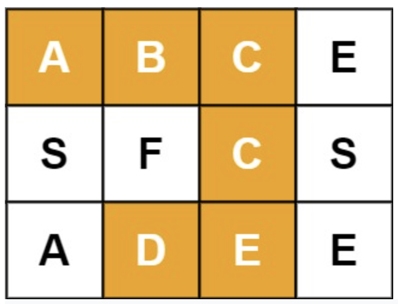




> Question



* Given an m x n grid of characters board and a string word, return true if word exists in the grid

```txt
Input: board = [["A","B","C","E"],["S","F","C","S"],["A","D","E","E"]], word = "ABCCED"
Output: true
```




```py
def exist(self, board: List[List[str]], word: str) -> bool:
  for r in range(len(board)):
    for c in range(len(board[0])):
      if self.search(board, r, c, word, 0):
        return True
  return False

def search(self, board, row, col, word, i):
  if i == len(word):
    return True
  if row < 0 or col < 0 or row >= len(board) or col >= len(board[0]) or board[row][col] != word[i]:
    return False
  char = board[row][col]
  board[row][col] = " "
  res = any(self.search(board, row + di, col + dj, word, i + 1) for di, dj in [(1, 0), (0, 1), (-1, 0), (0, -1)])
  board[row][col] = char
  return res
```



