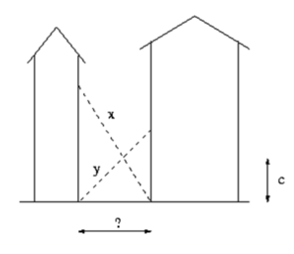




> Question



* Given x, y, c print ?

```txt
Input: 30 40 10
Output: 26.033
```




```py
a, b, c = map(float, input().split())
c, l, r = 1 / c, 0, min(a, b)
for _ in range(999):
  m = (l + r) / 2
  if 1 / (a * a - m * m) ** 0.5 + 1 / (b * b - m * m) ** 0.5 < c:
    l = m
  else:
    r = m
print(round(m,3))
```



