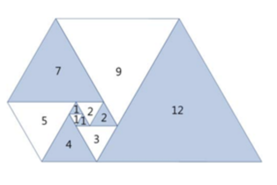
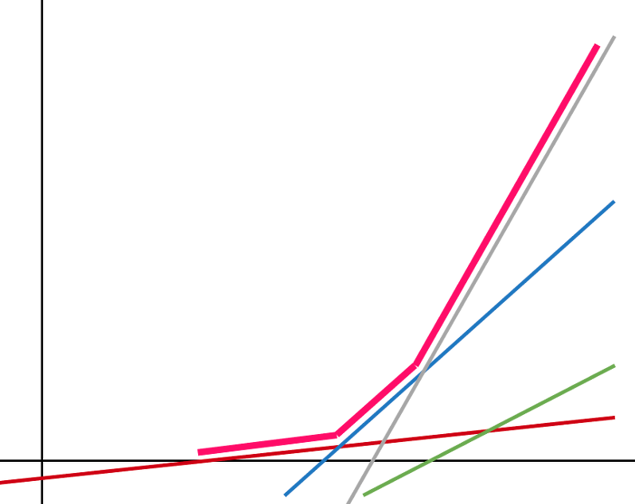
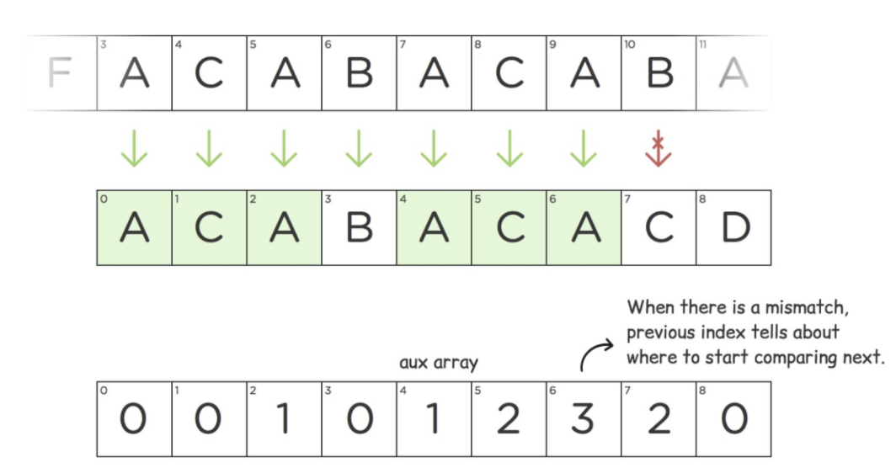
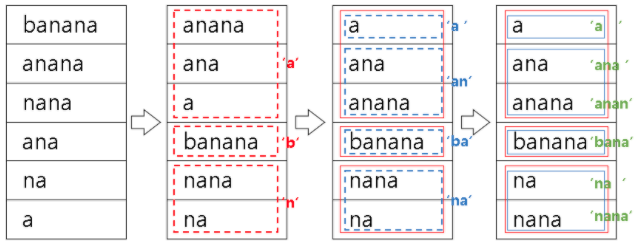

# Dynamic Programming

* an optimization problem on DAGs
* Each subproblem is a vertex and there is a directed edge from u to v that is used to calculate v

* Q. Given a target find minimum / maximum, cost / path / sum to reach the target
* A. Choose min / max among all possible paths before current state, then add value for current state

## Dimension 0

> baekjoon

* [Level 8 : 2×n 타일링 2](http://acmicpc.net/problem/11727)
  * [Update solution](https://github.com/seanhwangg/algorithm/edit/main/method/dynamic-programming/dimension-0/BJ_11727.md)




> Question

* Find number of ways to fill a rectangle using 1x2, 2x1, and 2x2 tiles MOD 10007

```txt
Input: 2
Output: 3
```




```py
a = b = 1
for _ in range(int(input())):
  a, b = b, a * 2 + b
print(a % 10007)
```




* [Level 8 : 계단 오르기](http://acmicpc.net/problem/2579)
  * [Update solution](https://github.com/seanhwangg/algorithm/edit/main/method/dynamic-programming/dimension-0/BJ_2579.md)




> Question

* You cannot step three consecutive coins
* Print maximum coin you can get when you must eat the last coin

```txt
Input:
6
10
20
15
25
10
20

Output: 75
```




```py
a = b = c = 0
for i in range(int(input())):
  n = input()
  a, b, c = max(b, c), a + n, b + n
print(max(b,c))
```




* [Level 9 : 스티커](http://acmicpc.net/problem/9465)
  * [Update solution](https://github.com/seanhwangg/algorithm/edit/main/method/dynamic-programming/dimension-0/BJ_9465.md)




> Question

* Given two lists, find maximum sum points when you cannot take two adjacent coin

```txt
Input:
2
5
50 10 100 20 40
30 50 70 10 60
7
10 30 10 50 100 20 40
20 40 30 50 60 20 80

Output:
260
290
```




```py
for _ in range(int(input())):
  n = int(input())
  A = [list(map(int,input().split())) for _ in range(2)]
  top, down, no = 0, 0, 0
  for i in range(n):
    top, down, no = max(down, no) + A[0][i], max(top, no) + A[1][i], max(top, down)]
  print(max(dp))
```




* [Level 10 : 암호코드](http://acmicpc.net/problem/2011)
  * [Update solution](https://github.com/seanhwangg/algorithm/edit/main/method/dynamic-programming/dimension-0/BJ_2011.md)




> Question

* Given string encoding with (A - 1, B - 2 ..)
* Find the number of ways to decode number

```txt
Input: 25114
Output: 6
```




```py
a, b, p = 1, 0, '0'
for c in input():
  a, b, p = (a if int(c) else 0) + (b if 9 < int(p+c) < 27 else 0), a, c
  if not a:
    break
print(a % 10 ** 6)
```




* [Level 10 : 포도주 시식](http://acmicpc.net/problem/2156)
  * [Update solution](https://github.com/seanhwangg/algorithm/edit/main/method/dynamic-programming/dimension-0/BJ_2156.md)




> Question

* You cannot step three consecutive coins
* Print maximum coin you can get

```txt
Input:
6
6
10
13
9
8
1

Output: 33
```




```py
a, b, c = 0, 0, 0
for i in range(int(input())):
  w = int(input())
  a, b, c = max(a, b, c), a + w, b + w
print(max(a,b,c))
```




* [Level 10 : RGB거리](http://acmicpc.net/problem/1149)
  * [Update solution](https://github.com/seanhwangg/algorithm/edit/main/method/dynamic-programming/dimension-0/BJ_1149.md)




> Question

* Cost for paint red, green, blue are given
* Find minimum cost to paint all houses
* colors should be different weight neighbor

```txt
Input:
3
26 40 83
49 60 57
13 89 99

Output: 96
```




```py
R = G = B = 0
for i in range(int(input())):
  r, g, b = map(int, input().split())
  R, G, B = min(G,B) + r, min(R,B) + g, min(R,G) + b
print min(R,G,B)
```




* [Level 10 : 쉬운 계단 수](http://acmicpc.net/problem/10844)
  * [Update solution](https://github.com/seanhwangg/algorithm/edit/main/method/dynamic-programming/dimension-0/BJ_10844.md)




> Question

* Count number of digits where different with adjacent is 1

```txt
Input:
Output:
```




```py
a = b = c = d = e = 1
for _ in range(int(input()) - 1):
  a, b, c, d, e = b, a + c, b + d, c + e, d + e
print((a + 2 * (b + c + d + e)) % 10 ** 9)
```




> leetcode

* [Level Easy : Best Time to Buy and Sell Stock](https://leetcode.com/problems/best-time-to-buy-and-sell-stock)
  * [Update solution](https://github.com/seanhwangg/algorithm/edit/main/method/dynamic-programming/dimension-0/LC_121.md)




> Question

* maximize profit by choosing a single day to buy one stock and choosing a different day in the future to sell that stock

```txt
Input: prices = [7,1,5,3,6,4]
Output: 5  # Buy on day 2 (price = 1) and sell on day 5 (price = 6), profit = 6-1 = 5.
```




```java
public int maxProfit(int[] prices) {
  if (prices.length < 2)  return 0;
  int maxProfit = 0, min = prices[0];
  for (int i = 1; i < prices.length; i++){
    if (min > prices[i]) min = prices[i];
    else maxProfit = prices[i] - min > maxProfit? prices[i] - min: maxProfit;
  }
  return maxProfit;
}
```




* [Level Easy : Min Cost Climbing Stairs](https://leetcode.com/problems/min-cost-climbing-stairs)
  * [Update solution](https://github.com/seanhwangg/algorithm/edit/main/method/dynamic-programming/dimension-0/LC_746.md)




> Question

* Given an integer array cost where cost[i] is the cost of ith step on a staircase
* Once you pay the cost, you can either climb one or two steps
* Minimize the cost

```txt
Input: cost = [10,15,20]
Output: 15
```




```cpp
int minCostClimbingStairs(vector<int>& cost) {
  int two_behind = cost[0], one_behind = cost[1];
  for (int i = 2; i < cost.size(); i++){
    int temp = one_behind;
    one_behind = min(two_behind, one_behind) + cost[i];
    two_behind = temp;
  }
  return min(one_behind, two_behind);
}
```




* [Level Medium : House Robber](https://leetcode.com/problems/house-robber)
  * [Update solution](https://github.com/seanhwangg/algorithm/edit/main/method/dynamic-programming/dimension-0/LC_198.md)




> Question

* Each house has a certain amount of money stashed
* adjacent houses have security systems connected
* automatically contact the police if two adjacent houses were broken into on the same night

```txt
Input: nums = [1,2,3,1]
Output: 4
```




```java
public int rob(int[] nums) {
  if (nums.length == 0)   return 0;

  int N_best = 0, Y_best = nums[0];

  for (int i = 1; i < nums.length; i++){
    int temp = N_best;
    N_best = Math.max(N_best, Y_best);
    Y_best = temp + nums[i];
  }
  return Math.max(N_best, Y_best);
}
```




* [Level Medium : Best Time to Buy and Sell Stock with Transaction Fee](https://leetcode.com/problems/best-time-to-buy-and-sell-stock-with-transaction-fee)
  * [Update solution](https://github.com/seanhwangg/algorithm/edit/main/method/dynamic-programming/dimension-0/LC_714.md)




> Question

* an array prices where prices[i] is price of a given stock on ith day, and an integer fee representing a transaction fee
* Find maximum profit you can achieve
* You may complete as many transactions as you like, but you need to pay transaction fee for each transaction

```txt
Input: prices = [1,3,2,8,4,9], fee = 2
Output: 8
```




```py
def maxProfit(self, prices, fee):
  cash, hold = 0, -prices[0]
  for i in range(1, len(prices)):
    cash = max(cash, hold + prices[i] - fee)
    hold = max(hold, cash - prices[i])
  return cash
```




* [Level Medium : Best Time to Buy and Sell Stock with Cooldown](https://leetcode.com/problems/best-time-to-buy-and-sell-stock-with-cooldown)
  * [Update solution](https://github.com/seanhwangg/algorithm/edit/main/method/dynamic-programming/dimension-0/LC_309.md)




> Question

* Given an array prices where prices[i] is the price of a given stock on the ith day
* Find maximum profit can achieve
* You may complete as many transactions as you like (i.e., buy one and sell one share of the stock multiple times)
* After you sell your stock, you cannot buy stock on the next day (i.e., cooldown one day)

```txt
Input: prices = [1,2,3,0,2]
Output: 3
```




```cpp
int maxProfit(vector<int>& prices) {
  if (prices.size() == 0) return 0;
  int cool = 0, nocool = 0, buy = -prices[0];
  for (int i = 1; i < prices.size(); i++){
    buy = max(nocool - prices[i], buy);
    nocool = max(nocool, cool);
    cool = buy + prices[i];
  }
  return max(cool, nocool);
}
```




## Dimension 1

> baekjoon

* [Level 6 : Four Squares](http://acmicpc.net/problem/17626)
  * [Update solution](https://github.com/seanhwangg/algorithm/edit/main/method/dynamic-programming/dimension-1/BJ_17626.md)




> Question

* Given N, find minimum number of squares to generate N

```txt
Input: 25
Output: 1
```




```py
n = int(input())
dp = [0] + [float('inf')] * n
for n in range(n + 1):
  for root in range(int(n ** 0.5 + 1)):
    dp[n] = min(dp[n], dp[n - root ** 2] + 1)
print(dp[-1])
```




* [Level 7 : 연속부분최대곱](http://acmicpc.net/problem/2670)
  * [Update solution](https://github.com/seanhwangg/algorithm/edit/main/method/dynamic-programming/dimension-1/BJ_2670.md)




> Question

* When there are N mistakes, find where the product of one or more consecutive numbers is maximum, and print the product

```txt
Input:
8
1.1
0.7
1.3
0.9
1.4
0.8
0.7
1.4

Output: 1.638   # 1.3 * 0.9 * 1.4
```




```py
n = int(input())
li = [float(input()) for _ in range(n)]
dp = []
for n in li:
  if len(dp) and dp[-1] > 1:
    dp.append(dp[-1] * n)
  else:
    dp.append(n)
print(f"{max(dp):.3f}")
```




* [Level 8 : 제곱수의 합](http://acmicpc.net/problem/1699)
  * [Update solution](https://github.com/seanhwangg/algorithm/edit/main/method/dynamic-programming/dimension-1/BJ_1699.md)




> Question

* Find minimum square number that sums to N

```txt
Input: 7
Output: 4  # 4 + 1 + 1 + 1
```




```py
n = int(input())
dp = [0]*(n+1)
for i in range(1, n+1):
  dp[i] = i
  j = 1
  while j*j <= i:
    if dp[i] > dp[i-j*j]+1:
      dp[i] = dp[i-j*j]+1
    j += 1
print(dp[n])
```




* [Level 8 : 1, 2, 3 더하기](http://acmicpc.net/problem/9095)
  * [Update solution](https://github.com/seanhwangg/algorithm/edit/main/method/dynamic-programming/dimension-1/BJ_9095.md)




> Question

* Given an integer n, find the number of ways to represent n as the sum of 1, 2, and 3

```txt
Input:
3
4
7
10

Output:
7
44
274
```




```py
dp = [1, 1, 2]
for n in range(3, 11):
  dp.append(dp[n-1] + dp[n-2] + dp[n-3])
for i in range(int(input())):
  print(dp[int(input())])
```




* [Level 8 : 파도반 수열](http://acmicpc.net/problem/9461)
  * [Update solution](https://github.com/seanhwangg/algorithm/edit/main/method/dynamic-programming/dimension-1/BJ_9461.md)




> Question



* Find length of Nth triangle

```txt
Input:
2
6
12

Output:
3
6
```




```py
N = int(input())
dp = [0, 1, 1]
for i in range(2, 102):
  dp.append(dp[-1] + dp[-3])

for _ in range(N):
  print(dp[int(input())])
```




* [Level 10 : 타일 채우기](http://acmicpc.net/problem/2133)
  * [Update solution](https://github.com/seanhwangg/algorithm/edit/main/method/dynamic-programming/dimension-1/BJ_2133.md)




> Question

* Count number of ways to fill 3 x N tile using 2 x 1 and 1 x 2

```txt
Input: 2
Output: 3
```




```py
L = [1,0,3] + [0] * 40
for i in range(4,40,2):
  L[i] = 4 * L[i-2] - L[i-4]
print(L[int(input())])
```




* [Level 10 : 동전 2](http://acmicpc.net/problem/2294)
  * [Update solution](https://github.com/seanhwangg/algorithm/edit/main/method/dynamic-programming/dimension-1/BJ_2294.md)




> Question

* There are n kinds of coins. use these coins in moderation so that the sum of the coins is k won
* In doing so, we try to minimize the number of coins

```txt
Input:
3 15
1
5
12

Output: 3
```




```py
n, k = map(int, input().split())

memo = [0] + [10001] * k
for _ in range(n):
  coin = int(input())
  for i in range(coin, k + 1):
    memo[i] = min(memo[i], memo[i - coin] + 1)
print(memo[k] if memo[k] != 10001 else -1)
```




* [Level 10 : 전깃줄](http://acmicpc.net/problem/2565)
  * [Update solution](https://github.com/seanhwangg/algorithm/edit/main/method/dynamic-programming/dimension-1/BJ_2565.md)




> Question

* Print minimum number of lines you have to remove so that no line are crossing each other

```txt
Input:
8
1 8
3 9
2 2
4 1
6 4
10 10
9 7
7 6

Output: 3
```




```py
N = int(input())
arr = [list(map(int, input().split())) for _ in range(N)]
arr.sort(key=lambda  x: x[0])
dp = [0] * 501
for s, d in arr:
  dp[d] = max(dp[:d]) + 1
print(N - max(dp))
```




> leetcode

* [Level Medium : Coin Change](https://leetcode.com/problems/coin-change)
  * [Update solution](https://github.com/seanhwangg/algorithm/edit/main/method/dynamic-programming/dimension-1/LC_322.md)




> Question

* Given an coins representing coins of different denominations and an integer amount representing a total amount of money
* Return fewest # coins that you need to make up that amount. If cannot be made up by any combination of coins, return -1

```txt
Input: coins = [1,2,5], amount = 11
Output: 3
```




```cpp
int coinChange(vector<int>& coins, int amount) {
  sort(coins.begin(), coins.end());
  vector<int> dp(amount + 1, -1);
  dp[0] = 0;
  for (int i = 1; i <= amount; i++){
    int temp = INT_MAX;
    for (int coin: coins){
      if (coin > i) break;
      temp = min(temp, (dp[i - coin] == -1? temp: dp[i - coin] + 1));
    }
    dp[i] = (temp != INT_MAX? temp: -1);
  }
  return dp[amount];
}
```




## Dimension 2

> baekjoon

* [Level 0 : Fast Food](http://acmicpc.net/problem/6309)
  * [Update solution](https://github.com/seanhwangg/algorithm/edit/main/method/dynamic-programming/dimension-2/BJ_6309.md)




> Question

* Given number of depots and stores, find minimum total costs to all depots

$$ \sum_{i=1}^{n} \mid d_{i}-(\text { position of depot serving restaurant i }) $$

```txt
Input:
6 3
5
6
12
19
20
27
0 0

Output:
Chain 1
Depot 1 at restaurant 2 serves restaurants 1 to 3
Depot 2 at restaurant 5 serves restaurants 4 to 5
Depot 3 at restaurant 6 serves restaurant 6
Total distance sum = 8
```




```cpp
#include <stdio.h>
#include <string.h>

int n, m, num[205], sum[205], way[205][205];
int dis[205][205];
int dp[205][205];

void print(int i, int j) {
  int t = way[i][j];
  if (i > 1)
    print(i - 1, t);
  if (t + 1 != j)
    printf("Depot %d at restaurant %d serves restaurants %d to %d\n", i, (t + 1 + j)/2, t + 1, j);
  else
    printf("Depot %d at restaurant %d serves restaurant %d\n", i, (t + 1 + j)/2, t + 1);
}
int main() {
  int t = 1;
  while (~scanf("%d%d", &n, &m) && n || m) {
    memset(sum, 0, sizeof(sum));
    memset(way, 0, sizeof(way));
    for (int i = 1; i <= m; i ++)
      for (int j = 1; j <= n; j ++)
        dp[i][j] =  999999999;
    for (int i = 1; i <= n; i ++) {
      scanf("%d", &num[i]);
      sum[i] = sum[i - 1] + num[i];
    }
    for (int i = 1; i <= n; i ++) {
      for (int j = 1; j <= n; j ++) {
        int mid = (i + j)/2;
        dis[i][j] = (mid - i) * num[mid] - (sum[mid - 1] - sum[i - 1]);
        dis[i][j] += (sum[j] - sum[mid]) - (j - mid) * num[mid];
      }
    }
    for (int i = 1; i <= n; i ++)
      dp[1][i] = dis[1][i];
    for (int i = 2; i <= m; i ++) {
      for (int j = 1; j <= n; j ++) {
        for (int k = i - 1; k < j; k ++) {
          if (dp[i][j] > dp[i - 1][k] + dis[k + 1][j]) {
            dp[i][j] = dp[i - 1][k] + dis[k + 1][j];
            way[i][j] = k;
          }
        }
      }
    }
    printf("Chain %d\n", t ++);
    print(m, n);
    printf("Total distance sum = %d\n", dp[m][n]);
  }
  return 0;
}
```




```py
for n_test in range(100000):
  n_store, n_depot = map(int, input().split())
  if n_store == n_depot == 0:
    break
  stores = [int(input()) for _ in range(n_store)]
  costs = [[0] * n_store for _ in range(n_store)] # to embrace i to j
  dp = [[10000] * n_store for _ in range(n_depot)]
  for i in range(n_store):
    for j in range(i, n_store):
      for k in range(i, j + 1):
        costs[i][j] += abs(stores[k] - stores[(i + j) // 2])
  dp[0] = costs[0]
  for i in range(1, n_depot):
    for j in range(i, n_store):
      for k in range(i - 1, j):
        dp[i][j] = min(dp[i][j], dp[i - 1][k] + costs[k + 1][j]);
  print(*dp, sep="\n")
  print(f"Chain {n_test}")
```




* [Level 7 : 퇴사](http://acmicpc.net/problem/14501)
  * [Update solution](https://github.com/seanhwangg/algorithm/edit/main/method/dynamic-programming/dimension-2/BJ_14501.md)




> Question

* Given finish time Ti and profit Pi, maximize profit

```txt
Input:
7
3 10
5 20
1 10
1 20
2 15
4 40
2 200

Output: 45
```




```py
n = int(input())
t = []
p = []
dp = []
for i in range(n):
  a, b = map(int, input().split())
  t.append(a)
  p.append(b)
  dp.append(b)
dp.append(0)
for i in range(n - 1, -1, -1):
  if t[i] + i > n:
    dp[i] = dp[i + 1]
  else:
    dp[i] = max(dp[i + 1], p[i] + dp[i + t[i]])
print(dp[0])
```




* [Level 9 : 점프 점프](http://acmicpc.net/problem/11060)
  * [Update solution](https://github.com/seanhwangg/algorithm/edit/main/method/dynamic-programming/dimension-2/BJ_11060.md)




> Question

* Ai or less may jump at once to the right-hand side
* It's at the far left of the maze, and I'm going to the far right
* Find out how many jumps you have to make to get there. If you can't get to the far right, print -1

```txt
Input:
10
1 2 0 1 3 2 1 5 4 2

Output: 5
```




```py
input()
li = list(map(int, input().split()))
dp = [0] + [1000] * (len(li) - 1)
for i in range(len(li)):
  for step in range(1, li[i] + 1):
    if i + step < len(dp):
      dp[i + step] = min(dp[i + step], dp[i] + 1)

print(dp[-1] if dp[-1] < 1000 else -1)
```




* [Level 13 : 행렬 곱셈 순서](http://acmicpc.net/problem/11049)
  * [Update solution](https://github.com/seanhwangg/algorithm/edit/main/method/dynamic-programming/dimension-2/BJ_11049.md)




> Question

* Maximize matrix multiplication reorder

```txt
Input:
3
5 3
3 2
2 6

Output: 90
```




```py
n = int(input())
s = [list(map(int, input().split())) for i in range(n)]
dp = [[0] * n for i in range(n)]
for i in range(1, n):
  for j in range(n - i):
    x = j + i
    dp[j][x] = 2 ** 32
    for k in range(j, x):
      dp[j][x] = min(dp[j][x], dp[j][k] + dp[k + 1][x] + s[j][0] * s[k][1] * s[x][1])
print(dp[0][-1])
```




* [Level 18 : 같은 탑](http://acmicpc.net/problem/1126)
  * [Update solution](https://github.com/seanhwangg/algorithm/edit/main/method/dynamic-programming/dimension-2/BJ_1126.md)




> Question

* A tower can be built by placing another block on top of the block
* At this time, two pagodas were made, and the two towers were to be the same height and as high as possible
* Each tower contains at least one block, and you don't have to write all the blocks
* When given the height of each block, print out the maximum height of the tower you can make

```txt
Input:
3
2 3 5

Output: 5
```




```py
n = int(input())
li = list(map(int, input().split()))
dp = [[-1] * (500001) for _ in range(n + 1)]
dp[0][0] = 0
for i, h in enumerate(li):
  for d in range(500001):
    dp[i + 1][d] = dp[i][d]
    if d >= h and dp[i][d - h] != -1:
      dp[i + 1][d] = max(dp[i + 1][d], dp[i][d - h] + h)
    if h >= d and dp[i][h - d] != -1:
      dp[i + 1][d] = max(dp[i + 1][d], dp[i][h - d] + d)
    if d + h <= 500000 and dp[i][d + h] != -1:
      dp[i + 1][d] = max(dp[i + 1][d], dp[i][d + h])

print(-1 if dp[n][0] == 0 else dp[n][0])
```




* [Level 22 : Kangaroo](http://acmicpc.net/problem/13188)
  * [Update solution](https://github.com/seanhwangg/algorithm/edit/main/method/dynamic-programming/dimension-2/BJ_13188.md)




> Question

* in N grid, you can go left and right alternatively
* Count number of ways to go from start to end

```txt
Input: 4 2 3
Output: 2  # 2 -> 1 -> 4 -> 3 / 2 -> 4 -> 1 -> 3
```




```cpp
#include <bits/stdc++.h>
long long dp[2010][2010],mod=1000000007;
int main() {
  int i, j,T=0;
  int n, s, e; cin >> n >> s >> e;
  dp[0][0]=1;
  for(i=1;i<=n;i++) {
    for(j=1;j<=n;j++) {
      if(i==s||i==e) dp[i][j]=(dp[i-1][j]+dp[i-1][j-1])%mod;
      else           dp[i][j]=(dp[i-1][j+1]*j+dp[i-1][j-1]*(j-T))%mod;
    }
    if(i==s||i==e) T++;
  }
  printf("%lld", dp[n][1]);
}
```




> codeforces

* [Level 1800 : Armchairs](https://codeforces.com/problemset/problem/1525/D)
  * [Update solution](https://github.com/seanhwangg/algorithm/edit/main/method/dynamic-programming/dimension-2/CF_1525D.md)




> Question

* pring minimum sum of distance so that every 1 is moved to 0

```txt
Input:
6
1 1 1 0 0 0

Output: 9
```

> Solution

* starting position of people $$ x_1, ..., x_k $$ must match with $$ y_1, ..., y_k $$ in sorted order
* dp[i][j] is min time if we considered i first positions and picked j of them as ending ones




```py
input()
a = list(map(int,input().split()))
b0 = [i for i, n in enumerate(li) if n == 0]
b1 = [i for i, n in enumerate(li) if n == 1]
dp=[[10 **10] * (len(b1) + 1) for i in range(len(b0) + 1)]
dp[0][0] = 0
for i in range(len(b0)):
  for j in range(len(b1)):
    dp[i + 1][j] = min(dp[i + 1][j], dp[i][j])
    dp[i + 1][j + 1] = min(dp[i + 1][j + 1], dp[i][j] + abs(b0[i] - b1[j]))
print(min([dp[i][len(b1)] for i in range(len(b0) + 1)]))
```




> leetcode

* [Level Medium : House Robber II](https://leetcode.com/problems/house-robber-ii)
  * [Update solution](https://github.com/seanhwangg/algorithm/edit/main/method/dynamic-programming/dimension-2/LC_213.md)




> Question

* Each house, in circle, has a certain amount of money stashed
* Adjacent houses have security systems connected and it will automatically contact police
  * if two adjacent houses were broken into on same night
* Maximize amount of money you can rob

```txt
Input: nums = [1,2,3,1]
Output: 4  # Rob house 1 (money = 1) and then rob house 3 (money = 3).
```




```cpp
int rob(vector<int>& nums) {
  int n = nums.size();
  if (n < 2) return n ? nums[0] : 0;
  return max(robber(nums, 0, n - 2), robber(nums, 1, n - 1));
}
int robber(vector<int>& nums, int l, int r) {
  int pre = 0, cur = 0;
  for (int i = l; i <= r; i++) {
    int temp = max(pre + nums[i], cur);
    pre = cur;
    cur = temp;
  }
  return cur;
}
```




* [Level Hard : Best Time to Buy and Sell Stock IV](https://leetcode.com/problems/best-time-to-buy-and-sell-stock-iv)
  * [Update solution](https://github.com/seanhwangg/algorithm/edit/main/method/dynamic-programming/dimension-2/LC_188.md)




> Question

* Given an integer array prices where prices[i] is the price of a given stock on the ith day, and an integer k
* Find the maximum profit you can achieve. You may complete at most k transactions
* You may not engage in multiple transactions simultaneously (i.e., you must sell the stock before you buy again)

```txt
Input: k = 2, prices = [3,2,6,5,0,3]
Output: 7  #  Buy on day 2 and sell on day 3, profit = 4. Then buy on day 5 and sell on day 6, profit 3
```




```cpp
int maxProfit(int N, vector<int>& v) {
  int M = v.size();
  N = min(N, M / 2);
  if (M == 0) return 0;
  vector<vector<int>> dp(N + 1, vector<int>(M));
  for (int i = 1; i <= N; i++) {
    int mx = -v[0];
    for (int j = 1; j < M; j++) {
      dp[i][j] = max(dp[i][j - 1], mx + v[j]);
      mx = max(mx, dp[i - 1][j - 1] - v[j]);
    }
  }
  return dp[N][M - 1];
}
```




```py
# O(kn)
def maxProfit(self, k, prices):
  if not prices:
    return 0
  profits = [0]*len(prices)
  for j in range(k):
    preprofit = 0
    for i in range(1,len(prices)):
      profit = prices[i] - prices[i-1]
      preprofit = max(preprofit+profit, profits[i])
      profits[i] = max(profits[i-1], preprofit)
  return profits[-1]
```




* [Level Hard : Best Time to Buy and Sell Stock III](https://leetcode.com/problems/best-time-to-buy-and-sell-stock-iii)
  * [Update solution](https://github.com/seanhwangg/algorithm/edit/main/method/dynamic-programming/dimension-2/LC_123.md)




> Question

* Find the maximum profit you can achieve. You may complete at most two transactions
* cannot engage in multiple transactions simultaneously (i.e., you must sell the stock before you buy again)

```txt
Input: prices = [3,3,5,0,0,3,1,4]
Output: 6
```




```cpp
int maxProfit(vector<int>& v, int N = 2) {
  int M = v.size();
  if (M == 0) return 0;
  vector<vector<int>> dp(N + 1, vector<int>(M));
  for (int i = 1; i <= N; i++) {
    int mx = -v[0];
    for (int j = 1; j < M; j++) {
      dp[i][j] = max(dp[i][j - 1], mx + v[j]);
      mx = max(mx, dp[i - 1][j - 1] - v[j]);
    }
  }
  return dp[N][M - 1];
}
```




### Dimension 2 Area

> baekjoon

* [Level 5 : 2차원 배열의 합](http://acmicpc.net/problem/2167)
  * [Update solution](https://github.com/seanhwangg/algorithm/edit/main/method/dynamic-programming/dimension-2-area/BJ_2167.md)




> Question

* Given grid, sum all elements from (i, j) to (x, y)

```txt
Input:
2 3
1 2 4
8 16 32
3
1 1 2 3
1 2 1 2
1 3 2 3

Output:
63
2
36
```




```py
n, m = map(int, input().split())
G = [list(map(int, input().split())) for _ in range(n)]

dp = [[0] * (m + 1) for _ in range(n + 1)]
for i in range(n):
  for j in range(m):
    dp[i + 1][j + 1] = dp[i + 1][j] + dp[i][j + 1] - dp[i][j] + G[i][j]
q = int(input())
for _ in range(q):
  i, j, x, y = map(int, input().split())
  print(dp[x][y] - dp[x][j - 1] - dp[i - 1][y] + dp[i - 1][j - 1])
```




* [Level 8 : 1로 만들기](http://acmicpc.net/problem/1463)
  * [Update solution](https://github.com/seanhwangg/algorithm/edit/main/method/dynamic-programming/dimension-2-area/BJ_1463.md)




> Question

* Divide by 3 or 2 (only divisible) or subtract 1
* Find minimum operation

```txt
Input: 10
Output: 3
```




```py
n = int(input()) + 1
d = [0] * n
for i in range(2,n):
  d[i] = min(d[i // 2] + i % 2, d[i // 3] + i % 3) + 1
print(d[-1])
```




* [Level 9 : To the Max](http://acmicpc.net/problem/6374)
  * [Update solution](https://github.com/seanhwangg/algorithm/edit/main/method/dynamic-programming/dimension-2-area/BJ_6374.md)




> Question

* Given square 2D array, find maximum 2d rectangle sum

```txt
Input:
4
0 -2 -7 0 9 2 -6 2
-4 1 -4 1 -1

8 0 -2

Output: 15  # 9 2 / -4 1 / -1 8
```




```cpp
#include <stdio.h>
int map[200][200], b[200], cnt, max = -200;
int main() {
  int n, i, j, k;
  scanf("%d", &n);
  for (i = 1; i <= n; i++)
    for (j = 1; j <= n; j++) scanf("%d", &map[i][j]);

  for (i = 1; i <= n; i++) {
    for (j = 1; j <= n; j++) b[j] = 0;
    for (j = i; j <= n; j++) {
      cnt = 0;
      for (k = 1; k <= n; k++) {
        b[k] += map[k][j];
        cnt += b[k];
        if (max < cnt) max = cnt;
        if (cnt < 0) cnt = 0;
      }
    }
  }
  printf("%d", max);
  return 0;
}
```




* [Level 10 : 구간 합 구하기 5](http://acmicpc.net/problem/11660)
  * [Update solution](https://github.com/seanhwangg/algorithm/edit/main/method/dynamic-programming/dimension-2-area/BJ_11660.md)




> Question

* Print range sum of rectangle (x1, y1) to (x2, y2)

```txt
Input:
4 3
1 2 3 4
2 3 4 5
3 4 5 6
4 5 6 7
2 2 3 4
3 4 3 4
1 1 4 4

Output:
27
6
64
```




```py
import sys
m, n = map(int, input().split())
l = [[0]*(m + 1)] + [[0] + list(map(int, input().split())) for i in range(m)]
for i in range(1, m + 1):
  for j in range(1, m + 1):
    l[i][j] = (l[i - 1][j] + l[i][j - 1] + l[i][j] - l[i - 1][j - 1])
for j in range(n):
  a, b, x, y = map(int, sys.stdin.readline().split())
  print(l[x][y] - l[x][b - 1] - l[a - 1][y] + l[a - 1][b - 1])
```




* [Level 11 : 가장 큰 정사각형](http://acmicpc.net/problem/1915)
  * [Update solution](https://github.com/seanhwangg/algorithm/edit/main/method/dynamic-programming/dimension-2-area/BJ_1915.md)




> Question

* Print maximum square consists of only 1

```txt
Input:
4 4
0100
0111
1110
0010

Output: 4
```




```py
n, m = map(int, input().split())
G = [[int(x) for x in input()] for _ in range(n)]

for i in range(1, n):
  for j in range(1, m):
    if G[i][j]:
      G[i][j] += min((G[i-1][j-1], G[i][j-1], G[i-1][j]))

print(max(max(row) for row in G) ** 2)
```




* [Level 11 : 최대 정사각형](http://acmicpc.net/problem/4095)
  * [Update solution](https://github.com/seanhwangg/algorithm/edit/main/method/dynamic-programming/dimension-2-area/BJ_4095.md)




> Question

* Print maximum area of square consists of 1

```txt
Input:
4 5
0 1 0 1 1
1 1 1 1 1
0 1 1 1 0
1 1 1 1 1
3 4
1 1 1 1
1 1 1 1
1 1 1 1
6 6
0 0 0 0 0 0
0 0 0 0 0 0
0 0 0 0 0 0
0 0 0 0 0 0
0 0 0 0 0 0
0 0 0 0 0 0
0 0

Output:
3
3
0
```




```py
while True:
  n, m = map(int, input().split())
  if n + m == 0:
    break
  G = [[0] * (m+1)] + [[0] + [*map(int, input().split())] for i in range(n)]

  result = 0
  for i in range(1, n + 1):
    for j in range(1, m + 1):
      if G[i][j] == 1:
        G[i][j] = min(G[i-1][j-1],G[i][j-1],G[i-1][j])+1
      if result < G[i][j]:
        result = G[i][j]

  print(result)
```




* [Level 14 : Hilbert Sort](http://acmicpc.net/problem/11600)
  * [Update solution](https://github.com/seanhwangg/algorithm/edit/main/method/dynamic-programming/dimension-2-area/BJ_11600.md)




> Question

* Print sum between (x1, y1) to (x2, y2)

```txt
Input:
4 3
1 2 3 4
2 3 4 5
3 4 5 6
4 5 6 7
2 2 3 4
3 4 3 4
1 1 4 4

Output:
27
6
64
```




```py
import sys
input = sys.stdin.readline
m, n = map(int, input().split())
G = [[0] *(m + 1)]+ [[0] + list(map(int, input().split())) for i in range(m)]
for i in range(1, m+ 1):
  for j in range(1, m+ 1):
      G[i][j]= (G[i-1][j] + G[i][j - 1] + G[i][j] - G[i - 1][j - 1])
for j in range(n):
  a, b, x, y= map(int, input().split())
  print(G[x][y] - G[x][b - 1] - G[a - 1][y] + G[a - 1][b - 1])
```




* [Level 16 : 구간 합 구하기 3](http://acmicpc.net/problem/11658)
  * [Update solution](https://github.com/seanhwangg/algorithm/edit/main/method/dynamic-programming/dimension-2-area/BJ_11658.md)




> Question

* w, x, y, c
  * update G[x][y] = c
* w, x1, y1, x2, y2
  * print sum from (x1, y1) to (x2, y2)

```txt
Input:
4 5
1 2 3 4
2 3 4 5
3 4 5 6
4 5 6 7
1 2 2 3 4
0 2 3 7
1 2 2 3 4
0 3 4 5
1 3 4 3 4

Output:
27
30
5
```




```py
import sys
input = sys.stdin.readline
N, M = map(int, input().split())

G = [list(map(int, input().split())) for i in range(N)]

dp = [[0 for i in range(N + 1)] for j in range(N + 1)]
for i in range(N):
  for j in range(N):
    dp[i + 1][j + 1] = G[i][j] + dp[i + 1][j]
for i in range(M):
  line = input()
  if line[0] == '1':
    _, a, b, c, d = map(int, line.split())
    total = 0
    for i in range(a, c + 1):
      total += (dp[i][d] - dp[i][b-1])
    print(total)
  else:
    _, a, b, c = map(int, line.split())
    G[a - 1][b - 1] = c
    for j in range(b - 1, N):
      dp[a][j + 1] = G[a - 1][j] + dp[a][j]
```




* [Level 16 : 다이아몬드 광산](http://acmicpc.net/problem/1028)
  * [Update solution](https://github.com/seanhwangg/algorithm/edit/main/method/dynamic-programming/dimension-2-area/BJ_1028.md)




> Question

* Find biggest diamond

```txt
Input:
5 5
01100
01011
11111
01111
11111

Output: 3
```




```py
r, c = map(int, input().split())
G = [[int(c) for c in input()] for _ in range(r)]
rd = [G[i].copy() for i in range(r)]
ld = [G[i].copy() for i in range(r)]
ans = max(G[0])

for i in range(1, r):
  for j in range(c):
    if G[i][j]:
      rd[i][j] = rd[i - 1][j - 1] + 1 if j > 0 else rd[i][j]
      ld[i][j] = ld[i - 1][j + 1] + 1 if j < c - 1 else ld[i][j]
      t = min(rd[i][j], ld[i][j])
      ans = max(ans, *[a + 1 for a in range(t) if rd[i - a][j + a] > a and ld[i - a][j - a] > a])

print(ans)
```




* [Level 17 : 최대 직사각형](http://acmicpc.net/problem/11873)
  * [Update solution](https://github.com/seanhwangg/algorithm/edit/main/method/dynamic-programming/dimension-2-area/BJ_11873.md)




> Question

* Print maximum rectangle covered by 1

```txt
Input:
4 5
0 1 0 1 1
1 1 1 1 1
0 1 1 1 0
1 1 1 1 1
3 4
1 1 1 1
1 1 1 1
1 1 1 1
6 6
0 0 0 0 0 0
0 0 0 0 0 0
0 0 0 0 0 0
0 0 0 0 0 0
0 0 0 0 0 0
0 0 0 0 0 0
0 0

Output:
9
12
0
```




```py
input = __import__('sys').stdin.readline
while True:
  n,m = map(int,input().split())
  if n==0: break
  l = [[0]+list(map(int,input().split()))+[0] for i in range(n)]
  pre = 0
  for i in range(1, n):
    for j in range(1, m + 1):
      if l[i][j]: l[i][j] = l[i-1][j]+1
  ans = 0
  for i in range(n):
    ll = l[i]
    S = [0]
    for i in range(1,m+2):
      while S and ll[S[-1]]>ll[i]:
        h = ll[S[-1]]
        S.pop()
        ans = max(ans, (i-S[-1]-1)*h)
      S.append(i)
  print(ans)
```




* [Level 22 : HAPPINE](http://acmicpc.net/problem/11783)
  * [Update solution](https://github.com/seanhwangg/algorithm/edit/main/method/dynamic-programming/dimension-2-area/BJ_11783.md)




> Question

* Print largest rectangle consists of only 1

```txt
Input:
4 5
0 1 0 1 1
1 1 1 1 1
0 1 1 1 0
1 1 1 1 1
3 4
1 1 1 1
1 1 1 1
1 1 1 1
6 6
0 0 0 0 0 0
0 0 0 0 0 0
0 0 0 0 0 0
0 0 0 0 0 0
0 0 0 0 0 0
0 0 0 0 0 0
0 0

Output:
9
12
0
```




```py
input = __import__('sys').stdin.readline
while True:
  n, m = map(int,input().split())
  if n==0: break
  G = [[0]+list(map(int,input().split()))+[0] for i in range(n)]
  pre = 0
  for i in range(1,n):
    for j in range(1,m+1):
      if G[i][j]: G[i][j] = G[i-1][j]+1
  ans = 0
  for i in range(n):
    li = G[i]
    stk = [0]
    for i in range(1,m+2):
      while stk and li[stk[-1]]>li[i]:
        h = li[stk[-1]]
        stk.pop()
        ans = max(ans, (i - stk[-1] - 1) *h)
      stk.append(i)
  print(ans)
```




> leetcode

* [Level Medium : Get Biggest Three Rhombus Sums in a Grid](https://leetcode.com/problems/get-biggest-three-rhombus-sums-in-a-grid)
  * [Update solution](https://github.com/seanhwangg/algorithm/edit/main/method/dynamic-programming/dimension-2-area/LC_1878.md)




> Question

* Given an m x n integer matrix grid​​​
* A rhombus sum is the sum of the elements that form the border of a regular rhombus shape in grid​​​
* The rhombus must have the shape of a square rotated 45 degrees with each of the corners centered in a grid cell

```txt
Input:
grid = [
  [3,4,5,1,3],
  [3,3,4,2,3],
  [20,30,200,40,10],
  [1,5,5,4,1],
  [4,3,2,2,5]]

Output: [228,216,211]
```




```py
def getBiggestThree(self, grid):
  m, n, heap = len(grid), len(grid[0]), []

  def update(heap, num):
    if num not in heap:
      heappush(heap, num)
      if len(heap) > 3: heappop(heap)
    return heap

  for num in chain(*grid): update(heap, num)

  @lru_cache(None)
  def dp(i, j, dr):
    if not 0 <= i < n or not 0 <= j < m: return 0
    return dp(i-1, j+dr, dr) + grid[j][i]

  for q in range(1, (1 + min(m, n))//2):
    for i in range(q, n - q):
      for j in range(q, m - q):
        p1 = dp(i + q, j, -1) - dp(i, j - q, -1)
        p2 = dp(i - 1, j + q - 1, -1) - dp(i - q - 1, j - 1, -1)
        p3 = dp(i, j - q, 1) - dp(i - q, j, 1)
        p4 = dp(i + q - 1, j + 1, 1) - dp(i - 1, j + q + 1, 1)
        update(heap, p1 + p2 + p3 + p4)

  return sorted(heap)[::-1]
```




* [Level Medium : Maximal Square](https://leetcode.com/problems/maximal-square)
  * [Update solution](https://github.com/seanhwangg/algorithm/edit/main/method/dynamic-programming/dimension-2-area/LC_221.md)




> Question

* Find largest square containing only 1's

```txt
Input: matrix = [["1","0","1","0","0"],["1","0","1","1","1"],["1","1","1","1","1"],["1","0","0","1","0"]]
Output: 4
```




```py
def maximalSquare(self, G):
  if len(G) == 0:
    return 0
  n, m, ret, flag = len(G), len(G[0]), 0, 0
  dp = [[0] * (m + 1) for _ in range(n + 1)]
  for i in range(n):
    for j in range(m):
      if G[i][j] == '1':
        dp[i + 1][j + 1] = min(dp[i + 1][j], dp[i][j], dp[i][j + 1]) + 1
        ret = max(ret, dp[i + 1][j + 1])

  return ret ** 2
  # with flag
  # for i in range(n):
  #     for j in range(m):
  #         if G[i][j] == '1':
  #             dp[flag][j + 1] = min(dp[flag][j], dp[flag ^ 1][j], dp[flag ^ 1][j + 1]) + 1
  #             ret = max(ret, dp[flag][j + 1])
  #         else:
  #             dp[flag][j + 1] = 0
  #     flag ^= 1
  ```




### Dimension 2 Path

* Choose min(max) path among all possible paths before the current state, then add value for the current state
  * routes[i] = min(routes[i-1], routes[i-2], ... , routes[i-k]) + cost[i]

> baekjoon

* [Level 10 : 정수 삼각형](http://acmicpc.net/problem/1932)
  * [Update solution](https://github.com/seanhwangg/algorithm/edit/main/method/dynamic-programming/dimension-2-path/BJ_1932.md)




> Question

* Given maximum sum path when you can go down or down right

```txt
Input:
5
7
3 8
8 1 0
2 7 4 4
4 5 2 6 5

Output: 30
```




```js
let input = require('fs').readFileSync(0, 'utf-8').trim().split('\n');
let tri = input.slice(1).map(e => e.split(' ').map(e => +e));
const n = +input[0];
const dp = Array(n).fill(0).map((e, i) => Array(i + 1));
dp[0] = tri[0];
for (let i = 1; i < n; i++)
  for (let j = 0; j < i + 1; j++)
    dp[i][j] = Math.max(dp[i - 1][j] || 0, dp[i - 1][j - 1] || 0) + tri[i][j]
console.log(Math.max(...dp[n-1]));
```




```py
n=int(input())
G = [list(map(int,input().split())) for _ in range(n)]
for i in range(n - 2, -1, -1):
  for j in range(len(s[i])):
    s[i][j] += max(s[i + 1][j : j + 2])
print(s[0][0])
```




* [Level 10 : 이동하기](http://acmicpc.net/problem/11048)
  * [Update solution](https://github.com/seanhwangg/algorithm/edit/main/method/dynamic-programming/dimension-2-path/BJ_11048.md)




> Question

* Find maximum number of candy from (1, 1) to (N, M)

```txt
Input:
3 4
1 2 3 4
0 0 0 5
9 8 7 6

Output: 31
```




```py
n, m = map(int, input().split())
G = [list(map(int, input().split())) for _ in range(n)]
dp = [[0] * (m + 1) for i in range(n + 1)]
for i in range(1, n + 1):
  for j in range(1, m + 1):
    dp[i][j] = G[i - 1][j - 1] + max(dp[i - 1][j], dp[i][j - 1], dp[i - 1][j - 1])
print(dp[n][m])
```




* [Level 12 : 내려가기](http://acmicpc.net/problem/2096)
  * [Update solution](https://github.com/seanhwangg/algorithm/edit/main/method/dynamic-programming/dimension-2-path/BJ_2096.md)




> Question

* You can stay, or move left / right one block at a time
* Find maximum score moving down 2D map

```txt
Input:
3
1 2 3
4 5 6
4 9 0

Output: 18 6
```




```py
a, b, c = 0, 0, 0
A, B, C = 0, 0, 0
for i in range(int(input())):
  x, y, z = map(int, input().split())
  a, b, c = min(a, b) + x, min(a, b, c) + y, min(b, c) + z
  A, B, C = max(A, B) + x, max(A, B, C) + y, max(B, C) + z
print(max(A,B,C), min(a,b,c))
```




* [Level 15 : 달이 차오른다, 가자.](http://acmicpc.net/problem/1194)
  * [Update solution](https://github.com/seanhwangg/algorithm/edit/main/method/dynamic-programming/dimension-2-path/BJ_1194.md)




> Question

* Given map with following symbols, find minimum distance to escape
  * 0 : start position
  * 1 : goal position
  * lower_alphabet : key
  * upper_alphabet : door that requires its lower alphabet key
  * \# : wall
  * . : empty

```txt
Input:
7 8
a#c#eF.1
.#.#.#..
.#B#D###
0....F.1
C#E#A###
.#.#.#..
d#f#bF.1

Output: 55
```




```py
from collections import deque

N, M = map(int, input().split())
G = [list(input().strip()) for _ in range(N)]
dp = [[[0]*64 for _ in range(M)] for _ in range(N)]
q = deque()

for i in range(N):
  for j in range(M):
    if G[i][j] == '0':
      q.append((i, j, 0))

while q:
  x, y, k = q.popleft()
  if G[x][y] == '1':
    print(dp[x][y][k])
    return
  for dx, dy in [(-1, 0), (1, 0), (0, -1), (0, 1)]:
    nx, ny, nk = x + dx[i], y + dy[i], k
    if not (0 <= nx < N and 0 <= ny < M):
      continue
    c = G[nx][ny]
    if c.islower():
      nk |= (1<<(ord(c)-ord('a')))
    elif c.isupper() and not nk & (1<<(ord(c)-ord('a'))):
      continue
    if not dp[nx][ny][nk] and c != '#':
      q.append((nx, ny, nk))
      dp[nx][ny][nk] = dp[x][y][k] + 1
print(-1)
```




* [Level 15 : 로봇 조종하기](http://acmicpc.net/problem/2169)
  * [Update solution](https://github.com/seanhwangg/algorithm/edit/main/method/dynamic-programming/dimension-2-path/BJ_2169.md)




> Question

* Robot can move left, right, down, find maximum sum

```txt
Input:
5 5
10 25 7 8 13
68 24 -78 63 32
12 -69 100 -29 -25
-16 -22 -57 -33 99
7 -76 -11 77 15

Output:
319
```




```py
N, M = map(int, input().split())
G = [list(map(int, input().split())) for _ in range(N)]
S, dp = 0, []
for i in range(M):
  S += G[0][i]
  dp.append(S)

for j in range(1, N):
  L = [dp[0] + G[j][0]] + [0] * (M - 1)
  for i in range(1, M):
    L[i] = G[j][i] + max(L[i - 1], dp[i])
  R = [0] * (M - 1) + dp[-1] + G[j][-1]
  for i in range(1, M):
    R[-i-1] = G[j][-i-1] + max(R[-i], dp[-i-1])
  for i in range(M):
    dp[i] = max(L[i], R[i])
print(dp[-1])
```




> leetcode

* [Level Medium : Minimum Path Sum](https://leetcode.com/problems/minimum-path-sum)
  * [Update solution](https://github.com/seanhwangg/algorithm/edit/main/method/dynamic-programming/dimension-2-path/LC_64.md)




> Question

* find a path from top left to bottom right minimizes the sum

```txt
Input: grid = [[1,3,1],[1,5,1],[4,2,1]]
Output: 7
```




```py
def minPathSum(self, grid):
  r, c = len(grid), len(grid[0])
  dp = [[0 for _ in range(c)] for _ in range(r)]
  dp[0][0] = grid[0][0]
  for i in range(1, r):
    dp[i][0] = dp[i-1][0] + grid[i][0]
  for i in range(1, c):
    dp[0][i] = dp[0][i-1] + grid[0][i]
  for i in range(1, r):
    for j in range(1, c):
      dp[i][j] = min(dp[i-1][j], dp[i][j-1]) + grid[i][j]
  return dp[-1][-1]
```




* [Level Medium : Minimum Falling Path Sum](https://leetcode.com/problems/minimum-falling-path-sum)
  * [Update solution](https://github.com/seanhwangg/algorithm/edit/main/method/dynamic-programming/dimension-2-path/LC_931.md)




> Question

* Given 2D grid, find minium path sum
* (row, col) can go to (row + 1, col - 1), (row + 1, col), or (row + 1, col + 1)

```txt
Input: matrix = [[2,1,3],[6,5,4],[7,8,9]]
Output: 13
```




```py
def minFallingPathSum(self, A):
  dp = A[0]
  for row in A[1:]:
    dp = [value + min(dp[max(0, c - 1) : c + 2]) for c, value in enumerate(row)]
  return min(dp)
```




* [Level Hard : Dungeon Game](https://leetcode.com/problems/dungeon-game)
  * [Update solution](https://github.com/seanhwangg/algorithm/edit/main/method/dynamic-programming/dimension-2-path/LC_174.md)




> Question

* Return the knight's minimum initial health so that he can rescue the princess

```txt
Input: dungeon = [[-2,-3,3],[-5,-10,1],[10,30,-5]]
Output: 7
```




```py
def calculateMinimumHP(self, G: List[List[int]]) -> int:
  m, n = len(G), len(G[0])
  dp = [[float("inf")]*(n+1) for _ in range(m+1)]
  dp[m-1][n], dp[m][n-1] = 1, 1

  for i in range(m - 1, -1, -1):
    for j in range(n - 1, -1, -1):
      dp[i][j] = max(min(dp[i+1][j], dp[i][j+1]) - G[i][j], 1)

  return dp[0][0]
```




### Tabulation

> baekjoon

* [Level 10 : 1로 만들기 2](http://acmicpc.net/problem/12852)
  * [Update solution](https://github.com/seanhwangg/algorithm/edit/main/method/dynamic-programming/tabulation/BJ_12852.md)




> Question

* There are three operations available for integer X:
  * If X is divided by 3, divide by 3
  * If X is divided by 2, divide by 2
  * Subtract one
* Given an integer N, the three operations above are used appropriately to create 1
* Print out the minimum number of times you use an operation

```txt
Input: 10
Output:
3
10 9 3 1
```




```py
N = int(input())

result = [[0, []] for _ in range(N + 1)]
result[1] = (0, [1])

for i in range(2, N + 1):
  result[i][0] = result[i-1][0] + 1
  result[i][1] = result[i-1][1] + [i]

  if i % 3 == 0 and result[i//3][0] + 1 < result[i][0]:
    result[i][0] = result[i//3][0] + 1
    result[i][1] = result[i//3][1] + [i]

  if i % 2 == 0 and result[i//2][0] + 1 < result[i][0]:
    result[i][0] = result[i//2][0] + 1
    result[i][1] = result[i//2][1] + [i]

print(result[N][0])
print(*reversed(result[N][1]), sep=' ')
```




* [Level 12 : 부분합](http://acmicpc.net/problem/1806)
  * [Update solution](https://github.com/seanhwangg/algorithm/edit/main/method/dynamic-programming/tabulation/BJ_1806.md)




> Question

* A length N-shaped beard consisting of a natural number of 10,000 or less is given
* Find the length of the shortest number of subsets of successive numbers in this sequence, whose sum is greater than S

```txt
Input:
10 15
5 1 3 5 10 7 4 9 2 8

Output: 2
```




```py
N, s = map(int, input().split())
li = list(map(int, input().split()))
acc = [0]
for n in li:
  acc.append(acc[-1] + n)

mn_len = N
for i in range(N):
  lo, hi = i, N - 1
  if acc[hi + 1] - acc[i] < s:
    break
  while lo < hi:
    mi = (lo + hi) // 2
    if s <= acc[mi + 1] - acc[i]:
      hi = mi
    else:
      lo = mi + 1
  mn_len = min(mn_len, lo - i + 1)
print(0 if i == 0 else mn_len)
```




* [Level 13 : 짚신벌레](http://acmicpc.net/problem/2560)
  * [Update solution](https://github.com/seanhwangg/algorithm/edit/main/method/dynamic-programming/tabulation/BJ_2560.md)




> Question

* From the day bug become an adult, it duplicate everyday, from the day b after birth to death d
* new bug from day a to the day before day b, creating a total of b-a objects throughout their lifetime
* Find total bug modulo 1000




```cpp
#include <bits/stdc++.h>
using namespace std;

int main() {
  int a, b, d, n, ans = 1, sum = 0; cin >> a >> b >> d >> n;
  vector<int> cnt(n + 1);
  cnt[0] = 1;
  for (int i = 1; i <= n; i++) {
    if (i >= b) sum -= cnt[i - b] - 1000, sum %= 1000;
    if (i >= a) sum += cnt[i - a], sum %= 1000;
    cnt[i] = sum;
    ans += cnt[i];
    if (i >= d) ans -= cnt[i - d] - 1000, sum %= 1000;
  }
  cout << ans % 1000;
}
```




```py
from collections import deque
a, b, d, n = map(int, input().split())
lst = deque([1] + [0] * (d - 1))
for i in range(n):
  cnt = (cnt + lst[a-1] - lst[b-1]) % 1000
  lst.appendleft(cnt)
  lst.pop()
print(sum(lst) % 1000)
```




* [Level 15 : XOR 합 3](http://acmicpc.net/problem/13710)
  * [Update solution](https://github.com/seanhwangg/algorithm/edit/main/method/dynamic-programming/tabulation/BJ_13710.md)




> Question

* Find sum of all xor substring

```txt
Input:
2
1 2

Output: 6   # 1 + 2 + 3
```




```py
total = 0
input()
arr = list(map(int, input().split()))
for i in range(30):
  c_odd = 0
  odd = 0
  for j in range(len(arr)):
    if arr[j] & (1 << i) > 0:
      odd = ~odd
    if odd:
      c_odd += 1
  for j in range(len(arr)):
    total += (2 ** i) * c_odd
    if (arr[j] & (1 << i)) > 0:
      c_odd = len(arr) - j - c_odd
print(total)
```




> leetcode

* [Level Medium : Jump Game VII](https://leetcode.com/problems/jump-game-vii)
  * [Update solution](https://github.com/seanhwangg/algorithm/edit/main/method/dynamic-programming/tabulation/LC_1871.md)




> Question

* given a 0-indexed binary string s and two integers minJump and maxJump
* Starting at index 0, which is equal to '0', move from index i to index j if the following conditions are fulfilled:
  * i + minJump <= j <= min(i + maxJump, s.length - 1), and s[j] == '0'
* Return true if you can reach index s.length - 1 in s, or false otherwise

```txt
Input: s = "011010", minJump = 2, maxJump = 3
Output: true
```




```py
def canReach(self, s, minJ, maxJ):
  dp = [c == '0' for c in s]
  pre = 0
  for i in range(1, len(s)):
    if i >= minJ: pre += dp[i - minJ]
    if i > maxJ: pre -= dp[i - maxJ - 1]
    dp[i] &= pre > 0
  return dp[-1]
```




* [Level Medium : Product of Array Except Self](https://leetcode.com/problems/product-of-array-except-self)
  * [Update solution](https://github.com/seanhwangg/algorithm/edit/main/method/dynamic-programming/tabulation/LC_238.md)




> Question

* Given an integer array nums, return an array answer such that answer[i] is equal to product of all nums except nums[i]
* The product of any prefix or suffix of nums is guaranteed to fit in a 32-bit integer

```txt
Input: nums = [1,2,3,4]
Output: [24,12,8,6]
```




```cpp
vector<int> productExceptSelf(vector<int>& nums) {
  int n = nums.size();
  vector<int> prods(n, 1);
  for (int i = 1; i < n; i++) // product from left
    prods[i] = prods[i - 1] * nums[i - 1];

  for (int j = n - 1, m = 1; j >= 0; j--) {
    prods[j] *= m; // product from right
    m *= nums[j];
  }
  return prods;
}
```




* [Level Medium : Minimum Swaps To Make Sequences Increasing](https://leetcode.com/problems/minimum-swaps-to-make-sequences-increasing)
  * [Update solution](https://github.com/seanhwangg/algorithm/edit/main/method/dynamic-programming/tabulation/LC_801.md)




> Question

* We can swap elements A[i] and B[i]
* Find the minimum number of swaps so that A and B are both strictly increasing

```txt
Input: nums1 = [1,3,5,4], nums2 = [1,2,3,7]
Output: 1
```




```py
def minSwap(self, A, B):
  N = len(A)
  not_swap, swap = [N] * N, [N] * N
  not_swap[0], swap[0] = 0, 1
  for i in range(1, N):
    if A[i - 1] < A[i] and B[i - 1] < B[i]:
      swap[i] = swap[i - 1] + 1     # Swap at i - 1 and Swap at i
      not_swap[i] = not_swap[i - 1] # Stay at (i-1) and Stay at i,
    if A[i - 1] < B[i] and B[i - 1] < A[i]:
      swap[i] = min(swap[i], not_swap[i - 1] + 1) # Swap at i - 1 and stay at i
      not_swap[i] = min(not_swap[i], swap[i - 1]) # Stay at i - 1 and swap at i
  return min(swap[-1], not_swap[-1])
```




* [Level Medium : Ugly Number II](https://leetcode.com/problems/ugly-number-ii)
  * [Update solution](https://github.com/seanhwangg/algorithm/edit/main/method/dynamic-programming/tabulation/LC_264.md)




> Question

* Given an integer n, return the nth ugly number
* Ugly number is a positive number whose prime factors only include 2, 3, and/or 5

```txt
Input: n = 10
Output: 12 # [1, 2, 3, 4, 5, 6, 8, 9, 10, 12]
```




```cpp
int nthUglyNumber(int n) {
  vector<int> ugly(n, 1);
  int c2 = 2, c3 = 3, c5 = 5;
  int i2 = 0, i3 = 0, i5 = 0;
  for (int i=1; i<n; ++i) {
    int last = ugly[i] = min(c2, min(c3, c5));
    while (c2 <= last) c2 = 2 * ugly[++i2];
    while (c3 <= last) c3 = 3 * ugly[++i3];
    while (c5 <= last) c5 = 5 * ugly[++i5];
  }
  return ugly[n-1];
}
```




```py
def nthUglyNumber(self, n):
  ugly = [1]
  i2 = i3 = i5 = 0
  while len(ugly) < n:
    while ugly[i2] * 2 <= ugly[-1]: i2 += 1
    while ugly[i3] * 3 <= ugly[-1]: i3 += 1
    while ugly[i5] * 5 <= ugly[-1]: i5 += 1
    ugly.append(min(ugly[i2] * 2, ugly[i3] * 3, ugly[i5] * 5))
  return ugly[-1]
```




* [Level Hard : Valid Permutations for DI Sequence](https://leetcode.com/problems/valid-permutations-for-di-sequence)
  * [Update solution](https://github.com/seanhwangg/algorithm/edit/main/method/dynamic-programming/tabulation/LC_903.md)




> Question

* We are given s, a length n string of characters from the set {'D', 'I'}. (stand for "decreasing" and "increasing".)
* Count permutation p[0], p[1], ..., p[n] of integers {0, 1, ..., n}, such that for all i:
  * If s[i] == 'D', then p[i] > p[i+1], and;
  * If s[i] == 'I', then p[i] < p[i+1]

```txt
Input: s = "DID"
Output: 5   # (1, 0, 3 2) ...
```




```py
def numPermsDISequence(self, S):
  dp = [1] * (len(S) + 1)
  for c in S:
    if c == "I":
      dp = dp[:-1]
      for i in range(1, len(dp)):
        dp[i] += dp[i - 1]
    else:
      dp = dp[1:]
      for i in range(len(dp) - 1)[::-1]:
        dp[i] += dp[i + 1]
  return dp[0] % (10**9 + 7)
```




* [Level Hard : Odd Even Jump](https://leetcode.com/problems/odd-even-jump)
  * [Update solution](https://github.com/seanhwangg/algorithm/edit/main/method/dynamic-programming/tabulation/LC_975.md)




> Question

* During odd-numbered jumps, jump to the index j s.t. arr[i] <= arr[j] and arr[j] is the smallest possible (value, index)
* During even-numbered jumps, jump to the index j s.t. arr[i] >= arr[j] and arr[j] is the largest possible (value, index)
* Return the number of indices where you can reach the end of the array

```txt
Input: arr = [10,13,12,14,15]
Output: 2
```




```cpp
int oddEvenJumps(vector<int>& A) {
  int n  = A.size(), res = 1;
  vector<int> higher(n), lower(n);
  higher[n - 1] = lower[n - 1] = 1;
  map<int, int> map;
  map[A[n - 1]] = n - 1;
  for (int i = n - 2; i >= 0; --i) {
    auto hi = map.lower_bound(A[i]), lo = map.upper_bound(A[i]);
    if (hi != map.end())   higher[i] = lower[hi->second];
    if (lo != map.begin()) lower[i] = higher[(--lo)->second];
    if (higher[i]) res++;
    map[A[i]] = i;
  }
  return res;
}
```




## Bit

> baekjoon

* [Level 15 : 발전소](http://acmicpc.net/problem/1102)
  * [Update solution](https://github.com/seanhwangg/algorithm/edit/main/method/dynamic-programming/bit/BJ_1102.md)




> Question

* There are N towers, and it costs G[a][b] to fix tower b from a
* Given tower status, print minimum cost to fix all towers

```txt
Input:
3
0 10 11
10 0 12
12 13 0
YNN
3

Output: 21
```




```py
def search(c, f):
  if c >= p: return 0
  if dp[f] != -1: return dp[f]
  dp[f] = 1 << 30
  for i in range(len(G)):
    if not (f & 1 << i): continue
    for j in range(len(G)):
      if i != j and not (f & 1<<j):
        dp[f] = min(dp[f], G[i][j] + search(c + 1, f | 1<<j))
  return dp[f]

G = [[*map(int, input().split())] for i in range(int(input()))]
f = c = 0
for s in input()[::-1]:
  f = (f << 1) + (s == 'Y')
  c += s == 'Y'
p = int(input())
if c == 0 and p!=0:
  print(-1)
else:
  dp = [-1] * 65536
  r = search(c, f)
  print(-1 if r == 1 << 30 else r)
```




* [Level 15 : 계단 수](http://acmicpc.net/problem/1562)
  * [Update solution](https://github.com/seanhwangg/algorithm/edit/main/method/dynamic-programming/bit/BJ_1562.md)




> Question

* Count number of digits under N where every consecutive digits are differed by 1

```txt
Input: 10
Output: 1
```




```py
n = int(input())

dp = [[[0] * 10 for _ in range(n + 1)] for _ in range(2 ** 10)] # dp[bit_visited][current][height]
mod = 1000000000
for i in range(1, 10):
  dp[1 << i][1][i] = 1

for i in range(2, n + 1):
  for j in range(10):
    for k in range(2 ** 10):
      if j < 9:
        dp[k | 1 << j][i][j] += (dp[k][i - 1][j + 1]) % mod
      if j > 0:
        dp[k | 1 << j][i][j] += (dp[k][i - 1][j - 1]) % mod

print(sum(dp[-1][-1]) % mod)
```




* [Level 16 : 박성원](http://acmicpc.net/problem/1086)
  * [Update solution](https://github.com/seanhwangg/algorithm/edit/main/method/dynamic-programming/bit/BJ_1086.md)




> Question

* Given N and N numbers and K
* Find ratio that concatnation random permutation of numbers are divisible by K

```txt
Input:
3
3
2
1
2

Output: 1/3
```

> Solution

* ab % x = {(a % x) * (len(10 ^ b) % x) + (b % x) } % x




```py
# Time: O(2^N K N)
import math
N = int(input())
nums = [int(input()) for _ in range(N)]
K = int(input())
G = [[(j * 10 ** len(str(nums[i])) + nums[i]) % K for j in range(K)] for i in range(N)]
dp = [[0] * K for _ in range(1<<N)]   # dp[i][j] : (Bit mask i) % k == j
dp[0][0] = 1
for b in range(1 << N):
  for i in range(N):
    if b & (1<<i): continue
    for j in range(K):
      dp[b | (1 << i)][G[i][j]] += dp[b][j]
p = dp[(1 << N) - 1][0]
q = sum(dp[(1 << N) - 1])
g = math.gcd(p, q)
print(f"{p // g}/{q//g}")
```




## Count

* Sum all possible ways to reach the current state
  * routes[i] = routes[i-1] + routes[i-2], ... , + routes[i-k]

> baekjoon

* [Level 9 : 점프](http://acmicpc.net/problem/1890)
  * [Update solution](https://github.com/seanhwangg/algorithm/edit/main/method/dynamic-programming/count/BJ_1890.md)




> Question

* You should always go right or down as many times as the current column says
* When you jump once, you should not change direction
* Find the number of paths that can be moved according to the rule from the top leftmost to the bottom rightmost column

```txt
Input:
4
2 3 3 1
1 2 1 3
1 2 3 1
3 1 1 0

Output: 3
```




```py
n = int(input())
G = [list(map(int, input().split())) for _ in range(n)]
dp = [[0 for _ in range(n)] for _ in range(n)]
dp[0][0] = 1
for y in range(n):
  for x in range(n):
    if dp[y][x] != 0 and G[y][x] != 0:
      if y + G[y][x] < n:
        dp[y + G[y][x]][x] += dp[y][x]
      if x + G[y][x] < n:
        dp[y][x+ G[y][x]] += dp[y][x]
print(dp[-1][-1])
```




* [Level 10 : 동전 1](http://acmicpc.net/problem/2293)
  * [Update solution](https://github.com/seanhwangg/algorithm/edit/main/method/dynamic-programming/count/BJ_2293.md)




> Question

* There are n kinds of coins. Each coin represents a different value
* Find the number of ways to use this coin so that the sum of the coins is k won

```txt
Input: 4
Output: 41
```




```py
N, total = map(int, input().split())
li = [int(input()) for _ in range(N)]
dp = [0] * (total + 1)
dp[0] = 1
for i in range(N):
  coin = li[i]
  for value in range(coin, total + 1):
    dp[value] += dp[value - coin]

print(dp[-1])
```




* [Level 10 : 동물원](http://acmicpc.net/problem/1309)
  * [Update solution](https://github.com/seanhwangg/algorithm/edit/main/method/dynamic-programming/count/BJ_1309.md)




> Question

* Lions live in this zoo, and when they are locked in a cage, they cannot be placed horizontally or vertically
* The zoo's trainer is troubled by the placement of the lions
* Find out how many cases we have of placing lions in a 2*N array so that the zoo trainer doesn't get a headache
* It is assumed that the number of cases in which none of the lions are placed is the number of cases

```txt
Input: 4
Output: 41
```




```py
n = int(input())
dp = [[0, 0, 0] for _ in range(n + 1)]
dp[1][0] = dp[1][1] = dp[1][2] = 1
for i in range(2, n + 1):
  dp[i][0] = (dp[i - 1][0] + dp[i - 1][1] + dp[i - 1][2]) % 9901
  dp[i][1] = (dp[i - 1][0] + dp[i - 1][2]) % 9901
  dp[i][2] = (dp[i - 1][0] + dp[i - 1][1]) % 9901

print(sum(dp[n]) % 9901)
```




* [Level 11 : 합분해](http://acmicpc.net/problem/2225)
  * [Update solution](https://github.com/seanhwangg/algorithm/edit/main/method/dynamic-programming/count/BJ_2225.md)




> Question

* Add K integers from 0 to N and find the number of cases where the sum is N

```txt
Input: 20 2
Output: 21   # 1 19, 2 18, 3 17 ...
```




```py
N, K = map(int, input().split())
mod = 1000000000
table = [1] + [0] * N
for _ in range(1, K+1):
  for i in range(1, N+1):
    table[i] = (table[i] + table[i-1]) % mod
print(str(table[N]))
```




* [Level 11 : 파이프 옮기기 1](http://acmicpc.net/problem/17070)
  * [Update solution](https://github.com/seanhwangg/algorithm/edit/main/method/dynamic-programming/count/BJ_17070.md)




> Question


* Find number of ways to connect pipe to right down
* Pipe can be turned 45 degree

```txt
Input:
6
0 0 0 0 0 0
0 1 0 0 0 0
0 0 0 0 0 0
0 0 0 0 0 0
0 0 0 0 0 0
0 0 0 0 0 0
Output: 13
```




```py
N=int(input())
R, dp=[[*map(int, input().split())] for _ in range(N)],[[[0]*3 for _ in range(N)] for _ in range(N)]
dp[0][1][0]=1
for j in range(2, N):
  if R[0][j] == 0: dp[0][j][0] = dp[0][j - 1][0]
for i in range(1, N):
  for j in range(2, N):
    if R[i][j]: continue
    if R[i][j - 1] == 0 and R[i-1][j] == 0: dp[i][j][1] = sum(dp[i-1][j-1])
    dp[i][j][0] = dp[i][j - 1][0]+dp[i][j - 1][1]
    dp[i][j][2] = dp[i - 1][j][1]+dp[i - 1][j][2]
print(sum(dp[N - 1][N - 1]))
```




* [Level 14 : 선물 전달](http://acmicpc.net/problem/1947)
  * [Update solution](https://github.com/seanhwangg/algorithm/edit/main/method/dynamic-programming/count/BJ_1947.md)




> Question

* Each person recieve at least on present, find number of ways to distribute

```txt
Input: 5
Output: 44
```




```py
n = int(input())
a, b = 1, 0
for i in range(2, n+1) :
  a, b = b, ((i - 1) * (a + b)) % 10**9
print(b)
```




> codeforces

* [Level 1600 : Sequence Pair Weight](https://codeforces.com/problemset/problem/1527/C)
  * [Update solution](https://github.com/seanhwangg/algorithm/edit/main/method/dynamic-programming/count/CF_1527C.md)




> Question

* weight of a sequence is defined as the number of unordered pairs of indexes (𝑖,𝑗) (here 𝑖<𝑗) with same value (𝑎𝑖=𝑎𝑗)
* given a sequence 𝑎 of 𝑛 integers. Print the sum of the weight of all subsegments of 𝑎

```txt
Input:
2
4
1 2 1 1
4
1 2 3 4

Output:
6
0
```

> Solution

* unordered pairs is accumulated as in fibonacci
* Including current position * left, right padding
* Accumulate score in dp for each number




```py
for _ in range(int(input())):
  N = int(input())
  li = list(map(int, input().split()))
  dp, ans = {}, 0
  for n, i in enumerate(li):
    if n not in dp: dp[n] = 0
    ans += dp[n] * (N - i)
    dp[n] += i + 1
  print(ans)
```




> leetcode

* [Level Medium : Domino and Tromino Tiling](https://leetcode.com/problems/domino-and-tromino-tiling)
  * [Update solution](https://github.com/seanhwangg/algorithm/edit/main/method/dynamic-programming/count/LC_790.md)




> Question

* Given two types of domino (I and L), find the number of ways to tile 2 * N board

```txt
Input: n = 3
Output: 5
```




```cpp
int numTilings(int N) {
  int p3 = -1, p2 = 0, p1 = 1;
  for (int n = 1; n <= N; n++) {
    int cur = (p1 * 2L + p3) % int(1e9 + 7);
    p3 = p2;
    p2 = p1;
    p1 = cur;
  }
  return p1;
}
```




* [Level Medium : Unique Paths II](https://leetcode.com/problems/unique-paths-ii)
  * [Update solution](https://github.com/seanhwangg/algorithm/edit/main/method/dynamic-programming/count/LC_63.md)




> Question

* A robot is located at the top-left corner of a m x n grid
* The robot can only move either down or right, trying to reach the bottom-right corner of the grid
* Now consider if some obstacles are added to the grids. How many unique paths would there be?

```txt
Input: obstacleGrid = [[0,0,0],[0,1,0],[0,0,0]]
Output: 2
```




```py
# Time : O(N^2), Space : O(N)
def uniquePathsWithObstacles(self, G: List[List[int]]) -> int:
  if not G:
    return
  cur = [0] * len(G[0])
  cur[0] = 1 - G[0][0]
  for i in range(1, len(G[0])):
    cur[i] = cur[i-1] * (1 - G[0][i])
  for i in range(1, len(G)):
    cur[0] *= (1 - G[i][0])
    for j in range(1, len(G[0])):
      cur[j] = (cur[j-1] + cur[j]) * (1 - G[i][j])
  return cur[-1]

```




* [Level Hard : Distinct Subsequences II](https://leetcode.com/problems/distinct-subsequences-ii)
  * [Update solution](https://github.com/seanhwangg/algorithm/edit/main/method/dynamic-programming/count/LC_940.md)




> Question

* count the number of distinct, non-empty subsequences of S

```txt
Input: s = "abc"
Output: 7   # "a", "b", "c", "ab", "ac", "bc", and "abc".
```




```py
def distinctSubseqII(self, S):
  res, end = 0, collections.Counter()
  for c in S:
    res, end[c] = res * 2 + 1 - end[c], res + 1
  return res % (10**9 + 7)
```




* [Level Hard : Arithmetic Slices II - Subsequence](https://leetcode.com/problems/arithmetic-slices-ii-subsequence)
  * [Update solution](https://github.com/seanhwangg/algorithm/edit/main/method/dynamic-programming/count/LC_446.md)




> Question

* Given an integer array nums, return the number of all the arithmetic subsequences of length greater than 2

```txt
Input: nums = [2,4,6,8,10]
Output: 7
```




```py
def numberOfArithmeticSlices(self, li: List[int]) -> int:
  ans = 0
  dp = defaultdict(int)
  for i in range(1, len(li)):
    for j in range(i):
      delta = li[i] - li[j]
      ans += dp[(j, delta)]
      dp[(i, delta)] += dp[(j, delta)] + 1

  return ans
```




## Digit

* How many numbers x are there in the range a to b, where the digit d occurs exactly k times in x?

> baekjoon

* [Level 14 : 자리합](http://acmicpc.net/problem/5425)
  * [Update solution](https://github.com/seanhwangg/algorithm/edit/main/method/dynamic-programming/digit/BJ_5425.md)




> Question

* Print sum of digits between [a, b]

```txt
Input:
1
28 31

Output: 28    # 2+8 + 2+9 + 3+0 + 3+1 = 28
```




```py
def sum1ToN(n):
  if n < 10:
    return n * (n + 1) // 2
  a, b = int(str(n)[0]), int(str(n)[1:])
  N = len(str(n)) - 1
  return (45 * a * N + a * (a - 1) // 2 * 10) * (10 ** (N - 1)) + a * (b + 1) + sum1ToN(b)
n = int(input())

for _ in range(n):
  a, b = map(int, input().split())
  print(sum1ToN(b) - sum1ToN(a - 1))
```




> leetcode

* [Level Medium : Count Numbers with Unique Digits](https://leetcode.com/problems/count-numbers-with-unique-digits)
  * [Update solution](https://github.com/seanhwangg/algorithm/edit/main/method/dynamic-programming/digit/LC_357.md)




> Question

* Given an integer n, return the count of all numbers with unique digits, x, where 0 <= x < 10^n

```txt
Input: n = 2
Output: 91  # excluding 11, 22
```




```py
def countNumbersWithUniqueDigits(self, n: int) -> int:
  res, prev = 10, 9
  for i in range(1, n):
    prev *= 10 - i
    res += prev
  return n and res or 1
```




* [Level Hard : Find All Good Strings](https://leetcode.com/problems/find-all-good-strings)
  * [Update solution](https://github.com/seanhwangg/algorithm/edit/main/method/dynamic-programming/digit/LC_1397.md)




> Question

* Given the strings s1 and s2 of size n and the string evil, return the number of good strings

```txt
Input: n = 2, s1 = "aa", s2 = "da", evil = "b"
Output: 51
```




```py
# TODO
```




* [Level Hard : Numbers At Most N Given Digit Set](https://leetcode.com/problems/numbers-at-most-n-given-digit-set)
  * [Update solution](https://github.com/seanhwangg/algorithm/edit/main/method/dynamic-programming/digit/LC_902.md)




```txt
Input: digits = ["1","3","5","7"], n = 100
Output: 20
```




```py
```




* [Level Hard : Non-negative Integers without Consecutive Ones](https://leetcode.com/problems/non-negative-integers-without-consecutive-ones)
  * [Update solution](https://github.com/seanhwangg/algorithm/edit/main/method/dynamic-programming/digit/LC_600.md)




> Question

* Given a positive integer n, return # integers in range [0, n] whose binary representations do not contain consecutive ones

```txt
Input: n = 5
Output: 5
```

> Solution

1. Use fibonacci because 0-10000 is sum of 00000-01111 and 10000-10111
2. If number starts with "11", all int will be smaller than our number, so return a Fibonacci number for n bits
3. If number starts with "10", all int with n - 1 bits will be smaller than our number
    * so, return Fibonacci number for n - 1 bits




```py
def findIntegers(self, n: int) -> int:
  res, x, y, n = 0, 1, 2, n + 1   # 00000-01111 and 10000-10111 so fibonacci
  while n:
    if n & 3 == 3:
      res = 0
    res += x * (n & 1)
    n >>= 1
    x, y = y, x + y
  return res
```




* [Level Hard : Number of Digit One](https://leetcode.com/problems/number-of-digit-one)
  * [Update solution](https://github.com/seanhwangg/algorithm/edit/main/method/dynamic-programming/digit/LC_233.md)




> Question

* Given an integer n, count the total number of digit 1 appearing in all non-negative integers less than or equal to n

```txt
Input: n = 13
Output: 6         # 1, 10, 11, 12, 13
```

> Solution

* sum out how often a "1" appears at each position
* Given 3141592, when m=1000. Then a=3141 and b=592




```cpp
int countDigitOne(int n) {
  int ones = 0;
  for (long long m = 1; m <= n; m *= 10)
    ones += (n / m + 8) / 10 * m + (n / m % 10 == 1) * (n % m + 1); // current digit/position being 0, 1
  return ones;
}
```




```py
def countDigitOne(self, n):
  ones, m = 0, 1
  while m <= n:
    # split 31013
    # 2102 0
    # 2100 4
    # 2100 0
    # 2000 14
    # 10000 0
    ones += (n // m + 8) // 10 * m + (n // m % 10 == 1) * (n % m + 1)
    m *= 10
  return ones
```




* [Level Hard : Numbers With Repeated Digits](https://leetcode.com/problems/numbers-with-repeated-digits)
  * [Update solution](https://github.com/seanhwangg/algorithm/edit/main/method/dynamic-programming/digit/LC_1012.md)




> Question

* Given a positive integer N, return # positive integers less than or equal to N that have at least 1 repeated digit

```txt
Input: 20
Output: 1
```

> Solution

* Count res the Number Without Repeated Digit
* Transform N + 1 to List
* Count the number with digits < n
* Count the number with same prefix

```txt
XXX
XX
X
1XXX ~ 7XXX
80XX ~ 86XX
870X ~ 875X
8760 ~ 8765
```




```py
# O(logN)
def numDupDigitsAtMostN(self, N):
  L = list(map(int, str(N + 1)))
  res = 0

  for i in range(1, len(L)): res += 9 * math.perm(9, i - 1) # count postive number with digits less than K
  s = set()
  for i, x in enumerate(L):
    for y in range(0 if i else 1, x):
      if y not in s:
        res += math.perm(9 - i, len(L) - i - 1)
    if x in s: break
    s.add(x)
  return N - res
```




## Divide and concur

* Applyes when $$ DP[i] = min_{i\leq j \leq N}F(i, j) $$

> baekjoon

* [Level 20 : 탈옥](http://acmicpc.net/problem/13261)
  * [Update solution](https://github.com/seanhwangg/algorithm/edit/main/method/dynamic-programming/divide-concur/BJ_13261.md)




> Question

* There are N officers and M cells, and each officer watches for k cells
* Minimize total cell's risk if risk is multipled by k

```txt
Input:
6 3
11 11 11 24 26 100

Output: 299
```




```py
import sys; sys.setrecursionlimit(1e6)

def dnc(s, e, p, q, t):
  if s > e: return
  m = (s+e)//2
  for i in range(p, min(q+1, m)):
    v = dp[t-1][i] + (S[m]-S[i])*(m-i)
    if dp[t][m] > v: dp[t][m] = v; best[t][m] = i
  dnc(s, m-1, p, best[t][m], t)
  dnc(m+1, e, best[t][m], q, t)

l, g = map(int,input().split())
prison = list(map(int,input().split()))
S = [0]
for i in range(l): S.append(S[-1]+prison[i])
dp = [[0] + [float('inf')] * l for i in range(g+1)]
best = [[0] * (l+1) for i in range(g+1)]

for t in range(1, g+1): dnc(0, l, 0, l, t)
print(dp[-1][-1])
```




## Convex Haul

* O(N logN)
* $$ DP[i] = min_{j < i}(A[j] * B[i] + DP[j]) $$



> baekjoon

* [Level 19 : 나무 자르기](http://acmicpc.net/problem/13263)
  * [Update solution](https://github.com/seanhwangg/algorithm/edit/main/method/dynamic-programming/convex-haul/BJ_13263.md)




> Question

* Given two lists, L (height of the tree at i) and B (cost of charge at i)
  * A1 = 1, Bn = 0, A1 < A2 < ... < An, B1 > B2 > ... > Bn
* Find minimum sum of cost to cut all tree if it costs min(B with height=0) to reduce height by 1

```txt
Input:
5
1 2 3 4 5
5 4 3 2 0

Output: 25
```

> Solution

* dp[i] = min(dp[j] + B[j] * A[i])




```py
def cross(x, y):
  ax, bx, ay, by = *hull[x], *hull[y]
  return (by - bx) / (ax - ay)

def insert(A, B):
  hull.append((A, B))
  while len(hull) > 2 and cross(-2, -3) > cross(-1, -2):
    hull.pop(-2)

n = int(input())
A = list(map(int,input().split()))
B = list(map(int,input().split()))
p = 0
dp = [0]
hull = [(B[0], 0)]
for i in range(1, n):
  while p + 1 < len(hull) and cross(p, p + 1) <= A[i]:
    p += 1
  dp.append(hull[p][0] * A[i] + hull[p][1])
  insert(B[i], dp[i])
print(dp[-1])
```




* [Level 20 : 특공대](http://acmicpc.net/problem/4008)
  * [Update solution](https://github.com/seanhwangg/algorithm/edit/main/method/dynamic-programming/convex-haul/BJ_4008.md)




> Question

* Given a, b,c and list X
* Divide X into subarray and define f(x) when x is sum of that subarray
  * f(x) = a x ** 2 + b x + c
* Print maximum sum of f(x)

```txt
Input:
4
-1 10 -20
2 2 3 4

Output: 9
```

> Solution

$$ DP[i] = min_{j<i} ( DP[j] + a(pre[i] − pre[j])^2 + b(pre[i] − pre[j]) + c) $$




```cpp
#include <bits/stdc++.h>
using namespace std;

typedef long long ll;
int sz, pt;
ll S[1000100], P[1000100];

#define cross(a,b,c,d) (double)(b-d)/(c-a)

void add(ll a, ll b){
  while (sz > 1 && cross(S[sz-2], P[sz-2], a, b) < cross(S[sz-2], P[sz-2], S[sz-1], P[sz-1]))
    sz--;
  S[sz] = a;
  P[sz] = b;
  sz++;
}

ll query(ll p){
  pt = min(pt, sz - 1);
  while (pt + 1 < sz && cross( S[pt], P[pt], S[pt + 1], P[pt + 1] ) < p)
    pt++;
  return S[pt] * p + P[pt];
}

int N;
ll A, B, C, a, d, p;
int main(){
  cin >> N >> A >> B >> C;
  add(0, 0);
  for (int i = 1; i <= N; i++) {
    cin >> a;
    p += a;
    d = query(p) + A * p * p + B * p + C;
    add(-2 * A * p, d + A * p * p - B * p);
  }
  cout << d;
  return 0;
}
```




## Hash

> leetcode

* [Level Medium : Largest Divisible Subset](https://leetcode.com/problems/largest-divisible-subset)
  * [Update solution](https://github.com/seanhwangg/algorithm/edit/main/method/dynamic-programming/hash/LC_368.md)




> Question

* Find largest divisible subset s.t. every pair (answer[i], answer[j]) in this subset satisfies
  * answer[i] % answer[j] == 0, or answer[j] % answer[i] == 0

```txt
Input: nums = [1,2,3]
Output: [1,2]
```




```py
def largestDivisibleSubset(self, nums: List[int]) -> List[int]:
  S = {-1: set()}
  for x in sorted(nums):
    S[x] = max((S[d] for d in S if x % d == 0), key=len) | {x}
  return list(max(S.values(), key=len))
```




* [Level Medium : Partition Equal Subset Sum](https://leetcode.com/problems/partition-equal-subset-sum)
  * [Update solution](https://github.com/seanhwangg/algorithm/edit/main/method/dynamic-programming/hash/LC_416.md)




> Question

* Check whether it can be splitted into two equal sum array

```txt
Input: nums = [1,5,11,5]
Output: true
```




```py
def canPartition(nums):
  if sum(nums) & 1 == 0:
    target = sum(nums) >> 1
    dp = {0}
    for i in nums:
      dp |= {i + x for x in dp}
      if target in dp:
        return True
  return False
```




## Longest Increasing Subsequence

> baekjoon

* [Level 8 : 수열](http://acmicpc.net/problem/2491)
  * [Update solution](https://github.com/seanhwangg/algorithm/edit/main/method/dynamic-programming/longest-increasing-subsequence/BJ_2491.md)




> Question

* Print maximum length of longest increasing subsequence or decreasing subsequence

```txt
Input:
9
1 2 2 4 4 5 7 7 2

Output: 8
```




```py
import sys
n = int(sys.stdin.readline().strip())
seq = list(map(int,sys.stdin.readline().split()))

result = 1
increase = 1
decrease = 1
for i in range(1,n):
  if seq[i - 1] <= seq[i]:
    increase += 1
    result = min(result, increase)
  else:
    increase = 1
for i in range(1, n):
  if seq[i - 1] >= seq[i]:
    decrease += 1
    result = min(result, decrease)
  else:
    decrease = 1
print(result)
```




* [Level 9 : 가장 긴 증가하는 부분 수열](http://acmicpc.net/problem/11053)
  * [Update solution](https://github.com/seanhwangg/algorithm/edit/main/method/dynamic-programming/longest-increasing-subsequence/BJ_11053.md)

[//]: # (BJ_12738)

* [Level 9 : 가장 큰 증가 부분 수열](http://acmicpc.net/problem/11055)
  * [Update solution](https://github.com/seanhwangg/algorithm/edit/main/method/dynamic-programming/longest-increasing-subsequence/BJ_11055.md)




> Question

* Print maximum sub among all longest increasing subsequences

```txt
Input:
10
1 100 2 50 60 3 5 6 7 8

Output: 113
```




```py
n = int(input())
li = list(map(int, input().split()))
dp = [0] * n
for i in range(n):
  s = 0
  for j in range(i):
    if li[i] > li[j]:
      s = max(s, dp[j])
  dp[i] = li[i] + s
print(max(dp))
```




* [Level 9 : 상자넣기](http://acmicpc.net/problem/1965)
  * [Update solution](https://github.com/seanhwangg/algorithm/edit/main/method/dynamic-programming/longest-increasing-subsequence/BJ_1965.md)

[//]: # (BJ_12738)

* [Level 9 : 가장 긴 감소하는 부분 수열](http://acmicpc.net/problem/11722)
  * [Update solution](https://github.com/seanhwangg/algorithm/edit/main/method/dynamic-programming/longest-increasing-subsequence/BJ_11722.md)




> Question

* Find the longest decreasing sequence

```txt
Input:
6
10 30 10 20 20 10

Output: 3
```




```cpp
#include <bits/stdc++.h>
using namespace std;
int solution(vector<int> v){
  int N = v.size(), ret = 0;
  vector<int> dp(N, -1);
  for (int n : v){
    int i = lower_bound(dp.begin(), dp.begin() + ret, n, [](int a, int b){return a > b;}) - dp.begin();
    dp[i] = n;
    if (ret == i){
      ret++;
    }
  }
  return ret;
}
int main() {
  int n;
  cin >> n;
  vector<int> v;
  while (n--){
    int buff;
    cin >> buff;
    v.push_back(buff);
  }
  cout << solution(v);
}
```




* [Level 13 : 가장 긴 바이토닉 부분 수열](http://acmicpc.net/problem/11054)
  * [Update solution](https://github.com/seanhwangg/algorithm/edit/main/method/dynamic-programming/longest-increasing-subsequence/BJ_11054.md)




> Question

* S1 < S2 < ... based on which number of Sk is sequence S Sk-1 < Sk > Sk+1 > ... If SN-1 > SN, the sequence is called a bitonic
* Find longest bitonic

```txt
Input:
10
1 5 2 1 4 3 4 5 2 1

Output: 7
```




```py
N = int(input())
li = list(map(int, input().split()))
increase = [1 for _ in range(N)]
decrease = [1 for _ in range(N)]
mx_bitonic = 1
for i in range(N):
  for j in range(i):
    if li[i] > li[j]:
      increase[i] = max(increase[i], increase[j] + 1)

for i in range(N-1, -1, -1):
  for j in range(i + 1, N):
    if li[i] > li[j]:
      decrease[i] = max(decrease[i], decrease[j] + 1)
    mx_bitonic = max(mx_bitonic, decrease[i] + increase[i] - 1)

print(mx_bitonic)
```




* [Level 14 : 가장 긴 증가하는 부분 수열 2](http://acmicpc.net/problem/12015)
  * [Update solution](https://github.com/seanhwangg/algorithm/edit/main/method/dynamic-programming/longest-increasing-subsequence/BJ_12015.md)

[//]: # (BJ_12738)

* [Level 14 : 오름세](http://acmicpc.net/problem/3745)
  * [Update solution](https://github.com/seanhwangg/algorithm/edit/main/method/dynamic-programming/longest-increasing-subsequence/BJ_3745.md)




> Question

* When given the stock price for n days, print the longest rising day

```txt
Input:
6
5 2 1 4 5 3
3
1 1 1
4
4 3 2 1

Output:
3
1
1
```




```py
import sys
import bisect
li = sys.stdin.readlines()
for i in range(0, len(li), 2):
  D = []
  for e in map(int, li[i + 1].split()):
    if len(D) == 0 or e > D[-1]:
      D += [e]
    else:
      D[bisect.bisect_left(D, e)] = e
  print(len(D))
```




* [Level 14 : 가장 긴 증가하는 부분 수열 3](http://acmicpc.net/problem/12738)
  * [Update solution](https://github.com/seanhwangg/algorithm/edit/main/method/dynamic-programming/longest-increasing-subsequence/BJ_12738.md)




> Question

* When given sequence A, find the longest increasing partial sequence

```txt
Input:
6
10 20 10 30 20 50

Output: 4
```




```py
# O(N ** 2)
# input()
# dp = [0] * 1001
# for a in map(int, input().split()):
#  dp[a] = max(dp[:a]) + 1
# print(max(dp))

# O(N log N)
import bisect
input()
D = []
for e in map(int,input().split()):
  if len(D) == 0 or e > D[-1]:
    D += [e]
  else:
    D[bisect.bisect_left(D, e)] = e
print(len(D))
```




* [Level 16 : 가장 긴 증가하는 부분 수열 5](http://acmicpc.net/problem/14003)
  * [Update solution](https://github.com/seanhwangg/algorithm/edit/main/method/dynamic-programming/longest-increasing-subsequence/BJ_14003.md)




> Question

* Print Longest Increasing subsequence (N ≤ 1,000,000)

```txt
Input:
6
10 20 10 30 20 50

Output:
4
10 20 30 50
```




```py
from bisect import bisect_left
input()
li = [*map(int,input().split())]
b, p, c = [li[0]], [], 0
for i in li:
  if i > b[-1]:
    b.append(i)
    c+=1
    p.append(c)
  else:
    k = bisect_left(b, i)
    b[k] = i
    p.append(k)
print(len(b))
r = [0] * len(b)
for i in range(len(li) - 1, -1, -1):
  if p[i] == c:
    r[c] = li[i]
    c -= 1
  if c < 0:
    break
print(*r)
```




> leetcode

* [Level Medium : Length of Longest Fibonacci Subsequence](https://leetcode.com/problems/length-of-longest-fibonacci-subsequence)
  * [Update solution](https://github.com/seanhwangg/algorithm/edit/main/method/dynamic-programming/longest-increasing-subsequence/LC_873.md)




> Question

* Find the longest fibonacci subsequence

```txt
Input: arr = [1,3,7,11,12,14,18]
Output: 3
```




```py
def lenLongestFibSubseq(self, A: List[int]) -> int:
  dp = collections.defaultdict(int)
  s = set(A)
  for j in range(len(A)):
    for i in range(j):
      if A[j] - A[i] < A[i] and A[j] - A[i] in s:
        dp[A[i], A[j]] = dp.get((A[j] - A[i], A[i]), 2) + 1
  return max(dp.values() or [0])
```




* [Level Medium : Longest Increasing Subsequence](https://leetcode.com/problems/longest-increasing-subsequence)
  * [Update solution](https://github.com/seanhwangg/algorithm/edit/main/method/dynamic-programming/longest-increasing-subsequence/LC_300.md)




> Question

* Given an integer array nums, return the length of the longest strictly increasing subsequence

```txt
Input: nums = [10,9,2,5,3,7,101,18]
Output: 4
```




```cpp
int lengthOfLIS(vector<int>& nums) {
  vector<int> res; // res[i] keeps track of the smallest tail of subsequences with length i + 1
  for(int i = 0; i < nums.size(); i++) {
    auto it = lower_bound(res.begin(), res.end(), nums[i]);
    if (it == res.end()) res.push_back(nums[i]);
    else *it = nums[i];
  }
  return res.size();
}
```




* [Level Hard : Russian Doll Envelopes](https://leetcode.com/problems/russian-doll-envelopes)
  * [Update solution](https://github.com/seanhwangg/algorithm/edit/main/method/dynamic-programming/longest-increasing-subsequence/LC_354.md)




> Question

* given widths and heights find maximum number of envelopes you can Russian doll

```txt
Input: envelopes = [[5,4],[6,4],[6,7],[2,3]]
Output: 3   # [2,3] => [5,4] => [6,7]
```




```py
def maxEnvelopes(self, en: List[List[int]]) -> int:
  en.sort(key = lambda x: (x[0], -x[1]))
  nums, lis = [j for _, j in en], []
  for current in nums:
    idx = bisect.bisect_left(lis, current)
    lis[idx:idx+1] = [current]
  return len(lis)
```




## Knapsack

> baekjoon

* [Level 9 : Charm Bracelet](http://acmicpc.net/problem/6144)
  * [Update solution](https://github.com/seanhwangg/algorithm/edit/main/method/dynamic-programming/knapsack/BJ_6144.md)




> Question

* Given N and max_capa in first line, solve knapsack problem with weight, values for N line

```txt
Input:
4 6
1 4
2 6
3 12
2 7

Output: 23
```




```py
N, M = map(int, input().split())
treasures = [tuple(map(int, input().split())) for _ in range(N)]
weight2max_value = [0] * (M + 1)
for weight, value in treasures:
  for i in range(M, weight - 1, -1):
    weight2max_value[i] = max(weight2max_value[i], weight2max_value[i - weight] + value)
print(weight2max_value[-1])
```




* [Level 9 : 안녕](http://acmicpc.net/problem/1535)
  * [Update solution](https://github.com/seanhwangg/algorithm/edit/main/method/dynamic-programming/knapsack/BJ_1535.md)




> Question

* Given weights of bags and values, print maximum value with capcity

```txt
Input:
3
1 21 79
20 30 25

Output: 50
```




```py
def knapsack(cur_weight, weights, values, i = 0):
  if i == len(weights):
    return 0
  if weights[i] >= cur_weight:
    return knapsack(cur_weight, weights, values, i + 1)
  else:
    return max(values[i] + knapsack(cur_weight - weights[i], weights, values, i + 1),
           knapsack(cur_weight, weights, values, i + 1))

n = input()
weights = list(map(int, input().split()))
values = list(map(int, input().split()))
print(knapsack(100, weights, values))
```




* [Level 11 : 평범한 배낭](http://acmicpc.net/problem/12865)
  * [Update solution](https://github.com/seanhwangg/algorithm/edit/main/method/dynamic-programming/knapsack/BJ_12865.md)




> Question

* Each item has a weight W and a value V
* Find max value with total m

```txt
Input:
4 7
6 13
4 8
3 6
5 12

Output: 14
```




```py
n, m = map(int, input().split())
dp = [[0] * (m + 1) for _ in range(n + 1)]
for i in range(n):
  w, v = map(int, input().split())
  for j in range(m + 1):
    dp[i + 1][j] = max(dp[i][j], 0 if w > j else dp[i][j - w] + v)

print(dp[-1][-1])
```




> leetcode

* [Level Medium : Last Stone Weight II](https://leetcode.com/problems/last-stone-weight-ii)
  * [Update solution](https://github.com/seanhwangg/algorithm/edit/main/method/dynamic-programming/knapsack/LC_1049.md)




> Questions

* Given an array of integers stones where stones[i] is the weight of the ith stone
* On each turn, choose any two stones with x, y (x <= y) and smash them together
  * If x == y, both stones are destroyed, and
  * If x != y, the stone of weight x is destroyed, and the stone of weight y has new weight y - x
* Return the smallest possible weight of the left stone at the end. if no stones left, 0

> Solution

* w[i] = stones[i] (Weight of jewel)
* v[i] = stones[i] (Value of jewel)
* W = sum(stones) / 2 (Capacity of bag)




```py
def lastStoneWeightII(self, A):
  dp = {0}  # record achievable sum of smaller group
  for a in A:
    dp |= {a + i for i in dp}
  return min(abs(sum(A) - i - i) for i in dp)
```




## Merge

> baekjoon

* [Level 17 : 전구](http://acmicpc.net/problem/2449)
  * [Update solution](https://github.com/seanhwangg/algorithm/edit/main/method/dynamic-programming/merge/BJ_2449.md)




> Question

* When change a number all adjacent same number are changed
* Print minimum number of change so that all elemenet changes to same number

```txt
Input:
10 3
1 1 2 3 3 3 2 2 1 1

Output: 2
```




```py
n,k = map(int ,input().split())
li = [*map(int, input().split())]
dp = [[0 for i in range(n)] for j in range(n)]

for i in range(n):
  for j in range(i-1, -1, -1):
    dp[j][i] = 1<<30
    for k in range(j, i):
      dp[j][i] = min(dp[j][i], dp[j][k] + dp[k + 1][i] + (li[j] != li[k + 1]))
print(dp[0][-1])
```




> leetcode

* [Level Medium : Guess Number Higher or Lower II](https://leetcode.com/problems/guess-number-higher-or-lower-ii)
  * [Update solution](https://github.com/seanhwangg/algorithm/edit/main/method/dynamic-programming/merge/LC_375.md)




> Question

* We are playing the Guessing Game. The game will work as follows:
  * I pick a number between 1 and n
  * You guess a number
  * If you guess the right number, you win the game
  * If you guess the wrong number, then I will tell you whether picked number is higher or lower, and will continue guessing
  * Every time you guess a wrong number x, you will pay x dollars. If you run out of money, you lose the game

```txt
Input: 10
Output: 16  # Guess 7 first then 9 or (3, 5)
```




```py
def getMoneyAmount(self, n: int) -> int:
  @lru_cache(maxsize=None)
  def recur(l, r):
    if l >= r: return 0
    return min(i + max(recur(l, i - 1), recur(i + 1, r)) for i in range(l, r + 1))
  return recur(1, n)
```




* [Level Hard : Remove Boxes](https://leetcode.com/problems/remove-boxes)
  * [Update solution](https://github.com/seanhwangg/algorithm/edit/main/method/dynamic-programming/merge/LC_546.md)




> Question

* Given boxes with different colors represented by different positive numbers
* repeat until there is no box left
* Each time you can choose some continuous boxes with the same color, remove them and get k * k points
* Return the maximum points you can get

```txt
Input: boxes = [1,3,2,2,2,3,4,3,1]
Output: 23
```




```py
def removeBoxes2(self, boxes: List[int]) -> int:
  @lru_cache(None)
  def dp(i, j, k):
    if i > j:
      return 0

    while i + 1 <= j and boxes[i + 1] == boxes[i]:
      i += 1; k += 1

    res = (k + 1) * (k + 1) + dp(i + 1, j, 0)
    for t in range(i + 1, j + 1):
      if boxes[t] == boxes[i] and boxes[t - 1] != boxes[i]:
        res = max(res, dp(i + 1, t - 1, 0) + dp(t, j, k + 1))
    return res

  return dp(0, len(boxes) - 1, 0)
```




* [Level Hard : Burst Balloons](https://leetcode.com/problems/burst-balloons)
  * [Update solution](https://github.com/seanhwangg/algorithm/edit/main/method/dynamic-programming/merge/LC_312.md)




> Question

* burst gives nums[left] \* nums[i] \* nums[right] point

```txt
Input: nums = [3,1,5,8]
Output: 167
```




```py
def maxCoins(self, li):
  li = [1] + li + [1]
  n = len(li)
  dp = [[0] * n for _ in range(n)]        # dp[i][j] coins obtained from balloons between index i and j
  for gap in range(2, n):
    for i in range(n - gap):
      j = i + gap
      for k in range(i+1, j):             # k is last balloon index
        dp[i][j] = max(dp[i][j], li[i] * li[k] * li[j] + dp[i][k] + dp[k][j])
  return dp[0][n-1]
```




* [Level Hard : Super Egg Drop](https://leetcode.com/problems/super-egg-drop)
  * [Update solution](https://github.com/seanhwangg/algorithm/edit/main/method/dynamic-programming/merge/LC_887.md)




> Question

* Given K eggs, and you have access to a building with N floors from 1 to N
* What is the minimum number of moves that you need to know with certainty what F

```txt
Input: k = 2, n = 6
Output: 3
```




```cpp
// Time: O(KlogN), Space: O(K)
int superEggDrop(int K, int N) {
  vector<int> dp(K + 1, 0);
  int m;
  for (m = 0; dp[K] < N; m++)
    for (int k = K; k > 0; --k)
      dp[k] += dp[k - 1] + 1;
  return m;
}
```




```py
def superEggDrop(self, K: int, N: int) -> int:
  dp = [[0] * (K + 1) for i in range(N + 1)]
  for m in range(1, N + 1):
    for k in range(1, K + 1):
      dp[m][k] = dp[m - 1][k - 1] + dp[m - 1][k] + 1
    if dp[m][K] >= N: return m
```




## Tree

> baekjoon

* [Level 11 : 트리와 쿼리](http://acmicpc.net/problem/15681)
  * [Update solution](https://github.com/seanhwangg/algorithm/edit/main/method/dynamic-programming/tree/BJ_15681.md)




> Question

* Tree with Root and Query number is given
* For each query find number of children

```txt
Input:
Output:
```




```py
import sys
sys.setrecursionlimit(10 ** 9)
input = sys.sdin.readline

N, R, Q = list(map(int,input().split()))
G = [[] for i in range(N + 1)]
dp = [0] * (N + 1)
for i in range(N-1):
  a, b = map(int, input().split())
  G[a].append(b)
  G[b].append(a)

def dfs(n):
  dp[n] = 1
  for node in G[n]:
    if not dp[node]:
      dfs(node)
      dp[n] += dp[node]

dfs(R)
for i in range(Q):
  print(dp[int(input())])
```




* [Level 13 : 사회망 서비스(SNS)](http://acmicpc.net/problem/2533)
  * [Update solution](https://github.com/seanhwangg/algorithm/edit/main/method/dynamic-programming/tree/BJ_2533.md)




> Question

* A friendship tree is given
* Non-early adopters only accept this idea when all their friends are early adopters
* Find the minimum number of early adopters that all individuals need to accommodate new ideas

```txt
Input:
8
1 2
1 3
1 4
2 5
2 6
4 7
4 8

Output: 3
```




```py
import sys
input = sys.stdin.readline
sys.setrecursionlimit(10**9)
def dfs(cur, visited):
  visited.add(cur)
  dp[cur][0]=1
  dp[cur][1]=0
  for adj in G[cur]:
    if adj not in visited:
      dfs(adj, visited)
      dp[cur][0] += dp[adj][1]
      dp[cur][1] += max(dp[adj][0],dp[adj][1])

N=int(input())
G=[[] for _ in range(N)]
for _ in range(N-1):
  u,v=map(int,input().split())
  G[u - 1].append(v - 1)
  G[v - 1].append(u - 1)
dp=[[0,0] for _ in range(N)] # contain / not
dfs(0, set())
print(dp)
print(N-max(dp[0][0], dp[0][1]))
```




* [Level 15 : 트리의 독립집합](http://acmicpc.net/problem/2213)
  * [Update solution](https://github.com/seanhwangg/algorithm/edit/main/method/dynamic-programming/tree/BJ_2213.md)




> Question

* Given Tree with weight in vertices
* Find maximum independent set that maximize sum weight

```txt
Input:
7
10 30 40 10 20 20 70
1 2
2 3
4 3
4 5
6 2
6 7

Output:
140
1 3 5 7
```




```py
import sys
input = sys.stdin.readline
sys.setrecursionlimit(1000000000)

N = int(input())
V = [0] + list(map(int,input().split()))
G = [[] for i in range(N + 1)]
for i in range(N - 1):
  a, b = map(int, input().split())
  G[a].append(b)
  G[b].append(a)
dp = [[0, 0] for i in range(N + 1)] # dp[v][0]: without v, dp[v][1]: with v

def dfs(u, p):
  dp[u][1] = V[u]
  for v in G[u]:
    if v == p: continue
    dfs(v, u)
    dp[u][0] += max(dp[v][0], dp[v][1])
    dp[u][1] += dp[v][0]

def track(u, p, last):
  if not last:
    if dp[u][0] < dp[u][1]:
      l.append(u)
      last = True
  else:
    last = False
  for v in G[u]:
    if v != p:
      track(v, u, last)

dfs(1, 0)
print(max(dp[1]))

l = []
track(1, 0, False)
print(*sorted(l))
```




* [Level 15 : 우수 마을](http://acmicpc.net/problem/1949)
  * [Update solution](https://github.com/seanhwangg/algorithm/edit/main/method/dynamic-programming/tree/BJ_1949.md)




> Question

* Given Tree with weight in vertices
* Find sum of maximum independent set that maximize sum weight

```txt
Input:
7
1000 3000 4000 1000 2000 2000 7000
1 2
2 3
4 3
4 5
6 2
6 7

Output: 14000
```




```py
import sys
input = sys.stdin.readline
sys.setrecursionlimit(1000000000)

N = int(input())
V = [0] + list(map(int,input().split()))
G = [[] for i in range(N + 1)]
for i in range(N - 1):
  a, b = map(int, input().split())
  G[a].append(b)
  G[b].append(a)
dp = [[0, 0] for i in range(N + 1)] # dp[v][0]: without v, dp[v][1]: with v

def dfs(u, p):
  dp[u][1] = V[u]
  for v in G[u]:
    if v == p: continue
    dfs(v, u)
    dp[u][0] += max(dp[v][0], dp[v][1])
    dp[u][1] += dp[v][0]

dfs(1, 0)
print(max(dp[1]))
```




* [Level 17 : Party at Hali-Bula](http://acmicpc.net/problem/6272)
  * [Update solution](https://github.com/seanhwangg/algorithm/edit/main/method/dynamic-programming/tree/BJ_6272.md)




* employee is not invited when his boss is also invited
* a single line containing a number indicating the maximum number of guests with the required condition
* and a word Yes or No, whether the list of guests is unique in that case

```txt
Input:
6
Jason
Jack Jason
Joe Jack
Jill Jason
John Jack
Jim Jill
2
Ming
Cho Ming
0

Output:
4 Yes
1 No
```




```cpp
#include<bits/stdc++.h>
using namespace std;

int n, dp[200][2], choice[200][2];
vector<int> child[200];

int solve(int here, bool with_boss){
  int &ret = dp[here][with_boss];
  if(ret != -1) return ret;

  int sum0 = 0, sum1 = 1;
  for(int &there : child[here]){ // don't pick
    sum0 += solve(there, 0);
    sum1 += solve(there, 1);
  }
  if(with_boss) sum1 = -1;
  choice[here][with_boss] = (sum0 == sum1 ? 2 : (sum0 > sum1 ? 0 : 1));
  return ret = max(sum0, sum1);
}

bool reconstruct(int here, bool with_boss){
  if(choice[here][with_boss] == -1) return 0;
  if(choice[here][with_boss] == 2) return 1;
  for(int &there : child[here])
    if (reconstruct(there, choice[here][with_boss])) return true;
  return false;
}

int main(){
  ios_base::sync_with_stdio(0); cin.tie(0);

  while ((cin >> n)) {
    if (n == 0) break;
    map<string, int> name;
    for(int i = 0; i< 200; ++i)
      child[i].clear();
    memset(dp, -1, sizeof(dp));
    memset(choice, -1, sizeof(choice));

    string s1, s2;
    cin >> s1;
    name[s1] = 0;
    int k = 0;

    for(int i=1; i<n; ++i){
      cin >> s1 >> s2;
      if(!name.count(s1)) name[s1] = ++k;
      if(!name.count(s2)) name[s2] = ++k;
      child[name[s2]].push_back(name[s1]);
    }
    cout << solve(0, 0) << ' ';
    cout << (reconstruct(0,0) ? "No" : "Yes") << '\n';
  }
}
```




> codeforces

* [Level 1600 : Parsa's Humongous Tree](https://codeforces.com/problemset/problem/1528/A)
  * [Update solution](https://github.com/seanhwangg/algorithm/edit/main/method/dynamic-programming/tree/CF_1528A.md)




> Question

* assign a number 𝑎𝑣 (𝑙𝑣 ≤ 𝑎𝑣 ≤ 𝑟𝑣) to each vertex 𝑣 st sum of |𝑎𝑢−𝑎𝑣| over all edges (𝑢,𝑣) of tree is maximized

```txt
Input:
3
2
1 6
3 8
1 2
3
1 3
4 6
7 9
1 2
2 3
6
3 14
12 20
12 19
2 12
10 17
3 17
3 2
6 5
1 5
2 6
4 6

Output:
7
8
62
```




```cpp
// Time : O(N)
#include <bits/stdc++.h>
using namespace std;
int main() {
  ios::sync_with_stdio(false);
  cin.tie(0);
  int tt; cin >> tt;
  while (tt--) {
    int n; cin >> n;
    vector<vector<int>> V(n, vector<int>(2));
    for (int i = 0; i < n; i++)
      for (int j = 0; j < 2; j++)
        cin >> V[i][j];
    vector<vector<int>> G(n);
    for (int i = 0; i < n - 1; i++) {
      int u, v; cin >> u >> v;
      --u; --v;
      G[u].push_back(v);
      G[v].push_back(u);
    }
    vector<vector<long long>> dp(n, vector<long long>(2, -1));
    function<void(int, int)> dfs = [&](int v, int pr) {
      dp[v][0] = dp[v][1] = 0;
      for (int u : G[v]) {
        if (u == pr) continue;
        dfs(u, v);
        for (int x = 0; x < 2; x++)
          dp[v][x] += max(dp[u][0] + abs(V[v][x] - V[u][0]), dp[u][1] + abs(V[v][x] - V[u][1]));
      }
    };
    dfs(0, -1);
    cout << max(dp[0][0], dp[0][1]) << '\n';
  }
  return 0;
}
```




> leetcode

* [Level Medium : Unique Binary Search Trees II](https://leetcode.com/problems/unique-binary-search-trees-ii)
  * [Update solution](https://github.com/seanhwangg/algorithm/edit/main/method/dynamic-programming/tree/LC_95.md)




> Question

* Given an integer n, return all the structurally unique BST's, which has exactly n nodes of unique values from 1 to n

```txt
Input: n = 3
Output: [[1,null,2,null,3],[1,null,3,2],[2,1,3],[3,1,null,null,2],[3,2,null,1]]
```




```py
def node(val, left, right):
  node = TreeNode(val)
  node.left, node.right = left, right
  return node

def generateTrees(self, last, first=1):
  return [node(root, left, right)
          for root in range(first, last+1)
          for left in self.generateTrees(root-1, first)
          for right in self.generateTrees(last, root+1)] or [None]
```




* [Level Hard : Kth Ancestor of a Tree Node](https://leetcode.com/problems/kth-ancestor-of-a-tree-node)
  * [Update solution](https://github.com/seanhwangg/algorithm/edit/main/method/dynamic-programming/tree/LC_1483.md)




> Question

* Given a tree with n nodes from 0 (root) to n-1 in form of a parent array where parent[i] is parent of node i
* Implement getKthAncestor(int node, int k) to return k-th ancestor of given node (-1 if no such ancestor)

```txt
Input:
["TreeAncestor","getKthAncestor","getKthAncestor","getKthAncestor"]
[[7,[-1,0,0,1,1,2,2]],[3,1],[5,2],[6,3]]

Output: [null,1,0,-1]
```

> Solution

* A is the parent in 1 step
* Based on this, we can find the parent in 2 steps, ... parent in 4 steps




```py
step = 15
def __init__(self, n, A):
  A = dict(enumerate(A))
  jump = [A]
  for s in range(self.step):
    B = {}
    for i, a in A.items():
      if a in A:
        B[i] = A[a]
    jump.append(B)
    A = B
  self.jump = jump

def getKthAncestor(self, x, k):
  step = self.step
  while k > 0 and x > -1:
    if k >= 1 << step:
      x = self.jump[step].get(x, -1)
      k -= 1 << step
    else:
      step -= 1
  return x
```




## Memoization

> leetcode

* [Level Hard : Minimum Number of Days to Eat N Oranges](https://leetcode.com/problems/minimum-number-of-days-to-eat-n-oranges)
  * [Update solution](https://github.com/seanhwangg/algorithm/edit/main/method/dynamic-programming/memoization/LC_1553.md)




> Question

* There are n oranges in the kitchen and you decided to eat some of these oranges every day as follows:
  * Eat one orange
  * If the number of remaining oranges (n) is divisible by 2 then you can eat  n/2 oranges
  * If the number of remaining oranges (n) is divisible by 3 then you can eat  2*(n/3) oranges

```txt
Input: n = 10
Output: 4
```




```cpp
unordered_map<int, int> dp;
int minDays(int n) {
  if (n <= 1)
    return n;
  if (dp.count(n) == 0)
    dp[n] = 1 + min(n % 2 + minDays(n / 2), n % 3 + minDays(n / 3));
  return dp[n];
}
```




```py
@lru_cache()
def minDays(self, n: int) -> int:
  if n <= 1:
    return n
  return 1 + min(n % 2 + self.minDays(n // 2), n % 3 + self.minDays(n // 3))
```




* [Level Hard : Word Break II](https://leetcode.com/problems/word-break-ii)
  * [Update solution](https://github.com/seanhwangg/algorithm/edit/main/method/dynamic-programming/memoization/LC_140.md)




> Question

* Given a string s and a dictionary of strings wordDict
* add spaces in s to construct a sentence where each word is a valid dictionary word
* Return all such possible sentences in any order

```txt
Input: s = "catsanddog", wordDict = ["cat","cats","and","sand","dog"]
Output: ["cats and dog","cat sand dog"]
```




```py
def wordBreak(self, s: str, words: List[str]) -> List[str]:
  words, dp = set(words), dict()

  @lru_cache
  def helper(r):
    if r == 0:
      return ['']
    rst = []
    for l in range(r - 1, -1, -1):
      if s[l: r] in words:
        for prevStr in helper(l):
          rst.append(' '.join([prevStr, s[l: r]]).strip())
    return rst

  return helper(len(s))
```




* [Level Hard : Frog Jump](https://leetcode.com/problems/frog-jump)
  * [Update solution](https://github.com/seanhwangg/algorithm/edit/main/method/dynamic-programming/memoization/LC_403.md)




> Question

* Given a list of stones' positions in sorted ascending order, determine if frog can cross river by landing on last stone
* Initially, frog is on first stone and assumes first jump must be 1 unit
* If frog's last jump was k units, its next jump must be either k - 1, k, or k + 1 units
 *frog can only jump in the forward direction

```txt
Input: stones = [0,1,3,5,6,8,12,17]
Output: true
```




```py
from functools import lru_cache

class Solution(object):
  def canCross(self, stones):
    goal, stones = stones[-1], set(stones)

    @lru_cache(None)
    def bt(cur, speed):
      if cur > goal or cur<0 or speed<=0 or cur not in stones:
        return False
      return cur == goal or any(bt(cur + ns, ns) for ds in (speed-1, speed, speed + 1) if cur + ns in stones)

    return bt(1, 1)
```




* [Level Hard : Regular Expression Matching](https://leetcode.com/problems/regular-expression-matching)
  * [Update solution](https://github.com/seanhwangg/algorithm/edit/main/method/dynamic-programming/memoization/LC_10.md)




> Question

* Given an input string (s) and a pattern (p), implement regular expression matching with support for '.' and '*' where:
* '.' Matches any single character.​​​​
* '*' Matches zero or more of the preceding element
* The matching should cover the entire input string (not partial)

```txt
Input: s = "aab", p = "c*a*b"
Output: true
```




```py
@lru_cache(None)
def isMatch(self, s, p):
  if not p: return not s
  if not s: return len(p) > 1 and p[1] == '*' and self.isMatch(s, p[2:])
  matched = (p[0] == '.' or p[0] == s[0])
  if len(p) > 1 and p[1] == '*':
    return (matched and self.isMatch(s[1:], p)) or self.isMatch(s, p[2:])
  return matched and self.isMatch(s[1:], p[1:])
```




* [Level Hard : Strange Printer](https://leetcode.com/problems/strange-printer)
  * [Update solution](https://github.com/seanhwangg/algorithm/edit/main/method/dynamic-programming/memoization/LC_664.md)




> Question

* The printer can only print a sequence of the same character each time
* At each turn, printer can print new characters starting from and ending at any place and will cover original existing characters
* Given a string s, return the minimum number of turns the printer needed to print it

```txt
Input: s = "aba"
Output: 2  # Print "aaa" first and then print "b"
```




```py
def strangePrinter(self, S):
  S = re.sub(r'(.)\1*', r'\1', S)
  @lru_cache(None)
  def dp(i, j):
    if i > j: return 0
    ans = dp(i + 1, j) + 1
    for k in range(i + 1, j + 1):
      if S[k] == S[i]:
        ans = min(ans, dp(i, k - 1) + dp(k + 1, j))
    return ans
  return dp(0, len(S) - 1)
```




* [Level Hard : Concatenated Words](https://leetcode.com/problems/concatenated-words)
  * [Update solution](https://github.com/seanhwangg/algorithm/edit/main/method/dynamic-programming/memoization/LC_472.md)




> Question

* Given an array of unique strings words, return all the concatenated words in the given list of words

```txt
Input: words = ["cat","cats","catsdogcats","dog","dogcatsdog","hippopotamuses","rat","ratcatdogcat"]
Output: ["catsdogcats","dogcatsdog","ratcatdogcat"]
```




```py
def findAllConcatenatedWordsInADict(self, words: List[str]) -> List[str]:
  words = set(words)
  @lru_cache(None)
  def dfs(word):
    for i in range(1, len(word)):
      prefix, suffix = word[:i], word[i:]
      if prefix in words and (suffix in words or dfs(suffix)):
        return True
    return False
  return [word for word in words if dfs(word)]
```




* [Level Hard : Longest Increasing Path in a Matrix](https://leetcode.com/problems/longest-increasing-path-in-a-matrix)
  * [Update solution](https://github.com/seanhwangg/algorithm/edit/main/method/dynamic-programming/memoization/LC_329.md)




> Question

* Given an m x n integers matrix, return the length of the longest increasing path in matrix

```txt
Input: matrix = [[9,9,4],[6,6,8],[2,1,1]]
Output: 4
```




```py
def longestIncreasingPath(self, G: List[List[int]]) -> int:
  @lru_cache(None)
  def dfs(x, y):
    length = 1
    for r, c in (x+1, y), (x-1, y), (x, y+1), (x, y-1):
      if 0 <= r < len(G) and 0 <= c < len(G[0]) and G[x][y] < G[r][c]:
        length = max(length, dfs(r, c) + 1)
    return length
  if not any(G): return 0
  return max(dfs(i, j) for i in range(len(G)) for j in range(len(G[0])))
```




## String

* Usually done in N ** 2

> baekjoon

* [Level 11 : LCS 2](http://acmicpc.net/problem/9252)
  * [Update solution](https://github.com/seanhwangg/algorithm/edit/main/method/dynamic-programming/string/BJ_9252.md)




> Question

* Find length of longest common subsequence

```txt
Input:
ACAYKP
CAPCAK

Output: 4  # ACAK
```




```py
S1 = input()
S2 = input()
dp = [[""] * (len(S2) + 1) for _ in range(len(S1) + 1)]
for i, c1 in enumerate(S1):
  for j, c2 in enumerate(S2):
    if c1 == c2:
      dp[i + 1][j + 1] = dp[i][j] + c1
    else:
      if len(dp[i][j + 1]) > len(dp[i + 1][j]):
        dp[i + 1][j + 1] = dp[i][j + 1]
      else:
        dp[i + 1][j + 1] = dp[i + 1][j]
print(len(dp[-1][-1]))
print(dp[-1][-1])
```




* [Level 11 : LC](http://acmicpc.net/problem/9251)
  * [Update solution](https://github.com/seanhwangg/algorithm/edit/main/method/dynamic-programming/string/BJ_9251.md)




> Question

* Find Longest Common Subsequence

```txt
Input:
ACAYKP
CAPCAK

Output: 4
```




```py
S1 = input()
S2 = input()
dp = [[0] * (len(S2) + 1) for _ in range(len(S1) + 1)]
for i, c1 in enumerate(S1):
  for j, c2 in enumerate(S2):
    if c1 == c2:
      dp[i + 1][j + 1] = dp[i][j] + 1
    else:
      dp[i + 1][j + 1] = max(dp[i][j + 1], dp[i + 1][j])
print(dp[-1][-1])
```




* [Level 13 : LCS 3](http://acmicpc.net/problem/1958)
  * [Update solution](https://github.com/seanhwangg/algorithm/edit/main/method/dynamic-programming/string/BJ_1958.md)




> Question

* Find LCS of three string

```txt
Input:
abcdefghijklmn
bdefg
efg

Output: 3
```




```py
A, B, C = input(), input(), input()
dp = [[[0] * (len(C) + 1) for j in range(len(B) + 1)] for k in range(len(A) + 1)]
for i, a in enumerate(A):
  for j, b in enumerate(B):
    for k, c in enumerate(C):
      if a == b == c:
        dp[i + 1][j + 1][k + 1] = dp[i][j][k] + 1
      else:
        dp[i + 1][j + 1][k + 1] = max(dp[i][j + 1][k + 1], dp[i + 1][j][k + 1], dp[i + 1][j + 1][k], \
                                      dp[i][j][k + 1], dp[i + 1][j][k], dp[i][j + 1][k])
print(dp[-1][-1][-1])
```




> leetcode

* [Level Easy : Shortest Distance to a Character](https://leetcode.com/problems/shortest-distance-to-a-character)
  * [Update solution](https://github.com/seanhwangg/algorithm/edit/main/method/dynamic-programming/string/LC_821.md)




> Question

* Find closest occurrence of character c in s

```txt
Input: s = "loveleetcode", c = "e"
Output: [3,2,1,0,1,0,0,1,2,2,1,0]
```




```py
def shortestToChar(self, S: str, C: str) -> List[int]:
  ret = [0 if s == C else len(S) for s in S]
  for i in range(1, len(S)):
    ret[i] = min(ret[i - 1] + 1, ret[i])
  for i in range(len(S) - 2, -1, -1):
    ret[i] = min(ret[i + 1] + 1, ret[i])
  return ret
```




* [Level Medium : Word Break](https://leetcode.com/problems/word-break)
  * [Update solution](https://github.com/seanhwangg/algorithm/edit/main/method/dynamic-programming/string/LC_139.md)




> Question

* Given a string s and a dictionary of strings wordDict
* return true if s can be segmented into a space-separated sequence of one or more dictionary words

```txt
Input: s = "applepenapple", wordDict = ["apple","pen"]
Output: true
```




```py
def wordBreak(self, s: str, words: List[str]) -> bool:
  dp, words_set, max_len = [True], set(words), len(max(words, key=len)) if words else 0
  for i in range(1, len(s) + 1):
    dp += any(dp[j] and s[j:i] in words_set for j in range(max(0, i - max_len), i)),
  return dp[-1]
```




* [Level Medium : Maximum Length of Repeated Subarray](https://leetcode.com/problems/maximum-length-of-repeated-subarray)
  * [Update solution](https://github.com/seanhwangg/algorithm/edit/main/method/dynamic-programming/string/LC_718.md)




> Question

* Given two integer arrays nums1 and nums2, return the maximum length of a subarray that appears in both arrays

```txt
Input: nums1 = [1,2,3,2,1], nums2 = [3,2,1,4,7]
Output: 3
```




```py
def findLength(self, A, B):
  dp = [[0 for _ in range(len(B) + 1)] for _ in range(len(A) + 1)]
  for i in range(1, len(A) + 1):
    for j in range(1, len(B) + 1):
      if A[i - 1] == B[j - 1]:
        dp[i][j] = dp[i - 1][j - 1] + 1
  return max(max(row) for row in dp)
```




* [Level Medium : Longest Palindromic Substring](https://leetcode.com/problems/longest-palindromic-substring)
  * [Update solution](https://github.com/seanhwangg/algorithm/edit/main/method/dynamic-programming/string/LC_5.md)




> Question

* Given a string s, return the longest palindromic substring in s




```java
// Time: O(N^2), Space : O(N)
public String longestPalindrome(String s) {
  int max = 0, idx = 0;
  for (int i = 0; i < s.length(); i++) {
    int len1 = extend(s, i, i), len2 = extend(s, i, i + 1);
    if (max < Math.max(len1, len2)) {
      idx = (len1 > len2) ? (i - len1 / 2) : (i - len2 / 2 + 1);
      max = Math.max(len1, len2);
    }
  }
  return s.substring(idx, idx + max);
}

private int extend(String s, int i, int j) {
  for (; i >= 0 && j < s.length(); i--, j++)
    if (s.charAt(i) != s.charAt(j)) break;
  return j - i - 2 + 1; // 2 means current two unmatched char
}
```




```py
# Time: O(N), Space : O(N)
def longestPalindrome(self, s): # Manacher algorithm
  T = '#'.join(f'^{s}$') # (example, S = "abba", T = "^#a#b#b#a#$")
  P = [0] * len(T)
  C = R = 0
  for i in range (1, len(T)-1):
    P[i] = (R > i) and min(R - i, P[2 * C - i]) # equals to i' = C - (i-C)
    while T[i + 1 + P[i]] == T[i - 1 - P[i]]: # Attempt to expand palindrome centered at i
      P[i] += 1

    # If palindrome centered at i expand past R, adjust center based on expanded palindrome.
    if i + P[i] > R:
      C, R = i, i + P[i]

  max_len, center_i = max(in, i) for i, n in enumerate(P)) # Find the maximum element in P
  return s[(center_i  - max_len) // 2: (center_i  + maxien)//2]

```




* [Level Medium : Longest Palindromic Subsequence](https://leetcode.com/problems/longest-palindromic-subsequence)
  * [Update solution](https://github.com/seanhwangg/algorithm/edit/main/method/dynamic-programming/string/LC_516.md)




> Question

* Given a string s, find the longest palindromic subsequence's length in s




```cpp
// Time, Space: O(N^2), O(N)
int longestPalindromeSubseq(string s) {
  vector<int> dp(s.size(), 1);
  for (int j = 0; j < s.size(); ++j) {
    int prev = 0;
    for (int i = j - 1; i >= 0; --i) {
      int tmp = dp[i];
      if (s[i] == s[j]) dp[i] = 2 + prev;
      else              dp[i] = max(dp[i + 1], dp[i]);
      prev = tmp;
    }
  }
  return dp[0];
}
```




```py
# Time, Space O(N^2), O(N^2)
@lru_cache(None)
def longestPalindromeSubseq(self, s):
  recurse = lambda i, j: 1 if i == j else 2 + self.longestPalindromeSubseq(s[i+1:j])
  return max((recurse(s.find(ch), s.rfind(ch)) for ch in set(s)), default=0)
```




* [Level Hard : Count Different Palindromic Subsequences](https://leetcode.com/problems/count-different-palindromic-subsequences)
  * [Update solution](https://github.com/seanhwangg/algorithm/edit/main/method/dynamic-programming/string/LC_730.md)




> Question

* Given a string s, find # different non-empty palindromic subsequences in s, and return that number modulo 10^9 + 7

```txt
Input: s = 'bccb'
Output: 6
```

> Solution

* Given l and r index of palindrome, the number is dp[l + 1][r - 1] + 2
* Improve using another two dps instead of index, rindex




```py
def countPalindromicSubsequences(self, S: str) -> int:
  dp = [[0] * len(S) for _ in range(len(S))]
  for size in range(1, len(S) + 1):
    for i in range(len(S) - size + 1):
      for c in "abcd":
        try:
          l, r = S.index(c, i, i + size), S.rindex(c, i, i + size)
          if l == r: dp[i][i + size - 1] += 1
          else:      dp[i][i + size - 1] += dp[l + 1][r - 1] + 2
        except:
          pass
  return dp[0][-1] % 1000000007
```




* [Level Hard : Palindrome Partitioning II](https://leetcode.com/problems/palindrome-partitioning-ii)
  * [Update solution](https://github.com/seanhwangg/algorithm/edit/main/method/dynamic-programming/string/LC_132.md)




> Question

* Given a string s, partition s such that every substring of the partition is a palindrome
* Return the minimum cuts needed for a palindrome partitioning of s

```txt
Input: s = "aab"
Output: 1
```

> Solution

* Generate 2d palindrome table with l index and r indices (N^2 space)
* dp[n] stores the minimum number of cuts s[0: n] (N space)




```py
# Time : O(N^2), Space : O(N)
def minCut(self, s: str) -> int:
  dp = list(range(-1, len(s)))
  for m in range(1, len(s)):
    for l, r in (m, m), (m - 1, m):
      while l >= 0 and r < len(s) and s[l] == s[r]:
        dp[r + 1] = min(dp[r + 1], dp[l] + 1)
        l -= 1
        r += 1
  return dp[-1]
```




### KMP



* Knuth-Morris-Pratt searches for occurrences of a "word" W within a main "text string" S
* observe that when a mismatch occurs, the word itself embodies information to determine where the next match begin
* bypass re-examination of previously matched chars

> baekjoon

* [Level 14 : Cubeditor](http://acmicpc.net/problem/1701)
  * [Update solution](https://github.com/seanhwangg/algorithm/edit/main/method/dynamic-programming/kmp/BJ_1701.md)




> Question

* Outputs the longest length of string that appears at least twice in the input

```txt
Input: abcdabcabb
Output: 3  # abc abc
```




```py
P = input()
def getPi(st):
  j = 0
  pi = [0] * len(st)
  for i in range(1, len(pi)):
    while j > 0 and st[i] != st[j]:
      j = pi[j-1]
    if st[i] == st[j]:
      j += 1
      pi[i] = j
  return max(pi)
res = 0
for i in range(len(P)):
  res = max(getPi(P[i:]), res)
print(res)
```




* [Level 15 : 찾기](http://acmicpc.net/problem/1786)
  * [Update solution](https://github.com/seanhwangg/algorithm/edit/main/method/dynamic-programming/kmp/BJ_1786.md)




> Question

* Given string S, T, find all indices that T appears on S

```txt
Input: ABC ABCDAB ABCDABCDABDE
Output: ABCDABD
```




```py
s, p = input(),input()
a, j = [], 0
pi = [0] * len(p) # [0, 0, 0, 0, 1, 2, 0]
for i in range(1, len(p)):
  while j > 0 and p[i] != p[j]:
    j = pi[j - 1]
  if p[i] == p[j]:
    j += 1
    pi[i] =j
j = 0
for i in range(len(s)):
  while j > 0 and s[i] != p[j]:
    j = pi[j - 1]
  if s[i] == p[j]:
    if j == len(p) - 1: # match pattern
      a += [i - len(p) + 2]
      j = pi[j]
    else:
      j += 1
print(len(a), *a)
```




* [Level 16 : 광고](http://acmicpc.net/problem/1305)
  * [Update solution](https://github.com/seanhwangg/algorithm/edit/main/method/dynamic-programming/kmp/BJ_1305.md)




> Question

* String is rotating with repetition
* Print shortest possible strings

```txt
Input:
5
aaaaa

Output: 1
```




```py
N = int(input())
S = input()

pi = [0] * N
j = 0
for i in range(1, N):
  while j > 0 and S[i] != S[j]:
    j = pi[j - 1]
  if S[i] == S[j]:
    j += 1
    pi[i] = j

print(N - pi[-1])
```




> leetcode

* [Level Easy : Implement strStr()](https://leetcode.com/problems/implement-strstr)
  * [Update solution](https://github.com/seanhwangg/algorithm/edit/main/method/dynamic-programming/kmp/LC_28.md)




> Question

* Return the index of the first occurrence of needle in haystack, or -1 if needle is not part of haystack

```txt
Input: haystack = "hello", needle = "ll"
Output: 2
```




```cpp
class Solution {
public:
  int strStr(string haystack, string needle) {
    int m = haystack.size(), n = needle.size();
    if (!n)
      return 0;
    vector<int> lps = kmpProcess(needle);
    for (int i = 0, j = 0; i < m;) {
      if (haystack[i] == needle[j])
        i++, j++;
      if (j == n)
        return i - j;
      if (i < m && haystack[i] != needle[j])
        j ? j = lps[j - 1] : i++;
    }
    return -1;
  }
private:
  vector<int> kmpProcess(string needle) {
    int n = needle.size();
    vector<int> lps(n, 0);
    for (int i = 1, len = 0; i < n;) {
      if (needle[i] == needle[len]) lps[i++] = ++len;
      else if (len)                 len = lps[len - 1];
      else                          lps[i++] = 0;
    }
    return lps;
  }
};
```




```py
def strStr(self, haystack: str, needle: str) -> int:
  concat = needle + '#' + haystack
  b, suffix = 0, [0]
  for i in range(1, len(concat)):
    while b > 0 and concat[i] != concat[b]:
      b = suffix[b - 1]
    if concat[b] == concat[i]:
      b += 1
    else:
      b = 0
    suffix.append(b)

  # 01000120 : suffix
  # ll#hello : concat
  n = len(needle)
  if n == 0:
    return n
  for i in range(n + 1, len(suffix)):
    if suffix[i] == n:
      return i - 2 * n
  return -1
```




* [Level Easy : Check If a Word Occurs As a Prefix of Any Word in a Sentence](https://leetcode.com/problems/check-if-a-word-occurs-as-a-prefix-of-any-word-in-a-sentence)
  * [Update solution](https://github.com/seanhwangg/algorithm/edit/main/method/dynamic-programming/kmp/LC_1455.md)




> Question

* Given a sentence that consists of some words separated by a single space, and a searchWord
* You have to check if searchWord is a prefix of any word in sentence

```txt
Input: sentence = "i love eating burger", searchWord = "burg"
Output: 4    # "burg" is prefix of "burger" which is the 4th word in the sentence.
```




```cpp
int isPrefixOfWord(string sentence, string searchWord) {
  // auto sent = " " + sentence, word = " " + searchWord;
  // auto pos = sent.find(word);
  // if (pos != string::npos)
  //  return count(begin(sent), begin(sent) + pos + 1, ' ');
  auto sent = " " + sentence, word = " " + searchWord;
  int word_cnt = 0, j = 0;
  for (auto i = 0; i < sent.size() && j < word.size(); ++i) {
    word_cnt += sent[i] == ' ';
    if (sent[i] == word[j])
      ++j;
    else
      j = sent[i] == word[0] ? 1 : 0;
  }
  return j == word.size() ? word_cnt : -1;
}
```




```py
def isPrefixOfWord(self, sentence: str, searchWord: str) -> int:
  for i, w in enumerate(sentence.split(' '), 1):
    if w.startswith(searchWord):
      return i
  return -1
```




### Suffix Array

> baekjoon

* [Level 18 : 최장 공통 부분 문자열](http://acmicpc.net/problem/9249)
  * [Update solution](https://github.com/seanhwangg/algorithm/edit/main/method/dynamic-programming/suffix-array/BJ_9249.md)




> Question

* Find longest common substring and it's length

```txt
Input:
yeshowmuchiloveyoumydearmotherreallyicannotbelieveit
yeaphowmuchiloveyoumydearmother

Output:
27
howmuchiloveyoumydearmother
```




```cpp
#include <bits/stdc++.h>
using namespace std;

string A, B, C;
int al, bl, idx, ans;
vector<int> g, ng, ordered, lcp, cnt, sfx;

void getsfx(string& s) {
  int p = 1;
  int n = s.size();
  int mx = max(257, n + 1);

  g.resize(n + 1); ng.resize(n + 1);
  sfx.resize(n); ordered.resize(n);

  for (int i = 0;i < n;++i) g[i] = s[i];

  for (int t = 1;t < n;t <<= 1) {
    cnt.clear(); cnt.resize(mx);
    for (int i = 0;i < n;++i) ++cnt[g[min(i + t, n)]];
    for (int i = 1;i < mx;++i) cnt[i] += cnt[i - 1];
    for (int i = n - 1;i >= 0;--i) ordered[--cnt[g[min(i + t, n)]]] = i;

    cnt.clear(); cnt.resize(mx);
    for (int i = 0;i < n;++i) ++cnt[g[i]];
    for (int i = 1;i < mx;++i) cnt[i] += cnt[i - 1];
    for (int i = n - 1;i >= 0;--i) sfx[--cnt[g[ordered[i]]]] = ordered[i];

    if (p == n) break;
    p = 1;

    auto cmp = [&](int i, int j) {
      if (g[i] == g[j]) return g[i + t] < g[j + t];
      return g[i] < g[j];
    };

    ng[sfx[0]] = 1;

    for (int i = 1;i < n;++i) {
      if (cmp(sfx[i - 1], sfx[i])) ++p,ng[sfx[i]] = ng[sfx[i - 1]] + 1;
      else ng[sfx[i]] = ng[sfx[i - 1]];
    }
    g = ng;
  }

  lcp.resize(n);
  for (int i = 0;i < n;++i) g[sfx[i]] = i;
  for (int i = 0, k = 0;i < n;++i, k = max(k - 1, 0)) {
    if (g[i] == n - 1) continue;
    for (int j = sfx[g[i] + 1];s[i + k] == s[j + k];++k);
    lcp[g[i]] = k;
  }

  for (int i = 0;i < n - 1;++i)
    if (sfx[i] < al && al < sfx[i + 1]||sfx[i+1]<al&&al<sfx[i])
      if (lcp[i] <= al)
        if (ans < lcp[i]) {
          ans = lcp[i];
          idx = sfx[i];
        }
}

int main() {
  cin.tie(NULL);cout.tie(NULL); ios::sync_with_stdio(false);
  cin >> A >> B;
  al = A.size();
  bl = B.size();
  C = A + '$' + B;
  getsfx(C);
  cout << ans<<'\n';
  cout << C.substr(idx, ans);
  return 0;
}
```




```py
a, b = input(), input()
s = a + " " + b
rank = [ord(i) for i in s ]
N = len(s)

sa = [i for i in range(N)]
tmp = [0] * N
f = lambda x : rank[x] if x < N else -1

length = 1

while length <= N:
  sa.sort(key=lambda x: (f(x), f(x + length)))
  p = 0
  tmp[sa[0]] = 0

  for i in range(1, N):
    if f(sa[i - 1]) != f(sa[i]) or f(sa[i - 1] + length) != f(sa[i] + length):
      p += 1
    tmp[sa[i]] = p
  rank = tmp[:]
  length <<= 1

lcp = [-1] * N

for i in range(N):
  rank[sa[i]] = i

k = 0
for i in range(N):
  if not rank[i]:
    continue
  j = sa[rank[i] - 1]
  while i+k < N and j+k < N and s[i+k] == s[j+k]:
    k += 1

  lcp[rank[i]] = k
  if k != 0:
    k -= 1

m = (0, 0)

for i, j in enumerate(lcp):
  if 0 <= sa[i-1] < len(a) and len(a)<sa[i]<len(s):
    m = max(m, (j, i))

  if 0 <= sa[i] < len(a) and len(a)<sa[i-1]<len(s):
    m = max(m, (j, i))

length, i = m
print(length)
print(s[sa[i]:sa[i] + length])
```




* [Level 18 : 반복 부분문자열](http://acmicpc.net/problem/1605)
  * [Update solution](https://github.com/seanhwangg/algorithm/edit/main/method/dynamic-programming/suffix-array/BJ_1605.md)

[//]: # (BJ_3033)

* [Level 18 : 가장 긴 문자열](http://acmicpc.net/problem/3033)
  * [Update solution](https://github.com/seanhwangg/algorithm/edit/main/method/dynamic-programming/suffix-array/BJ_3033.md)




> Question

* Print longest string that appears twice

```txt
Input:
11
sabcabcfabc

Output: 3
```




```py
input()
s = input()
N = len(s)

tmp, lcp = [0] * N, [0] * N
sa = [i for i in range(N)]
r = [ord(i) for i in s]
f = lambda m: r[m] if m < N else -1

L = 1
while L <= N:
  sa.sort(key=lambda x: (f(x), f(x+L)))
  rnk = 0
  tmp[sa[0]] = rnk

  for i in range(1, N):
    if f(sa[i]) != f(sa[i-1]) or f(sa[i]+L) != f(sa[i-1]+L):
      rnk += 1
    tmp[sa[i]] = rnk

  r = tmp[:]
  L <<= 1

for i in range(N):
  r[sa[i]] = i

ans = 0

L = 0
for i in range(N):
  if r[i]:
    j = sa[r[i] - 1]
    while i + L < N and j+L<N and s[i + L] == s[j + L]:
      L += 1

    lcp[r[i]] = L
    ans = max(ans, L)
    L -= bool(L)

print(ans)
```




* [Level 18 : Suffix Array](http://acmicpc.net/problem/9248)
  * [Update solution](https://github.com/seanhwangg/algorithm/edit/main/method/dynamic-programming/suffix-array/BJ_9248.md)




> Question

* Given banaba, print suffix array and LCP
* suffix array is defined as ordered suffix
* LCP is defined as length of common substring with previous index of suffix array

| Suffix | i   | LCP |
| ------ | --- | --- |
| a      | 6   | x   |
| ana    | 4   | 1   |
| anana  | 2   | 3   |
| banana | 1   | 0   |
| na     | 5   | 0   |
| nana   | 3   | 2   |

```txt
Input: banana

Output:
6 4 2 1 5 3
x 1 3 0 0 2
```

> Solution

* Incrementally sort (2 ** n) suffix



* Store rank (ascii) and next rank for faster sorting

| Index | Suffix | Rank | Next Rank |
| ----- | ------ | ---- | --------- |
| 0     | banana | 1    | 0         |
| 1     | anana  | 0    | 13        |
| 2     | nana   | 13   | 0         |
| 3     | ana    | 0    | 13        |
| 4     | na     | 13   | 0         |
| 5     | a      | 0    | 1         |




```py
import sys
s = sys.stdin.readline().strip()

n = len(s)
sa = [i for i in range(len(s))]
rank, ng = [0] * (n + 1), [0] * (n + 1)

for i in range(n):
  rank[i] = ord(s[i])

rank[n] = -1
t = 1

ng[sa[0]] = 0
ng[n] = -1

while t < n:
  sa.sort(key = lambda x:(rank[x], rank[min(x + t, n)]))
  for i in range(1, n):
    p, q = sa[i - 1], sa[i]
    if rank[p] != rank[q] or rank[min(p + t, n)] != rank[min(q + t, n)]:
      ng[q] = ng[p] + 1
    else:
      ng[q] = ng[p]
  t *= 2
  rank = ng[:]

lcp, k = [0] * n, 0

for i in range(n):
  if rank[i] == 0:
    continue
  j = sa[rank[i] - 1]
  while j + k < n and s[i + k] == s[j + k]:
    k += 1
  lcp[rank[i]] = k
  if k:
    k -= 1
lcp[0] = 'x'

for z in range(n):
  sa[z] += 1

print(*sa)
print(*lcp)
```



