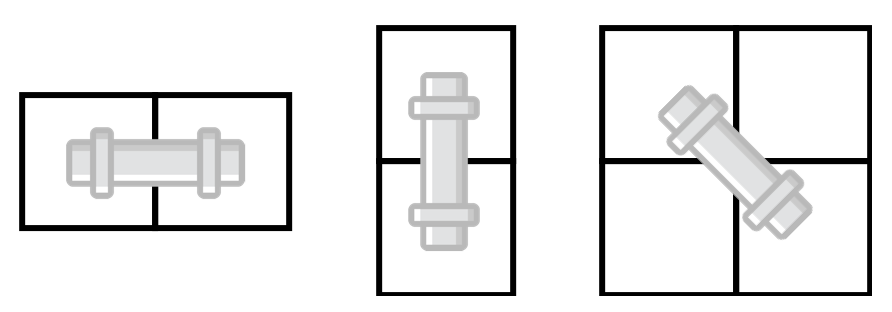




> Question



* Find number of ways to connect pipe to right down
* Pipe can be turned 45 degree

```txt
Input:
6
0 0 0 0 0 0
0 1 0 0 0 0
0 0 0 0 0 0
0 0 0 0 0 0
0 0 0 0 0 0
0 0 0 0 0 0
Output: 13
```




```py
N=int(input())
R, dp=[[*map(int, input().split())] for _ in range(N)],[[[0]*3 for _ in range(N)] for _ in range(N)]
dp[0][1][0]=1
for j in range(2, N):
  if R[0][j] == 0: dp[0][j][0] = dp[0][j - 1][0]
for i in range(1, N):
  for j in range(2, N):
    if R[i][j]: continue
    if R[i][j - 1] == 0 and R[i-1][j] == 0: dp[i][j][1] = sum(dp[i-1][j-1])
    dp[i][j][0] = dp[i][j - 1][0]+dp[i][j - 1][1]
    dp[i][j][2] = dp[i - 1][j][1]+dp[i - 1][j][2]
print(sum(dp[N - 1][N - 1]))
```



