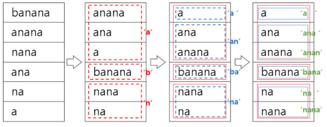




> Question

* Given banaba, print suffix array and LCP
* suffix array is defined as ordered suffix
* LCP is defined as length of common substring with previous index of suffix array

| Suffix | i   | LCP |
| ------ | --- | --- |
| a      | 6   | x   |
| ana    | 4   | 1   |
| anana  | 2   | 3   |
| banana | 1   | 0   |
| na     | 5   | 0   |
| nana   | 3   | 2   |

```txt
Input: banana

Output:
6 4 2 1 5 3
x 1 3 0 0 2
```

> Solution

* Incrementally sort (2 ** n) suffix



* Store rank (ascii) and next rank for faster sorting

| Index | Suffix | Rank | Next Rank |
| ----- | ------ | ---- | --------- |
| 0     | banana | 1    | 0         |
| 1     | anana  | 0    | 13        |
| 2     | nana   | 13   | 0         |
| 3     | ana    | 0    | 13        |
| 4     | na     | 13   | 0         |
| 5     | a      | 0    | 1         |




```py
import sys
s = sys.stdin.readline().strip()

n = len(s)
sa = [i for i in range(len(s))]
rank, ng = [0] * (n + 1), [0] * (n + 1)

for i in range(n):
  rank[i] = ord(s[i])

rank[n] = -1
t = 1

ng[sa[0]] = 0
ng[n] = -1

while t < n:
  sa.sort(key = lambda x:(rank[x], rank[min(x + t, n)]))
  for i in range(1, n):
    p, q = sa[i - 1], sa[i]
    if rank[p] != rank[q] or rank[min(p + t, n)] != rank[min(q + t, n)]:
      ng[q] = ng[p] + 1
    else:
      ng[q] = ng[p]
  t *= 2
  rank = ng[:]

lcp, k = [0] * n, 0

for i in range(n):
  if rank[i] == 0:
    continue
  j = sa[rank[i] - 1]
  while j + k < n and s[i + k] == s[j + k]:
    k += 1
  lcp[rank[i]] = k
  if k:
    k -= 1
lcp[0] = 'x'

for z in range(n):
  sa[z] += 1

print(*sa)
print(*lcp)
```



