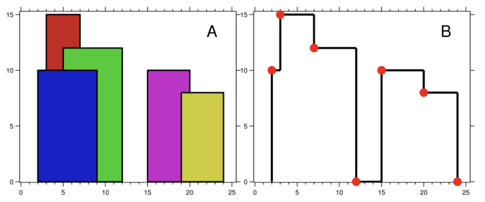

# Greedy


* [greedy](https://www.youtube.com/watch?v=ARvQcqJ_-NY)

> Proof Exchange Argument

* OS be a solution achieved by not choosing g
* Show how to transform OS into some solution OS' that chooses g, and that is at least as good as OS

1. Say G is the event with the earliest finish time. (First greedy decision: include G).
2. Let OS be a legal schedule that doesn't include G such that $$ |OS'| \geq |OS|%0 $$
3. Let the events in OS be $$ j_1, ..., j_k%0 $$ ordered by start and finish times ( $$ J_1 \neq G%0 $$ ) (Exchange Arg)
    * Must show that OS' is a valid solution
    * OS' is better than OS

* Use 1-3 in an inductive argument
* Base case : the greedy strategy works for an instance of size 1
* IH : Assume the greedy works for all instances of size < n

$$ |O S(I)| ≤ |O S^{\prime}(I)|=|\{g\} ∪ S(I^{\prime})| ≤ \left|\{g\} ∪ G S\left(I^{\prime}\right)\right|=|G S(I)|%0 $$

> baekjoon

* [Level 4 : 한조서열정리하고옴ㅋㅋ](http://acmicpc.net/problem/14659)
  * [Update solution](https://github.com/seanhwangg/algorithm/edit/main/method/greedy/greedy/BJ_14659.md)




> Question

* There are a N towers with diffrent height, each can kill visible tower on right
* Find number of kills from best killer

```txt
Input:
7
6 4 10 2 5 7 11

Output: 3
```




```py
N = int(input())
li = list(map(int, input().split()))
cur_height, cnt, mx = 0, 0, 0
for h in li:
  if cur_height < h:
    cur_height = h
    cnt = 0
  else:
    cnt += 1
  mx = max(cnt, mx)
print(mx)
```




* [Level 6 : 뒤집기](http://acmicpc.net/problem/1439)
  * [Update solution](https://github.com/seanhwangg/algorithm/edit/main/method/greedy/greedy/BJ_1439.md)




> Question

* You can grab one or more consecutive numbers and flip them all
* How many times do we have to make them have all the numbers?

```txt
Input: 0001100
Output: 1
```




```py
S = input()
count = 0
for i in range(len(S)-1):
  if S[i] != S[i+1]:
    count += 1
print((count + 1) // 2)
```




* [Level 7 : 주유소](http://acmicpc.net/problem/13305)
  * [Update solution](https://github.com/seanhwangg/algorithm/edit/main/method/greedy/greedy/BJ_13305.md)




> Question


* Calculates the price of gas at each city's gas station
* minimum cost of moving from left-most city to right-most city by inputting length of the road connecting each city

```txt
Input:
4
2 3 1
5 2 4 1

Output: 18
```




```py
n=int(input())
a=[int(i) for i in input().split()]
b=[int(i) for i in input().split()]
c, r = 0, 0
for i in range(n-1):
  if b[i] < b[c]:
    c = i
  r += a[i] * b[c]
print(r)
```




* [Level 8 : 수들의 합 2](http://acmicpc.net/problem/2003)
  * [Update solution](https://github.com/seanhwangg/algorithm/edit/main/method/greedy/greedy/BJ_2003.md)




> Question

* Find number of ways where A[i] + A[i+1] + … + A[j-1] + A[j] == M

```txt
Input:
10 5
1 2 3 4 2 5 3 1 1 2

Output: 3
```




```py
N, M = map(int, input().split())
nums = list(map(int, input().split()))
accums = [0] * (N + 1)
for i in range(1, N + 1):
  accums[i] = accums[i - 1] + nums[i - 1]
count = 0
for l in range(N):
  for r in range(l + 1, N + 1):
    if accums[r] - accums[l] > M:
      break
    elif accums[r] - accums[l] == M:
      count += 1
      break
print(count)
```




* [Level 9 : 전구와 스위치](http://acmicpc.net/problem/2138)
  * [Update solution](https://github.com/seanhwangg/algorithm/edit/main/method/greedy/greedy/BJ_2138.md)




> Question

* Pressing the switch i (1 < i < N) changes the state of the three bulbs, i-1, i, and i+1
* Find minimum number of press

```txt
Input:
3
000
010

Output: 3
```




```py
def change(A, B):
  press = 0
  for i in range(1, n):
    if A[i-1] == B[i-1]:
      continue
    press += 1
    for j in range(i-1, i+2):
      if j < n:
        A[j] ^= 1

  return press if A == B else float('inf')
n = int(input())
A = list(map(int,input()))
B = list(map(int,input()))
f_A = A[:]
f_A[0] ^= 1
f_A[1] ^= 1
res = min(change(A, B), 1 + change(f_A, B))
print(res if res != float('inf') else -1)
```




* [Level 9 : 행렬](http://acmicpc.net/problem/1080)
  * [Update solution](https://github.com/seanhwangg/algorithm/edit/main/method/greedy/greedy/BJ_1080.md)




> Question

* In one operation you can swap all elements in 3 x 3 sub-matrix
* Find the minimum value of the number of operation required to change the matrix A to matrix B

```txt
Input:
3 4
0000
0010
0000
1001
1011
1001

Output: 2
```




```py
N, M =map(int,input().split())
A = [list(map(int,list(input()))) for _ in range(N)]
B = [list(map(int,list(input()))) for _ in range(N)]
def flip(G, x,y):
  for i in range(x,x+3):
    for j in range(y,y+3):
      G[i][j] = 1 - G[i][j]
cnt = 0
for i in range(0,N-2):
  for j in range(0,M-2):
    if A[i][j] !=B[i][j]:
      flip(A, i,j)
      cnt+=1
for i in range(N):
  for j in range(M):
    if A[i][j] != B[i][j]:
      print(-1)
      exit()
print(cnt)
```




* [Level 9 : 한 줄로 서기](http://acmicpc.net/problem/1138)
  * [Update solution](https://github.com/seanhwangg/algorithm/edit/main/method/greedy/greedy/BJ_1138.md)




> Question

* Heights of N people are given
* Given people remember how many people were taller on the left, prints out how to line them up

```txt
Input:
4
2 1 1 0

Output: 4 2 1 3
```




```py
n = int(input())
a = list(map(int, input().split()) )
b = []
for i in range(n):
  b.insert(a[n - 1 - i], n - i)
print(*b)
```




* [Level 9 : 잃어버린 괄호](http://acmicpc.net/problem/1541)
  * [Update solution](https://github.com/seanhwangg/algorithm/edit/main/method/greedy/greedy/BJ_1541.md)




> Question

* Given expression with +, -, and parentheses, make the value of this expression minimal by parentheses

```txt
Input: 55-50+40
Output: -35
```




```py
equations = input().split('-')
ret = 0
for i, equation in enumerate(equations):
  for num in equation.split('+'):
    ret += int(num) if i == 0 else -int(num)
print(ret)
```




> codechef

* [Level Easy : Consecutive Deletions](https://www.codechef.com/problems/CONDEL)
  * [Update solution](https://github.com/seanhwangg/algorithm/edit/main/method/greedy/greedy/CC_CONDEL.md)




> Question

* Choose a subarray (a contiguous subsequence) with length K
* choose two indices L and R such that 1 ≤ L ≤ R ≤ N and R − L + 1 = K
* Choose one element of that subarray and change it to 0
* The cost of this operation is the sum of this subarray before AP is changed

```txt
Input:
3
5 3
1 0 1 0 1
4 4
1 1 0 1
3 1
1 1 0

Output:
3
6
2
```




```py
def solution(li, width):
  cur_total = sum(li[0: width])
  mn_total = cur_total
  for l in range(len(li) - width):
    cur_total = cur_total - li[l] + li[l + width]
    mn_total = min(mn_total, cur_total)
  return sum(li) + sum(range(mn_total))

for _ in range(int(input())):
  _, width = map(int, input().split())
  li = list(map(int, input().split()))
  print(solution(li, width))
```




> leetcode

* [Level Easy : Maximum Ascending Subarray Sum](https://leetcode.com/problems/maximum-ascending-subarray-sum)
  * [Update solution](https://github.com/seanhwangg/algorithm/edit/main/method/greedy/greedy/LC_1800.md)




> Question

* Given an array of positive integers nums, return the maximum possible sum of an ascending subarray in nums

```txt
Input: nums = [10,20,30,5,10,50]
Output: 65
```




```py
def maxAscendingSum(self, nums: List[int]) -> int:
  mx = 0
  for i, x in enumerate(nums):
    if i == 0 or nums[i-1] >= nums[i]: cur = 0
    cur += nums[i]
    mx = max(mx, cur)
  return mx
```




* [Level Medium : Wiggle Subsequence](https://leetcode.com/problems/wiggle-subsequence)
  * [Update solution](https://github.com/seanhwangg/algorithm/edit/main/method/greedy/greedy/LC_376.md)




> Question

* A wiggle sequence is a sequence where differences between successive numbers strictly alternate between positive and negative
* The first difference may be either positive or negative. One element is trivially a wiggle sequence
* Find length of longest wiggle sequence

```txt
Input: nums = [1,7,4,9,2,5]
Output: 6
```




```py
def wiggleMaxLength(self, nums: List[int]) -> int:
  len_dec, len_inc = 1, 1
  for i in range(1, len(nums)):
    len_dec = len_inc + 1 if nums[i] < nums[i-1] else len_dec
    len_inc = len_dec + 1 if nums[i] > nums[i-1] else len_inc
  return max(len_inc, len_dec)
```




* [Level Medium : Largest Merge Of Two Strings](https://leetcode.com/problems/largest-merge-of-two-strings)
  * [Update solution](https://github.com/seanhwangg/algorithm/edit/main/method/greedy/greedy/LC_1754.md)




> Question

* given two strings word1 and word2, construct a string merge in the following way
* while either word1 or word2 are non-empty, choose one of the following options:
  * If word1 is non-empty, append the first character in word1 to merge and delete it from word1
  * If word2 is non-empty, append the first character in word2 to merge and delete it from word2
* Return the lexicographically largest merge you can construct

```txt
Input: word1 = "abcabc", word2 = "abdcaba"
Output: "abdcabcabcaba"
```




```py
def largestMerge(self, s1, s2):
  if s1 >= s2 > '':
    return s1[0] + self.largestMerge(s1[1:], s2)
  if s2 >= s1 > '':
    return s2[0] + self.largestMerge(s1, s2[1:])
  return s1 + s2
```




* [Level Medium : Monotone Increasing Digits](https://leetcode.com/problems/monotone-increasing-digits)
  * [Update solution](https://github.com/seanhwangg/algorithm/edit/main/method/greedy/greedy/LC_738.md)




> Question

* Print largest monotonic increasing number less than N

```txt
Input: n = 5432
Output: 4999
```

> Solution

* Find first decreasing digit
* 20s / 5422 -> 300s / 5322 -> 4000s / 4322 -> 4999




```py
def monotoneIncreasingDigits(self, N: int) -> int:
  s = list(str(N))
  maker = len(s)
  for i in range(len(s) - 1, 0, -1):
    if s[i] < s[i - 1]:
      maker = i
      s[i - 1] = str(int(s[i - 1]) - 1)
  s[maker:] = ['9'] * (len(s) - maker)
  return int(''.join(s))
```




* [Level Medium : Jump Game](https://leetcode.com/problems/jump-game)
  * [Update solution](https://github.com/seanhwangg/algorithm/edit/main/method/greedy/greedy/LC_55.md)




> Question

* Given an array of non-negative integers nums, you are initially positioned at the first index of the array
* Each element in the array represents your maximum jump length at that position

```txt
Input: nums = [2,3,1,1,4]
Output: true
```




```py
def canJump(self, nums: List[int]) -> bool:
  pos = 0
  for i, n in enumerate(nums):
    if i <= pos:
      pos = max(pos, i + n)
  return len(nums) - 1 <= pos
```




* [Level Medium : Remove Duplicate Letters](https://leetcode.com/problems/remove-duplicate-letters)
  * [Update solution](https://github.com/seanhwangg/algorithm/edit/main/method/greedy/greedy/LC_316.md)




> Question

* Given a string s, remove duplicate letters so that every letter appears once and only once
* make sure your result is the smallest in lexicographical order among all possible results

```txt
Input: s = "cbacdcbc"
Output: "acdb"
```




```py
def removeDuplicateLetters(self, s):
  for c in sorted(set(s)):
    suffix = s[s.index(c):]
    if set(suffix) == set(s):
      return c + self.removeDuplicateLetters(suffix.replace(c, ''))
  return ''
```




* [Level Medium : Gas Station](https://leetcode.com/problems/gas-station)
  * [Update solution](https://github.com/seanhwangg/algorithm/edit/main/method/greedy/greedy/LC_134.md)




> Question

* There are n gas stations along a circular route, where the amount of gas at the ith station is gas[i]
* Empty gas car starts from any of gas station and it costs cost[i] to travel from ith station to its next (i + 1)th station
* Given two arrays gas and cost, return starting gas station's index that can travel around once in the clockwise direction
  * otherwise return -1. Solution is unique

```txt
Input: gas = [1,2,3,4,5], cost = [3,4,5,1,2]
Output: 3
```




```cpp
int canCompleteCircuit(vector<int>& gas, vector<int>& cost) {
  int total(0), subsum(INT_MAX), start(0);
  for (int i = 0; i < gas.size(); ++i) {
    total += gas[i] - cost[i];
    if(total < subsum) {
      subsum = total;
      start = i + 1;
    }
  }
  return (total < 0) ?  -1 : (start % gas.size());
}
```




* [Level Medium : Jump Game II](https://leetcode.com/problems/jump-game-ii)
  * [Update solution](https://github.com/seanhwangg/algorithm/edit/main/method/greedy/greedy/LC_45.md)




> Question

* Given non-negative integers nums, each num represents your maximum jump length at that idx
* From the first idx, find the the minimum number of jumps to reach the last index

```txt
Input: nums = [2,3,1,1,4]
Output: 2
```




```py
def jump(self, nums):
  # Time : O(N) / Space : O(1)
  l, r = 0, nums[0]
  time = 1
  while r < len(nums) - 1:
    time += 1
    nxt = max(i + nums[i] for i in range(l, r + 1))
    l, r = r, nxt # nxt : farthest point that all points in [l, r] can reach
  return time
```




* [Level Hard : Candy](https://leetcode.com/problems/candy)
  * [Update solution](https://github.com/seanhwangg/algorithm/edit/main/method/greedy/greedy/LC_135.md)




> Question

* There are n children standing in a line. Each child is assigned a rating value given in the integer array ratings
* You are giving candies to these children subjected to the following requirements:
  * Each child must have at least one candy
  * Children with a higher rating get more candies than their neighbors
* Return the minimum number of candies you need to have to distribute the candies to the children

```txt
Input: ratings = [1,0,2]
Output: 5
```




```py
# Time : O(N), Space : O(N)
def candy(self, ratings: List[int]) -> int:
  res = len(ratings) * [1]
  for i in range(1, len(ratings)):
    if ratings[i] > ratings[i-1]:
      res[i] = res[i - 1] + 1
  for i in range(len(ratings) - 1, 0, -1):
    if ratings[i - 1] > ratings[i]:
      res[i-1] = max(res[i - 1], res[i] + 1)
  return sum(res)
```




* [Level Hard : Strong Password Checker](https://leetcode.com/problems/strong-password-checker)
  * [Update solution](https://github.com/seanhwangg/algorithm/edit/main/method/greedy/greedy/LC_420.md)




> Question

* It has at least 6 characters and at most 20 characters
* It contains at least one lowercase letter, at least one uppercase letter, and at least one digit
* It does not contain three repeating characters in a row
  * [ex] "...aaa..." is weak, but "...aa...a..." is strong, assuming other conditions are met
* minimum nubmer of steps to make password strong
  * Insert one character to password,
  * Delete one character from password, or
  * Replace one character of password with another character

```txt
Input: password = "aA1"
Output: 3
```




```py
def strongPasswordChecker(self, s):
  missing_type = 3
  if any('a' <= c <= 'z' for c in s): missing_type -= 1
  if any('A' <= c <= 'Z' for c in s): missing_type -= 1
  if any(c.isdigit() for c in s): missing_type -= 1

  change = 0
  one = two = 0
  i = 2
  while i < len(s):
    if s[i] == s[i-1] == s[i-2]:
      length = 2
      while i < len(s) and s[i] == s[i-1]:
        length += 1
        i += 1

      change += length // 3
      if length % 3 == 0: one += 1
      elif length % 3 == 1: two += 1
    else:
      i += 1

  if len(s) < 6:
    return max(missing_type, 6 - len(s))
  elif len(s) <= 20:
    return max(missing_type, change)
  else:
    delete = len(s) - 20

    change -= min(delete, one)
    change -= min(max(delete - one, 0), two * 2) // 2
    change -= max(delete - one - 2 * two, 0) // 3

    return delete + max(missing_type, change)
```




* [Level Hard : Three Equal Parts](https://leetcode.com/problems/three-equal-parts)
  * [Update solution](https://github.com/seanhwangg/algorithm/edit/main/method/greedy/greedy/LC_927.md)




> Question

* given an array arr which consists of only zeros and ones
* divide the array into three non-empty parts such that all of these parts represent the same binary value
* If it is possible, return any [i, j] with i + 1 < j, such that:
  * arr[0], arr[1], ..., arr[i] is the first part,
  * arr[i + 1], arr[i + 2], ..., arr[j - 1] is the second part, and
  * arr[j], arr[j + 1], ..., arr[arr.length - 1] is the third part
  * All three parts have equal binary values
* If it is not possible, return [-1, -1]

```txt
Input: arr = [1,0,1,0,1]
Output: [0,3]
```




```py
class Solution:
  def threeEqualParts(self, A: List[int]) -> List[int]:
  num_ones = sum(A)
  if num_ones == 0:
    return [0, 2]
  if num_ones % 3 != 0:
    return [-1, -1]

  c = 0
  s1 = s2 = s3 = -1
  for idx,x in enumerate(A): # Find the first 1 in each part
    if x == 1:
      c += 1
    if c == 1 and s1 < 0:
      s1 = idx
    if c == num_ones // 3 + 1 and s2 < 0:
      s2 = idx
    if c == num_ones * 2 // 3 + 1 and s3 < 0:
      s3 = idx
      break
  n = len(A[s3:]) # length of each part when all the leading 0's are removed
  if A[s1: s1 + n] == A[s2: s2 + n] and A[s2: s2 + n] == A[s3:]:
    return [s1 + n - 1, s2 + n]
  else:
    return [-1, -1]
```




* [Level Hard : Couples Holding Hands](https://leetcode.com/problems/couples-holding-hands)
  * [Update solution](https://github.com/seanhwangg/algorithm/edit/main/method/greedy/greedy/LC_765.md)




> Question

* print minimum swaps to make partner sit next to each other (2 \* N, 2 \* N - 1)

```txt
Input: row = [0, 2, 1, 3]
Output: 1
```




```py
def minSwapsCouples(self, row: List[int]) -> int:
  n = len(row)
  pair = defaultdict(int)
  for i in range(0, len(row) - 1, 2):
    G[i] = i + 1
    G[i + 1] = i
  ans = 0
  for i in range(0, len(row) - 2, 2): #Traverse the array and swap if not with his/her pair
    if not pair[row[i]] == row[i+1]:
      ans += 1
      temp = row.index(pair[row[i]])
      row[i + 1], row[temp] = row[temp], row[i + 1]
  return ans
```




## Implementation

> baekjoon

* [Level 3 : 공](http://acmicpc.net/problem/1547)
  * [Update solution](https://github.com/seanhwangg/algorithm/edit/main/method/greedy/implementation/BJ_1547.md)




> Question

* Print location of cup at the end of simulation

```txt
Input:
4
3 1
2 3
3 1
3 2

Output: 3
```




```py
n = int(input())
cur = 1
for _ in range(n):
  a, b = map(int, input().split())
  if cur == a:
    cur = b
  elif cur == b:
    cur = a
print(cur)
```




* [Level 3 : Mini Fantasy War](http://acmicpc.net/problem/12790)
  * [Update solution](https://github.com/seanhwangg/algorithm/edit/main/method/greedy/implementation/BJ_12790.md)




> Question

* Print changes in power, which is the product of followings
  * HP : cannot be samller than 1 (* 5)
  * MP : cannot be samller than 1 (* 2)
  * Attack : cannot be smaller than 0
  * Shield : can be negative

```txt
Input:
3
100 100 100 100 0 0 0 0
10 20 30 40 40 30 20 10
100 100 100 100 -200 0 400 400

Output:
1000
500
2501
```




```py
for _ in range(int(input())):
  a, b, c, d, e, f, g, h = map(int, input().split())
  print(max(1, a + e) + 5 * max(1, b+f) + 2 * max(0, c + g) + 2 * (d + h))
```




* [Level 4 : 탄산 음료](http://acmicpc.net/problem/5032)
  * [Update solution](https://github.com/seanhwangg/algorithm/edit/main/method/greedy/implementation/BJ_5032.md)




> Question

* 첫 줄에 e, f, c 가 주어진다
* e와 f 를 합치면 가지고 있는 총 빈 병의 개수가 나오고,
* 병을 c개 가지고 오면 꽉 찬 음료수를 받을 수 있다. 이 때 총 마실 수 있는 음료수의 수를 출력하라

```txt
Input: 9 0 3
Output: 4
```




```cpp
#include <iostream>
using namespace std;
int main(void) {
  int e, f, c, s, sum = 0;
  cin >> e >> f >> c;
  s = e + f;
  while (1) {
    if (s < c)
      break;
    sum += s / c;
    s = s%c + s / c;
  }
  cout << sum;
}
```




* [Level 4 : 영식이와 친구들](http://acmicpc.net/problem/1592)
  * [Update solution](https://github.com/seanhwangg/algorithm/edit/main/method/greedy/implementation/BJ_1592.md)




> Question

* count the number of throw if a person can receives up to M
  * if it is odd, he throws the ball to the person who has the Lth clockwise from his or her current position
  * if it is even, he throws the ball to the Lth counterclockwise from his or her current position

```txt
Input: 5 3 2
Output: 10
```




```py
n, m, l = map(int, input().split())
people = [0 for _ in range(n)]
p, cnt = 0, 0

while True:
  people[p] += 1
  if people[p] == m:
    print(cnt)
    break
  elif people[p] % 2 != 0:
    p = (p+l) % n
  else:
    p = (p+n-l) % n
  cnt += 1
```




* [Level 4 : 카드게임](http://acmicpc.net/problem/10801)
  * [Update solution](https://github.com/seanhwangg/algorithm/edit/main/method/greedy/implementation/BJ_10801.md)




> Question

* For each match number of larger score wins
* Print winner of game who won more matches

```txt
Input:
6 7 5 1 4 10 2 3 8 9
1 10 2 9 4 8 3 7 5 6

Output: A
```




```py
A, B = list(map(int,input().split())), list(map(int,input().split()))()
a = b = 0
for i in range(10):
  a+=A[i]>B[i]
  b+=B[i]>A[i]
if a>b: print('A')
if a==b:print('D')
if a<b: print('B')
```




* [Level 4 : 방 배정](http://acmicpc.net/problem/13300)
  * [Update solution](https://github.com/seanhwangg/algorithm/edit/main/method/greedy/implementation/BJ_13300.md)




> Question

* Given N students, gender and their grades
* Print minimum number of rooms when students with same gender and grade are in same room

```txt
Input:
16 2
1 1
0 1
1 1
0 2
1 2
0 2
0 3
1 3
1 4
1 3
1 3
0 6
1 5
0 5
1 5
1 6

Output: 12
```




```py
a = [0] * 12
N, K=map(int, input().split())
for _ in range(N):
  S, Y = map(int, input().split())
  a[6*S+Y-1] += 1
print(sum([(i + K - 1)//K for i in a]))
```




* [Level 4 : 커맨드](http://acmicpc.net/problem/17838)
  * [Update solution](https://github.com/seanhwangg/algorithm/edit/main/method/greedy/implementation/BJ_17838.md)




> Question

* The string is 7 in length
* A string consists of exactly two types of characters
* It satisfies the AABBABB format

```txt
Input:
1
AABBABB

Output: 1
```




```cpp
#include<iostream>

using namespace std;

int CorrectCommand(string str) {
  if (str.length() != 7)
    return 0;

  if (str[0] == str[1] &&
    str[0] == str[4] &&
    str[6] == str[2] &&
    str[6] == str[3] &&
    str[6] == str[5] &&
    str[0] != str[6])
    return 1;
  else
    return 0;
}

int main (void) {
  int nT = 0;

  cin >> nT;
  for(int t = 0; t < nT; t++) {
    string strTmp;
    cin >> strTmp;
    cout << CorrectCommand(strTmp) << endl;
  }

  return 0;
}
```




```py
for _ in range(int(input())):
  s = input()
  print(1 if len(s)==7 and len(set(s))==2 and s.count(s[0])==3 and s[0]==s[1]==s[4] else 0)
```




* [Level 4 : 화성 수학](http://acmicpc.net/problem/5355)
  * [Update solution](https://github.com/seanhwangg/algorithm/edit/main/method/greedy/implementation/BJ_5355.md)




> Question

* @ multiple 3, % add 5, # subtract 7

```txt
Input:
3
3 @ %
10.4 # % @
8 #

Output:
14.00
25.20
1.00
```




```py
for t in range(int(input())):
  k=input().split()
  n=float(k[0])
  for i in range(1,len(k)):
    if k[i]=='@': n*=3
    if k[i]=='%': n+=5
    if k[i]=='#': n-=7
  print('%.2f'%n)
```




* [Level 4 : 크로스워드 만들기](http://acmicpc.net/problem/2804)
  * [Update solution](https://github.com/seanhwangg/algorithm/edit/main/method/greedy/implementation/BJ_2804.md)




> Question

* Given words, make crosswords

```txt
.C..
.C..
ABBA
.B..
```




```py
a, b = map(str, input().split())
r = 0
c = 0
for i in range(len(a)):
  index = b.find(a[i])
  if 0 <= index:
    r = index
    c = i
    break
for i in range(len(b)):
  for j in range(len(a)):
    if i == r:
      print(a, end='')
      break
    elif j == c:
      print(b[i], end='')
    else:
      print('.', end='')
  print()
```




* [Level 5 : 그림 비교](http://acmicpc.net/problem/2160)
  * [Update solution](https://github.com/seanhwangg/algorithm/edit/main/method/greedy/implementation/BJ_2160.md)




> Question


* Print most similar two pictures

```txt
Input:
3
..X....
.XXX...
.XX....
.....X.
.X...X.
...X...
..XX...
.XX....
.XX..X.
.X...X.
XX.....
X......
XX...XX
XXXX.XX
XXX..XX

Output: 1 2
```




```py
N = int(input())
G = [[input() for _ in range(5)] for _ in range(N)]
m=36
for i in range(N-1):
  for j in range(i+1,N):
    d=0
    for k in range(5):
      for l in range(7):
        if G[i][k][l]!=G[j][k][l]:
          d+=1
    if m>d:
      m=d
      i1,j1=i,j
print(i1+1,j1+1)
```




* [Level 6 : 빙고](http://acmicpc.net/problem/2578)
  * [Update solution](https://github.com/seanhwangg/algorithm/edit/main/method/greedy/implementation/BJ_2578.md)




> Question

* Print when 3 bingo

```txt
Input:
11 12 2 24 10
16 1 13 3 25
6 20 5 21 17
19 4 8 14 9
22 15 7 23 18
5 10 7 16 2
4 22 8 17 13
3 18 1 6 25
12 19 23 14 21
11 24 9 20 15

Output: 15
```




```py
binggo = []
for i in range(5):
  binggo += list(map(int,input().split()))
ans = []
for i in range(5):
  ans += list(map(int,input().split()))
cnt = 0
sum_low = [0 for i in range(5)]
sum_col = [0 for i in range(5)]
sum_dia = [0 for i in range(2)]
for i in range(25):
  idx = binggo.index(ans[i])
  binggo[idx] = 0
  for j in range(5):
    if sum(binggo[5*j:5*j+5]) == 0:
      sum_low[j] = 1
    if sum(binggo[j:j+21:5]) == 0:
      sum_col[j] = 1
  if sum(binggo[0:26:6]) == 0:
    sum_dia[0] = 1
  if sum(binggo[4:21:4]) == 0:
    sum_dia[1] = 1
  if sum(sum_low) + sum(sum_col) + sum(sum_dia) >= 3:
    iter = i + 1
    break
print(iter)
```




* [Level 6 : 틱택토 이기기](http://acmicpc.net/problem/9290)
  * [Update solution](https://github.com/seanhwangg/algorithm/edit/main/method/greedy/implementation/BJ_9290.md)




> Question

* outputs the status of the game board

```txt
Input:
3
o--
-o-
xx-
x
o-x
--o
x--
x
xx-
o-o
---
o

Output:
Case 1:
o--
-o-
xxx
Case 2:
o-x
-xo
x--
Case 3:
xx-
ooo
---
```




```py
for T in range(int(input())):
  m = [[*input()] for i in range(3)]
  k = input(f'Case {T+1}:\n')
  for i in range(3):
    if sorted(m[i]) == ['-',k,k]:
      m[i] = k * 3
      break
  else:
    for i,v in enumerate(zip(*m)):
      if sorted(v) == ['-', k, k]:
        for j in range(3):
          m[j][i] = k
        break
    else:
      if sorted(m[i][i] for i in range(3))==['-', k, k]:
        for j in range(3):
          m[j][j] = k
      else:
        for j in range(3):
          m[j][2-j] = k
  for i in m:
    print(''.join(i))
```




* [Level 7 : 기타줄](http://acmicpc.net/problem/1049)
  * [Update solution](https://github.com/seanhwangg/algorithm/edit/main/method/greedy/implementation/BJ_1049.md)




> Question

* Print minimum cost to buy to fix N string
* There are M brands, each with cost for 6 string and 1 string

```txt
Input:
10 3
20 8
40 7
60 4

Output: 36
```




```py
n, m = map(int, input().split())
c=[]
d=[]
for i in range(m):
  a, b = map(int, input().split())
  c.append(a)
  d.append(b)
e, f = min(c), min(d)
print(min([(n // 6 * e) + n % 6 * f, n // 6 * e + e, n * f]))
```




* [Level 7 : 사탕 게임](http://acmicpc.net/problem/3085)
  * [Update solution](https://github.com/seanhwangg/algorithm/edit/main/method/greedy/implementation/BJ_3085.md)




> Question

* Print maximum consecutive length when swapping two adjacent blocks

```txt
Input:
Output:
```




```py
def score(row):
  run, ans = 1, 1
  for i in range(1, len(row)):
    if row[i] == row[i-1]: run+= 1
    else: ans = max(ans, run); run = 1
  return max(run, ans)

def swap(i1, j1, i2, j2):
  G[i1][j1], G[i2][j2] = G[i2][j2], G[i1][j1]
  a1 = max(score(row) for row in G)
  a2 = max(score(row) for row in zip(*G))
  G[i1][j1], G[i2][j2] = G[i2][j2], G[i1][j1]
  return max(a1, a2)

n = int(input())
G = [list(input()) for i in range(n)]
ans = 0

for i in range(n):
  for j in range(n-1):
    ans = max(ans, swap(i, j, i, j+1))
for i in range(n-1):
  for j in range(n):
    ans = max(ans, swap(i, j, i+1, j))
print(ans)
```




* [Level 10 : A → B](http://acmicpc.net/problem/16953)
  * [Update solution](https://github.com/seanhwangg/algorithm/edit/main/method/greedy/implementation/BJ_16953.md)




> Question

* Print minimum number of operations to convert a to b
  * add one at the end
  * multiple 2

```txt
Input: 100 40021
Output: 5
```




```py
a, b = map(int, input().split())
c = 0
while b > a:
  c += 1
  if b % 10 == 1:
    b //= 10
  elif b % 2:
    break
  else:
    b //= 2
print(c + 1 if b == a else -1)
```




* [Level 11 : 틱택토](http://acmicpc.net/problem/7682)
  * [Update solution](https://github.com/seanhwangg/algorithm/edit/main/method/greedy/implementation/BJ_7682.md)




> Question

* Given the state of the game board, determine whether it is the final state that can occur in the TikTakto game

```txt
Input:
XXXOO.XXX
XOXOXOXOX
OXOXOXOXO
XXOOOXXOX
XO.OX...X
.XXX.XOOO
X.OO..X..
OOXXXOOXO
end

Output:
invalid
valid
invalid
valid
valid
invalid
invalid
invalid
```




```cpp
#include <iostream>
#include <string>

using namespace std;

int chk[8] = { 0b100100100, 0b010010010, 0b001001001, 0b111000000, 0b000111000, 0b000000111, 0b100010001, 0b001010100 };

bool match(int bit) {
  for (int i = 0; i < 8; ++i)
    if ((bit & chk[i]) == chk[i])
      return true;

  return false;
}

int main() {
  while (true) {
    string str;
    int oBit = 0, xBit = 0;
    int oCnt = 0, xCnt = 0;

    cin >> str;
    if (str == "end")
      break;

    for (char& c : str) {
      if (c == 'O') {
        ++oBit;
        ++oCnt;
      }
      else if (c == 'X') {
        ++xBit;
        ++xCnt;
      }

      oBit <<= 1;
      xBit <<= 1;
    }
    oBit >>= 1;
    xBit >>= 1;

    if (xCnt < oCnt || oCnt + 1 < xCnt || xCnt < 3)
      cout << "invalid\n";
    else if (xCnt > oCnt && match(xBit) && !match(oBit))
      cout << "valid\n";
    else if (xCnt == oCnt && match(oBit) && !match(xBit))
      cout << "valid\n";
    else if (xCnt + oCnt == 9 && !match(xBit) && !match(oBit))
      cout << "valid\n";
    else
      cout << "invalid\n";
  }

  return 0;
}
```




```py
while True:
  s = list(input())
  if s[0] == 'e':
    break
  x, y, cx, cy = 0, 0, 0, 0
  for i in range(3):
    if s[i * 3] == s[i * 3 + 1] == s[i * 3 + 2] == 'O' or s[i] == s[i + 3] == s[i + 6] == 'O' \
      or s[0] == s[4] == s[8] == 'O' or s[2] == s[4] == s[6] == 'O':
      x += 1
    elif s[i * 3] == 'X' and s[i * 3 + 1] == 'X' and s[i * 3 + 2] == 'X' \
      or s[i] == s[i + 3] == s[i + 6] == 'X' or s[0] == s[4] == s[8] == 'X' or s[2] == s[4] == s[6] == 'X':
      y += 1
    for j in range(3):
      if s[i * 3 + j] == 'O':
        cx += 1
      if s[i * 3 + j] == 'X':
        cy += 1
  if cy - cx == 1 and y and x == 0:
    print("valid")
  elif cx == cy and x and y == 0:
    print("valid")
  elif cy == 5 and cx == 4 and y == 0 and x == 0:
    print("valid")
  else:
    print("invalid")
```




> kattis

* [Level 1.5 : Soda Slurper](https://open.kattis.com/problems/sodaslurper)
  * [Update solution](https://github.com/seanhwangg/algorithm/edit/main/method/greedy/implementation/KT_sodaslurper.md)

[//]: # (BJ_5032)

> leetcode

* [Level Medium : Valid Sudoku](https://leetcode.com/problems/valid-sudoku)
  * [Update solution](https://github.com/seanhwangg/algorithm/edit/main/method/greedy/implementation/LC_36.md)




> Question

* Determine if a 9 x 9 Sudoku board is valid

```txt
Input: board =
[["5","3",".",".","7",".",".",".","."]
,["6",".",".","1","9","5",".",".","."]
,[".","9","8",".",".",".",".","6","."]
,["8",".",".",".","6",".",".",".","3"]
,["4",".",".","8",".","3",".",".","1"]
,["7",".",".",".","2",".",".",".","6"]
,[".","6",".",".",".",".","2","8","."]
,[".",".",".","4","1","9",".",".","5"]
,[".",".",".",".","8",".",".","7","9"]]

Output: true
```




```py
def isValidSudoku(self, board: List[List[str]]) -> bool:
  seen = set()
  for i, row in enumerate(board):
    for j, cval in enumerate(row):
      if cval != ".":
        if (cval, i) in seen or (j, cval) in seen or (i // 3, j // 3, cval) in seen:
          return False
        else:
          seen.add((cval, i))
          seen.add((j, cval))
          seen.add((i//3, j//3, cval))
  return True
```




* [Level Hard : Text Justification](https://leetcode.com/problems/text-justification)
  * [Update solution](https://github.com/seanhwangg/algorithm/edit/main/method/greedy/implementation/LC_68.md)




> Question

* Full justify line

```txt
Input: words = ["This", "is", "an", "example", "of", "text", "justification."], maxWidth = 16
Output:
[
   "This    is    an",
   "example  of text",
   "justification.  "
]
```




```py
def fullJustify(self, words, maxWidth):
  res, cur, num_of_letters = [], [], 0
  for w in words:
    if num_of_letters + len(w) + len(cur) > maxWidth:
      for i in range(maxWidth - num_of_letters):
        cur[i % (len(cur) - 1 or 1)] += ' '
      res.append(''.join(cur))
      cur, num_of_letters = [], 0
    cur += [w]
    num_of_letters += len(w)
  return res + [' '.join(cur).ljust(maxWidth)]
```




## Greedy Sort

> Minimum $ rooms

* Algorithm
  * Number each room from 1 to n
  * Sort the events by earliest start time
  * Put the first event in room 1
  * For events 2...n, put each event in the smallest numbered room that is available

* Proof
  * Let t be a certain time during the conference
  * Let B(t) be the set of all events that are happening at time t
  * Let R be the number of rooms in an arbitrary valid schedule
  * Let L be a lower bound on the number of rooms for all solutions, max_t|B(t)|
  * Let k be the number of rooms needed for the greedy strategy
  * WWS At some point, t

 $$ |B(t)| k $$

* Let t be the starting time of the first event to be scheduled in room k
* Then room k was the minimum room number available at that time
* This means at time t, there were events going on in rooms 1, ..., k -1 plus the event in room k

> baekjoon

* [Level 4 : 거스름돈](http://acmicpc.net/problem/5585)
  * [Update solution](https://github.com/seanhwangg/algorithm/edit/main/method/greedy/greedy-sort/BJ_5585.md)




> Question

* Find minimum number of coins (500, 100, 50, 10, 5, 1) to pay n

```txt
Input: 380
Output: 4
```




```py
ret = 0
for coin in [500, 100, 50, 10, 5, 1]:
  while (coin <= n):
    n -= coin
    ret+=1
print(ret)
```




* [Level 7 : 로프](http://acmicpc.net/problem/2217)
  * [Update solution](https://github.com/seanhwangg/algorithm/edit/main/method/greedy/greedy-sort/BJ_2217.md)




> Question

* If multiple ropes are connected in parallel, the weight of each rope can be divided
* When the object in which weight is w is lifted by using rope of k, weight as much as w / k hangs on each rope
* With threhold of each ropes, print maximum weight of an object that can be lifted (do not have to use all the ropes)

```txt
Input:
2
10
15

Output: 20
```




```py
N = int(input())
li = list(sorted([int(input()) for _ in range(N)], reverse=True))
ret = 0
for i, n in enumerate(li):
  ret = max(ret, (i + 1) * n)
print(ret)
```




* [Level 9 : 동전 0](http://acmicpc.net/problem/11047)
  * [Update solution](https://github.com/seanhwangg/algorithm/edit/main/method/greedy/greedy-sort/BJ_11047.md)




> Question

* N types of coins are given in increasing order
* Print the minimum of the number of coins you need to make the sum of their value K

```txt
Input:
10 4200
1
5
10
50
100
500
1000
5000
10000
50000

Output: 6
```




```py
N, K = map(int, input().split())
li = [int(input()) for _ in range(N)]
ret = 0
for n in reversed(li):
  ret += K // n
  K %= n
print(ret)
```




* [Level 10 : 신입 사원](http://acmicpc.net/problem/1946)
  * [Update solution](https://github.com/seanhwangg/algorithm/edit/main/method/greedy/greedy-sort/BJ_1946.md)




> Question

* Compared to all other applicants, find number of people who excel in at least one scores

```txt
Input:
2
5
3 2
1 4
4 1
2 3
5 5
7
3 6
7 3
4 2
1 4
5 7
2 5
6 1

Output:
4
3
```




```py
import sys
input = sys.stdin.readline
for _ in range(int(input())):
  n = int(input())
  score = sorted([tuple(map(int, input().split())) for _ in range(n)])
  p, ans = n + 1, 0
  for s, e in score:
    if p > e:
      ans += 1
      p = e
  print(ans)
```




* [Level 12 : 수 묶기](http://acmicpc.net/problem/1744)
  * [Update solution](https://github.com/seanhwangg/algorithm/edit/main/method/greedy/greedy-sort/BJ_1744.md)




> Question

* You can either add or multiply with another element then add
* Print maximum sum

```txt
Input:
4
-1
2
1
3

Output: 6
```




```py
n = int(input())
a = []
for i in range(n):
  a.append(int(input()))
a.sort(reverse = True)
b = 0
while len(a) >= 2:
  if a[-1]<=0 and a[-2]<=0:
    b += a.pop()*a.pop()
  else:
    break
a.sort()
while len(a) >= 2:
  if a[-1]>=2 and a[-2]>=2:
    b += a.pop()*a.pop()
  else:
    break
print(sum(a)+b)
```




* [Level 13 : 저울](http://acmicpc.net/problem/2437)
  * [Update solution](https://github.com/seanhwangg/algorithm/edit/main/method/greedy/greedy-sort/BJ_2437.md)




> Question

* Output first weight that can't be mesaure

```txt
Input:
7
3 1 6 2 7 30 1

Output: 21
```




```py
input()

m = 0
for n in sorted(list(map(int, input().split()))):
  if m + 1 < n:
    break
  m += n

print(m + 1)
```




* [Level 15 : 책 나눠주기](http://acmicpc.net/problem/9576)
  * [Update solution](https://github.com/seanhwangg/algorithm/edit/main/method/greedy/greedy-sort/BJ_9576.md)




> Question

* Each person requests any book from l...h
* Find maximum books you can distribute

```txt
Input:
1
2 3
1 2
1 2
1 2

Output: 2
```




```py
T = int(input())
for _ in range(T) :
  N, M = map(int, input().split())
  req = [list(map(int, input().split())) for _ in range(M)]
  req = sorted(req, key=lambda x : x[1])

  cnt = 0
  visited = [False] * (N + 1)
  for l, h in req:
    for i in range(l, h + 1):
      if not visited[i]:
        visited[i] = True
        cnt += 1
        break
  print(cnt)
```




* [Level 16 : 큰 수 만들기](http://acmicpc.net/problem/16496)
  * [Update solution](https://github.com/seanhwangg/algorithm/edit/main/method/greedy/greedy-sort/BJ_16496.md)




> Question

* Print maximum number with concatnation in any order

```txt
Input:
5
3 30 34 5 9

Output: 9534330
```




```py
n = input()
nums = sorted(input().split(), key=lambda x:x*9, reverse=True)
print(0 if nums[0] == "0" else ''.join(nums))
```




> leetcode

* [Level Medium : Car Pooling](https://leetcode.com/problems/car-pooling)
  * [Update solution](https://github.com/seanhwangg/algorithm/edit/main/method/greedy/greedy-sort/LC_1094.md)




> Question

* a vehicle that has capacity empty seats initially available for passengers, which only drives toward east
* Given a list of trips, trip[i] = [num_passengers, start_location, end_location] contains information about the i-th trip:
  * number of passengers that must be picked up, and locations to pick up and drop off
* The locations are given as the number of kilometers due east from your vehicle's initial location
* Return if it is possible to pick up and drop off all passengers for all the given trips

```txt
Input: trips = [[2,1,5],[3,3,7]], capacity = 4
Output: false
```




```py
def carPooling(self, trips, capacity):
  for i, v in sorted(x for n, i, j in trips for x in [[i, n], [j, - n]]):
    capacity -= v
    if capacity < 0:
      return False
  return True
```




* [Level Hard : Course Schedule III](https://leetcode.com/problems/course-schedule-iii)
  * [Update solution](https://github.com/seanhwangg/algorithm/edit/main/method/greedy/greedy-sort/LC_630.md)




> Question

* There are n different courses numbered from 1 to n
* courses[i] = [durationi, lastDayi] indicate that ith course should be taken continuously
  * for durationi days and must be finished before or on lastDayi
* Return the maximum number of courses that you can take

```txt
Input: courses = [[100,200],[200,1300],[1000,1250],[2000,3200]]
Output: 3
```




```py
def scheduleCourse(self, courses: List[List[int]]) -> int:
  pq = []
  start = 0
  for t, end in sorted(courses, key = lambda course: course[1]):
    start += t
    heapq.heappush(pq, -t)
    while start > end:
      start += heapq.heappop(pq)
  return len(pq)
```




## Greedy Hash

> baekjoon

* [Level 10 : 풍선 맞추기](http://acmicpc.net/problem/11509)
  * [Update solution](https://github.com/seanhwangg/algorithm/edit/main/method/greedy/greedy-hash/BJ_11509.md)




> Question

* height of arrow decreases by 1 when hit by balloon
* Find minimum number of arrow to pop all balloons

```txt
Input:
5
2 1 5 4 3
Output: 2
```




```py
from collections import Counter
input()
count = 0
height_cnt = Counter()
for h in map(int,input().split()):
  if height_cnt[h] != 0:
    height_cnt[h] -= 1
    height_cnt[h - 1] += 1
  else:
    height_cnt[h - 1] += 1
print(sum(height_cnt.values()))
```




* [Level 12 : 단어 수학](http://acmicpc.net/problem/1339)
  * [Update solution](https://github.com/seanhwangg/algorithm/edit/main/method/greedy/greedy-hash/BJ_1339.md)




> Question

* changing each alphabetic capital letter into one of the numbers from 0 to 9
* Find maximum sum

```txt
Input:
2
GCF
ACDEB

Output: 99437
```




```py
t = int(input())
ss = [input() for _ in range(t)]
alphabet = [0 for i in range(26)]
for s in ss:
  i = 0
  while s:
    now = s[-1]
    alphabet[ord(now) - ord('A')] += 10 ** i
    i += 1
    s = s[:-1]
alphabet.sort(reverse=True)
ans = 0
for i in range(9, 0, -1):
  ans += i * alphabet[9 - i]
print(ans)
```




> codeforces

* [Level 1500 : Phoenix and Socks](https://codeforces.com/problemset/problem/1515/D)
  * [Update solution](https://github.com/seanhwangg/algorithm/edit/main/method/greedy/greedy-hash/CF_1515D.md)




> Question

* Find minimum number of operations to make pairs of socks
  * recolor a sock to any color 𝑐′ (1≤𝑐′≤𝑛)
  * turn a left sock into a right sock
  * turn a right sock into a left sock

```txt
Input:
4
6 3 3
1 2 3 2 2 2
6 2 4
1 1 2 2 2 2
6 5 1
6 5 4 3 2 1
4 0 4
4 4 4 3

Output:
2
3
5
3
```




```py
from collections import Counter
for _ in range(int(input())):
  _, l, r = map(int,input().split())
  li = list(map(int,input().split()))
  count, move, dye = len(li) // 2, abs(l - r)//2, 0
  left, right = Counter(li[:l]), Counter(li[l:])
  if l > r:
    left, right = right,left

  for sock in left:
    m = min(left[sock], right[sock])
    right[sock]-=m
    count -= m

  for sock in right:
    dye += right[sock]//2
  print(count + max(0, move-dye))
```




> leetcode

* [Level Medium : Minimum Operations to Reduce X to Zero](https://leetcode.com/problems/minimum-operations-to-reduce-x-to-zero)
  * [Update solution](https://github.com/seanhwangg/algorithm/edit/main/method/greedy/greedy-hash/LC_1658.md)




> Question

* can either pop from left or right element and subtract from x
* Print minimum number of operations to make x to be 0

```txt
Input: nums = [1,1,4,2,3], x = 5
Output: 2
```

> Solution

* Equivalent of finding largest contiguous subarrays with sum(nums) - x




```py
def minOperations(self, nums, x) :
  cumsum = [0] + list(accumulate(nums))
  dic = {c : i for i, c in enumerate(cumsum)}
  goal = cumsum[-1] - x
  ans = -float("inf")

  if goal < 0: return -1
  for num in dic:
    if num + goal in dic:
      ans = max(ans, dic[num + goal] - dic[num])

  return len(nums) - ans if ans != -float("inf") else -1
```




* [Level Medium : Construct K Palindrome Strings](https://leetcode.com/problems/construct-k-palindrome-strings)
  * [Update solution](https://github.com/seanhwangg/algorithm/edit/main/method/greedy/greedy-hash/LC_1400.md)




> Question

* Given a string s and an integer k. You should construct k non-empty palindrome strings using all the characters in s
* Return if you can use all the characters in s to construct k palindrome strings

```txt
Input: s = "annabelle", k = 2
Output: true
```




```py
def canConstruct(self, s, k):
  return sum(i & 1 for i in collections.Counter(s).values()) <= k <= len(s)
```




* [Level Medium : Maximum Score From Removing Substrings](https://leetcode.com/problems/maximum-score-from-removing-substrings)
  * [Update solution](https://github.com/seanhwangg/algorithm/edit/main/method/greedy/greedy-hash/LC_1717.md)




> Question

* Given a string s and two integers x and y. You can perform two types of operations any number of times
* Remove substring "ab" and gain x points
* For example, when removing "ab" from "cabxbae" it becomes "cxbae"
* Remove substring "ba" and gain y points
* For example, when removing "ba" from "cabxbae" it becomes "cabxe"
* Return the maximum points you can gain after applying the above operations on s

```txt
Input: s = "aabbaaxybbaabb", x = 5, y = 4
Output: 20
```




```py
def maximumGain(self, s: str, x: int, y: int) -> int:
  if x < y:
    s = s.replace("a", "-").replace("b", "a").replace("-", "b")
    x, y = y, x
  seen = Counter()
  ans = 0
  for c in s + "x":
    if c in 'ab':
      if c == "b" and 0 < seen["a"]:
        ans += x
        seen["a"], seen["b"] = seen["a"] - 1, seen["b"] - 1
      seen[c] += 1
    else:
      ans += y * min(seen["a"], seen["b"])
      seen = Counter()

  return ans
```




* [Level Medium : Longest Consecutive Sequence](https://leetcode.com/problems/longest-consecutive-sequence)
  * [Update solution](https://github.com/seanhwangg/algorithm/edit/main/method/greedy/greedy-hash/LC_128.md)




> Question

* Given an unsorted array of integers nums, return the length of the longest consecutive elements sequence

```txt
Input: nums = [100,4,200,1,3,2]
Output: 4
```




```py
def longestConsecutive(self, nums: List[int]) -> int:
  nums = set(nums)
  best = 0
  for x in nums:
    if x - 1 not in nums:
      y = x + 1
      while y in nums:
        y += 1
      best = max(best, y - x)
  return best
```




## Two pointer

* Following must hold to use two pointers
  * If a wider scope of the sliding window is valid, the narrower scope of that wider scope is valid
  * If a narrower scope of the sliding window is invalid, the wider scope of that narrower scope is invalid

> leetcode

* [Level Easy : Two Sum II - Input array is sorted](https://leetcode.com/problems/two-sum-ii-input-array-is-sorted)
  * [Update solution](https://github.com/seanhwangg/algorithm/edit/main/method/greedy/two-pointer/LC_167.md)




> Question

* find two indices that sum up to target in sorted array

```txt
Input: numbers = [2,7,11,15], target = 9
Output: [1,2]
```




```py
def twoSum1(self, numbers, target):
  l, r = 0, len(numbers) - 1
  while l < r:
    s = numbers[l] + numbers[r]
    if s == target:
      return [l + 1, r + 1]
    elif s < target:
      l += 1
    else:
      r -= 1
```




* [Level Easy : Valid Palindrome](https://leetcode.com/problems/valid-palindrome)
  * [Update solution](https://github.com/seanhwangg/algorithm/edit/main/method/greedy/two-pointer/LC_125.md)




> Question

* Check if string is palindrome

```txt
Input: s = "A man, a plan, a canal: Panama"
Output: true
```




```cpp
bool isPalindrome(string s) {
  int i = 0, j = s.size() - 1;
  while (i < j){
    while (!isalpha(s[i]) && !isdigit(s[i]))  i++;
    while (!isalpha(s[j]) && !isdigit(s[j]))  j--;
    if (i < j && tolower(s[i++]) != tolower(s[j--])) return false;
  }
  return true;
}
```




* [Level Medium : 4Sum](https://leetcode.com/problems/4sum)
  * [Update solution](https://github.com/seanhwangg/algorithm/edit/main/method/greedy/two-pointer/LC_18.md)




> Question

* Given an array nums of n integers and an target, find unique set of a, b, c, and d that sums up to target

```txt
Input: nums = [1,0,-1,0,-2,2], target = 0
Output: [[-2,-1,1,2],[-2,0,0,2],[-1,0,0,1]]
```




```py
def fourSum(self, nums, target):
  def findNsum(nums, target, N, cur, results):
    if len(nums) == 0 or not (nums[0] * N <= target <= nums[-1] * N):
      return
    if N == 2:
      l, r = 0, len(nums) - 1
      while l < r:
        s = nums[l] + nums[r]
        if s == target:
          results.append(cur + [nums[l], nums[r]])
          l += 1
          while l < r and nums[l] == nums[l-1]:
            l += 1
        elif s < target:    l += 1
        else:               r -= 1
    else:
      for i in range(len(nums) - N + 1):
        if i == 0 or nums[i - 1] != nums[i]:
          findNsum(nums[i + 1:], target - nums[i], N - 1, cur + [nums[i]], results)

  results = []
  findNsum(sorted(nums), target, 4, [], results)
  return results
```




* [Level Medium : Sort Colors](https://leetcode.com/problems/sort-colors)
  * [Update solution](https://github.com/seanhwangg/algorithm/edit/main/method/greedy/two-pointer/LC_75.md)




> Question

* Sort three number

```txt
Input: nums = [2,0,2,1,1,0]
Output: [0,0,1,1,2,2]
```




```py
def sortColors(self, nums):
  red, white, blue = 0, 0, len(nums)-1

  while white <= blue:
    if nums[white] == 0:
      nums[red], nums[white] = nums[white], nums[red]
      white += 1
      red += 1
    elif nums[white] == 1:
      white += 1
    else:
      nums[white], nums[blue] = nums[blue], nums[white]
      blue -= 1
```




* [Level Medium : Partition Labels](https://leetcode.com/problems/partition-labels)
  * [Update solution](https://github.com/seanhwangg/algorithm/edit/main/method/greedy/two-pointer/LC_763.md)




> Question

* A string s of lowercase English letters is given
* Partition this string into as many parts as possible so that each letter appears in at most one part
* return a list of size of these parts

```txt
Input: s = "ababcbacadefegdehijhklij"
Output: [9,7,8]
```




```py
def partitionLabels(self, s: str) -> List[int]:
  rightmost = {c : i for i, c in enumerate(s)}
  l, r = 0, 0
  result = []
  for i, letter in enumerate(s):
    r = max(r, rightmost[letter])
    if i == r:
      result += [r-l + 1]
      l = i + 1
  return result
```




* [Level Medium : Palindromic Substrings](https://leetcode.com/problems/palindromic-substrings)
  * [Update solution](https://github.com/seanhwangg/algorithm/edit/main/method/greedy/two-pointer/LC_647.md)




> Question

* Given a string s, return the number of palindromic substrings in it
* A substring is a contiguous sequence of characters within the string

```txt
Input: s = "aaa"
Output: 6
```




```cpp
int countSubstrings(string s) {
  int res = 0, n = s.length();
  for(int i = 0; i < n; i++){
    //substring s[i-j, ..., i+j]
    for(int j = 0; i-j >= 0 && i+j < n && s[i-j] == s[i+j]; j++) res++;
    //substring s[i-1-j, ..., i+j]
    for(int j = 0; i-1-j >= 0 && i+j < n && s[i-1-j] == s[i+j]; j++) res++;
  }
  return res;
}
```




```py
def countSubstrings(self, S):
  def manachers(S): # represents the maximum half-length of a palindrome at some center
    A = '@#' + '#'.join(S) + '#$'
    Z = [0] * len(A)
    center = right = 0
    for i in range(1, len(A) - 1):
      if i < right:
        Z[i] = min(right - i, Z[2 * center - i])
      while A[i + Z[i] + 1] == A[i - Z[i] - 1]:
        Z[i] += 1
      if i + Z[i] > right:
        center, right = i, i + Z[i]
    return Z
  return sum((v + 1) // 2 for v in manachers(S))
```




* [Level Medium : K-diff Pairs in an Array](https://leetcode.com/problems/k-diff-pairs-in-an-array)
  * [Update solution](https://github.com/seanhwangg/algorithm/edit/main/method/greedy/two-pointer/LC_532.md)




> Question

* Given Array, find number of pairs with difference k

```txt
Input: nums = [3,1,4,1,5], k = 2
Output: 2
```




```java
public int findPairs(int[] nums, int k) {
  Map<Integer, Integer> cnt = new HashMap<>();
  for (int x : nums)
    cnt.put(x, cnt.getOrDefault(x, 0) + 1);
  int res = 0;
  for (int x : cnt.keySet()) {
    if ((k > 0 && cnt.containsKey(x + k)) || (k == 0 && cnt.get(x) > 1))
      res++;
  }
  return res;
}
```




```py
def findPairs(self, nums, k):
  c = collections.Counter(nums)
  return  sum(k > 0 and i + k in c or k == 0 and c[i] > 1 for i in c)
```




* [Level Medium : Container With Most Water](https://leetcode.com/problems/container-with-most-water)
  * [Update solution](https://github.com/seanhwangg/algorithm/edit/main/method/greedy/two-pointer/LC_11.md)




> Question

* Find two lines, which, together with the x-axis forms a container, such that the container contains the most water


```txt
Input: height = [4,3,2,1,4]
Output: 16
```




```py
def maxArea(self, height):
  i, j = 0, len(height) - 1
  water = 0
  while i < j:
    water = max(water, (j - i) * min(height[i], height[j]))
    if height[i] < height[j]:
      i += 1
    else:
      j -= 1
  return water
```




* [Level Medium : 3Sum Closest](https://leetcode.com/problems/3sum-closest)
  * [Update solution](https://github.com/seanhwangg/algorithm/edit/main/method/greedy/two-pointer/LC_16.md)




> Question

* Given an array S of n integers, find three integers in S such that the sum is closest to a given number, target

```txt
Input: nums = [-1,2,1,-4], target = 1
Output: 2
```




```java
public int threeSumClosest(int[] nums, int target) {
  if (nums == null || nums.length < 3) return 0;
  Arrays.sort(nums);
  int sum = 0, closest = nums[0] + nums[1] + nums[2];
  for (int i = 0; i < nums.length - 2; i++) {
    if (i > 1 && nums[i] == nums[i - 1]) continue;
    int lo = i + 1, hi = nums.length - 1;
    while (lo < hi) {
      sum = nums[i] + nums[lo] + nums[hi];
      if (sum == target) return target;
      else if (sum < target) lo++;
      else hi--;
      if (Math.abs(sum - target) < Math.abs(closest - target)) closest = sum;
    }
  }
  return closest;
}
```




* [Level Medium : 3Sum](https://leetcode.com/problems/3sum)
  * [Update solution](https://github.com/seanhwangg/algorithm/edit/main/method/greedy/two-pointer/LC_15.md)




> Question

* find list of three indices that sums up to zero

```txt
Input: nums = [-1,2,1,-4], target = 1
Output: 2
```




```py
def threeSum(self, nums):
  res = []
  nums.sort()
  for i in range(len(nums) - 2):
    if i > 0 and nums[i] == nums[i-1]: continue
    l, r = i + 1, len(nums) - 1
    while l < r :
      s = nums[i] + nums[l] + nums[r]
      if s == 0:
        res.append([nums[i] ,nums[l] ,nums[r]])
        l += 1; r -= 1
        while l < r and nums[l] == nums[l - 1]: l += 1
        while l < r and nums[r] == nums[r + 1]: r -= 1
      elif s < 0:
        l += 1
      else:
        r -= 1
  return res
```




* [Level Medium : 3Sum Smaller](https://leetcode.com/problems/3sum-smaller)
  * [Update solution](https://github.com/seanhwangg/algorithm/edit/main/method/greedy/two-pointer/LC_259.md)




> Question

* Given an integers and a target
* find number of index triplets i, j, k with 0 <= i < j < k < n st condition nums[i] + nums[j] + nums[k] < target

```txt
Input: nums = [-2,0,1,3], and target = 2
Output: 2
```




```py
def threeSumSmaller(self, nums, target):
  count = 0
  nums.sort()
  for i in range(len(nums)):
    j, k = i + 1, len(nums)-1
    while j < k:
      s = nums[i] + nums[j] + nums[k]
      if s < target:
        count += k-j # if (i,j,k) works, then (i,j,k), (i,j,k-1) ... (i, j, j + 1)
        j += 1
      else:
        k -= 1
  return count
```




* [Level Medium : Wiggle Sort II](https://leetcode.com/problems/wiggle-sort-ii)
  * [Update solution](https://github.com/seanhwangg/algorithm/edit/main/method/greedy/two-pointer/LC_324.md)




> Question

* Given an integer array nums, reorder it such that nums[0] < nums[1] > nums[2] < nums[3]...
* You may assume the input array always has a valid answer

```txt
Input: nums = [1,5,1,1,6,4]
Output: [1,6,1,5,1,4]
```




```cpp
void wiggleSort(vector<int>& nums) {
  int n = nums.size();

  auto midptr = nums.begin() + n / 2;
  nth_element(nums.begin(), midptr, nums.end());
  int mid = *midptr;
  #define A(i) nums[(1+2*(i)) % (n|1)]

  // 3-way-partition-to-wiggly in O(n) time with O(1) space.
  int i = 0, j = 0, k = n - 1;
  while (j <= k) {
    if (A(j) > mid)
      swap(A(i++), A(j++));
    else if (A(j) < mid)
      swap(A(j), A(k--));
    else
      j++;
  }
}
```




* [Level Medium : Maximum Distance Between a Pair of Values](https://leetcode.com/problems/maximum-distance-between-a-pair-of-values)
  * [Update solution](https://github.com/seanhwangg/algorithm/edit/main/method/greedy/two-pointer/LC_1855.md)




> Question

* given two non-increasing 0-indexed integer arrays nums1​​​​​​ and nums2​​​​​​
* A pair of indices (i, j), where 0 <= i < nums1.length and 0 <= j < nums2.length, is valid if i <= j and nums1[i] <= nums2[j]
* Return the maximum (j - i) of any valid pair (i, j). If there are no valid pairs, return 0

```txt
Input: nums1 = [55,30,5,4,2], nums2 = [100,20,10,10,5]
Output: 2
```




```cpp
int maxDistance(vector<int>& A, vector<int>& B) {
  int i = 0, j = 0, res = 0, n = A.size(), m = B.size();
  while (i < n && j < m) {
    if (A[i] > B[j])
      i++;
    else
      res = max(res, j++ - i);
  }
  return res;
}
```




* [Level Hard : Wildcard Matching](https://leetcode.com/problems/wildcard-matching)
  * [Update solution](https://github.com/seanhwangg/algorithm/edit/main/method/greedy/two-pointer/LC_44.md)




> Question

* Given an input string (s) and a pattern (p), implement wildcard pattern matching with support for '?' and '*' where:

```txt
Input: s = "adceb", p = "*a*?"
Output: true
```




```cpp
// Time O(N + M) / Space O(1)
class Solution {
public:
   bool isMatch(string s, string p) {
    int i = 0, j = 0;
    int m = s.length(), n = p.length();
    int last_match = -1, starj = -1;
    while (i < m){
      if (j < n && (s[i] == p[j] || p[j] == '?')){
        i++; j++;
      }
      else if (j < n && p[j] == '*'){
        starj = j;
        j++;
        last_match = i;
      }
      else if (starj != -1){
        j = starj + 1;
        last_match++;
        i = last_match;
      }
      else return false;
    }
    while (p[j] == '*' && j <n) j++;
    return j == n;
  }
};
```




```py
# Time / Space : O(m * n)
def isMatch(self, s, p):
  length = len(s)
  if len(p) - p.count('*') > length:
    return False
  dp = [True] + [False]*length
  for i in p:
    if i != '*':
      for n in reversed(range(length)):
        dp[n+1] = dp[n] and (i == s[n] or i == '?')
    else:
      for n in range(1, length+1):
        dp[n] = dp[n-1] or dp[n]
    dp[0] = dp[0] and i == '*'
  return dp[-1]
```




* [Level Hard : Maximum Score of a Good Subarray](https://leetcode.com/problems/maximum-score-of-a-good-subarray)
  * [Update solution](https://github.com/seanhwangg/algorithm/edit/main/method/greedy/two-pointer/LC_1793.md)




> Question

* Given an array of integers nums (0-indexed) and an integer k
* score of a subarray (i, j) is min(nums[i], nums[i+1], ..., nums[j]) * (j - i + 1). good subarray if i <= k <= j
* Return the maximum possible score of a good subarray

```txt
Input: nums = [1,4,3,7,4,5], k = 3
Output: 15
```




```py
def maximumScore(self, nums: List[int], k: int) -> int:
  res = mini = nums[k]
  i, j, n = k, k, len(nums)
  while i > 0 or j < n - 1:
    if (nums[i - 1] if i else 0) < (nums[j + 1] if j < n - 1 else 0):
      j += 1
    else:
      i -= 1
    mini = min(mini, nums[i], nums[j])
    res = max(res, mini * (j - i + 1))
  return res
```




* [Level Hard : Count Pairs Of Nodes](https://leetcode.com/problems/count-pairs-of-nodes)
  * [Update solution](https://github.com/seanhwangg/algorithm/edit/main/method/greedy/two-pointer/LC_1782.md)




> Question

* An undirected graph with n number of nodes, and an integer array queries are given
* The answer to the jth query is the number of pairs of nodes (a, b) that satisfy the following conditions:
  * a < b
  * cnt is strictly greater than queries[j], where cnt is the number of edges incident to a or b
* Return an array answers where answers[j] is the answer of the jth query

```txt
Input: n = 4, edges = [[1,2],[2,4],[1,3],[2,3],[2,1]], queries = [2,3]
Output: [6,5]
```




```py
def countPairs(self, n: int, edges: List[List[int]], queries: List[int]) -> List[int]:
  v2count, res = Counter(v for edge in edges for v in edge), [0] * len(queries)
  shared = Counter((min(n1, n2), max(n1, n2)) for n1, n2 in edges)
  sorted_cnt = sorted(list(v2count.values()) + [0] * (n + 1 - len(v2count)))
  for k, q in enumerate(queries):
    i, j = 1, n
    while i < j:
      if q < sorted_cnt[i] + sorted_cnt[j]:   # for each j add all ignoring intersection
        res[k] += j - i
        j -= 1
      else:
        i += 1
    for (i, j), sh_cnt in shared.items():
      if q < v2count[i] + v2count[j] <= q + sh_cnt:
        res[k] -= 1
  return res
```




* [Level Hard : Trapping Rain Water](https://leetcode.com/problems/trapping-rain-water)
  * [Update solution](https://github.com/seanhwangg/algorithm/edit/main/method/greedy/two-pointer/LC_42.md)




> Question

* Given n non-negative integers representing an elevation map where the width of each bar is 1
* compute how much water it can trap after raining

```txt
Input: height = [0,1,0,2,1,0,1,3,2,1,2,1]
Output: 6
```




```cpp
int trap(vector<int>& height) {
  int l = 0, r = height.size() - 1, level = 0, water = 0;
  while (l < r) {
    int lower = height[height[l] < height[r] ? l++ : r--];
    level = max(level, lower);
    water += level - lower;
  }
  return water;
}
```




## Sliding window

> baekjoon

* [Level 10 : DNA 비밀번호](http://acmicpc.net/problem/12891)
  * [Update solution](https://github.com/seanhwangg/algorithm/edit/main/method/greedy/sliding-window/BJ_12891.md)




> Question

* Given minimum ACGT needed, find how many substrings are valid with length p

```txt
Input:
4 2
GATA
1 0 0 1

Output: 2
```




```py
from collections import Counter

s, p = map(int,input().split())
dna = input()
a, c, g, t = map(int,input().split())
C = Counter(dna[:p])
ans = int(C["A"] >= a and C["C"] >= c and C["G"] >= g and C["T"] >= t)
for i in range(p, s):
  C[dna[i]] += 1
  C[dna[i-p]] -= 1
  ans += int(C["A"] >= a and C["C"] >= c and C["G"] >= g and C["T"] >= t)
print(ans)
```




> leetcode

* [Level Medium : Longest Substring Without Repeating Characters](https://leetcode.com/problems/longest-substring-without-repeating-characters)
  * [Update solution](https://github.com/seanhwangg/algorithm/edit/main/method/greedy/sliding-window/LC_3.md)




> Question

* Given a string s, find the length of the longest substring without repeating characters

```txt
Input: s = "abcabcbb"
Output: 3  # abc
```




```py
def lengthOfLongestSubstring(self, s: str) -> int:
  used = {}
  max_length = l = 0
  for r, c in enumerate(s):
    if c in used and l <= used[c]:
      l = used[c] + 1
    else:
      max_length = max(max_length, r - l + 1)
    used[c] = r
  return max_length
```




* [Level Medium : Minimum Size Subarray Sum](https://leetcode.com/problems/minimum-size-subarray-sum)
  * [Update solution](https://github.com/seanhwangg/algorithm/edit/main/method/greedy/sliding-window/LC_209.md)




> Question

* Print minimum length of contiguous subarray sum is greater than target

```txt
Input: target = 7, nums = [2,3,1,2,4,3]
Output: 2
```




```py
def minSubArrayLen(self, s, A):
  i, res = 0, len(A) + 1
  for j in xrange(len(A)):
    s -= A[j]
    while s <= 0:
      res = min(res, j - i + 1)
      s += A[i]
      i += 1
  return res % (len(A) + 1)
```




* [Level Hard : Minimum Window Substring](https://leetcode.com/problems/minimum-window-substring)
  * [Update solution](https://github.com/seanhwangg/algorithm/edit/main/method/greedy/sliding-window/LC_76.md)




> Question

* Given strings s and t, return min window substring of s, st every char in t (including duplicates) is included in window
* If there is no such substring, return the empty string ""

```txt
Input:
Output:
```




```py
def minWindow(self, s, t):
  need, missing = collections.Counter(t), len(t)
  i = l = r = 0
  for j, c in enumerate(s, 1):
    missing -= need[c] > 0
    need[c] -= 1
    if not missing:
      while i < j and need[s[i]] < 0:
        need[s[i]] += 1
        i += 1
      if not r or j - i <= r - l:
        l, r = i, j
  return s[l:r]
```




* [Level Hard : Maximum Sum of 3 Non-Overlapping Subarrays](https://leetcode.com/problems/maximum-sum-of-3-non-overlapping-subarrays)
  * [Update solution](https://github.com/seanhwangg/algorithm/edit/main/method/greedy/sliding-window/LC_689.md)




> Question

* Given an integer array nums and an integer k, return three non-overlapping subarrays of length k with maximum sum

```txt
Input: nums = [1,2,1,2,6,7,5,1], k = 2
Output: [0,3,5]
```




```py
def maxSumOfThreeSubarrays(self, nums: List[int], k: int) -> List[int]:
  sub_sum = sum(nums[:k]) #set first k-sized window

  # 3 arrays to store max values at certain indexes (DP)
  take_1 = [[0, []] for _ in range(len(nums))]
  take_2 = [[0, []] for _ in range(len(nums))]
  take_3 = [[0, []] for _ in range(len(nums))]

  for i in range(k - 1, len(nums)):
    sub_sum = sub_sum - nums[i-k] + nums[i]
    take_1[i] = [sub_sum, [i-k+1]] if sub_sum > take_1[i-1][0] else take_1[i-1]
    #max so far if we can only choose one k-sized window

    one_sum, one_idx = take_1[i - k]
    take_2[i] = [sub_sum + one_sum, one_idx+[i-k+1]] if sub_sum + one_sum > take_2[i-1][0] else take_2[i-1]
    #max so far if we can choose 2 windows

    two_sum, two_idx = take_2[i - k]
    take_3[i] = [sub_sum + two_sum, two_idx+[i-k+1]] if sub_sum + two_sum > take_3[i-1][0] else take_3[i-1]
    #answer: max sum if we can choose 3 k-sized windows
  return take_3[-1][1] #indices are stored at the end of take_3
```




## Prefix Sum

> baekjoon

* [Level 8 : 구간 합 구하기 4](http://acmicpc.net/problem/11659)
  * [Update solution](https://github.com/seanhwangg/algorithm/edit/main/method/greedy/prefix-sum/BJ_11659.md)




> Question

* For each line print sum between a, b

```txt
Input:
5 3
5 4 3 2 1
1 3
2 4
5 5

Output:
12
9
1
```




```py
from itertools import accumulate
import sys

input()
s = list(accumulate(map(int, input().split()), initial=0))
for line in sys.stdin:
  a, b = map(int, line.split())
  print(s[b] - s[a - 1])
```




> leetcode

* [Level Medium : Continuous Subarray Sum](https://leetcode.com/problems/continuous-subarray-sum)
  * [Update solution](https://github.com/seanhwangg/algorithm/edit/main/method/greedy/prefix-sum/LC_523.md)




> Question

* Given an integer array nums and an integer k
* return if nums has a continuous subarray of size at least two whose elements sum up to a multiple of k

```txt
Input: nums = [23,2,4,6,7], k = 6
Output: true
```




```py
# Time, Space : O(N), O(N)
def checkSubarraySum(self, A, k):
  seen, cur = {0: -1}, 0
  for i, a in enumerate(A):
    cur = (cur + a) % abs(k) if k else cur + a
    if i - seen.setdefault(cur, i) > 1:
      return True
  return False
```




* [Level Medium : Subarray Sum Equals K](https://leetcode.com/problems/subarray-sum-equals-k)
  * [Update solution](https://github.com/seanhwangg/algorithm/edit/main/method/greedy/prefix-sum/LC_560.md)




> Question

* Given an array of integers nums and an integer k, return the total number of continuous subarrays whose sum equals to k

```txt
Input: nums = [1,1,1], k = 2
Output: 2
```




```py
def subarraySum(self, nums: List[int], k: int) -> int:
  count, cur, res = {0: 1}, 0, 0
  for v in nums:
    cur += v
    res += count.get(cur - k, 0)
    count[cur] = count.get(cur, 0) + 1
  return res
```




### Kadane

> baekjoon

* [Level 8 : Maximum Subarray](http://acmicpc.net/problem/10211)
  * [Update solution](https://github.com/seanhwangg/algorithm/edit/main/method/greedy/kadane/BJ_10211.md)




> Question

* Given X print maximum subarray

```txt
Input:
2
5
1 2 3 4 5
5
2 1 -2 3 -5

Output:
15
4
```




```py
t = int(input())
for _ in range(t):
  input()
  num = list(map(int, input().split()))
  tmp = res = num[0]
  for n in num[1:]:
    tmp = max(tmp+n, n)
    res = max(res, tmp)
  print(res)
```




* [Level 9 : 연속합](http://acmicpc.net/problem/1912)
  * [Update solution](https://github.com/seanhwangg/algorithm/edit/main/method/greedy/kadane/BJ_1912.md)




> Question

* Find maximum sum subarray

```txt
Input:
10
10 -4 3 1 5 6 -35 12 21 -1

Output: 33
```




```py
input()
li = list(map(int,input().split()))
dp = []
for n in li:
  dp.append(dp[-1] + n if len(dp) and dp[-1] > 0 else n)
print(max(dp))
```




> leetcode

* [Level Easy : Maximum Subarray](https://leetcode.com/problems/maximum-subarray)
  * [Update solution](https://github.com/seanhwangg/algorithm/edit/main/method/greedy/kadane/LC_53.md)




> Question

* Given an integer array nums, find the contiguous subarray which has the largest sum and return its sum

```txt
Input: nums = [-2,1,-3,4,-1,2,1,-5,4]
Output: 6
```




```py
# Run : O(N)
def maxSubArray(self, nums: List[int]) -> int:
  for i in range(1, len(nums)):
    if nums[i - 1] > 0:
      nums[i] += nums[i - 1]
    return max(nums)
```




* [Level Medium : Maximum Product Subarray](https://leetcode.com/problems/maximum-product-subarray)
  * [Update solution](https://github.com/seanhwangg/algorithm/edit/main/method/greedy/kadane/LC_152.md)




> Question

* Print maximum product subarray

```txt
Input: nums = [2,3,-2,4]
Output: 6
```




```py
def maxProduct(self, A):
  B = A[::-1]
  for i in range(1, len(A)):
    A[i] *= A[i - 1] or 1
    B[i] *= B[i - 1] or 1
  return max(A + B)
```




## BruteForce

> baekjoon

* [Level 3 : 수학적 호기심](http://acmicpc.net/problem/9094)
  * [Update solution](https://github.com/seanhwangg/algorithm/edit/main/method/greedy/bruteforce/BJ_9094.md)




> Question

* Given two integers n and m, obtain the number of pairs (a2+b2+m)/(ab) of integer pairs (a, b) with 0 < a < b < n




```py
for i in range(int(input())):
  n, m = map(int, input().split())
  cnt = 0
  for a in range(1, n-1):
    for b in range(a+1, n):
      if (a*a+b*b+m)%(a*b)==0:
        cnt += 1
  print(cnt)
```




* [Level 3 : Tidy Numbers (Small)](http://acmicpc.net/problem/14790)
  * [Update solution](https://github.com/seanhwangg/algorithm/edit/main/method/greedy/bruteforce/BJ_14790.md)

[//]: # (BJ_14790)

* [Level 3 : 완전 제곱수](http://acmicpc.net/problem/6131)
  * [Update solution](https://github.com/seanhwangg/algorithm/edit/main/method/greedy/bruteforce/BJ_6131.md)




> Question

* The square of A is greater than the square of B by N
* Find the number of pairs A and B that meet the above conditions

```txt
Input: 15
Output: 2
```




```py
l, n, r = [i ** 2 for i in range(1, 501)], int(input()), 0
for i in range(1, 500):
  for j in range(0, i):
    if l[i] - l[j] == n:
      r+=1
print(r)
```




* [Level 4 : 기숙사 바닥](http://acmicpc.net/problem/2858)
  * [Update solution](https://github.com/seanhwangg/algorithm/edit/main/method/greedy/bruteforce/BJ_2858.md)




> Question


* 빨간색과 갈색 타일의 개수가 주어졌을 때, 상근이 방의 크기를 구하는 프로그램을 작성하시오

```txt
Input: 10 2
Output: 4 3
```




```py
r, b = map(int, input().split())
for i in range(3, 2000):
  for j in range(3, i + 1):
    a = (i * 2) + ((j - 2) * 2)
    if a == r and (i * j) - a == b:
      print(i, j)
```




* [Level 4 : 틱! 택! 토!](http://acmicpc.net/problem/12759)
  * [Update solution](https://github.com/seanhwangg/algorithm/edit/main/method/greedy/bruteforce/BJ_12759.md)




> Question

* Find who win the tictactoe and when

```txt
Input:
2
1 3
1 1
3 1
2 2
3 3
2 3
3 2
1 2
2 1

Output: 2
```




```py
def is_win(p):
  if [p,p,p] in grid: return True
  if any(grid[0][x]==grid[1][x]==grid[2][x]==p for x in range(3)): return True
  if grid[0][0]==grid[1][1]==grid[2][2]==p: return True
  if grid[0][2]==grid[1][1]==grid[2][0]==p: return True
  return False

grid = [[0]*3 for i in range(3)]
p = int(input())
for turn in range(9):
  i, j = map(int,input().split()); i-=1; j-=1
  grid[i][j] = p
  if is_win(p):
    print(p); break
  p = 3 - p
else:
  print(0)
```




* [Level 6 : 0의 개수](http://acmicpc.net/problem/11170)
  * [Update solution](https://github.com/seanhwangg/algorithm/edit/main/method/greedy/bruteforce/BJ_11170.md)




> Question

* Given A, B, count all 0 between A and B

```txt
Input:
3
0 10
33 1005
1 4

Output:
2
199
0
```




```py
x = int(input())
for i in range(x):
  count = 0
  a, b = map(int, input().split())
  for i in range(a, b+1):
    w = str(i)
    count += w.count('0')
  print(count)
```




* [Level 6 : 진짜 메시지](http://acmicpc.net/problem/9324)
  * [Update solution](https://github.com/seanhwangg/algorithm/edit/main/method/greedy/bruteforce/BJ_9324.md)




> Question

* An algorithmically modified message is inserted one more time with each character appearing three times
* Find out if each character is fake

```txt
Input:
3
BAPC
AABA
ABCABCBBAAACC

Output:
OK
FAKE
OK
```




```py
for _ in range(int(input())):
  s=input()
  c=[0]*26
  for i in range(len(s)):
    x=s[i]
    j=ord(x)-65
    c[j]+=1
    if c[j]%4==3:
      if i==len(s)-1 or s[i+1]!=x:
        print('FAKE')
        break
  else:
    print('OK')
```




* [Level 6 : 숫자 야구](http://acmicpc.net/problem/2503)
  * [Update solution](https://github.com/seanhwangg/algorithm/edit/main/method/greedy/bruteforce/BJ_2503.md)




> Question

* 숫자 야구의 결과값이 주어질 떄
* 첫 줄에 영수가 생각하고 있을 가능성이 있는 답의 총 개수를 출력한다

```txt
Input:
4
123 1 1
356 1 0
327 2 0
489 0 1

Output: 2
```




```py
def check(number, answer):
  strike, ball = 0, 0
  for i, v in enumerate(str(number)):
    if v in str(answer[0]):
      if v == str(answer[0])[i]:
        strike += 1
      else:
        ball += 1
  return answer[1] == strike and answer[2] == ball

res = []
numbers = []
for i in range(123, 988):
  if '0' not in str(i) and len(set(list(str(i)))) == 3:
    numbers.append(i)
N = int(input())
answers = []
for i in range(N):
  answers.append(list(map(int, input().split())))
for number in numbers:
  for answer in answers:
    if not check(number, answer):
      break
  else:
    res.append(number)
print(len(res))
```




* [Level 6 : 단어 나누기](http://acmicpc.net/problem/1251)
  * [Update solution](https://github.com/seanhwangg/algorithm/edit/main/method/greedy/bruteforce/BJ_1251.md)




> Question

* 단어 : arrested
* 세 단어로 나누기 : ar / rest / ed
* 각각 뒤집기 : ra / tser / de
* 합치기 : ratserde
* 단어가 주어지면, 이렇게 만들 수 있는 단어 중에서 사전순으로 가장 앞서는 단어를 출력하는 프로그램을 작성하시오

```txt
Input: mobitel
Output: bometil
```




```py
import sys
s = sys.stdin.readline().rstrip()
arr = []
for i in range(0,len(s)-2):
  for j in range(i+1,len(s)-1):
    a = s[0:i+1][::-1]
    b = s[i+1:j+1][::-1]
    c = s[j+1:][::-1]
    arr.append(a+b+c)
arr.sort()
print(arr[0])
```




* [Level 7 : 문자열](http://acmicpc.net/problem/1120)
  * [Update solution](https://github.com/seanhwangg/algorithm/edit/main/method/greedy/bruteforce/BJ_1120.md)




> Question

* Add any alphabet before A
* Add any alphabet after A
* At this time, write a program that has the same length as A and B, but minimizes the difference between A and B

```txt
Input: adaabc aababbc
Output: 2
```




```py
a, b = input().split()
cnts = list()
for i in range(len(b) - len(a)+1):
  cnt = 0
  for j in range(len(a)):
    if(a[j] != b[j+i]):
      cnt += 1
  cnts.append(cnt)
print(min(cnts))
```




* [Level 8 : 숫자 정사각형](http://acmicpc.net/problem/1051)
  * [Update solution](https://github.com/seanhwangg/algorithm/edit/main/method/greedy/bruteforce/BJ_1051.md)




> Question

* Find largest square where corners have same number

```txt
Input:
3 5
42101
22100
22101

Output: 9
```




```py
N, M = map(int, input().split())
m = min(N, M)
li = []
for _ in range(N):
  li.append(list(map(int, list(input()))))
ok = False
for l in range(m, 0, -1):
  if ok:
    break
  for i in range(N+1-l):
    if ok:
      break
    for j in range(M+1-l):
      if li[i][j] == li[i+l-1][j] == li[i+l-1][j+l-1] == li[i][j+l-1]:
        ans = l
        ok = True
        break
print(ans**2)
```




* [Level 8 : Tidy Numbers (Large)](http://acmicpc.net/problem/14791)
  * [Update solution](https://github.com/seanhwangg/algorithm/edit/main/method/greedy/bruteforce/BJ_14791.md)




> Question

* Tidy number, when written in base 10 with no leading zeroes, have their digits sorted in non-decreasing order
* Some examples of this are 8, 123, 555, and 224488
* Print last tidy number smaller than x

```txt
Input:
4
132
1000
7
111111111111111110

Output:
Case #1: 129
Case #2: 999
Case #3: 7
Case #4: 99999999999999999
```




```py
def preceding_tidy(number):
  number = list(map(int, number))
  for i in range(len(number)-2, -1, -1):
    if number[i] > number[i+1]:
      number[i] -= 1
      for j in range(i+1, len(number)):
        number[j] = 9
  return ''.join(str(n) for n in number).lstrip('0')

for i in range(int(input())):
  print(f"Case #{i + 1}: {preceding_tidy(input())}")
```




* [Level 8 : 마인크래프트](http://acmicpc.net/problem/18111)
  * [Update solution](https://github.com/seanhwangg/algorithm/edit/main/method/greedy/bruteforce/BJ_18111.md)




> Question

* Remove the topmost block of coordinates (i, j) and place it in the inventory
* Take a block out of the inventory and place it on top of the block at the top of the coordinates (i, j)
* Task number 1 takes 2 seconds and task number 2 takes 1 second
* At night, scary monsters come out, so you have to finish picking the ground as soon as possible
* Print out the minimum time required for the 'land picking' operation and the height of the ground

```txt
Input:
3 4 99
0 0 0 0
0 0 0 0
0 0 0 1

Output: 2 0
```




```py
import sys
input = sys.stdin.readline
n, m, b = map(int, input().split())
G = [list(map(int, input().split())) for _ in range(n)]
height, ans = 0, float('inf')
for i in range(257):
  mx, mn = 0, 0
  for row in G:
    for e in row:
      if e < i:
        mn += i - e
      else:
        mx += e - i
  if mx + b >= mn:
    time = 2 * mx + mn
    if time <= ans:
      ans = time
      height = i
print(ans, height)
```




* [Level 11 : 리모컨](http://acmicpc.net/problem/1107)
  * [Update solution](https://github.com/seanhwangg/algorithm/edit/main/method/greedy/bruteforce/BJ_1107.md)




> Question

* 수빈이는 TV를 보고 있다. 수빈이는 채널을 돌리려고 했지만, 버튼을 너무 세게 누르는 바람에, 일부 숫자 버튼이 고장났다
* 리모컨에는 버튼이 0부터 9까지 숫자, +와 -가 있다. +를 누르면 현재 보고있는 채널에서 +1된 채널로 이동하고, -를 누르면 -1된 채널로 이동한다
* 채널 0에서 -를 누른 경우에는 채널이 변하지 않고, 채널은 무한대 만큼 있다
* 수빈이가 지금 이동하려고 하는 채널은 N이다. 어떤 버튼이 고장났는지 주어졌을 때, 채널 N으로 이동하기 위해서 버튼을 최소 몇 번 눌러야하는지 구하는 프로그램을 작성하시오

```txt
Input:
5457
3
6 7 8

Output: 6
```




```py
n, m = int(input()), int(input())
s = list(input().strip())
result = abs(n - 100)
for i in range(1000001):
  if all(n not in s for n in str(i)):
    result = min(result, len(str(i)) + abs(i - n))
print(result)
```




* [Level 11 : 테트로미노](http://acmicpc.net/problem/14500)
  * [Update solution](https://github.com/seanhwangg/algorithm/edit/main/method/greedy/bruteforce/BJ_14500.md)




> Problem

* Find maximum block with tetromino


```txt
Input:
5 5
1 2 3 4 5
5 4 3 2 1
2 3 4 5 6
6 5 4 3 2
1 2 1 2 1

Output:
19
```




```py
n, m = map(int, input().split())
a = [list(map(int, input().split())) for _ in range(n)]
b = [
  [(0,1), (1,0), (1,1)],
  [(0,1), (0,2), (0,3)],
  [(1,0), (2,0), (3,0)],
  [(0,1), (0,2), (1,0)],
  [(0,1), (0,2), (-1,2)],
  [(1,0), (1,1), (1,2)],
  [(0,1), (0,2), (1,2)],
  [(1,0), (2,0), (2,1)],
  [(0,1), (1,1), (2,1)],
  [(0,1), (1,0), (2,0)],
  [(1,0), (2,0), (2,-1)],
  [(1,0), (1,1), (2,1)],
  [(0,1), (1,0), (-1,1)],
  [(0,1), (1,0), (1,-1)],
  [(0,1), (1,1), (1,2)],
  [(0,1), (0,2), (1,1)],
  [(1,0), (1,1), (1,-1)],
  [(1,0), (2,0), (1,-1)],
  [(1,0), (1,1), (2,0)]]

def tetromino(x, y):
  ret = 0
  for i in range(19):
    cur = a[x][y]
    for j in range(3):
      try:
        nx = x+b[i][j][0]
        ny = y+b[i][j][1]
        cur += a[nx][ny]
      except IndexError:
        continue
    ret = max(ret, cur)
  return ret

ans = 0
for i in range(n):
  for j in range(m):
    ans = max(ans, tetromino(i, j))

print(ans)
```




* [Level 13 : 괄호 추가하기](http://acmicpc.net/problem/16637)
  * [Update solution](https://github.com/seanhwangg/algorithm/edit/main/method/greedy/bruteforce/BJ_16637.md)




> Question

* Maximize equation using unnested braces

```txt
Input:
9
3+8*7-9*2
Output:136
```




```py
der recur(n, expr):
  if expr == '':
    return n
  if len(expr) == 2:
    return eval(f"({n}){expr}")
  return max(recur(eval(f"({n}){expr[:2]}"), expr[2:]), recur(eval(f"({n}){expr[0]}({expr[1:4]})"), expr[4:]))

input()
expr = input()
print(recur(int(expr[0]), expr[1:]))
```




> leetcode

* [Level Hard : First Missing Positive](https://leetcode.com/problems/first-missing-positive)
  * [Update solution](https://github.com/seanhwangg/algorithm/edit/main/method/greedy/bruteforce/LC_41.md)




> Question

* Given an unsorted integer array nums, find the smallest missing positive integer

```txt
Input: nums = [1,2,0]
Output: 3
```




```cpp
int firstMissingPositive(int A[], int n) {
  for (int i = 0; i < n; ++ i)
    while (A[i] > 0 && A[i] <= n && A[A[i] - 1] != A[i])
      swap(A[i], A[A[i] - 1]); // Put number in its right place

  for(int i = 0; i < n; ++ i)
    if(A[i] != i + 1)
      return i + 1;

  return n + 1;
}
```




## Sweeping

> baekjoon

* [Level 5 : 직사각형 네개의 합집합의 면적 구하기](http://acmicpc.net/problem/2669)
  * [Update solution](https://github.com/seanhwangg/algorithm/edit/main/method/greedy/sweeping/BJ_2669.md)




> Question

* Print total area covered by 4 rectangles

```txt
Input:
1 2 4 4
2 3 5 7
3 1 6 5
7 3 8 6

Output: 26
```




```py
r=[]
for i in range(4):
  x,y,a,b=map(int,input().split())
  for m in range(x,a):
    [r.append((m,n)) for n in range(y,b)]
print(len(set(r)))
```




* [Level 9 : 흙길 보수하기](http://acmicpc.net/problem/1911)
  * [Update solution](https://github.com/seanhwangg/algorithm/edit/main/method/greedy/sweeping/BJ_1911.md)




> Question

* Find mimum number of segments to cover all lines

```txt
Input:
3 3
1 6
13 17
8 12

Output: 5
```




```py
N, L = map(int, input().split())
p = sorted(tuple(map(int, input().split())) for i in range(N))
res, s = 0, 0
for l, r in p:
  s = max(l, s)
  diff = r - s
  count = (diff + L - 1) // L
  res += count
  s += count * L

print(res)
```




* [Level 10 : 놀이공원](http://acmicpc.net/problem/2594)
  * [Update solution](https://github.com/seanhwangg/algorithm/edit/main/method/greedy/sweeping/BJ_2594.md)




> Question

* When given a ride schedule, finds the longest time for Se-hyuk and Geun-young to be together on that day

```txt
Input:
3
1030 1300
1900 2110
1230 1650

Output: 110
```




```py
times = [(0, 600), (1320, 1440)]
for _ in range(int(input())):
  a, b = input().split()
  times.append((int(a[:2]) * 60 + int(a[2:]) - 10, int(b[:2]) * 60 + int(b[2:]) + 10))
times.sort()
mx, last_ended = 0, 600
for start, end in times:
  mx = max(mx, start - last_ended)
  last_ended = max(last_ended, end)

print(mx)
```




* [Level 11 : 강의실 배정](http://acmicpc.net/problem/11000)
  * [Update solution](https://github.com/seanhwangg/algorithm/edit/main/method/greedy/sweeping/BJ_11000.md)




> Question

* Print minimum number of rooms to holds these meetings

```txt
Input:
3
1 3
2 4
3 5

Output: 2
```




```py
import sys
input = sys.stdin.readline

n = int(input())
lst = []
for _ in range(n):
  a,b = map(int,input().split())
  lst.append((a,1))
  lst.append((b,-1))
lst.sort()
ret , s =0, 0
for a,b in lst:
  s += b
  ret = max(ret, s)
print(ret)
```




* [Level 11 : 선 긋기](http://acmicpc.net/problem/2170)
  * [Update solution](https://github.com/seanhwangg/algorithm/edit/main/method/greedy/sweeping/BJ_2170.md)




> Question

* Print length of all combined lines

```txt
Input:
4
1 3
2 5
3 5
6 7

Output: 5
```




```py
import sys
input=sys.stdin.readline
n = int(input())
a = sorted(tuple(sorted(map(int,input().split()))) for _ in range(n))
l = 0
s, t = a[0]
for u, v in a:
  if t < u:
    l += t - s
    s, t = u, v
  else:
    t = max(t, v)
print(l + t - s)
```




* [Level 14 : 철로](http://acmicpc.net/problem/13334)
  * [Update solution](https://github.com/seanhwangg/algorithm/edit/main/method/greedy/sweeping/BJ_13334.md)




> Question

* Find the number of lines within given line

```txt
Input:
8
5 40
35 25
10 20
10 25
30 50
50 60
30 25
80 100
30

Output: 4
```




```cpp
#include<bits/stdc++.h>
using namespace std;
struct Line{ int left, right; };
bool compare(Line a, Line b){ return a.right < b.right; }

int main(){
  int a, b, d, ans = -1, n;
  cin >> n;
  Line line[100001];
  for(int i = 0;i < n; i++){
    cin >> a >> b;
    line[i] = {min(a, b), max(a, b)};
  }
  cin >> d;
  sort(line, line+n, compare);
  priority_queue<int> pq;
  for(int i = 0; i < n; i++){
    pq.push(-line[i].left);
    while(!pq.empty() && -pq.top() < line[i].right - d) pq.pop();
    ans = max(ans, (int)pq.size());
  }
  cout << ans;
}
```




```py
from heapq import *
import sys
input = sys.stdin.readline

N = int(input())
pos = [*sorted([[*sorted(map(int, input().split()))] for i in range(N)], key=lambda x:(x[1], x[0]))]
d = int(input())
hq, res = [], 0

for s, e in pos:
  heappush(hq, s)
  if hq and hq[0] < e - d:
    heappop(hq)
  res = max(res, len(hq))
print(res)
```




* [Level 14 : 여러 직사각형의 전체 면적 구하기](http://acmicpc.net/problem/2672)
  * [Update solution](https://github.com/seanhwangg/algorithm/edit/main/method/greedy/sweeping/BJ_2672.md)




> Question

* Print total area covered by following rectangles

```txt
Input:
4
52.7 22.9 27.3 13.3
68.8 57.6 23.2 8.0
20.0 48.0 37.0 23.5
41.5 36.2 27.3 21.4

Output: 1853.61
```




```py
x = [[] for _ in range(10 ** 4)]
for _ in range(int(input())):
  l = [int(float(x) * 10) for n in input().split())]
  for i in range(l[0], l[0] + l[2]):
    x[i] += [(l[1], l[1] + l[3])]

s = 0
for i in x:
  if not i: continue
  i.sort()
  r=0
  for j in i:
    if j[1] <= r: continue
    s += j[1] - max(r,j[0])
    r = j[1]
print(s // 100 if s % 100 == 0 else s / 100)
```




* [Level 15 : Clique Problem](http://acmicpc.net/problem/13027)
  * [Update solution](https://github.com/seanhwangg/algorithm/edit/main/method/greedy/sweeping/BJ_13027.md)




> Question

* N points are given with x, w
  * They are connected if $$ w_i + w_j \leq | x_i - x_j | $$
* Print maximum number of connected components

```txt
Input:
4
2 2
3 1
6 2
1 1

Output: 3
```




```py
import heapq, sys, math

n = int(input())
heap = []

for i in range(n):
  xi, wi = map(int, sys.stdin.readline().split())
  heapq.heappush(heap, (xi + wi, xi - wi))

meetings = 0
last_fi = -math.inf
while heap:
  ti, si = heapq.heappop(heap)
  if si >= last_fi:
    last_fi = ti
    meetings += 1

print(meetings)
```




* [Level 16 : 버스 노선](http://acmicpc.net/problem/10165)
  * [Update solution](https://github.com/seanhwangg/algorithm/edit/main/method/greedy/sweeping/BJ_10165.md)




> Question

* Given segment on a circle
* Print indices that has non overlapping segment

```txt
Input:
10
5
0 4
2 6
5 0
7 9
9 4

Output: 2 3 5
```




```py
import sys

N, M = int(input()), int(input())
li = []
for i in range(1, M + 1):
  l, h = map(int, sys.stdin.readline().split())
  if l < h:
    li.append([l, h, i])
  else:
    li.append([l - N, h, i])
    li.append([l, h + N, i])

li.sort(key = lambda x : (x[0], -x[1]))
print(*li, sep='\n')
res = set()
right = -1

for i in range(len(li)):
  if right < li[i][1]:
    right = li[i][1]
    res.add(li[i][2])
print(*sorted(res))
```




> leetcode

* [Level Easy : Maximum Population Year](https://leetcode.com/problems/maximum-population-year)
  * [Update solution](https://github.com/seanhwangg/algorithm/edit/main/method/greedy/sweeping/LC_1854.md)




> Question

* Given a 2D integer array logs where each logs[i] = [birthi, deathi] indicates birth and death years of ith person
* Return earliest year with the maximum population

```txt
Input: logs = [[1993,1999],[2000,2010]]
Output: 1993
```




```cpp
int maximumPopulation(vector<vector<int>>& logs) {
  int pop[2051] = {}, res = 0;
  for (auto &l : logs) {
    ++pop[l[0]];
    --pop[l[1]];
  }
  for (auto i = 1950; i < 2050; ++i) {
    pop[i] += pop[i - 1];
    res = pop[i] > pop[res] ? i : res;
  }
  return res;
}
```




* [Level Medium : My Calendar II](https://leetcode.com/problems/my-calendar-ii)
  * [Update solution](https://github.com/seanhwangg/algorithm/edit/main/method/greedy/sweeping/LC_731.md)




> Question

* Implement a MyCalendar class to store your events
  * book(int start, int end). represents a booking on the half open interval [start, end)
* Return False if booking is impossible (event can be added if adding the event will not cause a triple booking)

```txt
MyCalendar();
MyCalendar.book(10, 20); // returns true
MyCalendar.book(50, 60); // returns true
MyCalendar.book(10, 40); // returns true
MyCalendar.book(5, 15);  // returns false
MyCalendar.book(5, 10);  // returns true
MyCalendar.book(25, 55); // returns true
```




```py
# Time : O(n) (Per query) / Space : O(n)
class MyCalendarTwo:
  def __init__(self):
    self.overlaps, self.calendar = [], []

  def book(self, start, end):
    for i, j in self.overlaps:
      if start < j and end > i:
        return False
    for i, j in self.calendar:
      if start < j and end > i:
        self.overlaps.append((max(start, i), min(end, j)))
    self.calendar.append((start, end))
    return True
```




* [Level Medium : My Calendar I](https://leetcode.com/problems/my-calendar-i)
  * [Update solution](https://github.com/seanhwangg/algorithm/edit/main/method/greedy/sweeping/LC_729.md)




> Question

* Implement a MyCalendar class to store your events
  * book(int start, int end). represents a booking on the half open interval [start, end)
* Return False if booking is impossible

```txt
MyCalendar();
MyCalendar.book(10, 20); // returns true
MyCalendar.book(15, 25); // returns false
MyCalendar.book(20, 30); // returns true
```




```py
class MyCalendar:
  def __init__(self):
    self.intervals = []

  def book(self, start : int, end : int) -> bool:
    i = bisect.bisect_right(self.intervals, start)
    j = bisect.bisect_left(self.intervals, end)
    if i % 2 or i != j:  # start is in interval or another interval exists
      return False

    self.intervals[i:i] = [start, end]
    return True
```




* [Level Medium : Remove Covered Intervals](https://leetcode.com/problems/remove-covered-intervals)
  * [Update solution](https://github.com/seanhwangg/algorithm/edit/main/method/greedy/sweeping/LC_1288.md)




> Question

* Given a list of intervals, remove all intervals that are covered by another interval in the list
* Interval [a,b) is covered by interval [c,d) if and only if c <= a and b <= d

```txt
Input: intervals = [[1,4],[3,6],[2,8]]
Output: 2
```




```py
def removeCoveredIntervals(self, A: List[List[int]]) -> int:
  res = right = 0
  A.sort(key=lambda a: (a[0], -a[1]))
  for i, j in A:
    res += j > right
    right = max(right, j)
  return res
```




* [Level Hard : The Skyline Problem](https://leetcode.com/problems/the-skyline-problem)
  * [Update solution](https://github.com/seanhwangg/algorithm/edit/main/method/greedy/sweeping/LC_218.md)




> Question



```txt
Input: buildings = [[2,9,10],[3,7,15],[5,12,12],[15,20,10],[19,24,8]]
Output: [[2,10],[3,15],[7,12],[12,0],[15,10],[20,8],[24,0]]
```




```py
from heapq import heappush, heappop
def getSkyline(self, buildings):
  # add start-building events,add end-building (with 0 height), sort events in l->ri
  events = [(L, -H, R) for L, R, H in buildings]
  events += list({(R, 0, 0) for _, R, _ in buildings})
  events.sort()

  # res: result, [x, height]
  # live: heap, [-height, ending position]
  res = [[0, 0]]
  live = [(0, float("inf"))]
  for pos, negH, R in events:
    # 1, pop buildings that are already ended
    # 2, if it's start-building event, make building alive
    # 3, if previous keypoint height != current highest height, edit result
    while live[0][1] <= pos: heappop(live)
    if negH: heappush(live, (negH, R))
    if res[-1][1] != -live[0][0]:
      res += [[pos, -live[0][0]]]
  return res[1:]
```




* [Level Hard : My Calendar III](https://leetcode.com/problems/my-calendar-iii)
  * [Update solution](https://github.com/seanhwangg/algorithm/edit/main/method/greedy/sweeping/LC_732.md)




> Question

* A k-booking happens when k events have some non-empty intersection (i.e., there is some time that is common to all k events.)
* given events [start, end), after each given event, return an k representing maximum k-booking between all previous events

```txt
Input:
["MyCalendarThree", "book", "book", "book", "book", "book", "book"]
[[], [10, 20], [50, 60], [10, 40], [5, 15], [5, 10], [25, 55]]

Output: [null, 1, 1, 2, 3, 3, 3]
```




```cpp
class MyCalendarThree {
public:
  map<int, int> count = {{-1, 0}};
  int res = 0;
  MyCalendarThree() {}
  int book(int s, int e) {
    auto start = count.emplace(s, (--count.upper_bound(s))->second);
    auto end = count.emplace(e, (--count.upper_bound(e))->second);
    for (auto i = start.first; i != end.first; ++i)
      res = max(res, ++(i->second));
    return res;
  }
};
```




## Scheduling

> Proof Greedy Stays ahead

* Question : Greedily select earliest finish time
  * Let OS(I) be some arbitrary set of non-confliting events
  * Let GS(I) be the outcome of the greedy strategy
  * Show $$ Finish(Gi) <= Finish(J_i) $$ for all i >= 1

* Induction
  * Base : Finish(G1) <= Finish(J1) by greedy choice
  * IH : For some i>= 1, assume that Finish(Gi) <= Finish(Ji)
  * Show : $$ Finish(G_{i + 1}) \leq Finish(J_{i + 1}) $$

* Contradiction: Suppose that k > l where |OS| = k, |GS| = l
  * Then Gl is the last greedy choice so there are no events that start after Gi finishes
  * Then $$ Finish(G_l) \leq Finish(J_l) $$ and $$ Finish(J_l) <= Start(J_{l+1}) $$

> baekjoon

* [Level 9 : 회의실 배정](http://acmicpc.net/problem/1931)
  * [Update solution](https://github.com/seanhwangg/algorithm/edit/main/method/greedy/scheduling/BJ_1931.md)




> Question

* Information for each meeting is given, which gives the start and end times of the meeting with spaces between them
* Find the maximum number of meetings

```txt
Input:
11
1 4
3 5
0 6
5 7
3 8
5 9
6 10
8 11
8 12
2 13
12 14

Output: 4
```




```py
import sys
input = sys.stdin.readline
N = int(input())
discuss = [list(map(int, input().split())) for _ in range(N)]
cnt, time_now = 0, -1
for diss in sorted(discuss, key=lambda x: (x[1], x[0])):
  if diss[0] >= time_now: # Beginning of meeting
    time_now = diss[1]
    cnt+=1

print(cnt)
```




* [Level 13 : 과제](http://acmicpc.net/problem/13904)
  * [Update solution](https://github.com/seanhwangg/algorithm/edit/main/method/greedy/scheduling/BJ_13904.md)




> Question

* You can finish one task a day, but each task has a deadline, so you may not be able to finish all the tasks
* Each task has a score that you can get when you finish it, but you cannot get a score for a task that is past the deadline
* Find the maximum number of points

```txt
Input:
7
4 60
4 40
1 20
2 50
3 30
4 10
6 5

Output: 185
```




```py
N=int(input())
L = []
for i in range(N):
  due, score = map(int,input().split())
  L.append((score, due))
L.sort(reverse=True)
busy, total = set(), 0
for i in range(N):
  score, due = L[i]
  for j in range(due, 0, -1):
    if j not in busy:
      busy.add(j)
      total += score
      break
print(total)
```




* [Level 15 : 멀티탭 스케줄링](http://acmicpc.net/problem/1700)
  * [Update solution](https://github.com/seanhwangg/algorithm/edit/main/method/greedy/scheduling/BJ_1700.md)




> Question

* Print mimum number of cache miss given N cache size with different job

```txt
Input:
2 7
2 3 2 3 1 2 7

Output: 2
```




```py
N, K = map(int, input().split())
li = list(map(int, input().split(" ")))

tab = []
res = 0

for i, n in enumerate(li):
  if not n in tab:
    if len(tab) < N:
      tab.append(n)
    else:
      tmp = [K] * N
      for j in range(N):
        if tab[j] in li:
          tmp[j] = li.index(tab[j])
      tab[tmp.index(max(tmp))] = n
      res += 1
  li[i] = 0

print(res)
```




> leetcode

* [Level Medium : Task Scheduler](https://leetcode.com/problems/task-scheduler)
  * [Update solution](https://github.com/seanhwangg/algorithm/edit/main/method/greedy/scheduling/LC_621.md)




> Question

* Given a characters array tasks, representing the tasks a CPU needs to do, where each letter represents a different task
* Each task is done in one unit of time. For each unit of time, the CPU could complete either one task or just be idle
* However, there is a non-negative integer n that represents the cooldown period between two same tasks
* Return the least number of units of times that the CPU will take to finish all the given tasks

```txt
Input: tasks = ["A","A","A","B","B","B"], n = 2
Output: 8
```




```py
def leastInterval(self, tasks: List[str], n: int) -> int:
  tasks_count = list(collections.Counter(tasks).values())
  max_count = max(tasks_count)
  max_count_tasks = tasks_count.count(max_count)
  return max(len(tasks), (max_count - 1) * (n + 1) + max_count_tasks)
```




* [Level Medium : Non-overlapping Intervals](https://leetcode.com/problems/non-overlapping-intervals)
  * [Update solution](https://github.com/seanhwangg/algorithm/edit/main/method/greedy/scheduling/LC_435.md)




> Question

* Given an array of intervals intervals where intervals[i] = [starti, endi]
* return the minimum number of intervals you need to remove to make the rest of the intervals non-overlapping

```txt
Input: intervals = [[1,2],[2,3],[3,4],[1,3]]
Output: 1
```




```py
def eraseOverlapIntervals(self, intervals: List[List[int]]) -> int:
  end, cnt = float('-inf'), 0
  for s, e in sorted(intervals, key=lambda x: x[1]):
    if s >= end:
      end = e
    else:
      cnt += 1
  return cnt
```




* [Level Hard : Set Intersection Size At Least Two](https://leetcode.com/problems/set-intersection-size-at-least-two)
  * [Update solution](https://github.com/seanhwangg/algorithm/edit/main/method/greedy/scheduling/LC_757.md)




> Question

* An integer interval [a, b] (for integers a < b) is a set of all consecutive integers from a to b, including a and b
* Find min size of a set S st for every integer interval A in intervals, intersection of S with A has size 2+

```txt
Input: intervals = [[1,3],[1,4],[2,5],[3,5]]
Output: 3 # {2, 3 4}
```




```py
def intersectionSizeTwo(self, intervals: List[List[int]]) -> int:
  intervals.sort(key=lambda x:(x[1],-x[0]))
  res = 0
  cur = []
  for start, end in intervals:
    if not cur or start > cur[1]:
      res += 2
      cur = [end - 1, end]
    elif start > cur[0]:
      res += 1
      cur = [cur[1], end]
  return res
```



