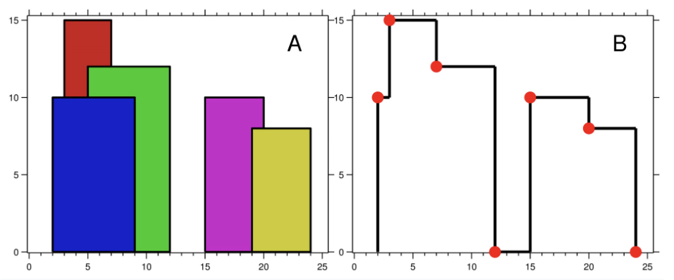




> Question



```txt
Input: buildings = [[2,9,10],[3,7,15],[5,12,12],[15,20,10],[19,24,8]]
Output: [[2,10],[3,15],[7,12],[12,0],[15,10],[20,8],[24,0]]
```




```py
from heapq import heappush, heappop
def getSkyline(self, buildings):
  # add start-building events,add end-building (with 0 height), sort events in l->ri
  events = [(L, -H, R) for L, R, H in buildings]
  events += list({(R, 0, 0) for _, R, _ in buildings})
  events.sort()

  # res: result, [x, height]
  # live: heap, [-height, ending position]
  res = [[0, 0]]
  live = [(0, float("inf"))]
  for pos, negH, R in events:
    # 1, pop buildings that are already ended
    # 2, if it's start-building event, make building alive
    # 3, if previous keypoint height != current highest height, edit result
    while live[0][1] <= pos: heappop(live)
    if negH: heappush(live, (negH, R))
    if res[-1][1] != -live[0][0]:
      res += [[pos, -live[0][0]]]
  return res[1:]
```



