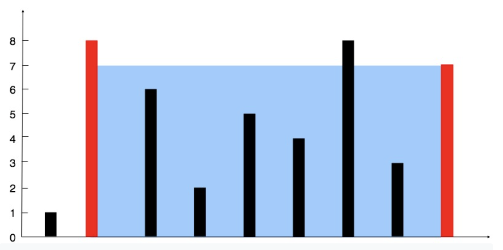




> Question

* Find two lines, which, together with the x-axis forms a container, such that the container contains the most water



```txt
Input: height = [4,3,2,1,4]
Output: 16
```




```py
def maxArea(self, height):
  i, j = 0, len(height) - 1
  water = 0
  while i < j:
    water = max(water, (j - i) * min(height[i], height[j]))
    if height[i] < height[j]:
      i += 1
    else:
      j -= 1
  return water
```



