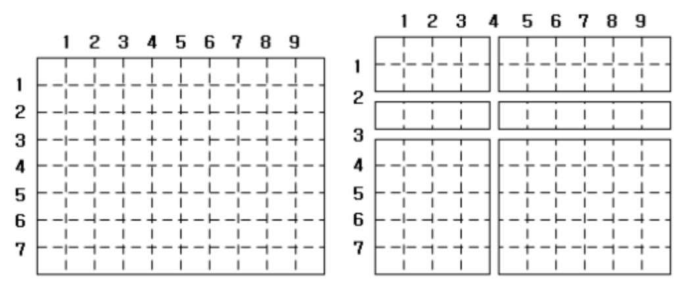

# Sort

> baekjoon

* [Level 3 : Presents](http://acmicpc.net/problem/13771)
  * [Update solution](https://github.com/seanhwangg/algorithm/edit/main/method/sort/sort/BJ_13771.md)




> Question

* Print second smallest number up to second floating point

```txt
Input:
6
62.95
18.50
17.49
26.30
58.95
22.25

Output: 18.50
```




```py
N = int(input())
print(f"{sorted([float(input()) for _ in range(N)])[1]:.2f}")
```




* [Level 4 : 공 바꾸기](http://acmicpc.net/problem/10813)
  * [Update solution](https://github.com/seanhwangg/algorithm/edit/main/method/sort/sort/BJ_10813.md)




> Question

* From now on, choose two baskets M and exchange the balls in the two baskets
* Find what ball is in each basket after changing ball number M

```txt
Input:
5 4
1 2
3 4
1 4
2 2

Output: 3 1 4 2 5
```




```py
n, m = map(int, input().split())
l = [i + 1 for i in range(n)]
for _ in range(m):
  a, b = map(int, input().split())
  l[a-1], l[b-1] = l[b-1], l[a-1]
print(*l)
```




* [Level 4 : ABC](http://acmicpc.net/problem/3047)
  * [Update solution](https://github.com/seanhwangg/algorithm/edit/main/method/sort/sort/BJ_3047.md)




> Question

* A, B, and C are given. A is smaller than B and B is smaller than C
* From the input, print it out in the order given

```txt
Input: 1 5 3
Output: ABC
```




```py
li = list(sorted(map(int, input().split())))
dic = {'A' : 0, 'B' : 1, 'C' : 2}
order = input()
print(li[dic[order[0]]], li[dic[order[1]]], li[dic[order[2]]])
```




* [Level 4 : 대표값2](http://acmicpc.net/problem/2587)
  * [Update solution](https://github.com/seanhwangg/algorithm/edit/main/method/sort/sort/BJ_2587.md)




> Question

* find average and median of five natural numbers

```txt
Input:
10
40
30
60
30

Output:
34
30
```




```js
var n = require('fs').readFileSync('/dev/stdin').toString().trim().split('\n');
n = n.map(e => parseInt(e)).sort();
var s = 0;
for(var i = 0; i < n.length; ++i) {
  s += n[i];
}
console.log((s / n.length) + '\n' + n[2]);
```




```py
li = [int(input()) for _ in range(5)]
li.sort()
print(sum(li) // 5)
print(li[2])
```




* [Level 5 : 수 정렬하기](http://acmicpc.net/problem/2750)
  * [Update solution](https://github.com/seanhwangg/algorithm/edit/main/method/sort/sort/BJ_2750.md)

[//]: # (BJ_2751)

* [Level 5 : 카드 바꿔치기](http://acmicpc.net/problem/18766)
  * [Update solution](https://github.com/seanhwangg/algorithm/edit/main/method/sort/sort/BJ_18766.md)




> Question

* Check if two lists contains same elements

```txt
Input:
4
5
R0 B9 R5 Y3 R2
R0 B8 R6 Y3 R2
1
R0
R0
3
R1 R0 R0
R0 R1 R1
3
R1 R1 R0
R0 R1 R1

Output:
CHEATER
NOT CHEATER
CHEATER
NOT CHEATER
```




```cpp
#include <bits/stdc++.h>
using namespace std;
int main() {
  int T; cin >> T;
  while(T--) {
    int N; cin >> N;
    vector<string> v(N), v2(N);
    for (auto &i : v)cin >> i;
    for (auto &i : v2)cin >> i;
    sort(v.begin(), v.end());
    sort(v2.begin(), v2.end());
    if (v == v2) cout << "NOT CHEATER\n";
    else cout << "CHEATER\n";
  }
}
```




```py
for _ in range(int(input())):
  input()
  a=list(input().split())
  b=list(input().split())
  a.sort()
  b.sort()
  print('NOT '*int(a==b)+'CHEATER')
```




* [Level 5 : 애너그램](http://acmicpc.net/problem/6996)
  * [Update solution](https://github.com/seanhwangg/algorithm/edit/main/method/sort/sort/BJ_6996.md)




> Question

* Print if A, B are anagrams

```txt
Input:
3
blather reblath
maryland landam
bizarre brazier

Output:
blather & reblath are anagrams.
maryland & landam are NOT anagrams.
bizarre & brazier are anagrams.
```




```py
for i in range(int(input())):
  A,B = map(str,input().split())
  if sorted(A) == sorted(B):
    print(A, "&", B, 'are anagrams.')
  else:
    print(A, "&", B, 'are NOT anagrams.')
```




* [Level 5 : 단어 퍼즐](http://acmicpc.net/problem/9946)
  * [Update solution](https://github.com/seanhwangg/algorithm/edit/main/method/sort/sort/BJ_9946.md)




> Question

* For each line, check if two string are anagram

```txt
Input:
testing
intestg
abc
aabbbcccc
abcabcbcc
aabbbcccc
abc
xyz
END
END

Output:
Case 1: same
Case 2: different
Case 3: same
Case 4: different
```




```py
i = 1
while True:
  a, b = input(), input()
  if a == b == 'END':
    break
  if sorted(a) == sorted(b):
    print(f'Case {i}: same')
  else:
    print(f'Case {i}: different')
  i += 1
```




* [Level 6 : 종이자르기](http://acmicpc.net/problem/2628)
  * [Update solution](https://github.com/seanhwangg/algorithm/edit/main/method/sort/sort/BJ_2628.md)




> Question



* Given all cuts (0-horizontal, 1-vertical), find maximum area




```py
n,m = map(int,input().split())
x, y = [n], [m]
for _ in range(int(input())):
  a,b = map(int,input().split())
  if(a == 0):
    y.append(b)
  elif(a == 1):
    x.append(b)

x.sort()
y.sort()

X = [x[0]] + [x[i]-x[i-1] for i in range(1,len(x))]
Y = [y[0]] + [y[i]-y[i-1] for i in range(1,len(y))]
print(max(X)*max(Y))
```




* [Level 6 : 수 정렬하기 2](http://acmicpc.net/problem/2751)
  * [Update solution](https://github.com/seanhwangg/algorithm/edit/main/method/sort/sort/BJ_2751.md)




> Question

* Print list in ascending order

```txt
Input:
5
5
2
3
4
1

Output:
1
2
3
4
5
```




```py
import sys
input = sys.stdin.readline
li = [int(input()) for _ in range(int(input()))]
for n in sorted(li):
  print(n)
```




* [Level 6 : 배열 합치기](http://acmicpc.net/problem/11728)
  * [Update solution](https://github.com/seanhwangg/algorithm/edit/main/method/sort/sort/BJ_11728.md)




> Question

* Print combined list in order

```txt
Input:
2 2
3 5
2 9

Output: 2 3 5 9
```




```cpp
#include <bits/stdc++.h>

using namespace std;

int a[2000001];
int n, m;

int main() {
  cin >> n >> m;
  for (int i = 0; i < n + m; i++) {
    cin >> a[i];
  }
  sort(a, a + n + m);
  for (int i = 0; i < n + m; i++) {
    cout << a[i] << ' ';
  }
}
```




```py
input()
li1, li2 = list(map(int, input().split())), list(map(int, input().split()))
print(*sorted(li1 + li2))
```




* [Level 6 : 성적 통계](http://acmicpc.net/problem/5800)
  * [Update solution](https://github.com/seanhwangg/algorithm/edit/main/method/sort/sort/BJ_5800.md)




> Question

* first line, "Class X" is printed
* X is the number of the class, increasing from 1 in the order given by the input
* second line, output largest adjacent score difference when highest, lowest score, and grades are sorted in descending order

```txt
Input:
2
5 30 25 76 23 78
6 25 50 70 99 70 90

Output:
Class 1
Max 78, Min 23, Largest gap 46
Class 2
Max 99, Min 25, Largest gap 25
```




```cpp
#include <bits/stdc++.h>

using namespace std;
int arr[50];

int main() {
  int t;
  scanf("%d", &t);

  for (int tt = 1; tt <= t;++tt) {
    int n;
    cin >> n;
    for (int i = 0; i < n;++i)
      cin >> arr[i];
    sort(arr, arr + n);

    int mx = 0;
    for (int i = 1; i < n; ++i)
      mx = max(mx, arr[i] - arr[i - 1]);

    printf("Class %d\nMax %d, Min %d, Largest gap %d\n", tt, arr[n - 1], arr[0], mx);
  }

  return 0;
}
```




```py
for i in range(1,int(input())+1):
  print("Class %d"%i)
  n,*a=map(int,input().split())
  a.sort()
  print(f"Max {a[-1}, Min {a[0]}, Largest gap {max(a[j+1]-a[j] for j in range(n-1))}")
```




* [Level 6 : 인기 투표](http://acmicpc.net/problem/11637)
  * [Update solution](https://github.com/seanhwangg/algorithm/edit/main/method/sort/sort/BJ_11637.md)




> Question

* "majority winner R" for the majority of the votes, "minority winner R" for less than half of the votes
* "no winner" for no more than one person with the most votes
* R means the candidate number for the most votes, and the candidate number is given as 1, 2, . . and n in each case

```txt
Input:
4
3
10
21
10
3
20
10
10
3
10
10
10
4
15
15
15
45

Output:
majority winner 2
minority winner 1
no winner
minority winner 4
```




```py
t = int(input())
for _ in range(t):
  n = int(input())
  votes_list = []
  for i in range(n):
    votes_list.append(int(input()))
  x, y = sorted(votes_list)[-2:]
  if x == y:
    print("no winner")
  else:
    v = sum(votes_list)
  if y / v > 0.5:
    print(f"majority winner {votes_list.index(y) + 1}")
  else:
    print(f"minority winner {votes_list.index(y) + 1}")
```




* [Level 6 : K번째 수](http://acmicpc.net/problem/11004)
  * [Update solution](https://github.com/seanhwangg/algorithm/edit/main/method/sort/sort/BJ_11004.md)




> Question

* When A is sorted in ascending order, find the K-th number from the front

```txt
Input:
5 2
4 1 2 3 5

Output: 2
```




```py
k = int(input().split()[1])
print(sorted(map(int,input().split()))[k-1])
```




* [Level 7 : 접미사 배열](http://acmicpc.net/problem/11656)
  * [Update solution](https://github.com/seanhwangg/algorithm/edit/main/method/sort/sort/BJ_11656.md)




> Question

* When given the string S, sorts all suffixes alphabetically and then prints them out

```txt
Input:
baekjoon

Output:
aekjoon
baekjoon
ekjoon
joon
kjoon
n
on
oon
```




```py
S = str(input())
li = []
for _ in S:
  li.append(S)
  S = S[1:]
for i in sorted(li):
  print(i)
```




* [Level 7 : 순서쌍의 곱의 합](http://acmicpc.net/problem/13900)
  * [Update solution](https://github.com/seanhwangg/algorithm/edit/main/method/sort/sort/BJ_13900.md)




> Question

* Find the sum of the two numbers in all cases in which two of the N integers are drawn from different locations

```txt
Input:
4
1 2 3 4

Output: 35
```




```py
N = int(input())
nums = list(map(int, input().split()))
sum_ = sum(nums)
result = 0
for num in nums:
  sum_ -= num
  result += num * sum_
print(result)
```




* [Level 12 : 전화번호 목록](http://acmicpc.net/problem/5052)
  * [Update solution](https://github.com/seanhwangg/algorithm/edit/main/method/sort/sort/BJ_5052.md)




> Question

* Print out if one number is sometimes a prefix for another number

```txt
Input:
2
3
911
97625999
91125426
5
113
12340
123440
12345
98346

Output:
NO
YES
```




```py
for _ in range(int(input())):
  n = int(input())
  li = [input() for _ in range(n)]
  li.sort()
  for i, j in zip(li, li[1:]):
    if i == j[:len(i)]:
      print("NO")
      break
  else:
    print("YES")
```




> leetcode

* [Level Medium : Maximum Score From Removing Stones](https://leetcode.com/problems/maximum-score-from-removing-stones)
  * [Update solution](https://github.com/seanhwangg/algorithm/edit/main/method/sort/sort/LC_1753.md)




> Question

* Begin with three piles of stones of sizes a​​​​​​, b,​​​​​​ and c​​​​​​ respectively
* Each turn you choose two different non-empty piles, take one stone from each, and add 1 point to your score
* The game stops when there are fewer than two non-empty piles
* return the maximum score you can get




```py
def maximumScore(self, a: int, b: int, c: int) -> int:
  a, b, c = sorted([a, b, c])
  return (a + b + c) // 2 if a + b >= c else a + b
```




* [Level Medium : Shortest Unsorted Continuous Subarray](https://leetcode.com/problems/shortest-unsorted-continuous-subarray)
  * [Update solution](https://github.com/seanhwangg/algorithm/edit/main/method/sort/sort/LC_581.md)




> Question

* Given an array, find a continuous subarray that if you sort this subarray, then the whole array will be sorted
* Return the shortest such subarray and output its length

```txt
Input: nums = [2,6,4,8,10,9,15]
Output: 5
```




```py
def findUnsortedSubarray(self, nums):
  start, end = -1, 0
  left_prev, right_prev = nums[0], nums[start]

  for i in range(1, len(nums)):
    # find largest index not in place
    if nums[i] < left_prev:
      end = i
    else:
      left_prev = nums[i]

    # find smallest index not in place
    if right_prev < nums[~i]:
      start = ~i
    else:
      right_prev = nums[~i]

  return 0 if end == 0 else end - (len(nums) + start) + 1
```




## Sorted

> baekjoon

* [Level 2 : X に最も近い値](http://acmicpc.net/problem/18414)
  * [Update solution](https://github.com/seanhwangg/algorithm/edit/main/method/sort/sorted/BJ_18414.md)




> Question

* Print middle number from three integer

```txt
Input: 1 5 3
Output: 3
```




```py
a, b, c = sorted(map(int, input().split()))
print(b)
```




* [Level 2 : 試験](http://acmicpc.net/problem/18411)
  * [Update solution](https://github.com/seanhwangg/algorithm/edit/main/method/sort/sorted/BJ_18411.md)




> Question

* Given three integers print sum of larger two

```txt
Input: 3 5 1
Output: 8
```




```py
a, b, c = sorted(map(int, input().split()))
print(b + c)
```




* [Level 2 : 2 番目に大きい整数](http://acmicpc.net/problem/20976)
  * [Update solution](https://github.com/seanhwangg/algorithm/edit/main/method/sort/sorted/BJ_20976.md)

[//]: # (BJ_18414)

* [Level 2 : 팀 나누기](http://acmicpc.net/problem/13866)
  * [Update solution](https://github.com/seanhwangg/algorithm/edit/main/method/sort/sorted/BJ_13866.md)




> Question

* Given four numbers, find minimum difference of two pair

```txt
Input: 4 7 10 20
Output: 7
```




```py
a, b, c, d = sorted(map(int, input().split()))
print(abs(d + a - (b + c)))
```




* [Level 2 : 세수정렬](http://acmicpc.net/problem/2752)
  * [Update solution](https://github.com/seanhwangg/algorithm/edit/main/method/sort/sorted/BJ_2752.md)




> Question

* Print three number in sorted order

```txt
Input: 3 1 2
Output: 1 2 3
```




```py
a, b, c = sorted(map(int, input().split()))
print(a, b c)
```




* [Level 3 : 네 번째 수](http://acmicpc.net/problem/2997)
  * [Update solution](https://github.com/seanhwangg/algorithm/edit/main/method/sort/sorted/BJ_2997.md)




> Question

* When the four are aligned, the difference between adjacent pairs is constant
* When three of the four numbers are given, write a program to get the fourth number

```txt
Input: 4 6 8
Output: 10
```




```py
a, b, c = sorted(map(int,input().split()))
if b - a == c - b:
  print(2 * c - b)
elif b - a < c - b:
  print((b + c) // 2)
else:
  print((a + b) // 2)
```




* [Level 4 : 주사위 네개](http://acmicpc.net/problem/2484)
  * [Update solution](https://github.com/seanhwangg/algorithm/edit/main/method/sort/sorted/BJ_2484.md)




> Question

* if 4 (a) are same : 50000 + a * 5000
* If 3 (a) are same : 10000 + a * 1000
* If two pair of 2 are same (a a b b) : 2000 + (a + b) * 500
* If 2 (a) are same : 1000 + a * 100
* else : max(a, b, c, d) * 100

```txt
Input:
4
3 3 3 3
3 3 6 3
2 2 6 6
6 2 1 5

Output: 65000
```




```py
m=0
for _ in range(int(input())):
  a,b,c,d=sorted(map(int,input().split()))
  if a==d: s=50000+a*5000
  elif a==c or b==d: s=10000+b*1000
  elif a==b and c==d: s=2000+a*500+c*500
  elif a==b or b==c: s=1000+b*100
  elif c==d: s=1000+c*100
  else: s=d*100
  if m<s: m=s
print(m)
```




* [Level 8 : ATM](http://acmicpc.net/problem/11399)
  * [Update solution](https://github.com/seanhwangg/algorithm/edit/main/method/sort/sorted/BJ_11399.md)




> Question

* Minimize total wait time

```txt
Input:
5
3 1 4 3 2

Output: 32
```




```py
b = t = 0
for i in sorted(map(int,[*open(0)][1].split())):
  b += i
  t += b
print(t)
```




## Algorithm

> Selction Sort

```py
def selection_sort(a1 … an):
  for i in range(1, n - 1):
    am = minimum(ai, ..., an)
    swap ai and am
```

* Loop invariant: After t loop, the first t elements are (1) sorted, (2) minimum
* Base: It is true when t = 0, because there is no element
* Inductive Hypothesis: For some t iterations, the first t elements are (1) sorted, (2) minimum

* SIH: For k iteration where k = 1 … t, the k elements are (1) sorted, (2) minimum
* WTS: For t + 1 iteration, the first t + 1 elements are (1) sorted, (2) minimum

* During (t + 1)st iteration, algorithm finds am, minimum value of at+1, …, am and swap with at+1
* So, after the (t + 1)st iteration, at+1 is the minimum value of at+1, ..., an

* We have a1, ..., at are all less than at+1 and at+1 is minimum of at+1, ..., an ⇒  (1)
* We have a1, …, at are in the sorted order and all less than at+1 ⇒ (2)

* Therefore: for any 0 ≤ t ≤ n - 1, the loop invariant is true after t iterations

* Since we execute loop exactly n times
* loop invariant with t = n guarantees that all n elements of list will be in correct order at the end of algorithm

> Quicksort

* quick select can be used to find nth largest element in average of O(n) time




```py
quicksort(a[1...n])
  if n <= 1 : return a
  set v to be a random element in a.
  Partition a into SL, SV, SR
  return quicksort(SL) + SV + quicksort(SR)
```




> baekjoon

* [Level 6 : 수 정렬하기 3](http://acmicpc.net/problem/10989)
  * [Update solution](https://github.com/seanhwangg/algorithm/edit/main/method/sort/sort-algorithm/BJ_10989.md)




> Question

* Given N numbers print in ascending order

```txt
Input:
10
5
2
3
1
4
2
3
5
1
7

Output:
1
1
2
2
3
3
4
5
5
7
```




```py
import sys
a = int(input())
dic = {}
for _ in range(a):
  n = int(sys.stdin.readline())
  if n in dic:
    dic[n] += 1
  else:
    dic[n] = 1
for n in sorted(dic.keys()):
  for _ in range(dic[n]):
    print(n)
```




> leetcode

* [Level Hard : Maximum Gap](https://leetcode.com/problems/maximum-gap)
  * [Update solution](https://github.com/seanhwangg/algorithm/edit/main/method/sort/sort-algorithm/LC_164.md)




> Question

* Given an integer array nums, return maximum difference between two successive elements in its sorted form
* If the array contains less than two elements, return 0

```txt
Input: nums = [3,6,9,1]
Output: 3
```




```py
class Solution:
  def maximumGap(self, num):
    if len(num) < 2 or min(num) == max(num):
      return 0
    mn, mx = min(num), max(num)
    size = (mx - mn) // (len(num)-1) or 1
    bucket = [[math.inf, -math.inf] for _ in range((mx - mn) // size + 1)]
    for n in num:
      mx = bucket[(n - mn) // size]
      mx[0] = min(mx[0], n)
      mx[1] = max(mx[1], n)
    bucket = [mx for mx in bucket if mx[0] != math.inf]
    return max(bucket[i][0] - bucket[i - 1][1] for i in range(1, len(bucket)))
```




### Merge Sort




```text
procedure MergeSort(a1, …, an):
  if n == 0:
    return ()
  if n == 1:
    return (a1)
  m = ⌊n | 2⌋
  L1 = MergeSort(a1, …, am)
  L2 = MergeSort(am+1, …, an)
  return RMerge(L1, L2)

procedure RMerge(a1, …, ak, b1, …, bl: sorted lists)
  if first list is empty:  return b1, …, bl
  if second list is empty: return a1, …, ak
  if a1 ≤ b1:  return a1 · RMerge(a2, …, ak, b1, …, bl)
  else:        return b1 · RMerge(a1, …,ak, b2, …, bl)
```




* Base : Suppose n=0. Then both lists are empty. Vacuously true
* Induction : Suppose n ≥ 1 and RMerge(a1, ..., ak, b1,...,bl) returns a sorted list containing
* all elements from either list whenever k + l = n - 1
* WTS : RMerge(a1, ..., ak, b1, ..., bl) returns a sorted list containing all elements from either list
* whenever k + l = n

* Inductive step
  * Case 1: at least one of the lists is empty
    * Similar to base case. In the first or second line, return all of the elements, in sorted order
  * Case 2 : neither list empty and a1 ≤ b1
    * Since both lists are sorted, this means a1 is the smallest overall. The total size of the input of
    * RMerge(a2, ... , ak, b1, ... , bl) is (k - 1) + l = n - 1 so by the IH, it returns a sorted list containing all
    * elements from either list. Adding a1 to the start maintains the order and gives a sorted list with all
  * elements
  * Case 3 : neither list empty and b1 ≤ a1
    * WLOG same as case 2

* Strong Induction
  * Base case : Suppose n=0. Then, return the empty list, (trivially) sorted
  * SIH : MergeSort correctly sorts all lists with k elements, for any 0 ≤ k < n
  * Goal : prove that MergeSort(a1, ..., an) returns a sorted list containing all n elements
  * Induction Step : Suppose n=1. Then, return a1, a (trivially) sorted list containing all elements

> baekjoon

* [Level 15 : 버블 소트](http://acmicpc.net/problem/1517)
  * [Update solution](https://github.com/seanhwangg/algorithm/edit/main/method/sort/merge-sort/BJ_1517.md)




> Question

* Count number of swap during bubble sort

```txt
Input:
3
3 2 1

Output: 3
```




```py
import sys
input = sys.stdin.readline
sys.setrecursionlimit(10 ** 9)

def merge_sort(start, end):
  global swap
  size = end - start
  mid = (start + end) // 2
  if size <= 1:
    return
  merge_sort(start, mid)
  merge_sort(mid, end)

  new_arr = []
  idx1, idx2 = start, mid
  cnt = 0
  while idx1 < mid and idx2 < end:
    if arr[idx1] > arr[idx2]:
      new_arr.append(arr[idx2])
      idx2, cnt = idx2 + 1, cnt + 1
    else:
      new_arr.append(arr[idx1])
      idx1, swap = idx1 + 1, swap + cnt

  while idx1 < mid:
    new_arr.append(arr[idx1])
    idx1, swap = idx1 + 1, swap + cnt
  while idx2 < mid:
    new_arr.append(arr[idx2])
    idx2 += 1

  for t in range(len(new_arr)):
    arr[start + t] = new_arr[t]

n = int(input())
arr = list(map(int, input().split()))
swap = 0
merge_sort(0, n)
print(swap)
```




> leetcode

* [Level Hard : Count of Range Sum](https://leetcode.com/problems/count-of-range-sum)
  * [Update solution](https://github.com/seanhwangg/algorithm/edit/main/method/sort/merge-sort/LC_327.md)




> Question

* Given an integer array nums and two integers lower and upper, return # range sums that lie in [lower, upper] inclusive
* Range sum S(i, j) is defined as the sum of the elements in nums between indices i and j inclusive, where i <= j

```txt
Input: nums = [-2,5,-1], lower = -2, upper = 2
Output: 3  # [0,0], [2,2], and [0,2]
```




```py
def countRangeSum(self, nums, lower, upper):
  first = [0]
  for num in nums:
    first.append(first[-1] + num)
  def sort(lo, hi):
    mid = (lo + hi) / 2
    if mid == lo:
      return 0
    count = sort(lo, mid) + sort(mid, hi)
    i = j = mid
    for left in first[lo:mid]:
      while i < hi and first[i] - left < lower: i += 1
      while j < hi and first[j] - left <= upper: j += 1
      count += j - i
    first[lo:hi] = sorted(first[lo:hi])
    return count
  return sort(0, len(first))
```




## Key

> baekjoon

* [Level 4 : 음계](http://acmicpc.net/problem/2920)
  * [Update solution](https://github.com/seanhwangg/algorithm/edit/main/method/sort/sort-key/BJ_2920.md)




> Question

* Print if number is ascending / descending or mixed

```txt
Input: 1 2 3 4 5 6 7 8
Output: ascending
```




```py
li = list(map(int, input().split()))
if li == sorted(li):
  print("ascending")
elif li == sorted(li, reverse=True):
  print("descending")
else:
  print("mixed")
```




* [Level 4 : 대표값](http://acmicpc.net/problem/2592)
  * [Update solution](https://github.com/seanhwangg/algorithm/edit/main/method/sort/sort-key/BJ_2592.md)




> Question

* find the average and the lowest value of ten natural numbers

```txt
Input:
10
40
30
60
30
20
60
30
40
50

Output: 37 30
```




```py
numbers = [int(input()) for i in range(10)]
print(sum(numbers)//10)
print(max(numbers, key = numbers.count))
```




* [Level 5 : Q-인덱스](http://acmicpc.net/problem/13333)
  * [Update solution](https://github.com/seanhwangg/algorithm/edit/main/method/sort/sort-key/BJ_13333.md)




> Question

* Print k index
* Of n papers published, k if more than k papers cited and remaining n-k papers cited is less than k

```txt
Input:
5
8 4 5 3 10

Output: 4
```




```py
input()
q = 0
for e in sorted(map(int,input().split()), reverse=True):
  q += e > q
print(q)
```




* [Level 5 : 카우버거](http://acmicpc.net/problem/15720)
  * [Update solution](https://github.com/seanhwangg/algorithm/edit/main/method/sort/sort-key/BJ_15720.md)




> Question

* Number of burgers, sides, drinks are given
* Prices of each item is also given
* If all bought together 10% is discounted, print total sum

```txt
Input:
3 3 2
2000 3000 2500
800 1300 1000
500 1000

Output:
12100
11170
```




```py
a,b,c=map(int,input().split())
x = sorted(map(int,input().split()),reverse=True)
y = sorted(map(int,input().split()),reverse=True)
z = sorted(map(int,input().split()),reverse=True)
ans = sum(x)+sum(y)+sum(z)
print(ans)
for i in range(min([len(x),len(y),len(z)])):
  ans-=(x[i]+y[i]+z[i])//10
print(ans)
```




* [Level 6 : Yangjojang of The Year](http://acmicpc.net/problem/11557)
  * [Update solution](https://github.com/seanhwangg/algorithm/edit/main/method/sort/sort-key/BJ_11557.md)




> Question

* print university with most alchohol consumption

```txt
Input:
2
3
Yonsei 10
Korea 10000000
Ewha 20
2
Yonsei 1
Korea 10000000

Output:
Korea
Korea
```




```py
T = int(input())
for _ in range(T):
  N = int(input())
  alcohol = []
  for _ in range(N):
    S, L = map(str, input().split())
    alcohol.append([S,int(L)])
  alcohol = sorted(alcohol, key = lambda x: x[1])
  print(alcohol[-1][0])
```




* [Level 6 : 단어 정렬](http://acmicpc.net/problem/1181)
  * [Update solution](https://github.com/seanhwangg/algorithm/edit/main/method/sort/sort-key/BJ_1181.md)




> Question

* Sort by following rules
  * Starting with the shorter length
  * If the length is equal, in alphabetical order

```txt
Input:
13
but
i
wont
hesitate
no
more
no
more
it
cannot
wait
im
yours

Output:
i
im
it
no
but
more
wait
wont
yours
cannot
hesitate
```




```cpp
#include <bits/stdc++.h>
using namespace std;
set<pair<int, string>> se;
int main() {
  int n; cin >> n;
  for (int i = 0; i < n; i++) {
    string s; cin >> s;
    se.insert({ s.size(), s });
  }
  for (auto i : se) cout << i.second << endl;
}
```




```java
import java.util.*;

public class Main {
  public static void main(String[] args) {
    Scanner sc = new Scanner(System.in);
    int N = sc.nextInt();
    TreeSet<String> set = new TreeSet<>(Comparator.comparingInt(String::length).thenComparing(String::compareTo));

    while (N-- > 0) set.add(sc.next());
    set.forEach(System.out::println);
  }
}
```




```js
let n = require('fs').readFileSync('/dev/stdin').toString().trim().split('\n')
n.shift()
n.sort((a, b) => a.length-b.length || a.localeCompare(b))
Array.from(new Set(n)).forEach(v => console.log(v))
```




```py
n_test = int(input())
se = set()
for _ in range(n_test):
  se.add(input())
for w in sorted(se, key=(lambda x: (len(x), x))):
  print(w)
```




* [Level 6 : 소트인사이드](http://acmicpc.net/problem/1427)
  * [Update solution](https://github.com/seanhwangg/algorithm/edit/main/method/sort/sort-key/BJ_1427.md)




> Question

* Print number by digits in descending order

```txt
Input: 2143
Output: 4321
```




```sh
arr=(0 0 0 0 0 0 0 0 0 0)

read N
for (( i=0; i<${#N}; ++i )); do
  let "arr[${N:i:1}] += 1"
done

for (( i=9; i>=0; --i )); do
  while (( arr[i]-- )); do
    echo -n $i
  done
done
```




```py
a = input()
print("".join(sorted(a, reverse=True)))
```




* [Level 6 : 그룹 단어 체커](http://acmicpc.net/problem/1316)
  * [Update solution](https://github.com/seanhwangg/algorithm/edit/main/method/sort/sort-key/BJ_1316.md)




> Question

* A group word is for all characters present in a word, only if each character appears in a series
* For example
  * ccazzzb is a group word because c, a, z, and b are all continuous, and kin are also continuous, k, i, and n
  * aabbbccb is not a group word because b is shown separately
* Find the number of group words

```txt
Input:
3
happy
new
year

Output: 3
```




```py
n=int(input())
ans=n
for i in range(n):
  tmp=input()
  if list(tmp) != sorted(tmp, key = tmp.find): ans-=1
print(ans)
```




* [Level 6 : 나이순 정렬](http://acmicpc.net/problem/10814)
  * [Update solution](https://github.com/seanhwangg/algorithm/edit/main/method/sort/sort-key/BJ_10814.md)




> Question

* print age and name in each line, in the order of age
* If ages are same, do not change order

```txt
Input:
3
21 Junkyu
21 Dohyun
20 Sunyoung
Output:
20 Sunyoung
21 Junkyu
21 Dohyun
```




```cpp
#include <bits/stdc++.h>
char str[100000][101];
int main() {
  vector<std::pair<int,int> > V;
  int n,i,a;
  scanf("%d", &n);
  for(i=0;i<n;i++) {
    scanf("%d %s", &a, str[i]);
    V.push_back({a,i});
  }
  std::sort(V.begin(), V.end());
  for(i=0;i<n;i++)
    printf("%d %s\n", V[i].first, str[V[i].second]);
}
```




```py
import sys
n_test = int(sys.stdin.readline())
li = []
for _ in range(n_test):
  age, name = input().split()
  li.append((int(age), name))
for age, name in sorted(li, key=(lambda x: x[0])):
  print(age, name)
```




* [Level 6 : 도비의 난독증 테스트](http://acmicpc.net/problem/2204)
  * [Update solution](https://github.com/seanhwangg/algorithm/edit/main/method/sort/sort-key/BJ_2204.md)




> Question

* Print lexicographically (without case) first character

```txt
Input:
3
Cat
fat
bAt
4
call
ball
All
Hall
0

Output:
bAt
All
```




```py
while True:
  a = int(input())
  if a == 0:
    break
  print(min([input() for _ in range(a)], key = lambda a : a.lower()))
```




* [Level 6 : 이장님 초대](http://acmicpc.net/problem/9237)
  * [Update solution](https://github.com/seanhwangg/algorithm/edit/main/method/sort/sort-key/BJ_9237.md)




> Question

* Given n tree seedlings that takes a day to plant, and it takes Ti days to grow each
* Find the earliest day when the last tree grows

```txt
Input:
4
2 3 4 3

Output: 7
```




```py
N = int(input())
tree = sorted(list(map(int, input().split())), reverse = True)
answer = 0
for i, j in enumerate(tree):
  answer = max(answer, i + j + 2)
print(answer)
```




* [Level 7 : 보물](http://acmicpc.net/problem/1026)
  * [Update solution](https://github.com/seanhwangg/algorithm/edit/main/method/sort/sort-key/BJ_1026.md)




> Question

* rearrange list and minimize following equation

$$ S = A[0]×B[0] + ... + A[N-1]×B[N-1] $$

```txt
Input:
5
1 1 1 6 0
2 7 8 3 1

Output: 18
```




```py
n = int(input())
li1 = sorted(map(int, input().split()))
li2 = sorted(map(int, input().split()), reverse=True)
ret = 0
for n1, n2 in zip(li1, li2):
  ret += n1 * n2
print(ret)
```




* [Level 13 : 컬러볼](http://acmicpc.net/problem/10800)
  * [Update solution](https://github.com/seanhwangg/algorithm/edit/main/method/sort/sort-key/BJ_10800.md)




> Question

* Each player's goal is to capture a ball that is smaller than his or her own ball and has a score of the size of the ball
* Given the color and size of the balls, find the sum of all the balls that each player can capture

```txt
Input:
4
1 10
3 15
1 3
4 8

Output:
8
21
0
3
```




```cpp
#include <bits/stdc++.h>

using namespace std;

typedef struct info {
  int color, size, index;
}info;

int n, ans[10000000], sum[10000000], total;
vector<info> v;

bool cmp(const info & a, const info & b) {
  return a.size < b.size;
}

int main() {
  scanf("%d", &n);
  int c, s;

  for (int i = 0; i < n; i++) {
    scanf("%d %d", &c, &s);
    v.push_back({ c, s, i });
  }

  sort(v.begin(), v.end(), cmp);

  int vs = v.size();

  for (int i = 0; i < vs; i++) {
    int idx = i;

    while (idx < vs && v[i].size == v[idx].size)
      ++idx;

    for (int j = i; j < idx; j++)
      ans[v[j].index] = total - sum[v[j].color];

    for (int j = i; j < idx; j++) {
      total += v[j].size;
      sum[v[j].color] += v[j].size;
    }

    i = idx - 1;
  }

  for (int i = 0; i < n; i++)
    printf("%d\n", ans[i]);

  return 0;
}
```




```py
import sys
input = sys.stdin.readline
N = int(input())
balls = []
for i in range(N):
  color, size = map(int, input().split())
  balls.append((size, color, i))
balls.sort()

total = j = 0
answer, sum_by_color = [0] * N, [0] * 200001
for i in range(N):
  while balls[j][0] < balls[i][0]:
    total += balls[j][0]
    sum_by_color[balls[j][1]] += balls[j][0]
    j += 1
  answer[balls[i][2]] = total - sum_by_color[balls[i][1]]
print(*answer, sep='\n')
```




> kattis

* [Level 1.6 : School Spirit](https://open.kattis.com/problems/schoolspirit)
  * [Update solution](https://github.com/seanhwangg/algorithm/edit/main/method/sort/sort-key/KT_schoolspirit.md)




> Question

$$ \frac{1}{5} \sum_{i=0}^{n-1} s_{i} \cdot\left(\frac{4}{5}\right)^{i} $$

* What is the average value of gi over all all n students?

```txt
Input:
3
500
120
75

Output:
128.8
89.06666666666666
```




```py
n_team = int(input())
li = list(sorted([int(input()) for _ in range(n_team)], reverse=True))
score = 0
for i, n in enumerate(li):
  score += n * (0.8 ** i)
print(score / 5)
score = 0
for i, n in enumerate(li):
  up = i
  stay = (n_team - 1 - i)
  score += n * (up * (0.8 ** (i - 1)) + stay * (0.8 ** i))
print(score / 5 / n_team)
```




* [Level 2.4 : Line Them Up](https://open.kattis.com/problems/lineup)
  * [Update solution](https://github.com/seanhwangg/algorithm/edit/main/method/sort/sort-key/KT_lineup.md)




> Question

* 첫줄에 N 그 다음 N 줄에 사람 이름이 주어진다
* 이 때 사람 이름이 알파벳 순서 일시 INCREASING,
* 알파벳 역순 일시 DECREASING, 둘 다 아니면 NEITHER을 출력하라

```txt
Input:
5
JOE
BOB
ANDY
AL
ADAM

Output: DECREASING
```




```py
n = int(input())
li = []
for _ in range(n):
  li.append(input())
if li == sorted(li):
  print("INCREASING")
elif li == sorted(li, reverse=True):
  print('DECREASING')
else:
  print('NEITHER')
```




> leetcode

* [Level Easy : Sort Array By Parity](https://leetcode.com/problems/sort-array-by-parity)
  * [Update solution](https://github.com/seanhwangg/algorithm/edit/main/method/sort/sort-key/LC_905.md)

* [Level Medium : Sort Characters By Frequency](https://leetcode.com/problems/sort-characters-by-frequency)
  * [Update solution](https://github.com/seanhwangg/algorithm/edit/main/method/sort/sort-key/LC_451.md)




> Question

* Given a string s, sort it in decreasing order based on the frequency of characters, and return the sorted string

```txt
Input: s = "tree"
Output: "eert"
```




```cpp
string frequencySort(string s) {
  int freq[256] = {};
  for (unsigned char c : s)
    ++freq[c];

  priority_queue<pair<int,char>> most_freq_chars;
  for (int c = 255; c >= 0; --c)
    most_freq_chars.emplace(freq[c], (char)c);

  string ans;
  ans.reserve(s.length());
  while (!most_freq_chars.empty()) {
    auto [n, c] = most_freq_chars.top();
    ans.append(n, c);
    most_freq_chars.pop();
  }
  return ans;
}
```




* [Level Medium : Merge Intervals](https://leetcode.com/problems/merge-intervals)
  * [Update solution](https://github.com/seanhwangg/algorithm/edit/main/method/sort/sort-key/LC_56.md)




> Question

* merge all overlapping intervals
* return an array of the non-overlapping intervals that cover all the intervals in the input

```txt
Input: intervals = [[1,3],[2,6],[8,10],[15,18]]
Output: [[1,6],[8,10],[15,18]]
```




```py
def merge(self, intervals):
  out = []
  for i in sorted(intervals, key=lambda i: i[0]):
    if out and i[0] <= out[-1][1]:
      out[-1][1] = max(out[-1][1], i[1])
    else:
      out += [i]
  return out
```




### Stable sort

> leetcode

* [Level Easy : Reorder Data in Log Files](https://leetcode.com/problems/reorder-data-in-log-files)
  * [Update solution](https://github.com/seanhwangg/algorithm/edit/main/method/sort/stable-sort/LC_937.md)




> Question

* letter-logs come before all digit-logs
* letter-logs are sorted lexicographically by their contents
  * If their contents are the same, then sort them lexicographically by their identifiers
* digit-logs maintain their relative ordering

```sh
Input: logs = ["dig1 8 1 5 1","let1 art can","dig2 3 6","let2 own kit dig","let3 art zero"]
Output: ["let1 art can","let3 art zero","let2 own kit dig","dig1 8 1 5 1","dig2 3 6"]
```




```cpp
bool comp(string s1, string s2){
  int i1 = s1.find(' ') + 1, i2 = s2.find(' ') + 1;
  if (!isdigit(s1[i1]) && !isdigit(s2[i2]))
    return s1.substr(i1) < s2.substr(i2);
  else
    return !isdigit(s1[i1]);
}
class Solution {
public:
  vector<string> reorderLogFiles(vector<string>& logs) {
    stable_sort(logs.begin(), logs.end(), comp);
    return logs;
  }
};
```




```js
const reorderLogFiles = logs =>
  logs.filter(log => /[a-z]$/.test(log))
      .sort((a, b) =>
        ((aId, aWords, _, bId, bWords) =>
          aWords.localeCompare(bWords) || aId.localeCompare(bId))(
          ...a.split(/\s(.+)/),
          ...b.split(/\s(.+)/),
        ),
      ).concat(logs.filter(log => /\d$/.test(log)));
```




```py
class Solution:
  def reorderLogFiles(self, logs: List[str]) -> List[str]:
    def comp(x):
      y = x.split(' ', 1)
      return (0, y[1], y[0]) if y[1][0].isalpha() else (1,)
    return sorted(a, key=comp)
```




### Combine

* Tuple can be compared in cpp / python

> baekjoon

* [Level 4 : 트럭 주차](http://acmicpc.net/problem/2979)
  * [Update solution](https://github.com/seanhwangg/algorithm/edit/main/method/sort/sort-combine/BJ_2979.md)




> Question

* The parking lot offers a discount on parking fees depending on the number of trucks parked
* For a truck, A won per minute. Pay B won per minute for two cars and C won per minute for three cars
* When A, B, and C are given, and full-time trucks are given parking time, find how much they should pay for parking

```txt
Input:
5 3 1
1 6
3 5
2 8

Output: 33
```




```py
costs = list(map(int, input().split()))
li = []
for _ in range(3):
  e, l = map(int, input().split())
  li.extend([(e, 'e'), (l, 'l')])

ret, cur, last = 0, 0, 0
for time, typ in sorted(li):
  if typ == 'e':
    ret += (time - last) * costs[cur - 1] * cur
    cur += 1
  else:
    ret += (time - last) * costs[cur - 1] * cur
    cur -= 1
  last = time

print(ret)
```




* [Level 6 : 점수 계산](http://acmicpc.net/problem/2822)
  * [Update solution](https://github.com/seanhwangg/algorithm/edit/main/method/sort/sort-combine/BJ_2822.md)




> Question

* Print sum of top 5 scores and their index in sorted order

```txt
Input:
20
30
50
48
33
66
0
64

Output:
261
3 4 5 6 8
```




```py
a = [(int(input()), i+1) for i in range(8)]
s = sorted(a)[-5:]
print(sum(p[0] for p in s))
print(*(sorted(p[1] for p in s)))
```




* [Level 6 : 올림픽](http://acmicpc.net/problem/8979)
  * [Update solution](https://github.com/seanhwangg/algorithm/edit/main/method/sort/sort-combine/BJ_8979.md)




> Question

* a country with more gold medals
* If the number of gold medals is the same, a country with a higher number of silver medals
* Countries with more bronze medals, if both gold and silver medals are the same
* Print out the ranking of the given country

```txt
Input:
4 3
1 1 2 0
2 0 1 0
3 0 1 0
4 0 0 1

Output: 2
```




```py
n, k = map(int, input().split())
medals = [list(map(int, input().split())) for _ in range(n)]
medals.sort(key = lambda x : (x[1], x[2], x[3]), reverse=True)
idx = [medals[i][0] for i in range(n)].index(k)
for i in range(n):
  if medals[idx][1:] == medals[i][1:]:
    print(i+1)
    break
```




* [Level 6 : 좌표 정렬하기 2](http://acmicpc.net/problem/11651)
  * [Update solution](https://github.com/seanhwangg/algorithm/edit/main/method/sort/sort-combine/BJ_11651.md)




> Question

* N points above the two-dimensional plane are given
* Arrange coordinates in the order that (y-coordinate, x-coordinate)

```txt
Input:
5
0 4
1 2
1 -1
2 2
3 3

Output:
1 -1
1 2
2 2
3 3
0 4
```




```py
n = int(input())
li = []
for _ in range(n):
  a, b = map(int, input().split())
  li.append((b, a))
for a, b in sorted(li):
  print(b, a)
```




* [Level 6 : 좌표 정렬하기](http://acmicpc.net/problem/11650)
  * [Update solution](https://github.com/seanhwangg/algorithm/edit/main/method/sort/sort-combine/BJ_11650.md)




> Question

* Arrange coordinates in order of increasing x-coordinates, and if the x-coordinates are equal, then outputs them

```txt
Input:
5
3 4
1 1
1 -1
2 2
3 3

Output:
1 -1
1 1
2 2
3 3
3 4
```




```cpp
#include<bits/stdc++.h>
using namespace std;

int main() {
  int N;
  cin >> N;

  vector<pair<int, int>> data(N);
  for (int i = 0; i < N; i++)
    cin >> data[i].first >> data[i].second;

  sort(data.begin(), data.end());

  for (int i = 0; i < data.size(); i++)
    cout << data[i].first << " " <<data[i].second << "\n";

  return 0;
}
```




```py
n = int(input())
li = []
for _ in range(n):
  a, b = map(int, input().split())
  li.append((a, b))
for a, b in sorted(li):
  print(a, b)
```




* [Level 6 : 생일](http://acmicpc.net/problem/5635)
  * [Update solution](https://github.com/seanhwangg/algorithm/edit/main/method/sort/sort-combine/BJ_5635.md)




> Question

* Print yongest and oldest people

```txt
Input:
5
Mickey 1 10 1991
Alice 30 12 1990
Tom 15 8 1993
Jerry 18 9 1990
Garfield 20 9 1990

Output:
Tom
Jerry
```




```cpp
#include <bits/stdc++.h>

using namespace std;
int main(void) {
  int N;
  cin >> N;
  vector<pair<pair<int, int>, pair<int, string>>> v(N);
  for (int i = 0; i < N; i++) {
    cin >> v[i].second.second >> v[i].second.first >> v[i].first.second >> v[i].first.first;
  }
  sort(v.begin(), v.end());
  cout << v[N-1].second.second << "\n" << v[0].second.second << "\n";
  return 0;
}
```




```py
l = []
for _ in range(int(input())):
  a, b, c, d = input().split()
  l.append((int(d), int(c), int(b), a))
l.sort()
print(l[-1][3])
print(l[0][3])
```




* [Level 7 : 국영수](http://acmicpc.net/problem/10825)
  * [Update solution](https://github.com/seanhwangg/algorithm/edit/main/method/sort/sort-combine/BJ_10825.md)




> Question

* Descending Korean score, ascending English score increases, descending mathematics score, ascending names in ascii

```txt
Input:
12
Junkyu 50 60 100
Sangkeun 80 60 50
Sunyoung 80 70 100
Soong 50 60 90
Haebin 50 60 100
Kangsoo 60 80 100
Donghyuk 80 60 100
Sei 70 70 70
Wonseob 70 70 90
Sanghyun 70 70 80
nsj 80 80 80
Taewhan 50 60 90

Output:
Donghyuk
Sangkeun
Sunyoung
nsj
Wonseob
Sanghyun
Sei
Kangsoo
Haebin
Junkyu
Soong
Taewhan
```




```py
from collections import Counter
li = []
for _ in range(N):
  name, a, b, c = input().split()
  li.append(tuple((-int(a), int(b), -int(c), name)))
for e in sorted(li):
  print(e[3])
n, c = map(int, input().split())
li = input().split()
co = Counter(li)
print(" ".join(sorted(li, key=co.get, reverse=True)))
```




> kattis

* [Level 1.6 : Stacking Cups](https://open.kattis.com/problems/cups)
  * [Update solution](https://github.com/seanhwangg/algorithm/edit/main/method/sort/sort-combine/KT_cups.md)




> Question

* n개 줄에 색 반지름 / 지름 색
* 둘 중 하나의 포맷으로 주어진다. 이 색들을 작은 반지름 순서대로 출력하라

```txt
Input:
3
red 10
10 blue
green 7

Output:
blue
green
red
```




```py
n_line = int(input())
li = []
for _ in range(n_line):
  a, b = input().split()
  if a.isdigit():
    li.append((int(a), b))
  else:
    li.append((int(b) * 2, a))
for _, color in sorted(li):
  print(color)
```



