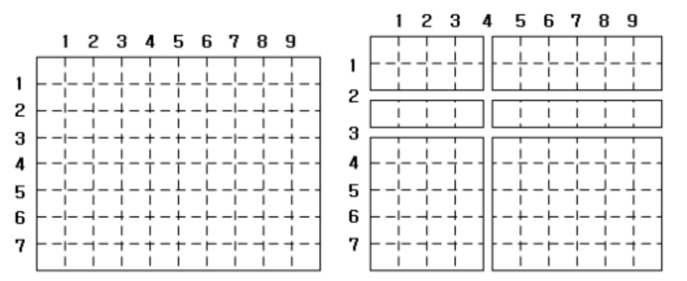




> Question



* Given all cuts (0-horizontal, 1-vertical), find maximum area




```py
n,m = map(int,input().split())
x, y = [n], [m]
for _ in range(int(input())):
  a,b = map(int,input().split())
  if(a == 0):
    y.append(b)
  elif(a == 1):
    x.append(b)

x.sort()
y.sort()

X = [x[0]] + [x[i]-x[i-1] for i in range(1,len(x))]
Y = [y[0]] + [y[i]-y[i-1] for i in range(1,len(y))]
print(max(X)*max(Y))
```



