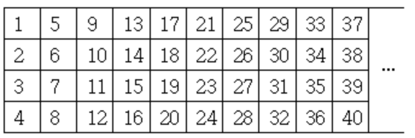

# Conditional




* public int compareTo(Object obj)
  * return 0: if the obj is equal to the other string
  * return < 0: if the obj is less than the other obj
  * return> 0: if the obj is greater than the other obj




## If

> baekjoon

* [Level 2 : 수찬은 마린보이야!!](http://acmicpc.net/problem/15921)
  * [Update solution](https://github.com/seanhwangg/algorithm/edit/main/syntax/conditional/if/BJ_15921.md)




> Question

* a가 0이면 divide by zero, 아니면 1.00을 출력하라

```txt
Input:
5
5 10 10 15 20

Output: 1.00
```




```py
print("divide by zero" if input() == "0" else '1.00')
```




* [Level 2 : CASIO](http://acmicpc.net/problem/15963)
  * [Update solution](https://github.com/seanhwangg/algorithm/edit/main/syntax/conditional/if/BJ_15963.md)




> Question

* print 1 if two integers are same else 0

```txt
Input: 1 1
Output: 1
```




```sh
read a b
echo $((a == b))
```




```py
a, b = map(int, input().split())
print(1 if a == b else 0)
```




* [Level 2 : 윤년](http://acmicpc.net/problem/2753)
  * [Update solution](https://github.com/seanhwangg/algorithm/edit/main/syntax/conditional/if/BJ_2753.md)




> Question

* print 1 if leap year else 0

```txt
Input: 2000
Output: 1
```




```py
n = int(input())
print(1 if n % 4 == 0 and (n % 100 != 0 or n % 400 == 0) else 0)
```




```r
x <- scan("stdin")
cat(ifelse(x[1] %% 4 == 0 & x[1] %% 100 != 0 | x[1] %% 400 == 0, 1, 0))
```




* [Level 2 : Equality](http://acmicpc.net/problem/13985)
  * [Update solution](https://github.com/seanhwangg/algorithm/edit/main/syntax/conditional/if/BJ_13985.md)




> Question

* Print if equation is correct

```txt
Input: 2 + 2 = 5
Output: NO
```




```py
st = input().split()
print('YES' if int(st[0]) + int(st[2]) == int(st[4]) else 'NO')
```




* [Level 2 : Dog Treats](http://acmicpc.net/problem/19602)
  * [Update solution](https://github.com/seanhwangg/algorithm/edit/main/syntax/conditional/if/BJ_19602.md)




> Question

* if a + 2 \* b + 3 \* c < 10 print sad else print happy

```txt
Input: 1 1 1
Output: sad
```




```py
a = int(input())
b = int(input())
c = int(input())
print('sad' if a + 2 * b + 3 * c < 10 else 'happy')
```




* [Level 2 : 두 수 비교하기](http://acmicpc.net/problem/1330)
  * [Update solution](https://github.com/seanhwangg/algorithm/edit/main/syntax/conditional/if/BJ_1330.md)




> Question

* Print comparison result of two integers

```txt
Input: 3 5
Output: <
```




```sh
read a b
if [ $a -eq $b ]; then
  echo '=='
elif [ $a -gt $b ]; then
  echo '>'
else
  echo '<'
fi
```




```py
A, B = map(int, input().split())
print(">" if A > B else "<" if A < B else "==")
```




```r
x=scan("stdin")
a=x[1]
b=x[2]
cat(ifelse(a>b, ">", ifelse(a < b, "<", ifelse(a==b, "=="))))
```




```v
module main;
integer a, b, c;

initial begin
    c = $fscanf(32'h8000_0000, "%d %d", a, b);
    $display("%0s", a > b ? ">" : a < b ? "<" : "==");
  end
endmodule
```




* [Level 2 : 특별한 날](http://acmicpc.net/problem/10768)
  * [Update solution](https://github.com/seanhwangg/algorithm/edit/main/syntax/conditional/if/BJ_10768.md)




> Question

* Print if it's before Febuary 18th

```txt
Input:
1
7

Output: Before
```




```py
a = int(input())
b = int(input())
s = 100 * a + b
print('Before' if s < 218 else 'After' if s > 218 else 'Special')
```




* [Level 2 : Counting Clauses](http://acmicpc.net/problem/17903)
  * [Update solution](https://github.com/seanhwangg/algorithm/edit/main/syntax/conditional/if/BJ_17903.md)




> Question

* a, b 가 주어진다
* a 가 8 보다 크거나 같으면 satisfactory 아니면 unsatisfactory 를 출력하라

```txt
Input:
5 3
-1 2 3
-1 -2 3
1 -2 3
1 -2 -3
1 2 -3

Output: unsatisfactory
```




```py
a, b= map(int, input().split())
print("satisfactory" if a >= 8 else "unsatisfactory")
```




* [Level 2 : 3 つの整数](http://acmicpc.net/problem/18408)
  * [Update solution](https://github.com/seanhwangg/algorithm/edit/main/syntax/conditional/if/BJ_18408.md)




> Question

* 세 수의 합이 4보다 작거나 같으면 1, 아니면 2를 출력

```txt
Input: 1 1 0
Output: 1
```




```py
a, b, c = map(int,input().split())
print(1 if a + b + c <= 4 else 2)
```




* [Level 2 : 연세대학교](http://acmicpc.net/problem/15680)
  * [Update solution](https://github.com/seanhwangg/algorithm/edit/main/syntax/conditional/if/BJ_15680.md)




> Question

* Print YONSEI if 0 or "Leading the Way to the Future"

```txt
Input: 0
Output: YONSEI
```




```py
a = int(input())
print('YONSEI' if input() == '0' else 'Leading the Way to the Future')
```




```v
module main;
  integer a, b;
  initial begin
      b = $fscanf(32'h8000_0000, "%d", a);
      $display("%0s", a? "Leading the Way to the Future": "YONSEI");
  end
endmodule
```




* [Level 3 : 멀티탭 충분하니?](http://acmicpc.net/problem/15780)
  * [Update solution](https://github.com/seanhwangg/algorithm/edit/main/syntax/conditional/if/BJ_15780.md)




> Question

* 모든 사람이 멀티탭에 코드를 꽂을 수 있는경우 “YES” 아니라면 “NO”를 출력한다

```txt
Input:
3 5
3 4 5 6 7

Output: YES
```




```py
n, k = map(int, input().split())
print('YES' if sum([(n + 1) // 2 for n in map(int, input().split())]) >= n else "NO")

```




* [Level 3 : Automated Telephone Exchange](http://acmicpc.net/problem/3507)
  * [Update solution](https://github.com/seanhwangg/algorithm/edit/main/syntax/conditional/if/BJ_3507.md)




> Question

* print 199 - n, if n > 199 print 0

```txt
Input: 201
Output: 0
```




```py
n = int(input())
print(0 if 199 < n else 199 - ate)
```




* [Level 4 : 아!](http://acmicpc.net/problem/4999)
  * [Update solution](https://github.com/seanhwangg/algorithm/edit/main/syntax/conditional/if/BJ_4999.md)




> Question

* print "no" if second line is longer else "go"

```txt
Input:
aaah
ah

Output: go
```




```py
a = input()
b = input()
print("no" if len(b) > len(a) else "go")
```




```sh
read a
read b
if [ ${#b} -gt ${#a} ]; then
  echo 'no'
else
  echo 'go'
fi
```




* [Level 7 : 돌 게임 2](http://acmicpc.net/problem/9656)
  * [Update solution](https://github.com/seanhwangg/algorithm/edit/main/syntax/conditional/if/BJ_9656.md)




> Question

* print CY if odd else SK

```txt
Input: 4
Output: SK
```




```py
n = int(input())
print('CY' if n % 2 == 1 else 'SK')
```




> kattis

* [Level 1.3 : Take Two Stones](https://open.kattis.com/problems/twostones)
  * [Update solution](https://github.com/seanhwangg/algorithm/edit/main/syntax/conditional/if/KT_twostones.md)




> Question

* a개의 돌이 다음과 같이 1열로 나열되어 있다. 1 2 3 … a
* Alice 와 Bob 이 번갈아 가며 2개의 연속된 번호의 돌을 가져간다
* 더 이상 가져갈 수 있는 돌이 없을때, 남은 돌의 개수가 홀수이면 Alice가 이기고 짝수면 Bob이 이긴다
* 예를들어 돌 1 2 3 4 로 시작해 Alice 가 2, 3 을 가져가면 Bob은 더 이상 가져갈 수 있는 연속된 돌이 없고,
* 남은 돌의 개수는 1, 4, 총 2개이므로 Bob이 승리한다
* Alice가 항상 먼저 시작 가져가고 두 명은 항상 최적의 수를 둔다
* a가 주어질때 승자를 구하여라

```txt
Input: 2
Output: Bob
```




```py
a = int(input())
print("Alice" if a % 2 == 1 else "Bob")
```




* [Level 1.4 : Railroad](https://open.kattis.com/problems/railroad2)
  * [Update solution](https://github.com/seanhwangg/algorithm/edit/main/syntax/conditional/if/KT_railroad2.md)




> Question

* a와 b가 주어진다
* b가 짝수이면 possible 홀수이면 impossible을 출력한다

```txt
Input: 0 2
Output: possible
```




```py
a, b = map(int, input().split())
print("possible" if b % 2 == 0 else "impossible")
```




### If elif

> baekjoon

* [Level 2 : 와글와글 숭고한](http://acmicpc.net/problem/17388)
  * [Update solution](https://github.com/seanhwangg/algorithm/edit/main/syntax/conditional/if-elif/BJ_17388.md)




> Question

* Print OK if sum of three universities' participation is more than 100
* if it is less than 100, print out club of university with lowest participation

```txt
Input: 31 41 59
Output: OK
```




```py
a, b, c = map(int, input().split())
if a + b + c >= 100:
  print("OK")
elif a < b and a < c:
  print("Soongsil")
elif b < a and b < c:
  print("Korea")
else:
  print("Hanyang")
```




* [Level 2 : Some Sum](http://acmicpc.net/problem/21185)
  * [Update solution](https://github.com/seanhwangg/algorithm/edit/main/syntax/conditional/if-elif/BJ_21185.md)




> Question

* Pick n numbers between 1 to 100
* print oddity of the sum of n numbers, print Either if both are possible

```txt
Input: 2
Output: Odd
```




```py
n = int(input())
if n % 4 == 0:
  print('Even')
elif n % 2 == 0:
  print('Odd')
else:
  print('Either')
```




* [Level 2 : Archivist](http://acmicpc.net/problem/20232)
  * [Update solution](https://github.com/seanhwangg/algorithm/edit/main/syntax/conditional/if-elif/BJ_20232.md)




> Question

* Given year, print winner
  * 1995: ITMO, 1996: SPbSU, 1997: SPbSU, 1998: ITMO, 1999: ITMO, 2000: SPbSU, 2001: ITMO, 2002: ITMO, 2003: ITMO
  * 2004: ITMO, 2005: ITMO, 2006: PetrSU, ITMO, 2007: SPbSU, 2008: SPbSU, 2009: ITMO, 2010: ITMO, 2011: ITMO, 2012: ITMO
  * 2013: SPbSU, 2014: ITMO, 2015: ITMO, 2016: ITMO, 2017: ITMO, 2018: SPbSU, 2019: ITMO

```txt
Input: 2006
Output: PetrSU, ITMO
```




```cpp
#include <bits/stdc++.h>
using namespace std;

int main() {
  vector<string> v{ "ITMO", "SPbSU", "PetrSU, ITMO" };
  string s = "0110010000021100001000010";
  int n; cin >> n; n -= 1995;
  cout << v[s[n] - '0'] << '\n';
}
```




```py
print(['ITMO','SPbSU','PetrSU, ITMO'][int('0110010000021100001000010'[int(input())-1995])])
```




* [Level 2 : Winning Score](http://acmicpc.net/problem/17009)
  * [Update solution](https://github.com/seanhwangg/algorithm/edit/main/syntax/conditional/if-elif/BJ_17009.md)




> Question

* 첫 세 줄에 A 팀의 3, 2, 1점 슛의 개수, 다음 세 줄에 B 팀의 3, 2, 1점 슛의 개수가 주어진다
* 이 때 승리 팀을 출력하라, 만약 동점 일 시 T 를 출력하라

```txt
Input:
10
3
7
8
9
6

Output: B
```




```py
apple = banana = 0
apple += int(input()) * 3
apple += int(input()) * 2
apple += int(input())
banana += int(input()) * 3
banana += int(input()) * 2
banana += int(input())
if apple < banana:
  print('B')
elif apple == banana:
  print('T')
else:
  print('A')
```




* [Level 2 : Bałwanek](http://acmicpc.net/problem/8718)
  * [Update solution](https://github.com/seanhwangg/algorithm/edit/main/syntax/conditional/if-elif/BJ_8718.md)




> Question

* a, b 가 주어진다
* a 가 b 의 7배 보다 크거나 같다면 b * 7000
* a 가 b 의 3.5배 보다 크거나 같다면 b * 3500
* a 가 b 의 1.75배 보다 크거나 같다면 b * 1750
* 아니면 0을 출력하라

```txt
Input: 10 2
Output: 7000
```




```py
a, b = map(int, input().split())
if 7 * b <= a: print(b * 7000)
elif 3.5 * b <= a: print(3500 * b)
elif 1.75 * b <= a: print(1750 * b)
else: print(0)
```




* [Level 2 : 주사위 세개](http://acmicpc.net/problem/2480)
  * [Update solution](https://github.com/seanhwangg/algorithm/edit/main/syntax/conditional/if-elif/BJ_2480.md)




> Question

* If all three numbers are same print (sum of all) * 10000 + 1000
* else if only two of them are same print (sum of two) * 100 + 1000
* else print max * 100

```txt
Input: 3 3 6
Output: 1300
```




```py
a, b, c = map(int, input().split())
if a == b == c:
  print(10000 + a * 1000)
elif a == b or a == c:
  print(1000 + a * 100)
elif b == c:
  print(1000 + c * 100)
else:
  print(max(a, b, c) * 100)
```




* [Level 2 : Hard choice](http://acmicpc.net/problem/15059)
  * [Update solution](https://github.com/seanhwangg/algorithm/edit/main/syntax/conditional/if-elif/BJ_15059.md)




> Question

* 위아래 3개의 수가 주어진다
* 아래 수 - 위의 수의 합을 구하라, 단 아래수가 더 작은 경우 무시하라

```txt
Input:
80 20 40
45 23 48

Output: 11
```




```py
a, b, c = map(int,input().split())
a1, b1, c1 = map(int,input().split())
cnt=0
if a1>a: cnt += a1-a
if b1>b: cnt += b1-b
if c1>c: cnt += c1-c
print(cnt)
```




* [Level 2 : Sounds fishy!](http://acmicpc.net/problem/6764)
  * [Update solution](https://github.com/seanhwangg/algorithm/edit/main/syntax/conditional/if-elif/BJ_6764.md)




> Question

* Given four integers
* if ascending, print Fish Rising
* if descending, print Fish Diving
* if constant, print Fish At Constant Depth
* else, print No Fish

```txt
Input:
1
10
12
13

Output: Fish Rising
```




```py
a, b, c, d = int(input()), int(input()), int(input()), int(input())
if a < b < c < d: print('Fish Rising')
elif a > b > c > d: print('Fish Diving')
elif a == b == c == d: print('Fish At Constant Depth')
else: print('No Fish')
```




* [Level 2 : 뉴비의 기준은 뭘까?](http://acmicpc.net/problem/19944)
  * [Update solution](https://github.com/seanhwangg/algorithm/edit/main/syntax/conditional/if-elif/BJ_19944.md)




> Question

* Define Newbie as a first-year or second-year student
* Define Old B as a student who is under grade N and not a New B, and TLE as a student who is not a New B or an Old B
* When N and M are given, print whether grade M is Newbie, Oldbie, or TLE

```txt
Input: 3 1
Output: NEWBIE!!
```




```py
a, b = map(int, input().split())
if b < 3:
  print('NEWBIE!')
elif b <= a:
  print('OLDBIE!')
else:
  print('TLE!')
```




* [Level 2 : Speed fines are not fine!](http://acmicpc.net/problem/6763)
  * [Update solution](https://github.com/seanhwangg/algorithm/edit/main/syntax/conditional/if-elif/BJ_6763.md)




> Question

| km/h        | over the limit Fine |
| ----------- | ------------------- |
| 1 to 20     | $100                |
| 21 to 30    | $270                |
| 31 or above | $500                |

* If the driver is not speeding, the output should be:
  * Congratulations, you are within the speed limit!
* If the driver is speeding, the output should be:
  * You are speeding and your fine is $F

```txt
Input:
100
131

Output: You are speeding and your fine is $500.
```




```py
a = int(input())
b = int(input())
if b - a <= 0:
  print("Congratulations, you are within the speed limit!")
elif b - a <= 20:
  print("You are speeding and your fine is $100.")
elif b - a <= 30:
  print("You are speeding and your fine is $270.")
else:
  print("You are speeding and your fine is $500.")
```




* [Level 2 : Äpplen och päron](http://acmicpc.net/problem/21354)
  * [Update solution](https://github.com/seanhwangg/algorithm/edit/main/syntax/conditional/if-elif/BJ_21354.md)




> Question

* apple and orange price is 7 and 13 and you are buying a and b each
* Print 'Axel' if apple is more expensive 'Petra' if orange is more expensive, otherwise 'lika'

```txt
Input: 13 7
Output: lika
```




```py
a,b=map(int,input().split())
a, b = a * 7, b * 13
if a>b:print('Axel')
elif a<b:print('Petra')
elif a==b:print('lika')
```




* [Level 2 : Tournament Selection](http://acmicpc.net/problem/14038)
  * [Update solution](https://github.com/seanhwangg/algorithm/edit/main/syntax/conditional/if-elif/BJ_14038.md)




> Question

* 'W' is win 'L' is lose
* print -1 if won less than 1
* print 3 if won less than 3
* print 2 if won less than 5
* print 1 if won greater or equal than 5

```txt
Input:
W
L
W
W
L
W

Output: 2
```




```cpp
#include<iostream>
using namespace std;
int main() {
  int a, b, c, d; cin >> a >> b >> c >> d;
  if (a == b && b == c && c == d) cout << "Fish At Constant Depth";
  else if (a < b && b < c && c < d) cout << "Fish Rising";
  else if (a > b && b > c && c > d) cout << "Fish Diving";
  else cout << "No Fish";
}
```




```py
w = 0
for _ in range(6):
  if input() == 'W':
    w += 1
if w == 0:
  print(-1)
elif w <= 2:
  print(3)
elif w <= 4:
  print(2)
else:
  print(1)
```




* [Level 2 : Even or Odd?](http://acmicpc.net/problem/18005)
  * [Update solution](https://github.com/seanhwangg/algorithm/edit/main/syntax/conditional/if-elif/BJ_18005.md)

[//]: # (BJ_21185)

* [Level 2 : 나이 계산하기](http://acmicpc.net/problem/16199)
  * [Update solution](https://github.com/seanhwangg/algorithm/edit/main/syntax/conditional/if-elif/BJ_16199.md)




> Question

* print age, Korean age, year age

```txt
Input:
2003 3 5
2003 4 5

Output:
0
1
0
```




```py
y1, m1, d1 = map(int, input().split())
y2, m2, d2 = map(int, input().split())

k_age = y2 - y1 + 1
if (m1, d1) > (m2, d2):
  age = k_age - 2
else:
  age = k_age - 1
print(age)
print(k_age)
print(k_age - 1)
```




* [Level 3 : 양념 반 후라이드 반](http://acmicpc.net/problem/16917)
  * [Update solution](https://github.com/seanhwangg/algorithm/edit/main/syntax/conditional/if-elif/BJ_16917.md)




> Question

* price of one seasoned chicken is A won, price of one fried chicken is B won, and the price of one half chicken is C won
* Print minimum cost to buy X seasoned, Y fried chicken

```txt
Input: 1500 2000 1600 3 2
Output: 7900
```




```py
a, b, c, x, y = map(int, input().split())
v = 0
if x > y:
  v = 2 * c * y + a * (x - y)
else:
  v = 2 * c * x + b * (y - x)
print(min(a * x + b * y, 2 * c * max(x, y), v))
```




> kattis

* [Level 1.4 : Provinces and Gold](https://open.kattis.com/problems/provincesandgold)
  * [Update solution](https://github.com/seanhwangg/algorithm/edit/main/syntax/conditional/if-elif/KT_provincesandgold.md)




> Question

* 골드는 3, 실버는 2, 쿠퍼는 1의 값어치를 한다
* 한 턴에 victory 카드와 treasure 카드 중 하나를 선택 할 수 있는데 비용은 아래와 같다
* Province (costs 8)
* Duchy (costs 5)
* Estate (costs 2)
* Gold (costs 6)
* Silver (costs 3)
* Copper (costs 0)
* 골드 실버 쿠퍼의 개수가 주어질 때 고를 수 있는 최고의 victory or treasure 카드를 출력하라

```txt
Input: 2 1 0
Output: Province or Gold
```




```py
g, s, c = map(int, input().split())
tot = g * 3 + s * 2 + c
if tot >= 8:
  print("Province or Gold")
elif tot >= 6:
  print("Duchy or Gold")
elif tot >= 5:
  print("Duchy or Silver")
elif tot >= 3:
  print("Estate or Silver")
elif tot >= 2:
  print("Estate or Copper")
else:
  print("Copper")
```




* [Level 1.8 : Some Sum](https://open.kattis.com/problems/somesum)
  * [Update solution](https://github.com/seanhwangg/algorithm/edit/main/syntax/conditional/if-elif/KT_somesum.md)

[//]: # (BJ_21185)

### If and or

> baekjoon

* [Level 2 : Darius님 한타 안 함?](http://acmicpc.net/problem/20499)
  * [Update solution](https://github.com/seanhwangg/algorithm/edit/main/syntax/conditional/if-and-or/BJ_20499.md)




> Question

* If death == 0 or death is more than sum of kill and assist, print hasu, else print gosu

```txt
Input: 0/5/3
Output: hasu
```




```py
k,d,a=map(int, input().split('/'))
print('hasu' if k+a<d or d==0 else 'gosu')
```




* [Level 2 : AFC 윔블던](http://acmicpc.net/problem/4299)
  * [Update solution](https://github.com/seanhwangg/algorithm/edit/main/syntax/conditional/if-and-or/BJ_4299.md)




> Question

* Given sum and difference, find original number

```txt
Input: 3 1
Output: 2 1
```




```py
sm, df = map(int, input().split())
a = sm - (sm + df) // 2
b = (sm + df) // 2
if (sm + df) % 2 != 0 or a < 0 or b < 0:
  print(-1)
elif a > b:
  print(a, b)
else:
  print(b, a)
```




* [Level 2 : 사분면 고르기](http://acmicpc.net/problem/14681)
  * [Update solution](https://github.com/seanhwangg/algorithm/edit/main/syntax/conditional/if-and-or/BJ_14681.md)




> Question

* Given x, y print corresponding quadrant

```txt
Input:
12
5

Output: 1
```




```sh
read x
read y

if [ $x -gt 0 ] && [ $y -gt 0 ]; then
  echo 1
elif [ $x -lt 0 ] && [ $y -gt 0 ]; then
  echo 2
elif [ $x -lt 0 ] && [ $y -lt 0 ]; then
  echo 3
else
  echo 4
fi
```




```py
a = int(input())
b = int(input())
if a > 0 and b > 0:
  print(1)
elif a < 0 and b > 0:
  print(2)
elif a < 0 and b < 0:
  print(3)
else:
  print(4)
```




* [Level 2 : Telemarketer or not?](http://acmicpc.net/problem/16017)
  * [Update solution](https://github.com/seanhwangg/algorithm/edit/main/syntax/conditional/if-and-or/BJ_16017.md)




> Question

* print if a and d are greater than 7 and b == c ignore else answer

```txt
Input:
9
6
6
8

Output: ignore
```




```py
a, b, c, d = int(input()), int(input()), int(input()), int(input())
print('ignore' if a > 7 < d and b == c else 'answer')
```




* [Level 2 : Covid-19](http://acmicpc.net/problem/20673)
  * [Update solution](https://github.com/seanhwangg/algorithm/edit/main/syntax/conditional/if-and-or/BJ_20673.md)




> Question

* print White if (a is smaller or equal to 50) and (b is smaller or equal to 10)
* print Red if q is greater than 30
* print Yellow otherwise

```txt
Input:
50
10

Output: White
```




```py
p = int(input())
q = int(input())
if p <= 50 and q <= 10:
  print("White")
elif q > 30:
  print("Red")
else:
  print("Yellow")
```




* [Level 2 : SMS from MCH](http://acmicpc.net/problem/21638)
  * [Update solution](https://github.com/seanhwangg/algorithm/edit/main/syntax/conditional/if-and-or/BJ_21638.md)




> Question

* a, b and c, d is given print following
* if c < 0 and d >= 10: A storm warning for tomorrow! Be careful and stay home if possible!
* elif a > c: MCHS warns! Low temperature is expected tomorrow
* elif b > d: MCHS warns! Strong wind is expected tomorrow
* else: No message

```txt
Input:
15 2
5 3

Output:
MCHS warns! Low temperature
is expected tomorrow.
```




```py
a, b = map(int,input().split())
c, d = map(int,input().split())
if c < 0 and d >= 10:
  print('A storm warning for tomorrow! Be careful and stay home if possible!')
elif a > c:
  print('MCHS warns! Low temperature is expected tomorrow.')
elif b < d:
  print('MCHS warns! Strong wind is expected tomorrow.')
else:
  print('No message')
```




* [Level 2 : Laptop Sticker](http://acmicpc.net/problem/21591)
  * [Update solution](https://github.com/seanhwangg/algorithm/edit/main/syntax/conditional/if-and-or/BJ_21591.md)




> Question

* Given two rectangles, check if a rect fit to other with margin of 1

```txt
Input: 30 30 27 27
Output: 1
```




```py
w1, h1, w2, h2 = map(int, input().split())
print(int(w2 + 2 <= w1 and h2 + 2 <= h1))
```




* [Level 2 : Which Alien?](http://acmicpc.net/problem/6778)
  * [Update solution](https://github.com/seanhwangg/algorithm/edit/main/syntax/conditional/if-and-or/BJ_6778.md)




> Question

* TroyMartian 는 적어도 3 안테나와 최대 4눈을 가지고 있다
* VladSaturnian 는 최대 6 안테나와 적어도 2개의 눈을 가지고 있다;
* GraemeMercurian는 최대 2개의 안테나와 적어도 3개의 눈을 가지고 있다
* 안테나와 눈의 개수가 주어질 때 가능한 괴물의 이름을 모두 출력하라. (없을 시 x)

```txt
Input:
2
3

Output:
VladSaturnian
GraemeMercurian
```




```py
a, e = int(input()), int(input())
if a >= 3 and e <= 4:
  print('TroyMartian')
if a <= 6 and e >= 2:
  print('VladSaturnian')
if a <= 2 and e <= 3:
  print('GraemeMercurian')
```




* [Level 3 : What is n, Daddy?](http://acmicpc.net/problem/6794)
  * [Update solution](https://github.com/seanhwangg/algorithm/edit/main/syntax/conditional/if-and-or/BJ_6794.md)




> Question

* 숫자를 두 손가락으로 나타내는 방법의 가짓수를 구하라
* 단 왼쪽 손은 오른쪽 손보다 같거나 많아야 한다

```txt
Input: 4
Output: 3
```




```py
a = int(input())
if a == 1 or a == 9 or a == 10:
  print(1)
elif a == 2 or a == 3 or a == 7 or a == 8:
  print(2)
else:
  print(3)
```




> kattis

* [Level 1.3 : Quadrant Selection](https://open.kattis.com/problems/quadrant)
  * [Update solution](https://github.com/seanhwangg/algorithm/edit/main/syntax/conditional/if-and-or/KT_quadrant.md)

[//]: # (BJ_14681)

* [Level 1.4 : IsItHalloween.com](https://open.kattis.com/problems/isithalloween)
  * [Update solution](https://github.com/seanhwangg/algorithm/edit/main/syntax/conditional/if-and-or/KT_isithalloween.md)




> Question

* if input is OCT 31 or DEC 25 print 'yup' else print 'nope'

```txt
Input: OCT 31
Output: yup
```




```py
s = input()
print("yup" if s == 'OCT 31' or s == 'DEC 25' else "nope")
```




* [Level 1.8 : Moscow Dream](https://open.kattis.com/problems/moscowdream)
  * [Update solution](https://github.com/seanhwangg/algorithm/edit/main/syntax/conditional/if-and-or/KT_moscowdream.md)




> Question

* 첫줄에 a, b, c, d가 주어진다
* 이는 각각 easy, medium, hard, total문제 개수 이다
* easy, medium, hard를 모두 포함하고, 총 문제 수가 total인 문제집을 만들 수 있으면 YES 아니면 NO를 출력하라

```txt
Input: 0 3 3 5
Output: NO
```




```py
a, b, c, d = map(int, input().split())
print("NO" if if a == 0 or b == 0 or c == 0 or a + b + c < d or d < 3 else "YES)
```




### Min Max

* Supported Languages : python, cpp

* [Absolute value](https://www.youtube.com/watch?v=r6hS_8nm1jM)

> baekjoon

* [Level 2 : 수도요금](http://acmicpc.net/problem/10707)
  * [Update solution](https://github.com/seanhwangg/algorithm/edit/main/syntax/conditional/min-max/BJ_10707.md)




> Question

* JOI군의 집에서 한 달간 쓰는 수도의 양은 P리터이다
* 수도요금이 최대한 싸게 되도록 수도회사를 고를 때, JOI군의 집의 1달간 수도요금을 구하여라
* X사의 1리터당 요금 A, Y사의 기본요금 B, Y사의 요금이 기본요금 상한 C, Y사의 1리터 당 추가요금 D, JOI군의 집에서 사용하는 한 달간 수도의 양 P가 입력된다
  * 입력되는 정수 A,B,C,D,P는 전부 1 이상 10000 이하이다

* X사 : 1리터당 A엔
* Y사 : 기본요금은 B엔이고, 사용량이 C리터 이하라면 요금은 기본요금만 청구된다
  * 사용량이 C리터가 넘었을 경우 기본요금 B엔에 더해서 추가요금이 붙는다. 추가요금은 사용량이 C리터를 넘었을 경우 1리터를 넘었을 때마다 D엔이다

```txt
Input:
9
100
20
3
10

Output: 90
```




```py
a = int(input())
b = int(input())
c = int(input())
d = int(input())
e = int(input())
X = a * e
Y = b + max(e - c, 0) * d
print(min(X, Y))
```




* [Level 2 : 과자](http://acmicpc.net/problem/10156)
  * [Update solution](https://github.com/seanhwangg/algorithm/edit/main/syntax/conditional/min-max/BJ_10156.md)




> Question

* Print a * b - c, print 0 if negative

```txt
Input: 300 4 1000
Output: 200
```




```py
a, b, c = map(int, input().split())
print(max(0, a * b - c))
```




* [Level 2 : 파일 옮기기](http://acmicpc.net/problem/11943)
  * [Update solution](https://github.com/seanhwangg/algorithm/edit/main/syntax/conditional/min-max/BJ_11943.md)




> Question

* Print minimum of a + d, b + c

```txt
Input:
1 2
3 4
Output: 46
```




```py
a, b = map(int, input().split())
c, d = map(int, input().split())
print(min(a + d, b + c))
```




* [Level 2 : Tri-du](http://acmicpc.net/problem/13597)
  * [Update solution](https://github.com/seanhwangg/algorithm/edit/main/syntax/conditional/min-max/BJ_13597.md)




> Question

* Print max among two

```txt
Input: 3 2
Output: 3
```




```cpp
#include <iostream>
using namespace std;

int main() {
  int a, b;
  cin >> a >> b;
  cout << max(a, b);
}
```




```sh
read a b
echo $((a > b ? a : b))
```




```py
a, b = map(int, input().split())
print(max(a, b))
```




* [Level 2 : Máquina de café](http://acmicpc.net/problem/15051)
  * [Update solution](https://github.com/seanhwangg/algorithm/edit/main/syntax/conditional/min-max/BJ_15051.md)




> Question

* Print mimum of a \* 4 + b \* 2, a \* 2 + c \* 2, b \* 2 + c \* 4

```txt
Input:
10
20
30

Output: 80
```




```py
print(min(a * 4 + b * 2, a * 2 + c * 2, b * 2 + c * 4))
```




* [Level 2 : Bicycle](http://acmicpc.net/problem/20233)
  * [Update solution](https://github.com/seanhwangg/algorithm/edit/main/syntax/conditional/min-max/BJ_20233.md)




> Question

* 21일 동안 자전거를 탄다
* 두 개의 자전거 옵션이 있는데
* 첫번째는 기본 a원이고 30분이 무료고 그 다음부터 x 원 이다
* 두번째는 기본 b원이고 45분이 무료고 그 다음부터 y 원 이다
* a x b y T 가 주어질 때 총 가격을 구하라

```txt
Input:
10
1
20
5
50

Output: 430 545
```




```py
a, x, b, y, t = int(input()), int(input()), int(input()), int(input()), int(input())
print(a + 21 * x * max(0, t - 30), b + 21 * y * max(0, t - 45))
```




* [Level 2 : Checkers](http://acmicpc.net/problem/21631)
  * [Update solution](https://github.com/seanhwangg/algorithm/edit/main/syntax/conditional/min-max/BJ_21631.md)




> Question

* Print smaller number between between a + 1, b

```txt
Input: 1 2
Output: 2
```




```py
a, b = map(int,input().split())
print(min(a + 1, b))
```




* [Level 2 : Petrol](http://acmicpc.net/problem/18330)
  * [Update solution](https://github.com/seanhwangg/algorithm/edit/main/syntax/conditional/min-max/BJ_18330.md)




> Question

* 첫번째 줄에 요금 사용량과 현재 이번 달 남은 quota가 주어질때 다음 달 기름 가격을 구하라
* quota 이내는 1500원이고 추가 비용은 3000원이고 매달 60 L의 quota가 추가된다

```txt
Input:
41
0

Output: 61500
```




```py
cur, nex = int(input()), int(input())
print(min(cur, nex + 60) * 1500 + (cur - min(cur, nex + 60)) * 3000)
```




* [Level 2 : 카드 뽑기](http://acmicpc.net/problem/16204)
  * [Update solution](https://github.com/seanhwangg/algorithm/edit/main/syntax/conditional/min-max/BJ_16204.md)




> Question

* write O or X one by one on the back of the card, when I try to write down K and X N-K
* find the maximum number of cards with the same shape on the front and back sides

```txt
Input: 4 3 2
Output: 3
```




```py
N, M, K = map(int, input().split())
print(min(M, K) + N - max(M, K))
```




* [Level 2 : Piece of Cake!](http://acmicpc.net/problem/17874)
  * [Update solution](https://github.com/seanhwangg/algorithm/edit/main/syntax/conditional/min-max/BJ_17874.md)




> Question

* width and height is a, height is 4
* When cutting cake at width b, height c, print largest pieces

```txt
Input: 10 4 7
Output: 168
```




```py
a, b, c = map(int, input().split())
print(max(a - b, b) * max(a - c, c) * 4)
```




* [Level 2 : 헛간 청약](http://acmicpc.net/problem/19698)
  * [Update solution](https://github.com/seanhwangg/algorithm/edit/main/syntax/conditional/min-max/BJ_19698.md)




> Question

* Given n, w, h, l, each number of cow, with, height, cow_length
* Find maximum number of col fits in to the rectangle

```txt
Input: 7 17 11 5
Output: 6
```




```py
n, w, h, l = map(int, input().split())
cow = (w // l) * (h // l)
print(min(cow, n))
```




* [Level 2 : 과목선택](http://acmicpc.net/problem/11948)
  * [Update solution](https://github.com/seanhwangg/algorithm/edit/main/syntax/conditional/min-max/BJ_11948.md)




> Question

* Given abcdef, print sum of top three among abcd + top among ef

```txt
Input:
100
34
76
42
10
0

Output: 228
```




```java
import java.util.Scanner;
public class Main {
  public static void main(String[] args) {
    Scanner sc = new Scanner(System.in);
    int a = sc.nextInt();
    int b = sc.nextInt();
    int c = sc.nextInt();
    int d = sc.nextInt();
    int e = sc.nextInt();
    int f = sc.nextInt();
    int s = a + b + c + d + e + f;
    s -= Math.min(Math.min(a, b), Math.min(c, d)) + Math.min(e, f);
    System.out.println(s);
  }
}
```




```py
a = int(input())
b = int(input())
c = int(input())
d = int(input())
e = int(input())
f = int(input())
print(a + b + c + d + e + f - min(a, b, c, d) - min(e, f))
```




* [Level 2 : Bank Transfer](http://acmicpc.net/problem/21633)
  * [Update solution](https://github.com/seanhwangg/algorithm/edit/main/syntax/conditional/min-max/BJ_21633.md)




> Question

* min(2000, max(100, N / 100 + 25))

```txt
Input: 300000
Output: 2000.00
```




```py
print(min(2000, max(100, N / 100 + 25)))
```




* [Level 2 : 이칙연산](http://acmicpc.net/problem/15726)
  * [Update solution](https://github.com/seanhwangg/algorithm/edit/main/syntax/conditional/min-max/BJ_15726.md)




> Question

* print maximum number using only one multiplication and division

```txt
Input: 32 16 8
Output: 64
```




```py
a, b, c = map(int, input().split())
print(max(a * b // c, a * c // b))
```




* [Level 3 : 캥거루 세마리](http://acmicpc.net/problem/2965)
  * [Update solution](https://github.com/seanhwangg/algorithm/edit/main/syntax/conditional/min-max/BJ_2965.md)




> Question

* a, b, c are standing on line
* Print longer distance that b can jump

```txt
Input: 2 3 5
Output: 1
```




```py
a, b, c = map(int, input().split())
print(max(c - b - 1, b - a - 1))
```




* [Level 3 : 직사각형에서 탈출](http://acmicpc.net/problem/1085)
  * [Update solution](https://github.com/seanhwangg/algorithm/edit/main/syntax/conditional/min-max/BJ_1085.md)




> Question

* Located at (x, y), find minimum length to escape from rectangle

```txt
Input: 6 2 10 3
Output: 1
```




```sh
read x y w h
a=$((x<w-x?x:w-x))
b=$((y<h-y?y:h-y))
echo $((a<b?a:b))
```




```py
x, y, w, h = map(int,input().split())
print(min(x, y, w - x, h -  y))
```




> kattis

* [Level 1.5 : Skocimis](https://open.kattis.com/problems/skocimis)
  * [Update solution](https://github.com/seanhwangg/algorithm/edit/main/syntax/conditional/min-max/KT_skocimis.md)

[//]: # (BJ_2965)

* [Level 1.4 : Piece of Cake!](https://open.kattis.com/problems/pieceofcake2)
  * [Update solution](https://github.com/seanhwangg/algorithm/edit/main/syntax/conditional/min-max/KT_pieceofcake2.md)

[//]: # (BJ_17874)

### Abs

> baekjoon

* [Level 2 : 사파리월드](http://acmicpc.net/problem/2420)
  * [Update solution](https://github.com/seanhwangg/algorithm/edit/main/syntax/conditional/abs/BJ_2420.md)




> Question

* Print difference of two integers

```txt
Input: 2 6
Output: 4
```




```py
a, b = map(int, input().split())
print(abs(a - b))
```




* [Level 3 : 꼬리를 무는 숫자 나열](http://acmicpc.net/problem/1598)
  * [Update solution](https://github.com/seanhwangg/algorithm/edit/main/syntax/conditional/abs/BJ_1598.md)




> Question



* Given number, find manhattan difference

```txt
Input: 11 33
Output: 8
```




```py
a, b = map(int, input().split())
a -= 1
b -= 1
print(abs(a // 4 - b // 4) + abs(a % 4 - b % 4))
```




* [Level 4 : 평균 중앙값 문제](http://acmicpc.net/problem/5691)
  * [Update solution](https://github.com/seanhwangg/algorithm/edit/main/syntax/conditional/abs/BJ_5691.md)




> Question

* Print minimum number so that median and average are same

```txt
Input:
1 2
6 10
1 1000000000
0 0

Output:
0
2
-999999998
```




```py
import sys
while True:
  a,b=map(int, input().split())
  if a==0 and b==0: break
  print(min(a, b) - abs(a - b))
```




## Switch

* Supported Languages : java, cpp
* Use when case value should be small, sorted




* create jump table → optimize assembly code

```cpp
// read a, b, c
#include <stdio.h>
int main() {
  char input;
  printf("알파벳 : ");
  scanf("%c", &input);
  switch (input) {
    case 'a':
      printf("에이 \n");
      break;
    case 'b':
      printf("비 \n");
      break;
    default:
      printf("죄송해요.. 머리가 나빠서 못 읽어요  \n");
      break;
  }
  return 0;
}
```




> baekjoon

* [Level 0 : Beautiful Yekaterinburg](http://acmicpc.net/problem/9524)
  * [Update solution](https://github.com/seanhwangg/algorithm/edit/main/syntax/conditional/switch/BJ_9524.md)




> Question

* Print according to given input : 0=0, 1=1, 2=7, 3=2, 4=3

```txt
Input: 2
Output: 7
```




```cpp
#include <iostream>
using namespace std;

int main(void){
  int d;
  cin >> d;
  switch (d){
    case 1:
      cout<<"1";
      break;
    case 2:
      cout<<"7";
      break;
    case 3:
      cout<<"2";
      break;
    default:
      cout<<"3";
  }
  return 0;
}
```




```java
import java.util.*;

public class Main {
  public static void main(String[] args) {
    int score = new Scanner(System.in).nextInt();
    switch (score / 10) {
      case 10: case 9:
        System.out.println("A");
        break;
      case 8:
        System.out.println("B");
        break;
      case 7:
        System.out.println("C");
        break;
      case 6:
        System.out.println("D");
        break;
      default:
        System.out.println("F");
    }
  }
}
```




```py
n = int(input())
print("01723"[n])
```




* [Level 2 : 수학은 체육과목 입니다 2](http://acmicpc.net/problem/17362)
  * [Update solution](https://github.com/seanhwangg/algorithm/edit/main/syntax/conditional/switch/BJ_17362.md)




> Question


* Given number print finger index

```txt
Input: 3
Output: 3
```




```cpp
#include <cstdio>

int main(){
  int n;
  scanf("%d", &n);
  switch(n % 8){
    case 1:
      printf("1");
      break;
    case 2: case 0:
      printf("2");
      break;
    case 3: case 7:
      printf("3");
      break;
    case 4: case 6:
      printf("4");
      break;
    default:
      printf("5");
  }
}
```




```py
turn = int(input()) % 8
if turn == 1:
  print(1)
elif turn == 2 or turn == 0:
  print(2)
elif turn == 3 or turn == 7:
  print(3)
elif turn == 4 or turn == 6:
  print(4)
elif turn == 5:
  print(5)
```




* [Level 2 : 시험 성적](http://acmicpc.net/problem/9498)
  * [Update solution](https://github.com/seanhwangg/algorithm/edit/main/syntax/conditional/switch/BJ_9498.md)




> Question

* Given score, find grade with following cutoff : A=90, B=80, C=70, C=60, >F)

```txt
Input: 75
Output: C
```




```sh
read a
if [ $a -ge 90 ]; then
  echo "A"
elif [ $a -ge 80 ]; then
  echo "B"
elif [ $a -ge 70 ]; then
  echo "C"
elif [ $a -ge 60 ]; then
  echo "D"
else
  echo "F"
fi
```




```cpp
#include <bits/stdc++.h>
using namespace std;
int main() {
  int score;
  cin >> score;
  switch (score) {
    case 90 ... 100:
      cout << "A";
      break;
    case 80 ... 89:
      cout << "B";
      break;
    case 70 ... 79:
      cout << "C";
      break;
    case 60 ... 69:
      cout << "D";
      break;
    default:
      cout << "F";
      break;
  }
}
```




```py
score = int(input())
if score >= 90:
  print('A')
elif score >= 80:
  print('B')
elif score >= 70:
  print('C')
elif score >= 60:
  print('D')
else:
  print('F')
```




```v
module main;
integer a, b;

initial begin
    b = $fscanf(32'h8000_0000, "%d", a);
    if (a >= 90)
      $display("A");
    if (a >= 80)
      $display("B");
    if (a >= 70)
      $display("C");
    if (a >= 60)
      $display("D");
    else
      $display("F");
  end
endmodule
```




## Goto

* Bad practice
* Supported language : cpp




```cpp
int n=10;
mylabel:
cout << n << ", ";
n--;
if (n>0) goto mylabel;
```




## Exception




* throw
* java.io.IOException : When dealing with I/O in Java

```java
// 1. Catch all excpetion
try {
  //
} catch (Exception e){
  //
}
```




* Builtins exceptions
  * ImportError
  * NotImplementedError
  * ZeroDivisionError

```py
# 1. Catch all exception
test_cases = [(1, 0), ('1', 1), (1, 1)]
for x, y in test_cases:
  try:
    z = x / y
  except ZeroDivisionError as e:
    print(e)
  except:         # Catch all exception
    print(sys.exc_info()[0])
  else:
    print("Successful")

# 2. Raise exception quitely
class StopExecution(Exception):
  def _render_traceback_(self):
  pass

raise StopExecution

# 3. Raise exception on top of current
try:
  from django.core.management import execute_from_command_line
except ImportError as exc:
  raise ImportError("Couldn't import Django. Are you sure it's installed and "
                    "available on your PYTHONPATH environment variable? Did you "
                    "forget to activate a virtual environment?") from exc
```




```sh
# 1. Simple try catch
{ # try
    command1 &&
    #save your output

} || { # catch
    # save log for exception
}
```




### Try

> baekjoon

* [Level 4 : 박사 과정](http://acmicpc.net/problem/5026)
  * [Update solution](https://github.com/seanhwangg/algorithm/edit/main/syntax/conditional/try/BJ_5026.md)




> Question

* print skipped if input is P=NP else result of equation

```txt
Input:
4
2+2
1+2
P=NP
0+0

Output:
4
3
skipped
0
```




```py
for t in range(int(input())):
 try:print(eval(input()))
 except:print('skipped')
```



