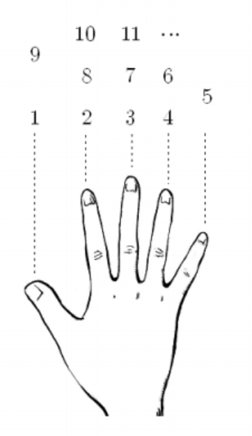




> Question



* Given number print finger index

```txt
Input: 3
Output: 3
```




```cpp
#include <cstdio>

int main(){
  int n;
  scanf("%d", &n);
  switch(n % 8){
    case 1:
      printf("1");
      break;
    case 2: case 0:
      printf("2");
      break;
    case 3: case 7:
      printf("3");
      break;
    case 4: case 6:
      printf("4");
      break;
    default:
      printf("5");
  }
}
```




```py
turn = int(input()) % 8
if turn == 1:
  print(1)
elif turn == 2 or turn == 0:
  print(2)
elif turn == 3 or turn == 7:
  print(3)
elif turn == 4 or turn == 6:
  print(4)
elif turn == 5:
  print(5)
```



