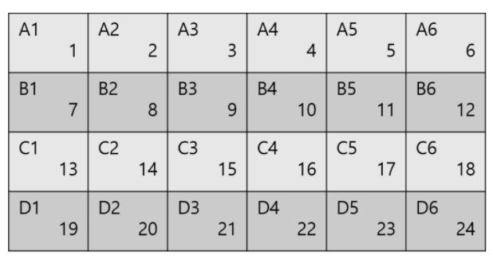

# Loop

## Builtin

### Count

> baekjoon

* [Level 2 : 공백 없는 A+B](http://acmicpc.net/problem/15873)
  * [Update solution](https://github.com/seanhwangg/algorithm/edit/main/syntax/loop/count/BJ_15873.md)




> Question

* find A+B if given natural numbers A and B without sepeator

```txt
Input: 37
Output: 10
```




```py
s = input()
if len(s) == 4:
  print(20)
elif len(s) == 3:
  if s[1] == '0'
    print(10 + int(s[2]))
  else:
    print(10 + int(s[0]))
else:
  print(int(s[0]) + int(s[1]))
```




* [Level 2 : Identifying tea](http://acmicpc.net/problem/11549)
  * [Update solution](https://github.com/seanhwangg/algorithm/edit/main/syntax/loop/count/BJ_11549.md)




> Question

* 첫번째 줄 숫자가 두번째 줄에 나오는 개수를 출력하라

```txt
Input:
1
1 2 3 2 1

Output: 2
```




```java
import java.util.Scanner;

public class Main {
  public static void main(String[] args) {
    var sc = new Scanner(System.in);
    var t = sc.nextInt();
    var k = 0;
    for (int i = 0; i < 5; i++) {
      var n = sc.nextInt();
      if (n == t) {
        k++;
      }
    }
    System.out.println(k);
  }
}
```




```py
a = input()
print(input().split().count(a))
```




* [Level 2 : 10부제](http://acmicpc.net/problem/10797)
  * [Update solution](https://github.com/seanhwangg/algorithm/edit/main/syntax/loop/count/BJ_10797.md)




> Question

* Count number in list

```txt
Input:
1
12 1 4

Output: 1
```




```cpp
#include <iostream>
using namespace std;

int main() {
  int n, a, s = 0;
  cin >> n;
  for (int i = 0; i < 5; i++) {
    cin >> a;
    if(n == a) s++;
  }
  cout << s;
}
```




```py
a = input()
li = input().split()
print(li.count(a))
```




* [Level 3 : Quick Estimates](http://acmicpc.net/problem/13297)
  * [Update solution](https://github.com/seanhwangg/algorithm/edit/main/syntax/loop/count/BJ_13297.md)




> Question

* 첫줄에 n, 다음 n 줄의 문자가 주어질 때 문자의 길이를 각각 출력하라

```txt
Input:
2
ab
a

Output:
2
1
```




```cpp
#include <iostream>
#include <string>

using namespace std;
int main() {
  int T;
  string in;
  for (scanf("%d", &T); T--;) {
    cin >> in;
    cout << in.size() << endl;
  }
  return 0;
}
```




```py
for _ in range(int(input())):
  print(len(input()))
```




* [Level 3 : Head or Tail](http://acmicpc.net/problem/5751)
  * [Update solution](https://github.com/seanhwangg/algorithm/edit/main/syntax/loop/count/BJ_5751.md)




> Question

* Print number of wins from Mary and John

```txt
Input:
5
0 0 1 0 1
6
0 0 0 0 0 1
0

Output:
Mary won 3 times and John won 2 times
Mary won 5 times and John won 1 times
```




```py
while 1:
  n = int(input())
  if n == 0:
    break
  li = list(map(int, input().split()))
  print(f"Mary won {li.count(0)} times and John won {fi.count(1)} times")
```




* [Level 4 : 모음의 개수](http://acmicpc.net/problem/10987)
  * [Update solution](https://github.com/seanhwangg/algorithm/edit/main/syntax/loop/count/BJ_10987.md)




> Question

* Count number of vowels

```txt
Input: baekjoon
Output: 4
```




```py
print(sum(map(input().count,"aeiou")))
```




* [Level 4 : 좋은놈 나쁜놈](http://acmicpc.net/problem/4447)
  * [Update solution](https://github.com/seanhwangg/algorithm/edit/main/syntax/loop/count/BJ_4447.md)




> Question

* append GOOD if string contains more G than B
* BAD if string contains more B than G
* NEUTRAL otherwise

```txt
Input:
8
Algorithm Crunching Man
Green Lantern
Boba Fett
Superman
Batman
Green Goblin
Barney
Spider Pig

Output:
Algorithm Crunching Man is GOOD
Green Lantern is GOOD
Boba Fett is A BADDY
Superman is NEUTRAL
Batman is A BADDY
Green Goblin is GOOD
Barney is A BADDY
Spider Pig is GOOD
```




```py
for _ in range(int(input())):
  s = input()
  x = s.lower()
  g = x.count('g')
  b = x.count('b')
  print(s + ' is ' + ('GOOD' if g>b else 'NEUTRAL' if g==b else 'A BADDY'))
```




* [Level 4 : Serious Problem](http://acmicpc.net/problem/17094)
  * [Update solution](https://github.com/seanhwangg/algorithm/edit/main/syntax/loop/count/BJ_17094.md)




> Question

* Print 2 if 2 appears more than e else e
* if 2 appears same as e print yee

```txt
Input:
12
222eee222eee

Output: yee
```




```py
input()
s = input()
if s.count('e') > s.count('2'):
  print("e")
elif s.count('e') < s.count('2'):
  print("2")
else:
  print('yee')
```




* [Level 4 : 숫자의 개수](http://acmicpc.net/problem/2577)
  * [Update solution](https://github.com/seanhwangg/algorithm/edit/main/syntax/loop/count/BJ_2577.md)




> Question

* print # times each number from 0 to 9 was written in the result of calculating A × B × C

```txt
Input:
150
266
427

Output:
3
1
0
2
0
0
0
2
0
0
```




```cpp
#include<cstdio>
int arr[10];
int main() {
  int s=1, t;

  for(int i=0;i<3;++i) {
    scanf("%d",&t);
    s*=t;
  }
  while(s) {
    ++arr[s%10];
    s/=10;
  }

  for(int i=0;i<10;++i)
    printf("%d\n",arr[i]);
}
```




```py
a = int(input())
b = int(input())
c = int(input())

s = str(a * b * c)
for i in range(10):
  print(s.count(str(i)))
```




* [Level 4 : 정수의 개수](http://acmicpc.net/problem/10821)
  * [Update solution](https://github.com/seanhwangg/algorithm/edit/main/syntax/loop/count/BJ_10821.md)




> Question

* Print number of comma plus 1

```txt
Input: 10,20,30,50,100
Output: 5
```




```py
print(1 + input().count(","))
```




* [Level 4 : 개수 세기](http://acmicpc.net/problem/10807)
  * [Update solution](https://github.com/seanhwangg/algorithm/edit/main/syntax/loop/count/BJ_10807.md)




> Question

* Given a total of N integers, write a program to determine how many integers v have

```txt
Input:
11
1 4 1 2 4 2 4 2 3 4 4
2

Output: 3
```




```cpp
#include <iostream>
#include <vector>
#include <algorithm>
using namespace std;

int main() {
  int n, v;
  cin >> n;
  vector<int> x(n);
  for (int i = 0; i < n; ++i)
    cin >> x[i];
  cin >> v;
  cout << count(x.begin(), x.end(), v);
  return 0;
}
```




```py
input()
nums = input().split()
print(nums.count(input()))
```




* [Level 4 : 2018년을 되돌아보며](http://acmicpc.net/problem/16674)
  * [Update solution](https://github.com/seanhwangg/algorithm/edit/main/syntax/loop/count/BJ_16674.md)




> Question

* 어떤 양의 정수를 10진수로 나타냈을 때 2, 0, 1, 8로만 이루어져 있다면, print 2
* 2018과 관련 있는 수 중에서 2, 0, 1, 8을 모두 포함하는 수들은, print 0
* 2018과 밀접한 수 중에서 2, 0, 1, 8의 개수가 모두 똑같은 수들은, print 8
* else print 8

```txt
Input: 20181208
Output: 8
```




```py
s = input()
a, b, c, d = (s.count(x) for x in '2018')
if a + b + c + d != len(s):
  print(0)
elif a == b == c == d:
  print(8)
elif a and b and c and d:
  print(2)
else:
  print(1)
```




* [Level 5 : 행복한지 슬픈지](http://acmicpc.net/problem/10769)
  * [Update solution](https://github.com/seanhwangg/algorithm/edit/main/syntax/loop/count/BJ_10769.md)




> Question

* There are :-) for happy faces and :-( for sad faces
* When you get a text message, find which occurs more

```txt
Input: How are you :-) doing :-( today :-)?
Output: happy
```




```py
s = input()
happy = s.count(":-)")
sad = s.count(":-(")
if happy < sad:
  print("sad")
elif happy > sad:
  print("happy")
elif happy == sad != 0:
  print("unsure")
else:
  print("none")
```




* [Level 6 : 반지](http://acmicpc.net/problem/5555)
  * [Update solution](https://github.com/seanhwangg/algorithm/edit/main/syntax/loop/count/BJ_5555.md)




> Question

* Print out the number of rings containing the string you want to find
* string is circular

```txt
Input:
ABCD
3
ABCDXXXXXX
CDYYAB
DCBAZZZZZZ

Output: 2
```




```cpp
#include <iostream>
using namespace std;
int main() {
  string a;
  int n;
  cin >> a >> n;
  string b;
  int re = 0;
  for (int i = 0; i < n; i++) {
    cin >> b;
    string s = b + b;
    if (s.find(a) != string::npos) re++;
  }
  cout << re;
}
```




```py
a = input()
count = 0
for _ in range(int(input())):
  if (input() * 2).count(a):
    count += 1
print(count)
```




> kattis

* [Level 1.7 : Aaah!](https://open.kattis.com/problems/aaah)
  * [Update solution](https://github.com/seanhwangg/algorithm/edit/main/syntax/loop/count/KT_aaah.md)

[//]: # (BJ_4999)

> leetcode

* [Level Easy : Longest Palindrome](https://leetcode.com/problems/longest-palindrome)
  * [Update solution](https://github.com/seanhwangg/algorithm/edit/main/syntax/loop/count/LC_409.md)




> Question

* Given a string s which consists of lowercase or uppercase letters
* return the length of the longest palindrome that can be built with those letters

```txt
Input: s = "abccccdd"
Output: 7
```




```cpp
int longestPalindrome(string s) {
  int odds = 0;
  for (char c = 'A'; c <= 'z'; c++)
    odds += count(s.begin(), s.end(), c) & 1;
  return s.size() - odds + (odds > 0);
}
```




### Eval

> baekjoon

* [Level 3 : 계산기 프로그램](http://acmicpc.net/problem/5613)
  * [Update solution](https://github.com/seanhwangg/algorithm/edit/main/syntax/loop/eval/BJ_5613.md)




```txt
Input:
1
+
1
=

Output: 2
```




```cpp
#include <iostream>
using namespace std;

char op;
int ans, x;
int main() {
  cin >> ans >> op;
  while (1) {
    cin >> x;
    if (op == '+')ans += x;
    else if (op == '-') ans -= x;
    else if (op == '*') ans *= x;
    else if (op == '/') ans /= x;
    cin >> op;
    if (op == '=') break;
  }
  cout << ans;
}
```




```py
c = input()
while 1:
  line = input()
  if line == '=':
    print(c)
    break
  b = input()
  c = int(eval(str(c) + line + b))
```




* [Level 3 : 오버플로우와 모듈러](http://acmicpc.net/problem/15818)
  * [Update solution](https://github.com/seanhwangg/algorithm/edit/main/syntax/loop/eval/BJ_15818.md)




> Question

* Outputs the remainder of the product of N integers per line divided by M

```txt
Input:
10 9999
100 100 100 100 100 100 100 100 100 100

Output: 1
```




```py
d = input().split()[1]
print(eval(input().replace(" ","*")) % int(d))
```




* [Level 3 : 소음](http://acmicpc.net/problem/2935)
  * [Update solution](https://github.com/seanhwangg/algorithm/edit/main/syntax/loop/eval/BJ_2935.md)




> Question

* The result is either A+B or A*B, which is determined by the operator given in the input
* Two inputs are both power of 10

```txt
Input:
1000
*
100

Output: 100000
```




```cpp
#include <bits/stdc++.h>
using namespace std;
int main(){
  string a, b;
  char o; cin >> a >> o >> b;
  if (a.size() < b.size()) swap(a, b);
  if (o == '*') a += b.substr(1, b.size()-1);
  else a[a.size() - b.size()]++;
  cout << a;
}
```




```py
print(eval(input() + input() + input()))
```




* [Level 4 : 사칙연산](http://acmicpc.net/problem/13420)
  * [Update solution](https://github.com/seanhwangg/algorithm/edit/main/syntax/loop/eval/BJ_13420.md)




> Question

* If the given formula is correct, output "correction" and "wrong answer" if incorrect

```txt
Input:
4
3 * 2 = 6
11 + 11 = 11
7 - 9 = -2
3 * 0 = 0

Output:
correct
wrong answer
correct
correct
```




```py
for _ in range(int(input())):
  eq, ans = input().split('=')
  print("correct" if eval(eq) == int(ans) else "wrong answer")
```




* [Level 4 : 더하기 2](http://acmicpc.net/problem/10823)
  * [Update solution](https://github.com/seanhwangg/algorithm/edit/main/syntax/loop/eval/BJ_10823.md)




> Question

* Write a program to find the sum of the natural numbers included in S

```txt
Input:
10,20,
3
0,50
,1
00

Output: 210
```




```py
import sys
print(sum(eval(sys.stdin.read().replace("\n",""))))
```




> kattis

* [Level 1.6 : Tri](https://open.kattis.com/problems/tri)
  * [Update solution](https://github.com/seanhwangg/algorithm/edit/main/syntax/loop/eval/KT_tri.md)




> Question

* a, b, c 가 주어질 때 사칙연산으로 a ? b = c가 되거나 a = b ? c가 되는 경우중 한가지를 출력하라

```txt
Input: 5 3 8
Output: 5+3=8
```




```py
a, b, c = input().split()
for op in ['+', '-', '*', '/']:
  if eval(a + op + b) == int(c):
    print(a + op + b + '=' + c)
    break
  if int(a) == eval(b + op + c):
    print(a + '=' + b + op + c)
    break
```




### Len

> baekjoon

* [Level 2 : 베시와 데이지](http://acmicpc.net/problem/16431)
  * [Update solution](https://github.com/seanhwangg/algorithm/edit/main/syntax/loop/len/BJ_16431.md)




> Question


* Print who can go to destination first

```txt
Input:
3 5
1 1
2 3

Output: bessie
```




```py
a, b = map(int, input().split())
c, d = map(int, input().split())
e, f = map(int, input().split())
x = max(abs(e - a), abs(f - b))
y = abs(e - c) + abs(f - d)
if x == y:
  print('tie')
elif x < y:
  print('bessie')
else:
  print('daisy')
```




* [Level 3 : 사탕 선생 고창영](http://acmicpc.net/problem/2547)
  * [Update solution](https://github.com/seanhwangg/algorithm/edit/main/syntax/loop/len/BJ_2547.md)




> Question

* For each test case, print YES if the same candy can be distributed to everyone, and NO if not

```txt
Input:
2

5
5
2
7
3
8

6
7
11
2
7
3
4

Output:
YES
NO
```




```py
N = int(input())

for _ in range(N):
  input()
  line = int(input())
  li = [int(input()) for _ in range(line)]
  print("YES" if sum(li) % len(li) == 0 else "NO")
```




```v
module main;
  logic clk, reset;
  logic[76:0] students, candies;
  logic result;

  candy candy(.clk, .reset, .students, .candies, .result);

  initial begin
    integer code, t;
    logic[76:0] i;

    clk = 0;

    for (code = $fscanf(32'h8000_0000, "%d", t); t>0; t--) begin
      #1 reset = 1;
      #1 reset = 0;
      code = $fscanf(32'h8000_0000, "%d", students);
      for (i=0; i<students; i++) begin
        code = $fscanf(32'h8000_0000, "%d", candies);
        #1 clk = 1;
        #1 clk = 0;
      end
      $display("%0s", result ? "NO" : "YES");
    end
    $finish;
  end
endmodule

module candy(
  input logic clk, reset,

  input logic[76:0] students, candies,
  output logic result
);
  logic[76:0] total_candies;

  assign result = |(total_candies % students);

  always_ff @(posedge clk, posedge reset) begin
    if (reset) total_candies = '0;
    else total_candies += candies;
  end
endmodule
```




* [Level 4 : 단어의 개수](http://acmicpc.net/problem/1152)
  * [Update solution](https://github.com/seanhwangg/algorithm/edit/main/syntax/loop/len/BJ_1152.md)




> Question

* Print length of list

```txt
Input: The Curious Case of Benjamin Button
Output: 6
```




```java
import java.io.*;
import java.util.StringTokenizer;

class Main{
  public static void main(String[] args) throws IOException {
    StringTokenizer stb = new StringTokenizer(new BufferedReader(new InputStreamReader(System.in)).readLine(), " ");
    BufferedWriter bw = new BufferedWriter(new OutputStreamWriter(System.out));
    bw.write(Integer.toString(stb.countTokens()));
    bw.flush();
    bw.close();
  }
}
```




```py
li = list(input().split())
print(len(li))
```




```sh
read s
s=($s)
echo ${#s[@]}
```




* [Level 4 : 단어 길이 재기](http://acmicpc.net/problem/2743)
  * [Update solution](https://github.com/seanhwangg/algorithm/edit/main/syntax/loop/len/BJ_2743.md)




> Question

* Print length of string

```txt
Input: pulljima
Output: 8
```




```py
print(len(input()))
```




* [Level 5 : 평균](http://acmicpc.net/problem/1546)
  * [Update solution](https://github.com/seanhwangg/algorithm/edit/main/syntax/loop/len/BJ_1546.md)




> Question

* 자기 점수 중에 최댓값을 골랐다. 이 값을 M이라고 한다. 그리고 나서 모든 점수를 점수/M*100으로 고쳤다
* 성적을 위의 방법대로 새로 계산했을 때, 새로운 평균을 구하는 프로그램을 작성하시오

```txt
Input:
3
40 80 60

Output: 75.0
```




```py
n = int(input())
li = list(map(int, input().split()))
print(sum(li) / max(li) * 100 / len(li))
```




> kattis

* [Level 1.5 : Help a PhD candidate out!](https://open.kattis.com/problems/helpaphd)
  * [Update solution](https://github.com/seanhwangg/algorithm/edit/main/syntax/loop/len/KT_helpaphd.md)




> Question

* n개 줄의 a + b가 주어진다. 이 때 결과 값을 출력하라. 단 P=NP 가 주어질 때는 skipped를 출력하라

```txt
Input:
4
2+2
1+2
P=NP
0+0

Output:
4
3
skipped
0
```




```py
n_test = int(input())
for _ in range(n_test):
  line = input()
  if line == 'P=NP':
    print('skipped')
  else:
    print(eval(line))
```




* [Level 1.4 : Quick Estimates](https://open.kattis.com/problems/quickestimate)
  * [Update solution](https://github.com/seanhwangg/algorithm/edit/main/syntax/loop/len/KT_quickestimate.md)




> Question

* 첫번째 줄에는 N이 그 다음 N 줄에는 x가 주어진다. 이때 각 줄마다 x의 자리수를 출력하라

```txt
Input:
2
sd
a

Output:
2
1
```




```py
n_line = int(input())
for _ in range(n_line):
  x = input()
  print(len(x))
```




### Min Max

> baekjoon

* [Level 2 : 시험 점수](http://acmicpc.net/problem/5596)
  * [Update solution](https://github.com/seanhwangg/algorithm/edit/main/syntax/loop/min-max/BJ_5596.md)




> Question

* Print maximum sum of two lists

```txt
Input:
100 80 70 60
80 70 80 90

Output: 320
```




```py
a, b, c, d = map(int, input().split())
e, f, g, h = map(int, input().split())
print(max(a + b + c + d, e + f + g + h))
```




* [Level 3 : 최소, 최대 2](http://acmicpc.net/problem/20053)
  * [Update solution](https://github.com/seanhwangg/algorithm/edit/main/syntax/loop/min-max/BJ_20053.md)




> Question

* N integers are given, find the minimum and maximum values

```txt
Input:
3
5
20 28 22 25 21
5
30 21 17 25 29
5
20 10 35 30 7

Output:
20 28
17 30
7 35
```




```cpp
#include <bits/stdc++.h>
using namespace std;

int main() {
  int N; cin >> N;
  while (N--) {
    int n; cin >> n;
    vector<int> v(n);
    for (auto& i : v) cin >> i;
    cout << *min_element(v.begin(), v.end()) << ' ' << *max_element(v.begin(), v.end()) << '\n';
  }
}
```




```py
for _ in range(int(input())):
  input()
  li = list(map(int, input().split()))
  print(min(li), max(li))
```




* [Level 3 : 최소, 최대](http://acmicpc.net/problem/10818)
  * [Update solution](https://github.com/seanhwangg/algorithm/edit/main/syntax/loop/min-max/BJ_10818.md)




> Question

* Print min and max within list

```txt
Input: 2 1 5 3
Output: 1 5
```




```py
_ = input()
li = list(map(int, input().split()))
print(min(li), max(li))
```




* [Level 4 : Sort 마스터 배지훈](http://acmicpc.net/problem/17263)
  * [Update solution](https://github.com/seanhwangg/algorithm/edit/main/syntax/loop/min-max/BJ_17263.md)




> Question

* Print maximum from given list

```txt
Input:
3
3 2 1

Output: 3
```




```py
input()
print(max(map(int,input().split())))
```




* [Level 4 : 주차의 신](http://acmicpc.net/problem/5054)
  * [Update solution](https://github.com/seanhwangg/algorithm/edit/main/syntax/loop/min-max/BJ_5054.md)




> Question

* Print largest - smallest multiplied by 2

```txt
Input:
2
4
24 13 89 37
6
7 30 41 14 39 42

Output:
152
70
```




```py
for _ in range(int(input())):
  input()
  l = list(map(int, input().split()))
  print((max(l) - min(l)) * 2)
```




* [Level 4 : 행복](http://acmicpc.net/problem/15969)
  * [Update solution](https://github.com/seanhwangg/algorithm/edit/main/syntax/loop/min-max/BJ_15969.md)




> Question

* Print difference between maximum and minimum

```txt
Input:
8
85 42 79 95 37 11 72 32

Output: 84
```




```js
process.stdin.on('data', (chunk) => {
  const data = chunk.toString().trim().split('\n')[1].split(' ').map(x=>+x);
  console.log(Math.max(...data) - Math.min(...data));
});
```




```py
input()
li = list(map(int,input().split()))
print(max(li) - min(li))
```




* [Level 5 : 첼시를 도와줘!](http://acmicpc.net/problem/11098)
  * [Update solution](https://github.com/seanhwangg/algorithm/edit/main/syntax/loop/min-max/BJ_11098.md)




> Question

* Given list of salary, name, print the most expensive player

```txt
Input:
2
3
10 Iversen
1000000 Nannskog
2000000 Ronaldinho
2
1000000 Maradona
999999 Batistuta

Output:
Ronaldinho
Maradona
```




```cpp
#include <iostream>
#include <vector>
#include <string>
using namespace std;
int main() {
  int n, p;
  cin >> n;
  while (n--) {
    cin >> p;
    vector <pair<int, string>> s(p);
    int ans = 0, i = 0, ex = 0;
    while (p--) {
      cin >> s[i].first >> s[i].second;
      if (s[i].first > ex) {
        ex = s[i].first;
        ans = i;
      }
      i++;
    }
    cout << s[ans].second << '\n';
  }
}
```




```js
var s = require('fs').readFileSync('/dev/stdin').toString().trim().split('\n');
var t = parseInt(s.shift());
for (var i = 0; i < t; ++i) {
  var k = parseInt(s.shift());
  console.log(s.splice(0, k).map((e) => {
    var l = e.split(' ');
    return [parseInt(l[0]), l[1]];
  }).sort((a, b) => { b[0] - a[0] })[0][1]);
}
```




```py
for _ in range(int(input())):
  l = []
  for _ in range(int(input())):
    a, b = input().split()
    a = int(a)
    l.append((a,b))
  print(max(l)[1])
```




> leetcode

* [Level Medium : Partitioning Into Minimum Number Of Deci-Binary Numbers](https://leetcode.com/problems/partitioning-into-minimum-number-of-deci-binary-numbers)
  * [Update solution](https://github.com/seanhwangg/algorithm/edit/main/syntax/loop/min-max/LC_1689.md)




> Question

* print maximum number in character

```txt
Input: n = "27346209830709182346"
Output: 9
```




```py
def minPartitions(self, n: str) -> int:
  return int(max(n))
```




### Filter

> baekjoon

* [Level 3 : Batter Up](http://acmicpc.net/problem/15096)
  * [Update solution](https://github.com/seanhwangg/algorithm/edit/main/syntax/loop/filter/BJ_15096.md)




> Question

* Remove all -1 and print average

```txt
Input:
3
1 -1 4

Output: 2.5
```




```py
input()
li = list(map(int, input().split()))
li = list(filter(lambda a: a != -1, li))
print(sum(li) / len(li))
```




* [Level 4 : 문자가 몇갤까](http://acmicpc.net/problem/7600)
  * [Update solution](https://github.com/seanhwangg/algorithm/edit/main/syntax/loop/filter/BJ_7600.md)




> Question

* Print how many different alphabets are written in each line

```txt
Input:
The quick brown fox jumped over the lazy dogs.
2 + 2 = 4
New Zealand Programming Contest.
#

Output:
26
0
16
```




```py
while a := input().lower() != '#':
  print(len(set(filter(lambda x: x.isalpha(), a))))
```




### Sum

> baekjoon

* [Level 1 : Bottle Return](http://acmicpc.net/problem/21300)
  * [Update solution](https://github.com/seanhwangg/algorithm/edit/main/syntax/loop/sum/BJ_21300.md)




> Question

* print sum of all number * 5

```txt
Input: 0 0 0 23 3 100
Output: 630
```




```py
print(sum(map(int, input().split())) * 5)
```




* [Level 3 : 집 주소](http://acmicpc.net/problem/1284)
  * [Update solution](https://github.com/seanhwangg/algorithm/edit/main/syntax/loop/sum/BJ_1284.md)




> Question

* 각 숫자 사이에는 1cm의 여백이 들어가야한다
* 1은 2cm의 너비를 차지해야한다. 0은 4cm의 너비를 차지해야한다. 나머지 숫자는 모두 3cm의 너비를 차지한다
* 호수판의 경계와 숫자 사이에는 1cm의 여백이 들어가야한다

```txt
Input:
120
5611
100
0

Output:
13
15
14
```




```py
while True:
  num =input()
  if num=="0":
    break
  print((len(num) + 1) + sum([2 if d == "1" else 4 if d == "0" else 3 for d in num]))
```




* [Level 3 : 더하기 3](http://acmicpc.net/problem/11023)
  * [Update solution](https://github.com/seanhwangg/algorithm/edit/main/syntax/loop/sum/BJ_11023.md)




> Question

* Print sum of list

```txt
Input: 1 2 3 4 5
Output: 15
```




```java
import java.util.Scanner;
public class Main {

  public static void main(String[] args) {
    Scanner sc = new Scanner(System.in);
    int sum=0;
    while(sc.hasNext())
      sum+=sc.nextInt();
    System.out.println(sum);
  }

}
```




```js
var input = require("fs").readFileSync("/dev/stdin").toString().split(" ");
var sum = 0;
for(var i = 0; i < input.length; i++)
  sum += Number(input[i]);
console.log(sum);
```




```py
n = list(map(int, input().split()))
print(sum(n))
```




* [Level 3 : 윷놀이](http://acmicpc.net/problem/2490)
  * [Update solution](https://github.com/seanhwangg/algorithm/edit/main/syntax/loop/sum/BJ_2490.md)




> Question

* Prints A for do, B for gae, C for gul, D for yut, and E for mo

```txt
Input:
0 1 0 1
1 1 1 0
0 0 1 1

Output:
B
A
B
```




```py
for i in range(3):
  s = sum(int, input().split())
  if s == 0:
    print('D')
  elif s == 1:
    print('C')
  elif s == 2:
    print('B')
  elif s == 3:
    print('A')
  else:
    print('E')
```




* [Level 3 : 치킨 두 마리 (...)](http://acmicpc.net/problem/14489)
  * [Update solution](https://github.com/seanhwangg/algorithm/edit/main/syntax/loop/sum/BJ_14489.md)




> Question

* 첫째 줄에 두 통장의 잔고 A와 B가 주어진다. (0 <= A, B <= 1,000,000,000)
* 둘째 줄에 치킨 한 마리의 가격 C가 주어진다. (0 <= C <= 1,000,000,001)
* 욱제가 치킨 두 마리(...)를 살 수 있으면 치킨 두 마리(...)를 사고 남은 두 통장 잔고의 합을, 살 수 없으면 현재 두 통장의 잔고의 합을 출력한다

```txt
Input:
87 31
20000

Output: 118
```




```py
a, b = sum(map(int,input().split())), int(input()) * 2
print(a - b if a >= b else a)
```




* [Level 3 : 더하기](http://acmicpc.net/problem/9085)
  * [Update solution](https://github.com/seanhwangg/algorithm/edit/main/syntax/loop/sum/BJ_9085.md)




> Question

* print sum of list in each test case

```txt
Input:
2
1 4 2
1 0

Output:
7
1
```




```py
for _ in range(int(input())):
  m = int(input())
  print(sum(map(int, input().split())))
```




* [Level 3 : Divvying Up](http://acmicpc.net/problem/20332)
  * [Update solution](https://github.com/seanhwangg/algorithm/edit/main/syntax/loop/sum/BJ_20332.md)




> Question

* Print if sum of numbers in second line are divisible by 3

```txt
Input:
2
10 3

Output: no
```




```py
input()
print("yes" if sum(map(int, input().split())) % 3 == 0 else "no")
```




* [Level 3 : A+B - 4](http://acmicpc.net/problem/10951)
  * [Update solution](https://github.com/seanhwangg/algorithm/edit/main/syntax/loop/sum/BJ_10951.md)




> Question

* Print sum of each line

```txt
Input:
1 5 6
2 3
Output:
11
5
```




```py
import sys
for line in sys.stdin:
  print(sum(map(int, line.split())))
```




* [Level 3 : 주사위 게임](http://acmicpc.net/problem/10262)
  * [Update solution](https://github.com/seanhwangg/algorithm/edit/main/syntax/loop/sum/BJ_10262.md)




> Question

* Print Gunnar if sum of first list is bigger tie if same else Emma

```txt
Input:
1 4 1 4
1 6 1 6

Output:
Emma
```




```py
tmp1=list(map(int,input().split()))
tmp2=list(map(int,input().split()))
a = sum(tmp1)
b = sum(tmp2)
if a > b: print("Gunnar")
elif a == b: print("Tie")
else: print("Emma")
```




* [Level 3 : 주사위](http://acmicpc.net/problem/9295)
  * [Update solution](https://github.com/seanhwangg/algorithm/edit/main/syntax/loop/sum/BJ_9295.md)




> Question

* Print sum of each line

```txt
Input:
2
1 2 3
0

Output:
6
0
```




```py
for i in range(int(input())):
  print(f'Case {i+1}: {sum(map(int, input().split()))}')
```




* [Level 3 : 더하기 4](http://acmicpc.net/problem/11024)
  * [Update solution](https://github.com/seanhwangg/algorithm/edit/main/syntax/loop/sum/BJ_11024.md)




> Question

* Print sum of lists for n test

```txt
Input:
2
1 5 3
1 7

Output:
9
8
```




```py
N = int(input())
for _ in range(N):
  n = list(map(int, input().split()))
  print(sum(n))
```




* [Level 3 : 나는 요리사다](http://acmicpc.net/problem/2953)
  * [Update solution](https://github.com/seanhwangg/algorithm/edit/main/syntax/loop/sum/BJ_2953.md)




> Question

* When each participant is given an evaluation score, find the winner and his score

```txt
Input:
5 4 4 5
5 4 4 4
5 5 4 4
5 5 5 4
4 4 4 5

Output: 4 19
```




```py
num = mx = 0
for i in range(5):
  temp = sum(map(int, input().split()))
  if mx < temp:
    mx = temp
    num = i + 1

print(num, mx)
```




* [Level 4 : 더하기](http://acmicpc.net/problem/10822)
  * [Update solution](https://github.com/seanhwangg/algorithm/edit/main/syntax/loop/sum/BJ_10822.md)




> Question

* Print sum separated by comma

```txt
Input: 1,2,5
Output: 8
```




```py
print(sum(map(int, input().split(','))))
```




* [Level 4 : 이상한 곱셈](http://acmicpc.net/problem/1225)
  * [Update solution](https://github.com/seanhwangg/algorithm/edit/main/syntax/loop/sum/BJ_1225.md)




> Question

* Take one spot from A and take one spot from B and add up all the products you can make

```txt
Input: 123 45
Output: 54
```




```py
a, b = input().split()
print(sum(map(int,a))*sum(map(int,b)))
```




* [Level 4 : 시험 감독](http://acmicpc.net/problem/13458)
  * [Update solution](https://github.com/seanhwangg/algorithm/edit/main/syntax/loop/sum/BJ_13458.md)




> Question

* The general supervisor has B applicants who can be monitored at one test site
* the deputy supervisor has C applicants who can be monitored at one test site
* There shall be only one general supervisor at each test site, and there may be several deputy supervisor
* All applicants should be monitored at each test site. Find the minimum number of supervisors required

```txt
Input:
5
10 9 10 9 10
7 20

Output: 10
```




```py
N = int(input())
A = map(int, input().split())
B, C = map(int, input().split())
print(sum(((a - B - 1) // C) + 1 if a >= B else 0 for a in A) + N)
```




* [Level 4 : 숫자의 합](http://acmicpc.net/problem/11720)
  * [Update solution](https://github.com/seanhwangg/algorithm/edit/main/syntax/loop/sum/BJ_11720.md)




> Question

* Find sum of numbers

```txt
Input: 1 5 3
Output: 9
```




```py
input()
print(sum(map(int, input())))
```




* [Level 6 : 3의 배수](http://acmicpc.net/problem/1769)
  * [Update solution](https://github.com/seanhwangg/algorithm/edit/main/syntax/loop/sum/BJ_1769.md)




> Question

* 당신이 알고 있는 3의 배수는 한 자리 수밖에 없다고 가정하자
* 즉, 문제 변환의 과정을 여러 번 거치다 보면 Y가 한 자리 수가 되는 순간이 있게 되는데, 그렇게 될 때까지 문제 변환을 반복한다는 뜻이다
* 변환 후의 Y가 3, 6, 9 중 하나이면 원래의 수 X는 3의 배수이고, Y가 1, 2, 4, 5, 7, 8 중 하나이면 원래의 수 X는 3의 배수가 아니다
* 큰 수 X가 주어졌을 때, 앞에서 설명한 문제 변환의 과정을 몇 번 거쳐야 Y가 한 자리 수가 되어, X가 3의 배수인지 아닌지를 알 수 있게 될지를 구하는 프로그램을 작성하시오

```txt
Input: 1234567

Output:
3
NO
```




```py
x = input()
i = 0
while len(x) > 1:
  x = str(sum(map(int, x)))
  i += 1
print(i)
if int(x) % 3 == 0:
  print('YES')
else:
  print('NO')
```




> kattis

* [Level 1.3 : Pet](https://open.kattis.com/problems/pet)
  * [Update solution](https://github.com/seanhwangg/algorithm/edit/main/syntax/loop/sum/KT_pet.md)




> Question

* When each participant is given an evaluation score, find the winner and his score

```txt
Input:
5 4 4 5
5 4 4 4
5 5 4 4
5 5 5 4
4 4 4 5

Output: 4 19
```




```py
num = mx = 0
for i in range(5):
  temp = sum(map(int, input().split()))
  if mx < temp:
    mx = temp
    num = i + 1

print(num, mx)
```




* [Level 1.6 : Dice Game](https://open.kattis.com/problems/dicegame)
  * [Update solution](https://github.com/seanhwangg/algorithm/edit/main/syntax/loop/sum/KT_dicegame.md)




> Question

* 두줄에 거쳐 총 8개의 수가 주어진다
* 이 때 위 줄의 합이 크면 Emma 아랫줄의 합이 크면 Gunnar, 같을 시에는 Tie를 출력하라

```txt
Input:
1 2 3 4
1 2 3 5

Output: Gunnar
```




```py
a = sum(map(int, input().split()))
b = sum(map(int, input().split()))
if a < b:
  print('Emma')
elif b < a:
  print('Gunnar')
else:
  print('Tie')
```




* [Level 1.6 : The Easiest Problem Is This One](https://open.kattis.com/problems/easiest)
  * [Update solution](https://github.com/seanhwangg/algorithm/edit/main/syntax/loop/sum/KT_easiest.md)




> Question

* single integer number p which is the minimal number st N * p has the same sum of digits as N and p is bigger than 10

```txt
Input:
3029
4
5
42
0

Output:
37
28
28
25
```




```py
def SOD(st):
  return sum(map(int, st))
while True:
  n = input()
  if n == '0':
    break
  for i in range(11, 100000):
    if SOD(n) == SOD(str(int(n) * i)):
      print(i)
      break
```




> leetcode

* [Level Medium : Minimum Elements to Add to Form a Given Sum](https://leetcode.com/problems/minimum-elements-to-add-to-form-a-given-sum)
  * [Update solution](https://github.com/seanhwangg/algorithm/edit/main/syntax/loop/sum/LC_1785.md)




> Question

* Given an integer array nums and two integers limit and goal. abs(nums[i]) <= limit
* Return the minimum number of elements you need to add to make the sum of the array equal to goal
* The array must maintain its property that abs(nums[i]) <= limit

```txt
Input: nums = [1,-1,1], limit = 3, goal = -4
Output: 2  # add -2 and -3, then the sum of the array will be 1 - 1 + 1 - 2 - 3 = -4
```




```py
def minElements(self, A, limit, goal):
  return (abs(sum(A) - goal) + limit - 1) / limit
```




## Iterate

* [Comprehension test](https://docs.google.com/forms/d/1yUmg8IRuwrDaf8NayKeoDjLZv7XDIQHcbVUY9PJ-SP0/edit)
* [While test](https://docs.google.com/forms/d/18QwLLbameGJBtyrTsBI046VqHAIhMpxYD5KjK4bFcIM/edit)

### In

> baekjoon

* [Level 4 : 과제 안 내신 분..?](http://acmicpc.net/problem/5597)
  * [Update solution](https://github.com/seanhwangg/algorithm/edit/main/syntax/loop/in/BJ_5597.md)




> Question

* Find missing number from 1 ~ 30

```txt
Input:
3
1
4
5
7
9
6
10
11
12
13
14
15
16
17
18
19
20
21
22
23
24
25
26
27
28
29
30

Output:
2
8
```




```cpp
#include <iostream>
using namespace std;

int main() {
  bool check[31] = {0, };
  int temp;
  for(int i=0; i<28; i++){
     cin >> temp;
     check[temp] = 1;}
  for(int j=1; j<31; j++){
    if(check[j] == 0) cout << j << endl;
  }
}
```




```py
a = [int(input()) for _ in range(28)]
for i in range(1, 31):
  if i not in a:
    print(i)
```




> kattis

* [Level 1.4 : Avion](https://open.kattis.com/problems/avion)
  * [Update solution](https://github.com/seanhwangg/algorithm/edit/main/syntax/loop/in/KT_avion.md)




> Question

* 5개 줄에 차량 문자가 주어진다
* 이 문자에 'FBI'가 포함 되어 있는 라인 숫자를 출력하라
* 하나도 없을 시 'HE GOT AWAY'를 출력하라

```txt
Input:
N-FBI1
9A-USKOK
I-NTERPOL
G-MI6
RF-KGB1

Output: 1
```




```py
seen = False
for i in range(1, 6):
  st = input()
  if 'FBI' in st:
    print(i, end=' ')
    seen = True

if not seen:
  print("HE GOT AWAY!")
```




* [Level 1.5 : Kemija](https://open.kattis.com/problems/kemija08)
  * [Update solution](https://github.com/seanhwangg/algorithm/edit/main/syntax/loop/in/KT_kemija08.md)




> Question

* 루카는 화학 수업 시간에 지루해서 문단에 있는 모음(a,e,i,o,u) 을 모음p모음 으로 바꾸었다
* 이 바뀐 문장을 원래대로 돌려라

```txt
Input: zepelepenapa papapripikapa
Output: zelena paprika
```




```py
st = input()
skip = 0
for ch in st:
  if skip > 0:
    skip -=1
  elif ch in 'aeiou':
    skip = 2
    print(ch, end='')
  else:
    print(ch, end='')
```




* [Level 1.7 : Hissing Microphone](https://open.kattis.com/problems/hissingmicrophone)
  * [Update solution](https://github.com/seanhwangg/algorithm/edit/main/syntax/loop/in/KT_hissingmicrophone.md)




> Question

* if ss is in the string print 'hiss' else print 'no hiss'

```txt
Input: amiss
Output: hiss
```




```py
s = input()
if 'ss' in s:
  print('hiss')
else:
  print('no hiss')
```




* [Level 1.7 : Östgötska](https://open.kattis.com/problems/ostgotska)
  * [Update solution](https://github.com/seanhwangg/algorithm/edit/main/syntax/loop/in/KT_ostgotska.md)




> Question

* 문장에 ae가 포함 된 단어가 40% 이상이면 스웨덴 어이다
* 첫 줄에 문장이 주어질 때 스웨덴 어이면 dae ae ju traeligt va 아니면 haer talar vi rikssvenska 을 출력하라

```txt
Input: dae ae ju traeligt va
Output: dae ae ju traeligt va
```




```py
li = input().split()
n = len(li) * 0.4
count = 0
for st in li:
  if "ae" in st:
    count += 1
if n <= count:
  print("dae ae ju traeligt va")
else:
  print("haer talar vi rikssvenska")
```




### Index

> baekjoon

* [Level 2 : Boiling Water](http://acmicpc.net/problem/21612)
  * [Update solution](https://github.com/seanhwangg/algorithm/edit/main/syntax/loop/index/BJ_21612.md)




> Question

* Given N, P is 5 * N - 400
* print P and 1 if P < 100, 0 if P == 100, -1 if P > 100

```txt
Input: 102

Output:
95
1
```




```py
P = 5 * int(input()) - 400
print(P)
print([-1,0,1][(P<=100)+(P<100)])
```




* [Level 3 : 이게 분수?](http://acmicpc.net/problem/2863)
  * [Update solution](https://github.com/seanhwangg/algorithm/edit/main/syntax/loop/index/BJ_2863.md)




> Question

* Print how many times the table must be rotated on the first line to maximize the value of the table
* If there are multiple such values, print the smallest value

```txt
Input:
1 2
3 4

Output: 2
```




```py
a, b = map(int, input().split())
c, d = map(int, input().split())
f = [a / c + b / d, c / d + a / b, d / b + c / a, b / a + d / c]
print(f.index(max(f)))
```




* [Level 3 : Missing Numbers](http://acmicpc.net/problem/17588)
  * [Update solution](https://github.com/seanhwangg/algorithm/edit/main/syntax/loop/index/BJ_17588.md)




> Question

* 첫 줄에 n 이 주어지고 그 n 개의 줄에 숫자들이 주어질 떄, 비어있는 숫자를 모두 출력하라
* 비어있는 숫자가 없을 시 good job 을 출력하라

```txt
Input:
9
2
4
5
7
8
9
10
11
13

Output:
1
3
6
12
```




```py
N = int(input())
li = list(int(input()) for _ in range(N))

if len(li) == li[-1]:
  print("good job")
for n in range(1, li[-1] + 1):
  if n not in li:
    print(n)
```




* [Level 3 : 상금 헌터](http://acmicpc.net/problem/15953)
  * [Update solution](https://github.com/seanhwangg/algorithm/edit/main/syntax/loop/index/BJ_15953.md)




> Question

* Given price table print number of money I will earn

| price (* 10000) | ranking |
| --------------- | ------- |
| 500             | 1       |
| 300             | 2       |
| 200             | 3       |
| 50              | 4       |
| 30              | 5       |
| 10              | 6       |

| price (* 10000) | ranking |
| --------------- | ------- |
| 512             | 1       |
| 256             | 2       |
| 128             | 4       |
| 64              | 8       |
| 32              | 16      |

```txt
Input:
6
8 4
13 19
8 10
18 18
8 25
13 16

Output:
1780000
620000
1140000
420000
820000
620000
```




```py
T = int(input())

A = [0] + [500]*1 + [300]*2 + [200]*3 + [50]*4 + [30]*5 + [10]*6 + [0]*100
B = [0] + [512]*1 + [256]*2 + [128]*4 + [64]*8 + [32]*16 + [0]*100

for i in range(T):
  a, b = map(int,input().split())
  print(10000*(A[a]+B[b]))
```




* [Level 3 : 뉴턴과 사과](http://acmicpc.net/problem/13118)
  * [Update solution](https://github.com/seanhwangg/algorithm/edit/main/syntax/loop/index/BJ_13118.md)




> Question

* Print out the number of the person who hits with falling apple
* If no one conflicts with an apple, print 0 instead

```txt
Input:
-5 -2 1 5
1 4 2

Output : 3
```




```py
L = list(map(int, input().split()))
x, _, _ = map(int, input().split())
if x in L:
  print(L.index(x) + 1)
else:
  print(0)
```




* [Level 4 : 신용카드 판별](http://acmicpc.net/problem/14726)
  * [Update solution](https://github.com/seanhwangg/algorithm/edit/main/syntax/loop/index/BJ_14726.md)




> Question

* For odd digit, multiply by 2 (if it exceeds 10, sum digits)
* Check the sum is divisible by 10

```txt
Input:
3
2720992711828767
3444063910462763
6011733895106094

Output:
T
F
T
```




```py
for i in range(int(input())):
  s = 0
  n = input()
  for i in range(1, 17):
    m = int(n[i-1])*(i % 2 + 1)
    s += m // 10 + m % 10
  print('FT'[s % 10 == 0])
```




* [Level 4 : 나의 학점은?](http://acmicpc.net/problem/17826)
  * [Update solution](https://github.com/seanhwangg/algorithm/edit/main/syntax/loop/index/BJ_17826.md)




> Question

* A+: 1~5 Rank
* A0: 6~15
* B+: 16~30
* B0: 31~35
* C+: 36~45
* C0: 46~48
* F: 49~50

```txt
Input:
285 271 270 268 264 251 237 236 228 227 226 225 224 217 216 205 198 193 192 190 182 168 165 161 157 146 141 135 127 \
126 122 114 105 81 80 76 70 67 63 59 55 44 34 24 19 14 9 5 2 1
251

Output: A0
```




```java
import java.util.*;
public class Main {
  public static void main(String[] args) {
    int[] ary = new int[50];
    Scanner s = new Scanner(System.in);
    for(int i = 0; i < 50; i++)
      ary[i] = s.nextInt();
    int n = s.nextInt();
    int z = 0;
    while (true) {
      if (n == ary[z]) break;
      z++;
    }
    if (z < 5) System.out.println("A+");
    else if (z < 15) System.out.println("A0");
    else if (z < 30) System.out.println("B+");
    else if (z < 35) System.out.println("B0");
    else if (z < 45) System.out.println("C+");
    else if (z < 48) System.out.println("C0");
    else System.out.println("F");
  }
}
```




```py
GPA = [] + ['A+'] * 5 + ['A0'] * 10 + ['B+'] * 15 + ['B0'] * 5 + ['C+'] * 10 + ['C0'] * 3 + ['F'] * 2
score_list = list(map(int, input().split()))
hong = int(input())
print(GPA[score_list.index(hong)])
```




* [Level 4 : 최댓값](http://acmicpc.net/problem/2562)
  * [Update solution](https://github.com/seanhwangg/algorithm/edit/main/syntax/loop/index/BJ_2562.md)




> Question

* Print max and it's position

```txt
Input:
3
29
38
12
57
74
40
85
61

Output:
85
8
```




```py
print(*max((int(input()),i+1)for i in range(9)))
```




* [Level 4 : 문자열](http://acmicpc.net/problem/9086)
  * [Update solution](https://github.com/seanhwangg/algorithm/edit/main/syntax/loop/index/BJ_9086.md)




> Question

* Print out the first and last letter

```txt
Input:
3
ACDKJFOWIEGHE
O
AB

Output:
AE
OO
AB
```




```java
import java.util.Scanner;

public class Main {
  public static void main(String[] args){
    Scanner sc = new Scanner(System.in);
    int T = sc.nextInt();
    for(int i = 0 ; i < T; i++) {
      String[] str = sc.next().split("");
      System.out.println(str[0]+ "" + str[str.length-1]);
    }
  }
}
```




```py
for _ in range(int(input())):
  s = input().rstrip()
  print(s[0], s[-1], sep='')
```




* [Level 4 : 한다 안한다](http://acmicpc.net/problem/5789)
  * [Update solution](https://github.com/seanhwangg/algorithm/edit/main/syntax/loop/index/BJ_5789.md)




> Question

* Print 'Do-it' if middle two are same else 'Do-it-Not'

```txt
Input:
3
00100010
01010101
100001

Output:
Do-it
Do-it-Not
Do-it
```




```py
for _ in[0]*int(input()):
  s = input()
  a = len(s) // 2
  print('Do-it'+'-Not'*(s[a]!=s[a-1]))
```




* [Level 5 : 단어 뒤집기](http://acmicpc.net/problem/9093)
  * [Update solution](https://github.com/seanhwangg/algorithm/edit/main/syntax/loop/index/BJ_9093.md)




> Question

* print each line in reverse

```txt
Input:
2
I am happy today
We want to win the first prize

Output:
I ma yppah yadot
eW tnaw ot niw eht tsrif ezirp
```




```py
for _ in range(int(input())):
  for st in input().split():
    print(st[::-1], end=' ')
```




* [Level 5 : 귀여운 수~ε٩(๑> ₃ <)۶з](http://acmicpc.net/problem/17294)
  * [Update solution](https://github.com/seanhwangg/algorithm/edit/main/syntax/loop/index/BJ_17294.md)




> Question

* Determine if the number is in arithmetic sequence

```txt
Input: 631
Output: 흥칫뿡!! <(￣ ﹌ ￣)>
```




```py
n = input()

if all([int(n[k]) - int(n[k - 1]) == int(n[1]) - int(n[0]) for k in range(1, len(n))]):
  print("◝(⑅•ᴗ•⑅)◜..°♡ 뀌요미!!")
else:
  print("흥칫뿡!! <(￣ ﹌ ￣)>")
```




* [Level 5 : 팰린드롬인지 확인하기](http://acmicpc.net/problem/10988)
  * [Update solution](https://github.com/seanhwangg/algorithm/edit/main/syntax/loop/index/BJ_10988.md)




> Question

* Check whether string is palindrome

```txt
Input: level
Output: 1
```




```py
a = input()
print(int(a == a[::-1]))
```




* [Level 6 : N번째 큰 수](http://acmicpc.net/problem/2693)
  * [Update solution](https://github.com/seanhwangg/algorithm/edit/main/syntax/loop/index/BJ_2693.md)




> Question

* When array A is given, write a program that outputs the 3rd large value

```txt
Input:
4
1 2 3 4 5 6 7 8 9 1000
338 304 619 95 343 496 489 116 98 127
931 240 986 894 826 640 965 833 136 138
940 955 364 188 133 254 501 122 768 408

Output:
8
489
931
768
```




```cpp
#include <bits/stdc++.h>
using namespace std;

int main() {
  int T; cin >> T;

  array<int, 10> v;
  for (int t = 0; t < T; ++t) {
    for (int i = 0; i < 10; ++i)
      cin >> v[i];

    sort(v.rbegin(), v.rend());
    cout << v[2] << '\n';
  }
}
```




```py
for _ in range(int(input())):
  print(sorted(map(int, input().split()))[-3])
```




* [Level 7 : 문서 검색](http://acmicpc.net/problem/1543)
  * [Update solution](https://github.com/seanhwangg/algorithm/edit/main/syntax/loop/index/BJ_1543.md)




> Question

* Count how many times second sentence appear in first sentence

```txt
Input:
ababababa
aba

Output: 2
```




```py
doc = input()
word = input()
count = 0
i = 0
while i <= len(doc) - len(word):
  if doc[i:i + len(word)] == word:
    count += 1
    i += len(word)
  else:
    i += 1
print(count)
```




> kattis

* [Level 1.5 : Honour Thy (Apaxian) Parent](https://open.kattis.com/problems/apaxianparent)
  * [Update solution](https://github.com/seanhwangg/algorithm/edit/main/syntax/loop/index/KT_apaxianparent.md)




> Question

* 문자 Y, P가 주어진다. print
  * Y가 ex로 끝날 시 Y + P
  * Y가 e로 끝날 시 Y + 'e' + P
  * Y가 aiou 로 끝날 시 그 모음을 제거하고 Y + 'ex' + P
  * 위에 어느 것도 아닐 시 Y + 'ex' + P

```txt
Input: menolaxios mox
Output: menolaxiosexmox
```




```py
a, b = input().split()
if a[-1] == 'e':
  print(a, 'x', b, sep='')
elif a[-2:] == 'ex':
  print(a, b, sep='')
elif a[-1] in 'aiou':
  print(a[:-1], 'ex', b, sep='')
else:
  print(a, 'ex', b, sep='')
```




* [Level 1.5 : License to Launch](https://open.kattis.com/problems/licensetolaunch)
  * [Update solution](https://github.com/seanhwangg/algorithm/edit/main/syntax/loop/index/KT_licensetolaunch.md)




> Question

* N개의 숫자가 주어질 때 최소인 index를 출력하라

```txt
Input:
5
3 4 1 7 2

Output: 2
```




```py
input()
s = input()
print(s.index(min(s)))
```




> leetcode

* [Level Easy : First Unique Character in a String](https://leetcode.com/problems/first-unique-character-in-a-string)
  * [Update solution](https://github.com/seanhwangg/algorithm/edit/main/syntax/loop/index/LC_387.md)




> Question

* Given a string, find the first non-repeating character in it and return its index. If it doesn't exist, return -1

```txt
Input: s = "loveleetcode"
Output: 2
```




```cpp
int firstUniqChar(string s) {
  int arr[26] = {0};
  for(int i=0; s[i]; i++)
    arr[s[i]-'a']++;

  for(int i=0; s[i]; i++)
    if(arr[s[i]-'a'] == 1)
      return i;

  return -1;
}
```




```py
def firstUniqChar(self, s):
  index=[s.index(l) for l in 'abcdefghijklmnopqrstuvwxyz' if s.count(l) == 1]
  return min(index) if len(index) > 0 else -1
```




* [Level Medium : Pancake Sorting](https://leetcode.com/problems/pancake-sorting)
  * [Update solution](https://github.com/seanhwangg/algorithm/edit/main/syntax/loop/index/LC_969.md)




> Question

* Choose an integer k where 1 <= k <= arr.length
* Reverse the sub-array arr[0...k-1] (0-indexed)

```txt
Input: arr = [3,2,4,1]
Output: [4,2,4,3] # k = 4, 2, 4, 3
```




```py
def pancakeSort(self, A: List[int]) -> List[int]:
  res = []
  for x in range(len(A), 1, -1):
    i = A.index(x)
    res.extend([i + 1, x])
    A = A[:i:-1] + A[:i]
  return res
```




### Reverse

* Supported Language : python

> baekjoon

* [Level 3 : Adding Reversed Numbers](http://acmicpc.net/problem/3486)
  * [Update solution](https://github.com/seanhwangg/algorithm/edit/main/syntax/loop/reverse/BJ_3486.md)




> Question

* sum reversed number and reverse back

```txt
Input:
3
24 1
4358 754
305 794

Output:
34
1998
1
```




```py
t = int(input())
for i in range(t):
  a, b = map(str, input().split())
  sum = 0
  a = a[::-1]
  b = b[::-1]
  sum = str(int(a) + int(b))
  print(int(sum[::-1]))
```




* [Level 4 : !밀비 급일](http://acmicpc.net/problem/11365)
  * [Update solution](https://github.com/seanhwangg/algorithm/edit/main/syntax/loop/reverse/BJ_11365.md)




> Question

* Print reversed form until END

```txt
Input:
ABC
DF
END

Output:
CBA
FD
```




```py
while True:
  a = input()
  if a == "END":
    break
  print(a[::-1])
```




* [Level 4 : 뜨거운 붕어빵](http://acmicpc.net/problem/11945)
  * [Update solution](https://github.com/seanhwangg/algorithm/edit/main/syntax/loop/reverse/BJ_11945.md)




> Question

* For each line print reversed string

```txt
Input:
5 7
0010000
0111010
1111111
0111010
0010000

Output:
0000100
0101110
1111111
0101110
0000100
```




```py
n, m = map(int, input().split())
for i in range(n):
  print(input()[::-1])
```




* [Level 4 : 거울, 오! 거울](http://acmicpc.net/problem/4740)
  * [Update solution](https://github.com/seanhwangg/algorithm/edit/main/syntax/loop/reverse/BJ_4740.md)




> Question

* Reverse each line until ***

```txt
Input:
AMBULANCE
Evian
madam, i'm adam
***

Output:
ECNALUBMA
naivE
mada m'i ,madam
```




```py
while (s:=input()) != '***':
  print(s[::-1])
```




* [Level 4 : 상수](http://acmicpc.net/problem/2908)
  * [Update solution](https://github.com/seanhwangg/algorithm/edit/main/syntax/loop/reverse/BJ_2908.md)




> Question

* Print larger number when they are reversed

```txt
Input: 734 893
Output: 437
```




```py
a, b = input()[::-1].split()
print(max(a, b))
```




* [Level 4 : 카드 역배치](http://acmicpc.net/problem/10804)
  * [Update solution](https://github.com/seanhwangg/algorithm/edit/main/syntax/loop/reverse/BJ_10804.md)




> Question

* Given 20 numbers keep reverse given intervals 10 times

```txt
Input:
5 10
9 13
1 2
3 4
5 6
1 2
3 4
5 6
1 20
1 20

Output:
1 2 3 4 10 9 8 7 13 12 11 5 6 14 15 16 17 18 19 20
```




```py
l=[*range(1,21)]
for _ in range(10):
  a, b = map(int, input().split())
  l[a-1:b] = l[a-1:b][::-1]
print(*l)
```




* [Level 4 : 팰린드롬](http://acmicpc.net/problem/10174)
  * [Update solution](https://github.com/seanhwangg/algorithm/edit/main/syntax/loop/reverse/BJ_10174.md)




> Question

* for each line, print Yes if palindrome No otherwise

```txt
Input:
6
Nat tan
Palindrome
123454321
Dogs and Cats
**()()**
1 221

Output:
Yes
No
Yes
No
No
No
```




```py
for _ in range(int(input())):
  s = input().lower()
  print("Yes" if s == s[::-1] else "No")
```




* [Level 4 : 팰린드롬](http://acmicpc.net/problem/13235)
  * [Update solution](https://github.com/seanhwangg/algorithm/edit/main/syntax/loop/reverse/BJ_13235.md)




> Question

* Print true if palindrome false otherwise

```txt
Input: a
Output: true
```




```py
s = input()
print("true" if s == s[::-1] else "false")
```




* [Level 5 : 팰린드롬수](http://acmicpc.net/problem/1259)
  * [Update solution](https://github.com/seanhwangg/algorithm/edit/main/syntax/loop/reverse/BJ_1259.md)




> Question

* For each line, a given number outputs a palindromic sleep "yes" or "no"

```txt
Input:
121
1231
12421
0

Output:
yes
no
yes
```




```cpp
#include <bits/stdc++.h>
using namespace std;

int main() {
  string s;
  while (cin>>s) {
    if(s=="0") break;
    string t = s;
    reverse(t.begin(), t.end());
    cout << (s == t ? "yes" : "no")<<endl;
  }
  return 0;
}
```




```js
console.log((require('fs').readFileSync('/dev/stdin')+'').trim().split('\n').slice(0, -1)
  .map(x => x == x.split('').reverse().join('') ? 'yes' : 'no').join('\n'))
```




```py
while True:
  n = input()
  if n == '0':
    break
  if n == n[::-1]:
    print("yes")
  else:
    print("no")
```




> kattis

* [Level 1.3 : Filip](https://open.kattis.com/problems/filip)
  * [Update solution](https://github.com/seanhwangg/algorithm/edit/main/syntax/loop/reverse/KT_filip.md)

[//]: # (BJ_2908)

* [Level 1.6 : Mirror Images](https://open.kattis.com/problems/mirror)
  * [Update solution](https://github.com/seanhwangg/algorithm/edit/main/syntax/loop/reverse/KT_mirror.md)




> Question

* Print mirrored string

```txt
Input:
2
2 2
.*
..
4 4
***.
**..
....
....

Output:
Test 1
..
*.
Test 2
....
....
..**
.***
```




```py
n_test = int(input())
for test in range(1, n_test + 1):
  R, C = map(int, input().split())
  G = [input() for _ in range(R)]
  print(f"Test {test}")
  for st in reversed(G):
    print("".join(reversed(st)))
```




> leetcode

* [Level Medium : Reverse Words in a String](https://leetcode.com/problems/reverse-words-in-a-string)
  * [Update solution](https://github.com/seanhwangg/algorithm/edit/main/syntax/loop/reverse/LC_151.md)




> Question

* Reverse word

```txt
Input: s = "the sky is blue"
Output: "blue is sky the"
```




```py
def reverseWords(self, s: str) -> str:
  return s[::-1]
```




### Slice

* Supported Language : python

> baekjoon

* [Level 2 : FYI](http://acmicpc.net/problem/17863)
  * [Update solution](https://github.com/seanhwangg/algorithm/edit/main/syntax/loop/slice/BJ_17863.md)




> Question

* If first three digits are 555 print YES else NO

```txt
Input: 555234
Output: YES
```




```py
a = input()
if a[:3] == "555":
  print("YES")
else:
  print("NO")
```




* [Level 2 : 상근날드](http://acmicpc.net/problem/5543)
  * [Update solution](https://github.com/seanhwangg/algorithm/edit/main/syntax/loop/slice/BJ_5543.md)




> Question

* If you choose a hamburger and a drink you want, and buy it as a set, the price of the set menu will be minus 50 won
* There are three kinds of hamburgers: Sangdeok, Jungdeok, and Hadeok, and two kinds of drinks are coke and cider

```txt
Input:
800
700
900
198
330

Output: 848
```




```py
p = list(map(int, input.split()))
print(min(p[:3]) + min(p[3:]) - 50)
```




* [Level 4 : 오타맨 고창영](http://acmicpc.net/problem/2711)
  * [Update solution](https://github.com/seanhwangg/algorithm/edit/main/syntax/loop/slice/BJ_2711.md)




> Question

* Remove nth character from string

```txt
Input:
4
4 MISSPELL
1 PROGRAMMING
7 CONTEST
3 BALLOON

Output:
MISPELL
ROGRAMMING
CONTES
BALOON
```




```py
for _ in range(int(input())):
  a, b = input().split()
  print(b[:int(a) - 1]+b[int(a):])
```




* [Level 4 : 콘테스트](http://acmicpc.net/problem/5576)
  * [Update solution](https://github.com/seanhwangg/algorithm/edit/main/syntax/loop/slice/BJ_5576.md)




> Question

* Print sum of top three score from each 10 scores

```txt
Input:
23
23
20
15
15
14
13
9
7
6
25
19
17
17
16
13
12
11
9
5

Output: 66 61
```




```cpp
#include <iostream>
#include <algorithm>

using namespace std;

int main() {
  int w[10], k[10];
  for (int i = 0; i < 10; i++)
    cin >> w[i];
  for (int i = 0; i < 10; i++)
    cin >> k[i];

  sort(w, w + 10);
  sort(k, k + 10);
  cout << w[7] + w[8] + w[9] << " " << k[7] + k[8] + k[9];
}
```




```py
w=sorted([int(input()) for i in range(10)])
k=sorted([int(input()) for i in range(10)])
print(sum(w[7:]),sum(k[7:]))
```




* [Level 4 : 하얀 칸](http://acmicpc.net/problem/1100)
  * [Update solution](https://github.com/seanhwangg/algorithm/edit/main/syntax/loop/slice/BJ_1100.md)




> Question

* Given the status of the chessboard, print out how many horses are on the white compartment

```txt
Input:
.F.F...F
F...F.F.
...F.F.F
F.F...F.
.F...F..
F...F.F.
.F.F.F.F
..FF..F.

Output: 1
```




```java
import java.util.*;
public class Main {
  public static void main(String[] args) {
    Scanner scan = new Scanner(System.in);
    int count = 0;
    for (int i = 0; i < 8; i++) {
      String line = scan.nextLine();
      for(int j = 0; j < 8; j++)
        if(line.charAt(j) == 'F' && (j + i) % 2 == 0) count++;
    }
    System.out.print(count);
    scan.close();
  }
}
```




```py
r = ''
for _ in range(8):
  r += input() + '0'
print(r[::2].count('F'))
```




* [Level 4 : 열 개씩 끊어 출력하기](http://acmicpc.net/problem/11721)
  * [Update solution](https://github.com/seanhwangg/algorithm/edit/main/syntax/loop/slice/BJ_11721.md)




> Question

* For each line print max of 10 characters

```txt
Input: OneTwoThreeFourFiveSixSevenEightNineTen

Output:
OneTwoThre
eFourFiveS
ixSevenEig
htNineTen
```




```py
st = input()
for i in range(len(st) // 10 + 1):
  print(st[i * 10: (i + 1) * 10])
```




* [Level 4 : 럭키 스트레이트](http://acmicpc.net/problem/18406)
  * [Update solution](https://github.com/seanhwangg/algorithm/edit/main/syntax/loop/slice/BJ_18406.md)




> Question

* if sum of left and right are same print LUCKY else print READY

```txt
Input: 123402
Output: LUCKY
```




```py
tmp=input()
if sum(map(int, str(tmp[:len(tmp)//2]))) == sum(map(int, str(tmp[len(tmp)//2:]))):
  print("LUCKY")
else:
  print("READY")
```




* [Level 4 : 2009년](http://acmicpc.net/problem/2948)
  * [Update solution](https://github.com/seanhwangg/algorithm/edit/main/syntax/loop/slice/BJ_2948.md)




> Question

* print date of 2009/m/d

```txt
Input: 17 1
Output: Saturday
```




```py
n_days = [31, 28, 31, 30, 31, 30, 31, 31, 30, 31, 30, 31]
weeks = ['Monday', 'Tuesday', 'Wednesday', 'Thursday', 'Friday', 'Saturday', 'Sunday']
day, month = map(int, input().split())
nth = sum(n_days[:month - 1]) + day - 1
print(weeks[(nth + 3) % 7])
```




* [Level 4 : 이상한 나라의 암호](http://acmicpc.net/problem/18245)
  * [Update solution](https://github.com/seanhwangg/algorithm/edit/main/syntax/loop/slice/BJ_18245.md)




> Question

* Last line is Was it a cat I saw?
* sentence in line i must be read by skipping i characters, starting with the first letter of the sentence

```txt
Input:
RAEBDCVDEELFVGEHT
SIJEKLUMNLOPGQRI
ISTURVWXEYZANBCDE
WEFGHEIJKLNMNOPDQRSTY
YUVWXYEZABCDREFGHII
JJKLMNOOPQRSTUY
Was it a cat I saw?

Output:
REDVELVET
SEULGI
IRENE
WENDY
YERI
JOY
```




```py
for i in range(2, 105):
  S = input()
  if S == 'Was it a cat I saw?': break
  print(S[::i])
```




* [Level 4 : NN](https://www.acmicpc.net/problem/11944)
  * [Update solution](https://github.com/seanhwangg/algorithm/edit/main/syntax/loop/slice/BJ_11944.md)




> Question

* Print a for a times, up to b letter

```txt
Input: 20 16
Output: 2020202020202020
```




```py
a, b = input().split()
print((a * int(a))[:int(b)])
```




* [Level 5 : 2007년](http://acmicpc.net/problem/1924)
  * [Update solution](https://github.com/seanhwangg/algorithm/edit/main/syntax/loop/slice/BJ_1924.md)




> Question

* find day of 2007

```txt
Input: 3 14
Output: MON
```




```py
m = [31,28,31,30,31,30,31,31,30,31,30,31]
t = ['SUN','MON','TUE','WED','THU','FRI','SAT']
a, b = map(int, input().split())
print(t[(b + sum(m[:a - 1])) % 7])
```




* [Level 5 : 민균이의 비밀번호](http://acmicpc.net/problem/9933)
  * [Update solution](https://github.com/seanhwangg/algorithm/edit/main/syntax/loop/slice/BJ_9933.md)




> Question

* The password is included in the list, and the password is also included in the reversed string
* When all the words in file are given, write a program that outputs the length and middle letter of the password

```txt
Input:
4
las
god
psala
sal

Output: 3 a
```




```py
N = int(input())
li = []
for _ in range(N):
  li.append(input())
for i in range(N):
  for j in range(i, N):
    if len(li[i]) == len(li[j]) and li[i][::-1] == li[j]:
      print(len(li[i]), li[i][len(li[i])//2])
```




* [Level 5 : 연도 진행바](http://acmicpc.net/problem/1340)
  * [Update solution](https://github.com/seanhwangg/algorithm/edit/main/syntax/loop/slice/BJ_1340.md)




> Question

* Today's date is given. Prints out what percentage of the year has passed

```txt
Input: May 10, 1981 00:31
Output: 35.348363774733635
```




```py
month, d, y, hm = input().split()
month = ['January', 'February', 'March', 'April', 'May', 'June', 'July', 'August', 'September', 'October', 'November', 'December'].index(month)
d = int(d[:-1])
y = int(y)
h, m = map(int, hm.split(':'))
db = [31, 28, 31, 30, 31, 30, 31, 31, 30, 31, 30, 31]
if y % 400 == 0 or (y % 4 == 0 and y % 100 != 0):
  db[1] = 29
total = sum(db) * 24 * 60
cur = (sum(db[:month]) + (d - 1)) * 24 * 60 + h * 60 + m
print(cur / total * 100)
```




* [Level 6 : 쉽게 푸는 문제](http://acmicpc.net/problem/1292)
  * [Update solution](https://github.com/seanhwangg/algorithm/edit/main/syntax/loop/slice/BJ_1292.md)




> Question

* Given sequence 122333.. and A, B, find the sum of the digits A to B in the sequence

```txt
Input: 3 7
Output: 15  # 1 2 (2 3 3 3 4)
```




```sh
arr=(0)
for i in {1..45}; do
  for (( j=0; j<i; ++j )); do
    arr+=($i)
  done
done

read a b
sum=0
for (( i=a; i<=b; ++i )); do
  sum=$((sum+arr[i]))
done

echo $sum
```




```py
number_list = []
for i in range(1, 46):
  number_list += [i] * i

A, B = map(int, input().split())
print(sum(number_list[A-1:B]))
```




> kattis

* [Level 1.4 : Simon Says](https://open.kattis.com/problems/simonsays)
  * [Update solution](https://github.com/seanhwangg/algorithm/edit/main/syntax/loop/slice/KT_simonsays.md)




> Question

* 첫줄에 N이 주어진다
* 다음 N줄에 문자가 주어지는데, Simon says로 시작 할 시에, 이후에 나오는 행동을 출력하라

```txt
Input:
3
Simon says raise your right hand.
Lower your right hand.
Simon says raise your left hand.

Output:
 raise your right hand.
 raise your left hand.
```




```py
N = int(input())
for _ in range(N):
  s = input()
  if s[:10] == "Simon says":
    print(s[10:])
```




* [Level 1.4 : Datum](https://open.kattis.com/problems/datum)
  * [Update solution](https://github.com/seanhwangg/algorithm/edit/main/syntax/loop/slice/KT_datum.md)

[//]: # (BJ_2948)

* [Level 1.6 : Triple Texting](https://open.kattis.com/problems/tripletexting)
  * [Update solution](https://github.com/seanhwangg/algorithm/edit/main/syntax/loop/slice/KT_tripletexting.md)




> Question

* Same string are repeated three times and but one of them are wrong
* Print right string

```txt
Input: hellohrllohello
Output: hello
```




```py
s = input()
chunk = len(s) // 3
a = s[:chunk]
b = s[chunk:chunk * 2]
c = s[chunk * 2:]
if b == c:
  print(b)
else:
  print(a)
```




* [Level 2.4 : I Repeat Myself I Repeat Myself I Repeat](https://open.kattis.com/problems/irepeatmyself)
  * [Update solution](https://github.com/seanhwangg/algorithm/edit/main/syntax/loop/slice/KT_irepeatmyself.md)




> Question

* Find number of repeated pattern

```txt
Input:
3
I Repeat Myself I Repeat Myself I Repeat
aaaaaaaaaaaaaaaaaaaaa
abbcabbcabbabbcabb

Output:
16
1
11
```




```py
def shortest_pattern(sentence):
  n = len(sentence)
  for i in range(1, n + 1):
    if (sentence[:i] * (n // i + 1))[:n] == sentence:
      return i
  return n

N = int(input())
for i in range(N):
  sent = input()
  print(shortest_pattern(sent))
```




> leetcode

* [Level Easy : Check if One String Swap Can Make Strings Equal](https://leetcode.com/problems/check-if-one-string-swap-can-make-strings-equal)
  * [Update solution](https://github.com/seanhwangg/algorithm/edit/main/syntax/loop/slice/LC_1790.md)




> Question

* Given two strings s1 and s2 of equal length
* A string swap is an operation where you choose two indices in a string and swap the characters at these indices
* is it possible to make both strings equal by performing at most one string swap on exactly one of the strings

```txt
Input: s1 = "bank", s2 = "kanb"
Output: true
```




```py
def areAlmostEqual(self, s1: str, s2: str) -> bool:
  diff = [[x, y] for x, y in zip(s1, s2) if x != y]
  return not diff or len(diff) == 2 and diff[0][::-1] == diff[1]
```




## For




```js
for ... in Loop  // iterates over the index in the array
for ... of Loop  // iterates over the object of objects
```




> baekjoon

* [Level 2 : SciComLove](http://acmicpc.net/problem/21598)
  * [Update solution](https://github.com/seanhwangg/algorithm/edit/main/syntax/loop/for/BJ_21598.md)




> Question

* Print SciComLove N Times

```txt
Input: 2
Output:
SciComLove
SciComLove
```




```py
for _ in range(int(input())):
  print("SciComLove")
```




* [Level 3 : 별 찍기 - 3](http://acmicpc.net/problem/2440)
  * [Update solution](https://github.com/seanhwangg/algorithm/edit/main/syntax/loop/for/BJ_2440.md)




> Question

* Print Star in Following format

```txt
Input: 4

Output:
****
***
**
*
```




```py
a = int(input())
for i in range(1, a + 1):
  print("*" * (a - i + 1))
```




* [Level 3 : 별 찍기 - 1](http://acmicpc.net/problem/2438)
  * [Update solution](https://github.com/seanhwangg/algorithm/edit/main/syntax/loop/for/BJ_2438.md)




> Question

```txt
Input: 3

Output:
*
**
***
```




```sh
read N
for((i=1;i<=N;i++)); do
  for((j=1;j<=$i;j++)); do
    printf "*"
  done
  echo
done
```

```py
n = int(input())

for i in range(1, n + 1):
  print('*' * i)
```




* [Level 3 : FizzBuzz](http://acmicpc.net/problem/14761)
  * [Update solution](https://github.com/seanhwangg/algorithm/edit/main/syntax/loop/for/BJ_14761.md)




> Question

* for integers <=N, print Fizz for multiple of X, Buzz for multiple of Y, and FizzBuzz if multiple of both X, Y
* If it's multiple of none print the number

```txt
Input: 2 3 7
Output:
1
Fizz
Buzz
Fizz
5
FizzBuzz
7
```




```py
X, Y, N = map(int, input().split())
for i in range(1, N + 1):
  print('Fizz' * (i % X == 0) + 'Buzz' * (i % Y == 0) or i)
```




* [Level 3 : 별 찍기 - 4](http://acmicpc.net/problem/2441)
  * [Update solution](https://github.com/seanhwangg/algorithm/edit/main/syntax/loop/for/BJ_2441.md)




> Question

* Print star in following format

```txt
Input: 5

Output:
*****
 ****
  ***
   **
    *
```




```py
a = int(input())
for i in range(1,a+1):
  print(" "*(i-1) + "*" * (a-i+1))
```




* [Level 3 : 별 찍기 - 15](http://acmicpc.net/problem/10990)
  * [Update solution](https://github.com/seanhwangg/algorithm/edit/main/syntax/loop/for/BJ_10990.md)




> Question

```txt
Input: 3
Output:
  *
 * *
*   *
```




```py
N = int(input()) - 1
print (" " * N + "*")
for i in range(N):
  print(" " * (N - i - 1) + '*' + ' ' * (i * 2 + 1) + '*')
```




* [Level 3 : Rectangles](http://acmicpc.net/problem/15232)
  * [Update solution](https://github.com/seanhwangg/algorithm/edit/main/syntax/loop/for/BJ_15232.md)




> Question

```txt
Input:
3
5

Output:
*****
*****
*****
```




```py
N, M = int(input()), int(input())
for _ in range(N):
  print("*" * M)
```




* [Level 3 : 별 찍기 - 8](http://acmicpc.net/problem/2445)
  * [Update solution](https://github.com/seanhwangg/algorithm/edit/main/syntax/loop/for/BJ_2445.md)




> Question

* Print star in following format

```txt
Input: 5
Output:
*        *
**      **
***    ***
****  ****
**********
****  ****
***    ***
**      **
*        *
```




```py
a = int(input())
b=a
for i in range(1,a+1):
  print('*' * i + ' ' * (2 * (b - i)) + '*' * (i))
for k in range(1,b+1):
  print('*' * (b-k) + ' ' * (2*k) + '*' * (b-k))
```




* [Level 3 : 별 찍기 - 13](http://acmicpc.net/problem/2523)
  * [Update solution](https://github.com/seanhwangg/algorithm/edit/main/syntax/loop/for/BJ_2523.md)




> Question

```txt
Input: 3
Output:
*
**
***
**
*
```




```py
n = int(input())
for i in range(1 - n, n):
  print('*'*(n-abs(i)))
```




* [Level 3 : 별 찍기 - 16](http://acmicpc.net/problem/10991)
  * [Update solution](https://github.com/seanhwangg/algorithm/edit/main/syntax/loop/for/BJ_10991.md)




> Question

```txt
Input: 3
Ouput:
  *
 * *
* * *
```




```py
a = int(input())
for i in range(1, a + 1):
  print(' ' * (a - i) + '* ' * i)
```




* [Level 3 : 별 찍기 - 17](http://acmicpc.net/problem/10992)
  * [Update solution](https://github.com/seanhwangg/algorithm/edit/main/syntax/loop/for/BJ_10992.md)




> Question

```txt
Input: 4
Ouput:
   *
  * *
 *   *
*******
```




```py
x = int(input());

for i in range(0, x):
  if i == 0:
    print(" " * (x - 1 - i) + "*")
  elif i < x - 1:
    print(" " * (x - 1 - i) + "*" + " " * ((i - 1) * 2 + 1) + '*')
  else:
    print("*" * (x * 2 - 1))
```




* [Level 3 : N 찍기](http://acmicpc.net/problem/2741)
  * [Update solution](https://github.com/seanhwangg/algorithm/edit/main/syntax/loop/for/BJ_2741.md)




> Question

* Print 1...n in each line

```txt
Input: 5
Output:
1
2
3
4
5
```




```py
print(*range(1, int(input()) + 1))
```




* [Level 3 : 히스토그램](http://acmicpc.net/problem/13752)
  * [Update solution](https://github.com/seanhwangg/algorithm/edit/main/syntax/loop/for/BJ_13752.md)




> Question

* Print = times number for N lines

```txt
Input:
5
1
3
4
6
2

Output:
=
===
====
======
==
```




```py
N = int(input())
for _ in range(N):
  print('=' * int(input()))
```




* [Level 3 : 별 찍기 - 6](http://acmicpc.net/problem/2443)
  * [Update solution](https://github.com/seanhwangg/algorithm/edit/main/syntax/loop/for/BJ_2443.md)




> Question

* Print star in following format

```txt
Input: 3

Output:
*****
 ***
  *
```




```py
a = int(input())
for i in range(a-1,-1,-1):
  print(' '*(a-i-1)+('*'*(2*i+1)))
```




* [Level 3 : 별 찍기 - 12](http://acmicpc.net/problem/2522)
  * [Update solution](https://github.com/seanhwangg/algorithm/edit/main/syntax/loop/for/BJ_2522.md)




> Question

* Print star in following format

```txt
Input: 3
Output:
  *
 **
***
 **
  *
```




```py
a = int(input())
b = a
for i in range(1, a+1):
  print(' '*(b-i)+'*'*(i))
for k in range(1,b):
  print(' '*(k)+'*'*(b-k))
```




* [Level 3 : 기찍](http://acmicpc.net/problem/2742)
  * [Update solution](https://github.com/seanhwangg/algorithm/edit/main/syntax/loop/for/BJ_2742.md)




> Question

```txt
Input: 5
Output:
5
4
3
2
1
```




```py
for i in range(int(input()), 0, -1):
  print(i)
```




* [Level 3 : 별 찍기 - 2](http://acmicpc.net/problem/2439)
  * [Update solution](https://github.com/seanhwangg/algorithm/edit/main/syntax/loop/for/BJ_2439.md)




> Question

```txt
Input: 5
Ouptut:
    *
   **
  ***
 ****
*****
```




```py
n = int(input())
for i in range(1, n + 1):
  print(' ' * (n - i) + '*' * i)
```




* [Level 3 : 별 찍기 - 7](http://acmicpc.net/problem/2444)
  * [Update solution](https://github.com/seanhwangg/algorithm/edit/main/syntax/loop/for/BJ_2444.md)




> Question

* Print star in following format

```txt
Input: 2

Output:
 *
***
 *
```




```py
a = int(input())
for i in range(a-1):
  print(' '*(a-i-1)+('*'*(2*i+1)))
for i in range(a-1,-1,-1):
  print(' '*(a-i-1)+('*'*(2*i+1)))
```




* [Level 3 : 별 찍기 - 5](http://acmicpc.net/problem/2442)
  * [Update solution](https://github.com/seanhwangg/algorithm/edit/main/syntax/loop/for/BJ_2442.md)




> Question

* Print star in following format

```txt
Input: 3

Ouptut:
  *
 ***
*****
```




```py
a = int(input())
for i in range(1, a + 1):
  b = ' ' * (a - i) + '*' * ((2 * i) - 1)
  print(b)
```




* [Level 3 : 별 찍기 - 9](http://acmicpc.net/problem/2446)
  * [Update solution](https://github.com/seanhwangg/algorithm/edit/main/syntax/loop/for/BJ_2446.md)




> Question

* Print star

```txt
Input: 3
Output:
***
 *
***
```




```py
a = int(input())
for i in range(a-1,0,-1):
  print(' '*(a-i-1)+('*'*(2*i+1)))
for i in range(a):
  print(' '*(a-i-1)+('*'*(2*i+1)))
```




* [Level 4 : 전북대학교](http://acmicpc.net/problem/14624)
  * [Update solution](https://github.com/seanhwangg/algorithm/edit/main/syntax/loop/for/BJ_14624.md)




> Question

* Print I LOVE CBNU if even

```txt
Input:
3

Output:
***
 *
* *
```




```py
n=int(input())
if n%2:
  print("*"*n)
  print(" "*(n//2)+"*")
  for i in range(1,n//2+1):print(" "*(n//2-i)+"*"+" "*(i*2-1)+"*")
else:print("I LOVE CBNU")
```




* [Level 4 : 별 찍기 - 21](http://acmicpc.net/problem/10996)
  * [Update solution](https://github.com/seanhwangg/algorithm/edit/main/syntax/loop/for/BJ_10996.md)




> Question

```txt
Input: 3
Output:
* *
 *
* *
 *
* *
 *
```




```py
n = int(input())
for _ in range(n):
  print('* ' * (n - n//2))
  print(' *' * (n//2))
```




* [Level 4 : 숫자](http://acmicpc.net/problem/10093)
  * [Update solution](https://github.com/seanhwangg/algorithm/edit/main/syntax/loop/for/BJ_10093.md)




> Question

* When given two positive integers, outputs both integers between them

```txt
Input: 8 14
Output:
5
9 10 11 12 13
```




```py
a, b = map(int, input().split())
n1 = min(a, b)
n2 = max(a, b)
print(n2 - n1 - 1 if n2 > n1 else 0)
for i in range(n1+1, n2):
  print(i, end = ' ')
```




* [Level 4 : 별 찍기 - 20](http://acmicpc.net/problem/10995)
  * [Update solution](https://github.com/seanhwangg/algorithm/edit/main/syntax/loop/for/BJ_10995.md)




* Print star

```txt
Input: 3
* * *
 * * *
* * *
```




```py
n = int(input())
for i in range(n):
  print("* " * n if i % 2 == 0 else " *" * n)
```




* [Level 5 : 아무래도이문제는A번난이도인것같다](http://acmicpc.net/problem/1402)
  * [Update solution](https://github.com/seanhwangg/algorithm/edit/main/syntax/loop/for/BJ_1402.md)




> Question

* Print yes for n times

```txt
Input: 3

Output:
yes
yes
yes
```




```py
for _ in range(int(input())):
  print('yes')
```




* [Level 7 : 별 찍기 - 19](http://acmicpc.net/problem/10994)
  * [Update solution](https://github.com/seanhwangg/algorithm/edit/main/syntax/loop/for/BJ_10994.md)




> Question

```txt
Input: 3
Output:
*********
*       *
* ***** *
* *   * *
* * * * *
* *   * *
* ***** *
*       *
*********
```




```py
n=int(input().strip())
x=4*n-3

for i in range(x):
  l = ''
  for j in range(x):
    if max(abs(i - 2 * n + 2), abs(j - 2 * n + 2)) % 2 == 0:
      l += '*'
    else:
      l += ' '
  print(l)
```




> kattis

* [Level 1.3 : FizzBuzz](https://open.kattis.com/problems/fizzbuzz)
  * [Update solution](https://github.com/seanhwangg/algorithm/edit/main/syntax/loop/for/KT_fizzbuzz.md)

[//]: # (BJ_14761)

### For input

> baekjoon

* [Level 2 : 타임 카드](http://acmicpc.net/problem/5575)
  * [Update solution](https://github.com/seanhwangg/algorithm/edit/main/syntax/loop/for-input/BJ_5575.md)




> Question

* Find work hour for each person

```txt
Input:
9 0 0 18 0 0
9 0 1 18 0 0
12 14 52 12 15 30

Output:
9 0 0
8 59 59
0 0 38
```




```py
def worked(li):
  total = li[3] * 3600 + li[4] * 60 + li[5] - li[0] * 3600 - li[1] * 60 - li[2]
  print(total // 3600, total % 3600 // 60, total % 60)

worked(list(map(int, input().split())))
worked(list(map(int, input().split())))
worked(list(map(int, input().split())))
```




* [Level 3 : Time to Decompress](http://acmicpc.net/problem/17010)
  * [Update solution](https://github.com/seanhwangg/algorithm/edit/main/syntax/loop/for-input/BJ_17010.md)




> Question

```txt
Input:
4
9 +
3 -
12 A
2 X

Output:
+++++++++
---
AAAAAAAAAAAA
XX
```




```py
for _ in range(int(input())):
  n, c = input().split()
  print(c * int(n))
```




* [Level 3 : A+B - 3](http://acmicpc.net/problem/10950)
  * [Update solution](https://github.com/seanhwangg/algorithm/edit/main/syntax/loop/for-input/BJ_10950.md)




> Question

* Solve a + b for N lines

```txt
Input:
2
1 2
-1 2

Output:
3
1
```




```sh
read t
for((;t--;));do
  read a b;echo $((a+b))
done
```




```py
for _ in range(int(input())):
  a, b = map(int, input().split())
  print(a + b)
```




* [Level 3 : 겨울왕국 티켓 예매](http://acmicpc.net/problem/18247)
  * [Update solution](https://github.com/seanhwangg/algorithm/edit/main/syntax/loop/for-input/BJ_18247.md)




> Question



* Print number of L4 seat, -1 if not exist

```txt
Input:
2
13 5
10 9

Output: -1
```




```py
for _ in range(int(input())):
  n, m = map(int, input().split())
  if m < 4 or n < 12:
  print(-1 if m < 4 or n < 12 else 11 * m + 4)
```




* [Level 3 : TG](http://acmicpc.net/problem/5063)
  * [Update solution](https://github.com/seanhwangg/algorithm/edit/main/syntax/loop/for-input/BJ_5063.md)




> Question

* r is the expected revenue if you do not advertise, e, is the expected revenue if you do advertise, c, is the cost of advertising

```txt
Input:
3
0 100 70
100 130 30
-100 -70 40

Output:
advertise
does not matter
do not advertise
```




```cpp
#include <iostream>
using namespace std;
int n, r, e, c;
int main() {
  cin >> n;
  while (n--) {
    cin >> r >> e >> c;
    if (r < e - c) { cout << "advertise"<<'\n'; }
    else if (r > e - c) { cout << "do not advertise" << '\n'; }
    else { cout << "does not matter"<<'\n'; }
  }
}
```




```py
for _ in range(int(input())):
  r, e, c = map(int, input().split())
  if r > e - c:
    print('do not advertise')
  elif r == e - c:
    print('does not matter')
  else:
    print('advertise')
```




* [Level 3 : 다면체](http://acmicpc.net/problem/10569)
  * [Update solution](https://github.com/seanhwangg/algorithm/edit/main/syntax/loop/for-input/BJ_10569.md)




> Question

* Find number of faces of convex polyhedrons for Vertex and Edge

```txt
Input:
2
8 12
4 6

Output:
6
4
```




```py
for _ in range(int(input())):
  V, E = map(int, input().split())
  print(2 - V + E)
```




* [Level 3 : Can you add this?](http://acmicpc.net/problem/7891)
  * [Update solution](https://github.com/seanhwangg/algorithm/edit/main/syntax/loop/for-input/BJ_7891.md)




> Question

* Print sum of each line

```txt
Input:
2
1 5
-5 2

Output:
6
-3
```




```py
for _ in range(int(input())):
  a, b = map(int, input().split())
  print(a + b)
```




* [Level 3 : 폰 노이만](http://acmicpc.net/problem/9469)
  * [Update solution](https://github.com/seanhwangg/algorithm/edit/main/syntax/loop/for-input/BJ_9469.md)




> Question

* Each test case consists of five numbers N, D, A, B, and F
* N is the number of the test case, D is the length of the railroad D, and A and B are the speeds A, B, and Paris F
* At this point, how many miles did Paris travel?

```txt
Input:
5
1 250 10 15 20
2 10.7 3.5 4.7 5.5
3 523.7 15.3 20.7 33.3
4 1000 30 30 50
5 500 15 15 25

Output:
1 200.000000
2 7.176829
3 484.422500
4 833.333333
5 416.666667
```




```py
for _ in range(int(input())):
  i, d, a, b, f = map(float, input().split())
  print(int(i), d/(a+b)*f)
```




* [Level 3 : J박스](http://acmicpc.net/problem/5354)
  * [Update solution](https://github.com/seanhwangg/algorithm/edit/main/syntax/loop/for-input/BJ_5354.md)




> Question

* Given side length, print following box

```txt
Input:
3
3
5
4

Output:
###
#J#
###

#####
#JJJ#
#JJJ#
#JJJ#
#####

####
#JJ#
#JJ#
####
```




```py
for _ in range(int(input())):
  a = int(input())
  print("#" * a)
  for _ in range(a - 2):
    print("#" + "J" * (a - 2) + "#")
  if a > 1:
    print("#" * a)
  print()
```




* [Level 3 : Heart Rate](http://acmicpc.net/problem/15279)
  * [Update solution](https://github.com/seanhwangg/algorithm/edit/main/syntax/loop/for-input/BJ_15279.md)




> Question

* 첫줄에 N이 주어지고 N줄에 b,p가 차례로 주어진다
* ABPM최솟값, BPM값, ABPM최댓값을 한 줄에 출력하라. (BPM은 60b/p로 계산)

```txt
Input:
2
6 5.0000
2 3.1222

Output:
60.0000 72.0000 84.0000
19.2172 38.4344 57.6517
```




```py
n_test = int(input())
for _ in range(n_test):
  beat, sec = map(float, input().split())
  print((beat - 1) / sec * 60, beat / sec * 60, (beat + 1) / sec * 60)
```




* [Level 3 : 쿠키애호가](http://acmicpc.net/problem/11134)
  * [Update solution](https://github.com/seanhwangg/algorithm/edit/main/syntax/loop/for-input/BJ_11134.md)




> Question

* He eats C of his cookies. If there are less than C cookies left, eat them all
* If Chul-soo has N cookies, how many days he can eat them

```txt
Input:
2
6 2
10 3

Output:
3
4
```




```py
for _ in range(int(input())):
  n, c = map(int, input().split())
  print((n - 1) // c + 1)
```




* [Level 3 : 주사위 게임](http://acmicpc.net/problem/2476)
  * [Update solution](https://github.com/seanhwangg/algorithm/edit/main/syntax/loop/for-input/BJ_2476.md)




> Question

* If all three numbers are same print (sum of all) * 10000 + 1000
* else if only two of them are same print (sum of two) * 100 + 1000
* else print max * 100
* Print money who got the most price

```txt
Input:
3
3 3 6
2 2 2
6 2 5

Output:
12000
```




```py
for _ in range(int(input())):
  a, b, c = map(int, input().split())
  if a == b == c:
    print(10000 + a * 1000)
  elif a == b or a == c:
    print(1000 + a * 100)
  elif b == c:
    print(1000 + c * 100)
  else:
    print(max(a, b, c) * 100)
```




* [Level 4 : 홀수일까 짝수일까](http://acmicpc.net/problem/5988)
  * [Update solution](https://github.com/seanhwangg/algorithm/edit/main/syntax/loop/for-input/BJ_5988.md)




> Question

* For each line print oddity

```txt
Input:
2
1
4

Output:
odd
even
```




```py
N = int(input())
for _ in range(N):
  if int(input()) % 2 == 0:
    print("even")
  else:
    print("odd")
```




* [Level 4 : A+B - 6](http://acmicpc.net/problem/10953)
  * [Update solution](https://github.com/seanhwangg/algorithm/edit/main/syntax/loop/for-input/BJ_10953.md)




> Question

* Print sum of two numbers separated by comma

```txt
Input:
2
1,2
2,3

Output:
3
5
```




```py
N = int(input())
for _ in range(N):
  a, b = map(int, input().split(','))
  print(a + b)
```




* [Level 4 : Report Card Time](http://acmicpc.net/problem/11367)
  * [Update solution](https://github.com/seanhwangg/algorithm/edit/main/syntax/loop/for-input/BJ_11367.md)




> Question

* Print grade given score

```txt
Input:
5
Bilbo 13
Sam 90
Pippin 78
Frodo 97
Merry 70

Output:
Bilbo F
Sam A
Pippin C+
Frodo A+
Merry C
```




```py
for i in range(int(input())):
  name, score = input().split()
  print(name,end=" ")
  score = int(score)
  if score >= 97:
    print("A+")
  elif score >= 90:
    print("A")
  elif score >= 87:
    print("B+")
  elif score >= 80:
    print("B")
  elif score >= 77:
    print("C+")
  elif score >= 70:
    print("C")
  elif score >= 67:
    print("D+")
  elif score >= 60:
    print("D")
  else:
    print("F")
```




> kattis

* [Level 1.3 : Nasty Hacks](https://open.kattis.com/problems/nastyhacks)
  * [Update solution](https://github.com/seanhwangg/algorithm/edit/main/syntax/loop/for-input/KT_nastyhacks.md)




> Question

* r is the expected revenue if you do not advertise, e, is the expected revenue if you do advertise, c, is the cost of advertising

```txt
Input:
3
0 100 70
100 130 30
-100 -70 40

Output:
advertise
does not matter
do not advertise
```




```py
for _ in range(int(input())):
  r, e, c = map(int, input().split())
  if r > e - c:
    print('do not advertise')
  elif r == e - c:
    print('does not matter')
  else:
    print('advertise')
```




* [Level 1.4 : Number Fun](https://open.kattis.com/problems/numberfun)
  * [Update solution](https://github.com/seanhwangg/algorithm/edit/main/syntax/loop/for-input/KT_numberfun.md)




> Question

* a, b, c가 주어 질 때, a, b와 +, -, *, / 로 c를 만들 수 있으면 Possible 불가능 하면 Impossible을 출력하라

```txt
Input:
6
1 2 3
2 24 12
5 3 1
9 16 7
7 2 14
12 4 2

Output:
Possible
Possible
Impossible
Possible
Possible
Impossible
```




```py
n_test = int(input())
for _ in range(n_test):
  a, b, c = map(int, input().split())
  if a + b == c or a - b == c or b - a == c or a * b == c or a / b == c or b / a == c:
    print("Possible")
  else:
    print("Impossible")
```




### For variable

> baekjoon

* [Level 3 : 홀수](http://acmicpc.net/problem/2576)
  * [Update solution](https://github.com/seanhwangg/algorithm/edit/main/syntax/loop/for-variable/BJ_2576.md)




> Question

* Find odd's sum and minimum

```txt
Input:
12
77
38
41
53
92
85

Output:
256
41
```




```py
sm = 0
mn = 100
for _ in range(7):
  a = int(input())
  if a % 2 == 1:
    mn = min(mn, a)
    sm += a
if mn == 100:
  print(-1)
else:
  print(sm)
  print(mn)
```




* [Level 3 : 점수계산](http://acmicpc.net/problem/2506)
  * [Update solution](https://github.com/seanhwangg/algorithm/edit/main/syntax/loop/for-variable/BJ_2506.md)




> Question

* Print total scores
* If student get the questions consecutively, the score increases

```txt
Input:
10
1 0 1 1 1 0 0 1 1 0

Output: 10
```




```py
input()
S = s = 0
for i in map(int, input().split()):
  s = (s + 1) * i
  S += s
print(S)
```




* [Level 3 : 주사위 게임](http://acmicpc.net/problem/10103)
  * [Update solution](https://github.com/seanhwangg/algorithm/edit/main/syntax/loop/for-variable/BJ_10103.md)




> Question

* The game uses a six-sided die and is played in a round
* Every round, each person throws a dice
* A person with a low number loses the score as much as the number on the opponent's dice
* No one loses their score if the two dice have the same number

```txt
Input:
4
5 6
6 6
4 3
5 2

Output:
94
91
```




```py
c = s = 100
for _ in range(int(input())):
  first, second = map(int, input().split())
  if first < second:
    c -= second
  elif first > second:
    s -= first
print(c, s, sep='\n')
```




* [Level 3 : 우유 축제](http://acmicpc.net/problem/14720)
  * [Update solution](https://github.com/seanhwangg/algorithm/edit/main/syntax/loop/for-variable/BJ_14720.md)




> Question

* Count ther number of milks of type 0, 1, 2
* you only drink one milk after another (0, 1, 2)

```txt
Input:
7
0 1 2 0 1 2 0

Output: 7
```




```py
n = int(input())
ret = 0
for n in map(int, input().split()):
  if n == ret % 3:
    ret += 1
print(ret)
```




* [Level 3 : Even Sum More Than Odd Sum](http://acmicpc.net/problem/5235)
  * [Update solution](https://github.com/seanhwangg/algorithm/edit/main/syntax/loop/for-variable/BJ_5235.md)




> Question

* compare sum of even and odd numbers

```txt
Input:
4
8 5 7 2 1 10 13 6 12
4 5 2 3 4
8 1 2 1 2 1 1 1 1
6 1 1 2 3 5 8

Output:
EVEN
ODD
ODD
TIE
```




```py
t = int(input())
for i in range(t):
  o = e = 0
  for j in list(map(int, input().split()))[1:]:
    if j%2: o += j
    else: e += j
  if o > e: print('ODD')
  elif o < e: print('EVEN')
  else: print('TIE')
```




* [Level 3 : 사과](http://acmicpc.net/problem/10833)
  * [Update solution](https://github.com/seanhwangg/algorithm/edit/main/syntax/loop/for-variable/BJ_10833.md)




> Question

* Given the number of students and apples in each school, hand them out to students and get the total number of apples left

```txt
Input:
5
24 52
13 22
5 53
23 10
7 70
Output: 26
```




```py
N = int(input())
answer = 0
for _ in range(N):
  A, B = map(int, input().split())
  answer += B % A

print(answer)
```




* [Level 3 : 지능형 기차 2](http://acmicpc.net/problem/2460)
  * [Update solution](https://github.com/seanhwangg/algorithm/edit/main/syntax/loop/for-variable/BJ_2460.md)




> Question

* Calculate the number of people when there are the most people on the train
* It is assumed that people who use this train have a strong sense of order
  * so when they get on the train at the station, they get on the train after everyone gets off

```txt
Input:
0 32
3 13
28 25
17 5
21 20
11 0
12 12
4 2
0 8
21 0

Output: 42
```




```py
mx, cur = 0, 0
for _ in range(10):
  leave, enter = map(int, input().split())
  cur = cur - leave + enter
  mx = max(mx, cur)
print(mx)
```




* [Level 3 : 지능형 기차](http://acmicpc.net/problem/2455)
  * [Update solution](https://github.com/seanhwangg/algorithm/edit/main/syntax/loop/for-variable/BJ_2455.md)




> Question

* From departure station to the end station, calculate # people on train when there are the most people on the train

```txt
Input:
0 32
3 13
28 25
39 0

Output: 42
```




```py
cur = 0
m = 0
for i in range(4):
  a, b = map(int, input().split())
  total += b - a
  if m < cur:
    m = cur
print(m)
```




* [Level 4 : 수열의 변화](http://acmicpc.net/problem/1551)
  * [Update solution](https://github.com/seanhwangg/algorithm/edit/main/syntax/loop/for-variable/BJ_1551.md)




> Question

* create the size is N-1 by using the difference of adjacent two elements
* find result from repeat n time

```txt
Input:
5 1
5,6,3,9,-1

Output: 1,-3,6,-10
```




```py
n, k = map(int, input().split())
a = list(map(int, input().split(",")))
for _ in range(k):
  a = [a[i+1] - a[i] for i in range(len(a)-1)]
print(*a, sep=",")
```




* [Level 4 : 연속구간](http://acmicpc.net/problem/2495)
  * [Update solution](https://github.com/seanhwangg/algorithm/edit/main/syntax/loop/for-variable/BJ_2495.md)




> Question

* Print longest consecutive integer

```txt
Input:
12345123
17772345
22233331

Output:
1
3
4
```




```py
for _ in range(3):
  p, c, m = 0, 0, 0
  for i in input():
    c = c + 1 if p==i else 0
    m, p = c if c>m else m, i
  print(m + 1)
```




* [Level 4 : 진짜 공간](http://acmicpc.net/problem/1350)
  * [Update solution](https://github.com/seanhwangg/algorithm/edit/main/syntax/loop/for-variable/BJ_1350.md)




> Question

* 클러스터의 크기가 512바이트이고, 600바이트 파일을 저장하려고 한다면, 두 개의 클러스터에 저장하게 된다
* 두 클러스터는 다른 파일과 공유할 수 없기 때문에, 디스크 사용 공간은 1024바이트가 된다
* 파일의 사이즈와 클러스터의 크기가 주어질 때, 사용한 디스크 공간을 출력하는 프로그램을 작성하시오

```txt
Input:
1
600
512

Output: 1024
```




```py
n = int(input())
s = list(map(int, input().split()))
a = int(input())
total = 0
for i in s:
  if i % a == 0:
    total += i // a
  else:
    total += i // a + 1
print(total * a)
```




* [Level 4 : 오르막길](http://acmicpc.net/problem/2846)
  * [Update solution](https://github.com/seanhwangg/algorithm/edit/main/syntax/loop/for-variable/BJ_2846.md)




> Question

* Print length of longest increasing subarray

```txt
Input:
8
12 20 1 3 4 4 11 1

Output: 8
```




```py
input()
m, n, l = 0, 999999999999, 999999999999
for i in map(int, input().split()):
  if l < i:
    m = max(m, i-n)
  else:
    n = i
  l = i
print(m)
```




* [Level 7 : 게임을 만든 동준이](http://acmicpc.net/problem/2847)
  * [Update solution](https://github.com/seanhwangg/algorithm/edit/main/syntax/loop/for-variable/BJ_2847.md)




> Question

* Print total sum of subtraction to make the list decreasing

```txt
Input:
4
5
3
7
5

Output: 6
```




```py
score = [int(input()) for i in range(int(input()))][::-1]
cur = 20000
ans = 0
for s in score:
  ans += max(0, s - cur + 1)
  cur = min(cur - 1, s)
print(ans)
```




> kattis

* [Level 1.3 : Grass Seed Inc.](https://open.kattis.com/problems/grassseed)
  * [Update solution](https://github.com/seanhwangg/algorithm/edit/main/syntax/loop/for-variable/KT_grassseed.md)




> Question

* C 1m2 에 소모되는 씨앗의 가격
* L 라인 의 수
* w1 l1 밭의 넓이 높이
* wL lL
* 이 때 총 씨앗의 가격을 구하라

```txt
Input:
0.75
2
2 3.333
3.41 4.567

Output: 16.6796025
```




```py
c = float(input())
l = int(input())
ret = 0
for _ in range(l):
  w, l = map(float, input().split())
  ret += w * l * c
print(ret)
```




* [Level 1.3 : Quality-Adjusted Life-Year](https://open.kattis.com/problems/qaly)
  * [Update solution](https://github.com/seanhwangg/algorithm/edit/main/syntax/loop/for-variable/KT_qaly.md)




> Question

* 첫 줄에는 n이, 그 다음 n 번째 줄에는 a, b가 주어진다. n개의 a * b 의 합을 구하라

```txt
Input:
2
1 2
3 -2

Output:
2
-6
```




```py
n_line = int(input())
ret = 0
for _ in range(n_line):
  a, b = map(float, input().split())
  ret += a * b
print(ret)
```




* [Level 1.4 : Shattered Cake](https://open.kattis.com/problems/shatteredcake)
  * [Update solution](https://github.com/seanhwangg/algorithm/edit/main/syntax/loop/for-variable/KT_shatteredcake.md)




> Question

* 첫 줄에는 원 케익의 가로 길이가 주어진다
* 케익이 정확히 N등분 되어 N개의 줄에 각 조각의 가로 세로 길이가 주어지는데 이 때 원 케익의 세로 길이를 출력

```txt
Input:
4
7
2 3
1 4
1 2
1 2
2 2
2 2
2 1
Output: 6
```




```py
w = int(input())
total = 0
for _ in range(int(input())):
  a, b = map(int, input().split())
  total += a * b
print(total // w)
```




* [Level 1.4 : Tarifa](https://open.kattis.com/problems/tarifa)
  * [Update solution](https://github.com/seanhwangg/algorithm/edit/main/syntax/loop/for-variable/KT_tarifa.md)




> Question

* 첫 줄에는 데이터 한도(한 달에 사용 가능 한 데이터), 두번째 줄에는 N이 주어진다
* 각 N줄에는 각 달에 사용한 데이터 량이 주어지는데, 이 때 한도보다 적게 쓸 시 다음달로 이월된다
* 이때 N + 1번째 달에 사용할 수 있는 데이터 양을 출력하라

```txt
Input:
10
3
4
6
2

Output: 28
```




```py
add = int(input())
n_line = int(input())
cur = 0
for n in range(n_line):
  cur += add
  cur = max(0, cur - int(input()))
print(cur + add)
```




* [Level 1.5 : Tai's formula](https://open.kattis.com/problems/taisformula)
  * [Update solution](https://github.com/seanhwangg/algorithm/edit/main/syntax/loop/for-variable/KT_taisformula.md)




> Question

* Each line contains two numbers ti, vi, where ti is the time of the sample, and vi is the glucose value at time ti

```txt
Input:
3
1000 2.0
2000 12.0
3000 22.0

Output: 24
```




```py
pa, pb = None, None
ret = 0
for _ in range(int(input())):
  a, b = map(float, input().split())
  if pa != None:
    ret += (a - pa) * (b + pb) / 2 / 1000
  pa, pb = a, b
print(ret)
```




* [Level 1.6 : Hanging Out on the Terrace](https://open.kattis.com/problems/hangingout)
  * [Update solution](https://github.com/seanhwangg/algorithm/edit/main/syntax/loop/for-variable/KT_hangingout.md)




> Question

* 첫줄에 테라스의 최대 인원 L과 x개의 이벤트가 주어진다
* 각 x줄의 이벤트에는 ‘enter’/‘leave’ 사람수 가 주어지는데 최대 인원 이상으로는 들어올 수 없다
* 이때 사람이 많아 거절 당한 이벤트의 개수를 출력하라. (거절 당할 시 enter 해도 추가가 되지 않음)

```txt
Input:
4 5
enter 3
enter 2
leave 1
enter 1
enter 2

Output: 2
```




```py
max_n, n_line = map(int, input().split())
cur, ret = 0, 0
for _ in range(n_line):
  st, n = input().split()
  n = int(n)
  if st == 'enter':
    if n + cur <= max_n:
      cur += n
    else:
      ret += 1
  else:
    cur -= n
print(ret)
```




* [Level 1.7 : Basketball One-on-One](https://open.kattis.com/problems/basketballoneonone)
  * [Update solution](https://github.com/seanhwangg/algorithm/edit/main/syntax/loop/for-variable/KT_basketballoneonone.md)




> Question

* A + point 혹은 B + point와 같은 형식으로 점수를 출력 할 때 더 많은 점수를 얻는 사람을 출력하라

```txt
Input: A2B1A2B2A1A2A2A2
Output: A
```




```py
s = input()
A = B = 0
for i in range(1, len(s), 2):
  if s[i - 1] == 'A':
    A += int(s[i])
  else:
    B += int(s[i])
if A > B:
  print('A')
else:
  print('B')
```




* [Level 1.8 : Exam](https://open.kattis.com/problems/exam)
  * [Update solution](https://github.com/seanhwangg/algorithm/edit/main/syntax/loop/for-variable/KT_exam.md)




> Question

* 첫줄에는 친구가 맞은 문제 수가, 둘째 줄 세째 줄에는 나와 친구의 답안이 주어진다
* 내가 맞을 수 있는 최대 문제 수를 출력하라

```txt
Input:
3
FTFFF
TFTTT

Output: 2
```




```py
correct = int(input())
my = input()
fr = input()
total = len(my)
same = 0
for m, f in zip(my, fr):
  if m == f:
    same += 1

if same > correct:
  print(correct + (total - same))
else:
  print(same + (total - correct))
```




> leetcode

* [Level Easy : Minimum Operations to Make the Array Increasing](https://leetcode.com/problems/minimum-operations-to-make-the-array-increasing)
  * [Update solution](https://github.com/seanhwangg/algorithm/edit/main/syntax/loop/for-variable/LC_1827.md)




> Question

* Given an integer array nums (0-indexed). In one operation, you can choose an element of the array and increment it by 1
* Return the minimum number of operations needed to make nums strictly increasing

```txt
Input: nums = [1,1,1]
Output: 3
```




```cpp
int minOperations(vector<int>& nums) {
  int res = 0, last = 0;
  for (auto n : nums) {
    res += max(0, last - n + 1);
    last = max(n, last + 1);
  }
  return res;
}
```




* [Level Easy : Can Place Flowers](https://leetcode.com/problems/can-place-flowers)
  * [Update solution](https://github.com/seanhwangg/algorithm/edit/main/syntax/loop/for-variable/LC_605.md)




> Question

* Flowers cannot be planted in adjacent plots
* Given an integer array flowerbed containing 0's and 1's, where 0 means empty and 1 means not empty, and an integer n
* return if n new flowers can be planted

```txt
Input: flowerbed = [1,0,0,0,1], n = 1
Output: true
```




```py
def canPlaceFlowers(self, A, N):
  for i, x in enumerate(A):
    if not x and (i == 0 or A[i-1] == 0) and (i == len(A) - 1 or A[i+1] == 0):
      N -= 1
      A[i] = 1
  return N <= 0
```




### For list

> baekjoon

* [Level 3 : 핸드폰 요금](http://acmicpc.net/problem/1267)
  * [Update solution](https://github.com/seanhwangg/algorithm/edit/main/syntax/loop/for-list/BJ_1267.md)




> Question

* Type 1 : 10 won every 30 (starts from 1)
* Type 2 : 60 won every 15 (starts from 1)
* print chepare one

```txt
Input:
3
40 40 40

Output: M 45
```




```py
input()
y = m = 0
for p in map(int, input().split()):
  y += p // 30 * 10 + 10
  m += p // 60 * 15 + 15
print('M' if y > m else 'Y' if y<m else 'Y M', min(y, m))
```




* [Level 4 : 그릇](http://acmicpc.net/problem/7567)
  * [Update solution](https://github.com/seanhwangg/algorithm/edit/main/syntax/loop/for-list/BJ_7567.md)




> Question

* Add 10 if it's same as previous or add 5

```txt
Input: (((()
Output: 35
```




```py
r, b = 0, '.'
for n in input():
  r += 10 if b != n else 5
  b=n
print(r)
```




### For break

> baekjoon

* [Level 3 : 서버](http://acmicpc.net/problem/10409)
  * [Update solution](https://github.com/seanhwangg/algorithm/edit/main/syntax/loop/for-break/BJ_10409.md)




> Question

* Find number of jobs can be finished in with given time

```txt
Input:
6 180
45 30 55 20 80 20

Output: 4
```




```py
n, T = map(int, input().split())
times = list(map(int, input().split()))
count = 0
for time in times:
  T -= time
  if T < 0:
    break
  count += 1
print(count)
```




* [Level 3 : 2018 연세대학교 프로그래밍 경진대회](http://acmicpc.net/problem/15667)
  * [Update solution](https://github.com/seanhwangg/algorithm/edit/main/syntax/loop/for-break/BJ_15667.md)




> Question

* 처음 발사된 폭죽이 만든 하나의 대형 불꽃은 적당한 높이에 도달하면 화려한 폭발과 함께 K개의 중형 불꽃으로 갈라진다
* 각 K개의 중형 불꽃은 다시 각각 K개의 소형 불꽃으로 갈라지며 터진다
* 그 이후 모든 불꽃은 소멸한다
* 폭죽이 만들 모든 불꽃의 개수가 주어지면 K의 값을 찾아보도록 하자

```txt
Input: 21
Output: 4
```




```py
N = int(input())-1
for x in range(1000):
  if x * (x + 1) == N:
    print(x)
    break
```




* [Level 3 : 암호제작](http://acmicpc.net/problem/1837)
  * [Update solution](https://github.com/seanhwangg/algorithm/edit/main/syntax/loop/for-break/BJ_1837.md)




> Question

* A password that have divisor less than K is BAD password

```txt
Input: 143 10
Output: GOOD
```




```py
a, b = map(int, input().split())
for n in range(2, b):
  if a % n == 0:
    print("BAD", n)
    break
else:
  print("GOOD")
```




* [Level 3 : 터널의 입구와 출구](http://acmicpc.net/problem/5612)
  * [Update solution](https://github.com/seanhwangg/algorithm/edit/main/syntax/loop/for-break/BJ_5612.md)




> Question

* \# vehicles passing in one minute at the entrance and exit of Namsan Tunnel 1 was investigated
* \# cars passing through entrance and # cars passing through exit in one minute from (i-1) minutes have passed
* At this time, find out how many vehicles there were when there were the most vehicles in the tunnel

```txt
Input:
3
2
2 3
2 3
4 1

Output: 3
```




```py
n = int(input())
m = res = int(input())
for _ in range(n):
  a,b = map(int, input().split())
  m += a - b
  res = max(m,res)
  if m < 0:
    print(0)
    break
else:
  print(res)
```




* [Level 4 : 분해합](http://acmicpc.net/problem/2231)
  * [Update solution](https://github.com/seanhwangg/algorithm/edit/main/syntax/loop/for-break/BJ_2231.md)




> Question

* The decomposition sum of the natural numbers N means the sum of each digit of N and N
* If the decomposition sum of any natural number of M is N, M is called the constructor of N
* Given a natural number of N, find the smallest constructor of N

```txt
Input: 216
Output: 198
```




```py
N = int(input())
print_num = 0
for i in range(N+1):
  sum_num = i + sum(map(int, str(i)))
  if sum_num == N:
    print(i)
    break
else:
  print(0)
```




* [Level 4 : 수 뒤집기](http://acmicpc.net/problem/3062)
  * [Update solution](https://github.com/seanhwangg/algorithm/edit/main/syntax/loop/for-break/BJ_3062.md)




> Question

* Check whether original and original + reversed is palindrome

```txt
Input:
4
13
58
120
5056

Output:
YES
NO
YES
NO
```




```py
for _ in range(int(input())):
  n = input()
  s = str(int(n) + int(n[::-1]))
  for i in range(0, len(s)//2):
    if(s[i]!=s[len(s)-i-1]):
      print('NO')
      break
  else:
    print('YES')
```




* [Level 5 : 슈퍼 마리오](http://acmicpc.net/problem/2851)
  * [Update solution](https://github.com/seanhwangg/algorithm/edit/main/syntax/loop/for-break/BJ_2851.md)




> Question

* If you stopped eating mushrooms in the middle, you can not eat all of the mushrooms that have come since then
* Mario tries to make the sum of the scores he receives as close as possible to 100

```txt
Input:
10
20
30
40
50
60
70
80
90
100

Output: 100
```




```py
m = []
score = 0
for i in range(10):
  m.append(int(input()))
for j in m:
  score += j
  if score >= 100:
    if score - 100 > 100 - (score - j):
      score -= j
    break
print(score)
```




* [Level 5 : 가장 큰 금민수](http://acmicpc.net/problem/1526)
  * [Update solution](https://github.com/seanhwangg/algorithm/edit/main/syntax/loop/for-break/BJ_1526.md)




> Question

* print biggest number under N, that consists of 4 or 7

```txt
Input: 100
Output: 77
```




```py
n = int(input())
for i in range(n, 3, -1):
  if all([(s == '4' or s == '7') for s in str(i)]):
    print(i)
    break
```




* [Level 5 : 설탕 배달](http://acmicpc.net/problem/2839)
  * [Update solution](https://github.com/seanhwangg/algorithm/edit/main/syntax/loop/for-break/BJ_2839.md)




> Question

* Given 3, 5kg bags, find fewest number of bags

```txt
Input: 18
Output: 4
```




```py
N = int(input())
for i in range(0, N + 1, 3):
  if (N - i) % 5 == 0:
    print(i // 3 + (N - i) // 5)
    break
else:
  print(-1)
```




* [Level 6 : 거스름돈](http://acmicpc.net/problem/14916)
  * [Update solution](https://github.com/seanhwangg/algorithm/edit/main/syntax/loop/for-break/BJ_14916.md)




> Question

* Find minum number of coin to exchange back when you have 2, 5 won

```txt
Input: 13
Output: 5
```




```py
N = int(input())
for i in range(0, N + 1, 2):
  if (N - i) % 5 == 0:
    print(i // 2 + (N - i) // 5)
    break
else:
  print(-1)
```




* [Level 7 : 등수 구하기](http://acmicpc.net/problem/1205)
  * [Update solution](https://github.com/seanhwangg/algorithm/edit/main/syntax/loop/for-break/BJ_1205.md)




> Question

* Sorted N scores on the list are given, and new scores are given
* At this time, find out what the new score ranks on the ranking list
* If the score is too low to be on the ranking list, print -1

```txt
Input:
3 90 10
100 90 80

Output: 2
```




```py
N, score, p = map(int, input().split())
if N == 0:
  print(1)
  exit()
li = list(map(int, input().split()))
if len(li) >= p and li[p - 1] >= score:
  print(-1)
else:
  li += [-1]
  for i in range(p):
    if li[i] <= score:
      print(i + 1)
      break
```




### For nested

> baekjoon

* [Level 3 : 직사각형을 만드는 방법](http://acmicpc.net/problem/8320)
  * [Update solution](https://github.com/seanhwangg/algorithm/edit/main/syntax/loop/for-nested/BJ_8320.md)




> Question

* Sanggeun has n squares with a side length of 1
* How many rectangles can be made using this square in total?

```txt
Input: 6
Output: 8
```




```py
n = int(input())
cnt = 0
for i in range(1, n + 1):
  for j in range(i, n + 1):
    if i * j <= n:
      cnt += 1
print(cnt)
```




* [Level 3 : 가위 바위 보?](http://acmicpc.net/problem/4493)
  * [Update solution](https://github.com/seanhwangg/algorithm/edit/main/syntax/loop/for-nested/BJ_4493.md)




> Question

* Given Rock Paper Scissors, print winner

```txt
Input:
3
2
R P
S R
3
P P
R S
S R
1
P R

Output:
Player 2
TIE
Player 1
```




```py
for t in range(int(input())):
  n = int(input())
  a = 0
  for i in range(n):
    b = input()
    if b in ('P R','R S','S P'):
      a += 1
    elif b in ('R P','S R','P S'):
      a -= 1
  if a < 0:
    print("Player 2")
  elif a > 0:
    print("Player 1")
  else:
    print("TIE")
```




* [Level 3 : 얼마?](http://acmicpc.net/problem/9325)
  * [Update solution](https://github.com/seanhwangg/algorithm/edit/main/syntax/loop/for-nested/BJ_9325.md)




> Question

* The line consists of q and p. q is the number of specific options Haebin wants to buy, and p is the price of that option

```txt
Input:
2
10000
2
1 2000
3 400
50000
0

Output:
13200
50000
```




```py
T = int(input())

for _ in range(T):
  s = int(input())
  n = int(input())
  price = s

  for _ in range(n):
    q, p = map(int, input().split())
    price += q * p

  print(price)
```




* [Level 3 : Negative People in Da House](http://acmicpc.net/problem/11161)
  * [Update solution](https://github.com/seanhwangg/algorithm/edit/main/syntax/loop/for-nested/BJ_11161.md)




> Question

* 첫 줄에 테스트 개수 n가 주어진다. 각각 n 개의 테스트마다 m이 주어지는데
* m 개의 줄에 방에서 나간 사람, 들어온 사람의 수가 주어진다
* 이 때 방에 최고로 많았던 사람의 수를 구하라

```txt
Input:
1
3
3 5
3 4
1 0
Output: 3
```




```py
for _ in range(int(input())):
  max_people, cur_people = 0, 0
  for _ in range(int(input())):
    a, b = map(int, input().split())
    cur_people = cur_people + b - a
    max_people = max(cur_people, max_people)
  print(max_people)
```




* [Level 3 : Baseball](http://acmicpc.net/problem/10214)
  * [Update solution](https://github.com/seanhwangg/algorithm/edit/main/syntax/loop/for-nested/BJ_10214.md)




> Question

* Print winner between Yonsei or Korea in baseball match

```txt
Input:
1
1 0
0 0
0 0
0 0
0 0
0 0
0 0
0 0
0 0
Output: Yonsei
```




```py
for _ in range(int(input())):
  yonsei = korea = 0
  for _ in range(9):
    a, b = map(int, input().split())
    yonsei += a
    korea += b
  if yonsei > korea:
    print('Yonsei')
  elif yonsei == korea:
    print('Draw')
  else:
    print('Korea')
```




* [Level 3 : 짝수를 찾아라](http://acmicpc.net/problem/3058)
  * [Update solution](https://github.com/seanhwangg/algorithm/edit/main/syntax/loop/for-nested/BJ_3058.md)




> Question

* Print sum of even number and minimum of even

```txt
Input:
2
1 2 3 4 5 6 7
13 78 39 42 54 93 86

Output:
12 2
260 42
```




```py
N = int(input())
for _ in range(N):
  evens = [n for n in list(map(int, input().split())) if n % 2 == 0]
  print(sum(evens), min(evens))
```




* [Level 3 : 아이들은 사탕을 좋아해](http://acmicpc.net/problem/9550)
  * [Update solution](https://github.com/seanhwangg/algorithm/edit/main/syntax/loop/for-nested/BJ_9550.md)




> Question

* For each test case, find sum of quotient divided by right number

> Question

```txt
Input:
2
3 2
4 5 7
3 8
4 5 7
Output:
7
0
```




```py
for _ in range(int(input())):
  N, K = map(int,input().split())
  answer = 0
  for i in list(map(int, input().split())):
    answer += i // K
  print(answer)
```




* [Level 3 : 꿍의 우주여행](http://acmicpc.net/problem/9501)
  * [Update solution](https://github.com/seanhwangg/algorithm/edit/main/syntax/loop/for-nested/BJ_9501.md)




> Question

* Given distance, and n spaceship with fuel efficiency and max speed, find number of spaceships that can travel distance

```txt
Input:
2
3 100
52 75 10
88 13 44
56 9 5
2 920368
950 950 1
943 976 1

Output:
2
1
```




```py
t = int(input())
for i in range(t):
  n, d = map(int, input().split())
  result = 0
  for j in range(n):
    v, f, c = map(int, input().split())
    if f / c * v >= d: result += 1
  print(result)
```




* [Level 3 : HOMWRK](http://acmicpc.net/problem/18398)
  * [Update solution](https://github.com/seanhwangg/algorithm/edit/main/syntax/loop/for-nested/BJ_18398.md)




> Question

* Print sum and multiple for N test for n line

```txt
Input:
1
2
20 30
40 60

Output:
50 600
100 2400
```




```py
for _ in range(int(input())):
  for _ in range(int(input())):
    a, b = map(int, input().split())
    print(a + b, a * b)
```




* [Level 3 : N M 찍기](http://acmicpc.net/problem/18883)
  * [Update solution](https://github.com/seanhwangg/algorithm/edit/main/syntax/loop/for-nested/BJ_18883.md)




> Question

* Given N, M, output in the output format from 1 to N×M

```txt
Input: 3 4

Output:
1 2 3 4
5 6 7 8
9 10 11 12
```




```py
n, m = map(int, input().split())
num = 0
for i in range(n):
  for j in range(m):
    num += 1
    if j == m - 1:
      print(num)
    else:
      print(num, end=' ')
```




* [Level 4 : OX퀴즈](http://acmicpc.net/problem/8958)
  * [Update solution](https://github.com/seanhwangg/algorithm/edit/main/syntax/loop/for-nested/BJ_8958.md)




> Question

* N Score is added when N consecutive number is right

```txt
Input:
5
OOXXOXXOOO
OOXXOOXXOO
OXOXOXOXOXOXOX
OOOOOOOOOO
OOOOXOOOOXOOOOX

Output:
10
9
7
55
30
```




```py
N = int(input())
for _ in range(N):
  st = input()
  score, row = 0, 0
  for ch in st:
    if ch == 'X':
      row = 0
    else:
      row += 1
      score += row
  print(score)
```




* [Level 4 : 문자열 반복](http://acmicpc.net/problem/2675)
  * [Update solution](https://github.com/seanhwangg/algorithm/edit/main/syntax/loop/for-nested/BJ_2675.md)




```txt
Input:
2
3 ABC
5 /HTP
Output:
AAABBBCCC
/////HHHHHTTTTTPPPPP
```




```py
N = int(input())
for _ in range(N):
  a, b = input().split()
  for ch in b:
    print(ch * int(a), end='')
  print()
```




* [Level 4 : 해밍 거리](http://acmicpc.net/problem/3449)
  * [Update solution](https://github.com/seanhwangg/algorithm/edit/main/syntax/loop/for-nested/BJ_3449.md)




> Question

* Print hamming distance between two strings

```txt
Input:
4
0
1
000
000
1111111100000000
0000000011111111
101
000

Output:
Hamming distance is 1.
Hamming distance is 0.
Hamming distance is 16.
Hamming distance is 2.
```




```py
for _ in range(int(input())):
  A, B = input(), input()
  s = 0
  for a, b in zip(A, B):
    if a != b:
      s += 1
  print(f"Hamming distance is {s}.")
```




* [Level 4 : 부녀회장이 될테야](http://acmicpc.net/problem/2775)
  * [Update solution](https://github.com/seanhwangg/algorithm/edit/main/syntax/loop/for-nested/BJ_2775.md)




> Question

* If you want to live in room B on floor A, take people from room 1 to room B on the floor below you
* For k and n, print how many people live in room n on floor k

```txt
Input:
2
1
3
2
3

Output:
6
10
```




```py
for _ in range(int(input())):
  k = int(input())
  n = int(input())
  people = list(range(n + 1))
  for i in range(k):
    for j in range(1, n + 1):
      people[j] = people[j] + people[j - 1]
  print(people[-1])
```




> kattis

* [Level 1.4 : Detailed Differences](https://open.kattis.com/problems/detaileddifferences)
  * [Update solution](https://github.com/seanhwangg/algorithm/edit/main/syntax/loop/for-nested/KT_detaileddifferences.md)




> Question

* 두 문자가 주어질 때 그 문자를 출력하고
* 같은 자리는 . 다른 자리는 *를 아래에 출력하라

```txt
Input:
3
ATCCGCTTAGAGGGATT
GTCCGTTTAGAAGGTTT
abcdefghijklmnopqrstuvwxyz
bcdefghijklmnopqrstuvwxyza
abcdefghijklmnopqrstuvwxyz0123456789
abcdefghijklmnopqrstuvwxyz0123456789

Output:
ATCCGCTTAGAGGGATT
GTCCGTTTAGAAGGTTT
*....*.....*..*..

abcdefghijklmnopqrstuvwxyz
bcdefghijklmnopqrstuvwxyza
**************************

abcdefghijklmnopqrstuvwxyz0123456789
abcdefghijklmnopqrstuvwxyz0123456789
....................................

```




```py
N = int(input())
for _ in range(N):
  st1 = input()
  st2 = input()
  print(st1)
  print(st2)
  for c1, c2 in zip(st1, st2):
    if c1 == c2:
      print('.', end='')
    else:
      print('*', end='')
  print()
```




* [Level 1.7 : Missing Numbers](https://open.kattis.com/problems/missingnumbers)
  * [Update solution](https://github.com/seanhwangg/algorithm/edit/main/syntax/loop/for-nested/KT_missingnumbers.md)




> Question

* print all missing number

```txt
Input:
9
2
4
5
7
8
9
10
11
13

Output:
1
3
6
12
```




```py
n = int(input())
gap = False
prev = 0
for i in range(n):
  a = int(input())
  for j in range(prev + 1, a):
    print(j)
    gap = True
  prev = a
if not gap:
  print('good job')
```




### For comprehension

* Supported Language : python




```js
[for (x of iterable) x]
[for (x of iterable) if (condition) x]
[for (x of iterable) for (y of iterable) x + y]
```




> baekjoon

* [Level 2 : 평균 점수](http://acmicpc.net/problem/10039)
  * [Update solution](https://github.com/seanhwangg/algorithm/edit/main/syntax/loop/for-comprehension/BJ_10039.md)




> Question

* Print average of 5 scores, if score cannot be lower than 40

```txt
Input:
10
65
100
30
95

Output: 68
```




```py
print(sum(max(40, int(input()) for _ in range(5)) // 5))
```




* [Level 3 : 0 = not cute / 1 = cute](http://acmicpc.net/problem/10886)
  * [Update solution](https://github.com/seanhwangg/algorithm/edit/main/syntax/loop/for-comprehension/BJ_10886.md)




> Question

* Print if "Junhee is cute!" if there are more 1s else "Junhee is not cute!"

```txt
Input:
3
1
0
0

Output: Junhee is not cute!
```




```py
a = int(input())
b = sum(int(input()) for i in range(a))
print("Junhee is cute!" if b > a // 2 else "Junhee is not cute!")
```




* [Level 3 : 양수 개수 세기](http://acmicpc.net/problem/14909)
  * [Update solution](https://github.com/seanhwangg/algorithm/edit/main/syntax/loop/for-comprehension/BJ_14909.md)




> Question

* Print number of positive integer

```txt
Input: 3 9 11 32 8 2 6
Output: 7
```




```py
print(sum(int(x)>0 for x in input().split()))
```




* [Level 3 : 플러그](http://acmicpc.net/problem/2010)
  * [Update solution](https://github.com/seanhwangg/algorithm/edit/main/syntax/loop/for-comprehension/BJ_2010.md)




> Question

* Find number of pluggable computers given n multitabs

```txt
Input:
3
1
1
1

Output: 1
```




```py
n = int(input())
print(sum(int(input() for _ in range(n))) - n + 1)
```




* [Level 3 : 영수증](http://acmicpc.net/problem/5565)
  * [Update solution](https://github.com/seanhwangg/algorithm/edit/main/syntax/loop/for-comprehension/BJ_5565.md)




> Question

* print first number - sum(9 numbers)

```txt
Input:
9850
1050
800
420
380
600
820
2400
1800
980

Output: 600
```




```py
print(int(input()) - sum(int(input()) for _ in range(9)))
```




* [Level 3 : 조교는 새디스트야!!](http://acmicpc.net/problem/14656)
  * [Update solution](https://github.com/seanhwangg/algorithm/edit/main/syntax/loop/for-comprehension/BJ_14656.md)




> Question

* find number of person who does not stand in the order

```txt
Input:
5
3 2 5 4 1

Output: 3
```




```py
n = int(input())
a = list(map(int, input().split()))
print(sum(i+1 != a[i] for i in range(n)))
```




* [Level 4 : 스시](http://acmicpc.net/problem/20494)
  * [Update solution](https://github.com/seanhwangg/algorithm/edit/main/syntax/loop/for-comprehension/BJ_20494.md)




> Question

* print sum of length for each string

```txt
Input:
2
ABCDE
FGH

Output: 8
```




```py
print(sum(len(input()) for i in range(int(input()))))
```




> kattis

* [Level 1.3 : Cold-puter Science](https://open.kattis.com/problems/cold)
  * [Update solution](https://github.com/seanhwangg/algorithm/edit/main/syntax/loop/for-comprehension/KT_cold.md)




> Question

* print number of negative numbers

```txt
Input:
3
5 -10 15

Output:
1
```




```py
input()
print(len(n for n in map(int, input().split()) if n < 0))
```




* [Level 1.4 : Job Expenses](https://open.kattis.com/problems/jobexpenses)
  * [Update solution](https://github.com/seanhwangg/algorithm/edit/main/syntax/loop/for-comprehension/KT_jobexpenses.md)




> Question

* 첫줄에 N이 주어진다
* 다음 줄에 N개의 숫자가 주어지는데, 이 때 0보다 작은 수의 절대값의 합을 구하여라

```txt
Input:
3
1 -2 3

Output: 2
```




```py
print(sum(n for n in map(int, input().split()) if n < 0))
```




> leetcode

* [Level Easy : Toeplitz Matrix](https://leetcode.com/problems/toeplitz-matrix)
  * [Update solution](https://github.com/seanhwangg/algorithm/edit/main/syntax/loop/for-comprehension/LC_766.md)




> Question

* Given an m x n matrix, return true if the matrix is Toeplitz. Otherwise, return false
* A matrix is Toeplitz if every diagonal from top-left to bottom-right has the same elements

```txt
Input:
matrix =
[[1,2,3,4],
 [5,1,2,3],
 [9,5,1,2]]

Output: true
```




```py
def isToeplitzMatrix(self, m):
  return all(r1[:-1] == r2[1:] for r1, r2 in zip(m, m[1:]))
```




* [Level Easy : How Many Numbers Are Smaller Than the Current Number](https://leetcode.com/problems/how-many-numbers-are-smaller-than-the-current-number)
  * [Update solution](https://github.com/seanhwangg/algorithm/edit/main/syntax/loop/for-comprehension/LC_1365.md)




> Question

* Find sum of all number smaller than current

```txt
Input: nums = [8,1,2,2,3]
Output: [4,0,1,1,3]
```




```py
def smallerNumbersThanCurrent(self, nums: List[int]) -> List[int]:
  return [sum(m < n for m in nums) for n in nums]
```




* [Level Easy : Minimum Distance to the Target Element](https://leetcode.com/problems/minimum-distance-to-the-target-element)
  * [Update solution](https://github.com/seanhwangg/algorithm/edit/main/syntax/loop/for-comprehension/LC_1848.md)




> Question

* Given an int array and two integers target and start
* find an index i such that nums[i] == target and abs(i - start) is minimized
* Return abs(i - start)

```txt
Input: nums = [1,2,3,4,5], target = 5, start = 3
Output: 1
```




```py
# Time : O(n), Space : O(1)
def getMinDistance(self, nums: List[int], target: int, start: int) -> int:
  return min(abs(start - i) for i, n in enumerate(nums) if n == target)
```




* [Level Medium : Subsets](https://leetcode.com/problems/subsets)
  * [Update solution](https://github.com/seanhwangg/algorithm/edit/main/syntax/loop/for-comprehension/LC_78.md)




> Question

* Given an integer array nums of unique elements, return all possible subsets (the power set)

```txt
Input: nums = [1,2,3]
Output: [[],[1],[2],[1,2],[3],[1,3],[2,3],[1,2,3]]
```




```py
def subsets(self, nums):
  return [l for n in range(len(nums) + 1) for l in itertools.combinations(nums, n)]
```




* [Level Medium : Subsets II](https://leetcode.com/problems/subsets-ii)
  * [Update solution](https://github.com/seanhwangg/algorithm/edit/main/syntax/loop/for-comprehension/LC_90.md)




> Question

* Given an integer array nums that may contain duplicates, return all possible subsets (the power set)

```txt
Input: nums = [1,2,2]
Output: [[],[1],[1,2],[1,2,2],[2],[2,2]]
```




```py
from itertools import compress, product
def subsetsWithDup(self, nums: List[int]) -> List[List[int]]:
  return set(tuple(compress(sorted(nums), bits)) for bits in product(range(2), repeat=len(nums)))
```




### Enumerate

> baekjoon

* [Level 4 : 거리의 합](http://acmicpc.net/problem/2399)
  * [Update solution](https://github.com/seanhwangg/algorithm/edit/main/syntax/loop/enumerate/BJ_2399.md)




> Question

* There are n dots on the vertical line
* Given the x-coordinates of each point, write a program that measures the distance plus the distance for every pair of n2

```txt
Input:
5
1 5 3 2 4

Output: 40
```




```py
# O(N logN) → Correct
N = int(input())
li = list(sorted(map(int, input().split())))
ret = 0
for i, e in enumerate(li):
  ret += (e * (2 * i - len(li) + 1) * 2)
print(ret)
```




* [Level 4 : Cryptographer’s Conundrum](http://acmicpc.net/problem/11269)
  * [Update solution](https://github.com/seanhwangg/algorithm/edit/main/syntax/loop/enumerate/BJ_11269.md)




> Question

* How many character must be change to make the string as PERPERPER...

```txt
Input: SECRET
Output: 4
```




```py
st = input()
ret = 0
for i, ch in enumerate(st):
  if i % 3 == 0 and ch != 'P':
    ret+=1
  if i % 3 == 1 and ch != 'E':
    ret+=1
  if i % 3 == 2 and ch != 'R':
    ret+=1
print(ret)
```




> kattis

* [Level 1.6 : Lost Lineup](https://open.kattis.com/problems/lostlineup)
  * [Update solution](https://github.com/seanhwangg/algorithm/edit/main/syntax/loop/enumerate/KT_lostlineup.md)




> Question

* 첫 줄에 사람 수 N이 주어진다
* 1은 항상 줄 앞에 선다
* 둘째 줄에 2 .. N과 1과의 거리가 주어진다
* 이때 원래 줄을 순서를 출력하라

```txt
Input:
4
1 2 0

Output: 1 4 2 3
```




```py
n = int(input())
ret = [1] * n
li = list(map(int, input().split()))
for i, n in enumerate(li):
  ret[n + 1] = i + 2
print(*ret)
```




* [Level 1.4 : Cryptographer's Conundrum](https://open.kattis.com/problems/conundrum)
  * [Update solution](https://github.com/seanhwangg/algorithm/edit/main/syntax/loop/enumerate/KT_conundrum.md)

[//]: # (BJ_11269)

* [Level 1.4 : Apaxiaaaaaaaaaaaans!](https://open.kattis.com/problems/apaxiaaans)
  * [Update solution](https://github.com/seanhwangg/algorithm/edit/main/syntax/loop/enumerate/KT_apaxiaaans.md)




> Question

* Print consecutive character at most once

```txt
Input: rooobert
Output: robert
```




```py
st = input()
for i, c in enumerate(st):
  if i == 0 or st[i - 1] != c:
    print(c, end='')
```




* [Level 1.9 : Autori](https://open.kattis.com/problems/autori)
  * [Update solution](https://github.com/seanhwangg/algorithm/edit/main/syntax/loop/enumerate/KT_autori.md)




> Question

* Knuth-Morris-Pratt (KMP)
* Mirko-Slavko (MS)
* 위와 같이 첫 글자와 - 다음에 나오는 단어를 축약시킬 수 있다. 왼쪽과 같은 인풋이 주어졌을 때 오른쪽과 같이 출력하라

```txt
Input: Knuth-Morris-Pratt
Output: KMP
```




```py
st = input()
for i, ch in enumerate(st):
  if i == 0 or st[i - 1] == '-':
    print(st[i], end='')
```




## While

> baekjoon

* [Level 3 : Arrival Time](http://acmicpc.net/problem/14041)
  * [Update solution](https://github.com/seanhwangg/algorithm/edit/main/syntax/loop/while/BJ_14041.md)




> Question

* 07:00 (7am) until 10:00 (10am) in the morning and 15:00 (3pm) until 19:00 (7pm)
* During rush hour speed is half

```txt
Input 1: 05:00
Output 2: 07:00

Input 2: 07:00
Output 2: 10:30
```




```py
h, m = map(int,input().split(':'))
t, s = 60 * h + m, 0
while s < 240:
  if 420 <= t < 600 or 900 <= t < 1140:
    s += 1
  else:
    s += 2
  t += 1
t %= 1440
print(f'{t // 60:02d}:{t % 60:02d}')
```




* [Level 3 : 3n+1 수열](http://acmicpc.net/problem/14920)
  * [Update solution](https://github.com/seanhwangg/algorithm/edit/main/syntax/loop/while/BJ_14920.md)




> Question

* C(n+1) = C(n)/2 (when C(n) is even)
* 3*C(n)+1 (C(n) is odd)
* For the given input C (1), output n where C(n) first becomes 1

```txt
Input: 26
Output: 11
```




```py
cn = int(input())
count = 1
while cn != 1:
  count += 1
  if cn % 2 == 0:
    cn = cn // 2
  else:
    cn = 3 *cn + 1
print(count)
```




* [Level 4 : 분수찾기](http://acmicpc.net/problem/1193)
  * [Update solution](https://github.com/seanhwangg/algorithm/edit/main/syntax/loop/while/BJ_1193.md)




> Question

* Print Nth fraction


```txt
Input: 14
Output: 2/4
```




```py
n = int(input())
c = 1
while n > 0:
  n -= c
  c += 1
a = [1 - n, c + n - 1][c % 2]
print(f'{a}/{c - a}')
```




* [Level 4 : 헤일스톤 수열](http://acmicpc.net/problem/3943)
  * [Update solution](https://github.com/seanhwangg/algorithm/edit/main/syntax/loop/while/BJ_3943.md)




> Question

* If n is even, divide by 2.If n is an odd number, multiply by 3 and add 1
* Find biggest number from above sequence

```txt
Input:
4
1
3
9999
100000

Output:
1
16
101248
100000
```




```py
n_test = int(input())
for _ in range(n_test):
  n = int(input())

  mx = 1
  while n != 1:
    mx = max(mx, n)
    if n % 2 == 0:
      n //= 2
    else:
      n = n * 3 + 1
  print(mx)
```




* [Level 4 : 벌집](http://acmicpc.net/problem/2292)
  * [Update solution](https://github.com/seanhwangg/algorithm/edit/main/syntax/loop/while/BJ_2292.md)




> Question


* How many rooms should be passed from 1?

```txt
Input: 13
Output: 3
```




```py
ret, cur = 1, 1
while cur < a:
  cur += 6 * ret
  ret += 1
print(ret)
```




* [Level 4 : 모음의 개수](http://acmicpc.net/problem/1264)
  * [Update solution](https://github.com/seanhwangg/algorithm/edit/main/syntax/loop/while/BJ_1264.md)




> Question

* count number of vowels

```txt
Input:
How are you today?
Quite well, thank you, how about yourself?
I live at number twenty four.
#

Output:
7
14
9
```




```py
vowel = 'AaEeIiOoUu'
while line := input() != '#':
  answer = 0
  for i in line:
    if i in vowel:
      answer += 1
  print(answer)
  line = input()
```




* [Level 5 : 반올림](http://acmicpc.net/problem/2033)
  * [Update solution](https://github.com/seanhwangg/algorithm/edit/main/syntax/loop/while/BJ_2033.md)




> Question

* Keep round from one th digit, and print results of these operations

```txt
Input: 2045
Output: 2100  # 2050 -> 2100
```




```py
N = int(input())
d = 10
while N > d:
  if N % d >= d // 2:
    N += d
  N -= (N % d)
  d *= 10
print(N)
```




* [Level 8 : 수 이어 쓰기 1](http://acmicpc.net/problem/1748)
  * [Update solution](https://github.com/seanhwangg/algorithm/edit/main/syntax/loop/while/BJ_1748.md)




> Question

* Given you write nubmer as 1234567891011121314151617181920212223
* Print nubmer of digits

```txt
Input: 120
Output: 252
```




```py
n = int(input())
i, s = 1, 0
while i<= n:
  s += n-i+1
  i *= 10
print(s)
```




> kattis

* [Level 1.5 : Sum Squared Digits Function](https://open.kattis.com/problems/sumsquareddigits)
  * [Update solution](https://github.com/seanhwangg/algorithm/edit/main/syntax/loop/while/KT_sumsquareddigits.md)




> Question

* N-test개의 줄에  k(data set 수),b,n 정수가 주어진다
* k개의 줄에 각 test 번호 k와 SSB(b,n)을 출력하라

```txt
Input:
3
1 10 1234
2 3 98765
3 16 987654321

Output:
1 30
2 19
3 696
```




```py
n_test = int(input())
def SSD(b, n):
  ret = 0
  while n != 0:
    ret += (n % b) ** 2
    n //= b
  return ret
for _ in range(1, n_test + 1):
  K, b, n = map(int, input().split())
  print(f'{K} {SSD(b, n)}')
```




* [Level 1.6 : Symmetric Order](https://open.kattis.com/problems/symmetricorder)
  * [Update solution](https://github.com/seanhwangg/algorithm/edit/main/syntax/loop/while/KT_symmetricorder.md)




> Question

* Print name in symetric order respect to name length

```txt
Input:
7
Bo
Pat
Jean
Kevin
Claude
William
Marybeth
6
Jim
Ben
Zoe
Joey
Frederick
Annabelle
5
John
Bill
Fran
Stan
Cece
0

Output:
SET 1
Bo
Jean
Claude
Marybeth
William
Kevin
Pat
SET 2
Jim
Zoe
Frederick
Annabelle
Joey
Ben
SET 3
John
Fran
Cece
Stan
Bill
```




```py
si = 0
while n := int(input()) != 0:
  si += 1
  print(f"SET {si}")
  li = [input() for _ in range(n)]
  for i in range(0, n, 2):
    print(li[i])
  for i in range(1, n, 2):
    print(li[i])
```




* [Level 1.6 : Speed Limit](https://open.kattis.com/problems/speedlimit)
  * [Update solution](https://github.com/seanhwangg/algorithm/edit/main/syntax/loop/while/KT_speedlimit.md)




> Question

* Given speed and time, find avergage velocity

```txt
Input:
3
20 2
30 6
10 7
2
60 1
30 5
4
15 1
25 2
30 3
10 5
-1

Output:
170 miles
180 miles
90 miles
```




```py
def total_miles(speeds, times):
  total_miles = 0
  prev_time = 0
  for speed, time in zip(speeds, times):
    total_miles += (time - prev_time) * speed
    prev_time = time
  return total_miles

while n_line := int(input()) != -1:
  speeds, times = [], []
  for _ in range(n_line):
    speed, time = map(int, input().split())
    speeds.append(speed)
    times.append(time)
  print(f'{total_miles(speeds, times)} miles')
```




> leetcode

* [Level Easy : Reverse Integer](https://leetcode.com/problems/reverse-integer)
  * [Update solution](https://github.com/seanhwangg/algorithm/edit/main/syntax/loop/while/LC_7.md)




> Question

* Reverse integer

```txt
Input: 421
Output: 124
```




```cpp
class Solution {
public:
  int reverse(int x) {
    long r = 0;
    while (x) r = r * 10 + x % 10, x /= 10;
    return (int(r) == r) * r;
  }
};
```




### While break

> baekjoon

* [Level 3 : 크냐?](http://acmicpc.net/problem/4101)
  * [Update solution](https://github.com/seanhwangg/algorithm/edit/main/syntax/loop/while-break/BJ_4101.md)




> Question

* If the first number is greater than the second number, output Yes, or No one by one in a row

```txt
Input:
3 2
1 5
0 0

Output:
Yes
No
```




```py
while True:
  a, b = map(int, input().split())
  if a == b == 0:
    break
  if a > b:
    print("Yes")
  else:
    print("No")
```




* [Level 3 : 배수와 약수](http://acmicpc.net/problem/5086)
  * [Update solution](https://github.com/seanhwangg/algorithm/edit/main/syntax/loop/while-break/BJ_5086.md)




> Question

* If the first number is the second number, then the factor, multiple if the multiple, if not both, then neither

```txt
Input:
8 16
32 4
17 5
0 0

Output:
factor
multiple
neither
```




```py
while True:
  a, b = map(int, input().split())
  if a == 0 and b == 0:
    break
  if b % a == 0:
    print('factor')
  elif a % b == 0:
    print('multiple')
  else:
    print('neither')
```




* [Level 3 : 상근이의 친구들](http://acmicpc.net/problem/5717)
  * [Update solution](https://github.com/seanhwangg/algorithm/edit/main/syntax/loop/while-break/BJ_5717.md)




> Question

* Print a + b until a and b are both 0

```txt
Input:
2 2
2 3
5 5
1 1
0 0

Output:
4
5
10
2
```




```py
while True:
  a, b = map(int, input().split())
  if a == b == 0:
    break
  else:
    print(a + b)
```




* [Level 3 : 냉동식품](http://acmicpc.net/problem/14625)
  * [Update solution](https://github.com/seanhwangg/algorithm/edit/main/syntax/loop/while-break/BJ_14625.md)




> Question

* count how many minutes of time the number N is visible during the time displayed in the form of HH:MM

```txt
Input:
15 20
16 0
2

Output: 13
```




```py
H, M = map(int, input().split())
EH, EM = map(int, input().split())
n = int(input())
c = 0
while True:
  if H%10 == n or H//10 == n or M%10 == n or M//10 == n:
    c += 1
  if H == EH and M == EM:
    break
  M += 1
  if M == 60:
    M = 0
    H += 1
print(c)
```




* [Level 3 : 부재중 전화](http://acmicpc.net/problem/1333)
  * [Update solution](https://github.com/seanhwangg/algorithm/edit/main/syntax/loop/while-break/BJ_1333.md)




> Question

* 앨범에는 총 노래가 N곡이 들어있고, 모든 노래의 길이는 L초이다
* 노래와 노래 사이에는 5초 동안 아무 노래도 들리지 않는 조용한 구간이 있다
* 앨범의 첫 곡을 듣는 순간이 0초이다. 그리고 그 0초부터 강토의 전화벨이 울리기 시작한다. 전화벨은 D초에 1번씩 울리며, 한 번 울릴 때 1초동안 울린다
* 노래가 나오는 중에는 전화벨 소리를 듣지 못한다. 만약, 전화벨이 노래가 시작되는 순간 울리거나, 전화벨이 노래가 끝나는 순간 같이 끝난다면, 전화를 받을 수 없다
* 앨범을 1번만 듣는다. 즉, 모든 앨범 수록곡을 다 듣고 난 후에는 전화벨을 들을 수 있다
* 전화벨을 들을 수 있는 가장 빠른 시간을 구하는 프로그램을 작성하시오

```txt
Input: 2 5 7
Output: 7
```




```cpp
#include <vector>
#include <iostream>
using namespace std;

int main() {
  vector<int> music;
  int N, L, D;
  int bell = 0;

  cin >> N >> L >> D;

  for (int i = 0; i < N; i++) {
    for (int j = 0; j < L; j++)
      music.push_back(1);
    for (int j = 0; j < 5; j++)
      music.push_back(0);
  }

  while (1) {
    if (bell > music.size() || music[bell] == 0) // bell after song || bell between song
      break;
    else
      bell = bell + D;
  }
  cout << bell;
}
```




```py
n, l, d = map(int, input().split())
s = ([False] * l + [True] * 5) * n
t = 0
while True:
  if t >= len(s) or s[t]:
      break
  else:
    t += d
print(t)
```




* [Level 3 : 이산수학 과제](http://acmicpc.net/problem/14723)
  * [Update solution](https://github.com/seanhwangg/algorithm/edit/main/syntax/loop/while-break/BJ_14723.md)




> Question


* Print denominator and numberator of Nth number

```txt
Input: 5
Output: 2 2
```




```py
n=int(input())
i=1
while n>i:
  n -= i
  i += 1
print(i+1-n,n)
```




* [Level 3 : 분수좋아해?](http://acmicpc.net/problem/10474)
  * [Update solution](https://github.com/seanhwangg/algorithm/edit/main/syntax/loop/while-break/BJ_10474.md)




> Question

* Print division result in an improper fraction

```txt
Input:
27 12
2460000 98400
3 4000
0 0

Output:
2 3 / 12
25 0 / 98400
0 3 / 4000
```




```py
while True:
  a, b = map(int, input().split())
  if a == 0 and b == 0:
    break
  print(a // b, a % b, '/', b)
```




* [Level 3 : A+B - 5](http://acmicpc.net/problem/10952)
  * [Update solution](https://github.com/seanhwangg/algorithm/edit/main/syntax/loop/while-break/BJ_10952.md)




> Question

* Print a + b until both are 0

```txt
Input:
1 1
2 3
3 4
9 8
5 2
0 0

Output:
2
5
7
17
7
```




```sh
while read a b; do
  echo $((a+b))
done
```




```py
while True:
  a, b = map(int, input().split())
  if a == b == 0:
    break
  else:
    print(a + b)
```




* [Level 4 : 도비의 영어 공부](http://acmicpc.net/problem/2386)
  * [Update solution](https://github.com/seanhwangg/algorithm/edit/main/syntax/loop/while-break/BJ_2386.md)




> Question

* Given an English sentence and an alphabet, counts how many times the alphabet appears in the sentence

```txt
Input:
g Programming Contest
n New Zealand
x This is quite a simple problem.
#

Output:
g 2
n 2
x 0
```




```py
while 1:
  x = input().lower()
  if x=='#':
    break
  print(x[0], x.count(x[0])-1)
```




* [Level 4 : Ducky Debugging](http://acmicpc.net/problem/20216)
  * [Update solution](https://github.com/seanhwangg/algorithm/edit/main/syntax/loop/while-break/BJ_20216.md)




> Question

* I quacked the code! 일 때까지 줄을 읽는다
* 만약 끝 글자가 !라면 "Quack!" 아니면 "*Nod*" 를 출력하라

```txt
Input:
In the loop, I read a line of input.

The method std::getline(std::cin, line); reads until a newline, right?

Then I branch according to the last character of the line of input.

When the last character is an exclamation mark, I simply terminate the program.

When the last character is a question mark, I need to print "Quack!" right?

In any other case, I simply print "*Nod*".

Wait, to flush the output stream I need to use std::endl instead of '\n' right?

I quacked the code!

Output:

*Nod*

Quack!

*Nod*

*Nod*

Quack!

*Nod*

Quack!

```




```py
while True:
  a = input()
  if a == "I quacked the code!":
    break
  print("*Nod*" if a[-1] == "." else "Quack!")
```




* [Level 4 : 새](http://acmicpc.net/problem/1568)
  * [Update solution](https://github.com/seanhwangg/algorithm/edit/main/syntax/loop/while-break/BJ_1568.md)




> Question

* There are N birds that sing song sequentially (1, 2 ...)
* Given bird flys aways with the number of song, how many seconds does it take?

```txt
Input: 14
Output: 7
```




```py
n = int(input())
result, k = 0, 1

while n > 0:
  if n < k:
    k = 1
  n -= k
  k += 1
  result+=1

print(result)
```




* [Level 4 : 운동](http://acmicpc.net/problem/1173)
  * [Update solution](https://github.com/seanhwangg/algorithm/edit/main/syntax/loop/while-break/BJ_1173.md)




> Question

* Every minute, choose between exercise and rest
  * If exercise, pulse rate increases by T. (can exercise only when X+T is less than or equal to M)
  * Ifrest, pulse will decrease by R (pulse will never go lower than m)
* The initial pulse of the zero diet is m, and excercise for N minutes, find minimum value of time required to do N minutes

```txt
Input: 5 70 120 25 15
Output: 10
```




```py
N, m, M, T, R = map(int, input().split())
n = m
i = c = 0
if n + T > M:
  print(-1)
  exit()
while i < N:
  if n + T <= M:
    n += T
    i, c = i + 1, c + 1
  else:
    n=max(n-R,m)
    c+=1
print(c)
```




* [Level 4 : 디지털시계](http://acmicpc.net/problem/1942)
  * [Update solution](https://github.com/seanhwangg/algorithm/edit/main/syntax/loop/while-break/BJ_1942.md)




> Question

* From first line, # clock integers included in the interval entered over three lines is printed, which is multiple of 3

```txt
Input:
00:59:58 01:01:24
22:47:03 01:03:24
00:00:09 00:03:37

Output:
29
2727
70
```




```cpp
#include <bits/stdc++.h>
int main() {
  int s, a, b, c, d, e, f;
  for(; ~scanf("%d:%d:%d %d:%d:%d", &a, &b, &c, &d, &e, &f); ){
    s = 0
    while (true) {
      if((a + b + c) % 3 == 0) s++;
      if(a == d && b == e && c == f) break;
      c++;
      if(c == 60) c = 0, b ++;
      if(b == 60) b = 0, a ++;
      if(a == 24) a = 0;
    }
    printf("%d\n", s);
  }
}
```




```py
for t in range(3) :
  l, r = input().split()
  h1, m1, s1 = int(l[0:2]), int(l[3:5]), int(l[6:8])
  h2, m2, s2 = int(r[0:2]), int(r[3:5]), int(r[6:8])
  ans = 0
  while True:
    ans += int(h1 + m1 + s1) % 3 == 0)
    if h1 == h2 and m1 == m2 and s1 == s2 :
      break
    s1 += 1
    if s1 == 60 :
      m1 += 1
      s1 = 0
    if m1 == 60 :
      h1 += 1
      m1 = 0
    if h1 == 24 :
      h1 = 0
  print(ans)
```




* [Level 5 : Doubles](http://acmicpc.net/problem/4641)
  * [Update solution](https://github.com/seanhwangg/algorithm/edit/main/syntax/loop/while-break/BJ_4641.md)




> Question

* Find a number in the list that is exactly twice as many as you are

```txt
Input:
1 4 3 2 9 7 18 22 0
2 4 8 10 0
7 5 11 13 1 3 0
-1

Output:
3
2
0
```




```py
while True:
  a = list(map(int, input().split()))
  if a[0] == -1:
    break
  a_len = len(a)
  cnt = 0
  for i in range(a_len - 1):
    if a[i] * 2 in a:
      cnt += 1
  print(cnt)
```




* [Level 5 : 완전제곱수](http://acmicpc.net/problem/1977)
  * [Update solution](https://github.com/seanhwangg/algorithm/edit/main/syntax/loop/while-break/BJ_1977.md)




> Question

* Given M and N, find the sum and minimum of the number of squares greater than M and less than N

```txt
Input:
60
100

Output:
245
64
```




```sh
read a
read b
c=0
d=100
s=0
while [ $((c*c)) -lt $a ]; do
  c=$((c+1))
done
while [ $((d*d)) -gt $b ]; do
  d=$((d-1))
done
e=$c
until [ $c -gt $d ]; do
  s=$((c*c+s))
  c=$((c+1))
done
if [ $s -eq 0 ]; then
  echo -1
else
  echo -e "$s\n$((e*e))"
fi
```




* [Level 5 : 더하기 사이클](http://acmicpc.net/problem/1110)
  * [Update solution](https://github.com/seanhwangg/algorithm/edit/main/syntax/loop/while-break/BJ_1110.md)




> Question

* Starts from 26. 2+6 = 8. 6+8 = 14. 8+4 = 12. 4+2 = 6
* print length of cycle

```txt
Input: 26
Output: 4
```




```py
n = int(input())
m = n
i = 0
while True:
  m = m % 10 * 10 + (m % 10 + m // 10) % 10
  i += 1
  if m == n:
    print(i)
    break
```




* [Level 6 : 영화감독 숌](http://acmicpc.net/problem/1436)
  * [Update solution](https://github.com/seanhwangg/algorithm/edit/main/syntax/loop/while-break/BJ_1436.md)




> Question

* find nth smallest number with 666 in

```txt
Input: 2
Output: 1666
```




```py
name = 666
cnt=0
while True:
  if "666" in str(name):
    cnt+=1
    if cnt == n :
      print(name)
      break
  name+=1
```




> kattis

* [Level 1.6 : Mixed Fractions](https://open.kattis.com/problems/mixedfractions)
  * [Update solution](https://github.com/seanhwangg/algorithm/edit/main/syntax/loop/while-break/KT_mixedfractions.md)




> Question

* 각 줄에 a, b 가 주어진다
* 이 때 a / b 인 분수를 대분수로 형식으로 출력하라. a, b가 둘다 0 일 경우 종료한다

```txt
Input:
27 12
2460000 98400
3 4000
0 0

Output:
2 3 / 12
25 0 / 98400
0 3 / 4000
```




```py
while True:
  dem, num = map(int, input().split())
  if dem == num == 0:
    break
  print(dem // num, dem % num, '/', num)
```




* [Level 1.4 : Harshad Numbers](https://open.kattis.com/problems/harshadnumbers)
  * [Update solution](https://github.com/seanhwangg/algorithm/edit/main/syntax/loop/while-break/KT_harshadnumbers.md)




> Question

* harshad 수는 각 자리 수를 다 더한 수로 나누어 떨어지는 수이다
* n이 주어질 때 n보다 크거나 같은 가장 작은 harshad 수를 출력하라

```txt
Input: 25
Output: 27
```




```py
def is_harshad(num):
  digit_sum = 0
  cur = num
  while cur != 0:
    digit_sum += cur % 10
    cur //= 10
  return num % digit_sum == 0
n = int(input())
while True:
  if is_harshad(n):
    print(n)
    break
  n = n + 1
```




* [Level 1.6 : Different Distances](https://open.kattis.com/problems/differentdistances)
  * [Update solution](https://github.com/seanhwangg/algorithm/edit/main/syntax/loop/while-break/KT_differentdistances.md)




> Question

* x1, x2, y1, y2이 주어진다
* 이때 를 출력하라
* 마지막 줄에 0이 나온다

```txt
Input:
1.0 1.0 2.0 2.0 2.0
1.0 1.0 2.0 2.0 1.0
1.0 1.0 20.0 20.0 10.0
0

Output:
1.4142135624
2.0000000000
20.3636957882
```




```py
while True:
  raw = input()
  if raw == '0':
    break
  a, b, c, d, e = map(float, raw.split())
  print((abs(a - c) ** e + abs(b - d) ** e) ** (1/e))
```




* [Level 1.4 : Zamka](https://open.kattis.com/problems/zamka)
  * [Update solution](https://github.com/seanhwangg/algorithm/edit/main/syntax/loop/while-break/KT_zamka.md)




> Question

* determine the minimal integer 𝑁 such that 𝐿≤𝑁≤𝐷 and the sum of its digits is 𝑋
* determine the maximal integer 𝑀 such that 𝐿≤𝑀≤𝐷 and the sum of its digits is 𝑋

```txt
Input:
1
100
4

Output:
4
40
```




```py
mn = int(input())
mx = int(input())
sm = int(input())
def match(n, sm):
  while n != 0:
    sm -= n % 10
    n //= 10
  return sm == 0
for i in range(mn, mx + 1):
  if match(i, sm):
    print(i)
    break
for i in range(mx, mn - 1, -1):
  if match(i, sm):
    print(i)
    break
```




* [Level 1.7 : Reverse Rot](https://open.kattis.com/problems/reverserot)
  * [Update solution](https://github.com/seanhwangg/algorithm/edit/main/syntax/loop/while-break/KT_reverserot.md)




> Question

* 숫자 a, 문자 b가 매 줄마다 주어진다
* 이 때 문자를 뒤집어서 a만큼 회전한 문자를 출력한다. (단 Z → _ → . → A 으로 순환된다)
* last line is 0

```txt
Input:
1 ABCD
3 YO_THERE.
1 .DOT
14 ROAD
9 SHIFTING_AND_ROTATING_IS_NOT_ENCRYPTING
2 STRING_TO_BE_CONVERTED
1 SNQZDRQDUDQ
0

Output:
EDCB
CHUHKWBR.
UPEA
ROAD
PWRAYF_LWNHAXWH.RHPWRAJAX_HMWJHPWRAORQ.
FGVTGXPQEAGDAQVAIPKTVU
REVERSE_ROT
```




```py
alp = 'ABCDEFGHIJKLMNOPQRSTUVWXYZ_.'
while True:
  raw = input()
  if raw == '0':
    break
  shift, st = raw.split()
  shift = int(shift)
  for ch in reversed(st):
    print(alp[(alp.find(ch) + shift) % len(alp)], end='')
  print()
```



