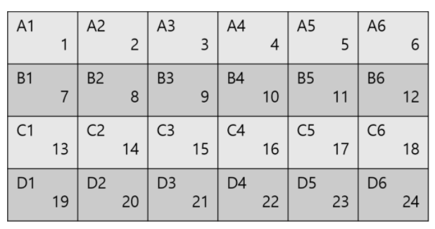




> Question



* Print number of L4 seat, -1 if not exist

```txt
Input:
2
13 5
10 9

Output: -1
```




```py
for _ in range(int(input())):
  n, m = map(int, input().split())
  if m < 4 or n < 12:
  print(-1 if m < 4 or n < 12 else 11 * m + 4)
```



